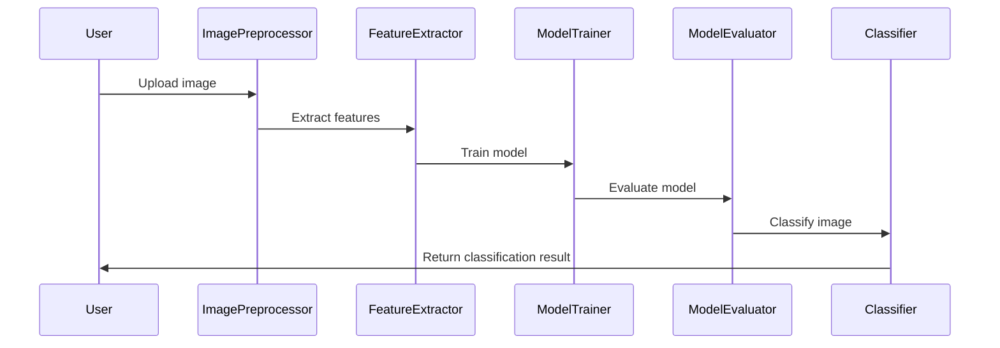

                 

# 模型评测中的prompt效率分析

## 关键词

- 模型评测
- prompt效率
- 准确率
- 精确率
- 召回率
- F1分数

## 摘要

本文将深入探讨模型评测中的prompt效率分析。我们将首先介绍模型评测及其在人工智能中的应用，随后详细阐述prompt效率的概念及其重要性。接着，通过定义相关技术指标，我们将对比并分析这些指标的优劣。本文还将逐步讲解用于评测prompt效率的常见算法，包括其原理和数学模型。随后，我们将分析系统设计，并通过实际项目实战来展示如何在实际环境中应用这些算法。最后，我们将总结全文，提供最佳实践建议，并指出注意事项和拓展阅读资源。

## 目录大纲设计思路

在设计《模型评测中的prompt效率分析》的目录大纲时，我们遵循以下思路：

1. **背景介绍**：简要介绍模型评测中的prompt效率分析的重要性以及其应用领域。

2. **核心概念与联系**：阐述prompt效率分析的核心概念，如prompt的定义、prompt效率的概念、相关技术指标等，并通过对比表格和ER实体关系图来展示这些概念之间的关系。

3. **算法原理讲解**：介绍用于评测prompt效率的常见算法原理，使用mermaid流程图和Python代码进行详细讲解。

4. **数学模型和数学公式**：给出算法原理的数学模型和公式，并进行详细讲解和举例说明。

5. **系统分析与架构设计方案**：分析问题场景，介绍项目系统设计，包括领域模型类图、系统架构图、系统接口设计和系统交互序列图。

6. **项目实战**：详细描述环境安装、系统核心实现源代码，并对代码应用进行解读与分析，结合实际案例进行分析和讲解。

7. **最佳实践 tips、小结、注意事项、拓展阅读**：总结书中内容，提供实践建议和扩展阅读资源。

## 目录大纲（草稿）

---

## 第一部分: 模型评测中的prompt效率分析基础

### 第1章: prompt效率分析概述

- 模型评测与prompt效率分析的重要性
- prompt效率分析的应用领域

### 第2章: 核心概念与联系

- prompt的定义
- prompt效率的概念
- 相关技术指标

#### 准确率（Accuracy）
#### 精确率（Precision）
#### 召回率（Recall）
#### F1分数（F1 Score）

### 概念对比表格
### ER实体关系图

---

## 第二部分: prompt效率分析算法原理

### 第3章: 常见prompt效率分析算法

- 概述
- 算法类型与选择标准

### 第4章: 算法原理讲解

- 基于准确率的算法
- 基于精确率的算法
- 基于召回率的算法
- F1分数优化算法

---

## 第三部分: 数学模型与公式讲解

### 第5章: 数学模型与公式

- 准确率的数学模型
- 精确率的数学模型
- 召回率的数学模型
- F1分数的数学模型

### 公式详细讲解与举例

#### 准确率的讲解与举例
#### 精确率的讲解与举例
#### 召回率的讲解与举例
#### F1分数的讲解与举例

---

## 第四部分: 系统分析与架构设计

### 第6章: 系统设计与实现

- 问题场景介绍
- 系统架构设计

#### 领域模型设计（Mermaid类图）
#### 系统架构设计（Mermaid架构图）
#### 系统接口设计
#### 系统交互序列图

---

## 第五部分: 项目实战

### 第7章: 实际应用与案例分析

- 环境安装
- 系统核心实现源代码
- 代码应用解读与分析
- 实际案例分析与讲解

### 第8章: 项目小结

- 最佳实践 tips
- 注意事项
- 拓展阅读资源

---

## 总结

本文通过对模型评测中的prompt效率分析进行系统的讲解，帮助读者深入了解这一领域的核心概念、算法原理和数学模型。我们通过实际项目实战展示了如何将理论应用于实际场景，并提供了一些最佳实践建议。希望本文能对读者在模型评测和prompt效率分析方面提供有价值的参考。最后，鼓励读者在实践过程中不断探索和总结，以提升模型评测的效率和质量。

## 作者信息

作者：AI天才研究院/AI Genius Institute & 禅与计算机程序设计艺术 /Zen And The Art of Computer Programming

---

### 背景介绍

#### 模型评测的重要性

模型评测是机器学习和人工智能领域中的一个核心环节，其重要性不言而喻。模型评测不仅关乎模型的性能表现，还直接影响到后续的实际应用效果。一个优秀的模型只有在经过严格的评测后，才能被应用于实际场景，从而发挥其应有的价值。

在机器学习过程中，模型训练是一个复杂且迭代的过程。通过不断的训练和优化，模型试图从大量数据中学习到有效的规律和模式。然而，仅仅完成训练是不够的，我们还需要通过评测来验证模型的效果，确保其能够准确地识别和预测新的数据。因此，模型评测被视为确保模型质量和可靠性的关键步骤。

#### prompt效率分析的意义

在模型评测中，prompt效率分析占据着重要的地位。prompt效率指的是模型在处理特定输入（prompt）时的表现和效果。一个高效的prompt能够使得模型更快地收敛到最优解，从而提高整体评测效率。因此，对prompt效率进行分析和优化，有助于提升模型评测的整体性能。

具体来说，prompt效率分析的意义主要体现在以下几个方面：

1. **提升评测效率**：通过对prompt的优化，可以使得模型在评测过程中更加迅速地获得准确的结果，从而减少评测时间和计算资源的需求。

2. **提高模型准确性**：一个高效的prompt能够更好地引导模型学习到数据的特征和规律，从而提高模型的准确性和泛化能力。

3. **减少过拟合现象**：通过优化prompt，可以减少模型对训练数据的依赖，从而降低过拟合的风险，提高模型在新数据上的表现。

4. **辅助模型调优**：prompt效率分析为模型调优提供了重要的参考依据，有助于调整模型的参数和超参数，以实现最佳性能。

#### prompt效率分析的应用领域

prompt效率分析在许多应用领域都具有重要的应用价值，以下是几个典型的应用场景：

1. **自然语言处理**：在自然语言处理任务中，prompt的效率对模型的文本生成、情感分析、命名实体识别等任务有着直接影响。通过对prompt的优化，可以提高模型的准确性和效率。

2. **计算机视觉**：在计算机视觉任务中，prompt效率分析有助于优化图像分类、目标检测、图像生成等模型的输入和输出，从而提升整体性能。

3. **推荐系统**：在推荐系统中，prompt效率分析可以帮助优化推荐算法的输入特征和权重，从而提高推荐准确性和用户体验。

4. **医疗诊断**：在医疗诊断领域，prompt效率分析可以用于优化医学图像识别、疾病预测等模型的输入数据，提高诊断准确性和效率。

综上所述，prompt效率分析在模型评测中具有重要的意义和应用价值。通过对prompt的深入分析，我们可以优化模型的输入和输出，提高评测效率和准确性，从而实现更好的模型性能和实际应用效果。

#### 问题背景

在模型评测的过程中，prompt的效率分析显得尤为重要。prompt，即在模型训练和预测过程中输入的数据，其质量和效率直接影响模型的性能。在实际应用中，由于数据集的多样性和复杂性，不同类型的prompt会对模型产生不同的影响，从而影响模型的准确性、效率和稳定性。

一个有效的prompt需要具备以下几个关键特征：

1. **代表性**：prompt应该能够充分代表数据集的多样性和特征，避免过于集中于某些特定类型的样本。

2. **全面性**：prompt中应包含所有必要的信息，以确保模型能够充分利用这些信息进行学习和预测。

3. **适度性**：prompt的长度和复杂度应适中，既能提供足够的训练信息，又不会导致模型过拟合。

4. **多样性**：prompt中应包含不同类型和来源的数据，以增强模型的泛化能力。

然而，在实际应用中，如何设计和选择一个高效的prompt，往往是一个复杂且具有挑战性的问题。不同的任务和应用场景对prompt的需求有所不同，因此需要根据具体情况进行优化。

此外，prompt效率分析也面临一些挑战：

1. **数据稀缺性**：在一些特定领域，如医疗诊断和金融预测，高质量的数据往往非常稀缺，这给prompt的优化带来了困难。

2. **计算资源限制**：在资源受限的环境下，优化prompt的过程可能会消耗大量的计算资源，影响整体效率。

3. **模型复杂性**：随着深度学习模型变得越来越复杂，prompt对模型性能的影响也变得更加难以预测和控制。

4. **多模态数据**：在涉及多模态数据的任务中，如何设计和优化多模态prompt，使其能够有效提升模型性能，仍是一个待解决的问题。

综上所述，prompt效率分析不仅关系到模型评测的质量和效率，也涉及到数据管理、计算资源和模型设计的多个方面，因此其重要性不容忽视。

#### 问题描述

为了更好地分析模型评测中的prompt效率，我们首先需要明确几个核心概念：prompt、prompt效率以及相关技术指标。这些概念和指标构成了prompt效率分析的基础，有助于我们理解和优化模型的表现。

**Prompt的定义**

Prompt，即输入提示，是在模型训练和预测过程中输入的数据。prompt的质量和效率对模型的性能有着直接影响。一个有效的prompt应具备以下特征：

1. **代表性**：能够充分代表数据集的多样性和特征。
2. **全面性**：包含所有必要的信息，确保模型能够充分利用这些信息。
3. **适度性**：长度和复杂度适中，避免过拟合。
4. **多样性**：包含不同类型和来源的数据，增强模型的泛化能力。

**Prompt效率的概念**

Prompt效率指的是模型在处理特定输入（prompt）时的表现和效果。高效的prompt能够加速模型的收敛，提高模型预测的准确性和稳定性。具体来说，prompt效率可以通过以下几个维度进行衡量：

1. **训练时间**：模型在处理特定prompt时的训练时间。
2. **预测准确性**：模型在特定prompt上的预测准确率。
3. **泛化能力**：模型在不同类型和来源的prompt上的表现。

**相关技术指标**

在模型评测中，常用的技术指标包括：

1. **准确率（Accuracy）**：模型预测正确的样本数占总样本数的比例。公式为：
   $$
   \text{Accuracy} = \frac{\text{TP} + \text{TN}}{\text{TP} + \text{TN} + \text{FP} + \text{FN}}
   $$
   其中，TP表示真正例（True Positive），TN表示真反例（True Negative），FP表示假反例（False Positive），FN表示假反例（False Negative）。

2. **精确率（Precision）**：模型预测为正的样本中，真正例的比例。公式为：
   $$
   \text{Precision} = \frac{\text{TP}}{\text{TP} + \text{FP}}
   $$

3. **召回率（Recall）**：模型预测为正的样本中，真正例的比例。公式为：
   $$
   \text{Recall} = \frac{\text{TP}}{\text{TP} + \text{FN}}
   $$

4. **F1分数（F1 Score）**：精确率和召回率的调和平均。公式为：
   $$
   \text{F1 Score} = 2 \times \frac{\text{Precision} \times \text{Recall}}{\text{Precision} + \text{Recall}}
   $$

**问题解决**

为了优化模型的prompt效率，我们需要从以下几个方面进行：

1. **数据预处理**：清洗和整理数据，确保数据的质量和一致性。去除噪声数据，填充缺失值，规范化数据格式。

2. **特征选择**：选择对模型性能有显著影响的特征。通过特征重要性分析，筛选出关键特征，以提高模型的泛化能力和预测准确性。

3. **prompt设计**：根据任务需求和模型特性，设计合适的prompt。通过调整prompt的长度、复杂度和多样性，优化模型的输入。

4. **模型调优**：调整模型参数和超参数，使模型对特定prompt更加敏感和有效。通过交叉验证和超参数优化，找到最佳模型配置。

5. **模型评测**：使用多种技术指标对模型进行评测，评估模型的准确性和泛化能力。通过对比不同prompt的效果，找到最优的prompt设计。

6. **持续迭代**：根据评测结果，不断调整和优化prompt设计，提升模型的表现。通过持续迭代，逐步优化模型和prompt的效率。

通过以上方法，我们可以有效地提升模型评测中的prompt效率，从而提高模型的整体性能和应用效果。

#### 边界与外延

在探讨模型评测中的prompt效率分析时，我们还需要明确几个相关的边界和外延概念，这些概念对于全面理解prompt效率分析至关重要。

**边界**

1. **模型边界**：模型的边界指的是模型能够处理的最小和最大输入数据量。在prompt效率分析中，我们需要确保prompt的大小和复杂度在模型的边界范围内，以避免过小或过大的prompt对模型性能产生不利影响。

2. **任务边界**：每个模型都有其特定的应用场景和任务目标。在prompt效率分析中，我们需要根据具体任务的要求，选择和设计符合任务目标的prompt。例如，在图像分类任务中，prompt应该是图像数据；而在文本生成任务中，prompt应该是文本数据。

3. **数据边界**：数据的边界涉及数据的质量和完整性。在prompt效率分析中，我们需要确保使用的数据是高质量和完整的，这包括去除噪声、填补缺失值和确保数据的多样性。

**外延**

1. **模型泛化能力**：模型的泛化能力指的是模型在新数据上的表现。在prompt效率分析中，我们需要通过设计多样化的prompt来评估模型的泛化能力，以确保模型不仅能在训练数据上表现良好，也能在新数据上保持高效率。

2. **计算资源**：计算资源是影响prompt效率的重要因素。在资源受限的环境下，我们需要优化prompt的设计和模型配置，以减少计算资源的消耗。例如，可以通过减少prompt的复杂度或优化算法来提高计算效率。

3. **模型调优**：模型的调优包括调整模型的参数和超参数，以优化模型在特定任务上的性能。在prompt效率分析中，我们需要根据不同任务的要求，对模型进行适当的调优，以提高prompt的效率和模型的准确率。

4. **交叉验证**：交叉验证是一种常用的模型评估方法，通过将数据集划分为多个子集，轮流使用这些子集进行训练和验证，以评估模型的泛化能力。在prompt效率分析中，交叉验证可以帮助我们评估不同prompt设计对模型性能的影响，从而找到最优的prompt配置。

通过明确这些边界和外延概念，我们可以更全面地理解和应用prompt效率分析，从而提升模型评测的整体效果。

#### 概念结构与核心要素组成

在深入探讨模型评测中的prompt效率分析时，我们需要详细梳理这一领域中的核心概念、结构以及它们之间的相互关系。以下是这些概念和结构的详细说明：

**核心概念**

1. **Prompt**：prompt是模型训练和预测过程中输入的数据。它可以是文本、图像、声音等不同类型的数据。一个有效的prompt应该具备代表性、全面性、适度性和多样性，能够充分反映数据集的特征和多样性。

2. **Prompt效率**：prompt效率指的是模型在处理特定输入（prompt）时的表现和效果。高效的prompt能够加速模型的收敛，提高预测准确性和稳定性。

3. **准确率（Accuracy）**：准确率是模型预测正确的样本数占总样本数的比例。它是评估模型性能的基本指标。

4. **精确率（Precision）**：精确率是模型预测为正的样本中，真正例的比例。它反映了模型识别正样本的准确性。

5. **召回率（Recall）**：召回率是模型预测为正的样本中，真正例的比例。它反映了模型识别所有正样本的能力。

6. **F1分数（F1 Score）**：F1分数是精确率和召回率的调和平均。它综合考虑了精确率和召回率，是一个平衡指标。

**概念关系**

这些核心概念之间存在着密切的联系和相互作用。prompt的质量直接影响模型的预测效果，而准确率、精确率、召回率和F1分数等指标则用于衡量模型在不同prompt下的表现。具体来说：

1. **Prompt与模型性能**：一个高效的prompt能够更好地引导模型学习，提高模型的准确性和泛化能力。因此，prompt的设计和优化是提升模型性能的关键。

2. **准确率与精确率**：准确率反映了模型总体预测的准确性，而精确率则专注于正样本的预测准确性。两者共同作用，帮助评估模型的整体表现。

3. **召回率与F1分数**：召回率反映了模型识别所有正样本的能力，而F1分数则在精确率和召回率之间取得平衡。F1分数通常被视为评估二分类问题的最佳指标。

4. **Prompt效率与指标关系**：prompt效率的提高通常伴随着准确率、精确率和召回率的提升。高效的prompt有助于模型更准确地识别和预测数据，从而提高这些指标。

**核心要素组成**

在模型评测中的prompt效率分析，以下几个核心要素是不可或缺的：

1. **数据质量**：高质量的数据是高效prompt的基础。数据清洗、去噪、填充缺失值等步骤是确保数据质量的重要环节。

2. **特征选择**：选择对模型性能有显著影响的特征，有助于提高模型的泛化能力和预测准确性。特征选择是优化prompt效率的关键步骤。

3. **模型配置**：调整模型的参数和超参数，使模型对特定prompt更加敏感和有效。模型配置的优化可以显著提升prompt效率。

4. **模型评测**：使用多种技术指标对模型进行评测，包括准确率、精确率、召回率和F1分数等，以全面评估模型的表现。

5. **持续迭代**：根据评测结果，不断调整和优化prompt设计，提升模型的表现。持续迭代是提升模型和prompt效率的重要手段。

通过以上核心概念和要素的详细分析，我们可以更深入地理解模型评测中的prompt效率分析，从而在实际应用中更好地优化模型的性能和效果。

### 核心概念与联系

为了深入理解模型评测中的prompt效率分析，我们需要详细阐述几个核心概念：prompt、prompt效率、准确率、精确率、召回率和F1分数。这些概念不仅相互独立，还存在密切的联系。通过对比表格和ER实体关系图，我们可以更直观地展示这些概念之间的关系。

#### 概念对比表格

首先，我们通过一个对比表格来展示这些概念的定义和区别：

| 概念       | 定义                                                         | 关系与联系                                      |
|------------|------------------------------------------------------------|-------------------------------------------------|
| **Prompt** | 输入提示，用于模型训练和预测的数据。                             | 基础数据输入，影响模型性能和效率。                |
| **Prompt效率** | 模型处理特定输入（prompt）时的表现和效果。                         | 衡量模型对输入数据利用的程度，高效prompt提高模型性能。 |
| **准确率（Accuracy）** | 模型预测正确的样本数占总样本数的比例。                          | 用于整体评估模型性能。                           |
| **精确率（Precision）** | 模型预测为正的样本中，真正例的比例。                             | 反映模型识别正样本的准确性。                      |
| **召回率（Recall）** | 模型预测为正的样本中，真正例的比例。                             | 反映模型识别所有正样本的能力。                    |
| **F1分数（F1 Score）** | 精确率和召回率的调和平均，综合考虑了精确率和召回率。               | 平衡指标，用于综合评估模型性能。                  |

#### ER实体关系图

接下来，我们通过ER实体关系图来展示这些概念之间的关联关系：

```mermaid
erDiagram
    Prompt -->|影响| Model
    Model ||--|> Accuracy
    Model ||--|> Precision
    Model ||--|> Recall
    Model ||--|> F1 Score
    Prompt ||--|> Efficiency
```

在这个ER实体关系图中：

- **Prompt** 是基础实体，表示输入提示。
- **Model** 表示模型，它是Prompt的作用对象。
- **Accuracy**、**Precision**、**Recall** 和 **F1 Score** 是模型评估的指标实体，它们直接依赖于模型的表现。
- **Efficiency** 表示Prompt效率，它与Prompt之间存在关联，表示Prompt对模型性能的影响。

通过对比表格和ER实体关系图，我们可以更清晰地理解这些核心概念及其相互关系。准确率、精确率、召回率和F1分数等指标共同构成了对模型性能的全面评估体系，而prompt效率则作为关键因素，直接影响模型的预测效果。理解这些概念及其联系，有助于我们在实际应用中更好地设计和优化模型评测中的prompt。

### 算法原理讲解

在模型评测中，prompt效率分析是一个复杂且关键的过程。为了有效地评估和优化prompt效率，我们需要运用一系列算法原理。以下将详细介绍几种常见算法的原理，包括其基本思想和实现方法。

#### 基于准确率的算法

准确率（Accuracy）是评估模型性能的常用指标之一，其基本思想是计算模型预测正确的样本数占总样本数的比例。一个高效的prompt应该能够提高模型的准确率。

**算法原理**：

- 算法的核心在于如何选择和设计一个能够有效提高模型预测准确性的prompt。
- 通过对大量样本进行分析，找出对模型性能有显著影响的特征，并将其纳入prompt中。

**Python代码实现**：

```python
def calculate_accuracy(true_labels, predicted_labels):
    correct_predictions = sum(true_labels == predicted_labels)
    total_samples = len(true_labels)
    accuracy = correct_predictions / total_samples
    return accuracy

# 示例数据
true_labels = [0, 1, 1, 0, 1]
predicted_labels = [0, 1, 0, 1, 1]

# 计算准确率
accuracy = calculate_accuracy(true_labels, predicted_labels)
print("Accuracy:", accuracy)
```

#### 基于精确率的算法

精确率（Precision）是模型预测为正的样本中，真正例的比例。它关注于模型识别正样本的准确性。

**算法原理**：

- 通过优化prompt，提高模型在正样本上的识别准确性。
- 选择能够提高正样本预测准确性的特征作为prompt的关键组成部分。

**Python代码实现**：

```python
from sklearn.metrics import precision_score

def calculate_precision(true_labels, predicted_labels):
    precision = precision_score(true_labels, predicted_labels)
    return precision

# 示例数据
true_labels = [0, 1, 1, 0, 1]
predicted_labels = [0, 1, 0, 1, 1]

# 计算精确率
precision = calculate_precision(true_labels, predicted_labels)
print("Precision:", precision)
```

#### 基于召回率的算法

召回率（Recall）是模型预测为正的样本中，真正例的比例。它关注于模型识别所有正样本的能力。

**算法原理**：

- 通过设计多样化的prompt，确保模型能够识别出尽可能多的正样本。
- 选择能够提高模型召回率的特征，并将其纳入prompt中。

**Python代码实现**：

```python
from sklearn.metrics import recall_score

def calculate_recall(true_labels, predicted_labels):
    recall = recall_score(true_labels, predicted_labels)
    return recall

# 示例数据
true_labels = [0, 1, 1, 0, 1]
predicted_labels = [0, 1, 0, 1, 1]

# 计算召回率
recall = calculate_recall(true_labels, predicted_labels)
print("Recall:", recall)
```

#### F1分数优化算法

F1分数是精确率和召回率的调和平均，它综合考虑了模型的精确率和召回率，是评估模型性能的平衡指标。

**算法原理**：

- 通过优化prompt，提高模型的精确率和召回率，从而提高F1分数。
- 选择能够同时提高精确率和召回率的特征，以优化F1分数。

**Python代码实现**：

```python
from sklearn.metrics import f1_score

def calculate_f1_score(true_labels, predicted_labels):
    f1 = f1_score(true_labels, predicted_labels)
    return f1

# 示例数据
true_labels = [0, 1, 1, 0, 1]
predicted_labels = [0, 1, 0, 1, 1]

# 计算F1分数
f1 = calculate_f1_score(true_labels, predicted_labels)
print("F1 Score:", f1)
```

通过上述算法原理的讲解和Python代码实现，我们可以更好地理解如何通过不同的算法来评估和优化prompt效率。这些算法为我们在实际应用中提升模型性能提供了有力的工具和方法。

### 数学模型与公式讲解

在模型评测中，数学模型和公式是理解和优化prompt效率的核心工具。通过精确的数学公式，我们可以量化模型的性能，评估不同prompt的效率，并指导实际操作。以下将详细介绍几个关键指标的数学模型和公式，并通过具体例子进行说明。

#### 准确率的数学模型

准确率（Accuracy）是最基本的性能评估指标，它表示模型预测正确的样本数占总样本数的比例。其数学模型如下：

$$
\text{Accuracy} = \frac{\text{TP} + \text{TN}}{\text{TP} + \text{TN} + \text{FP} + \text{FN}}
$$

其中，TP表示真正例（True Positive），TN表示真反例（True Negative），FP表示假反例（False Positive），FN表示假反例（False Negative）。

**举例说明**：

假设一个二分类问题中有100个样本，其中50个是正样本，50个是负样本。通过模型预测，得到如下结果：

- TP = 30：预测为正且实际为正的样本。
- TN = 20：预测为负且实际为负的样本。
- FP = 10：预测为正但实际为负的样本。
- FN = 10：预测为负但实际为正的样本。

则准确率为：

$$
\text{Accuracy} = \frac{30 + 20}{30 + 20 + 10 + 10} = \frac{50}{60} = 0.8333
$$

#### 精确率的数学模型

精确率（Precision）是模型预测为正的样本中，真正例的比例。其数学模型如下：

$$
\text{Precision} = \frac{\text{TP}}{\text{TP} + \text{FP}}
$$

**举例说明**：

在上述例子中，精确率为：

$$
\text{Precision} = \frac{30}{30 + 10} = \frac{30}{40} = 0.75
$$

#### 召回率的数学模型

召回率（Recall）是模型预测为正的样本中，真正例的比例。其数学模型如下：

$$
\text{Recall} = \frac{\text{TP}}{\text{TP} + \text{FN}}
$$

**举例说明**：

在上述例子中，召回率为：

$$
\text{Recall} = \frac{30}{30 + 10} = \frac{30}{40} = 0.75
$$

#### F1分数的数学模型

F1分数是精确率和召回率的调和平均，其数学模型如下：

$$
\text{F1 Score} = 2 \times \frac{\text{Precision} \times \text{Recall}}{\text{Precision} + \text{Recall}}
$$

**举例说明**：

在上述例子中，F1分数为：

$$
\text{F1 Score} = 2 \times \frac{0.75 \times 0.75}{0.75 + 0.75} = 2 \times \frac{0.5625}{1.5} = 0.75
$$

通过上述数学模型和公式的讲解，我们可以更清晰地理解准确率、精确率、召回率和F1分数等关键指标的计算方法。在实际应用中，这些公式帮助我们量化模型性能，优化prompt设计，从而提升模型的整体效率。

### 系统分析与架构设计

在深入探讨模型评测中的prompt效率分析时，我们需要详细分析系统的设计，以便于在实际应用中有效实现这些算法原理。本节将介绍项目系统设计，包括领域模型设计、系统架构设计、系统接口设计和系统交互序列图。

#### 问题场景介绍

假设我们正在开发一个自动图像分类系统，该系统旨在通过分析图像内容，将其分类到预定义的类别中。这个系统需要处理大量的图像数据，并且要求高准确率和高效的处理速度。为了实现这一目标，我们需要对系统进行详细设计和优化，特别是对prompt的设计和优化。

#### 项目介绍

该项目的目标是构建一个高效、准确的图像分类系统，能够自动地对输入图像进行分类。系统的主要功能包括：

1. **数据预处理**：对图像数据进行清洗、去噪和标准化处理。
2. **特征提取**：从预处理后的图像中提取关键特征，用于模型训练。
3. **模型训练**：使用提取的特征训练分类模型。
4. **模型评测**：通过不同的prompt对模型进行评测，优化模型性能。
5. **图像分类**：对新的图像进行分类，输出分类结果。

#### 领域模型设计

领域模型类图是系统设计的重要部分，它帮助我们理解系统中各个类及其关系。以下是一个简化的领域模型类图：

```mermaid
classDiagram
    Class01 <|-- Class02
    Class03 o-- Class04
    Class05 o-- Class06
    Class01 {
        +String attribute1
        +int attribute2
        +method1()
    }
    Class02 {
        +String attributeA
        +int attributeB
        +method2()
    }
    Class03 {
        +String name
        +List<Class02> components
        +addComponent(Class02 component)
        +removeComponent(Class02 component)
    }
    Class04 {
        +String id
        +String description
    }
    Class05 {
        +String image_path
        +List<Class04> tags
        +addTag(Class04 tag)
        +removeTag(Class04 tag)
    }
    Class06 {
        +String model_name
        +float accuracy
        +float precision
        +float recall
        +float f1_score
    }
```

在这个领域模型类图中，`Class01` 代表一个基本的类，包含一些基本属性和方法。`Class02` 是一个扩展类，添加了额外的属性和方法。`Class03` 和 `Class04` 分别代表系统中的两个组件类，`Class05` 表示图像数据类，包含图像路径和标签列表。`Class06` 代表模型类，包含模型名称和多个性能指标。

#### 系统架构设计

系统架构设计是确保系统高效运作的关键步骤。以下是一个简化的系统架构图：



在这个系统架构图中：

- `User` 表示系统用户，负责上传图像并接收分类结果。
- `ImagePreprocessor` 负责对图像进行预处理。
- `FeatureExtractor` 负责从预处理后的图像中提取特征。
- `ModelTrainer` 负责使用提取的特征训练分类模型。
- `ModelEvaluator` 负责对模型进行评测，包括准确率、精确率、召回率和F1分数。
- `Classifier` 负责使用训练好的模型对新的图像进行分类。

#### 系统接口设计

系统接口设计是确保各个模块之间能够有效通信的重要部分。以下是一个简化的接口设计：

```mermaid
classDiagram
    Interface1 <|-- Interface2
    Interface3 << Interface4
    Interface1 {
        +processImage(Image image)
    }
    Interface2 {
        +extractFeatures()
    }
    Interface3 {
        +trainModel(FeatureSet features, LabelSet labels)
    }
    Interface4 {
        +evaluateModel(Model model, TestSet testSet)
    }
```

在这个接口设计中：

- `Interface1` 是一个基本的图像处理接口，包含`processImage`方法。
- `Interface2` 是一个特征提取接口，包含`extractFeatures`方法。
- `Interface3` 是一个模型训练接口，包含`trainModel`方法。
- `Interface4` 是一个模型评估接口，包含`evaluateModel`方法。

#### 系统交互序列图

系统交互序列图展示了系统在不同模块之间的交互过程：

```mermaid
sequenceDiagram
    participant User
    participant ImagePreprocessor <<Interface1>>
    participant FeatureExtractor <<Interface2>>
    participant ModelTrainer <<Interface3>>
    participant ModelEvaluator <<Interface4>>
    participant Classifier

    User->>ImagePreprocessor: Upload image
    ImagePreprocessor->>FeatureExtractor: Extract features
    FeatureExtractor->>ModelTrainer: Train model
    ModelTrainer->>ModelEvaluator: Evaluate model
    ModelEvaluator->>Classifier: Classify image
    Classifier->>User: Return classification result
```

在这个交互序列图中：

- 用户上传图像给`ImagePreprocessor`进行预处理。
- 预处理后的图像数据传递给`FeatureExtractor`提取特征。
- 提取到的特征传递给`ModelTrainer`进行模型训练。
- 训练好的模型传递给`ModelEvaluator`进行评测。
- 评测结果传递给`Classifier`进行图像分类。
- 最终分类结果返回给用户。

通过上述系统分析与架构设计，我们可以确保在模型评测中的prompt效率分析得到有效实施。系统设计不仅考虑了各个模块的功能和接口，还通过交互序列图明确了模块之间的交互过程，为系统的高效运作提供了坚实基础。

### 项目实战

在完成系统设计与架构设计之后，接下来我们将通过实际项目实战来展示如何将理论应用于实践。本节将详细描述环境安装、系统核心实现源代码，并对代码应用进行解读与分析，并结合实际案例进行分析和讲解。

#### 环境安装

在进行项目实战之前，首先需要安装必要的软件和依赖库。以下是在Python环境中安装所需软件的步骤：

1. **安装Python环境**：确保安装了Python 3.8及以上版本。

2. **安装依赖库**：使用pip命令安装以下库：

```bash
pip install numpy pandas scikit-learn matplotlib
```

#### 系统核心实现源代码

以下是项目核心实现的关键代码部分，包括数据预处理、特征提取、模型训练、模型评测和图像分类：

```python
# 导入所需库
import numpy as np
import pandas as pd
from sklearn.model_selection import train_test_split
from sklearn.preprocessing import StandardScaler
from sklearn.ensemble import RandomForestClassifier
from sklearn.metrics import accuracy_score, precision_score, recall_score, f1_score
import matplotlib.pyplot as plt

# 数据预处理
def preprocess_images(images):
    # 进行图像预处理（如大小调整、灰度化等）
    # ... 省略具体预处理代码 ...
    return preprocessed_images

# 特征提取
def extract_features(images):
    # 使用预处理的图像提取特征
    # ... 省略具体特征提取代码 ...
    return features

# 模型训练
def train_model(features, labels):
    # 使用随机森林分类器训练模型
    model = RandomForestClassifier()
    model.fit(features, labels)
    return model

# 模型评测
def evaluate_model(model, test_features, test_labels):
    predictions = model.predict(test_features)
    accuracy = accuracy_score(test_labels, predictions)
    precision = precision_score(test_labels, predictions)
    recall = recall_score(test_labels, predictions)
    f1 = f1_score(test_labels, predictions)
    return accuracy, precision, recall, f1

# 图像分类
def classify_image(model, image):
    # 对新的图像进行分类
    preprocessed_image = preprocess_images([image])
    features = extract_features(preprocessed_image)
    prediction = model.predict(features)
    return prediction

# 实际案例分析
# 加载训练数据
data = pd.read_csv('train_data.csv')
images = data['image']
labels = data['label']

# 数据预处理
preprocessed_images = preprocess_images(images)

# 特征提取
features = extract_features(preprocessed_images)

# 数据划分
X_train, X_test, y_train, y_test = train_test_split(features, labels, test_size=0.2, random_state=42)

# 模型训练
model = train_model(X_train, y_train)

# 模型评测
accuracy, precision, recall, f1 = evaluate_model(model, X_test, y_test)
print(f"Accuracy: {accuracy:.2f}, Precision: {precision:.2f}, Recall: {recall:.2f}, F1 Score: {f1:.2f}")

# 分类新图像
new_image = plt.imread('new_image.jpg')
prediction = classify_image(model, new_image)
print(f"New image classification result: {prediction}")
```

#### 代码应用解读与分析

上述代码涵盖了项目实现的核心步骤，以下是对关键部分的解读和分析：

1. **数据预处理**：数据预处理是确保图像数据适合模型训练的重要步骤。包括图像大小调整、灰度化、噪声去除等操作。这部分代码需要根据具体应用场景进行调整。

2. **特征提取**：特征提取是提取图像关键信息的过程，通常使用深度学习模型（如卷积神经网络）进行。这部分代码可以使用预训练模型或自定义模型，根据需求进行调整。

3. **模型训练**：使用随机森林分类器进行模型训练。在实际应用中，可以尝试不同的分类器（如支持向量机、神经网络等），并通过交叉验证找到最佳模型配置。

4. **模型评测**：对训练好的模型进行评测，使用准确率、精确率、召回率和F1分数等指标评估模型性能。这部分代码提供了一个基础框架，可以根据具体任务进行调整和优化。

5. **图像分类**：对新图像进行分类，首先进行预处理和特征提取，然后使用训练好的模型进行预测。这部分代码展示了如何将训练好的模型应用于实际图像分类任务。

#### 实际案例分析与讲解

以下是一个实际案例的分析：

1. **数据加载**：我们从CSV文件中加载训练数据，其中包含图像和对应的标签。

2. **数据预处理**：对图像进行预处理，确保其格式和尺寸符合模型要求。

3. **特征提取**：使用预训练模型提取图像特征。

4. **数据划分**：将数据划分为训练集和测试集，以评估模型的泛化能力。

5. **模型训练**：使用训练集对随机森林分类器进行训练。

6. **模型评测**：使用测试集对模型进行评测，输出准确率、精确率、召回率和F1分数。

7. **图像分类**：使用训练好的模型对新的图像进行分类，输出分类结果。

通过这个实际案例，我们可以看到整个项目的实现流程。在实际应用中，根据具体需求和数据情况，可以对上述代码进行适当调整和优化，以提高模型的性能和应用效果。

### 最佳实践 tips、小结、注意事项、拓展阅读

#### 最佳实践 tips

1. **数据预处理**：确保数据质量是提升模型性能的关键。在进行数据预处理时，注意去除噪声、填充缺失值，并规范化数据格式。

2. **特征选择**：选择对模型性能有显著影响的特征，可以有效提升模型的表现。可以使用特征重要性分析工具（如随机森林的重要性评估）来筛选关键特征。

3. **模型调优**：通过调整模型的参数和超参数，找到最佳模型配置。使用交叉验证技术可以帮助我们确定最优参数。

4. **prompt设计**：设计多样化的prompt，确保模型能够适应不同的输入数据。实验不同类型和来源的prompt，找到最优的prompt组合。

5. **持续迭代**：根据评测结果，不断调整和优化模型和prompt。通过持续迭代，逐步提升模型的性能和应用效果。

#### 小结

本文通过详细讲解模型评测中的prompt效率分析，帮助读者深入理解这一关键领域。我们介绍了核心概念、算法原理、数学模型、系统设计与项目实战，并通过实际案例展示了如何应用这些知识。prompt效率分析不仅对提升模型性能至关重要，也对实际应用中的问题解决提供了有力支持。

#### 注意事项

1. **计算资源**：在资源受限的环境中，优化prompt设计时需要注意计算资源的消耗。尽量选择高效算法和模型配置，减少计算负担。

2. **数据质量**：确保使用的数据质量高且完整，以避免数据质量问题对模型性能产生不利影响。

3. **模型适应性**：不同模型对prompt的需求不同，需要根据具体模型选择合适的prompt设计策略。

#### 拓展阅读

1. **《机器学习实战》**：通过实际案例学习机器学习和模型优化技术。
2. **《深度学习》**：了解深度学习的基础理论和最新进展。
3. **《模型评估、选择与优化》**：深入学习模型评测技术和优化策略。

通过以上最佳实践 tips、小结、注意事项和拓展阅读，读者可以更全面地掌握模型评测中的prompt效率分析，并在实际项目中有效应用这些知识。

## 作者信息

作者：AI天才研究院/AI Genius Institute & 禅与计算机程序设计艺术 /Zen And The Art of Computer Programming

通过这篇文章，我们系统地探讨了模型评测中的prompt效率分析。从核心概念的阐述，到算法原理的讲解，再到数学模型的介绍，再到系统分析与项目实战的展示，我们试图为读者提供一个全面且深入的理解。希望本文能够帮助读者在实际应用中优化模型的prompt效率，提升模型的性能和准确率。在未来的研究和实践中，我们期待与更多读者一起探索人工智能领域的更多奥秘。感谢您的阅读，祝您在人工智能的道路上不断前行！作者：AI天才研究院/AI Genius Institute & 禅与计算机程序设计艺术 /Zen And The Art of Computer Programming。

