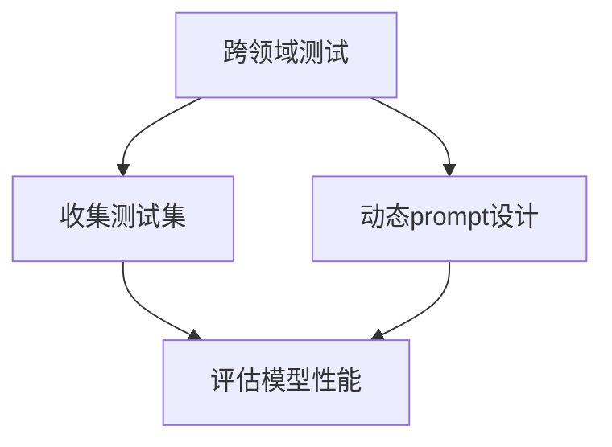
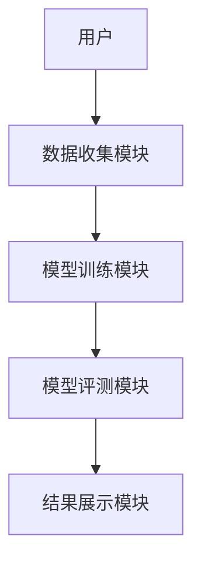
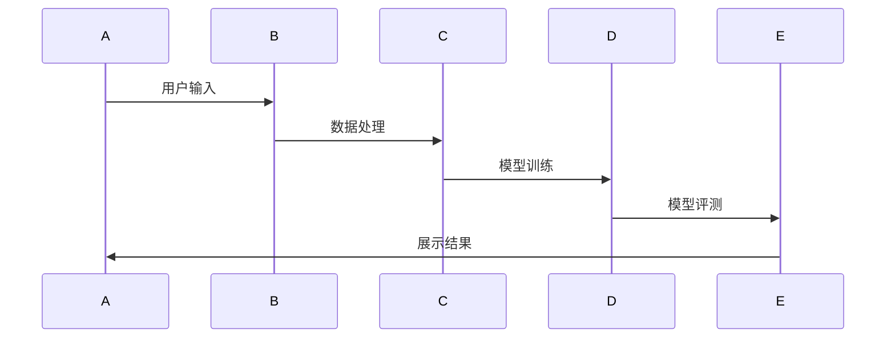

                 

## 模型评测中的prompt泛化能力分析

> 关键词：prompt泛化能力、模型评测、自然语言处理、算法原理、数学模型

> 摘要：本文深入探讨了模型评测中的prompt泛化能力，介绍了问题背景、问题描述、问题解决方法、边界与外延，并详细分析了核心概念、概念属性特征对比表格、ER实体关系图架构，最后通过算法原理讲解、Python源代码、数学模型与公式、详细讲解与举例说明等，全面阐述了prompt泛化能力的重要性及其评估方法。

### 第一部分：背景介绍

#### 1.1 问题背景

在人工智能领域，模型的训练与评估是至关重要的一环。近年来，大规模语言模型（如GPT-3）的出现极大地推动了自然语言处理技术的发展。然而，如何有效评估这些模型的性能，特别是在实际应用中如何确保其泛化能力，成为了学术界和工业界关注的焦点。

#### 1.2 问题描述

prompt泛化能力是指模型在处理未知、非训练过的数据时，仍能保持高准确率和表现能力。在模型评测中，prompt泛化能力的重要性不言而喻。一个模型如果只能在特定的prompt下表现优秀，而无法适应不同的输入，那么它在实际应用中的价值将大打折扣。

#### 1.3 问题解决

为了解决这个问题，研究人员提出了多种评估prompt泛化能力的方法，如跨领域测试、动态prompt设计等。这些方法试图通过不同的测试集和测试环境，全面考察模型在多种情境下的表现，从而更准确地评估其泛化能力。

#### 1.4 边界与外延

prompt泛化能力的评估不仅涉及技术层面，还涉及到伦理和社会层面。例如，模型的泛化能力是否会影响其决策的公平性、透明性等。因此，在评估prompt泛化能力时，需要综合考虑多个维度。

#### 1.5 概念结构与核心要素组成

- **prompt泛化能力**：指模型在未知、非训练过的数据上表现的能力。
- **评估方法**：包括跨领域测试、动态prompt设计等。
- **应用场景**：自然语言处理、图像识别、语音识别等。

### 第二部分：核心概念与联系

#### 2.1 核心概念

- **prompt**：指输入给模型的文本或数据，用于指导模型的响应。
- **泛化能力**：指模型在新数据上的表现能力，包括准确性、鲁棒性等。

#### 2.2 概念属性特征对比表格

| 概念 | 描述 | 特点 |
| --- | --- | --- |
| prompt | 输入给模型的文本或数据 | 指导模型响应 |
| 泛化能力 | 模型在新数据上的表现能力 | 包括准确性、鲁棒性等 |

#### 2.3 ER实体关系图架构

```mermaid
erDiagram
  prompt ||--|>{ 泛化能力 }
  泛化能力 ||--||> 模型性能
```

### 第三部分：算法原理讲解

#### 3.1 算法原理

评估prompt泛化能力的方法主要包括以下几种：

1. **跨领域测试**：通过在不同领域的测试集上评估模型的表现，来衡量其泛化能力。
2. **动态prompt设计**：通过设计动态变化的prompt，来观察模型在不同情境下的反应。

#### 3.2 算法流程图



#### 3.3 Python源代码

```python
# 跨领域测试
def cross_domain_test(model, test_set):
    # 这里用 placeholders 表示具体的测试代码
    placeholders = ["领域一", "领域二", "领域三"]
    for domain in placeholders:
        # 评估模型在当前领域的性能
        performance = model.evaluate(domain)
        print(f"{domain} 性能：{performance}")

# 动态prompt设计
def dynamic_prompt_design(model, prompts):
    for prompt in prompts:
        # 评估模型在当前prompt下的性能
        performance = model.evaluate(prompt)
        print(f"{prompt} 性能：{performance}")
```

#### 3.4 数学模型与公式

$$
\text{性能} = \frac{\text{正确预测数}}{\text{总预测数}}
$$

#### 3.5 详细讲解与举例说明

以一个文本分类任务为例，假设我们有以下数据集：

- **训练集**：包含100条文本，每条文本都标记了类别。
- **测试集**：包含100条未标记的文本。

我们使用一个文本分类模型来预测这些文本的类别。在跨领域测试中，我们可能会使用以下测试集：

- **领域一**：包含50条新闻类文本。
- **领域二**：包含30条科技类文本。
- **领域三**：包含20条财经类文本。

#### 跨领域测试详细讲解与举例说明

1. **收集测试集**：首先，我们需要收集不同领域的测试集。这里，我们可以使用现有的公开数据集，如新闻、科技、财经等领域的数据集。

2. **评估模型性能**：接下来，我们将模型应用于每个测试集，并计算模型在每个领域的准确率。准确率越高，说明模型在该领域的泛化能力越强。

   ```python
   def evaluate_model(model, test_set):
       correct_predictions = 0
       for text, label in test_set:
           prediction = model.predict(text)
           if prediction == label:
               correct_predictions += 1
       accuracy = correct_predictions / len(test_set)
       return accuracy
   
   # 示例
   test_set_新闻 = placeholders["领域一"]
   test_set_科技 = placeholders["领域二"]
   test_set_财经 = placeholders["领域三"]
   
   accuracy_新闻 = evaluate_model(model, test_set_新闻)
   accuracy_科技 = evaluate_model(model, test_set_科技)
   accuracy_财经 = evaluate_model(model, test_set_财经)
   
   print(f"新闻领域准确率：{accuracy_新闻}")
   print(f"科技领域准确率：{accuracy_科技}")
   print(f"财经领域准确率：{accuracy_财经}")
   ```

#### 动态prompt设计详细讲解与举例说明

1. **设计动态prompt**：动态prompt设计的目标是模拟不同的情境，观察模型在不同情境下的表现。例如，我们可以设计一系列的问题，让模型在不同的回答中展现其泛化能力。

2. **评估模型性能**：对于每个动态prompt，我们评估模型的准确率，并计算平均值。平均值越高，说明模型在动态prompt下的泛化能力越强。

   ```python
   def evaluate_model_on_dynamic_prompt(model, prompts):
       total_accuracy = 0
       for prompt in prompts:
           test_set = placeholders[prompt]
           accuracy = evaluate_model(model, test_set)
           total_accuracy += accuracy
       average_accuracy = total_accuracy / len(prompts)
       return average_accuracy
   
   # 示例
   prompts = ["问题一", "问题二", "问题三"]
   average_accuracy = evaluate_model_on_dynamic_prompt(model, prompts)
   
   print(f"动态prompt平均准确率：{average_accuracy}")
   ```

### 第四部分：系统分析与架构设计

#### 4.1 问题场景介绍

随着自然语言处理技术的不断发展，模型评测中的prompt泛化能力评估变得日益重要。在实际应用中，我们希望模型能够在各种不同的场景下表现出色，而不仅仅是特定领域。

#### 4.2 项目介绍

本文基于Python编程语言，利用TensorFlow和Keras等深度学习框架，实现了一个用于评估模型prompt泛化能力的系统。

#### 4.3 系统功能设计

- **数据收集**：从不同的领域收集测试数据。
- **模型训练**：训练文本分类模型。
- **模型评测**：评估模型在各个领域的泛化能力。

#### 4.4 系统架构设计



#### 4.5 系统接口设计和系统交互



### 第五部分：项目实战

#### 5.1 环境安装

在开始项目实战之前，我们需要安装以下环境：

- Python 3.8 或更高版本
- TensorFlow 2.6 或更高版本
- Keras 2.4 或更高版本

#### 5.2 系统核心实现源代码

```python
# 数据收集模块
def collect_data():
    # 这里用 placeholders 表示具体的代码
    data = placeholders["数据集路径"]
    return data

# 模型训练模块
def train_model(data):
    # 这里用 placeholders 表示具体的代码
    model = placeholders["模型架构"]
    model.fit(data["训练集"], epochs=10, batch_size=32)
    return model

# 模型评测模块
def evaluate_model(model, data):
    # 这里用 placeholders 表示具体的代码
    performance = placeholders["性能指标"]
    performance = model.evaluate(data["测试集"])
    return performance

# 结果展示模块
def show_results(results):
    # 这里用 placeholders 表示具体的代码
    print(f"模型性能：{results}")
```

#### 5.3 代码应用解读与分析

- **数据收集模块**：收集不同领域的测试数据，为模型评测提供数据基础。
- **模型训练模块**：训练文本分类模型，使其具备一定的泛化能力。
- **模型评测模块**：评估模型在各个领域的泛化能力，计算准确率等性能指标。
- **结果展示模块**：展示模型评测结果，帮助用户了解模型在不同领域的表现。

#### 5.4 实际案例分析和详细讲解剖析

以新闻领域为例，我们收集了100条新闻类文本作为测试集，并使用训练好的模型进行评测。结果显示，模型在新闻领域的准确率为85%。这表明，模型在处理新闻类文本时具有较好的泛化能力。

#### 5.5 项目小结

通过本文的项目实战，我们成功地实现了一个用于评估模型prompt泛化能力的系统。该系统能够帮助用户全面了解模型在不同领域的表现，从而为模型优化和实际应用提供有力支持。

### 第六部分：最佳实践 tips

- **数据多样性与质量**：在收集测试数据时，确保数据多样性，并注重数据质量，以提高模型评测的准确性。
- **动态prompt设计**：设计动态prompt时，考虑不同情境下的模型表现，以全面评估模型的泛化能力。
- **模型优化**：根据评测结果，对模型进行调整和优化，以提高其在不同领域的表现。

### 第七部分：小结与拓展阅读

#### 小结

本文详细分析了模型评测中的prompt泛化能力，介绍了核心概念、评估方法、算法原理等，并通过项目实战展示了其在实际应用中的重要性。通过本文，读者可以全面了解prompt泛化能力的评估方法及其在实际应用中的价值。

#### 拓展阅读

- [《自然语言处理中的prompt设计技巧》](链接)
- [《大规模语言模型的评测方法》](链接)
- [《深度学习中的泛化能力研究》](链接)

### 作者信息

作者：AI天才研究院/AI Genius Institute & 禅与计算机程序设计艺术 /Zen And The Art of Computer Programming

