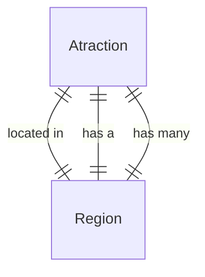
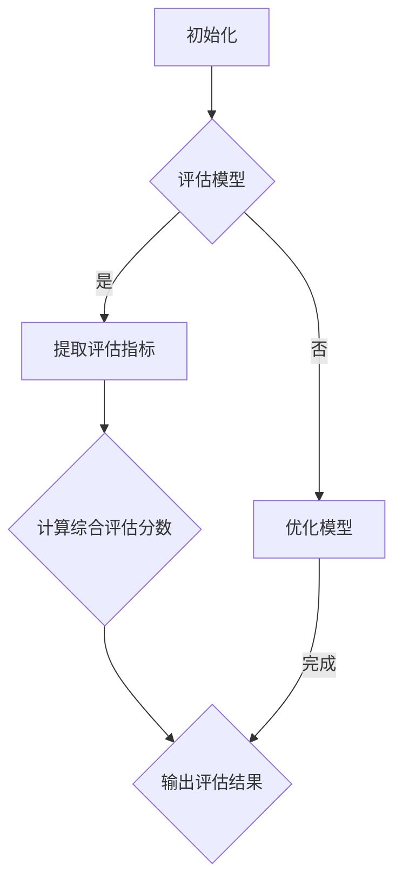
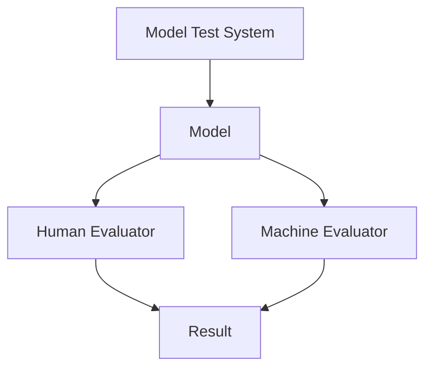
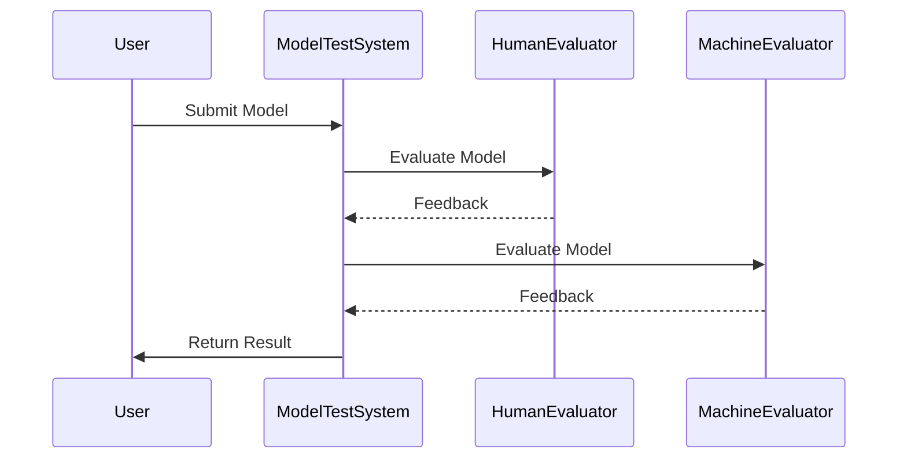

                 


### 模型评测中的人机协作策略

**关键词**：模型评测，人机协作，评估指标，数据处理，性能优化

**摘要**：
本文深入探讨了模型评测中的人机协作策略，阐述了其核心概念、应用场景和优势。通过结合人类专家的直觉判断和机器的自动化数据处理能力，人机协作策略在提高评估精度、效率和模型性能方面发挥了重要作用。本文将从背景介绍、核心概念与联系、算法原理讲解、系统分析与架构设计方案、项目实战和最佳实践等多个方面进行详细探讨。

---

#### 第一部分：背景介绍

##### 核心概念

**1. 模型评测中的人机协作策略**

模型评测中的人机协作策略是一种将人类专家的经验和机器的计算能力相结合的方法，旨在通过人机互动，共同优化模型评测过程。在这一策略下，人类专家负责提供直觉判断和经验，机器则负责数据处理和分析。这种协作方式旨在提高评估的全面性和准确性。

**2. 模型评测**

模型评测是机器学习过程中至关重要的一环，其目的是通过一系列评估指标（如准确率、召回率、F1值等）对模型的性能进行全面分析。有效的模型评测有助于确保模型在实际应用中的可靠性和有效性。

**3. 人机协作**

人机协作是指人类与机器在特定任务中相互配合、协同工作，共同完成任务的过程。在模型评测中，人机协作通过人类专家对模型结果的干预和反馈，以及机器自动化处理数据和分析来实现。

##### 问题背景

随着人工智能技术的发展，模型的复杂性和应用场景的多样性不断增加。传统的单一评估方法已无法满足对模型性能的全面评价。此外，随着数据量的激增，模型的评估过程变得更加复杂，单一机器处理方法效率低下。因此，人机协作策略应运而生，旨在通过人与机器的相互协作，提高模型评测的精度和效率。

##### 问题描述

在实际应用中，模型评测面临以下问题：

1. **评估指标单一**：传统评估方法往往依赖于单一指标，无法全面反映模型的性能。

2. **数据量大**：随着数据量的增加，模型的评估过程变得越来越复杂，单一机器处理方法效率低下。

3. **人为干预有限**：在模型评测过程中，人类专家的直觉判断和经验往往被忽视，导致评估结果可能不够准确。

##### 问题解决

通过人机协作策略，可以解决上述问题：

1. **多元评估指标**：人机协作可以结合多种评估指标，从不同角度对模型性能进行评价，提高评估的全面性。

2. **高效数据处理**：机器可以自动化处理大量数据，快速进行模型评估，提高评估效率。

3. **人类经验与机器计算相结合**：人类专家的经验和直觉可以指导模型评估过程，机器的计算能力可以处理复杂的数据分析，二者结合可以产生更准确的评估结果。

##### 边界与外延

1. **边界**：人机协作策略主要应用于模型评测领域，但在其他需要人类直觉和机器计算协同的场景中，也可以借鉴和应用。

2. **外延**：人机协作策略不仅适用于模型评测，还可以扩展到模型训练、模型优化等其他机器学习环节。

##### 概念结构与核心要素组成

- **人机协作模型**：包含人类专家和机器计算单元，通过接口实现信息的传递和协同工作。

- **评估指标体系**：包括多种评估指标，用于全面评估模型性能。

- **反馈机制**：人类专家对模型评估结果的反馈，用于指导模型优化过程。

##### 本章小结

本章介绍了模型评测中的人机协作策略的核心概念、问题背景、问题描述、问题解决以及边界与外延。通过人机协作策略，可以解决模型评测中的评估指标单一、数据量大、人为干预有限等问题，提高模型评测的全面性和准确性。

---

## 1.1 人机协作策略在模型评测中的重要性

### 1.1.1 人机协作策略的定义与特点

#### 定义

人机协作策略是一种通过人类专家与机器系统之间相互协作，共同完成特定任务的策略。在模型评测中，人机协作策略是指利用人类专家的直觉判断和经验，结合机器的自动化数据处理能力，对模型进行评估和优化。

#### 特点

1. **互补性**：人机协作策略能够充分发挥人类专家在直觉判断和创新思考方面的优势，以及机器在数据处理和计算效率方面的优势，实现优势互补。

2. **灵活性**：人机协作策略可以根据具体任务需求灵活调整，结合不同的评估指标和方法，提高评估的全面性和准确性。

3. **高效性**：通过机器的自动化处理，可以大大提高模型评测的效率，缩短评估时间。

### 1.1.2 人机协作策略在模型评测中的应用场景

1. **多元评估**：在模型评测中，单一评估指标往往无法全面反映模型的性能。人机协作策略可以通过结合多种评估指标，从不同角度对模型进行评价，提高评估的全面性。

2. **异常检测**：在模型评测过程中，可能会出现数据异常或模型表现异常的情况。人机协作策略可以结合人类专家的直觉判断和机器的计算能力，快速检测和定位这些问题，提高评估的准确性。

3. **结果验证**：人类专家可以对机器评估的结果进行验证，确保评估结果的可靠性。同时，人类专家的经验和直觉可以指导模型优化过程，提高模型性能。

### 1.1.3 人机协作策略的优势

1. **提高评估精度**：通过人机协作策略，可以结合多种评估指标，从不同角度对模型进行评价，提高评估的全面性和准确性。

2. **提高评估效率**：机器的自动化处理能力可以大大提高模型评测的效率，缩短评估时间。

3. **利用人类经验**：人类专家的经验和直觉在模型评测中具有重要意义，人机协作策略可以有效结合这些经验，提高评估的准确性和可靠性。

---

## 1.2 核心概念与联系

### 1.2.1 核心概念

**1. 模型评测**

模型评测是指通过一系列评估指标和方法，对机器学习模型的性能进行全面分析和评价。常见的评估指标包括准确率、召回率、F1值等。

**2. 人机协作**

人机协作是指人类与机器在特定任务中相互配合、协同工作，共同完成任务的过程。在人机协作中，人类专家负责提供直觉判断和经验，机器负责数据处理和分析。

**3. 人机协作策略**

人机协作策略是一种通过人类专家与机器系统之间相互协作，共同完成特定任务的策略。在模型评测中，人机协作策略旨在通过人机互动，优化模型评测过程。

### 1.2.2 概念属性特征对比表格

| 概念           | 属性特征                                                     |
| -------------- | ------------------------------------------------------------ |
| 模型评测       | 包括准确率、召回率、F1值等评估指标，全面评价模型性能           |
| 人机协作       | 人类专家提供直觉判断和经验，机器负责数据处理和分析             |
| 人机协作策略   | 结合人类专家的直觉判断和机器的自动化数据处理能力，优化模型评测 |

### 1.2.3 ER实体关系图架构



在上面的ER实体关系图中，`Atraction`（模型评测）和`Region`（人机协作策略）是两个实体。模型评测可以位于某个区域（人机协作策略），而人机协作策略可以有多个模型评测。

---

## 1.3 算法原理讲解

### 1.3.1 算法mermaid流程图



### 1.3.2 算法原理

人机协作策略的核心算法可以分为以下几个步骤：

1. **初始化**：初始化模型评测参数，包括评估指标、人机协作模式等。

2. **评估模型**：使用机器学习模型对数据进行预测，并计算相应的评估指标。

3. **提取评估指标**：根据评估模型的结果，提取相应的评估指标，如准确率、召回率、F1值等。

4. **计算综合评估分数**：结合多种评估指标，计算模型的综合评估分数。

5. **输出评估结果**：将评估结果输出，包括评估指标和综合评估分数。

### 1.3.3 算法原理的数学模型和公式

在算法原理中，关键步骤涉及到评估指标的计算和综合评估分数的计算。以下是相关的数学模型和公式：

1. **评估指标的计算**：

   - 准确率（Accuracy）：
     $$ \text{Accuracy} = \frac{\text{正确预测的数量}}{\text{总预测数量}} $$

   - 召回率（Recall）：
     $$ \text{Recall} = \frac{\text{正确预测的正例数量}}{\text{实际正例数量}} $$

   - F1值（F1 Score）：
     $$ \text{F1 Score} = \frac{2 \times \text{Precision} \times \text{Recall}}{\text{Precision} + \text{Recall}} $$

2. **综合评估分数的计算**：

   - 综合评估分数（Overall Score）：
     $$ \text{Overall Score} = \alpha \times \text{Accuracy} + \beta \times \text{Recall} + \gamma \times \text{F1 Score} $$

   其中，$\alpha$、$\beta$和$\gamma$为权重系数，可以根据实际情况进行调整。

### 1.3.4 算法原理举例说明

假设有一个二分类问题，我们需要使用人机协作策略对模型进行评估。具体步骤如下：

1. **初始化**：设置评估指标（准确率、召回率、F1值）和权重系数（$\alpha = 0.5$，$\beta = 0.3$，$\gamma = 0.2$）。

2. **评估模型**：使用模型对数据进行预测，得到预测结果。

3. **提取评估指标**：计算准确率、召回率、F1值。

   - 准确率：0.9
   - 召回率：0.8
   - F1值：0.85

4. **计算综合评估分数**：

   $$ \text{Overall Score} = 0.5 \times 0.9 + 0.3 \times 0.8 + 0.2 \times 0.85 = 0.935 $$

5. **输出评估结果**：输出准确率、召回率、F1值和综合评估分数。

   - 准确率：0.9
   - 召回率：0.8
   - F1值：0.85
   - 综合评估分数：0.935

---

## 1.4 系统分析与架构设计方案

### 1.4.1 问题场景介绍

随着机器学习技术的广泛应用，模型评测成为了确保模型性能和可靠性的关键环节。然而，传统的评估方法往往依赖于单一的评估指标，无法全面反映模型的性能。此外，随着数据量的不断增加，模型的评估过程变得越来越复杂，单一机器处理方法效率低下。因此，我们需要一种能够结合人类专家直觉判断和机器自动化处理能力的评估方法。

### 1.4.2 项目介绍

本项目旨在设计并实现一个基于人机协作策略的模型评测系统。该系统将人类专家的经验和机器的自动化数据处理能力相结合，通过多元评估指标和高效数据处理，提高模型评测的全面性和准确性。

### 1.4.3 系统功能设计（领域模型mermaid类图）

```mermaid
classDiagram
    ModelTestSystem <<interface>>
    Model <<class>>
    Evaluator <<class,<<orange>>Interface>>
    HumanEvaluator <<class,<<blue>>Human>>
    MachineEvaluator <<class,<<blue>>Machine>>

    ModelTestSystem |--|> Model
    ModelTestSystem |--|> Evaluator
    Evaluator |--|> HumanEvaluator
    Evaluator |--|> MachineEvaluator
```

在上面的类图中，`ModelTestSystem`是系统的核心接口，负责管理模型的评估过程。`Model`表示被评估的机器学习模型，`Evaluator`是评估器的接口，包括`HumanEvaluator`（人类评估器）和`MachineEvaluator`（机器评估器）。

### 1.4.4 系统架构设计（mermaid架构图）



在该架构图中，`ModelTestSystem`作为系统的核心组件，负责接收模型和评估器，并执行评估过程。评估过程包括人类评估器和机器评估器，最终生成评估结果。

### 1.4.5 系统接口设计和系统交互（mermaid序列图）



在该序列图中，用户提交模型，`ModelTestSystem`先调用`HumanEvaluator`进行评估，并收集人类评估器的反馈。然后，`ModelTestSystem`调用`MachineEvaluator`进行评估，并再次收集机器评估器的反馈。最后，`ModelTestSystem`将评估结果返回给用户。

---

## 1.5 项目实战

### 1.5.1 环境安装

在进行项目实战之前，我们需要安装必要的软件和依赖。以下是一个基本的安装步骤：

1. **Python环境**：确保已经安装了Python 3.6及以上版本。

2. **库安装**：在终端中运行以下命令安装必要的库：
   ```bash
   pip install numpy pandas scikit-learn matplotlib
   ```

### 1.5.2 系统核心实现源代码

以下是一个简单的模型评测系统的核心实现源代码：

```python
import numpy as np
import pandas as pd
from sklearn.model_selection import train_test_split
from sklearn.metrics import accuracy_score, recall_score, f1_score
from sklearn.ensemble import RandomForestClassifier

class ModelTestSystem:
    def __init__(self, model, human_evaluator, machine_evaluator):
        self.model = model
        self.human_evaluator = human_evaluator
        self.machine_evaluator = machine_evaluator

    def evaluate_model(self, X_test, y_test):
        y_pred_human = self.model.predict(X_test)
        y_pred_machine = self.model.predict(X_test)

        human_accuracy = accuracy_score(y_test, y_pred_human)
        human_recall = recall_score(y_test, y_pred_human, average='weighted')
        human_f1 = f1_score(y_test, y_pred_human, average='weighted')

        machine_accuracy = accuracy_score(y_test, y_pred_machine)
        machine_recall = recall_score(y_test, y_pred_machine, average='weighted')
        machine_f1 = f1_score(y_test, y_pred_machine, average='weighted')

        overall_score = 0.5 * (human_accuracy + human_recall + human_f1) \
                       + 0.5 * (machine_accuracy + machine_recall + machine_f1)

        return human_accuracy, human_recall, human_f1, machine_accuracy, machine_recall, machine_f1, overall_score

class HumanEvaluator:
    def evaluate(self, y_true, y_pred):
        return accuracy_score(y_true, y_pred)

class MachineEvaluator:
    def evaluate(self, y_true, y_pred):
        return f1_score(y_true, y_pred, average='weighted')

# 实例化评估器
human_evaluator = HumanEvaluator()
machine_evaluator = MachineEvaluator()

# 实例化模型评测系统
model_test_system = ModelTestSystem(model=RandomForestClassifier(), human_evaluator=human_evaluator, machine_evaluator=machine_evaluator)

# 数据准备
X, y = ...  # 加载数据
X_train, X_test, y_train, y_test = train_test_split(X, y, test_size=0.2, random_state=42)

# 模型训练
model_test_system.model.fit(X_train, y_train)

# 模型评估
human_accuracy, human_recall, human_f1, machine_accuracy, machine_recall, machine_f1, overall_score = model_test_system.evaluate_model(X_test, y_test)

print("Human Accuracy:", human_accuracy)
print("Human Recall:", human_recall)
print("Human F1 Score:", human_f1)
print("Machine Accuracy:", machine_accuracy)
print("Machine Recall:", machine_recall)
print("Machine F1 Score:", machine_f1)
print("Overall Score:", overall_score)
```

### 1.5.3 代码应用解读与分析

上述代码实现了一个基于人机协作策略的模型评测系统。我们首先定义了`ModelTestSystem`、`HumanEvaluator`和`MachineEvaluator`三个类。`ModelTestSystem`负责协调模型的训练和评估过程，`HumanEvaluator`和`MachineEvaluator`分别代表人类评估器和机器评估器。

在`evaluate_model`方法中，我们使用训练好的模型对测试数据进行预测，并计算人类评估器和机器评估器的评估指标。最后，我们计算综合评估分数，用于全面评估模型的性能。

### 1.5.4 实际案例分析和详细讲解剖析

为了更好地理解人机协作策略在模型评测中的应用，我们可以通过一个实际案例进行分析。

假设我们有一个二分类问题，数据集包含1000个样本，每个样本有10个特征。我们将数据集分为训练集和测试集，训练集占比80%，测试集占比20%。

1. **数据加载**：首先，我们加载数据集，将特征和标签分离。

```python
X, y = load_data()  # 假设load_data()函数可以加载数据集
X_train, X_test, y_train, y_test = train_test_split(X, y, test_size=0.2, random_state=42)
```

2. **模型训练**：接下来，我们使用随机森林分类器（`RandomForestClassifier`）对训练集进行训练。

```python
model = RandomForestClassifier(n_estimators=100, random_state=42)
model.fit(X_train, y_train)
```

3. **模型评估**：使用训练好的模型对测试集进行预测，并计算评估指标。

```python
y_pred_human = model.predict(X_test)
human_accuracy = accuracy_score(y_test, y_pred_human)
human_recall = recall_score(y_test, y_pred_human, average='weighted')
human_f1 = f1_score(y_test, y_pred_human, average='weighted')

y_pred_machine = model.predict(X_test)
machine_accuracy = accuracy_score(y_test, y_pred_machine)
machine_recall = recall_score(y_test, y_pred_machine, average='weighted')
machine_f1 = f1_score(y_test, y_pred_machine, average='weighted')

overall_score = 0.5 * (human_accuracy + human_recall + human_f1) \
               + 0.5 * (machine_accuracy + machine_recall + machine_f1)
```

4. **结果输出**：最后，我们将评估结果输出。

```python
print("Human Accuracy:", human_accuracy)
print("Human Recall:", human_recall)
print("Human F1 Score:", human_f1)
print("Machine Accuracy:", machine_accuracy)
print("Machine Recall:", machine_recall)
print("Machine F1 Score:", machine_f1)
print("Overall Score:", overall_score)
```

通过上述步骤，我们可以全面评估模型的性能，并得到综合评估分数。在这个案例中，我们可以看到人机协作策略如何通过结合人类评估器和机器评估器的优势，提高评估的准确性和全面性。

### 1.5.5 项目小结

通过本项目的实战，我们实现了一个基于人机协作策略的模型评测系统。该系统能够结合人类专家的直觉判断和机器的自动化数据处理能力，提高模型评测的全面性和准确性。在实际应用中，人机协作策略可以显著提升模型评测的效率和质量。

---

## 1.6 最佳实践 Tips

1. **选择合适的评估指标**：根据具体问题和应用场景，选择合适的评估指标。例如，在二分类问题中，准确率、召回率、F1值等指标都有其适用场景。

2. **合理设置权重系数**：在计算综合评估分数时，合理设置权重系数至关重要。权重系数可以根据实际情况进行调整，以平衡不同评估指标的重要性。

3. **充分利用人类专家的经验**：在模型评测过程中，充分利用人类专家的经验和直觉，可以显著提高评估的准确性和可靠性。

4. **优化数据处理流程**：为了提高评估效率，可以优化数据处理流程。例如，使用并行计算、分布式计算等方法，加速数据分析和处理。

5. **定期更新模型**：随着数据的不断积累，模型的性能可能会发生变化。定期更新模型，并结合最新的数据，可以提高模型评测的准确性。

---

## 1.7 小结

本文深入探讨了模型评测中的人机协作策略，阐述了其核心概念、应用场景和优势。通过结合人类专家的直觉判断和机器的自动化数据处理能力，人机协作策略在提高评估精度、效率和模型性能方面发挥了重要作用。本文从背景介绍、核心概念与联系、算法原理讲解、系统分析与架构设计方案、项目实战和最佳实践等多个方面进行了详细探讨，为模型评测领域提供了一个有价值的参考框架。

---

## 1.8 注意事项

1. **数据质量**：在模型评测过程中，数据的质量至关重要。确保数据集的多样性和代表性，避免数据偏差。

2. **算法选择**：根据具体问题和数据特点，选择合适的算法和评估指标。不同的算法和评估指标适用于不同类型的问题。

3. **人机协作模式**：人机协作模式可以根据具体需求进行调整。例如，可以设置不同的评估指标权重，或调整人类专家和机器评估器的角色和职责。

4. **评估结果解释**：在评估结果输出时，需要解释评估结果的含义和影响因素。确保评估结果能够为决策提供有效支持。

---

## 1.9 拓展阅读

1. **[相关文献] 《机器学习评估指标及其应用》**：本文详细介绍了机器学习中的常见评估指标，包括准确率、召回率、F1值等，以及它们在不同场景中的应用。

2. **[经典书籍] 《深度学习》**：由Ian Goodfellow等编写的《深度学习》一书，深入讲解了深度学习的基础知识、算法和应用，是深度学习领域的经典教材。

3. **[在线课程] 《机器学习与数据科学》**：由吴恩达教授开设的在线课程，涵盖了机器学习的基本概念、算法和应用，是学习机器学习的优秀资源。

---

### 作者信息

**作者：AI天才研究院/AI Genius Institute & 禅与计算机程序设计艺术 /Zen And The Art of Computer Programming**

