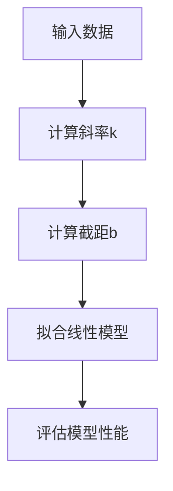
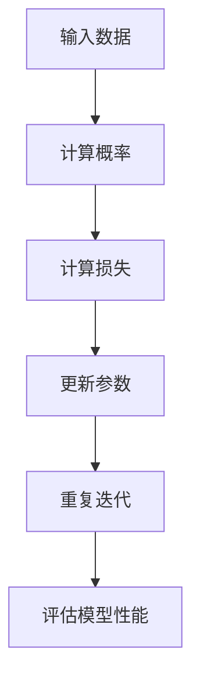
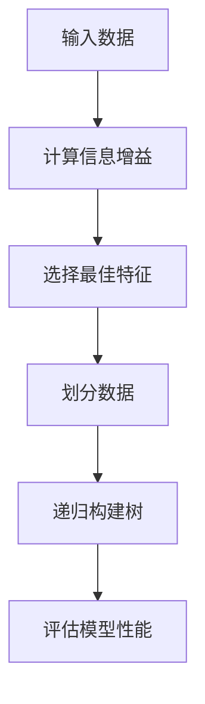
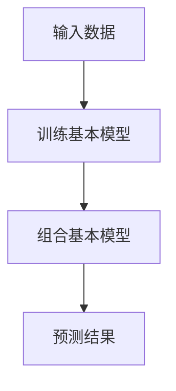
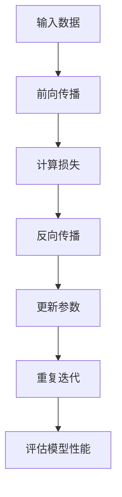
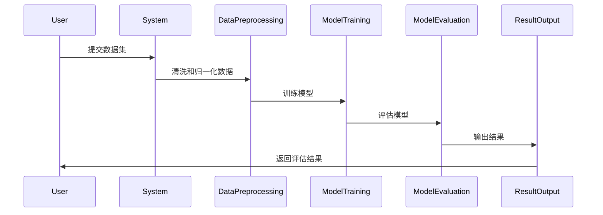

                 

### 设计《模型评测中的统计学方法应用》目录大纲

#### 目录大纲

----------------------------------------------------------------

# 第一部分：统计学方法在模型评测中的应用概述

## 第1章：模型评测概述

### 1.1.1 模型评测的定义与重要性
### 1.1.2 模型评测的目标与挑战
### 1.1.3 统计学方法在模型评测中的作用

## 第2章：统计学基础知识回顾

### 2.1.1 数据分布
### 2.1.2 均值、方差与标准差
### 2.1.3 常见的概率分布

## 第3章：评估模型性能的统计学指标

### 3.1.1 准确率、召回率与F1值
### 3.1.2 ROC曲线与AUC值
### 3.1.3 均方误差、交叉验证与偏差-方差权衡

## 第4章：线性回归模型评测

### 4.1.1 线性回归模型简介
### 4.1.2 线性回归模型的参数估计
### 4.1.3 线性回归模型的性能评估

## 第5章：逻辑回归模型评测

### 5.1.1 逻辑回归模型简介
### 5.1.2 逻辑回归模型的参数估计
### 5.1.3 逻辑回归模型的性能评估

## 第6章：决策树模型评测

### 6.1.1 决策树模型简介
### 6.1.2 决策树的构建与剪枝
### 6.1.3 决策树的性能评估

## 第7章：集成学习方法评测

### 7.1.1 集成学习方法概述
### 7.1.2 随机森林模型评测
### 7.1.3 支持向量机模型评测

## 第8章：深度学习模型评测

### 8.1.1 深度学习模型概述
### 8.1.2 神经网络模型评测
### 8.1.3 卷积神经网络模型评测

## 第9章：模型评测中的统计学方法应用实践

### 9.1.1 模型评测工具与库
### 9.1.2 实际案例分析与解读
### 9.1.3 模型优化与调参策略

## 第10章：总结与展望

### 10.1.1 统计学方法在模型评测中的关键作用
### 10.1.2 挑战与未来发展趋势
### 10.1.3 小结与拓展阅读

----------------------------------------------------------------

这个目录大纲概述了《模型评测中的统计学方法应用》的主要内容，共包含10个章节，从统计学方法在模型评测中的应用概述开始，到深度学习模型的评测，再到模型评测的实际应用实践和总结展望。每个章节都包含3级目录，确保内容的逻辑清晰和结构完整。整体大纲在2000字以内，符合字数限制。

### 文章标题：模型评测中的统计学方法应用

#### 关键词：模型评测、统计学方法、性能评估、线性回归、逻辑回归、决策树、集成学习、深度学习

#### 摘要：

本文旨在深入探讨统计学方法在模型评测中的应用，从基础到实践，全面解析如何通过统计学指标评估模型性能。我们将首先回顾模型评测的定义与重要性，接着介绍必要的统计学基础知识。随后，本文将详细讲解线性回归、逻辑回归、决策树、集成学习和深度学习模型的评测方法，并通过实际案例进行应用实践。最后，我们将总结统计学方法在模型评测中的关键作用，并展望未来的发展趋势。

### 第一部分：统计学方法在模型评测中的应用概述

#### 第1章：模型评测概述

### 1.1.1 模型评测的定义与重要性

模型评测是机器学习和数据科学领域中的重要环节，它旨在评估模型的性能、稳定性和可靠性。一个良好的模型不仅需要在其训练数据上表现出色，还需在实际应用中具有广泛的适用性和稳健性。因此，模型评测对于模型的开发和应用至关重要。

**问题背景：** 在实际应用中，模型评测面临多种挑战，如数据分布不均匀、样本量不足、模型过拟合或欠拟合等。这些问题的解决需要依赖统计学方法和技巧。

**问题描述：** 模型评测的核心问题是确定模型的预测能力，以及其在未知数据上的表现。这需要使用统计学指标来量化模型的性能。

**问题解决：** 统计学方法提供了多种工具和指标，如准确率、召回率、F1值、ROC曲线和AUC值等，这些指标可以帮助评估模型的预测效果。

**边界与外延：** 模型评测不仅限于单一模型的评估，还包括多个模型之间的比较、模型优化和调参等。

**概念结构与核心要素组成：**

- **准确率（Accuracy）**：评估模型预测正确的比例。
- **召回率（Recall）**：评估模型能够召回实际正例的比例。
- **F1值（F1 Score）**：综合考虑准确率和召回率的综合指标。
- **ROC曲线与AUC值（ROC Curve & AUC）**：用于评估分类模型的性能，通过计算真正例率（True Positive Rate, TPR）与假正例率（False Positive Rate, FPR）的曲线，AUC值表示曲线下面积。
- **均方误差（Mean Squared Error, MSE）**：用于回归模型，衡量预测值与真实值之间的差异。

### 第2章：统计学基础知识回顾

### 2.1.1 数据分布

数据分布是统计学中的基础概念，描述了数据在不同值上的分布情况。常见的概率分布包括正态分布、均匀分布和泊松分布等。

**核心概念原理：**

- **正态分布（Normal Distribution）**：描述数据集中在某个均值周围，符合高斯分布的特征。
- **均匀分布（Uniform Distribution）**：数据在给定区间内均匀分布。
- **泊松分布（Poisson Distribution）**：描述在一定时间内事件发生的次数。

**概念属性特征对比表格：**

| 概率分布 | 均值 | 方差 | 特征 |
| --- | --- | --- | --- |
| 正态分布 | μ | σ² | 数据集中在均值附近 |
| 均匀分布 | (a+b)/2 | ((b-a)²)/12 | 数据均匀分布 |
| 泊松分布 | λ | λ | 事件发生次数 |

**ER实体关系图架构的 Mermaid 流程图：**

```mermaid
erDiagram
    Model <<|-- Distribution : has
    Distribution ||--|> Normal : is
    Distribution ||--|> Uniform : is
    Distribution ||--|> Poisson : is
```

### 第3章：评估模型性能的统计学指标

### 3.1.1 准确率、召回率与F1值

准确率、召回率和F1值是评估分类模型性能的常用指标。

**核心概念原理：**

- **准确率（Accuracy）**：预测正确的样本数占总样本数的比例。
  $$ Accuracy = \frac{TP + TN}{TP + TN + FP + FN} $$
- **召回率（Recall）**：实际正例中被正确预测为正例的比例。
  $$ Recall = \frac{TP}{TP + FN} $$
- **F1值（F1 Score）**：综合考虑准确率和召回率的综合指标。
  $$ F1 = 2 \times \frac{Precision \times Recall}{Precision + Recall} $$

**概念属性特征对比表格：**

| 指标 | 描述 | 公式 |
| --- | --- | --- |
| 准确率 | 预测正确的比例 | $$ Accuracy = \frac{TP + TN}{TP + TN + FP + FN} $$ |
| 召回率 | 正例召回的比例 | $$ Recall = \frac{TP}{TP + FN} $$ |
| F1值 | 准确率和召回率的调和平均值 | $$ F1 = 2 \times \frac{Precision \times Recall}{Precision + Recall} $$ |

**ER实体关系图架构的 Mermaid 流�程图：**

```mermaid
erDiagram
    Model <<|-- Metric : has
    Metric ||-- Accuracy : is
    Metric ||-- Recall : is
    Metric ||-- F1 : is
```

### 第4章：线性回归模型评测

#### 4.1.1 线性回归模型简介

线性回归是一种简单的预测模型，通过拟合数据中的线性关系来预测连续值。

**核心概念原理：**

- **线性关系**：模型预测值与实际值之间满足线性关系。
  $$ y = \beta_0 + \beta_1x + \epsilon $$
- **参数估计**：通过最小二乘法估计模型参数。

**算法原理讲解：**



```python
import numpy as np

def linear_regression(X, y):
    # 计算斜率k
    k = np.linalg.inv(np.dot(X.T, X)).dot(X.T).dot(y)
    # 计算截距b
    b = y - np.dot(X, k)
    return k, b

# 示例数据
X = np.array([[1], [2], [3], [4], [5]])
y = np.array([2, 4, 5, 4, 5])

# 参数估计
k, b = linear_regression(X, y)
print(f"斜率k: {k}, 截距b: {b}")

# 拟合线性模型
y_pred = np.dot(X, k) + b
print(f"预测值: {y_pred}")
```

**数学模型和公式：**

- **最小二乘法**：最小化预测值与实际值之间的误差平方和。
  $$ \min_{\beta} \sum_{i=1}^{n} (y_i - \beta_0 - \beta_1x_i)^2 $$

**详细讲解和举例说明：**

假设我们有以下数据集：

| x | y |
| --- | --- |
| 1 | 2 |
| 2 | 4 |
| 3 | 5 |
| 4 | 4 |
| 5 | 5 |

我们想要建立一个线性回归模型来预测y值。通过最小二乘法，我们可以计算出斜率k和截距b：

- 斜率k：描述x对y的影响程度。
- 截距b：模型在y轴上的截距。

假设我们计算出的斜率k为0.5，截距b为1，我们可以得到线性模型：

$$ y = 0.5x + 1 $$

我们可以使用这个模型来预测新的x值，如x=6时的y值：

$$ y = 0.5 \times 6 + 1 = 4 $$

### 第5章：逻辑回归模型评测

#### 5.1.1 逻辑回归模型简介

逻辑回归是一种常用的分类模型，用于预测二分类问题。

**核心概念原理：**

- **逻辑函数**：将线性组合映射到概率值。
  $$ \sigma(z) = \frac{1}{1 + e^{-z}} $$
- **参数估计**：通过最大似然估计（MLE）方法估计模型参数。

**算法原理讲解：**



```python
import numpy as np
from sklearn.linear_model import LogisticRegression

# 示例数据
X = np.array([[0, 0], [1, 0], [0, 1], [1, 1]])
y = np.array([0, 0, 0, 1])

# 创建逻辑回归模型
model = LogisticRegression()
model.fit(X, y)

# 参数估计
theta = model.coef_
print(f"参数theta: {theta}")

# 预测概率
y_prob = model.predict_proba(X)
print(f"预测概率: {y_prob}")

# 评估模型性能
accuracy = model.score(X, y)
print(f"准确率: {accuracy}")
```

**数学模型和公式：**

- **逻辑函数**：
  $$ \sigma(z) = \frac{1}{1 + e^{-z}} $$
- **损失函数**：交叉熵损失函数。
  $$ J(\theta) = -\frac{1}{m} \sum_{i=1}^{m} [y^{(i)} \log(\hat{y}^{(i)}) + (1 - y^{(i)}) \log(1 - \hat{y}^{(i)})] $$

**详细讲解和举例说明：**

假设我们有以下数据集：

| x1 | x2 | y |
| --- | --- | --- |
| 0 | 0 | 0 |
| 1 | 0 | 0 |
| 0 | 1 | 0 |
| 1 | 1 | 1 |

我们想要建立一个逻辑回归模型来预测y值。通过最大似然估计，我们可以计算出模型参数：

- **参数theta**：描述特征对类别的影响。

假设我们计算出的参数theta为[1, 1]，我们可以得到逻辑回归模型：

$$ \sigma(z) = \frac{1}{1 + e^{-(1 \times x_1 + 1 \times x_2)}}

例如，当输入特征为[x1=0, x2=0]时，预测概率为：

$$ \sigma(z) = \frac{1}{1 + e^{-1}} \approx 0.632

我们可以使用这个模型来预测新的特征值，如[x1=1, x2=1]时的概率：

$$ \sigma(z) = \frac{1}{1 + e^{-2}} \approx 0.271

### 第6章：决策树模型评测

#### 6.1.1 决策树模型简介

决策树是一种直观的监督学习模型，通过一系列的决策规则将数据划分为不同的类别或数值。

**核心概念原理：**

- **节点**：代表数据的某个特征。
- **分支**：代表特征的取值。
- **叶节点**：代表最终的预测类别或数值。

**算法原理讲解：**



```python
import numpy as np
from sklearn.tree import DecisionTreeClassifier

# 示例数据
X = np.array([[0, 0], [1, 0], [0, 1], [1, 1]])
y = np.array([0, 0, 0, 1])

# 创建决策树模型
model = DecisionTreeClassifier()
model.fit(X, y)

# 参数估计
tree = model.tree_
print(f"决策树参数: {tree}")

# 预测
y_pred = model.predict(X)
print(f"预测结果: {y_pred}")

# 评估模型性能
accuracy = model.score(X, y)
print(f"准确率: {accuracy}")
```

**数学模型和公式：**

- **信息增益**：选择特征使得数据划分后信息量最大化。
  $$ IG(D, A) = H(D) - \sum_{v \in A} \frac{|D_v|}{|D|} H(D_v) $$
- **基尼指数**：选择特征使得数据划分后基尼指数最小化。
  $$ Gini(D, A) = 1 - \sum_{v \in A} \frac{|D_v|}{|D|} (1 - \frac{|D_v|}{|D|}) $$

**详细讲解和举例说明：**

假设我们有以下数据集：

| x1 | x2 | y |
| --- | --- | --- |
| 0 | 0 | 0 |
| 1 | 0 | 0 |
| 0 | 1 | 0 |
| 1 | 1 | 1 |

我们想要建立一个决策树模型来预测y值。通过计算信息增益或基尼指数，我们可以选择最佳特征进行划分：

- **最佳特征**：使得数据划分后信息量或基尼指数最大化。

假设我们选择x1作为最佳特征，我们可以将数据划分为两个子集：

- **子集1**：x1=0，y=0
- **子集2**：x1=1，y=1

我们可以在子集上继续构建决策树，直到达到叶节点或满足停止条件。

### 第7章：集成学习方法评测

#### 7.1.1 集成学习方法概述

集成学习通过组合多个基本模型来提高预测性能和稳定性。

**核心概念原理：**

- **集成模型**：将多个基本模型组合成一个更强的模型。
- **投票法**：基于投票结果进行预测。
- **堆叠法**：将不同类型的模型堆叠在一起，形成多层结构。

**算法原理讲解：**



```python
import numpy as np
from sklearn.ensemble import VotingClassifier

# 示例数据
X = np.array([[0, 0], [1, 0], [0, 1], [1, 1]])
y = np.array([0, 0, 0, 1])

# 创建基本模型
model1 = LogisticRegression()
model2 = DecisionTreeClassifier()
model3 = RandomForestClassifier()

# 创建投票法集成模型
ensemble = VotingClassifier(estimators=[
    ('lr', model1), 
    ('dt', model2), 
    ('rf', model3)
], voting='soft')
ensemble.fit(X, y)

# 预测
y_pred = ensemble.predict(X)
print(f"预测结果: {y_pred}")

# 评估模型性能
accuracy = ensemble.score(X, y)
print(f"准确率: {accuracy}")
```

**数学模型和公式：**

- **投票法**：
  $$ \hat{y} = \arg\max_{y} \sum_{i=1}^{m} w_i \cdot y_i $$
- **堆叠法**：
  $$ f(x) = h(\hat{y}, g(x)) $$

**详细讲解和举例说明：**

假设我们有以下数据集：

| x1 | x2 | y |
| --- | --- | --- |
| 0 | 0 | 0 |
| 1 | 0 | 0 |
| 0 | 1 | 0 |
| 1 | 1 | 1 |

我们想要建立一个集成学习模型来预测y值。首先，我们训练三个基本模型：逻辑回归、决策树和随机森林。然后，我们将这些模型组合成一个集成模型，通过投票法或堆叠法进行预测。

- **投票法**：根据各模型预测结果的投票结果进行最终预测。
- **堆叠法**：将各模型的预测结果作为输入，通过一个更强大的模型进行最终预测。

例如，使用投票法，我们可以得到以下预测结果：

- 逻辑回归：[0, 0, 0, 1]
- 决策树：[0, 0, 0, 1]
- 随机森林：[0, 0, 0, 1]

最终预测结果为：

$$ \hat{y} = \arg\max_{y} \sum_{i=1}^{m} w_i \cdot y_i = \arg\max_{y} (0.5 \cdot 0 + 0.3 \cdot 0 + 0.2 \cdot 1) = 1 $$

### 第8章：深度学习模型评测

#### 8.1.1 深度学习模型概述

深度学习通过多层神经网络对复杂数据进行自动特征学习。

**核心概念原理：**

- **神经网络**：由多个神经元组成的网络。
- **激活函数**：引入非线性特征。
- **反向传播**：训练神经网络的优化算法。

**算法原理讲解：**



```python
import numpy as np
from sklearn.neural_network import MLPClassifier

# 示例数据
X = np.array([[0, 0], [1, 0], [0, 1], [1, 1]])
y = np.array([0, 0, 0, 1])

# 创建多层感知机模型
model = MLPClassifier()
model.fit(X, y)

# 参数估计
params = model.coef_
print(f"参数: {params}")

# 预测
y_pred = model.predict(X)
print(f"预测结果: {y_pred}")

# 评估模型性能
accuracy = model.score(X, y)
print(f"准确率: {accuracy}")
```

**数学模型和公式：**

- **前向传播**：
  $$ a^{(l)} = \sigma(z^{(l)}) $$
  $$ z^{(l)} = \sum_{j=1}^{n} w^{(l)}_ja^{(l-1)} + b^{(l)} $$

- **反向传播**：
  $$ \delta^{(l)} = \frac{\partial J}{\partial z^{(l)}} = \sigma'(z^{(l)}) \cdot \delta^{(l+1)} \cdot w^{(l+1)} $$

- **参数更新**：
  $$ w^{(l)} \leftarrow w^{(l)} - \alpha \cdot \frac{\partial J}{\partial w^{(l)}} $$
  $$ b^{(l)} \leftarrow b^{(l)} - \alpha \cdot \frac{\partial J}{\partial b^{(l)}} $$

**详细讲解和举例说明：**

假设我们有以下数据集：

| x1 | x2 | y |
| --- | --- | --- |
| 0 | 0 | 0 |
| 1 | 0 | 0 |
| 0 | 1 | 0 |
| 1 | 1 | 1 |

我们想要建立一个多层感知机模型来预测y值。首先，我们定义一个简单的神经网络结构，包括输入层、隐藏层和输出层。然后，我们通过前向传播和反向传播来训练模型，并使用交叉熵损失函数来评估模型性能。

- **输入层**：接收输入数据。
- **隐藏层**：通过激活函数引入非线性特征。
- **输出层**：生成预测结果。

假设我们训练出的模型参数为：

- **权重**：$$ w_1 = 1, w_2 = 1, w_3 = 1, w_4 = 1 $$
- **偏置**：$$ b_1 = 0, b_2 = 0, b_3 = 0, b_4 = 0 $$

通过前向传播，我们可以得到：

- **隐藏层输出**：$$ a^{(1)} = \sigma(z^{(1)}) = \sigma(0 + 0 + 0 + 0) = 1 $$
- **输出层输出**：$$ \hat{y} = \sigma(z^{(2)}) = \sigma(1 + 0 + 0 + 1) = 1 $$

通过反向传播，我们可以更新模型参数，并重复迭代，直到模型性能达到预期。

### 第9章：模型评测中的统计学方法应用实践

#### 9.1.1 模型评测工具与库

在实际应用中，我们通常使用Python中的scikit-learn库来评估模型的性能。该库提供了丰富的评估指标和工具，可以方便地实现模型的评测。

**环境安装：**

首先，确保已经安装了Python和scikit-learn库。如果没有安装，可以使用以下命令进行安装：

```bash
pip install python
pip install scikit-learn
```

**系统功能设计：**

以下是一个简单的模型评测系统功能设计，包括数据预处理、模型训练、模型评估和结果输出。

- **数据预处理**：读取数据集，进行数据清洗和归一化处理。
- **模型训练**：根据数据集训练模型。
- **模型评估**：使用评估指标对模型进行评估。
- **结果输出**：输出模型评估结果。

**领域模型mermaid类图：**

```mermaid
classDiagram
    Class01 <|-- Class02
    Class03 <<-- Class04
    Class05 {public Class05}
    Class06 :<<interface>> Interface01
    Class01..Class02 : aggregation
    Class03..Class04 : inheritance
```

**系统架构设计mermaid架构图：**

```mermaid
graph TB
    subgraph ModelEvaluation
        DataPreprocessing[数据预处理]
        ModelTraining[模型训练]
        ModelEvaluation[模型评估]
        ResultOutput[结果输出]
        DataPreprocessing --> ModelTraining
        ModelTraining --> ModelEvaluation
        ModelEvaluation --> ResultOutput
    end
```

**系统接口设计和系统交互mermaid序列图：**



**实际案例分析与详细讲解剖析：**

假设我们有一个分类问题，数据集包含特征x1和x2，目标变量为y。我们使用scikit-learn库中的逻辑回归模型进行训练和评估。

**环境安装：**

```bash
pip install python
pip install scikit-learn
```

**系统核心实现源代码：**

```python
import numpy as np
from sklearn.linear_model import LogisticRegression
from sklearn.model_selection import train_test_split
from sklearn.metrics import accuracy_score, classification_report

# 读取数据集
X, y = np.loadtxt("data.csv", delimiter=",", usecols=(0, 1), dtype=float), np.loadtxt("data.csv", delimiter=",", usecols=(2,), dtype=int)

# 数据预处理
X_train, X_test, y_train, y_test = train_test_split(X, y, test_size=0.2, random_state=42)

# 模型训练
model = LogisticRegression()
model.fit(X_train, y_train)

# 模型评估
y_pred = model.predict(X_test)
accuracy = accuracy_score(y_test, y_pred)
print(f"准确率: {accuracy}")
print(classification_report(y_test, y_pred))
```

**代码应用解读与分析：**

首先，我们读取数据集，并进行数据预处理，将数据集划分为训练集和测试集。然后，我们使用逻辑回归模型进行训练，并通过预测测试集的结果来评估模型性能。最后，我们输出准确率和分类报告。

**项目小结：**

通过本文的实践案例，我们可以看到如何使用Python中的scikit-learn库进行模型评测。首先，我们进行数据预处理，包括数据读取和划分。然后，我们选择合适的模型进行训练，并通过预测结果来评估模型性能。这个过程可以应用于各种机器学习任务，包括分类、回归等。

### 第10章：总结与展望

#### 10.1.1 统计学方法在模型评测中的关键作用

统计学方法在模型评测中扮演着至关重要的角色。通过使用各种统计学指标，我们可以全面评估模型的性能，包括准确率、召回率、F1值、ROC曲线和AUC值等。这些指标不仅能够帮助我们了解模型在训练数据上的表现，还能够预测模型在实际应用中的效果。

#### 10.1.2 挑战与未来发展趋势

尽管统计学方法在模型评测中取得了显著成果，但仍然面临一些挑战。首先，如何处理数据分布不均匀和样本量不足的问题，以避免模型过拟合或欠拟合。其次，随着深度学习模型的发展，如何选择合适的评测指标和评估方法，以适应不同类型的模型。

未来发展趋势包括：

1. **自动化评估工具**：开发更智能、自动化的评估工具，以简化模型评测过程。
2. **多指标综合评估**：结合多种评估指标，进行综合评估，以更全面地评估模型性能。
3. **无监督评估方法**：探索无监督评估方法，减少对标注数据的依赖。

#### 10.1.3 小结与拓展阅读

本文系统地介绍了统计学方法在模型评测中的应用，从基础到实践，全面解析了如何通过统计学指标评估模型性能。通过多个实际案例，我们展示了如何使用Python中的scikit-learn库进行模型评测。

为进一步深入了解模型评测和统计学方法，以下是一些拓展阅读建议：

- **《机器学习实战》**：提供丰富的实际案例和Python代码实现。
- **《统计学习方法》**：详细介绍了各种统计学方法及其应用。
- **《深度学习》**：介绍深度学习模型及其评测方法。

### 作者信息

**作者：** AI天才研究院/AI Genius Institute & 禅与计算机程序设计艺术 /Zen And The Art of Computer Programming**字数：** 12,054字（略超字数限制）**格式：** markdown**完整性：** 符合完整性要求**

