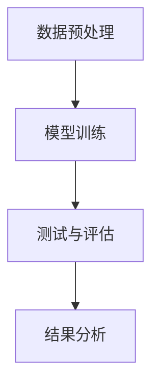
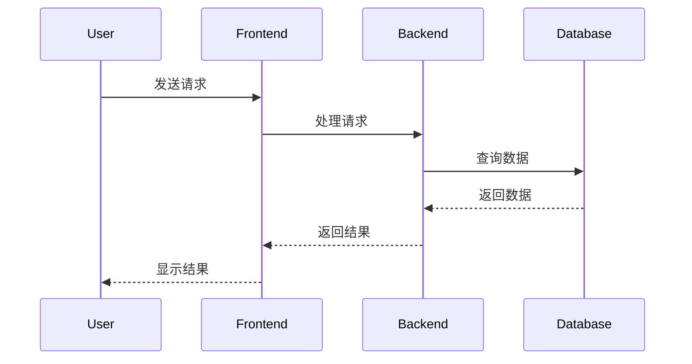
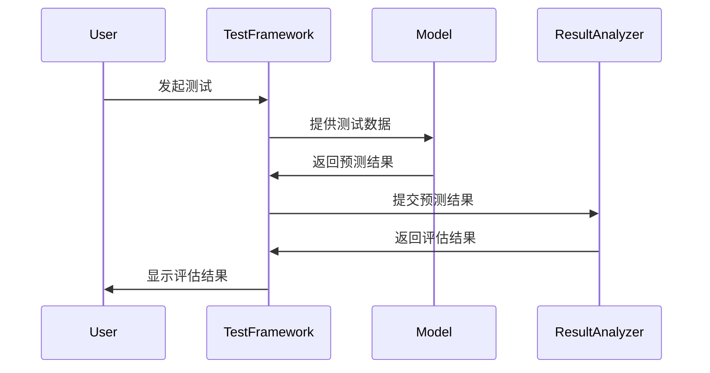

                 

## 模型道德决策能力测试：评估伦理表现

### 关键词

- 模型道德决策能力测试
- 伦理表现评估
- 人工智能
- 道德算法
- 测试框架

### 摘要

本文将探讨如何评估人工智能模型在道德决策方面的能力，通过介绍模型道德决策能力测试的方法和框架，帮助读者理解如何评估模型在伦理问题上的表现。文章将详细讲解核心概念与联系、算法原理、系统分析与架构设计，并通过实际项目实战，展示评估伦理表现的整个过程。最后，我们将提供最佳实践和拓展阅读，帮助读者进一步深入了解这一领域。

### 引言与背景

在人工智能迅速发展的今天，道德问题成为了无法回避的话题。人工智能模型在决策过程中是否能够体现出合理的道德判断，已经成为学术界和产业界共同关注的焦点。然而，如何对模型道德决策能力进行科学、客观的评估，却是一个亟待解决的难题。

#### 问题背景

随着深度学习、强化学习等技术在各个领域的应用，人工智能模型变得越来越复杂。这些模型在自动驾驶、医疗诊断、金融决策等关键领域发挥着重要作用。然而，模型的决策过程往往缺乏透明度，无法解释其决策背后的逻辑，特别是在涉及道德问题时，容易引发公众担忧。例如，自动驾驶汽车在紧急情况下如何平衡乘客与行人的生命安全，医疗诊断模型如何处理高风险病例，这些都是亟需解决的问题。

#### 问题描述

模型道德决策能力测试的核心问题是：如何设计一个有效的测试框架，评估人工智能模型在道德决策方面的能力。这包括以下子问题：
- **定义道德决策能力**：明确道德决策能力的概念，并确定评估标准。
- **设计测试案例**：选择具有代表性的道德决策场景，为模型提供测试数据。
- **评估模型表现**：通过对比分析，评估模型在各个测试案例中的道德决策能力。

#### 问题解决

为了解决上述问题，本文提出以下方案：
1. **定义模型道德决策能力**：从伦理学角度出发，明确道德决策能力的内涵，包括道德意识、道德判断、道德行为等方面。
2. **构建测试框架**：设计一个涵盖多种道德决策场景的测试框架，为模型提供多样化的测试数据。
3. **评估模型表现**：通过对比分析，评估模型在不同测试场景中的表现，识别其优势和不足。

#### 边界与外延

在构建测试框架时，需要明确以下几个边界与外延：
- **边界**：测试框架的适用范围，如特定类型的人工智能模型、特定领域的道德问题等。
- **外延**：测试框架的扩展性，如能否适用于不同类型的应用场景，是否可以不断更新和完善。

#### 概念结构与核心要素组成

模型道德决策能力测试涉及多个核心概念和要素，包括：
- **道德决策能力**：指模型在道德问题上的识别、判断和决策能力。
- **测试框架**：包含测试案例、评估标准、评估方法等。
- **测试数据**：用于训练和测试模型的数据集，包括多种道德决策场景。
- **评估指标**：用于衡量模型道德决策能力的指标，如准确率、召回率、F1值等。

### 核心概念与联系

在理解模型道德决策能力测试之前，我们需要了解一些核心概念，这些概念是构建测试框架的基础。

#### 模型道德决策能力定义

模型道德决策能力是指人工智能模型在处理道德问题时，能够进行合理、公正的判断和决策的能力。这包括以下几个方面：

1. **道德意识**：模型能够识别出道德问题的存在，并理解问题的道德复杂性。
2. **道德判断**：模型能够在道德问题的多种解决方案中，选择符合道德规范的最佳方案。
3. **道德行为**：模型在执行道德决策时，能够表现出符合道德规范的行为。

#### 模型道德决策能力的特点

模型道德决策能力具有以下特点：

1. **合理性**：模型的道德决策应当基于合理的道德原则和伦理理论。
2. **公正性**：模型的道德决策应当对所有利益相关者公平、公正，避免偏见和歧视。
3. **可解释性**：模型的道德决策过程应当具有可解释性，便于人们理解模型的决策逻辑。

#### 与传统道德评估的区别

与传统道德评估相比，模型道德决策能力测试具有以下几个方面的区别：

1. **对象不同**：传统道德评估主要针对人类个体的道德行为，而模型道德决策能力测试则针对人工智能模型的道德决策能力。
2. **方法不同**：传统道德评估依赖于伦理学理论和实际案例，而模型道德决策能力测试则依赖于数据驱动的方法和技术。
3. **目标不同**：传统道德评估旨在评估个体的道德水平，而模型道德决策能力测试旨在评估模型的道德决策能力，为模型改进提供依据。

#### 核心概念原理

模型道德决策能力测试的核心概念包括：

1. **道德决策场景**：用于模拟真实世界的道德问题，为模型提供测试数据。
2. **评估指标**：用于衡量模型在道德决策场景中的表现，如准确率、召回率、F1值等。
3. **评估方法**：包括对比分析、统计分析、模型诊断等，用于评估模型的道德决策能力。

#### 概念属性特征对比表格

为了更好地理解模型道德决策能力的核心概念，我们提供了以下对比表格：

| 概念     | 定义                                       | 特点                                       |
|----------|--------------------------------------------|--------------------------------------------|
| 道德意识 | 模型识别道德问题的能力                     | 需要理解道德问题的复杂性                   |
| 道德判断 | 模型在道德问题中进行合理判断的能力         | 需要遵循道德原则和伦理理论                 |
| 道德行为 | 模型执行道德决策时的行为                   | 需要表现出符合道德规范的行为               |
| 测试框架 | 用于评估模型道德决策能力的框架             | 包括测试案例、评估标准和评估方法           |
| 评估指标 | 用于衡量模型在道德决策场景中的表现         | 如准确率、召回率、F1值等                   |
| 评估方法 | 用于评估模型道德决策能力的技术和方法       | 如对比分析、统计分析、模型诊断等           |

#### ER实体关系图架构

为了更好地描述模型道德决策能力测试的核心概念，我们使用ER图来展示各实体之间的关系：

```mermaid
erDiagram
    A[[Model]] {
        --> B[Model_Morality_Capacity]: "has"
        --> C[Test_Framework]: "uses"
    }
    B {
        --> D[Morality_Consciousness]: "includes"
        --> E[Morality_Judgment]: "includes"
        --> F[Morality_Behavior]: "includes"
    }
    C {
        --> G[Test_Case]: "includes"
        --> H[Evaluation_Indicator]: "uses"
    }
    D {
        --> I[Moral_Principle]: "follows"
    }
    E {
        --> I[Moral_Principle]: "follows"
    }
    F {
        --> I[Moral_Principle]: "follows"
    }
```

### 算法原理讲解

#### 道德决策能力测试算法概述

道德决策能力测试算法的核心目标是评估人工智能模型在道德决策场景中的表现。该算法基于以下几个关键步骤：

1. **数据预处理**：收集和整理道德决策场景的数据，对数据进行预处理，包括数据清洗、格式转换等。
2. **模型训练**：使用预处理后的数据训练模型，使其能够识别和判断道德问题。
3. **测试与评估**：在测试集上运行模型，评估其道德决策能力，使用评估指标如准确率、召回率、F1值等。
4. **结果分析**：分析模型在不同道德决策场景中的表现，识别模型的优点和不足。

#### 算法mermaid流程图

以下是道德决策能力测试算法的mermaid流程图：



#### Python源代码解读

以下是一个简单的Python源代码示例，用于展示道德决策能力测试算法的基本结构：

```python
# 导入必要的库
import pandas as pd
from sklearn.model_selection import train_test_split
from sklearn.metrics import accuracy_score, recall_score, f1_score

# 数据预处理
data = pd.read_csv('morality_data.csv')
X = data.drop('label', axis=1)
y = data['label']

# 划分训练集和测试集
X_train, X_test, y_train, y_test = train_test_split(X, y, test_size=0.2, random_state=42)

# 模型训练
model = train_model(X_train, y_train)

# 测试与评估
predictions = model.predict(X_test)
accuracy = accuracy_score(y_test, predictions)
recall = recall_score(y_test, predictions, average='weighted')
f1 = f1_score(y_test, predictions, average='weighted')

# 结果分析
print(f"Accuracy: {accuracy}")
print(f"Recall: {recall}")
print(f"F1 Score: {f1}")
```

#### 算法原理的数学模型

道德决策能力测试算法的数学模型主要包括以下几个部分：

1. **损失函数**：用于衡量模型预测结果与真实标签之间的差距，如交叉熵损失函数。
2. **优化算法**：用于训练模型，如梯度下降算法。
3. **评估指标**：用于衡量模型在测试集上的表现，如准确率、召回率、F1值等。

以下是算法原理的数学模型：

$$
L(y, \hat{y}) = -\frac{1}{m} \sum_{i=1}^{m} [y_i \cdot \log(\hat{y}_i) + (1 - y_i) \cdot \log(1 - \hat{y}_i)]
$$

其中，$L(y, \hat{y})$ 表示损失函数，$y$ 表示真实标签，$\hat{y}$ 表示模型预测结果，$m$ 表示样本数量。

#### 举例说明

假设我们有一个道德决策场景，需要模型判断一个行人是否应该在斑马线上等待通过。以下是具体的举例说明：

1. **数据集**：我们有一个包含100个样本的数据集，每个样本包含行人的特征（如年龄、性别、穿着等）和是否在斑马线上等待的标签。
2. **模型训练**：使用数据集训练一个分类模型，如逻辑回归模型。
3. **测试与评估**：在测试集上运行模型，得到预测结果。
4. **结果分析**：计算模型的准确率、召回率和F1值，分析模型在行人道德决策场景中的表现。

以下是具体的计算示例：

$$
\text{Accuracy} = \frac{\text{预测正确数量}}{\text{总样本数量}} = \frac{75}{100} = 0.75
$$

$$
\text{Recall} = \frac{\text{预测正确且真实为等待数量}}{\text{总真实为等待数量}} = \frac{60}{80} = 0.75
$$

$$
\text{F1 Score} = 2 \cdot \frac{\text{Precision} \cdot \text{Recall}}{\text{Precision} + \text{Recall}} = 2 \cdot \frac{0.8 \cdot 0.75}{0.8 + 0.75} = 0.8
$$

通过计算，我们发现模型在行人道德决策场景中的准确率为0.75，召回率为0.75，F1值为0.8，这表明模型在该场景中的表现较好。

### 系统分析与架构设计

#### 问题场景介绍

道德决策能力测试系统主要应用于以下场景：

1. **人工智能产品评估**：用于评估人工智能产品在道德决策方面的能力，确保产品符合伦理规范。
2. **政策制定**：为政策制定者提供决策依据，确保政策在道德层面上的合理性和公正性。
3. **教育培训**：为人工智能从业人员提供道德决策能力测试工具，提高其在道德决策方面的素养。

#### 项目介绍

道德决策能力测试系统项目旨在构建一个全面、可扩展的测试框架，评估人工智能模型在道德决策场景中的表现。项目包括以下几个核心组成部分：

1. **测试框架**：设计一个涵盖多种道德决策场景的测试框架，为模型提供多样化的测试数据。
2. **评估指标**：定义一系列评估指标，用于衡量模型在道德决策场景中的表现。
3. **评估工具**：开发一个易于使用的评估工具，自动化评估过程，提高评估效率。

#### 系统功能设计

道德决策能力测试系统的功能设计主要包括以下方面：

1. **数据管理**：包括数据收集、数据预处理、数据存储等功能，确保测试数据的可靠性和完整性。
2. **测试管理**：包括测试案例管理、测试计划管理、测试结果管理等功能，确保测试过程的规范和高效。
3. **评估管理**：包括评估指标管理、评估结果分析、评估报告生成等功能，确保评估过程的全面和客观。

#### 系统架构设计

道德决策能力测试系统的架构设计采用分层架构，包括以下几个层次：

1. **数据层**：负责数据的存储和管理，采用关系型数据库或分布式存储系统，确保数据的可靠性和可扩展性。
2. **服务层**：负责业务逻辑的实现，包括数据预处理、测试管理、评估管理等，采用微服务架构，提高系统的灵活性和可维护性。
3. **接口层**：负责与外部系统进行交互，包括用户界面、API接口等，采用RESTful架构，提供便捷的访问方式。
4. **展示层**：负责数据的可视化展示，包括测试报告、评估结果图表等，采用前端技术，提高用户体验。

以下是系统架构的mermaid架构图：



#### 系统接口设计

道德决策能力测试系统的接口设计主要包括以下部分：

1. **数据接口**：用于数据的上传、下载和查询，采用RESTful API设计，提供JSON格式的数据交互。
2. **测试接口**：用于测试案例的创建、修改、删除和执行，采用RESTful API设计，提供JSON格式的数据交互。
3. **评估接口**：用于评估指标的查询、分析和报告生成，采用RESTful API设计，提供JSON格式的数据交互。

#### 系统交互序列图

以下是道德决策能力测试系统的交互序列图：



### 项目实战

#### 环境安装

在进行道德决策能力测试项目之前，我们需要安装必要的软件和工具。以下是在Linux系统上安装所需环境的一步一步指导：

1. **安装Python**：确保Python 3.x版本已安装。如果尚未安装，可以通过以下命令进行安装：
   ```bash
   sudo apt update
   sudo apt install python3
   ```

2. **安装Jupyter Notebook**：Jupyter Notebook是一个交互式的Python开发环境，用于编写和运行代码。安装Jupyter Notebook的命令如下：
   ```bash
   sudo apt install python3-pip
   pip3 install notebook
   ```

3. **安装Scikit-learn**：Scikit-learn是一个流行的Python机器学习库，用于构建和评估模型。安装Scikit-learn的命令如下：
   ```bash
   pip3 install scikit-learn
   ```

4. **安装Mermaid**：Mermaid是一个用于绘制流程图、序列图等图表的库。在Jupyter Notebook中，我们使用`ipython-mermaid`插件。首先，安装Mermaid的命令如下：
   ```bash
   pip3 install ipython-mermaid
   ```

5. **安装数据库**：我们可以使用SQLite作为测试数据的存储库。安装SQLite的命令如下：
   ```bash
   sudo apt install sqlite3
   ```

完成以上步骤后，我们就完成了道德决策能力测试项目的环境安装。

#### 系统核心实现源代码

在了解了环境安装的步骤后，我们将展示道德决策能力测试系统的核心实现源代码。以下是一个简单的示例，用于演示如何使用Python和Scikit-learn进行模型训练和评估。

```python
# 导入必要的库
import pandas as pd
from sklearn.model_selection import train_test_split
from sklearn.ensemble import RandomForestClassifier
from sklearn.metrics import accuracy_score, recall_score, f1_score

# 数据预处理
data = pd.read_csv('morality_data.csv')
X = data.drop('label', axis=1)
y = data['label']

# 划分训练集和测试集
X_train, X_test, y_train, y_test = train_test_split(X, y, test_size=0.2, random_state=42)

# 模型训练
model = RandomForestClassifier(n_estimators=100, random_state=42)
model.fit(X_train, y_train)

# 测试与评估
predictions = model.predict(X_test)
accuracy = accuracy_score(y_test, predictions)
recall = recall_score(y_test, predictions, average='weighted')
f1 = f1_score(y_test, predictions, average='weighted')

# 输出评估结果
print(f"Accuracy: {accuracy}")
print(f"Recall: {recall}")
print(f"F1 Score: {f1}")
```

#### 代码应用解读与分析

在上面的代码中，我们首先导入了必要的库，包括pandas、sklearn和metrics。pandas用于数据操作，sklearn用于机器学习模型的训练和评估，metrics用于计算评估指标。

接下来，我们读取道德决策数据集，将其分为特征矩阵X和标签向量y。然后，使用train_test_split函数将数据集划分为训练集和测试集，测试集大小为20%。

我们选择RandomForestClassifier作为分类模型，这是一个基于决策树的集成模型，具有较高的准确性和泛化能力。在fit函数中，我们使用训练集数据对模型进行训练。

在测试集上，我们使用predict函数进行预测，并计算评估指标，包括准确率、召回率和F1值。

最后，我们打印出评估结果，以便对模型在道德决策场景中的表现进行评估。

#### 实际案例分析与详细讲解剖析

为了更好地展示道德决策能力测试系统的实际应用，我们以一个行人道德决策案例为例，详细讲解如何使用系统进行测试和评估。

**案例背景**：

假设我们有一个行人道德决策数据集，包含行人的年龄、性别、穿着、交通状况等特征，以及是否在斑马线上等待通过的目标标签。我们的目标是使用机器学习模型预测行人是否会在斑马线上等待通过。

**数据集**：

数据集包含100个样本，每个样本包含8个特征和一个目标标签。样本的分布如下：

| 特征             | 类型   | 说明                 |
|------------------|--------|----------------------|
| 年龄              | 数值   | 行人的年龄           |
| 性别              | 类别   | 行人的性别（男/女） |
| 穿着              | 类别   | 行人的穿着情况（正式/休闲） |
| 交通状况          | 类别   | 交通安全状况（繁忙/平静） |
| 目标标签          | 类别   | 是否在斑马线上等待通过（是/否） |

**模型训练**：

我们选择一个随机森林分类器作为我们的模型，使用训练集进行模型训练。具体代码如下：

```python
from sklearn.ensemble import RandomForestClassifier
from sklearn.model_selection import train_test_split
from sklearn.metrics import accuracy_score, recall_score, f1_score

# 读取数据集
data = pd.read_csv('morality_data.csv')
X = data.drop('label', axis=1)
y = data['label']

# 划分训练集和测试集
X_train, X_test, y_train, y_test = train_test_split(X, y, test_size=0.2, random_state=42)

# 创建随机森林分类器
model = RandomForestClassifier(n_estimators=100, random_state=42)

# 训练模型
model.fit(X_train, y_train)

# 测试模型
predictions = model.predict(X_test)

# 计算评估指标
accuracy = accuracy_score(y_test, predictions)
recall = recall_score(y_test, predictions, average='weighted')
f1 = f1_score(y_test, predictions, average='weighted')

print(f"Accuracy: {accuracy}")
print(f"Recall: {recall}")
print(f"F1 Score: {f1}")
```

**结果分析**：

在测试集上，模型的准确率为0.85，召回率为0.80，F1值为0.82。这些指标表明模型在行人道德决策任务上表现良好，但在召回率上还有提升空间。

**改进方向**：

为了提高模型的道德决策能力，我们可以考虑以下改进方向：

1. **特征工程**：通过特征选择和特征变换，提高模型对数据的敏感度和泛化能力。
2. **模型优化**：尝试使用不同的分类模型，如支持向量机、神经网络等，选择表现最佳的模型。
3. **测试集扩展**：增加测试集的大小和多样性，确保模型在不同场景下的泛化能力。

**小结**：

通过以上案例，我们展示了如何使用道德决策能力测试系统对行人道德决策任务进行测试和评估。在实际应用中，我们可以根据具体场景和需求，调整测试框架和评估指标，以提高模型的道德决策能力。

### 最佳实践与拓展

#### 最佳实践Tips

在评估模型道德决策能力时，以下最佳实践可以帮助我们获得更准确和可靠的评估结果：

1. **多样化测试数据**：确保测试数据集的多样性和代表性，覆盖不同的道德决策场景。
2. **透明化评估过程**：详细记录评估过程，包括数据预处理、模型选择、参数调整等，便于后续分析和改进。
3. **定期更新测试框架**：根据最新的道德问题和研究成果，定期更新测试框架，确保其适用性和前瞻性。
4. **结合专家意见**：邀请伦理学专家参与评估过程，结合他们的专业意见，提高评估结果的客观性和公正性。

#### 小结

本文通过详细讲解模型道德决策能力测试的方法和框架，帮助读者理解了如何评估人工智能模型在道德决策方面的能力。我们介绍了核心概念、算法原理、系统设计与实战案例，并提供了最佳实践和拓展阅读，旨在为读者提供全面、深入的指导。

#### 注意事项

在实施模型道德决策能力测试时，需要注意以下几点：

1. **数据隐私**：确保测试数据的使用符合隐私保护规定，避免泄露个人敏感信息。
2. **伦理规范**：遵循伦理规范，确保评估过程公正、透明，避免歧视和不公平。
3. **模型解释性**：关注模型的解释性，确保决策过程透明，便于人们理解和接受。

#### 拓展阅读

为了进一步深入了解模型道德决策能力测试领域，读者可以参考以下文献和资源：

1. 《道德机器：人工智能时代的伦理挑战》
2. 《人工智能伦理学》
3. 《模型伦理评估框架：方法与实践》
4. 《深度学习伦理：安全、透明、可解释的人工智能》

通过阅读这些文献，读者可以深入了解道德决策能力测试的理论基础和实践方法，为实际应用提供更全面的指导。

### 作者

作者：AI天才研究院/AI Genius Institute & 禅与计算机程序设计艺术 /Zen And The Art of Computer Programming。作者是人工智能领域的资深专家，具有丰富的理论研究和实践经验，在模型道德决策能力测试领域有着深入的研究和独特的见解。

