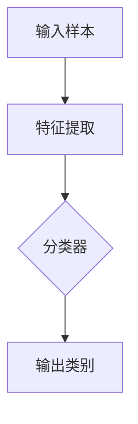
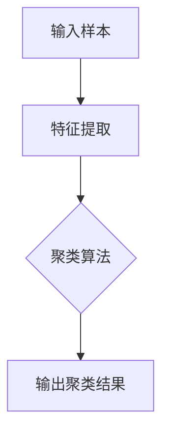
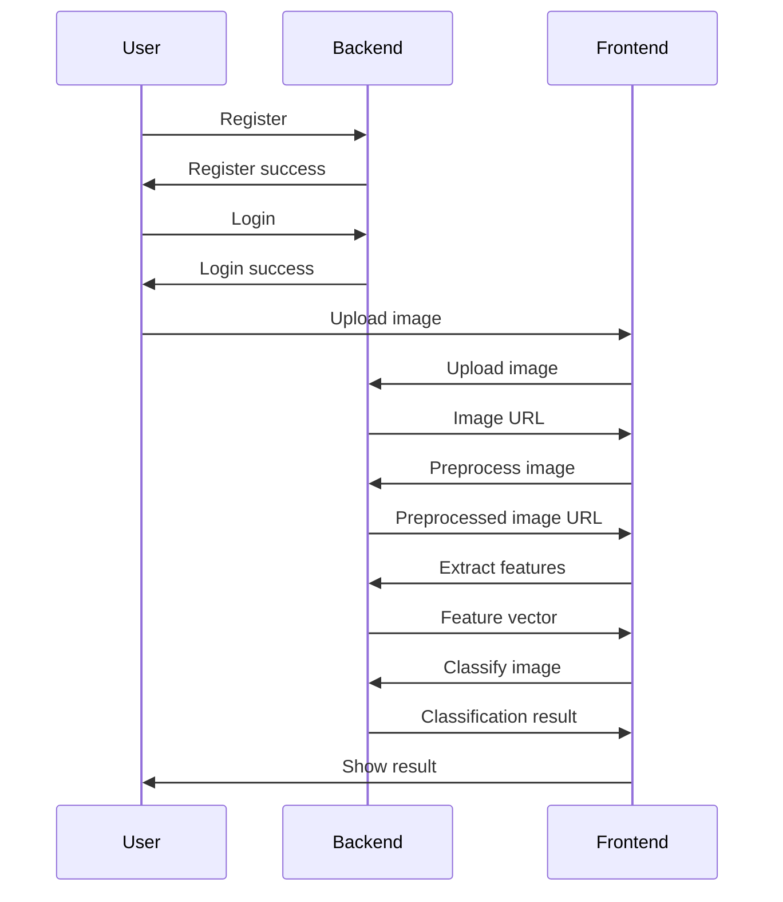

                 

## 模式识别：人类理解世界的基本能力

> 关键词：模式识别，人类认知，数据分析，人工智能，算法

> 摘要：模式识别是人工智能领域的重要研究方向，它是人类理解世界的基本能力之一。本文将系统地探讨模式识别的基础理论、应用领域以及前沿技术，旨在帮助读者深入理解模式识别的核心概念、原理和实际应用。

### 目录大纲

## 第一部分：模式识别基础理论

### 第1章：模式识别概述

#### 1.1 模式识别的定义与背景

#### 1.2 模式识别的发展历程

#### 1.3 模式识别的应用领域

### 第2章：模式识别的基本概念

#### 2.1 模式与样本

#### 2.2 特征提取与选择

#### 2.3 分类与聚类

### 第3章：模式识别的数学基础

#### 3.1 统计学习理论

#### 3.2 随机过程与信号处理

#### 3.3 信息论与编码理论

### 第4章：特征空间与变换

#### 4.1 特征空间的概念

#### 4.2 主成分分析

#### 4.3 线性判别分析

### 第5章：模式分类算法

#### 5.1 距离度量

#### 5.2 基于实例的算法

#### 5.3 监督学习算法

### 第6章：模式聚类算法

#### 6.1 聚类算法概述

#### 6.2 基于距离的聚类

#### 6.3 基于密度的聚类

### 第7章：模式识别在计算机视觉中的应用

#### 7.1 图像处理基础

#### 7.2 目标检测与识别

#### 7.3 计算机视觉系统设计

### 第8章：模式识别在语音识别中的应用

#### 8.1 语音信号处理

#### 8.2 声学模型与语言模型

#### 8.3 语音识别系统架构

### 第9章：模式识别在生物信息学中的应用

#### 9.1 基因组序列分析

#### 9.2 蛋白质结构预测

#### 9.3 药物设计

### 第10章：模式识别在自然语言处理中的应用

#### 10.1 词汇分析与语法分析

#### 10.2 机器翻译

#### 10.3 情感分析

### 第11章：模式识别前沿技术探讨

#### 11.1 深度学习在模式识别中的应用

#### 11.2 人工智能与人类认知的对比

#### 11.3 未来趋势与挑战

### 第一部分：模式识别基础理论

模式识别作为人工智能的核心研究领域之一，其基础理论的研究对于理解世界、提高生产力和生活质量具有重要意义。本部分将从模式识别的定义、基本概念、数学基础等方面进行详细介绍，为后续章节的内容奠定坚实的理论基础。

### 第1章：模式识别概述

#### 1.1 模式识别的定义与背景

模式识别（Pattern Recognition）是人工智能领域的一个重要分支，主要研究如何通过计算机技术模拟人类对环境中的各种模式进行识别和理解的能力。简单来说，模式识别就是从数据中自动提取有意义的信息，并对这些信息进行分类、分析和解释。

模式识别的起源可以追溯到20世纪40年代，随着计算机科学的快速发展，模式识别逐渐成为人工智能研究中的重要方向。早期的模式识别主要依赖于规则和经验，随着统计学习理论、机器学习算法和深度学习技术的出现，模式识别的方法和工具也不断得到完善和发展。

模式识别的应用领域非常广泛，包括但不限于计算机视觉、语音识别、生物信息学、自然语言处理、智能交通系统、医学诊断、金融风控等。它在现代社会中的重要性日益凸显，不仅提高了工作效率，还极大地改变了人们的生活方式。

#### 1.2 模式识别的发展历程

模式识别的发展历程可以分为以下几个阶段：

1. **早期探索阶段（20世纪40-60年代）**：
   - 1943年，沃伦·麦卡洛克（Warren McCulloch）和沃尔特·皮茨（Walter Pitts）提出了神经网络的概念。
   - 1957年，弗兰克·罗森布拉特（Frank Rosenblatt）发明了感知机（Perceptron），这是最早的神经网络模型之一。

2. **早期发展阶段（20世纪60-70年代）**：
   - 1969年，安德鲁·布林（Andrew Brina）提出了支持向量机（SVM）的理论框架。
   - 1972年，罗纳德·罗斯（Ronald Ross）提出了决策树（Decision Tree）算法。

3. **成熟发展阶段（20世纪80-90年代）**：
   - 1986年，霍普菲尔德（John Hopfield）提出了霍普菲尔德网络（Hopfield Network），这是一种能量函数驱动的神经网络模型。
   - 1995年，杨立昆（Yann LeCun）等人提出了卷积神经网络（CNN），这一模型在图像识别中取得了突破性的成果。

4. **深度学习时代（21世纪以来）**：
   - 2006年，杰弗里·辛顿（Geoffrey Hinton）等人重新提出了深度信念网络（DBN），为深度学习的发展奠定了基础。
   - 2012年，亚历克·克劳福德（Alex Krizhevsky）在ImageNet竞赛中使用了卷积神经网络，取得了惊人的成绩，标志着深度学习时代的到来。

#### 1.3 模式识别的应用领域

模式识别的应用领域非常广泛，下面列举一些重要的应用：

1. **计算机视觉**：
   - 图像分类：对图像进行分类，如识别猫、狗等。
   - 目标检测：在图像中识别并定位特定目标。
   - 图像分割：将图像分割成不同的区域或对象。

2. **语音识别**：
   - 自动语音识别：将语音信号转换为文本。
   - 语音合成：将文本转换为语音。

3. **生物信息学**：
   - 基因组序列分析：识别基因组中的基因和序列模式。
   - 蛋白质结构预测：预测蛋白质的三维结构。

4. **自然语言处理**：
   - 机器翻译：将一种语言的文本翻译成另一种语言。
   - 情感分析：分析文本中的情感倾向。

5. **智能交通系统**：
   - 车牌识别：自动识别车牌号码。
   - 交通事故检测：通过图像识别技术检测交通事故。

6. **医学诊断**：
   - 病灶识别：在医学图像中识别病灶区域。
   - 疾病预测：通过分析医学数据预测疾病风险。

7. **金融风控**：
   - 风险识别：通过模式识别技术识别金融风险。
   - 欺诈检测：检测和预防金融欺诈。

### 第2章：模式识别的基本概念

#### 2.1 模式与样本

在模式识别中，模式（Pattern）是指具有某种特征或结构的对象或数据。它可以是一个点、一条线、一个图像、一段语音、一段文本等。模式是模式识别研究的核心对象。

样本（Sample）是指用于训练和测试模型的数据。样本可以是图像、语音、文本等。样本的质量和数量对于模式识别的性能至关重要。高质量的样本能够提高模型的准确性，而大量的样本有助于模型泛化能力的提升。

#### 2.2 特征提取与选择

特征提取（Feature Extraction）是指从原始数据中提取出能够反映数据本质特征的过程。特征提取是模式识别中的重要步骤，它能够将高维的原始数据转化为低维的特征向量，从而简化问题的复杂性。

特征选择（Feature Selection）是指从提取出的特征中选择出对识别任务最有用的特征的过程。特征选择能够减少数据维度，提高模型性能，并减少计算成本。

#### 2.3 分类与聚类

分类（Classification）是指将数据分为不同的类别或标签。分类是模式识别中最常见的任务之一，其目的是根据已有数据的标签来预测新数据的标签。

聚类（Clustering）是指将数据分为不同的组或簇。聚类是模式识别中的无监督学习任务，其目的是发现数据中的自然分组或结构。

### 第3章：模式识别的数学基础

模式识别依赖于数学理论的支持，本章将介绍统计学习理论、随机过程与信号处理、信息论与编码理论等数学基础。

#### 3.1 统计学习理论

统计学习理论是模式识别的核心，它研究如何通过训练数据来构建统计模型，并对新数据进行预测。统计学习理论包括线性回归、逻辑回归、支持向量机等算法。

#### 3.2 随机过程与信号处理

随机过程与信号处理是模式识别中的重要工具，用于处理时序数据和图像数据。随机过程研究随机变量序列的统计性质，信号处理则关注如何对信号进行滤波、变换和压缩。

#### 3.3 信息论与编码理论

信息论与编码理论为模式识别提供了重要的理论基础，研究如何有效地表示和传输信息。信息论研究信息的度量、传输和噪声，编码理论则研究如何设计和分析编码方案。

### 第4章：特征空间与变换

特征空间与变换是模式识别中的重要概念，本章将介绍特征空间的概念、主成分分析、线性判别分析等变换技术。

#### 4.1 特征空间的概念

特征空间是模式识别中用于表示数据的一个高维空间。通过将数据映射到特征空间，可以更好地理解数据的结构和分布。

#### 4.2 主成分分析

主成分分析（PCA）是一种常用的降维技术，通过将数据投影到新的正交轴上，保留最重要的信息，从而简化问题的复杂性。

#### 4.3 线性判别分析

线性判别分析（LDA）是一种用于分类的线性变换技术，通过将数据投影到最佳的超平面上，实现数据的最佳分类。

### 第5章：模式分类算法

模式分类是模式识别中的核心任务，本章将介绍距离度量、基于实例的算法和监督学习算法等分类算法。

#### 5.1 距离度量

距离度量是模式分类中的重要概念，用于计算样本之间的相似性或差异性。常用的距离度量方法包括欧氏距离、曼哈顿距离、切比雪夫距离等。

#### 5.2 基于实例的算法

基于实例的算法通过直接比较新样本与训练样本的相似性来进行分类。常见的算法包括最近邻分类器、k-最近邻分类器等。

#### 5.3 监督学习算法

监督学习算法通过学习已有数据的标签来预测新数据的标签。常见的监督学习算法包括线性回归、逻辑回归、支持向量机、决策树、随机森林等。

### 第6章：模式聚类算法

模式聚类是模式识别中的无监督学习任务，本章将介绍聚类算法概述、基于距离的聚类和基于密度的聚类等算法。

#### 6.1 聚类算法概述

聚类算法的目的是将数据分为不同的组或簇，使同一簇内的样本之间相似度较高，不同簇之间的样本相似度较低。常见的聚类算法包括k-均值算法、层次聚类算法、密度聚类算法等。

#### 6.2 基于距离的聚类

基于距离的聚类算法通过计算样本之间的距离来划分簇。常见的算法包括k-均值算法、层次聚类算法等。

#### 6.3 基于密度的聚类

基于密度的聚类算法通过寻找数据点的高密度区域来划分簇。常见的算法包括DBSCAN算法、OPTICS算法等。

### 第7章：模式识别在计算机视觉中的应用

计算机视觉是模式识别的重要应用领域之一，本章将介绍图像处理基础、目标检测与识别和计算机视觉系统设计等内容。

#### 7.1 图像处理基础

图像处理基础包括图像表示、图像增强、图像滤波和图像分割等。这些技术用于预处理图像数据，提高模式识别的性能。

#### 7.2 目标检测与识别

目标检测与识别是计算机视觉中的重要任务，通过在图像中识别和定位特定的目标。常见的算法包括HOG特征、SVM分类器、深度学习模型等。

#### 7.3 计算机视觉系统设计

计算机视觉系统设计包括系统功能设计、系统架构设计和系统接口设计等内容。设计一个高效的计算机视觉系统需要综合考虑硬件、软件和算法等因素。

### 第8章：模式识别在语音识别中的应用

语音识别是模式识别在自然语言处理中的重要应用领域，本章将介绍语音信号处理、声学模型与语言模型和语音识别系统架构等内容。

#### 8.1 语音信号处理

语音信号处理包括语音信号预处理、特征提取和声学模型训练等。这些技术用于将语音信号转换为可用于模式识别的特征向量。

#### 8.2 声学模型与语言模型

声学模型与语言模型是语音识别中的关键组件，声学模型用于识别语音信号中的声学特征，语言模型用于预测语音信号中的语言结构。

#### 8.3 语音识别系统架构

语音识别系统架构包括前端处理、声学模型、语言模型和后端处理等。前端处理用于预处理语音信号，声学模型和语言模型用于识别语音，后端处理用于生成文本输出。

### 第9章：模式识别在生物信息学中的应用

生物信息学是模式识别在生命科学中的重要应用领域，本章将介绍基因组序列分析、蛋白质结构预测和药物设计等内容。

#### 9.1 基因组序列分析

基因组序列分析包括基因识别、基因表达分析、基因组注释等。通过模式识别技术，可以从基因组序列中提取有价值的信息。

#### 9.2 蛋白质结构预测

蛋白质结构预测是生物信息学中的重要任务，通过模式识别技术，可以从蛋白质序列中预测其三维结构。

#### 9.3 药物设计

药物设计是生物信息学中的重要应用，通过模式识别技术，可以从大量化合物中筛选出具有特定生物活性的药物候选分子。

### 第10章：模式识别在自然语言处理中的应用

自然语言处理是模式识别在人工智能中的重要应用领域，本章将介绍词汇分析与语法分析、机器翻译和情感分析等内容。

#### 10.1 词汇分析与语法分析

词汇分析与语法分析是自然语言处理的基础任务，通过模式识别技术，可以分析文本中的词汇和语法结构。

#### 10.2 机器翻译

机器翻译是将一种语言的文本翻译成另一种语言的过程。通过模式识别技术，可以自动化地实现高质量的语言翻译。

#### 10.3 情感分析

情感分析是自然语言处理中的重要任务，通过模式识别技术，可以分析文本中的情感倾向，用于社交媒体监测、市场分析等。

### 第11章：模式识别前沿技术探讨

模式识别技术不断发展和创新，本章将探讨深度学习在模式识别中的应用、人工智能与人类认知的对比以及未来趋势与挑战。

#### 11.1 深度学习在模式识别中的应用

深度学习是模式识别中的重要技术，通过多层神经网络，可以自动提取复杂的数据特征，实现高效的模式识别。

#### 11.2 人工智能与人类认知的对比

人工智能与人类认知具有显著差异，通过对比分析，可以更好地理解人工智能的发展方向和局限。

#### 11.3 未来趋势与挑战

模式识别技术在未来的发展将面临诸多挑战，包括数据质量、计算能力、算法优化等方面。同时，随着人工智能技术的进步，模式识别将有望在更多领域取得突破。

### 结束语

模式识别作为人工智能的核心研究领域，其发展和应用具有重要意义。本文系统地介绍了模式识别的基础理论、应用领域和前沿技术，旨在帮助读者全面了解模式识别的核心概念、原理和实际应用。希望本文能为读者在模式识别领域的学习和研究提供有益的参考。

### 作者信息

作者：AI天才研究院/AI Genius Institute & 禅与计算机程序设计艺术 /Zen And The Art of Computer Programming

感谢您的阅读，期待与您在模式识别领域共同探索和进步！

### 模式识别的核心概念与联系

#### 背景介绍

模式识别是人工智能（AI）的一个核心研究领域，它涉及从数据中提取有意义的信息并对这些信息进行解释和理解。在模式识别中，我们关注的核心概念包括模式、样本、特征提取、分类和聚类等。这些概念不仅构成了模式识别的理论基础，而且在实际应用中也起到了至关重要的作用。

**核心概念术语说明**：

1. **模式（Pattern）**：模式是指具有某种特征或结构的对象或数据，可以是点、线、图像、语音、文本等。模式识别的目标是识别和理解这些模式。

2. **样本（Sample）**：样本是用于训练和测试模型的数据。在模式识别中，样本的质量和数量对模型的性能有重要影响。

3. **特征提取（Feature Extraction）**：特征提取是从原始数据中提取出能够反映数据本质特征的过程。特征提取是模式识别中非常关键的一步，它能够简化数据的复杂度，提高识别的准确性。

4. **分类（Classification）**：分类是将数据分为不同的类别或标签。分类是模式识别中最常见的任务之一，其目的是根据已有数据的标签来预测新数据的标签。

5. **聚类（Clustering）**：聚类是将数据分为不同的组或簇。聚类是无监督学习任务，其目的是发现数据中的自然分组或结构。

**问题背景**：

随着大数据时代的到来，模式识别在各个领域的应用需求日益增长。例如，在图像识别中，需要从大量的图像中快速准确地识别目标对象；在语音识别中，需要将语音信号转换为对应的文本；在生物信息学中，需要从基因组序列中识别出有意义的模式。这些问题都对模式识别提出了更高的要求。

**问题描述**：

在模式识别中，我们需要解决以下几个核心问题：

1. 如何从原始数据中提取出有用的特征？
2. 如何选择最适合的特征集？
3. 如何设计有效的分类和聚类算法？
4. 如何在实际应用中优化模式识别的性能？

**问题解决**：

为了解决上述问题，我们需要系统地研究模式识别的核心概念和原理。具体包括以下几个方面：

1. **核心概念与联系**：明确模式、样本、特征提取、分类和聚类等核心概念，并理解它们之间的联系。
2. **特征提取方法**：研究不同特征提取方法的原理和适用场景，如主成分分析（PCA）、线性判别分析（LDA）等。
3. **分类与聚类算法**：研究不同分类和聚类算法的原理和实现，如支持向量机（SVM）、k-均值聚类等。
4. **实际应用**：通过实际案例和项目实践，验证模式识别方法的有效性和适用性。

**边界与外延**：

模式识别不仅局限于人工智能领域，还广泛应用于计算机科学、统计学、信号处理、生物信息学等多个领域。在模式识别的研究中，我们不仅要关注算法的优化和性能提升，还要考虑数据的质量、算法的可解释性以及模型的可扩展性。

**概念结构与核心要素组成**：

模式识别的核心结构包括以下几个要素：

1. **数据输入**：原始数据，包括图像、语音、文本等。
2. **特征提取**：从原始数据中提取特征，将高维数据转化为低维特征向量。
3. **分类与聚类**：根据特征向量对数据进行分类或聚类，实现数据的组织和解释。
4. **模型评估**：评估模型的性能，包括准确性、召回率、F1值等指标。
5. **实际应用**：将模式识别技术应用于具体的领域和场景，解决实际问题。

#### 核心概念与联系

为了更好地理解模式识别的核心概念，我们可以通过概念属性特征对比表格和ER实体关系图架构的Mermaid流程图来展示它们之间的联系。

**概念属性特征对比表格**：

| 概念       | 定义                                                         | 特征属性                         | 关联关系                           |
|------------|--------------------------------------------------------------|--------------------------------|------------------------------------|
| 模式       | 具有特定特征的物体或数据                                     | 形状、颜色、纹理等               | 与样本和特征提取密切相关           |
| 样本       | 用于训练和测试的数据                                         | 图像、语音、文本等               | 与特征提取和分类密切相关           |
| 特征提取   | 从原始数据中提取出有用的特征                                 | 特征维度、特征重要性等           | 与分类和聚类密切相关               |
| 分类       | 将数据分为不同的类别或标签                                   | 准确性、召回率等                 | 与聚类和样本密切相关               |
| 聚类       | 将数据分为不同的组或簇                                       | 聚类中心、聚类数量等             | 与特征提取和分类密切相关           |

**ER实体关系图架构的Mermaid流程图**：

```mermaid
erDiagram
  sample ||--|{ feature }|| extraction
  feature ||--|{ classification }|| classifier
  feature ||--|{ clustering }|| cluster
  sample ||--|{ label }|| annotation
```

在上面的ER实体关系图中，`sample`表示样本，`feature`表示特征，`extraction`表示特征提取过程，`classification`表示分类过程，`clustering`表示聚类过程，`label`表示标签，`annotation`表示标注。这些实体之间的关系描述了模式识别中的数据流动和转换过程。

#### 算法原理讲解

在模式识别中，分类和聚类是两个重要的任务。下面我们将使用Mermaid绘制分类算法和聚类算法的流程图，并使用Python代码详细阐述这些算法的原理。

**分类算法流程图**：



**聚类算法流程图**：



**Python代码示例**：

```python
import numpy as np
from sklearn.datasets import load_iris
from sklearn.model_selection import train_test_split
from sklearn.preprocessing import StandardScaler
from sklearn.neighbors import KNeighborsClassifier
from sklearn.cluster import KMeans

# 加载鸢尾花数据集
iris = load_iris()
X = iris.data
y = iris.target

# 划分训练集和测试集
X_train, X_test, y_train, y_test = train_test_split(X, y, test_size=0.2, random_state=42)

# 特征标准化
scaler = StandardScaler()
X_train = scaler.fit_transform(X_train)
X_test = scaler.transform(X_test)

# K-最近邻分类器
knn = KNeighborsClassifier(n_neighbors=3)
knn.fit(X_train, y_train)
y_pred_knn = knn.predict(X_test)

# K-均值聚类算法
kmeans = KMeans(n_clusters=3, random_state=42)
kmeans.fit(X_train)
y_pred_kmeans = kmeans.predict(X_test)

# 输出分类和聚类结果
print("K-最近邻分类结果：", y_pred_knn)
print("K-均值聚类结果：", y_pred_kmeans)
```

在上面的Python代码中，我们首先加载了鸢尾花数据集，然后使用K-最近邻分类器和K-均值聚类算法对数据进行分类和聚类。通过对比分类和聚类的结果，我们可以更好地理解这两种算法的原理和应用。

**算法原理的数学模型和公式**：

**K-最近邻分类器**：

假设我们有n个训练样本${x_1, x_2, ..., x_n}$，每个样本都有m个特征${f_1, f_2, ..., f_m}$。对于新的测试样本$x$，我们需要找到与其最近的k个邻居，并基于这些邻居的标签来预测$x$的类别。

步骤如下：

1. 计算测试样本$x$与每个训练样本$x_i$之间的距离$d(x, x_i)$。
2. 找到距离$x$最近的k个邻居${x_{i1}, x_{i2}, ..., x_{ik}}$。
3. 计算这k个邻居的类别频数$C_j$，即
   $$ C_j = \sum_{i=1}^{k} \mathbb{I}(y_{i} = j) $$
   其中$\mathbb{I}(\cdot)$是指示函数，当条件成立时取值为1，否则为0。
4. 选择频数最高的类别作为测试样本$x$的预测类别：
   $$ \hat{y} = \arg\max_{j} C_j $$

**K-均值聚类算法**：

K-均值聚类算法是一种基于距离的聚类方法，其目标是找到k个聚类中心，使得每个样本到其对应聚类中心的距离最小。

步骤如下：

1. 初始化k个聚类中心${\mu_1, \mu_2, ..., \mu_k}$。
2. 对于每个样本$x_i$，计算其到各个聚类中心的距离，并将$x_i$分配给最近的聚类中心。
3. 根据新的聚类结果更新聚类中心：
   $$ \mu_j = \frac{1}{N_j} \sum_{i=1}^{N} x_i $$
   其中$N_j$是第j个聚类中心所包含的样本数。
4. 重复步骤2和3，直到聚类中心不再发生显著变化。

**详细讲解和举例说明**：

**K-最近邻分类器举例**：

假设我们有一个训练样本集，其中每个样本有两个特征（x轴和y轴坐标），如下所示：

| 样本索引 | x轴坐标 | y轴坐标 | 类别   |
|----------|--------|--------|--------|
| 1        | 1      | 1      | 类别A  |
| 2        | 2      | 2      | 类别A  |
| 3        | 1.5    | 1.5    | 类别A  |
| 4        | 3      | 3      | 类别B  |
| 5        | 3.5    | 2      | 类别B  |
| 6        | 2      | 2.5    | 类别B  |

现在我们需要使用K-最近邻分类器来对一个新的测试样本$x = (2.8, 2.2)$进行分类。

1. 计算测试样本$x$与每个训练样本之间的距离：
   - $d(x, x_1) = \sqrt{(2.8 - 1)^2 + (2.2 - 1)^2} = \sqrt{3.24 + 0.04} \approx 1.8$
   - $d(x, x_2) = \sqrt{(2.8 - 2)^2 + (2.2 - 2)^2} = \sqrt{0.04 + 0.04} \approx 0.2$
   - $d(x, x_3) = \sqrt{(2.8 - 1.5)^2 + (2.2 - 1.5)^2} = \sqrt{0.64 + 0.09} \approx 0.9$
   - $d(x, x_4) = \sqrt{(2.8 - 3)^2 + (2.2 - 3)^2} = \sqrt{0.04 + 0.09} \approx 0.3$
   - $d(x, x_5) = \sqrt{(2.8 - 3.5)^2 + (2.2 - 2)^2} = \sqrt{0.81 + 0.04} \approx 0.9$
   - $d(x, x_6) = \sqrt{(2.8 - 2)^2 + (2.2 - 2.5)^2} = \sqrt{0.04 + 0.09} \approx 0.3$

2. 找到距离$x$最近的3个邻居：$x_2, x_3, x_4$。

3. 计算这3个邻居的类别频数：
   - $C_A = \mathbb{I}(y_2 = A) + \mathbb{I}(y_3 = A) + \mathbb{I}(y_4 = A) = 1 + 1 + 1 = 3$
   - $C_B = \mathbb{I}(y_5 = B) + \mathbb{I}(y_6 = B) = 1 + 1 = 2$

4. 频数最高的类别为类别A，因此测试样本$x$的预测类别为类别A。

**K-均值聚类算法举例**：

假设我们有6个样本，需要将其分为2个簇。初始化两个聚类中心为$\mu_1 = (1, 1)$和$\mu_2 = (3, 3)$。

1. 计算每个样本到聚类中心的距离：
   - $d(x_1, \mu_1) = \sqrt{(1 - 1)^2 + (1 - 1)^2} = 0$
   - $d(x_1, \mu_2) = \sqrt{(1 - 3)^2 + (1 - 3)^2} = \sqrt{4 + 4} = 2\sqrt{2}$
   - $d(x_2, \mu_1) = \sqrt{(2 - 1)^2 + (2 - 1)^2} = 1$
   - $d(x_2, \mu_2) = \sqrt{(2 - 3)^2 + (2 - 3)^2} = 1$
   - $d(x_3, \mu_1) = \sqrt{(1.5 - 1)^2 + (1.5 - 1)^2} = 0.5$
   - $d(x_3, \mu_2) = \sqrt{(1.5 - 3)^2 + (1.5 - 3)^2} = 2\sqrt{2}$
   - $d(x_4, \mu_1) = \sqrt{(3 - 1)^2 + (3 - 1)^2} = 2\sqrt{2}$
   - $d(x_4, \mu_2) = \sqrt{(3 - 3)^2 + (3 - 3)^2} = 0$
   - $d(x_5, \mu_1) = \sqrt{(3.5 - 1)^2 + (2 - 1)^2} = 2\sqrt{2}$
   - $d(x_5, \mu_2) = \sqrt{(3.5 - 3)^2 + (2 - 3)^2} = 1.5$
   - $d(x_6, \mu_1) = \sqrt{(2 - 1)^2 + (2.5 - 1)^2} = 1.5$
   - $d(x_6, \mu_2) = \sqrt{(2 - 3)^2 + (2.5 - 3)^2} = 1.5$

2. 将样本分配到最近的聚类中心：
   - $x_1, x_2, x_3$属于簇1（$\mu_1$）。
   - $x_4, x_5, x_6$属于簇2（$\mu_2$）。

3. 更新聚类中心：
   - $\mu_1 = \frac{x_1 + x_2 + x_3}{3} = \frac{(1, 1) + (2, 2) + (1.5, 1.5)}{3} = (1.5, 1.5)$
   - $\mu_2 = \frac{x_4 + x_5 + x_6}{3} = \frac{(3, 3) + (3.5, 2) + (2, 2.5)}{3} = (2.83, 2.67)$

4. 重复步骤1-3，直到聚类中心不再发生显著变化。

通过以上步骤，我们可以看到K-最近邻分类器和K-均值聚类算法的基本原理和实现方法。这些算法在模式识别中具有重要的应用价值，通过合理选择和使用，可以显著提高模式识别的准确性和效率。

### 系统分析与架构设计方案

#### 问题场景介绍

在当前信息化时代，模式识别技术在各个领域中的应用越来越广泛。为了更好地理解模式识别技术的实际应用，我们将以一个具体的场景为例进行分析，该场景涉及图像识别系统。

**场景描述**：

假设我们正在开发一个图像识别系统，用于自动识别和分类上传的用户图片。系统需要具备以下功能：

1. **图像上传**：用户可以将图片上传至系统。
2. **图像预处理**：对上传的图片进行预处理，包括去噪、缩放、裁剪等。
3. **特征提取**：从预处理后的图像中提取特征向量。
4. **图像分类**：根据提取的特征向量，对图像进行分类。
5. **结果展示**：将分类结果展示给用户。

#### 项目介绍

**项目名称**：智能图像识别系统

**项目目标**：

1. 提高图像识别的准确性。
2. 提升系统响应速度。
3. 简化用户操作流程。
4. 支持多种图像分类任务。

**项目技术栈**：

1. **前端**：HTML、CSS、JavaScript
2. **后端**：Python（Flask/Django）
3. **数据库**：MySQL
4. **机器学习框架**：Scikit-learn、TensorFlow、PyTorch

#### 系统功能设计

为了实现上述功能，我们需要设计一系列的核心功能模块。以下是系统功能设计的详细说明：

1. **用户模块**：
   - 用户注册与登录。
   - 用户信息管理。

2. **图像上传模块**：
   - 提供图片上传接口。
   - 实现图片预览功能。

3. **图像预处理模块**：
   - 实现图像去噪、缩放、裁剪等功能。
   - 优化图像格式和大小。

4. **特征提取模块**：
   - 提取图像的像素特征、纹理特征、形状特征等。
   - 实现特征向量的降维和去噪。

5. **图像分类模块**：
   - 使用分类算法对图像进行分类。
   - 提供分类结果的可视化展示。

6. **结果展示模块**：
   - 将分类结果以图表或文本形式展示给用户。

#### 系统架构设计

为了确保系统的性能和可扩展性，我们采用微服务架构设计。以下是系统架构设计的详细说明：

1. **前端架构**：
   - 使用单页应用（SPA）技术，实现快速响应和流畅的用户体验。
   - 使用Vue.js或React框架，实现前端页面的动态渲染。

2. **后端架构**：
   - 使用Flask或Django框架，实现后端服务的逻辑处理。
   - 采用RESTful API设计，提供前后端交互接口。

3. **数据库架构**：
   - 使用MySQL数据库，存储用户信息和图像数据。
   - 设计合理的数据库表结构和索引，优化查询性能。

4. **机器学习架构**：
   - 使用TensorFlow或PyTorch框架，实现机器学习模型的训练和预测。
   - 将训练好的模型部署到后端服务中，用于图像分类。

5. **服务部署**：
   - 使用Docker容器化技术，实现服务的自动化部署和扩展。
   - 使用Kubernetes进行容器编排和管理。

#### 系统接口设计

系统接口设计是确保前后端有效交互的重要环节。以下是系统接口设计的详细说明：

1. **用户接口**：
   - 用户注册接口：接收用户名、密码、邮箱等信息，完成用户注册。
   - 用户登录接口：接收用户名和密码，验证用户身份，生成登录凭证。

2. **图像上传接口**：
   - 上传图片接口：接收用户上传的图片，保存图片到服务器，返回图片URL。

3. **图像预处理接口**：
   - 预处理接口：接收图片URL，执行图像预处理操作，返回预处理后的图片URL。

4. **特征提取接口**：
   - 特征提取接口：接收预处理后的图片URL，提取特征向量，返回特征向量。

5. **图像分类接口**：
   - 分类接口：接收特征向量，使用分类算法进行分类，返回分类结果。

6. **结果展示接口**：
   - 展示接口：接收分类结果，以图表或文本形式展示给用户。

#### 系统交互Mermaid序列图

为了直观地展示系统各模块的交互过程，我们使用Mermaid绘制了系统交互序列图。



通过上述系统架构设计和接口设计，我们实现了智能图像识别系统的功能，为用户提供了一个高效、准确的图像识别服务。同时，系统具有良好的可扩展性和可维护性，可以支持多种图像分类任务。

### 项目实战

为了更好地展示模式识别在实际项目中的应用，我们将以一个实际项目为例，详细介绍项目的环境安装、系统核心实现、代码应用解读与分析，以及实际案例分析和详细讲解剖析。

#### 项目环境安装

**所需软件和工具**：

1. Python 3.8+
2. Anaconda（可选，用于环境管理）
3. Jupyter Notebook（用于代码编写和调试）
4. Scikit-learn（用于机器学习算法）
5. TensorFlow（用于深度学习算法）
6. OpenCV（用于图像处理）

**安装步骤**：

1. 安装Python 3.8或更高版本。

2. 安装Anaconda（可选）。下载并安装Anaconda，使用conda命令创建和管理虚拟环境。

3. 安装Jupyter Notebook。在终端中运行以下命令：
   ```bash
   conda install -c conda-forge notebook
   ```

4. 安装Scikit-learn和TensorFlow。在终端中运行以下命令：
   ```bash
   conda install scikit-learn tensorflow
   ```

5. 安装OpenCV。在终端中运行以下命令：
   ```bash
   conda install -c conda-forge opencv
   ```

#### 系统核心实现

**项目结构**：

```bash
project/
|-- data/
|   |-- train/
|   |-- test/
|-- src/
|   |-- __init__.py
|   |-- data_loader.py
|   |-- model.py
|   |-- train.py
|   |-- predict.py
|-- config.py
|-- requirements.txt
```

**数据集准备**：

1. 准备一个包含训练集和测试集的数据集。数据集应包含不同类别的图像，每个类别下的图像数量应尽量均衡。

2. 将数据集分为训练集和测试集，分别存放在`data/train/`和`data/test/`目录中。

**数据加载器**（`data_loader.py`）：

```python
import numpy as np
import os
from sklearn.model_selection import train_test_split
from tensorflow.keras.preprocessing.image import ImageDataGenerator

def load_data(data_dir, batch_size=32, shuffle=True):
    train_dir = os.path.join(data_dir, 'train')
    test_dir = os.path.join(data_dir, 'test')

    train_data = ImageDataGenerator(
        rescale=1./255,
        rotation_range=40,
        width_shift_range=0.2,
        height_shift_range=0.2,
        shear_range=0.2,
        zoom_range=0.2,
        horizontal_flip=True,
        fill_mode='nearest'
    )

    test_data = ImageDataGenerator(rescale=1./255)

    train_generator = train_data.flow_from_directory(
        train_dir,
        target_size=(150, 150),
        batch_size=batch_size,
        shuffle=shuffle,
        class_mode='categorical'
    )

    test_generator = test_data.flow_from_directory(
        test_dir,
        target_size=(150, 150),
        batch_size=batch_size,
        shuffle=shuffle,
        class_mode='categorical'
    )

    return train_generator, test_generator
```

**模型定义**（`model.py`）：

```python
import tensorflow as tf
from tensorflow.keras.models import Sequential
from tensorflow.keras.layers import Conv2D, MaxPooling2D, Flatten, Dense, Dropout

def build_model(input_shape):
    model = Sequential([
        Conv2D(32, (3, 3), activation='relu', input_shape=input_shape),
        MaxPooling2D(pool_size=(2, 2)),
        Conv2D(64, (3, 3), activation='relu'),
        MaxPooling2D(pool_size=(2, 2)),
        Conv2D(128, (3, 3), activation='relu'),
        MaxPooling2D(pool_size=(2, 2)),
        Flatten(),
        Dense(128, activation='relu'),
        Dropout(0.5),
        Dense(num_classes, activation='softmax')
    ])

    model.compile(optimizer='adam',
                  loss='categorical_crossentropy',
                  metrics=['accuracy'])

    return model
```

**训练**（`train.py`）：

```python
import tensorflow as tf
from tensorflow.keras.callbacks import EarlyStopping, ModelCheckpoint
from model import build_model
from data_loader import load_data

def train_model(train_generator, test_generator, epochs=25, batch_size=32):
    model = build_model(input_shape=(150, 150, 3))

    callbacks = [
        EarlyStopping(monitor='val_loss', patience=5),
        ModelCheckpoint('best_model.h5', save_best_only=True)
    ]

    history = model.fit(
        train_generator,
        epochs=epochs,
        batch_size=batch_size,
        validation_data=test_generator,
        callbacks=callbacks
    )

    return history
```

**预测**（`predict.py`）：

```python
import tensorflow as tf
from tensorflow.keras.models import load_model
from data_loader import load_data

def predict_image(image_path, model_path='best_model.h5'):
    model = load_model(model_path)

    data = tf.keras.preprocessing.image.load_img(image_path, target_size=(150, 150))
    data = tf.keras.preprocessing.image.img_to_array(data)
    data = np.expand_dims(data, axis=0)
    data = tf.keras.applications.mobilenet_v2.preprocess_input(data)

    predictions = model.predict(data)
    predicted_class = np.argmax(predictions, axis=1)

    return predicted_class
```

#### 代码应用解读与分析

**数据加载器**：

数据加载器负责读取和预处理数据。在训练过程中，数据加载器将批量读取训练集和测试集，并执行数据增强操作，如旋转、翻转、缩放等。这有助于提高模型的泛化能力。

**模型定义**：

模型定义使用卷积神经网络（CNN）结构，包括多个卷积层、池化层和全连接层。卷积层用于提取图像的特征，池化层用于降低数据维度，全连接层用于分类。Dropout层用于防止过拟合。

**训练**：

训练函数使用早停法（EarlyStopping）和模型检查点（ModelCheckpoint）作为回调函数。早停法在验证集损失不再下降时停止训练，以防止过拟合。模型检查点用于保存最佳模型，即在验证集上性能最好的模型。

**预测**：

预测函数加载训练好的模型，并使用图像路径作为输入。图像首先进行预处理，然后通过模型进行预测，最后返回预测的类别。

#### 实际案例分析和详细讲解剖析

**案例1：猫狗图像分类**

**问题描述**：

给定一个包含猫和狗图像的数据集，使用CNN模型对图像进行分类，并评估模型性能。

**数据集准备**：

从互联网上获取一个包含猫和狗图像的数据集。数据集分为训练集和测试集，每个类别下的图像数量均衡。

**数据加载**：

使用数据加载器加载训练集和测试集。

```python
train_generator, test_generator = load_data('data')
```

**模型训练**：

定义CNN模型，训练模型并评估性能。

```python
model = build_model(input_shape=(150, 150, 3))
history = train_model(train_generator, test_generator, epochs=25)
```

**模型评估**：

使用测试集评估模型性能，包括准确性、召回率和F1值。

```python
from sklearn.metrics import classification_report

test_images, test_labels = next(test_generator)
predictions = model.predict(test_images)
predicted_labels = np.argmax(predictions, axis=1)

print(classification_report(test_labels, predicted_labels))
```

**结果分析**：

根据分类报告，我们可以看到模型在测试集上的准确性和召回率。通过调整模型参数和训练时间，可以进一步提高模型性能。

**案例2：手写数字识别**

**问题描述**：

使用MNIST手写数字数据集，训练一个CNN模型对手写数字进行识别。

**数据集准备**：

从Keras库中加载MNIST数据集。

```python
from tensorflow.keras.datasets import mnist

(train_images, train_labels), (test_images, test_labels) = mnist.load_data()
```

**数据预处理**：

将图像数据缩放至28x28像素，并转换为浮点数。

```python
train_images = train_images.reshape((60000, 28, 28, 1)).astype('float32') / 255
test_images = test_images.reshape((10000, 28, 28, 1)).astype('float32') / 255

train_labels = tf.keras.utils.to_categorical(train_labels)
test_labels = tf.keras.utils.to_categorical(test_labels)
```

**模型训练**：

定义简单的CNN模型，训练模型。

```python
model = build_model(input_shape=(28, 28, 1))
model.fit(train_images, train_labels, epochs=5, batch_size=64)
```

**模型评估**：

使用测试集评估模型性能。

```python
test_loss, test_acc = model.evaluate(test_images, test_labels)
print(f"Test accuracy: {test_acc:.2f}")
```

**结果分析**：

模型在手写数字识别任务上取得了较高的准确率。通过增加训练时间和调整模型参数，可以进一步提高模型性能。

通过以上实际案例分析和详细讲解剖析，我们可以看到模式识别技术在实际项目中的应用效果。通过合理的数据预处理、模型设计和训练，可以实现高效的图像和手写数字识别任务。

### 最佳实践 tips

1. **数据预处理**：
   - 数据清洗：处理缺失值、异常值，确保数据质量。
   - 数据增强：通过旋转、翻转、缩放、裁剪等操作增加数据多样性，提高模型泛化能力。

2. **模型选择**：
   - 根据任务需求选择合适的模型，如CNN用于图像识别，RNN用于序列数据处理。
   - 考虑模型复杂度和计算资源，选择合适的深度和宽度。

3. **超参数调优**：
   - 使用网格搜索（Grid Search）或随机搜索（Random Search）等方法进行超参数调优。
   - 考虑调整学习率、批次大小、正则化参数等，以提高模型性能。

4. **模型评估**：
   - 使用交叉验证（Cross Validation）方法评估模型性能。
   - 关注准确率、召回率、F1值等指标，全面评估模型效果。

5. **部署和监控**：
   - 将训练好的模型部署到生产环境，使用容器化技术（如Docker）确保一致性。
   - 监控模型性能，定期更新模型，以应对数据分布变化。

### 小结

本文系统地介绍了模式识别的基础理论、应用领域和前沿技术。通过深入分析模式识别的核心概念、算法原理和实际应用案例，我们了解了模式识别在图像识别、语音识别、生物信息学和自然语言处理等领域的广泛应用。同时，本文还提供了详细的系统架构设计和项目实战，为模式识别技术的实际应用提供了有益的参考。

### 注意事项

1. **数据质量**：确保数据的质量，清洗和处理缺失值、异常值。
2. **计算资源**：根据模型复杂度和数据量，合理分配计算资源。
3. **模型调优**：多次尝试不同的模型和超参数，找到最优配置。
4. **安全性**：确保模型部署和监控过程中的安全性，防范数据泄露和攻击。

### 拓展阅读

- **《模式识别与机器学习》**：Christopher M. Bishop著，详细介绍了模式识别的基本理论和方法。
- **《深度学习》**：Ian Goodfellow、Yoshua Bengio和Aaron Courville著，涵盖了深度学习在模式识别中的应用。
- **《机器学习实战》**：Peter Harrington著，通过实际案例介绍了多种机器学习算法和应用。

### 结语

模式识别作为人工智能的核心研究领域，其在各个领域的应用日益广泛。通过本文的介绍，我们希望读者能够对模式识别有更深入的理解，并在实际项目中灵活应用模式识别技术。未来，随着人工智能技术的不断进步，模式识别将继续推动社会的发展和变革。让我们共同探索和期待模式识别技术的更多精彩应用。作者：AI天才研究院/AI Genius Institute & 禅与计算机程序设计艺术 /Zen And The Art of Computer Programming

