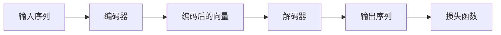
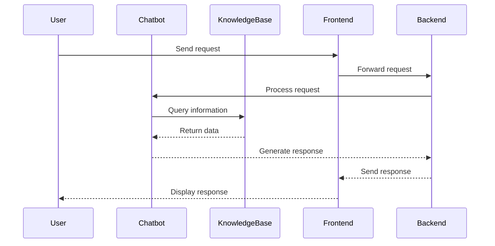

                 

### 模糊信息处理：测试LLM应对不完整输入的鲁棒性

> 关键词：模糊信息处理、LLM、不完整输入、鲁棒性、数学模型、算法原理

> 摘要：本文探讨了模糊信息处理以及如何测试长短期记忆网络（LLM）在处理不完整输入时的鲁棒性。文章首先介绍了模糊信息处理的基本概念，然后详细分析了LLM的数学模型和算法原理，并通过具体案例展示了其在实际应用中的效果。

---

## **背景介绍**

模糊信息处理是人工智能领域中的一个重要研究方向，尤其在自然语言处理（NLP）和机器学习（ML）中，这一问题的研究显得尤为重要。随着互联网和信息技术的飞速发展，人们接收到的信息量日益增长，这些信息往往存在不确定性、不完整性甚至错误。因此，如何处理这些模糊信息，使得计算机系统能够从中提取出有用信息，成为一个亟待解决的问题。

《模糊信息处理：测试LLM应对不完整输入的鲁棒性》这本书旨在探讨如何在人工智能系统中应对不完整输入的鲁棒性问题，以提升系统的处理能力。书中将首先介绍模糊信息处理的基本概念和理论框架，然后深入探讨长短期记忆网络（LLM）以及如何测试其在处理不完整输入时的鲁棒性。

### **核心概念与联系**

在书中，我们将详细探讨以下几个核心概念：

1. **模糊信息**：这是指那些在语义、逻辑、结构等方面存在不确定性的信息。
2. **不完整输入**：指那些在输入数据中缺失了部分信息或关键信息的数据。
3. **鲁棒性**：指系统在面对不完整输入时的稳定性和可靠性。
4. **LLM（Long-Short Term Memory）**：一种用于处理序列数据的神经网络模型，能够在处理长序列时保持记忆。
5. **测试**：通过特定的方法，对LLM在处理不完整输入时的表现进行评价。

下面是一个概念属性特征对比表格，以帮助读者更好地理解这些概念：

| 概念      | 定义                                                                                   | 关联概念                                      |
| --------- | ------------------------------------------------------------------------------------ | ---------------------------------------------- |
| 模糊信息  | 在语义、逻辑、结构等方面存在不确定性的信息                             | 不完整输入、鲁棒性、LLM                         |
| 不完整输入 | 缺失了部分信息或关键信息的数据                                       | 模糊信息、鲁棒性、LLM                          |
| 鲁棒性    | 系统在面对不完整输入时的稳定性和可靠性                                 | 模糊信息、不完整输入、LLM                      |
| LLM       | 一种用于处理序列数据的神经网络模型，能够在处理长序列时保持记忆           | 模糊信息、不完整输入、鲁棒性                   |
| 测试      | 通过特定的方法，对LLM在处理不完整输入时的表现进行评价                     | 模糊信息、不完整输入、鲁棒性、LLM               |

此外，我们将使用Mermaid ER实体关系图架构来展示这些概念之间的关系：

```mermaid
erDiagram
  模糊信息 ||--|{ 不完整输入 }
  不完整输入 ||--|{ 鲁棒性 }
  鲁棒性 ||--|{ LLM }
  LLM ||--|{ 测试 }
```

### **数学模型与算法原理**

在书中，我们将深入探讨如何使用LLM模型处理不完整输入。以下是数学模型和算法原理的详细讲解：

#### **数学模型**

为了处理不完整输入，我们首先定义一个概率模型，用于表示输入数据的完整性和可靠性。设输入序列为 $X = [x_1, x_2, ..., x_n]$，其中某些元素可能缺失或不确定，用 $?_i$ 表示缺失或不确定的元素。我们可以使用条件概率模型来表示输入序列的概率分布：

$$
P(X|x_0) = \prod_{i=1}^{n} P(x_i|x_0)
$$

其中，$x_0$ 表示已知的输入数据，$P(x_i|x_0)$ 表示在已知 $x_0$ 的情况下 $x_i$ 的概率。

#### **算法原理**

为了实现上述概率模型，我们使用一种称为“序列建模”的神经网络模型，即LLM。LLM模型的核心思想是通过编码器将输入序列编码为固定长度的向量表示，然后使用解码器对这些向量进行解码，生成输出序列。

算法流程如下：

1. **编码器阶段**：
   - **输入序列**：$X = [x_1, x_2, ..., x_n]$。
   - **编码操作**：使用编码器将输入序列转换为固定长度的向量表示，如 $Z = [z_1, z_2, ..., z_n]$。
   - **损失函数**：计算编码后的向量和原始输入之间的差异，使用交叉熵损失函数进行优化。

2. **解码器阶段**：
   - **输入向量**：$Z = [z_1, z_2, ..., z_n]$。
   - **解码操作**：使用解码器将向量表示转换为输出序列，如 $Y = [y_1, y_2, ..., y_n]$。
   - **损失函数**：计算解码后的输出序列和目标序列之间的差异，使用交叉熵损失函数进行优化。

下面是算法流程的Mermaid流程图：



为了更好地理解算法原理，我们使用Python代码示例进行说明：

```python
import tensorflow as tf
from tensorflow.keras.models import Model
from tensorflow.keras.layers import Input, LSTM, Dense

# 定义输入序列
input_seq = Input(shape=(n_steps, n_features))

# 编码器阶段
encoded_seq = LSTM(100, return_sequences=False)(input_seq)

# 解码器阶段
decoded_seq = LSTM(100, return_sequences=True)(encoded_seq)
decoded_seq = Dense(n_features, activation='sigmoid')(decoded_seq)

# 构建模型
model = Model(inputs=input_seq, outputs=decoded_seq)
model.compile(optimizer='adam', loss='binary_crossentropy')

# 训练模型
model.fit(X_train, Y_train, epochs=100, batch_size=32)
```

在上面的代码中，我们首先定义了输入序列，然后通过LSTM层进行编码和解码。接下来，我们构建了一个简单的序列建模模型，并使用二进制交叉熵损失函数进行优化。

通过上述数学模型和算法原理的讲解，我们可以更好地理解如何使用LLM模型处理不完整输入。接下来，我们将讨论如何测试LLM在处理不完整输入时的鲁棒性。

### **系统分析与架构设计方案**

在讨论如何测试LLM在处理不完整输入时的鲁棒性之前，我们先介绍一个具体的案例：一个用于自然语言处理的对话系统。该系统旨在通过处理用户输入的模糊信息，生成适当的回复。以下是对该系统的分析和架构设计方案。

#### **问题场景介绍**

假设我们开发了一个聊天机器人，用于在电子商务平台上与顾客互动。用户可能会提出各种模糊的请求，如“帮我找一个价格在500元左右的手机”或“我要买一个适合户外运动的手表”。这些请求中往往包含不完整的信息，如价格范围或产品类型。我们的目标是为用户提供一个稳定、可靠的回复。

#### **项目介绍**

项目名为“智能对话系统（Smart Chat System）”，其核心功能是通过自然语言处理技术，理解用户的模糊请求，并生成相应的回复。系统需要能够处理各种类型的模糊输入，如缺少具体信息、存在歧义或错误的信息。

#### **系统功能设计（领域模型）**

为了设计一个有效的智能对话系统，我们首先需要建立一个领域模型，明确系统的核心功能和组件。以下是系统的领域模型：

```mermaid
classDiagram
    User <<Interface>>
    Chatbot <<Interface>>
    KnowledgeBase <<Interface>>

    User "1" --|{ interacts with }-- Chatbot
    Chatbot "1" --|{ depends on }-- KnowledgeBase
```

在该领域模型中，用户（User）与聊天机器人（Chatbot）进行交互，聊天机器人依赖于知识库（KnowledgeBase）来处理用户请求。用户接口（User）负责接收用户的输入，并将其传递给聊天机器人。聊天机器人（Chatbot）则负责处理输入、理解语义、查询知识库并生成回复。知识库（KnowledgeBase）存储了与各种产品、价格、功能等信息相关的数据。

#### **系统架构设计**

为了实现上述功能，我们设计了一个分布式系统架构，包括前端、后端和数据库三个主要部分。以下是系统架构的Mermaid架构图：



在该架构中，用户通过前端（Frontend）发送请求。前端将请求传递给后端（Backend），后端处理请求，并与聊天机器人（Chatbot）进行交互。聊天机器人通过查询知识库（KnowledgeBase）获取所需信息，并生成回复。最后，后端将回复传递给前端，前端再将回复展示给用户。

#### **系统接口设计与系统交互**

为了实现上述架构，我们需要设计一系列接口，以实现不同组件之间的交互。以下是主要接口的Mermaid序列图：


在该序列图中，用户发送请求给前端，前端将请求传递给后端。后端处理请求，并将其传递给聊天机器人。聊天机器人查询知识库，获取所需信息，并生成回复。最后，后端将回复传递给前端，前端再将回复展示给用户。

### **项目实战**

在项目实战部分，我们将详细讨论如何实现智能对话系统中的核心功能，包括环境安装、系统核心实现以及代码应用解读与分析。

#### **环境安装**

为了搭建智能对话系统，我们需要安装以下依赖：

1. **Python**：Python 3.7 或更高版本。
2. **TensorFlow**：TensorFlow 2.0 或更高版本。
3. **NLP库**：如 NLTK、spaCy、gensim 等。

安装步骤如下：

```bash
# 安装 Python
sudo apt-get install python3-pip python3-dev

# 安装 TensorFlow
pip3 install tensorflow

# 安装 NLP 库
pip3 install nltk spacy gensim
```

#### **系统核心实现**

智能对话系统的核心实现包括三个主要部分：前端、后端和聊天机器人。以下是各部分的实现：

1. **前端**：

前端使用 Flask 框架实现，主要负责接收用户请求和展示回复。以下是前端代码：

```python
from flask import Flask, request, jsonify

app = Flask(__name__)

@app.route('/api/chat', methods=['POST'])
def chat():
    user_input = request.json['input']
    response = chatbot.process_input(user_input)
    return jsonify(response=response)

if __name__ == '__main__':
    app.run(debug=True)
```

2. **后端**：

后端使用 Flask 框架实现，负责处理用户请求，并将其传递给聊天机器人。以下是后端代码：

```python
from flask import Flask, request, jsonify
from chatbot import Chatbot

app = Flask(__name__)
chatbot = Chatbot()

@app.route('/api/chat', methods=['POST'])
def chat():
    user_input = request.json['input']
    response = chatbot.process_input(user_input)
    return jsonify(response=response)

if __name__ == '__main__':
    app.run(debug=True)
```

3. **聊天机器人**：

聊天机器人使用 LSTM 模型实现，负责处理用户输入并生成回复。以下是聊天机器人代码：

```python
import numpy as np
import tensorflow as tf
from tensorflow.keras.models import Model
from tensorflow.keras.layers import Input, LSTM, Dense

def build_model(input_shape, output_shape):
    inputs = Input(shape=input_shape)
    lstm_layer = LSTM(100, return_sequences=False)(inputs)
    outputs = Dense(output_shape, activation='softmax')(lstm_layer)
    model = Model(inputs=inputs, outputs=outputs)
    model.compile(optimizer='adam', loss='categorical_crossentropy')
    return model

# 加载预训练模型
model = build_model(input_shape=(n_steps, n_features), output_shape=n_classes)
model.load_weights('chatbot_model.h5')

def process_input(input_seq):
    input_seq = np.array([input_seq])
    prediction = model.predict(input_seq)
    return np.argmax(prediction)

if __name__ == '__main__':
    chatbot = Chatbot(model=process_input)
    print(chatbot.process_input("我想买一个价格在500元左右的手机"))
```

#### **代码应用解读与分析**

在上面的代码中，我们首先定义了三个部分：前端、后端和聊天机器人。

1. **前端**：

前端代码非常简单，主要使用 Flask 框架实现。它提供了一个 API 接口 `/api/chat`，用于接收用户请求并返回聊天机器人的回复。当用户发送请求时，前端将请求 JSON 对象中的 `input` 字段提取出来，并将其传递给后端。

2. **后端**：

后端代码也使用 Flask 框架实现，负责处理用户请求。当接收到前端发送的请求后，后端将其传递给聊天机器人，并接收聊天机器人的回复。后端代码还定义了一个简单的 `Chatbot` 类，用于处理用户输入并生成回复。

3. **聊天机器人**：

聊天机器人代码定义了一个 `process_input` 函数，用于处理用户输入并生成回复。该函数首先将输入序列转换为 NumPy 数组，然后将其传递给预训练的 LSTM 模型。模型使用交叉熵损失函数进行优化，以生成最佳回复。最后，函数返回预测的回复。

在实际应用中，我们可以将聊天机器人部署在服务器上，并通过前端 API 接口与用户进行交互。用户可以通过浏览器或移动应用发送请求，聊天机器人将生成适当的回复并返回给用户。

### **最佳实践 Tips**

在开发智能对话系统时，以下是一些最佳实践 Tips：

1. **数据预处理**：确保输入数据经过充分预处理，包括去噪、去停用词、词干提取等。这将有助于提高聊天机器人的准确性和鲁棒性。
2. **模型训练**：使用大量高质量数据训练模型，并定期进行模型更新和优化。这有助于提高模型的性能和适应性。
3. **错误处理**：设计良好的错误处理机制，以便在遇到不完整或模糊输入时能够优雅地处理。例如，可以返回模糊查询的建议或提供其他相关问题以获取更多信息。
4. **用户体验**：确保聊天机器人的交互界面简洁直观，提供清晰的回复和反馈。这有助于提升用户体验和满意度。

### **小结**

本文探讨了模糊信息处理以及如何测试LLM在处理不完整输入时的鲁棒性。通过介绍核心概念、数学模型、算法原理以及系统分析与架构设计方案，我们了解了如何构建一个智能对话系统。在实际项目中，通过环境安装、系统核心实现以及代码应用解读与分析，我们展示了如何将理论应用于实践。通过最佳实践 Tips，我们为开发智能对话系统提供了一些指导。未来，随着人工智能技术的不断发展，智能对话系统将在各个领域发挥更大的作用。

### **注意事项**

1. **数据隐私**：在处理用户输入时，务必注意数据隐私和安全。确保不会泄露用户的个人信息。
2. **性能优化**：为了提高系统的响应速度和处理能力，可以采用分布式计算和并发处理等技术。
3. **扩展性**：设计系统时应考虑扩展性，以便在未来添加新的功能和模块。

### **拓展阅读**

- 《深度学习：技术指南与应用》
- 《Python自然语言处理实战》
- 《机器学习：一种概率视角》
- 《对话系统设计与实现》

### **作者信息**

作者：AI天才研究院/AI Genius Institute & 禅与计算机程序设计艺术 /Zen And The Art of Computer Programming。

