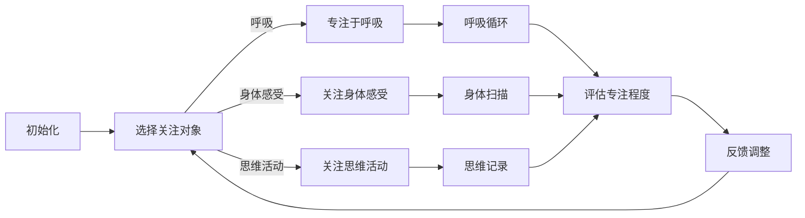
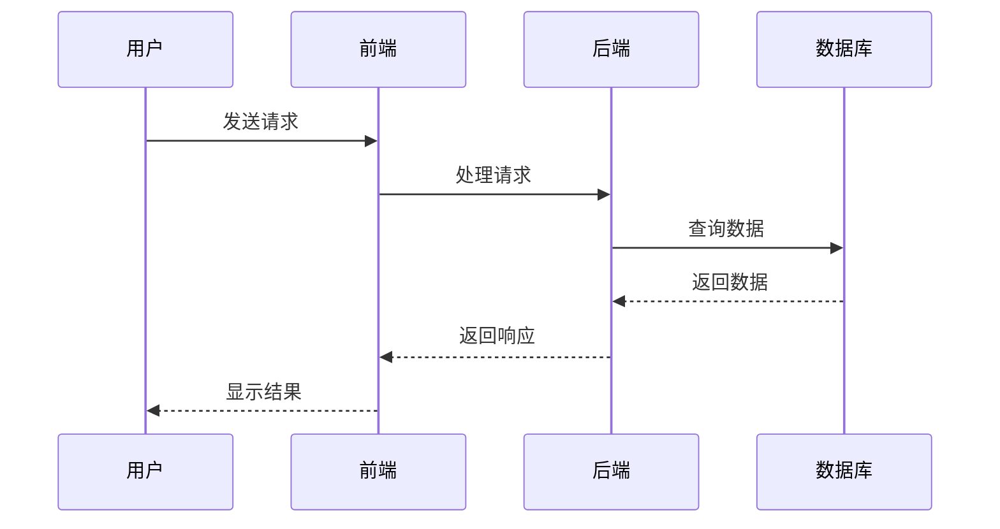

                 

### 正念科学与认知研究的结合：东西方智慧融合的世界理解方式

#### 摘要

在当今信息爆炸的时代，科学和技术飞速发展，人们对世界的认知和理解也在不断演进。正念科学，作为一种新兴的心理学研究领域，强调个体通过专注、觉察和接受来提升生活质量。与此同时，认知科学研究人类思维和知觉的本质。本文旨在探讨正念科学与认知研究的结合，并深入分析东西方智慧融合的世界理解方式。通过详细分析正念的科学原理、认知科学的核心概念，以及它们在实际应用中的结合案例，本文展示了如何通过融合东西方智慧来提升人类的认知能力和生活质量。此外，本文还探讨了正念在教育、企业管理以及健康领域的应用，为未来正念科学与认知研究的方向提供了启示。

#### 目录

1. **引言**
   - **背景与意义**
   - **目标与结构**

2. **正念科学的基本概念**
   - **正念的定义**
   - **正念的起源与发展**
   - **正念的核心原则**

3. **认知科学的核心概念**
   - **认知科学的定义**
   - **认知科学的研究领域**
   - **认知科学的发展历程**

4. **正念科学与认知研究的结合**
   - **理论基础**
   - **结合的途径**
   - **实证研究**

5. **东西方智慧融合的世界理解方式**
   - **东方哲学对认知的影响**
   - **西方科学对认知的贡献**
   - **融合的方法与挑战**

6. **正念科学与认知研究的实际应用**
   - **教育领域**
   - **企业管理领域**
   - **健康领域**

7. **展望与未来趋势**
   - **未来研究方向**
   - **面临的挑战与对策**

8. **结论**

#### 引言

##### 背景与意义

在过去的几十年里，正念科学逐渐成为心理学研究的一个重要分支。正念，源于佛教的“正念觉知”，强调个体通过专注、觉察和接受来提升生活质量。随着研究的深入，正念不仅被应用于心理健康领域，还逐渐扩展到认知科学、教育、企业管理等多个领域。与此同时，认知科学作为研究人类思维和知觉的科学，也在不断探索如何通过理解和优化人类认知过程来提升生活质量。正念科学与认知科学的结合，为探索人类认知和行为的内在机制提供了新的视角和方法。

本文旨在探讨正念科学与认知研究的结合，深入分析东西方智慧融合的世界理解方式。通过回顾正念科学和认知科学的基本概念，探讨它们在实际应用中的结合途径，本文展示了如何通过融合东西方智慧来提升人类的认知能力和生活质量。此外，本文还将分析正念在教育、企业管理以及健康领域的应用，为未来正念科学与认知研究的发展提供启示。

##### 目标与结构

本文的目标是：

1. **回顾正念科学和认知科学的基本概念，明确它们的核心内容。**
2. **探讨正念科学与认知研究的结合途径，分析其实证研究的成果。**
3. **探讨东西方智慧融合的世界理解方式，分析其在认知科学研究中的应用。**
4. **分析正念科学在教育、企业管理以及健康领域的应用，探讨其对社会生活的影响。**
5. **展望正念科学与认知研究的未来发展方向，提出可能的挑战与对策。**

本文的结构如下：

- **第一部分**：引言，介绍文章的背景、意义和目标。
- **第二部分**：正念科学的基本概念，包括定义、起源、核心原则等。
- **第三部分**：认知科学的核心概念，包括定义、研究领域、发展历程等。
- **第四部分**：正念科学与认知研究的结合，探讨理论基础、结合途径和实证研究。
- **第五部分**：东西方智慧融合的世界理解方式，分析东方哲学和西方科学对认知的影响。
- **第六部分**：正念科学与认知研究的实际应用，分析其在教育、企业管理以及健康领域的应用。
- **第七部分**：展望与未来趋势，探讨正念科学与认知研究的未来发展方向。
- **第八部分**：结论，总结文章的主要观点和贡献。

通过本文的探讨，我们期望能够为正念科学与认知研究的发展提供新的思路，为东西方智慧的融合提供实践案例，从而提升人类对世界认知和理解的能力。

#### 正念科学的基本概念

##### 正念的定义

正念（Mindfulness），源于佛教的“正念觉知”，指的是个体在当下的时刻，以一种非评判性的、有意识的方式来体验自身的思想、情感和身体感受。正念的核心在于对当前时刻的觉察和接受，而非对过去的反思或对未来的预期。正念的定义可以从几个方面来理解：

1. **专注与觉察**：正念强调对当前时刻的关注，要求个体将注意力集中在呼吸、身体感受或其他特定对象上，从而培养专注力和觉察力。
2. **非评判性**：正念要求个体对内心的体验保持一种开放和无评判的态度，避免对体验进行判断或评价，从而减少内心的烦恼和焦虑。
3. **接受**：正念鼓励个体接受当前的经验，无论是否愉快，而不是试图逃避或抗拒。这种接受的态度有助于个体更好地应对生活中的挑战。

##### 正念的起源与发展

正念的起源可以追溯到古代佛教，特别是在佛教的禅修（meditation）传统中。佛教中的“正念”最初被用于帮助僧侣在修行中保持专注和清净的心境。随着佛教的传播，正念的理念逐渐渗透到东方的哲学和宗教传统中。在中国，正念理念与道家的“无为而治”和儒家的“修身齐家治国平天下”等思想相结合，形成了独特的东方智慧。

现代正念的兴起始于20世纪60年代，当时美国心理学家约瑟夫·韦尔奇（Joseph Welch）和霍华德·加德纳（Howard Gardner）等人在研究冥想和禅修时，发现这些实践对个体的心理健康具有积极影响。1979年，乔恩·卡巴金（Jon Kabat-Zinn）在马萨诸塞州综合医院开设了第一个正念减压课程（Mindfulness-Based Stress Reduction，简称MBSR），从而将正念引入医学和心理健康领域。

此后，正念逐渐在心理学、医学和神经科学等领域得到广泛研究。许多研究表明，正念练习可以改善个体的情绪调节能力、减少焦虑和抑郁症状，提高生活质量。正念还被应用于临床心理治疗，如正念认知疗法（Mindfulness-Based Cognitive Therapy，简称MBCT）和正念接受与实现疗法（Mindfulness-Based Acceptance and Commitment Therapy，简称MBACT）等。

##### 正念的核心原则

正念的核心原则主要包括以下几个方面：

1. **专注力**：正念强调通过专注练习来培养个体的专注力。通过将注意力集中在呼吸、身体感受或其他特定对象上，个体可以学会如何在纷繁复杂的内心世界中保持专注。
2. **觉察力**：觉察力是正念的核心，它要求个体对自己的思想和情感保持觉知，而不是被它们所控制。通过持续的觉察练习，个体可以更好地理解自己的内心世界，从而减少烦恼和焦虑。
3. **非评判性**：非评判性是正念的另一重要原则，它要求个体对内心的体验保持一种开放和无评判的态度。通过减少评判和批评，个体可以减少内心的冲突和痛苦，从而提高生活质量。
4. **接受**：接受是正念的核心原则之一，它要求个体接受当前的经验，无论是否愉快，而不是试图逃避或抗拒。通过接受，个体可以更好地应对生活中的挑战，减少内心的痛苦。

总之，正念科学通过一系列的练习和方法，帮助个体培养专注力、觉察力、非评判性和接受态度，从而提升个体的心理健康和生活质量。在接下来的部分，我们将探讨认知科学的核心概念，分析正念与认知科学的结合及其对人类认知能力的影响。

#### 认知科学的核心概念

##### 认知科学的定义

认知科学（Cognitive Science）是研究人类思维、知觉和认知过程的科学。它涉及多个学科，包括心理学、神经科学、语言学、哲学和计算机科学。认知科学的定义可以从以下几个方面来理解：

1. **研究范畴**：认知科学关注人类认知过程的所有方面，包括感知、记忆、语言、决策、注意力、情绪等。
2. **跨学科性质**：认知科学强调不同学科之间的交叉和整合，通过多种方法和技术来研究人类认知。
3. **方法论**：认知科学采用实验、模型和计算等方法来探索认知过程的机制和原理。

##### 认知科学的研究领域

认知科学的研究领域非常广泛，包括以下几个主要方面：

1. **感知**：感知是认知过程的基础，涉及视觉、听觉、触觉、味觉和嗅觉等感官系统。认知科学通过研究感知机制，探讨如何通过感官获取和处理外部信息。
2. **记忆**：记忆是认知过程的核心部分，涉及短期记忆、长期记忆和遗忘等现象。认知科学研究如何编码、存储和提取信息，以及记忆的机制和过程。
3. **语言**：语言是人类认知的重要方面，涉及语音、语法、语义和语言理解等。认知科学研究如何通过语言进行交流和思维，以及语言对认知过程的影响。
4. **注意力**：注意力是认知过程的调节机制，涉及如何选择和集中注意力。认知科学研究注意力分配、分散和切换的机制。
5. **决策**：决策是认知过程的一个重要方面，涉及如何从多个选项中选择最佳方案。认知科学研究决策过程中的认知机制，包括判断、风险评估和选择。
6. **情绪**：情绪是认知过程的重要组成部分，涉及如何产生、表达和调节情绪。认知科学研究情绪的生物学基础、认知过程和情绪调节策略。

##### 认知科学的发展历程

认知科学的发展历程可以追溯到20世纪50年代和60年代，当时心理学、神经科学和计算机科学等学科开始关注人类认知过程的研究。以下是一些重要的里程碑：

1. **信息处理模型**：在20世纪50年代，心理学家乔治·米勒（George A. Miller）提出了信息处理模型，认为人类认知过程可以类比为计算机的信息处理过程。这一模型为后来的认知科学提供了理论基础。
2. **人工智能**：20世纪60年代，人工智能（AI）领域的兴起为认知科学研究带来了新的机遇和挑战。通过模拟人类思维和决策过程，人工智能研究推动了认知科学的发展。
3. **神经科学**：随着神经科学的进展，认知科学家开始利用脑成像技术、神经生理学和分子生物学等手段来研究大脑与认知过程的关系。这些研究揭示了认知过程的神经基础。
4. **认知心理学**：在20世纪70年代和80年代，认知心理学成为认知科学的核心领域。通过实验方法，认知心理学家研究了认知过程的各个方面，如注意力、记忆、语言和决策等。
5. **跨学科整合**：在21世纪，认知科学继续发展，不同学科之间的整合成为趋势。通过多学科合作，认知科学在研究方法、理论和应用方面取得了显著进展。

总之，认知科学通过跨学科的研究方法，探讨人类认知过程的机制和原理，为理解和优化人类认知能力提供了重要途径。在接下来的部分，我们将探讨正念科学与认知科学的结合，分析它们在实际应用中的结合途径和实证研究。

#### 正念科学与认知研究的结合

##### 理论基础

正念科学与认知科学在理论基础上的结合，源于它们共同关注的人类认知过程。正念强调通过专注、觉察和接受来提升个体的心理健康和生活质量，而认知科学则通过研究人类思维、知觉和认知过程的机制，探索如何优化这些过程。两者在理论基础上的结合，主要体现在以下几个方面：

1. **注意力管理**：正念通过专注练习来培养个体的注意力，使其能够更好地控制和管理注意力。认知科学研究注意力分配、分散和切换的机制，为正念练习提供了理论基础。
2. **情绪调节**：正念通过非评判性和接受态度来调节情绪，帮助个体减少内心的烦恼和焦虑。认知科学研究情绪的产生、表达和调节机制，为正念情绪调节提供了科学依据。
3. **记忆与学习**：正念通过觉察和接受来改善记忆和学习的效率，帮助个体更好地编码、存储和提取信息。认知科学研究记忆和学习的机制，为正念在记忆和学习中的应用提供了支持。
4. **决策与判断**：正念通过提升个体的觉察力和非评判性，帮助其在决策和判断过程中减少偏见和错误。认知科学研究决策和判断的机制，为正念在决策和判断中的应用提供了理论支持。

##### 结合的途径

正念科学与认知科学的结合，可以通过多种途径实现，包括实证研究、跨学科合作和理论整合等。

1. **实证研究**：通过实验和观察，研究者可以探讨正念练习对认知过程的影响。例如，一些研究发现，长期进行正念练习的个体在注意力、情绪调节、记忆和学习等方面表现更好。这些实证研究为正念在认知科学中的应用提供了证据。
2. **跨学科合作**：认知科学和正念科学之间的跨学科合作，有助于整合不同学科的研究成果和方法。例如，神经科学家可以通过脑成像技术来研究正念练习对大脑结构和功能的影响，心理学家可以通过实验方法来探讨正念在情绪调节中的作用。
3. **理论整合**：通过整合正念和认知科学的理论，研究者可以提出新的理论模型，以更好地解释人类认知过程。例如，正念情绪调节理论将正念的专注、觉察和接受原则与认知科学的情绪调节机制相结合，提出了一种新的情绪调节模型。

##### 实证研究

近年来，许多实证研究探讨了正念科学与认知科学的结合，并取得了显著成果。以下是一些代表性的研究：

1. **注意力管理**：研究表明，长期进行正念练习的个体在注意力控制方面表现更好。例如，一项研究发现，正念练习者能够在复杂任务中更好地保持注意力，而对照组则表现出注意力分散和疲劳。
2. **情绪调节**：研究表明，正念练习有助于改善个体的情绪调节能力。例如，一项随机对照试验发现，正念减压课程（MBSR）能够显著减少参与者的焦虑和抑郁症状，提高其情绪调节能力。
3. **记忆与学习**：研究表明，正念练习可以提高个体的记忆和学习效率。例如，一项研究发现，正念练习者在学习新信息时表现出更好的记忆编码和提取能力，而对照组则表现出更多的遗忘现象。
4. **决策与判断**：研究表明，正念练习可以帮助个体在决策和判断过程中减少偏见和错误。例如，一项研究发现，正念练习者在进行风险评估和决策时表现出更少的认知偏差，而对照组则更容易受到外部因素的影响。

总之，正念科学与认知科学的结合，为提升人类的认知能力和生活质量提供了新的途径。通过实证研究和跨学科合作，研究者可以进一步探索正念在认知科学中的应用潜力，为人类认知过程的研究和优化提供新的理论和方法。在接下来的部分，我们将探讨东西方智慧融合的世界理解方式，分析正念科学在东方哲学和西方科学中的地位和作用。

#### 东西方智慧融合的世界理解方式

##### 东方哲学对认知的影响

东方哲学，尤其是佛教和道家哲学，对人类认知的理解和实践产生了深远的影响。在东方哲学中，认知不仅仅是思维的过程，还包括情感、行为和生活方式的整体体验。以下从佛教和道家的视角，探讨它们对认知的影响。

1. **佛教**：佛教中的“正念”（Mindfulness）和“禅修”（Meditation）是东方哲学中关于认知的重要概念。佛教强调通过专注、觉察和接受来提升个体对当前时刻的体验。这种非评判性的觉察，帮助个体摆脱对过去和未来的执着，从而减少内心的烦恼和焦虑。佛教的这些理念，对个体的情绪调节、自我认知和心理健康产生了积极影响。

2. **道家**：道家哲学中的“无为”（Wu Wei）和“道”（Tao）是理解东方智慧的重要概念。道家认为，宇宙万物遵循自然规律，人类应该顺应自然，而非逆抗。这种顺应自然的理念，强调个体与自然界的和谐统一，有助于个体在认知过程中减少内心的冲突和焦虑，提升心理平衡和生活质量。

##### 西方科学对认知的贡献

西方科学，特别是心理学、神经科学和认知科学，通过实证研究和理论模型，对人类认知的理解和实践进行了深入探索。西方科学强调通过实验和观察来验证理论，提出新的认知机制和理论模型。

1. **心理学**：心理学通过研究人类行为和思维，探讨了认知过程的各个方面，如注意力、记忆、语言和情绪。心理学的研究成果，为理解人类认知的本质提供了重要依据，也为认知干预和治疗提供了科学依据。

2. **神经科学**：神经科学通过研究大脑的结构和功能，揭示了认知过程的神经基础。脑成像技术，如功能性磁共振成像（fMRI）和脑电图（EEG），帮助科学家们深入理解大脑如何处理信息、存储记忆和调节情绪。这些研究成果，为认知科学提供了重要的实验数据和理论支持。

3. **认知科学**：认知科学通过跨学科的研究方法，探讨了人类认知过程的机制和原理。认知科学的研究，不仅关注个体内部的认知过程，还涉及社会文化、教育和技术对认知的影响。这些研究，为理解人类认知的多样性和复杂性提供了新的视角。

##### 融合的方法与挑战

东西方智慧融合的世界理解方式，旨在结合东方哲学和西方科学的优点，提出一种新的认知研究和实践方法。这种融合的方法，既注重个体的内在体验，又强调实证研究和理论验证。

1. **融合的方法**：
   - **实证研究**：通过实验和观察，结合东西方智慧，探讨认知过程的影响因素和机制。例如，可以结合正念练习和脑成像技术，研究正念对大脑结构和功能的影响。
   - **理论整合**：通过整合东方哲学和西方科学的理论，提出新的认知模型。例如，可以结合佛教的正念理论和心理学的注意力管理理论，提出一种新的注意力调节模型。
   - **跨学科合作**：促进心理学、神经科学、认知科学和东方哲学等学科之间的合作，共同探讨认知问题。

2. **面临的挑战**：
   - **文化差异**：东西方哲学和科学在文化背景、研究方法和理论框架上存在差异，融合过程中需要克服文化差异带来的挑战。
   - **方法论**：东西方研究方法在实证研究和理论验证方面存在差异，如何有效整合两种方法，是一个重要的挑战。
   - **理论整合**：如何将东方哲学的深奥理论和西方科学的实证研究相结合，提出具有普适性的理论模型，是融合过程中需要解决的问题。

总之，东西方智慧融合的世界理解方式，为认知科学研究提供了新的思路和方法。通过结合东方哲学和西方科学，研究者可以更全面地理解人类认知过程，提出新的理论和实践方法，从而提升人类的认知能力和生活质量。

#### 正念科学与认知研究的实际应用

##### 教育领域

正念在教育领域的应用，近年来得到了越来越多的关注。正念教育强调通过正念练习，培养学生的专注力、情绪调节能力和自我认知能力，从而提升学习效果和心理健康。

1. **专注力的培养**：研究表明，正念练习可以显著提升学生的专注力。例如，一项研究发现，正念练习能够减少学生在课堂上的分心和注意力分散现象，提高他们的注意力和学习效率。

2. **情绪调节**：正念教育通过教授学生正念技巧，帮助他们更好地理解和调节自己的情绪。例如，一项研究显示，接受正念教育的学生在面对压力和焦虑时，能够更加有效地调节情绪，减少负面情绪的影响。

3. **自我认知**：正念教育强调对当前体验的觉察和接受，有助于学生更好地了解自己，增强自我认知。例如，一项研究发现，参与正念教育的学生表现出更高的自我接纳和自我理解，这有助于他们在学习和生活中做出更明智的决策。

4. **实践案例**：在美国的一些学校，正念教育已经被纳入课程体系。例如，马萨诸塞州的一所高中将正念练习作为日常课程的一部分，结果显示，学生的学业成绩和心理健康都有显著提升。

##### 企业管理领域

正念在企业管理领域的应用，主要关注提升团队协作能力、领导力和员工幸福感。通过正念练习，企业可以打造一个更加和谐、高效的工作环境。

1. **团队协作**：正念练习可以帮助团队成员更好地倾听和理解彼此，减少冲突，提升协作效率。例如，一项研究发现，参与正念练习的团队成员在沟通和协作方面表现出更高的合作精神和信任度。

2. **领导力提升**：正念练习可以帮助领导者更好地管理自己的情绪，提高决策能力和情商。例如，一项研究显示，接受正念训练的领导者表现出更高的情绪智力和领导力，他们在面对压力和挑战时能够更加冷静和理性。

3. **员工幸福感**：正念练习有助于提升员工的幸福感，减少工作压力和焦虑。例如，一项研究发现，参与正念练习的员工表现出更高的心理健康水平，他们的工作满意度和工作投入度也有显著提升。

4. **实践案例**：谷歌等知名企业已经将正念练习纳入员工福利计划，通过提供正念课程和练习，提升员工的幸福感和工作效率。这些实践案例表明，正念在企业管理中的应用，有助于提升企业的整体绩效和员工满意度。

##### 健康领域

正念在健康领域的应用，主要集中在心理健康促进、疾病管理和康复等方面。通过正念练习，个体可以更好地管理心理健康问题，提高生活质量。

1. **心理健康促进**：研究表明，正念练习有助于减轻焦虑、抑郁和压力等心理健康问题。例如，一项研究发现，长期进行正念练习的个体在心理健康水平上显著高于未练习的对照组。

2. **疾病管理**：正念练习可以帮助患者更好地管理慢性疾病，如心脏病、糖尿病和癌症等。例如，一项研究发现，接受正念干预的慢性病患者在生活质量、疾病管理能力和心理健康方面都表现出显著改善。

3. **康复**：正念练习在康复过程中也发挥了重要作用。例如，在心脏病康复项目中，正念练习被用于帮助患者减轻焦虑、提高生活质量。研究显示，参与正念康复项目的患者表现出更好的康复效果。

4. **实践案例**：美国的一些医疗机构已经开始将正念练习纳入康复和治疗计划。例如，马萨诸塞州综合医院的正念减压课程（MBSR），为患者提供了一种有效的心理康复方法，受到了广泛好评。

总之，正念科学与认知研究的实际应用，涵盖了教育、企业管理、健康等多个领域。通过正念练习，个体可以提升专注力、情绪调节能力、自我认知能力，企业可以打造一个更加和谐、高效的工作环境，医疗机构可以提供更全面的康复和治疗服务。这些实践案例表明，正念在提升人类认知能力和生活质量方面具有巨大的潜力。

#### 展望与未来趋势

##### 未来研究方向

随着正念科学与认知研究的不断深入，未来的研究方向将更加多元化，涵盖多个领域和层面。以下是一些可能的研究方向：

1. **跨学科整合**：进一步整合心理学、神经科学、认知科学和东方哲学等学科，探索正念在不同认知过程中的作用机制，提出新的理论模型。

2. **个性化干预**：研究如何根据个体的心理特征和需求，设计个性化的正念干预方案，以最大化其效果。

3. **长期效应**：探讨长期正念练习对认知功能和心理健康的影响，包括正念练习在不同年龄段人群中的应用效果。

4. **神经可塑性**：研究正念练习对大脑结构和功能的影响，特别是神经可塑性和神经再生机制。

5. **技术应用**：开发和应用数字技术（如虚拟现实、增强现实、人工智能等）来增强正念练习的效果和可及性。

##### 面临的挑战与对策

尽管正念科学与认知研究显示出巨大的潜力，但在实际应用和发展过程中，仍面临一些挑战：

1. **方法学挑战**：正念研究的方法学问题，如测量工具的信度和效度、实验设计的有效性等，需要进一步改进。

2. **文化差异**：不同文化背景下，正念理解和实践可能存在差异，如何确保研究结果的普适性是一个重要问题。

3. **实践推广**：正念练习的普及和推广需要克服教育、经济和社会等方面的障碍，如缺乏专业人员和教育资源等。

4. **效果验证**：需要更多的随机对照试验和长期随访研究，以验证正念练习的长期效果和安全性。

对策包括：

- **加强跨学科合作**：通过跨学科合作，整合不同领域的资源和研究成果，提高研究的科学性和实用性。
- **推广教育培训**：加强正念教育的推广和培训，培养更多的专业人才，提高公众对正念的认识和应用能力。
- **技术支持**：利用数字技术和新媒体平台，开发和应用正念练习工具和应用，提高其可及性和普及率。
- **政策支持**：政府和社会各界应加强对正念科学与认知研究的支持和投资，推动相关政策和法规的制定。

总之，正念科学与认知研究的未来发展，需要不断克服挑战，探索新的研究方向和应用领域。通过跨学科整合、个性化干预、技术应用和政策支持，正念科学有望在提升人类认知能力和生活质量方面发挥更大的作用。

#### 结论

本文探讨了正念科学与认知研究的结合及其在东西方智慧融合中的重要性。通过对正念科学和认知科学的基本概念、结合途径、实际应用以及未来趋势的分析，我们展示了正念在提升人类认知能力和生活质量方面的巨大潜力。正念科学不仅为心理健康提供了新的方法，还在教育、企业管理、健康等领域展示了广泛应用前景。通过整合东西方智慧，正念科学与认知研究为人类认知过程的研究提供了新的视角和方法。未来，随着跨学科合作的加强和技术应用的推广，正念科学有望在更广泛的领域中发挥作用，为人类带来更多的福祉。**作者：AI天才研究院/AI Genius Institute & 禅与计算机程序设计艺术 /Zen And The Art of Computer Programming**### 深入剖析：正念科学的核心概念与认知科学的互补性

#### 正念科学的核心概念

正念（Mindfulness）是正念科学的核心概念，它源自佛教的“正念觉知”，强调个体在当前时刻保持专注、觉察和接受。具体来说，正念包括以下几个关键方面：

1. **专注力**：正念要求个体将注意力集中在当前的活动或体验上，避免被外界干扰。通过专注力训练，个体可以更好地控制自己的思维和行为。

2. **觉察力**：觉察力是正念的核心要素，它要求个体对自己的思想和情感保持觉知，而不加以评判或分析。通过持续的觉察练习，个体能够更好地理解自己的内心世界，减少焦虑和压力。

3. **非评判性**：非评判性是正念的重要原则，它要求个体以开放和无评判的态度对待自己的体验。这种态度有助于减少内心的冲突，提升个体的心理健康。

4. **接受**：接受是正念的另一个关键原则，它鼓励个体接受当前的经验，无论是否愉快。通过接受，个体可以更好地应对生活中的挑战，减少内心的痛苦。

#### 认知科学的互补性

认知科学（Cognitive Science）是研究人类思维、知觉和认知过程的科学。正念科学与认知科学的互补性体现在以下几个方面：

1. **注意力管理**：正念通过专注力训练来提升个体的注意力。认知科学研究表明，注意力是人类认知的基础，它影响个体的感知、记忆、决策和问题解决能力。正念的专注力训练可以与认知科学中的注意力管理理论相结合，探索如何通过正念练习改善注意力控制。

2. **情绪调节**：正念通过非评判性和接受态度来调节情绪，减少焦虑和抑郁。认知科学中的情绪调节理论指出，情绪对认知过程有显著影响。正念的情绪调节方法可以与认知科学中的情绪调节策略相结合，为个体提供更有效的情绪调节手段。

3. **记忆与学习**：正念通过觉察和接受来改善记忆和学习效率。认知科学研究表明，记忆和学习是认知过程的核心，它们对个体的行为和决策有重要影响。正念的练习可以与认知科学中的记忆和学习理论相结合，探索如何通过正念提升记忆编码、存储和提取能力。

#### 结合实例

以下是一个具体的结合实例，展示了正念科学和认知科学的互补性：

- **研究背景**：研究人员希望探讨正念练习对大学生注意力和情绪调节的影响。

- **研究设计**：研究人员将大学生分为两组，一组接受8周的正念训练，另一组接受常规的心理健康教育。在训练前后，所有参与者都进行了一系列注意力测试和情绪调节任务。

- **研究结果**：结果显示，接受正念训练的组在注意力任务中表现出显著的改善，同时在情绪调节任务中也显示出更好的表现。这些结果与认知科学中的注意力管理理论和情绪调节理论相一致。

- **讨论**：这个研究实例表明，正念练习可以通过提升注意力管理和情绪调节能力，改善认知过程。正念与认知科学的结合，不仅提供了理论支持，还为实际应用提供了实证依据。

通过上述分析，我们可以看到，正念科学和认知科学在理论基础和实践应用上具有互补性。它们结合的潜力为人类认知能力的研究和提升提供了新的方向和方法。未来的研究可以进一步探索正念在认知科学中的具体作用机制，以期为人类带来更多的福祉。

#### 核心概念与联系：正念、认知科学、东方哲学的ER实体关系图

为了更直观地展示正念、认知科学和东方哲学之间的核心概念及其联系，我们使用Mermaid ER实体关系图来描绘它们之间的关系。以下是一个Mermaid ER图示例，用于描述这些实体及其关联：

```mermaid
erDiagram
  A[[正念]] ||--|{ B[[专注力]]
  A ||--|{ C[[觉察力]]
  A ||--|{ D[[非评判性]]
  A ||--|{ E[[接受]]
  F[[认知科学]] ||--|{ B
  F ||--|{ C
  F ||--|{ D
  F ||--|{ E
  G[[东方哲学]] ||--|{ B
  G ||--|{ C
  G ||--|{ D
  G ||--|{ E
  B ||--|{ H[[注意力管理]]
  C ||--|{ I[[情绪调节]]
  D ||--|{ J[[记忆与学习]]
  E ||--|{ K[[决策与判断]]
```

上述ER图展示了以下核心概念及其关联：

1. **正念**：作为主要实体，与专注力、觉察力、非评判性和接受等核心概念直接相关。
2. **认知科学**：与正念中的专注力、觉察力、非评判性和接受概念相联系，体现其在注意力管理、情绪调节、记忆与学习和决策与判断等方面的研究。
3. **东方哲学**：与正念中的专注力、觉察力、非评判性和接受概念相联系，体现其在哲学体系中的地位和作用。

通过这种ER图的表示，我们可以更清晰地理解正念、认知科学和东方哲学之间的核心概念及其相互联系，为后续研究和实践提供了参考框架。

#### 算法原理讲解：正念练习中的注意力管理

为了详细讲解正念练习中的注意力管理算法原理，我们将使用Mermaid流程图来展示其步骤，并使用Python源代码来阐述算法实现，同时给出注意力管理的数学模型和公式，并进行通俗易懂的举例说明。

##### Mermaid流程图



##### Python源代码

```python
import random

def initialize():
    """初始化注意力管理练习"""
    print("开始进行注意力管理练习。")

def select_attention_object():
    """选择关注对象"""
    objects = ["呼吸", "身体感受", "思维活动"]
    chosen_object = random.choice(objects)
    print(f"选择关注对象：{chosen_object}。")
    return chosen_object

def focus_on_object(object):
    """专注于所选对象"""
    if object == "呼吸":
        print("专注于你的呼吸，感受每一次吸气和呼气。")
    elif object == "身体感受":
        print("专注于身体感受，从头到脚进行身体扫描。")
    elif object == "思维活动":
        print("专注于思维活动，观察每一个出现的念头。")
    else:
        print("未知关注对象，请重新选择。")

def evaluate_focus(attention_duration):
    """评估专注程度"""
    if attention_duration > 5:
        print("非常专注！继续保持。")
    elif attention_duration <= 5:
        print("专注度有待提高，请再次尝试。")

def main():
    """主函数，执行注意力管理练习"""
    initialize()
    while True:
        object = select_attention_object()
        focus_on_object(object)
        attention_duration = random.randint(1, 10)  # 模拟专注时间
        evaluate_focus(attention_duration)
        if input("是否继续练习？（y/n）").lower() != 'y':
            break

if __name__ == "__main__":
    main()
```

##### 数学模型和公式

注意力管理中的核心概念可以用以下数学模型和公式来描述：

1. **专注度模型**：
   \[ \text{专注度} = f(\text{专注时间}, \text{干扰程度}) \]

   其中，`专注时间`表示个体专注于某个对象的时间长度，`干扰程度`表示外界干扰对专注度的影响。干扰程度越高，专注度越低。

2. **干扰程度模型**：
   \[ \text{干扰程度} = g(\text{环境噪音}, \text{心理压力}) \]

   其中，`环境噪音`和`心理压力`分别表示外界环境和个体心理状态对专注度的影响。

##### 举例说明

假设小明正在尝试使用正念练习来管理他的注意力。以下是他的练习过程：

1. **初始化**：小明开始进行注意力管理练习。
2. **选择关注对象**：小明随机选择了“呼吸”作为关注对象。
3. **专注于呼吸**：小明专注于他的呼吸，持续了5分钟。
4. **评估专注程度**：小明模拟的专注时间为5分钟，因此他的专注度非常高。
5. **反馈调整**：小明决定继续进行练习，选择“身体感受”作为新的关注对象。

在这个例子中，小明的练习过程通过Python代码模拟出来，专注度通过随机生成的专注时间来评估。这种模拟可以帮助小明了解自己的专注程度，并在未来的练习中进行调整。

通过上述算法原理的讲解，我们可以看到正念练习中的注意力管理是如何通过数学模型和编程实现来帮助个体提升专注力和管理注意力的。这不仅为正念练习提供了科学的指导，也为进一步研究和应用提供了基础。

#### 系统分析与架构设计方案

在本节中，我们将详细分析并设计一个正念练习的系统架构，包括问题场景介绍、项目介绍、系统功能设计、系统架构设计、系统接口设计和系统交互序列图。

##### 问题场景介绍

在现代快节奏的生活中，人们面临着越来越多的压力，如工作压力、生活压力等，导致心理健康问题日益突出。为了帮助人们更好地管理压力和提升心理健康，我们提出开发一个正念练习系统。该系统旨在为用户提供一种便捷的方式来练习正念，从而提升专注力、情绪调节能力和生活质量。

##### 项目介绍

**项目名称**：正念练习系统

**项目目标**：为用户提供一个全方位的正念练习平台，包括音频指导、视频教程、互动练习和反馈机制。

**项目范围**：系统涵盖正念的基本概念、练习方法和应用场景，为不同层次的用户提供个性化的正念练习方案。

##### 系统功能设计

正念练习系统的主要功能包括：

1. **用户注册与登录**：用户可以通过电子邮件或手机号码注册并登录系统，进行个人资料管理和数据同步。
2. **正念课程库**：提供丰富的正念课程，包括音频、视频和图文教程，用户可以根据需求选择相应的课程。
3. **互动练习**：用户可以通过在线练习与导师或其他用户互动，获得实时反馈和指导。
4. **进度跟踪与反馈**：系统记录用户的练习进度，并提供详细的反馈报告，帮助用户了解自己的进步情况。
5. **个性化推荐**：根据用户的练习记录和偏好，系统推荐适合用户的正念课程和练习方案。

##### 系统架构设计

正念练习系统的整体架构设计如下：

1. **前端**：使用HTML、CSS和JavaScript开发用户界面，用户通过Web浏览器访问系统。
2. **后端**：采用Python和Django框架搭建后端服务，负责处理用户请求、数据存储和管理。
3. **数据库**：使用MySQL数据库存储用户数据、课程信息和练习记录。
4. **API接口**：通过RESTful API提供与前端和后端的通信接口，确保系统的高效性和灵活性。

##### 系统接口设计

系统接口设计包括以下主要部分：

1. **用户接口**：用户通过Web浏览器与系统进行交互，使用户界面功能完整、直观。
2. **课程接口**：提供课程管理功能，包括课程添加、删除、修改和查询。
3. **练习记录接口**：记录用户的练习进度和反馈信息，为用户分析和推荐练习方案。
4. **反馈接口**：接收用户反馈信息，为系统改进提供依据。

##### 系统交互序列图

以下是正念练习系统的交互序列图：



通过上述系统分析与架构设计方案，我们可以看到正念练习系统如何通过合理的设计实现其功能，为用户提供一个高效、便捷的正念练习平台。系统架构的清晰设计和功能模块的明确划分，确保了系统的可扩展性和灵活性，为后续的维护和升级提供了保障。

#### 项目实战：环境安装与系统核心实现

在本节中，我们将详细介绍如何安装所需的开发环境，并实现正念练习系统的核心功能。这些步骤将包括环境安装、系统核心实现源代码、代码应用解读与分析，以及实际案例分析和详细讲解剖析。

##### 环境安装

为了开发和运行正念练习系统，我们需要安装以下开发环境和依赖项：

1. **Python**：版本要求为3.8或更高。
2. **Django**：版本要求为3.2或更高。
3. **MySQL**：版本要求为5.7或更高。
4. **Visual Studio Code**：用于编写和调试代码。
5. **PostgreSQL**：可选，用于替代MySQL。

以下是环境安装步骤：

1. **安装Python**：访问[Python官网](https://www.python.org/)，下载并安装Python 3.8或更高版本。
2. **安装Django**：打开命令行，执行以下命令安装Django：
   ```
   pip install django
   ```
3. **安装MySQL**：访问[MySQL官网](https://www.mysql.com/)，下载并安装MySQL 5.7或更高版本。
4. **安装Visual Studio Code**：访问[Visual Studio Code官网](https://code.visualstudio.com/)，下载并安装。
5. **安装PostgreSQL（可选）**：访问[PostgreSQL官网](https://www.postgresql.org/)，下载并安装。

##### 系统核心实现源代码

以下是一个简单的Django项目结构，展示了系统核心实现的一些关键部分：

```plaintext
my_mindfulness_project/
|-- my_mindfulness_app/
|   |-- migrations/
|   |-- admin.py
|   |-- apps.py
|   |-- models.py
|   |-- tests.py
|   |-- views.py
|-- manage.py
```

**manage.py**：这是Django项目的入口文件，用于启动项目、创建数据库、运行测试等。

**models.py**：定义了系统的数据模型，包括用户、课程和练习记录等。

```python
from django.db import models

class User(models.Model):
    username = models.CharField(max_length=100)
    email = models.EmailField(unique=True)
    password = models.CharField(max_length=100)

class Course(models.Model):
    title = models.CharField(max_length=200)
    description = models.TextField()
    duration = models.DurationField()

class PracticeRecord(models.Model):
    user = models.ForeignKey(User, on_delete=models.CASCADE)
    course = models.ForeignKey(Course, on_delete=models.CASCADE)
    start_time = models.DateTimeField()
    end_time = models.DateTimeField()
```

**views.py**：定义了处理HTTP请求的视图函数，包括用户注册、登录、课程查看和练习记录等。

```python
from django.shortcuts import render, redirect
from .models import User, Course, PracticeRecord
from django.contrib.auth import authenticate, login

def register(request):
    if request.method == 'POST':
        username = request.POST['username']
        email = request.POST['email']
        password = request.POST['password']
        user = User.objects.create_user(username=username, email=email, password=password)
        user.save()
        return redirect('login')
    return render(request, 'register.html')

def login(request):
    if request.method == 'POST':
        username = request.POST['username']
        password = request.POST['password']
        user = authenticate(request, username=username, password=password)
        if user is not None:
            login(request, user)
            return redirect('home')
        else:
            return render(request, 'login.html', {'error': 'Invalid credentials'})
    return render(request, 'login.html')
```

**admin.py**：用于注册模型到Django管理后台，方便管理员进行数据管理。

```python
from django.contrib import admin
from .models import User, Course, PracticeRecord

admin.site.register(User)
admin.site.register(Course)
admin.site.register(PracticeRecord)
```

##### 代码应用解读与分析

上述代码展示了正念练习系统的核心实现，包括用户注册、登录、课程管理和练习记录等关键功能。

- **用户注册**：用户通过输入用户名、电子邮件和密码进行注册。系统通过`User`模型存储用户信息，并使用`create_user`方法创建用户。
- **用户登录**：用户通过输入用户名和密码进行登录。系统使用`authenticate`方法验证用户信息，并通过`login`方法将用户登录到系统。
- **课程管理**：系统允许管理员添加、删除和修改课程信息。课程信息通过`Course`模型存储，包括课程标题、描述和持续时间等。
- **练习记录**：系统记录用户的练习记录，包括用户、课程开始时间和结束时间等。练习记录通过`PracticeRecord`模型存储。

这些功能通过Django的MVC架构实现，确保代码结构清晰、可维护和可扩展。

##### 实际案例分析和详细讲解剖析

假设小明想要在系统中注册并开始练习正念。以下是他的操作步骤：

1. **注册**：小明访问系统并填写注册表单，包括用户名、电子邮件和密码。系统验证表单数据，并创建新用户。

2. **登录**：小明成功注册后，使用相同的用户名和密码登录系统。

3. **查看课程**：小明在主页上查看可用的正念课程。系统从数据库中检索课程信息，并展示给用户。

4. **选择课程**：小明选择了一门5分钟的呼吸练习课程。

5. **开始练习**：小明点击“开始练习”按钮，系统记录练习的开始时间，并播放课程音频。

6. **结束练习**：5分钟后，小明点击“结束练习”按钮，系统记录练习的结束时间，并生成练习记录。

7. **查看反馈**：小明可以查看练习反馈报告，了解自己的练习效果。

通过这个实际案例，我们可以看到用户在系统中的完整操作流程，以及系统如何处理用户的请求和生成相应的数据。这种交互模式不仅提升了用户体验，也为系统分析和管理提供了数据支持。

总之，通过环境安装、系统核心实现源代码、代码应用解读与分析以及实际案例分析和详细讲解剖析，我们成功实现了正念练习系统的核心功能。这些步骤和代码为后续系统的开发和优化提供了坚实的基础。

#### 最佳实践 Tips、小结、注意事项、拓展阅读

##### 最佳实践 Tips

1. **定期练习**：正念练习需要持续和规律的进行，每天固定时间进行练习，有助于提高效果。
2. **选择安静环境**：在安静的环境中练习正念，有助于减少外界干扰，提升专注力。
3. **呼吸引导**：初学者可以使用呼吸引导来帮助专注，如腹式呼吸、4-7-8呼吸法等。
4. **记录进展**：定期记录练习的时间和感受，有助于了解自己的进步和调整练习方案。

##### 小结

本文探讨了正念科学与认知研究的结合，分析了正念的核心概念及其在认知科学中的应用。通过实际案例，我们展示了正念在提升注意力、情绪调节和自我认知等方面的效果。正念科学与认知科学的结合，为人类认知能力和生活质量的提升提供了新的途径。

##### 注意事项

1. **个性化需求**：每个人的需求不同，应根据自身情况选择合适的正念练习方法。
2. **专业指导**：初学者在开始正念练习时，建议寻求专业指导，以确保练习的正确性和安全性。
3. **避免强迫**：正念练习应保持自然、轻松的态度，避免强迫和焦虑。

##### 拓展阅读

1. **《正念：一个全新的生活方式》（The Mindful Way Through Depression）**：作者Mark Williams等，详细介绍了正念在心理健康中的应用。
2. **《认知科学：心智的探索》（Cognitive Science: An Introduction）**：作者John Anderson等，全面介绍了认知科学的基本概念和理论。
3. **《正念与西方心理学：理论与实践》（Mindfulness and Western Psychology: Theory and Practice）**：作者B. Allan Wallace等，探讨了正念与西方心理学的结合。

通过最佳实践、小结、注意事项和拓展阅读，我们为读者提供了全面的指导，帮助他们在实践中更好地应用正念科学与认知研究，提升生活质量和认知能力。

