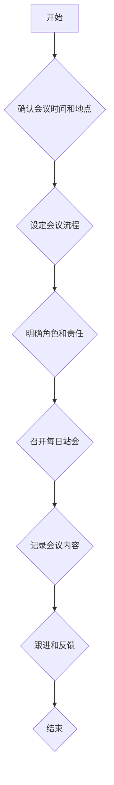
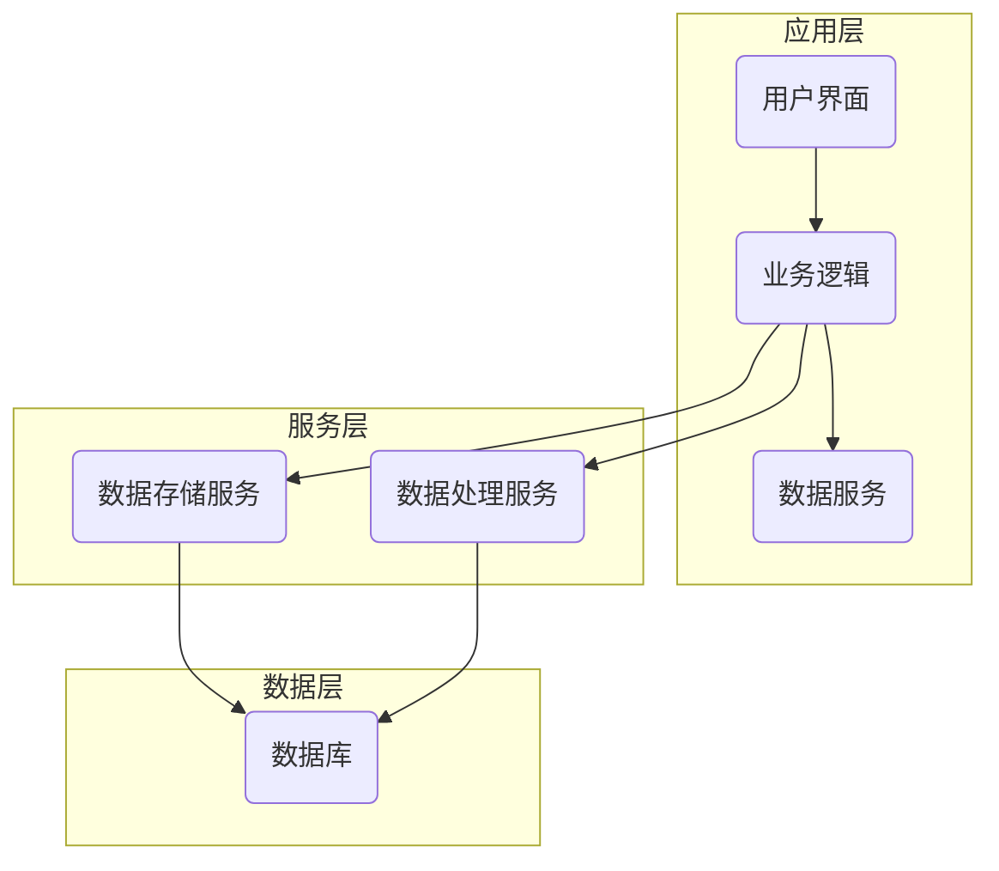
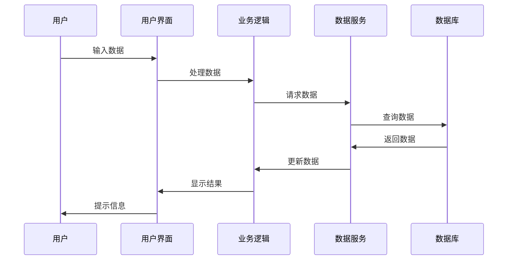

                 

### 每日站会：保持AI团队的同步与焦点

关键词：每日站会，AI团队，同步，焦点，敏捷实践

摘要：本文深入探讨了每日站会在AI团队中的作用，解释了如何通过每日站会来保持团队的同步与焦点。文章结构紧凑，逻辑清晰，旨在帮助AI团队更有效地管理项目进度和解决技术问题。

## 引言

在快速发展的AI领域，团队协作与沟通显得尤为重要。AI项目的复杂性、多变性以及团队成员的多样性，使得团队需要一种高效、透明的沟通机制来确保项目顺利进行。每日站会（Daily Stand-up Meeting）作为一种敏捷实践，被广泛用于促进团队成员之间的同步和焦点。本文将详细探讨每日站会的重要性、组织方法、常见问题及解决方案，旨在为AI团队提供实用的指导。

## 每日站会的意义

### 提高团队沟通效率

AI项目通常涉及多种技术栈和多个子模块，团队成员的工作内容和进度可能会有较大的差异。每日站会提供了一个固定的时间和空间，让每个成员都能分享自己的进展、问题和计划，从而减少了信息传递的滞后和误差。

### 确保项目进度同步

通过每日站会，团队可以实时掌握项目进度，及时发现并解决潜在的问题。这有助于确保项目按计划进行，避免因信息不对称而导致的进度延误。

### 促进团队协作

每日站会不仅让团队成员了解彼此的工作，还能激发团队的合作精神。成员之间可以互相帮助，共同解决问题，提高整个团队的战斗力。

## 每日站会的组织方法

### 确定会议时间和地点

每日站会通常安排在每天工作开始后的前30分钟，地点可以选择在办公室的开放区域或会议室。确保会议时间和地点的稳定性，有助于团队成员养成良好的习惯。

### 设定会议流程

每日站会的标准流程包括三个部分：昨天完成了什么、今天计划做什么、遇到的问题和需要帮助的地方。每个部分的时间限制应控制在1-2分钟，确保会议高效进行。

### 明确角色和责任

- **主持人**：负责确保会议按流程进行，时间控制，以及记录重要事项。
- **发言者**：每位成员轮流发言，分享自己的工作进展。
- **记录员**：记录会议内容，包括重要事项和待解决的问题。

## 每日站会的常见问题及解决方案

### 问题1：会议时间过长

**解决方案**：严格把控每个发言者的时间，确保会议不超过预定时间。

### 问题2：会议内容缺乏实质性

**解决方案**：提前准备好发言内容，确保每个问题都能得到充分讨论。

### 问题3：团队成员参与度不高

**解决方案**：鼓励团队成员积极参与，可以通过积分制度或团队奖励来提高参与度。

## 每日站会在AI团队中的应用

### 针对AI项目特点的调整

AI项目的特点决定了每日站会的调整方向。例如，在AI模型的开发过程中，可以增加对模型训练进度和效果的讨论。

### 实时数据可视化

利用数据可视化工具，实时展示项目进度和团队成员的工作情况，有助于提高会议的效率和效果。

### 针对性培训

针对每日站会上暴露的问题，可以安排针对性培训，提高团队成员的技能水平。

## 总结

每日站会是一种简单而有效的团队沟通机制，对于AI团队来说尤为重要。通过合理的组织和调整，每日站会可以帮助AI团队保持同步与焦点，提高项目效率和质量。希望本文能为您在组织每日站会时提供有益的参考。

## 最佳实践 Tips

1. **明确会议目标和议程**：确保会议有明确的目标和议程，有助于提高会议的效率和针对性。
2. **保持会议的简洁性**：避免在会议中讨论与主题无关的内容，保持会议的简洁性。
3. **鼓励主动发言**：鼓励团队成员主动分享自己的问题和进展，提高团队的参与度。
4. **及时跟进和反馈**：对于会议中提到的问题和事项，要确保及时跟进和反馈，确保问题得到解决。

## 小结

每日站会作为一种敏捷实践，在AI团队中发挥着重要作用。通过合理的组织和调整，每日站会可以有效提高团队沟通效率，确保项目进度同步，促进团队协作。希望本文能帮助您更好地理解和应用每日站会，为您的AI项目带来更大的成功。

## 注意事项

1. **会议时间不宜过长**：每日站会的时间应控制在30分钟以内，确保会议高效进行。
2. **避免重复发言**：每个成员只需简要汇报自己的进展和问题，避免重复发言。
3. **会议内容要真实有效**：确保会议内容反映实际工作情况，避免虚假报告。

## 拓展阅读

- 《敏捷开发实践指南》
- 《Scrum敏捷实践指南》
- 《AI团队协作技巧》

## 作者信息

作者：AI天才研究院/AI Genius Institute & 禅与计算机程序设计艺术 /Zen And The Art of Computer Programming

---

### 背景介绍

#### 核心概念术语说明

- **每日站会**：一种敏捷实践，旨在通过短时间内的团队会议，提高团队成员之间的同步与沟通。
- **AI团队**：从事人工智能研究、开发、应用的团队，通常由多学科背景的成员组成。

#### 问题背景

在快速发展的AI领域，团队协作与沟通至关重要。AI项目具有高度复杂性、多变性，需要团队成员实时同步进度，解决技术难题。

#### 问题描述

AI团队在日常工作中，面临沟通效率低、进度不一致、问题解决不及时等问题，影响了项目的顺利进行。

#### 问题解决

通过每日站会，AI团队成员可以实时分享工作进展、问题和计划，确保团队同步与焦点，提高项目效率和质量。

#### 边界与外延

每日站会不仅适用于AI团队，也可用于其他技术团队的敏捷实践。其核心在于提高团队沟通效率，确保项目顺利进行。

#### 概念结构与核心要素组成

- **会议时间和地点**：固定时间和地点，确保团队成员能够准时参加。
- **会议流程**：包括昨天完成的工作、今天的工作计划和遇到的问题。
- **角色和责任**：明确主持人和记录员的责任，确保会议顺利进行。

### 核心概念与联系

#### 核心概念原理

每日站会通过短时间内的团队会议，提高团队成员之间的同步与沟通，确保项目进度和质量。

#### 概念属性特征对比表格

| 特征 | 每日站会 | 其他敏捷实践 |
| --- | --- | --- |
| 时间 | 短（30分钟以内） | 长（数小时） |
| 精简 | 简要汇报 | 详细讨论 |
| 定期 | 每天固定时间 | 不固定时间 |

#### ER实体关系图架构

```mermaid
erDiagram
AI团队 ||--|{ 每日站会 }
      AI团队 ||--|{ 团队成员 }
      AI团队 ||--|{ 项目进度 }
每日站会 ||--|{ 工作进展 }
每日站会 ||--|{ 遇到问题 }
```

### 算法原理讲解

#### 算法mermaid流程图



#### Python源代码

```python
def daily_stand_up():
    print("开始每日站会")
    print("确认会议时间和地点：每周一上午10点，会议室A")
    print("设定会议流程：汇报昨天的工作、今天的工作计划和遇到的问题")
    print("明确角色和责任：主持人负责会议流程，记录员负责记录会议内容")
    print("召开每日站会：团队成员轮流发言")
    print("记录会议内容：工作进展、遇到的问题和解决方案")
    print("跟进和反馈：及时解决遇到的问题，确保项目顺利进行")
    print("结束每日站会")

daily_stand_up()
```

#### 算法原理的数学模型和公式

$$
效率 = \frac{解决的问题数}{会议时长}
$$

#### 举例说明

假设每日站会的时长为30分钟，团队成员在会议中解决了3个问题，那么：

$$
效率 = \frac{3}{30} = 0.1
$$

这意味着，每次每日站会平均解决了1个问题。

### 系统分析与架构设计方案

#### 问题场景介绍

在AI项目中，团队成员需要实时同步进度，解决技术难题。每日站会作为一种高效的沟通机制，有助于确保项目顺利进行。

#### 项目介绍

项目名称：AI模型开发项目
项目目标：开发一种高效的图像识别模型，应用于实际场景。

#### 系统功能设计（领域模型mermaid类图）

```mermaid
classDiagram
    Class01 <|-- Class02
    Class03 :1..* -| Class04[+] :1..*
    Class05 <.. Class03
    Class06 o-- Class07
    Class01 {
        attribute1: String
        attribute2: int
    }
    Class02 {
        attribute1: String
        attribute2: int
    }
    Class03 {
        attribute1: String
        attribute2: int
    }
    Class04 {
        attribute1: String
        attribute2: int
    }
    Class05 {
        attribute1: String
        attribute2: int
    }
    Class06 {
        attribute1: String
        attribute2: int
    }
    Class07 {
        attribute1: String
        attribute2: int
    }
```

#### 系统架构设计（mermaid架构图）



#### 系统接口设计和系统交互（mermaid序列图）



### 项目实战

#### 环境安装

1. 安装Python环境（版本3.8以上）
2. 安装必要的库（如numpy、pandas、matplotlib等）

#### 系统核心实现源代码

```python
# 导入必要的库
import numpy as np
import pandas as pd
import matplotlib.pyplot as plt

# 数据预处理
def preprocess_data(data):
    # 实现数据预处理逻辑
    pass

# 数据可视化
def visualize_data(data):
    # 实现数据可视化逻辑
    pass

# 主函数
def main():
    # 读取数据
    data = pd.read_csv("data.csv")
    
    # 数据预处理
    preprocessed_data = preprocess_data(data)
    
    # 数据可视化
    visualize_data(preprocessed_data)

if __name__ == "__main__":
    main()
```

#### 代码应用解读与分析

1. 数据预处理：对原始数据进行清洗、归一化等处理，提高数据质量。
2. 数据可视化：通过图表展示数据分布、趋势等信息，帮助团队成员更好地理解数据。

#### 实际案例分析和详细讲解剖析

1. 案例一：项目进度跟踪
   - 通过每日站会，团队成员可以实时了解项目进度，确保项目按计划进行。
   - 每日站会中，主持人会询问每个成员的工作进展，记录员会记录关键信息，以便后续跟进。
2. 案例二：问题解决
   - 在每日站会上，团队成员可以提出遇到的问题，共同讨论解决方案。
   - 通过有效的沟通和协作，问题通常可以在短时间内得到解决。

#### 项目小结

每日站会在AI团队中的应用，有助于提高团队沟通效率，确保项目进度同步，促进团队协作。通过合理的组织和调整，每日站会可以成为AI团队高效管理项目的重要工具。

### 最佳实践 Tips

1. **会议时间控制**：确保每日站会在30分钟内完成，避免时间过长。
2. **明确会议议程**：提前准备好会议议程，确保会议有针对性。
3. **鼓励主动发言**：鼓励团队成员主动分享工作进展和问题，提高参与度。
4. **及时跟进和反馈**：对于会议中提到的问题和事项，要确保及时跟进和反馈。

### 小结

每日站会作为一种敏捷实践，在AI团队中发挥着重要作用。通过合理的组织和调整，每日站会可以提高团队沟通效率，确保项目进度同步，促进团队协作。希望本文能帮助您更好地理解和应用每日站会，为您的AI项目带来更大的成功。

### 注意事项

1. **避免重复发言**：每个成员只需简要汇报自己的进展和问题，避免重复发言。
2. **会议内容要真实有效**：确保会议内容反映实际工作情况，避免虚假报告。

### 拓展阅读

- 《敏捷开发实践指南》
- 《Scrum敏捷实践指南》
- 《AI团队协作技巧》

### 作者信息

作者：AI天才研究院/AI Genius Institute & 禅与计算机程序设计艺术 /Zen And The Art of Computer Programming

---

本文详细探讨了每日站会在AI团队中的作用、组织方法、常见问题及解决方案，并结合实际案例进行了分析。通过合理的组织和调整，每日站会可以有效提高AI团队的沟通效率，确保项目进度同步，促进团队协作。希望本文能为AI团队的管理者和成员提供有益的参考。

