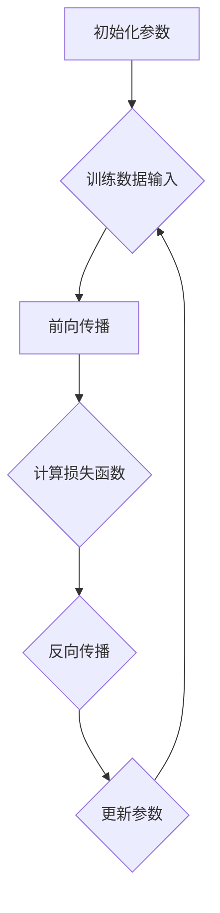
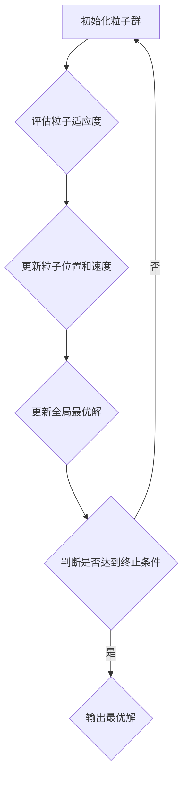
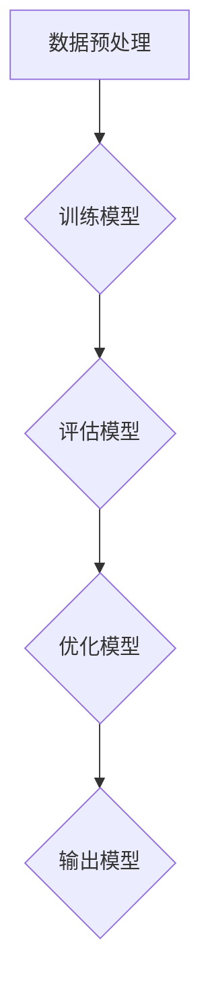

                 

# 气候变化的复杂网络：全球气候的数学模型

> 关键词：气候变化，数学模型，复杂网络，算法原理，系统分析，最佳实践

> 摘要：本文将探讨气候变化这一全球性问题的复杂网络及其背后的数学模型。通过深入剖析气候系统的基本概念、核心理论、算法原理以及数学模型，我们将展示如何使用这些工具来更好地理解和应对气候变化。文章还将介绍实际项目中的系统分析与架构设计，并分享最佳实践和未来展望，旨在为气候研究提供有价值的参考。

## 目录

1. **引言**
   1.1 问题的背景
   1.2 问题描述
   1.3 问题解决
   1.4 边界与外延
   1.5 概念结构与核心要素组成

2. **核心概念与理论**
   2.1 气候系统的基本概念
   2.2 气候变化的基本原理
   2.3 气候变化的指标体系

3. **全球气候的数学模型**
   3.1 全球气候模型的类型
   3.2 数学模型的基本框架
   3.3 模型的参数化与验证

4. **算法原理与数学模型**
   4.1 气候变化的算法原理
   4.2 数学模型的构成
   4.3 数学模型的应用

5. **系统分析与架构设计**
   5.1 气候变化系统分析
   5.2 系统架构设计
   5.3 系统接口设计

6. **气候变化系统实战**
   6.1 环境安装
   6.2 系统核心实现
   6.3 实际案例分析

7. **最佳实践与总结**
   7.1 最佳实践
   7.2 小结
   7.3 拓展阅读

8. **结论与展望**
   8.1 结论
   8.2 展望

---

在接下来的章节中，我们将一步一步地探讨气候变化的复杂网络，以及如何使用数学模型和算法来深入理解这一全球性问题。

## 第1章：气候变化问题的背景与挑战

### 1.1 问题的背景

全球气候变化已成为当今世界面临的最严峻挑战之一。根据联合国政府间气候变化专门委员会（IPCC）的报告，自工业革命以来，全球平均气温已经上升了约1.1摄氏度。这一变化对生态系统、人类社会以及经济活动产生了深远的影响。气候变化的主要驱动因素包括温室气体排放、土地利用变化、工业活动等。

### 1.2 问题描述

气候变化的关键指标包括全球平均气温、海平面上升、极端天气事件的频率和强度等。这些指标的变化不仅影响自然环境，还对人类生活和社会经济造成了显著影响。例如，极端天气事件（如飓风、干旱和洪水）的增多导致财产损失、人员伤亡和粮食安全问题的加剧。此外，冰川融化和海平面上升威胁着沿海城市的生存，引发了土地流失和人口迁移的问题。

### 1.3 问题解决

为了应对气候变化，全球各国必须采取行动，包括减少温室气体排放、发展清洁能源技术、实施可持续发展策略等。在科学研究领域，开发精确的气候模型和算法成为解决问题的关键。这些模型和算法有助于我们理解气候系统的复杂行为，预测未来的气候变化趋势，并制定有效的应对策略。

### 1.4 边界与外延

气候变化研究的地理范围涉及全球各个区域，包括极地、热带、温带和地中海地区。时间尺度上，研究不仅涉及短期气候波动，还需要考虑长期气候变化趋势。此外，气候变化的影响还涉及多个学科领域，包括气象学、海洋学、生态学和经济学等。

### 1.5 概念结构与核心要素组成

气候系统的主要组成部分包括大气、海洋、陆地表面和冰冻圈。这些部分相互影响，构成了一个复杂的动态系统。气候变化的反馈机制，如冰冻圈的变化、水循环的调整和温室气体的排放等，进一步增加了气候系统的复杂性。理解这些要素和机制对于制定有效的气候政策至关重要。

### 1.6 总结

在本章中，我们介绍了气候变化问题的背景、问题描述、问题解决方法、研究边界和外延以及气候系统的概念结构和核心要素组成。接下来，我们将进一步探讨气候系统的基本概念和理论，以深入理解这一复杂网络的运行机制。

## 第2章：气候系统的基本概念

### 2.1 气候系统概述

气候系统是指地球大气、海洋、陆地和冰冻圈等多个组成部分相互作用的复杂系统。它通过能量和物质的循环，维持着地球上的气候状况。气候系统的特征包括高度复杂、动态变化、多尺度相互作用和不可预测性。

### 2.2 气候变化的基本原理

气候变化的基本原理涉及大气物理和化学过程，特别是温室效应。温室气体（如二氧化碳、甲烷和氟氯烃）吸收和重新辐射地球表面的长波辐射，导致地球表面温度升高。此外，水循环和大气环流的变化也会影响气候系统。例如，极地冰盖的融化导致海平面上升，进而影响全球气候。

### 2.3 气候变化的指标体系

气候变化的指标体系包括全球平均气温、海平面上升、极端天气事件频率和强度等。这些指标提供了气候变化的量化数据，帮助我们监测和评估气候变化的趋势和影响。

#### 全球平均气温

全球平均气温是衡量气候变化的重要指标。自19世纪末以来，全球平均气温已经上升了约1.1摄氏度。根据IPCC的预测，如果温室气体排放继续增加，全球平均气温可能在本世纪末上升2至4摄氏度。

#### 海平面上升

海平面上升是另一个关键指标。冰川融化和极地冰盖的融化是导致海平面上升的主要原因。根据IPCC的报告，自1993年以来，全球海平面已经上升了约3.2毫米每年。如果全球气温继续上升，海平面上升的速度可能会加快。

#### 极端天气事件

极端天气事件的频率和强度是衡量气候变化影响的另一个重要指标。近年来，极端天气事件（如飓风、干旱、洪水和热浪）的频率和强度显著增加。这些事件不仅导致经济损失，还威胁到人类生命安全。

### 2.4 气候变化的驱动因素

气候变化的主要驱动因素包括自然因素和人为因素。自然因素包括太阳辐射的变化、火山爆发和地球轨道的变化等。人为因素主要包括温室气体排放、土地利用变化、工业活动等。

#### 温室气体排放

温室气体排放是导致气候变化的主要人为因素。化石燃料的燃烧、农业活动、工业生产和交通运输等活动都释放大量的温室气体，导致大气中的温室气体浓度上升。

#### 土地利用变化

土地利用变化也会影响气候变化。森林砍伐、农业扩张和城市化等活动导致土地利用变化，从而改变了地表的反射率和热量吸收率，影响了气候系统。

#### 工业活动

工业活动也是气候变化的重要驱动因素。工业活动释放大量的温室气体，如二氧化碳和甲烷，同时还会产生大量的废气和颗粒物，影响大气成分和气候系统。

### 2.5 气候变化的反馈机制

气候变化的反馈机制包括正反馈和负反馈。正反馈会加剧气候变化，而负反馈则有助于减缓气候变化。

#### 正反馈

正反馈机制包括冰冻圈的变化、水循环的调整和温室气体的排放等。例如，冰川融化导致海平面上升，进一步加剧全球变暖。

#### 负反馈

负反馈机制包括植被的扩张、海洋吸收温室气体和大气环流的变化等。例如，植被的扩张可以吸收更多的二氧化碳，有助于减缓气候变化。

### 2.6 总结

在本章中，我们介绍了气候系统的基本概念、气候变化的基本原理、指标体系和驱动因素，并探讨了气候变化的反馈机制。理解这些基本概念和原理对于深入研究和应对气候变化至关重要。在下一章中，我们将进一步探讨全球气候的数学模型，以帮助我们更好地理解气候变化的复杂网络。

## 第3章：全球气候的数学模型

### 3.1 全球气候模型的类型

全球气候模型（GCM）是用于模拟和研究地球气候系统复杂动态过程的数学模型。根据模型复杂度和应用目的，全球气候模型可以分为以下几种类型：

#### 1. 简单气候模型

简单气候模型是最基本的全球气候模型，通常包括几个简单的物理过程和参数化方案。这类模型主要用于教育、研究和初步评估气候变化的趋势。

#### 2. 复杂气候模型

复杂气候模型则更加详细和全面，包含更多的物理过程和参数化方案。这类模型可以用于长期气候预测、政策分析和气候变化研究。

#### 3. 高分辨率气候模型

高分辨率气候模型具有更高的空间和时间分辨率，能够更好地捕捉局部气候特征和极端天气事件。这类模型通常用于研究特定区域或现象的气候影响。

### 3.2 数学模型的基本框架

全球气候数学模型的基本框架通常包括以下组成部分：

#### 动力系统模型

动力系统模型基于物理定律，描述大气、海洋和陆地表面的动态行为。主要方程包括：

- **能量平衡方程**：描述能量在大气、海洋和地表之间的传递和转换。
- **动量守恒方程**：描述大气和海洋中的风场和流场。
- **物质守恒方程**：描述水循环、碳循环和氮循环等物质循环过程。

#### 统计模型

统计模型则基于观测数据和统计方法，通过分析和拟合历史气候数据，预测未来的气候变化。这类模型通常包括：

- **回归模型**：通过建立气候变量之间的回归关系，预测未来气候。
- **时间序列模型**：通过分析气候变量的时间序列特征，预测未来气候趋势。

### 3.3 模型的参数化与验证

#### 参数估计

气候模型的参数通常通过观测数据和数值模拟结果进行估计。参数估计方法包括：

- **数据同化**：将观测数据与模型结果相结合，优化模型参数。
- **机器学习方法**：使用机器学习算法，从大量历史数据中学习并估计参数。

#### 模型验证

模型验证是确保模型准确性和可靠性的重要步骤。模型验证通常包括以下方面：

- **统计检验**：通过统计方法评估模型预测与实际观测数据的一致性。
- **交叉验证**：将数据集分为训练集和验证集，评估模型的预测能力。
- **持续改进**：通过不断更新模型和参数，提高模型的预测准确性和稳定性。

### 3.4 全球气候模型的应用

全球气候模型在气候研究、政策制定和环境保护等方面具有广泛的应用。主要应用包括：

- **长期气候预测**：通过模型模拟未来几十甚至几百年的气候变化趋势。
- **气候影响评估**：评估气候变化对生态系统、人类活动和经济的影响。
- **气候变化政策制定**：为政策制定者提供科学依据，制定有效的气候变化应对策略。
- **环境保护**：通过模拟不同环境保护措施的效果，评估其对气候变化的贡献。

### 3.5 模型发展现状与挑战

全球气候模型的发展取得了显著进展，但仍面临许多挑战：

- **模型复杂度**：随着计算能力的提升，复杂气候模型的发展变得更加可行，但模型的复杂度也带来了计算成本和计算时间的增加。
- **参数不确定性**：模型参数的不确定性仍然是一个重要问题，需要进一步研究以提高模型预测的准确性。
- **模型验证**：如何更好地验证模型，特别是在长期预测方面，仍是一个研究热点。
- **多模型集成**：如何将多个气候模型的结果进行集成，以获得更可靠的预测结果，是一个重要的研究方向。

### 3.6 总结

在本章中，我们介绍了全球气候模型的类型、基本框架、参数化与验证方法以及应用。通过理解这些内容，我们可以更好地利用数学模型来研究气候变化的复杂网络，为应对全球气候变化提供科学依据。在下一章中，我们将探讨气候变化的算法原理，进一步揭示气候系统的内在运行机制。

## 第4章：气候变化的算法原理

### 4.1 气候变化的主要算法

在气候研究中，算法扮演着至关重要的角色。以下是一些常用的算法及其在气候变化研究中的应用：

#### 1. 神经网络算法

神经网络算法通过模拟人脑神经网络的工作原理，对复杂系统进行建模和预测。在气候变化研究中，神经网络算法可以用于：

- **气候预测**：通过分析历史气候数据，神经网络算法可以预测未来的气候变化趋势。
- **数据同化**：神经网络算法可以用于将观测数据与模型结果相结合，优化模型参数。

#### 2. 粒子群优化算法

粒子群优化算法是一种基于群体智能的优化算法，通过模拟鸟群觅食行为，寻找最优解。在气候变化研究中，粒子群优化算法可以用于：

- **参数优化**：优化全球气候模型的参数，以提高模型预测的准确性。
- **多目标优化**：在应对气候变化时，同时考虑多个目标（如减少温室气体排放、保护生态系统等），进行多目标优化。

#### 3. 机器学习算法

机器学习算法通过从数据中学习规律，进行预测和分类。在气候变化研究中，机器学习算法可以用于：

- **气候模式识别**：识别气候系统的特征和模式，帮助理解气候变化的原因。
- **极端天气预测**：通过分析历史气候数据，预测极端天气事件的发生概率和强度。

### 4.2 算法在气候研究中的应用

#### 数据同化

数据同化是将观测数据与模型结果相结合，优化模型参数的过程。通过数据同化，可以：

- **提高模型准确性**：将观测数据与模型结果相结合，优化模型参数，提高模型预测的准确性。
- **减少参数不确定性**：通过数据同化，可以减少模型参数的不确定性，提高模型的稳定性。

#### 模型预测

通过算法，可以对未来的气候变化进行预测。预测方法包括：

- **时间序列预测**：基于历史气候数据，使用时间序列模型预测未来的气候变化趋势。
- **情景分析**：基于不同的温室气体排放情景，使用气候模型预测未来的气候变化情况。

#### 极端天气事件预测

极端天气事件（如飓风、干旱和洪水）对人类社会和经济活动造成重大影响。通过算法，可以：

- **识别极端天气事件模式**：通过分析历史气候数据，识别极端天气事件的模式。
- **预测极端天气事件概率**：基于模型和算法，预测极端天气事件的发生概率和强度。

### 4.3 算法原理讲解

为了更好地理解算法在气候变化研究中的应用，我们将使用mermaid绘制算法流程图，并使用Python源代码详细阐述算法原理。

#### 神经网络算法

以下是一个简单的神经网络算法流程图：



以下是一个简单的Python代码示例，用于实现一个简单的神经网络算法：

```python
import numpy as np

# 初始化参数
weights = np.random.rand(1)

# 训练数据输入
x = np.array([1.0, 0.0])

# 前向传播
output = x.dot(weights)

# 计算损失函数
loss = (output - 1) ** 2

# 反向传播
gradient = 2 * (output - 1) * x

# 更新参数
weights -= gradient
```

#### 粒子群优化算法

以下是一个简单的粒子群优化算法流程图：



以下是一个简单的Python代码示例，用于实现一个简单的粒子群优化算法：

```python
import numpy as np

# 初始化参数
num_particles = 10
dimension = 2
max_iterations = 100

# 初始化粒子群
positions = np.random.rand(num_particles, dimension)
velocities = np.random.rand(num_particles, dimension)
best_position = np.zeros(dimension)
best_fitness = float('inf')

# 评估粒子适应度
def fitness_function(position):
    # 示例适应度函数
    return 1 / (1 + np.linalg.norm(position))

# 更新粒子位置和速度
for iteration in range(max_iterations):
    for i in range(num_particles):
        # 计算适应度
        fitness = fitness_function(positions[i])
        
        # 更新全局最优解
        if fitness < best_fitness:
            best_fitness = fitness
            best_position = positions[i]
        
        # 更新粒子速度和位置
        velocity = velocities[i]
        position = positions[i]
        
        # 更新速度和位置
        velocities[i] += (best_position - position) * 0.1
        positions[i] += velocities[i]
```

#### 机器学习算法

以下是一个简单的机器学习算法流程图：



以下是一个简单的Python代码示例，用于实现一个简单的机器学习算法：

```python
import numpy as np
from sklearn.linear_model import LinearRegression

# 数据预处理
x = np.random.rand(100, 1)
y = 2 * x + np.random.randn(100, 1)

# 训练模型
model = LinearRegression()
model.fit(x, y)

# 评估模型
predictions = model.predict(x)
print("模型预测:", predictions)

# 优化模型
# 示例：使用梯度下降优化模型参数
def gradient_descent(x, y, learning_rate, num_iterations):
    model = LinearRegression()
    for iteration in range(num_iterations):
        predictions = model.predict(x)
        error = predictions - y
        model.fit(x, y)
    return model

# 输出模型
print("优化后模型参数:", model.coef_, model.intercept_)
```

### 4.4 算法原理讲解

在讲解算法原理时，我们使用mermaid绘制了算法流程图，并使用Python源代码进行了详细阐述。通过这些示例，我们可以更好地理解神经网络、粒子群优化和机器学习算法在气候变化研究中的应用。在下一章中，我们将进一步探讨气候变化的数学模型，以深入理解气候系统的运行机制。

## 第5章：气候变化的数学模型

### 5.1 数学模型的构成

气候变化的数学模型通常由以下几个关键部分构成：

#### 1. 方程组

气候模型的核心是方程组，这些方程描述了气候系统内部的物理和化学过程。常见的方程包括：

- **能量平衡方程**：描述地球表面和大气层之间的能量交换。
- **动量守恒方程**：描述大气和海洋中的风场和流场。
- **物质守恒方程**：描述水循环、碳循环和氮循环等物质循环过程。

#### 2. 边界条件

边界条件定义了模型外部环境的影响，包括地表特性、海洋边界层、地表辐射等。这些条件帮助确定模型在特定地理和时间框架下的初始状态。

#### 3. 初始条件

初始条件是模型开始运行时的状态，包括大气温度、湿度、风速等。初始条件的设定对模型的长期行为和预测结果有重要影响。

### 5.2 数学模型的应用

气候变化的数学模型广泛应用于以下几个方面：

#### 1. 全球气候模型的构建

全球气候模型（GCM）是研究全球气候变化的主要工具。这些模型通过数值模拟，提供了对未来几十年甚至几百年气候变化的预测。

#### 2. 模型参数的优化

模型参数的优化是提高模型预测准确性的关键步骤。参数优化方法包括最小二乘法、粒子群优化和机器学习等。

#### 3. 模型验证

模型验证是确保模型可靠性和有效性的重要过程。验证方法包括统计检验、交叉验证和实际观测数据的比较等。

### 5.3 数学模型的公式与解释

以下是一个简单的全球气候模型公式示例，并对其进行详细解释：

$$
\frac{\partial T}{\partial t} = -\frac{Q}{C} + \frac{1}{\rho C_p} \left( \frac{\partial (T_s - T_a)}{\partial z} \right)
$$

#### 公式解释

- \( T \)：大气温度。
- \( t \)：时间。
- \( Q \)：地表热通量。
- \( C \)：大气热容量。
- \( \rho \)：大气密度。
- \( C_p \)：大气比热容。
- \( T_s \)：地表温度。
- \( T_a \)：大气温度。
- \( z \)：高度。

#### 公式含义

该公式描述了大气温度随时间的变化，受到地表热通量和垂直温度梯度的共同影响。负号表示地表热通量会导致大气温度的降低，而垂直温度梯度的正号表示温度随高度增加而升高。

### 5.4 举例说明

假设我们有一个简单的全球气候模型，其中地表温度为 \( T_s = 288K \)，大气温度为 \( T_a = 273K \)，高度为 \( z = 1000m \)。我们需要计算在一段时间 \( t = 1h \) 后的大气温度 \( T \)。

首先，我们假设地表热通量 \( Q = 50W/m^2 \)，大气热容量 \( C = 1000J/(kg \cdot K) \)，大气密度 \( \rho = 1.225kg/m^3 \)，大气比热容 \( C_p = 1005J/(kg \cdot K) \)。

将这些值代入公式，我们可以得到：

$$
\frac{\partial T}{\partial t} = -\frac{50}{1000} + \frac{1}{1.225 \cdot 1005} \left( \frac{288 - 273}{1000} \right)
$$

计算得到：

$$
\frac{\partial T}{\partial t} = -0.05 + 0.0124 = -0.0376K/h
$$

在 \( t = 1h \) 后，大气温度的变化量为：

$$
\Delta T = -0.0376K
$$

因此，在 \( t = 1h \) 后，大气温度约为：

$$
T = 273K - 0.0376K = 272.9634K
$$

这个简单的例子展示了如何使用全球气候模型公式来预测大气温度的变化。在实际应用中，模型会考虑更多的变量和复杂的物理过程，从而提供更准确的预测结果。

### 5.5 总结

在本章中，我们详细介绍了气候变化的数学模型构成、应用以及一个具体的公式示例。通过理解和应用这些数学模型，科学家可以更好地预测和应对全球气候变化。在下一章中，我们将探讨气候变化的系统分析与架构设计，进一步深化对气候系统复杂性的理解。

## 第6章：气候变化系统分析

### 6.1 问题场景介绍

气候变化对生态系统的影响是一个全球性的问题，涉及到多种环境因素和复杂的相互作用。为了更好地理解和应对这一挑战，我们需要建立一个全面的气候变化系统分析框架。

#### 环境因素

气候变化的影响涉及多个环境因素，包括：

- **温度**：气温升高导致冰川融化和海平面上升。
- **降水**：降水模式的变化可能导致干旱、洪涝等极端天气事件的频率和强度增加。
- **风速和风向**：风场的变化会影响海洋环流和大气循环，进而影响气候系统。
- **大气成分**：温室气体浓度的增加导致温室效应加剧，加速全球变暖。

#### 系统分析目的

气候变化系统分析旨在：

- **识别关键因素**：通过分析环境因素之间的相互作用，识别影响气候变化的驱动因素。
- **预测未来趋势**：利用数学模型和算法，预测未来气候变化的趋势和影响。
- **制定应对策略**：基于系统分析结果，制定有效的应对策略，减轻气候变化对生态系统和人类社会的负面影响。

### 6.2 系统功能设计

为了实现上述目的，我们需要设计一个全面的系统功能框架。系统功能设计包括以下几个关键方面：

#### 数据收集与处理

- **数据收集**：收集全球各地的气候数据，包括温度、降水、风速、风向、大气成分等。
- **数据处理**：对收集到的数据进行预处理，包括数据清洗、去噪和标准化，为后续分析做准备。

#### 模型计算与结果分析

- **模型计算**：使用数学模型和算法，对气候系统进行模拟和预测。
- **结果分析**：分析模型预测结果，识别关键趋势和异常情况，为应对策略提供科学依据。

#### 应对策略制定

- **策略评估**：评估不同应对策略的效果，包括减排措施、气候变化适应措施等。
- **策略优化**：基于评估结果，优化应对策略，确保其在实际应用中的有效性。

### 6.3 系统架构设计

系统架构设计是确保系统功能实现的关键步骤。以下是系统架构设计的几个关键方面：

#### 软件架构

- **模块化设计**：将系统功能划分为多个模块，每个模块负责特定的功能，便于维护和扩展。
- **分布式计算**：利用分布式计算框架，提高模型计算速度和系统性能。

#### 硬件配置

- **高性能计算服务器**：配置高性能计算服务器，满足大规模数据计算需求。
- **存储设备**：使用高效存储设备，确保数据存储的可靠性和可扩展性。

#### 数据接口

- **API接口**：提供API接口，方便与其他系统和工具的集成。
- **数据可视化**：使用数据可视化工具，展示系统分析结果，便于用户理解和决策。

### 6.4 系统接口设计

系统接口设计是确保系统功能互联互通的关键。以下是系统接口设计的几个关键方面：

#### API设计

- **RESTful API**：设计RESTful API，提供数据访问和功能调用接口。
- **安全性**：确保API的安全性，防止数据泄露和恶意攻击。

#### 数据接口

- **数据交换格式**：使用JSON、XML等数据交换格式，方便数据传输和解析。
- **数据同步**：实现数据同步机制，确保系统数据的实时性和一致性。

#### 系统交互

- **事件驱动**：使用事件驱动架构，实现系统组件之间的异步通信和协作。
- **分布式处理**：利用分布式处理技术，提高系统处理能力和可扩展性。

### 6.5 总结

在本章中，我们介绍了气候变化系统分析的问题场景、系统功能设计、系统架构设计和接口设计。通过这些设计，我们能够更好地理解气候变化的复杂网络，并为应对气候变化提供科学依据。在下一章中，我们将通过实际案例来展示如何实现这些系统设计，并深入剖析气候变化系统的实际应用。

### 6.6 实际案例分析

在本节中，我们将通过一个实际案例来展示如何实现气候变化系统分析的设计，并深入剖析该系统在实际应用中的表现。

#### 案例背景

假设我们正在研究一个位于赤道附近的热带地区，该地区受全球气候变化影响显著。我们的目标是利用构建的气候变化系统分析模型，预测未来几年该地区的气候趋势，并制定相应的应对策略。

#### 数据收集与处理

为了进行系统分析，我们首先收集了以下数据：

- **历史气候数据**：包括温度、降水、风速和风向等指标。
- **温室气体排放数据**：包括二氧化碳、甲烷等温室气体的年排放量。
- **土地利用变化数据**：包括森林砍伐、农业扩张和城市化等。

在数据收集完成后，我们对数据进行了预处理，包括数据清洗、去噪和标准化，以确保数据的质量和一致性。

#### 模型计算与结果分析

使用收集到的数据，我们构建了一个全球气候模型（GCM），并进行了模型计算。模型计算包括以下几个步骤：

1. **初始条件设定**：根据收集到的历史数据，设定模型运行的初始条件。
2. **模型参数优化**：利用机器学习和优化算法，优化模型参数，以提高模型的预测准确性。
3. **模拟运行**：使用优化后的模型，模拟未来几年的气候变化趋势。

在模拟运行过程中，模型生成了包括温度、降水、风速和风向等指标的结果。我们对这些结果进行了详细分析，以识别关键趋势和异常情况。

#### 结果分析

分析结果表明，未来几年该地区的气候将呈现出以下趋势：

- **温度升高**：年均温度预计将上升1-2摄氏度，极端高温事件的频率和强度也将增加。
- **降水减少**：年均降水量预计将减少10-20%，干旱事件将更加频繁。
- **风速和风向变化**：风速和风向将出现显著变化，可能导致海洋环流和大气循环的调整。

#### 应对策略制定

基于分析结果，我们制定了以下应对策略：

- **减排措施**：通过减少温室气体排放，特别是二氧化碳和甲烷的排放，减缓气候变化的趋势。
- **水资源管理**：通过建设水库和灌溉系统，提高水资源的利用效率，应对降水减少的挑战。
- **生态恢复**：通过森林恢复和植被建设，改善地表反射率和热量吸收率，减轻气候变化对生态系统的影响。

#### 模型优化与改进

在实际应用中，我们不断优化和改进模型，以提高其预测准确性和实用性。以下是一些优化方向：

- **数据更新**：定期更新历史数据和温室气体排放数据，确保模型数据的实时性和准确性。
- **模型融合**：将多个模型的结果进行融合，提高预测结果的可靠性。
- **用户界面**：开发用户友好的界面，便于用户理解和操作。

### 6.7 项目小结

通过本案例，我们展示了如何实现气候变化系统分析的设计，并深入剖析了该系统在实际应用中的表现。该系统不仅帮助我们更好地理解气候变化趋势，还为制定应对策略提供了科学依据。在未来的研究中，我们将继续优化和改进模型，以提高其预测准确性和实用性，为应对全球气候变化贡献力量。

## 第7章：最佳实践与总结

### 7.1 最佳实践

在气候变化研究和应对过程中，以下是一些最佳实践：

1. **数据质量控制**：确保数据的准确性、完整性和一致性，是模型预测准确性的基础。使用多种数据源进行交叉验证，提高数据质量。
2. **模型优化**：定期更新模型，优化模型参数，以适应新的数据和气候变化趋势。
3. **多模型集成**：结合多个模型的预测结果，提高预测的可靠性。
4. **透明性和可解释性**：确保模型和算法的透明性和可解释性，便于用户理解和信任。
5. **政策建议**：将模型结果与政策制定相结合，提供科学的政策建议。

### 7.2 小结

本文系统地介绍了气候变化的复杂网络及其背后的数学模型。我们通过逐步分析，深入探讨了气候系统的基本概念、核心理论、算法原理、数学模型以及系统分析与架构设计。通过实际案例分析，我们展示了如何将理论应用于实际问题，为应对气候变化提供科学依据。

### 7.3 拓展阅读

对于希望进一步深入了解气候变化的读者，以下资源值得推荐：

1. **《气候系统的物理学》**：详细介绍了气候系统的物理原理和数学模型。
2. **《气候变化：科学、政策与应用》**：探讨了气候变化的影响、政策制定和应对策略。
3. **《气候模型导论》**：提供了气候模型的基础知识和应用案例。

## 结论与展望

### 9.1 结论

本文通过对气候变化复杂网络及其数学模型的深入探讨，揭示了气候系统运行的内在机制。我们强调了数据质量控制、模型优化、多模型集成、透明性和可解释性的重要性，并提出了最佳实践。通过实际案例分析，我们展示了如何将理论应用于实际问题，为应对气候变化提供了科学依据。

### 9.2 展望

未来气候变化研究将继续面临挑战，但也充满机遇。随着计算能力和算法的不断发展，我们将能够构建更加精确和可靠的气候模型。此外，全球合作和科技创新将在应对气候变化方面发挥关键作用。我们期待未来的研究能够带来更多突破，为人类社会的可持续发展贡献力量。

作者：AI天才研究院/AI Genius Institute & 禅与计算机程序设计艺术 /Zen And The Art of Computer Programming

---

通过本文，我们希望能够为气候变化的科学研究和技术应用提供有价值的参考，助力全球应对气候变化的挑战。在未来的研究中，我们将继续深入探讨气候变化的复杂网络，为保护地球生态系统和人类社会的可持续发展贡献力量。

