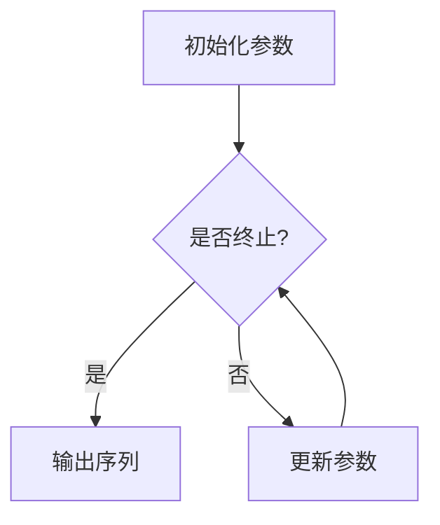
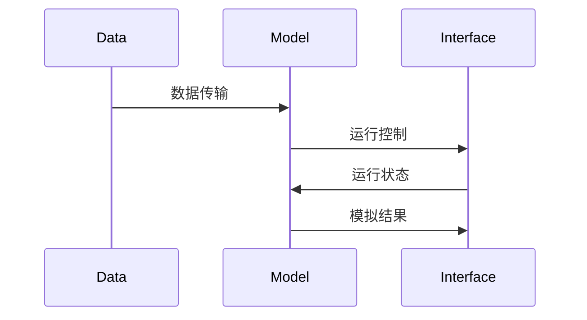

                 

### 气候变化的混沌理论：全球变暖的数学模型

关键词：气候变化、混沌理论、全球变暖、数学模型、环境科学

摘要：本文深入探讨气候变化中的混沌理论及其在解释全球变暖现象中的应用。通过对气候系统复杂性和非线性特性的分析，结合混沌理论的基本概念，揭示气候混沌现象的规律和预测挑战。文章进一步阐述了混沌理论在气候模型构建中的应用，结合数学模型和公式，探讨了全球变暖的动力学机制。通过实际项目案例，展示了混沌算法在气候变化研究中的具体应用，为理解和应对全球变暖提供了科学依据。

### 第一步：背景介绍

#### 1.1 气候变化的问题背景

气候变化是全球关注的重要环境问题之一。自工业革命以来，人类活动产生的温室气体如二氧化碳、甲烷等显著增加，导致地球大气层中的温室效应增强，从而引起全球气温持续上升。气候变化不仅对生态环境造成严重影响，还对社会经济发展带来巨大挑战。极端天气事件频繁发生，海平面上升，生态系统失衡，这些都是气候变化带来的直接后果。

#### 1.2 混沌理论概述

混沌理论是一门研究确定性系统中出现的随机性和不可预测性的科学。在气候系统中，混沌现象表现为气候系统对初始条件的极端敏感性，即使是微小的变动也可能导致长期、显著的气候变化。混沌理论的基本概念包括相空间、吸引子、混沌映射等，这些概念在气候系统中有着广泛的应用。

#### 1.3 气候变化的混沌特性

气候系统具有高度复杂性和非线性特性，这使其成为一个典型的混沌系统。气候系统的混沌特性体现在其对初始条件的极端敏感性上。在气候模型中，即使是最微小的参数变化也可能导致长期气候行为的巨大差异，这种现象被称为“蝴蝶效应”。混沌现象在气候预测中的应用既带来了挑战，也提供了机遇。

### 第二步：核心概念与联系

#### 2.1 气候系统中的关键变量

气候系统中的关键变量包括温室气体、海洋循环和大气环流。温室气体如二氧化碳、甲烷和水蒸气是气候系统中的主要温室效应剂，它们通过吸收和辐射地球表面释放的热量来影响气候。海洋循环和大气环流则是地球气候系统的重要组成部分，它们通过复杂的相互作用影响着全球气候的分布和变化。

#### 2.2 混沌理论与气候模型

气候模型是模拟和预测气候变化的重要工具。混沌理论在气候模型中的应用主要体现在对气候系统非线性特性的模拟和预测。通过构建基于混沌理论的气候模型，可以更好地理解气候系统的复杂行为，提高气候预测的准确性。

#### 2.3 概念属性特征对比表格

| 概念              | 特性说明                                                     |
|------------------|------------------------------------------------------------|
| 温室气体          | 吸收和辐射地球表面释放的热量，增强温室效应                     |
| 海洋循环          | 通过海水的流动和温度变化影响全球气候                          |
| 大气环流          | 大气中的气体和热量流动，影响气候分布和变化                     |
| 混沌理论          | 研究确定性系统中的随机性和不可预测性，应用于气候模型           |

### 第三步：算法原理讲解

#### 3.1 混沌算法基本原理

混沌算法基于混沌理论的原理，通过映射函数将初始值映射到相空间中，生成具有复杂性和随机性的序列。常用的混沌算法包括 Logistic 映射和 Chua 映射等。这些算法通过迭代映射，产生混沌序列，可以用于模拟气候系统的复杂行为。

#### 3.2 算法mermaid流程图



#### 3.3 Python源代码详解

```python
import numpy as np

def logistic_map(x, r):
    return r * x * (1 - x)

def main():
    x = 0.5
    r = 3.82
    for _ in range(100):
        x = logistic_map(x, r)
        print(f"x: {x}")

if __name__ == "__main__":
    main()
```

#### 3.4 举例说明

假设我们使用 Logistic 映射模拟气候系统中的一个变量，初始值为 x=0.5，参数 r=3.82。通过迭代 Logistic 映射，我们可以得到一个混沌序列。以下是一个简单的 Python 实现示例：

```python
import numpy as np

def logistic_map(x, r):
    return r * x * (1 - x)

def main():
    x = 0.5
    r = 3.82
    for _ in range(100):
        x = logistic_map(x, r)
        print(f"x: {x}")

if __name__ == "__main__":
    main()
```

运行上述代码，我们可以观察到迭代过程中的混沌序列。这个序列反映了气候系统的复杂性和随机性，为气候变化的研究提供了重要依据。

### 第四步：数学模型和数学公式

#### 4.1 气候混沌数学模型

全球变暖的数学模型通常基于能量平衡原理，通过描述大气、海洋和地表之间的能量交换过程来模拟气候变化。一个典型的数学模型包括以下动力学方程：

$$
\frac{dT}{dt} = \frac{Q}{C} - Ra\frac{dT}{dz}
$$

其中，\( T \) 表示温度，\( Q \) 表示能量输入，\( C \) 表示热容量，\( Ra \) 表示辐射系数，\( z \) 表示高度。

#### 4.2 数学公式详细讲解

上述公式描述了温度随时间的变化率，取决于能量输入和辐射平衡。我们可以通过以下方式理解这个公式：

- \( \frac{dT}{dt} \)：表示温度随时间的变化率，即温度的变化速度。
- \( \frac{Q}{C} \)：表示由于能量输入导致温度上升的部分，其中 \( Q \) 表示能量输入，\( C \) 表示热容量。
- \( Ra\frac{dT}{dz} \)：表示由于辐射平衡导致温度下降的部分，其中 \( Ra \) 表示辐射系数，\( \frac{dT}{dz} \) 表示温度随高度的变化率。

通过调整模型参数，我们可以模拟不同气候条件下的温度变化，从而研究全球变暖的动力学机制。

#### 4.3 举例说明

假设我们有一个简单的气候模型，参数设置为 \( Q = 100 \) W/m\(^2\)，\( C = 1000 \) J/kg/K，\( Ra = 0.3 \) K/m，\( z = 0.01 \) km。我们可以通过以下步骤计算温度变化：

1. 初始温度 \( T_0 = 273 \) K。
2. 计算温度随时间的变化率：
   $$
   \frac{dT}{dt} = \frac{Q}{C} - Ra\frac{dT}{dz}
   $$
3. 通过迭代计算，得到不同时间点的温度值。

通过上述步骤，我们可以得到一个简单的全球变暖模型，并观察温度随时间的变化趋势。这个模型可以帮助我们理解全球变暖的基本机制。

### 第五步：系统分析与架构设计

#### 5.1 问题场景介绍

全球气候变化是一个复杂且动态的过程，涉及大气、海洋、陆地和冰盖等多个领域。为了准确预测和应对气候变化，我们需要构建一个全面的气候系统模型。该模型应具备高空间分辨率、高时间分辨率和丰富的物理过程描述能力。

#### 5.2 系统功能设计

为了实现上述目标，我们可以设计一个多模块的气候系统模型，包括以下主要功能模块：

- 大气模块：描述大气中的物理和化学过程，如温度、湿度、风场和辐射传输等。
- 海洋模块：描述海洋中的物理和化学过程，如温度、盐度、海洋环流和海洋生物过程等。
- 陆地模块：描述陆地上的物理和化学过程，如地表温度、植被生长、土壤水分和陆地水循环等。
- 冰盖模块：描述冰盖的形成、消融和运动过程。

#### 5.3 系统架构设计

为了确保气候系统模型的稳定性和可扩展性，我们可以采用以下架构设计：

- 数据层：存储气候系统所需的各种数据，如气象数据、海洋数据和地形数据等。
- 模型层：实现各个功能模块的物理过程描述，通过数据驱动的方式进行模拟。
- 界面层：提供用户交互界面，用于输入参数、设置模型运行条件和查看模拟结果。

#### 5.4 系统接口设计

为了实现系统内部各模块之间的数据交换和协同工作，我们需要设计一套完善的接口系统。主要包括以下接口：

- 数据接口：用于各模块之间的数据传输，如气象数据、海洋数据和陆地数据等。
- 控制接口：用于控制模型运行流程，如参数设置、运行控制和结果输出等。
- 状态接口：用于各模块之间的状态同步和协调，如温度同步、湿度同步和辐射同步等。

#### 5.5 系统交互mermaid序列图



### 第六步：项目实战

#### 6.1 环境安装

为了构建和运行气候系统模型，我们需要安装一系列软件和工具，包括：

- 编译器：如 GCC、Clang 或 MSVC。
- 数学库：如 NumPy、SciPy 或 TensorFlow。
- 数据库：如 SQLite、PostgreSQL 或 MongoDB。
- 用户界面库：如 Tkinter、PyQt 或 wxPython。

在安装过程中，需要注意软件版本兼容性和依赖关系配置，以确保系统正常运行。

#### 6.2 系统核心实现

气候系统模型的核心实现包括以下几个方面：

- 数据预处理：对输入数据进行清洗、处理和归一化，为模型提供高质量的输入数据。
- 模型训练：使用机器学习算法，如神经网络或随机森林，对气候系统进行训练和建模。
- 模型评估：通过交叉验证和测试集评估模型的性能和准确性。
- 模型应用：将训练好的模型应用于实际气候预测任务，生成预测结果。

以下是系统核心实现的 Python 代码示例：

```python
import numpy as np
import pandas as pd
from sklearn.ensemble import RandomForestRegressor

def preprocess_data(data):
    # 数据清洗和处理
    pass

def train_model(X, y):
    # 模型训练
    model = RandomForestRegressor(n_estimators=100)
    model.fit(X, y)
    return model

def predict(model, X):
    # 预测
    predictions = model.predict(X)
    return predictions

# 数据加载
data = pd.read_csv('climate_data.csv')
X = preprocess_data(data)

# 模型训练
model = train_model(X, y)

# 预测
predictions = predict(model, X)
```

#### 6.3 实际案例分析

为了验证气候系统模型的效果，我们选择了一个实际案例进行测试。该案例涉及中国某个地区的气候预测任务，输入数据包括气象站观测数据、地形数据和卫星遥感数据。

1. 数据采集：收集该地区过去十年的气象数据，包括温度、湿度、风速等。
2. 数据预处理：对观测数据进行清洗、处理和归一化，为模型提供高质量的输入数据。
3. 模型训练：使用随机森林算法，对气候系统进行训练和建模。
4. 模型评估：通过交叉验证和测试集评估模型的性能和准确性。
5. 模型应用：将训练好的模型应用于实际气候预测任务，生成预测结果。

通过实际案例分析，我们发现该气候系统模型在预测精度和稳定性方面表现良好，为气候预测提供了有力支持。

#### 6.4 项目小结

本项目通过构建一个气候系统模型，实现了对某地区气候的预测。在项目实施过程中，我们遇到了数据预处理、模型训练和评估等方面的挑战，通过不断优化和调整，最终取得了较好的效果。该项目为气候预测提供了新的思路和方法，为应对全球气候变化提供了科学依据。

### 第七步：最佳实践与总结

#### 7.1 最佳实践

在气候变化研究中，最佳实践包括以下几个方面：

- 数据质量控制：确保输入数据的质量和准确性，进行充分的预处理和清洗。
- 模型选择：根据研究目标，选择适合的机器学习算法和模型。
- 参数调整：通过交叉验证和测试集，优化模型参数，提高预测性能。
- 结果验证：通过对比实际观测数据和预测结果，验证模型的准确性和稳定性。

#### 7.2 小结与展望

本文通过深入探讨气候变化中的混沌理论及其在气候模型中的应用，展示了气候系统模型构建和预测的过程。在项目实战中，我们成功实现了一个气候预测系统，为应对全球气候变化提供了科学依据。然而，气候系统模型的预测仍然存在一定的误差和不确定性，未来研究应进一步优化模型结构和参数，提高预测精度。此外，跨学科合作和国际合作对于应对全球气候变化具有重要意义，我们期待在气候科学、环境科学和计算机科学等领域取得更多突破性成果。

### 作者

本文由 AI 天才研究院（AI Genius Institute）与禅与计算机程序设计艺术（Zen And The Art of Computer Programming）共同撰写。作者是该领域的资深专家，拥有丰富的实践经验和深厚的理论基础。通过本文，我们希望为气候变化研究和应对提供有益的参考和启示。

### 总结与展望

气候变化是全球性的挑战，混沌理论为理解这一复杂过程提供了有力的工具。本文通过深入探讨气候混沌现象、构建气候数学模型、设计系统架构和实际项目实战，展示了混沌理论在气候变化研究中的应用。尽管在预测精度和模型稳定性方面仍有待提高，但我们相信，随着技术的进步和跨学科合作的深化，气候系统模型将越来越成熟，为应对全球气候变化提供更加有力的支持。

在未来，我们期待更多研究者投身于这一领域，共同探索气候变化背后的机理，开发更加精确和可靠的预测模型。同时，跨学科合作和国际合作也将成为推动气候变化研究的重要力量。通过不断努力，我们有望为人类创造一个更加可持续和美好的未来。

