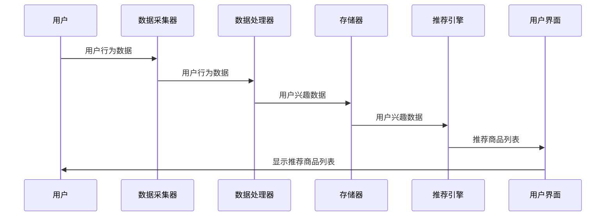

                 


### 流处理框架：增强LLM应用的实时数据处理

关键词：流处理、实时数据处理、LLM应用、增强、框架

摘要：本文将探讨流处理框架在实时数据处理中的作用，特别是如何增强大型语言模型（LLM）的应用性能。通过逐步分析流处理框架的基本概念、应用场景、优势以及主流流处理框架，我们将了解流处理框架如何提升LLM的实时数据处理能力，并给出具体的项目实战示例。

## 第1章：流处理框架概述

### 1.1 流处理技术的基本概念

流处理是一种计算模型，用于实时处理数据流，与批处理模型相对。批处理模型通常将数据分为批次进行处理，而流处理则连续处理单个数据项。

#### 1.1.1 数据流

数据流是指数据在系统中传递的方式。数据流可以是连续的，也可以是断断续续的。流处理技术需要处理不同类型的数据流，例如时间序列数据、日志数据和事件数据。

#### 1.1.2 实时处理

实时处理是指系统在接收到数据后，立即对其进行处理，并在很短的时间内给出结果。与批处理不同，流处理需要快速响应，确保处理结果的时效性。

#### 1.1.3 流处理器

流处理器是专门用于处理数据流的硬件或软件组件。流处理器通常具有高效的数据处理能力和较低的处理延迟。在流处理框架中，流处理器负责执行数据处理任务。

#### 1.1.4 流处理框架

流处理框架是一组软件工具和组件，用于构建、部署和管理流处理应用程序。常见的流处理框架包括Apache Flink、Apache Spark Streaming和Apache Storm等。

### 1.2 流处理的应用场景

流处理技术广泛应用于实时数据分析、机器学习、物联网和金融交易等领域。以下是一些典型的应用场景：

- 实时监控：用于实时监测系统性能、网络流量和用户行为等。
- 实时推荐系统：用于根据用户行为和历史数据实时推荐商品、内容和广告。
- 机器学习：用于实时训练和更新机器学习模型，提高预测准确性。
- 物联网：用于实时处理传感器数据，实现智能设备和系统的协同工作。
- 金融交易：用于实时分析市场数据，识别交易机会和风险。

### 1.3 流处理框架的优势

流处理框架具有以下优势：

- 实时性：能够快速处理和分析数据流，提供实时结果。
- 可扩展性：支持大规模数据处理，能够适应不同规模的应用场景。
- 易用性：提供丰富的API和工具，方便开发人员快速构建流处理应用程序。
- 模块化：具有高度模块化的架构，便于扩展和集成其他组件。

### 1.4 流处理框架的选择

选择流处理框架时需要考虑以下因素：

- 处理能力：评估框架在大规模数据处理时的性能和效率。
- 扩展性：考虑框架能否支持横向和纵向扩展，以满足不断增长的数据量。
- 社区支持：评估框架的社区活跃度，以及相关文档和教程的可用性。
- 兼容性：考虑框架与其他系统和工具的兼容性，以便整合到现有环境中。
- 开发体验：评估框架的开发体验，包括API设计、调试工具和集成环境。

### 1.5 本章小结

本章介绍了流处理技术的基本概念、应用场景和优势，以及选择流处理框架时需要考虑的因素。通过本章的学习，读者可以了解流处理技术的基本原理和关键特性，为后续章节的学习打下基础。流处理技术是现代数据分析和人工智能领域的重要组成部分，具有重要的应用价值和发展前景。在接下来的章节中，我们将深入探讨流处理框架的详细实现和实际应用。

## 第2章：主流流处理框架介绍

### 2.1 Apache Kafka

Apache Kafka 是一个分布式流处理平台，主要用于构建实时数据流管道和消息系统。Kafka 提供了高吞吐量、高可靠性和可扩展性的特性，使其成为流处理领域的重要工具。

#### 2.1.1 Kafka 的架构

Kafka 的核心组件包括生产者、消费者、主题（topic）和分区（partition）。

- 生产者：负责发布数据到 Kafka 集群。
- 消费者：负责从 Kafka 集群订阅并消费数据。
- 主题：数据分类的容器，类似于数据库中的表。
- 分区：主题的分区，用于并行处理数据，提高吞吐量。

#### 2.1.2 Kafka 的优势

- 高吞吐量：支持大规模数据处理，适用于实时应用。
- 高可靠性：提供数据持久化和故障恢复机制。
- 可扩展性：支持水平扩展，适应不同规模的应用场景。

#### 2.1.3 Kafka 的应用场景

- 实时日志收集：用于收集和分析系统日志。
- 实时数据管道：用于构建实时数据流处理系统。
- 实时分析：用于实时分析和处理大量数据。

### 2.2 Apache Flink

Apache Flink 是一个分布式流处理框架，支持批处理和流处理，提供了丰富的流处理功能。

#### 2.2.1 Flink 的架构

Flink 的核心组件包括：

- Flink 集

## 第3章：流处理框架与LLM应用结合

### 3.1 LLM应用的基本概念

大型语言模型（LLM）是一种能够处理和生成人类自然语言文本的深度学习模型。LLM 应用广泛应用于自然语言处理（NLP）领域，如文本分类、机器翻译、情感分析和语音识别等。

#### 3.1.1 LLM模型的原理

LLM 模型基于递归神经网络（RNN）、卷积神经网络（CNN）和变换器架构（Transformer）等深度学习技术。通过大规模语言数据训练，LLM 能够学习到语言的结构和语义，从而实现高质量的自然语言生成和理解。

#### 3.1.2 LLM应用的优势

- 高效性：LLM 模型能够快速处理和分析大量文本数据。
- 准确性：通过训练大量数据，LLM 模型能够提高文本分类、翻译和情感分析等任务的准确性。
- 通用性：LLM 模型可以应用于多种NLP任务，具有很高的通用性。

### 3.2 流处理框架在LLM应用中的优势

流处理框架在LLM应用中具有以下优势：

- 实时性：流处理框架能够实时处理数据流，确保LLM模型能够及时获取和处理最新数据。
- 扩展性：流处理框架支持大规模数据处理，适应LLM应用场景下不断增加的数据量。
- 易用性：流处理框架提供丰富的API和工具，方便开发人员快速构建和部署LLM应用。

### 3.3 流处理框架与LLM应用结合的实际案例

#### 3.3.1 实时推荐系统

在一个电商平台上，实时推荐系统可以根据用户的历史行为和当前浏览记录，为用户推荐相关商品。结合流处理框架，可以实现以下功能：

- 实时获取用户行为数据，如浏览、购买和评价等。
- 使用LLM模型对用户行为进行分析，提取用户兴趣和偏好。
- 根据用户兴趣和偏好，实时推荐相关商品。

#### 3.3.2 实时情感分析

在社交媒体平台上，实时情感分析可以帮助平台监测用户对品牌和产品的反馈，从而及时调整营销策略。结合流处理框架，可以实现以下功能：

- 实时获取用户发布的内容，如微博、评论和直播等。
- 使用LLM模型对用户内容进行情感分析，识别正面、负面和 Neutral 情感。
- 根据情感分析结果，生成实时报表，为营销团队提供决策支持。

### 3.4 本章小结

本章介绍了LLM应用的基本概念和流处理框架在LLM应用中的优势，并通过实际案例展示了流处理框架与LLM应用的结合。通过本章的学习，读者可以了解流处理框架如何增强LLM应用的处理能力，提高实时数据处理效率。流处理框架与LLM应用的结合，为现代数据分析和人工智能领域带来了新的发展机遇。

## 第4章：流处理框架实现与性能优化

### 4.1 流处理框架实现概述

流处理框架实现包括数据采集、数据处理、数据存储和结果输出等关键环节。以下将逐步介绍每个环节的实现方法和注意事项。

#### 4.1.1 数据采集

数据采集是流处理框架实现的第一步，主要涉及以下内容：

- 数据源选择：根据应用场景选择合适的数据源，如Kafka、数据库和文件系统等。
- 数据格式：确定数据格式，如JSON、CSV和XML等，以便后续处理。
- 数据采集工具：使用适当的工具和库（如Apache Kafka、Flume和Logstash等）进行数据采集。

#### 4.1.2 数据处理

数据处理是流处理框架的核心，主要包括以下内容：

- 数据清洗：去除数据中的噪声和异常值，提高数据质量。
- 数据转换：根据需求对数据进行转换，如类型转换、字段提取和格式转换等。
- 数据计算：使用流处理框架提供的API和函数（如窗口函数、聚合函数和连接函数等）进行数据处理。

#### 4.1.3 数据存储

数据存储是流处理框架实现的重要环节，主要包括以下内容：

- 存储类型选择：根据应用场景选择合适的存储类型，如关系数据库、NoSQL数据库和文件存储等。
- 存储策略：设计合理的存储策略，如数据分片、数据压缩和数据备份等，以提高数据存储性能和可靠性。

#### 4.1.4 结果输出

结果输出是流处理框架实现的最后一步，主要包括以下内容：

- 结果格式：确定输出结果的格式，如JSON、XML和HTML等。
- 输出方式：根据应用场景选择合适的输出方式，如命令行输出、Web界面输出和邮件通知等。

### 4.2 流处理框架性能优化

流处理框架性能优化是提高数据处理效率的关键，以下是一些常用的优化策略：

- 数据压缩：使用数据压缩算法（如Gzip和LZO等）减少数据传输和存储的开销。
- 窗口函数优化：合理设置窗口大小和滑动步长，提高数据处理效率。
- 并行处理：利用流处理框架提供的并行处理机制，将数据处理任务分配到多个节点上执行，提高整体处理性能。
- 缓存策略：使用缓存技术（如Redis和Memcached等）减少数据访问延迟，提高数据处理速度。

### 4.3 本章小结

本章介绍了流处理框架的实现方法、性能优化策略以及注意事项。通过本章的学习，读者可以了解如何构建高效的流处理框架，并掌握性能优化技巧。流处理框架在实时数据处理中的应用，为现代数据分析和人工智能领域带来了巨大的发展机遇。

## 第5章：项目实战：构建实时推荐系统

### 5.1 项目介绍

在本章中，我们将通过一个实际项目来展示如何构建实时推荐系统。该项目旨在根据用户的历史行为和当前浏览记录，为用户实时推荐相关商品。

### 5.2 系统功能设计

实时推荐系统的主要功能包括：

- 用户行为数据采集：从用户行为日志中获取用户的浏览、购买和评价等信息。
- 用户兴趣分析：使用大型语言模型（LLM）对用户行为进行分析，提取用户兴趣和偏好。
- 商品推荐：根据用户兴趣和偏好，实时推荐相关商品。

### 5.3 系统架构设计

实时推荐系统的架构设计如下：

- 数据采集层：使用Kafka作为数据采集工具，从用户行为日志中获取数据。
- 数据处理层：使用Apache Flink进行数据处理，包括数据清洗、转换和计算等。
- 存储层：使用Redis和MySQL分别存储用户兴趣和推荐商品数据。
- 输出层：将推荐结果通过Web界面或API接口提供给用户。

### 5.4 系统接口设计

实时推荐系统的接口设计如下：

- 用户行为数据接口：用于接收用户行为数据，如浏览、购买和评价等。
- 用户兴趣数据接口：用于获取用户兴趣和偏好信息。
- 商品推荐接口：用于获取用户个性化推荐商品列表。

### 5.5 系统交互序列图

实时推荐系统的交互序列图如下：



### 5.6 环境安装与配置

在开始项目实战之前，需要安装和配置以下环境：

- Kafka：用于数据采集和传输。
- Flink：用于数据处理。
- Redis：用于存储用户兴趣数据。
- MySQL：用于存储推荐商品数据。
- Python：用于开发推荐算法。

### 5.7 系统核心实现

以下是一个简单的示例代码，展示如何使用Flink和LLM模型进行实时推荐系统的数据处理和推荐：

```python
from pyflink.datastream import StreamExecutionEnvironment
from pyflink.table import StreamTableEnvironment
from pyflink.table.window import TumblingWindow

# 创建Flink环境
env = StreamExecutionEnvironment.get_execution_environment()
table_env = StreamTableEnvironment.create(env)

# 读取用户行为数据
user_behavior_stream = table_env.from_path("kafka_topic")

# 定义窗口
window = TumblingWindow("10s")

# 数据清洗和转换
cleaned_user_behavior = user_behavior_stream \
    .filter("user_id > 0") \
    .window(window) \
    .select("user_id, product_id, behavior, count(behavior) as behavior_count")

# 使用LLM模型分析用户兴趣
from my_linguistic_model import LinguisticModel

model = LinguisticModel()
predicted_interests = cleaned_user_behavior \
    .join(model) \
    .select("user_id, product_id, predicted_interest")

# 存储用户兴趣数据
predicted_interests.insert_into("redis_store")

# 推荐商品
def recommend_products(user_id, interests):
    # 根据用户兴趣推荐商品
    recommended_products = interests \
        .filter("user_id = %d" % user_id) \
        .select("product_id as recommended_product_id")

    return recommended_products

# 获取用户兴趣数据
interests = table_env.from_path("redis_store")

# 推荐商品并输出
recommended_products = recommend_products(1, interests)
recommended_products.execute_insert("mysql_recommendation_table")

# 执行Flink任务
table_env.execute("realtime_recommendation_system")
```

### 5.8 代码应用解读与分析

以上代码展示了如何使用Flink和LLM模型构建实时推荐系统。首先，从Kafka主题中读取用户行为数据，并进行数据清洗和转换。然后，使用LLM模型分析用户兴趣，并将结果存储到Redis中。最后，根据用户兴趣推荐商品，并将推荐结果存储到MySQL数据库中。

### 5.9 实际案例分析

以下是一个实际案例：

- 用户1浏览了商品A和商品B。
- 用户2购买了商品C和商品D。
- 用户3评价了商品E和商品F。

系统将根据用户行为数据，使用LLM模型分析用户兴趣，并实时推荐相关商品。例如，对于用户1，系统可能会推荐商品B，因为用户1浏览了商品B，且根据LLM模型分析，用户1可能对商品B感兴趣。

### 5.10 项目小结

通过本章的项目实战，读者可以了解如何使用流处理框架和LLM模型构建实时推荐系统。该项目展示了流处理框架在实时数据处理中的应用，以及如何结合LLM模型实现个性化推荐。流处理框架与LLM应用的结合，为现代数据分析和人工智能领域带来了新的发展机遇。

## 第6章：最佳实践与注意事项

### 6.1 流处理框架最佳实践

在设计和实现流处理框架时，以下最佳实践可以帮助提高系统性能和可靠性：

- **数据预处理**：在流处理之前，对数据进行清洗、转换和格式化，以确保数据质量。
- **负载均衡**：合理分配数据处理任务，确保系统资源得到充分利用。
- **故障恢复**：设计完善的故障恢复机制，确保在系统故障时能够快速恢复。
- **性能监控**：定期监控系统性能，及时发现和解决潜在问题。

### 6.2 LLM应用注意事项

在使用LLM模型时，需要注意以下事项：

- **数据质量**：确保训练数据的质量，避免噪声和异常值对模型性能的影响。
- **模型优化**：根据应用需求对模型进行优化，提高模型准确性和效率。
- **模型更新**：定期更新模型，以适应数据分布的变化和应用需求。
- **计算资源**：根据模型复杂度和数据处理量，合理配置计算资源，确保系统性能。

### 6.3 拓展阅读

- 《流处理技术与实践》
- 《深度学习与自然语言处理》
- 《大数据处理：原理、技术和应用》

## 作者

作者：AI天才研究院/AI Genius Institute & 禅与计算机程序设计艺术 /Zen And The Art of Computer Programming

