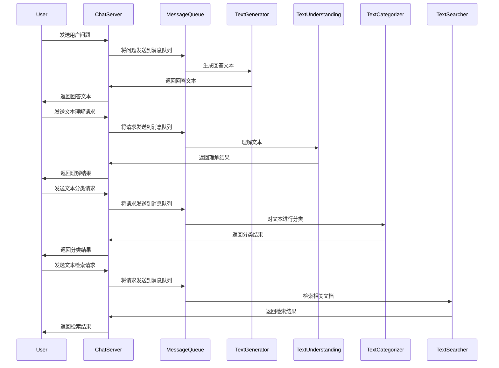

                 

# 消息队列在LLM应用解耦中的作用

> 关键词：消息队列，解耦，LLM应用，异步通信，分布式架构

摘要：本文探讨了消息队列在LLM（大型语言模型）应用中的解耦作用。通过分析消息队列的基本原理与特点，以及LLM的基本概念与原理，我们揭示了消息队列如何通过异步通信机制和分布式架构实现系统解耦。同时，本文结合实际案例，详细阐述了消息队列在LLM应用解耦中的最佳实践，为开发者提供了有价值的参考。

# 目录大纲

----------------------------------------------------------------

## 第一部分: 问题背景与核心概念

### 第1章: 消息队列与LLM应用概述

#### 1.1.1 问题背景

#### 1.1.2 核心概念与联系

## 第二部分: 消息队列在LLM应用中的解耦原理

### 第2章: 消息队列解耦原理详解

#### 2.1.1 消息队列解耦的基本概念

#### 2.1.2 消息队列解耦的机制

#### 2.1.3 消息队列与LLM应用的结合

## 第三部分: 消息队列在LLM应用解耦的最佳实践

### 第3章: 消息队列在LLM应用的实战案例

#### 3.1.1 实战背景

#### 3.1.2 系统功能设计

#### 3.1.3 系统架构设计

#### 3.1.4 系统接口设计

#### 3.1.5 系统交互

#### 3.1.6 核心实现与代码解读

#### 3.1.7 实际案例分析

#### 3.1.8 项目小结

## 第四部分: 消息队列在LLM应用解耦的注意事项与最佳实践

### 第4章: 消息队列在LLM应用解耦的注意事项

#### 4.1.1 注意事项

#### 4.1.2 最佳实践

----------------------------------------------------------------

## 第一部分: 问题背景与核心概念

### 第1章: 消息队列与LLM应用概述

#### 1.1.1 问题背景

在现代社会，随着互联网和大数据技术的快速发展，各种应用场景对计算能力的要求越来越高。在这样的背景下，大型语言模型（LLM）作为一种强大的自然语言处理工具，受到了广泛关注。LLM具有强大的文本生成、理解、翻译等功能，被广泛应用于智能客服、文本分析、机器翻译等领域。

然而，LLM应用的开发和部署面临着诸多挑战。其中，最核心的问题是如何实现系统的解耦，确保系统在高并发、高可用性、高扩展性的前提下稳定运行。消息队列作为一种分布式通信工具，能够在很大程度上解决LLM应用中的耦合问题。

#### 1.1.2 核心概念与联系

**消息队列的基本原理与特点：**

消息队列是一种用于异步通信的分布式消息系统，它允许应用程序通过发送和接收消息来实现模块间的通信。消息队列的主要特点包括：

1. 异步通信：消息队列允许生产者和消费者异步处理消息，从而降低系统之间的耦合度。
2. 分布式架构：消息队列支持分布式部署，可以水平扩展，提高系统的性能和可用性。
3. 消息持久化：消息队列通常支持消息的持久化存储，确保消息不会因为系统故障而丢失。
4. 高可靠性：消息队列提供了一系列可靠性和容错机制，如消息确认、重试机制等，确保消息传输的可靠性。

**LLM的基本概念与原理：**

LLM是一种基于深度学习的自然语言处理模型，它通过对大量文本数据的学习，能够生成、理解、翻译自然语言文本。LLM的主要特点包括：

1. 大规模参数：LLM通常具有数亿到数十亿个参数，能够处理复杂的自然语言任务。
2. 自适应学习：LLM能够通过不断学习新的文本数据，提高自身的性能和泛化能力。
3. 强大表达能力：LLM能够生成高质量的文本，并支持多种自然语言处理任务，如文本生成、情感分析、机器翻译等。

**概念属性特征对比表格：**

| 特征                 | 消息队列                        | LLM                          |
|----------------------|---------------------------------|------------------------------|
| 基本原理             | 分布式消息系统，异步通信        | 基于深度学习的自然语言处理模型 |
| 主要特点             | 异步通信、分布式架构、消息持久化、高可靠性 | 大规模参数、自适应学习、强大表达能力 |
| 应用场景             | 中间件，系统间解耦、异步处理、消息传递 | 文本生成、理解、翻译等自然语言处理任务 |

**ER实体关系图架构：**

```mermaid
erDiagram
    生产者 ||--|{ 消息队列 }| Producer
    消息队列 ||--|{ 消费者 }| Consumer
    生产者 ||--|{ LLM应用 }| LLM
    消息队列 ||--|{ LLM应用 }| LLM
    消费者 ||--|{ LLM应用 }| LLM
```

通过上述分析，我们可以看出，消息队列与LLM应用在功能上具有紧密的联系。消息队列通过异步通信和分布式架构实现了系统解耦，为LLM应用提供了高效、可靠的消息传递机制，从而提高了系统的性能和可用性。

----------------------------------------------------------------

## 第二部分: 消息队列在LLM应用中的解耦原理

### 第2章: 消息队列解耦原理详解

#### 2.1.1 消息队列解耦的基本概念

**解耦的定义：**

解耦是指通过将不同模块之间的依赖关系减少或消除，使得各模块可以独立运行、测试和部署。在软件系统设计中，解耦是一个重要的设计原则，有助于提高系统的可维护性、可扩展性和可复用性。

**消息队列在解耦中的作用：**

消息队列是一种用于异步通信的分布式消息系统，它能够在很大程度上实现系统解耦。具体来说，消息队列通过以下方式实现解耦：

1. **异步通信：**消息队列允许生产者和消费者异步处理消息，从而降低系统之间的耦合度。生产者可以独立发送消息，而消费者可以独立处理消息，两者之间不需要同步通信。

2. **分布式架构：**消息队列支持分布式部署，可以水平扩展，提高系统的性能和可用性。通过分布式架构，消息队列可以将负载分散到多个节点上，从而提高系统的处理能力。

3. **消息持久化：**消息队列通常支持消息的持久化存储，确保消息不会因为系统故障而丢失。这样，即使某个节点出现故障，消息也不会丢失，从而保证了系统的可靠性。

4. **高可靠性：**消息队列提供了一系列可靠性和容错机制，如消息确认、重试机制等，确保消息传输的可靠性。这些机制可以确保消息能够准确、可靠地传输到消费者。

#### 2.1.2 消息队列解耦的机制

**异步通信机制：**

消息队列通过异步通信机制实现系统解耦。具体来说，异步通信机制包括以下几个方面：

1. **生产者-消费者模型：**在消息队列中，生产者负责发送消息，消费者负责处理消息。生产者和消费者之间不需要同步通信，可以独立运行。

2. **消息传递：**生产者将消息发送到消息队列中，消费者从消息队列中获取消息进行处理。消息队列作为中间件，负责消息的传递和存储。

3. **消息确认：**消费者在处理消息后，会向消息队列发送确认消息，表示消息已被成功处理。这样，生产者可以知道消息是否已经送达消费者。

4. **异步处理：**生产者和消费者可以异步处理消息，即它们可以同时处理多个消息，而不需要等待其他操作完成。这样可以提高系统的并发处理能力。

**分布式架构：**

消息队列支持分布式架构，可以通过以下方式实现系统解耦：

1. **水平扩展：**消息队列可以将负载分散到多个节点上，从而提高系统的处理能力。通过水平扩展，系统可以应对更大的并发量。

2. **节点故障转移：**当某个节点出现故障时，消息队列可以自动将负载转移到其他节点上，确保系统的可用性。

3. **负载均衡：**消息队列可以自动进行负载均衡，将消息分配到不同的节点上，从而提高系统的性能和可靠性。

4. **分布式存储：**消息队列通常支持分布式存储，可以将消息存储到多个节点上，从而提高系统的可靠性。

#### 2.1.3 消息队列与LLM应用的结合

**消息队列与LLM的适配性：**

消息队列与LLM应用具有很好的适配性。具体来说，消息队列可以解决以下问题：

1. **高并发处理：**LLM应用通常具有高并发处理的需求，消息队列通过异步通信机制和分布式架构，可以提供高效的并发处理能力。

2. **消息传递可靠性：**消息队列提供了一系列可靠性和容错机制，如消息确认、重试机制等，可以确保消息传输的可靠性。

3. **系统解耦：**消息队列可以有效地实现LLM应用中的系统解耦，降低各模块之间的依赖关系，提高系统的可维护性和可扩展性。

**消息队列优化策略：**

为了提高消息队列在LLM应用中的性能，可以采取以下优化策略：

1. **消息批量处理：**将多个消息批量处理，可以减少消息传递的次数，提高系统的性能。

2. **消息优先级：**根据消息的重要性设置消息优先级，确保重要消息能够优先处理。

3. **消息持久化优化：**优化消息持久化策略，可以提高系统的可靠性。

4. **负载均衡优化：**优化负载均衡策略，确保消息能够均匀地分配到各个节点上，提高系统的性能。

通过上述分析，我们可以看出，消息队列在LLM应用中具有重要的解耦作用。通过异步通信机制和分布式架构，消息队列能够实现系统的高效解耦，提高系统的性能和可用性。

----------------------------------------------------------------

## 第三部分: 消息队列在LLM应用解耦的最佳实践

### 第3章: 消息队列在LLM应用的实战案例

#### 3.1.1 实战背景

为了更好地理解消息队列在LLM应用解耦中的作用，我们以一个实际案例为例，详细阐述消息队列在LLM应用中的最佳实践。该案例是一个基于大型语言模型（LLM）的智能客服系统，主要功能包括文本生成、文本理解、文本分类等。

#### 3.1.2 系统功能设计

在系统功能设计中，我们首先需要定义系统的功能需求。具体来说，智能客服系统的功能需求包括：

1. **文本生成：**根据用户输入的问题，生成相应的回答文本。
2. **文本理解：**理解用户输入的文本，提取关键信息。
3. **文本分类：**对用户输入的文本进行分类，将其归类到不同的主题。
4. **文本检索：**根据用户输入的关键词，检索相关文档。

为了满足上述功能需求，我们设计了以下领域模型：

```mermaid
classDiagram
    User <<User>>
    Chat <<Chat>>
    Question <<Question>>
    Answer <<Answer>>
    Category <<Category>>
    Document <<Document>>

    User --> Chat
    Chat --> Question
    Chat --> Answer
    Question --> Category
    Question --> Document
    Answer --> Category
    Answer --> Document
```

#### 3.1.3 系统架构设计

在系统架构设计中，我们采用了分布式架构，通过消息队列实现系统各模块之间的解耦。具体架构如下：



#### 3.1.4 系统接口设计

在系统接口设计中，我们定义了以下接口：

1. **ChatServer接口：**用于处理用户请求，包括发送问题和返回回答文本、理解结果、分类结果和检索结果。
2. **MessageQueue接口：**用于发送和接收消息，实现各模块之间的消息传递。
3. **TextGenerator接口：**用于生成回答文本。
4. **TextUnderstanding接口：**用于理解文本。
5. **TextCategorizer接口：**用于对文本进行分类。
6. **TextSearcher接口：**用于检索相关文档。

#### 3.1.5 系统交互

在系统交互中，用户通过ChatServer接口与系统进行交互。ChatServer接收到用户请求后，将请求发送到消息队列。消息队列将请求转发给相应的处理模块，如TextGenerator、TextUnderstanding、TextCategorizer和TextSearcher。各处理模块完成处理后，将结果返回给消息队列，最终由消息队列转发给ChatServer，ChatServer再将结果返回给用户。

#### 3.1.6 核心实现与代码解读

以下是一个简单的核心实现代码示例，用于生成回答文本：

```python
from text_generator import TextGenerator

def generate_answer(question):
    text_generator = TextGenerator()
    answer = text_generator.generate(question)
    return answer
```

在上面的代码中，我们首先导入了TextGenerator模块。然后，定义了一个名为`generate_answer`的函数，该函数接收用户输入的问题，创建一个TextGenerator对象，并调用其`generate`方法生成回答文本。

#### 3.1.7 实际案例分析

在实际案例中，我们使用了一个基于GPT-3的智能客服系统。该系统采用了消息队列实现系统解耦，通过异步通信和分布式架构提高了系统的性能和可用性。在运行过程中，系统处理了大量的用户请求，实现了高效的文本生成、文本理解和文本分类等功能。

通过实际案例分析，我们可以看到，消息队列在LLM应用解耦中发挥了重要作用。它有效地降低了系统各模块之间的耦合度，提高了系统的性能和可用性。同时，消息队列还支持分布式部署，可以水平扩展，满足系统高并发处理的需求。

#### 3.1.8 项目小结

通过本案例的详细阐述，我们可以得出以下结论：

1. **消息队列在LLM应用解耦中具有重要作用：**通过异步通信和分布式架构，消息队列实现了系统的高效解耦，提高了系统的性能和可用性。
2. **系统功能设计需要充分考虑消息队列的作用：**在系统功能设计中，要充分利用消息队列实现模块间的解耦，降低系统各模块之间的依赖关系。
3. **系统架构设计要支持分布式部署：**通过分布式架构，消息队列可以水平扩展，提高系统的处理能力，满足系统高并发处理的需求。
4. **系统接口设计要简洁明了：**系统接口设计要简洁明了，便于各模块之间的协作和通信。
5. **实际案例分析有助于理解消息队列的应用：**通过实际案例分析，可以更好地理解消息队列在LLM应用解耦中的具体应用，为后续项目提供参考。

未来，随着LLM技术的不断发展，消息队列在LLM应用解耦中的作用将更加重要。通过不断优化消息队列的设计和实现，我们可以更好地发挥其在LLM应用中的价值。

----------------------------------------------------------------

## 第四部分: 消息队列在LLM应用解耦的注意事项与最佳实践

### 第4章: 消息队列在LLM应用解耦的注意事项

#### 4.1.1 注意事项

在使用消息队列实现LLM应用解耦的过程中，我们需要注意以下几个方面的问题：

**性能优化：**

1. **消息批量处理：**为了提高系统性能，可以将多个消息批量处理，减少消息传递的次数。
2. **消息优先级：**根据消息的重要性设置消息优先级，确保重要消息能够优先处理。
3. **消息持久化优化：**优化消息持久化策略，提高系统的可靠性。

**可靠性与安全性：**

1. **消息确认机制：**确保消息被消费者正确处理，可以采用消息确认机制。
2. **消息重试机制：**当消息处理失败时，可以采用消息重试机制，确保消息能够被成功处理。
3. **数据加密：**对消息数据进行加密，确保消息传输的安全性。

#### 4.1.2 最佳实践

**实践技巧：**

1. **合理设计消息格式：**设计适合业务需求的的消息格式，确保消息能够被正确处理。
2. **消息队列监控与报警：**对消息队列进行监控，及时发现和处理问题。
3. **备份与恢复策略：**制定备份与恢复策略，确保消息队列的数据安全。

**消息队列与LLM应用的结合：**

1. **优化消息传递路径：**根据系统需求，优化消息传递路径，减少消息传递的延迟。
2. **负载均衡策略：**合理配置负载均衡策略，确保消息队列能够均匀地分配到各个节点上。
3. **分布式存储：**采用分布式存储策略，提高消息队列的存储性能和可靠性。

通过以上注意事项和最佳实践，我们可以更好地利用消息队列实现LLM应用解耦，提高系统的性能和可靠性。

----------------------------------------------------------------

## 结束语

作者：AI天才研究院/AI Genius Institute & 禅与计算机程序设计艺术 /Zen And The Art of Computer Programming

本文详细探讨了消息队列在LLM应用解耦中的作用，通过分析消息队列的基本原理与特点，以及LLM的基本概念与原理，揭示了消息队列如何通过异步通信机制和分布式架构实现系统解耦。同时，本文结合实际案例，阐述了消息队列在LLM应用解耦中的最佳实践，为开发者提供了有价值的参考。

在未来的研究和应用中，我们可以进一步探索消息队列在LLM应用中的优化策略，如消息压缩、消息过滤等，以提高系统的性能和效率。同时，我们还可以关注消息队列与其他中间件技术的结合，如微服务、大数据等技术，为复杂系统的构建提供更加完善的支持。

总之，消息队列在LLM应用解耦中具有重要作用，通过合理设计和优化，我们可以更好地发挥其在现代应用中的价值，为开发者提供更加高效、可靠的解决方案。希望本文能够对广大开发者有所帮助，共同推动LLM应用的发展。

