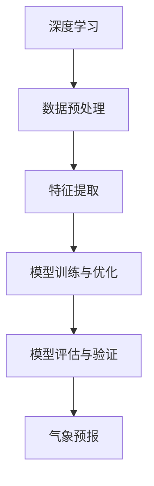
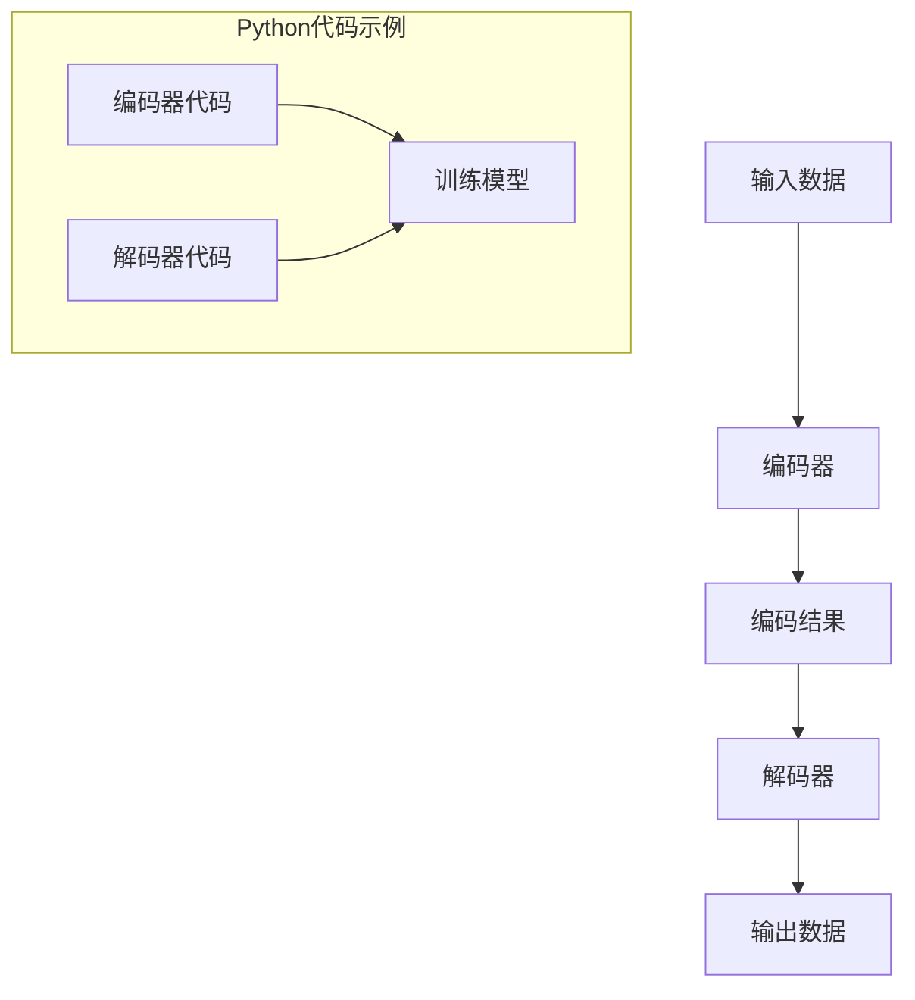
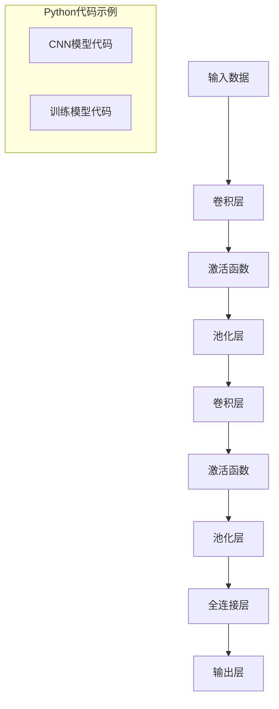
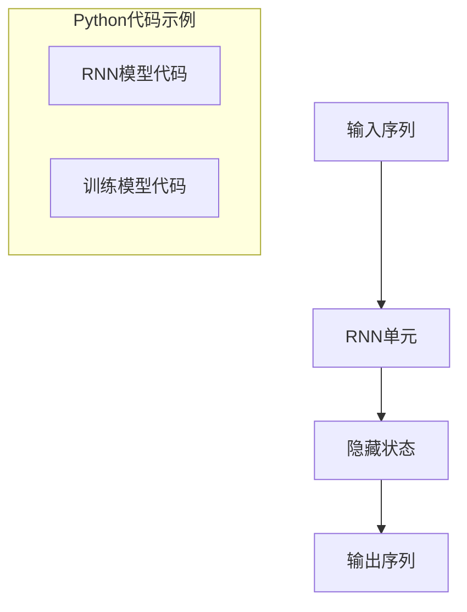
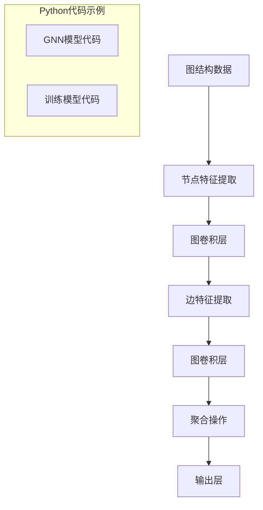
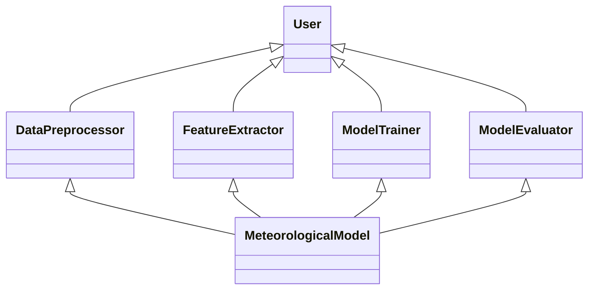
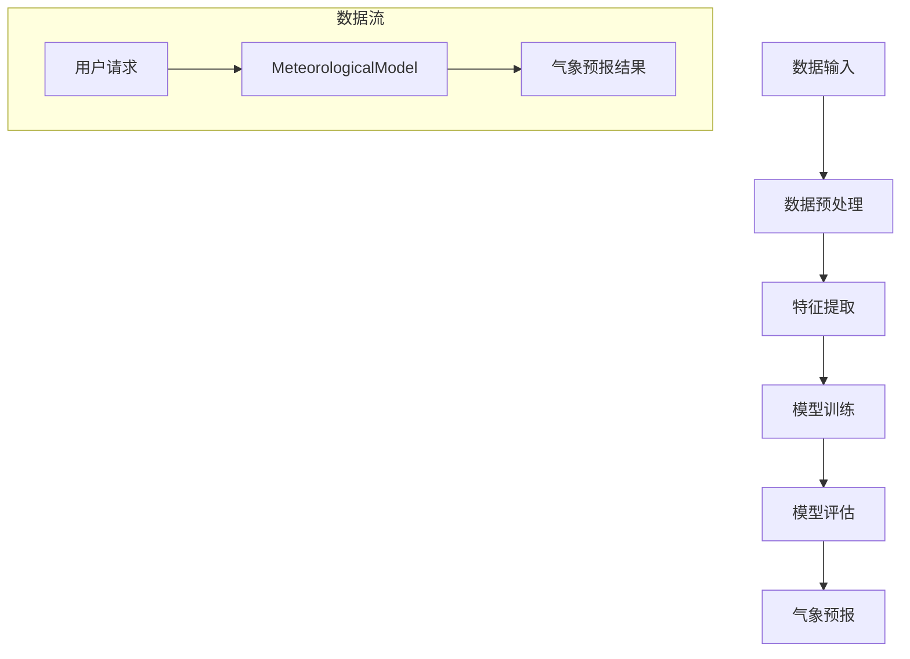
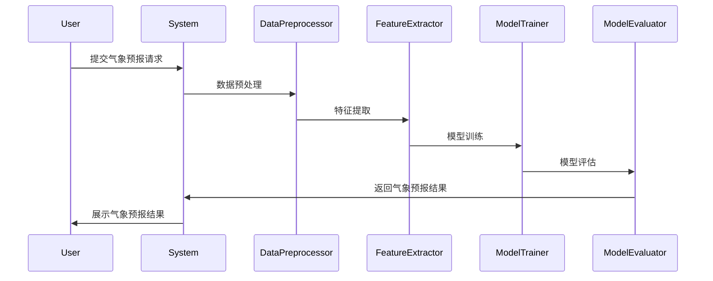

                 


## 深度学习在气象预报中的突破性应用

### 关键词
- 深度学习
- 气象预报
- 突破性应用
- 自动编码器
- 卷积神经网络
- 循环神经网络
- 图神经网络
- 数学模型
- 系统设计
- 项目实践

### 摘要
本文将探讨深度学习在气象预报领域的突破性应用，通过一步步的分析和推理，详细讲解深度学习与气象预报的关系、核心概念、算法原理、数学模型、系统设计与项目实践。旨在为读者提供对深度学习在气象预报领域应用的全面理解和实践指导。

## 目录大纲设计思路

为《深度学习在气象预报中的突破性应用》设计一个详细且逻辑清晰的目录大纲，我们首先需要明确书籍的核心内容和结构。这本书将聚焦于深度学习在气象预报领域的应用，旨在展示深度学习技术如何突破传统气象预报的局限性，提高预报的准确性和效率。以下是设计步骤：

1. **背景介绍与核心概念**：介绍深度学习与气象预报的关系，定义核心概念，展示概念间的联系。
2. **核心概念与联系**：详细解释深度学习和气象预报中的核心概念，使用表格和Mermaid流程图进行说明。
3. **算法原理讲解**：讲解深度学习在气象预报中的算法原理，使用Mermaid流程图和Python源代码示例。
4. **数学模型与公式**：使用LaTeX格式详细讲解数学模型和公式，进行通俗易懂的举例说明。
5. **系统分析与架构设计方案**：介绍气象预报系统的设计，包括问题场景、系统功能设计、系统架构设计、系统接口设计和系统交互。
6. **项目实战**：提供实际的气象预报项目案例，包括环境安装、系统核心实现、代码应用解读、案例分析及详细讲解。
7. **最佳实践与拓展**：提供最佳实践、注意事项和拓展阅读，帮助读者更好地理解和应用深度学习在气象预报中的突破性应用。

### 设计步骤

#### 第一部分：背景介绍与核心概念

**第1章：深度学习与气象预报的关系**
- 1.1 深度学习的发展背景
- 1.2 气象预报的挑战与需求
- 1.3 深度学习在气象预报中的应用
- 1.4 深度学习与气象预报的核心概念
- 1.5 深度学习与气象预报的关系图（Mermaid流程图）

**第2章：深度学习基础**
- 2.1 深度学习的基本原理
- 2.2 深度学习算法与模型
- 2.3 深度学习在气象预报中的核心算法
- 2.4 深度学习算法对比（表格）

#### 第二部分：核心概念与联系

**第3章：深度学习在气象预报中的算法应用**
- 3.1 自动编码器在气象预报中的应用
- 3.2 卷积神经网络（CNN）在气象预报中的应用
- 3.3 循环神经网络（RNN）在气象预报中的应用
- 3.4 图神经网络（GNN）在气象预报中的应用
- 3.5 算法原理与Mermaid流程图（附Python源代码示例）

#### 第三部分：算法原理讲解

**第4章：数学模型与公式**
- 4.1 自动编码器的数学模型
- 4.2 卷积神经网络的数学模型
- 4.3 循环神经网络的数学模型
- 4.4 图神经网络的数学模型
- 4.5 模型优化与调参（LaTeX公式示例）

#### 第四部分：系统分析与架构设计方案

**第5章：气象预报系统设计**
- 5.1 问题场景介绍
- 5.2 系统功能设计（Mermaid类图）
- 5.3 系统架构设计（Mermaid架构图）
- 5.4 系统接口设计
- 5.5 系统交互（Mermaid序列图）

#### 第五部分：项目实战

**第6章：深度学习在气象预报中的项目实践**
- 6.1 环境安装与配置
- 6.2 系统核心实现与代码解读
- 6.3 实际案例分析与讲解
- 6.4 项目小结与总结

#### 第六部分：最佳实践与拓展

**第7章：深度学习在气象预报中的最佳实践**
- 7.1 最佳实践技巧
- 7.2 注意事项与问题解决
- 7.3 拓展阅读与进一步学习
- 7.4 小结与展望

### 目录大纲

----------------------------------------------------------------

## 第一部分：背景介绍与核心概念

### 第1章: 深度学习与气象预报的关系

### 第2章: 深度学习基础

### 第3章: 深度学习在气象预报中的算法应用

### 第4章: 数学模型与公式

### 第5章: 气象预报系统设计

### 第6章: 深度学习在气象预报中的项目实践

### 第7章: 深度学习在气象预报中的最佳实践

-------------------------------------------------

----------------------------------------------------------------

### 第一部分：背景介绍与核心概念

#### 第1章：深度学习与气象预报的关系

**1.1 深度学习的发展背景**

深度学习起源于上世纪80年代，在神经网络的研究基础上逐渐发展起来。随着计算能力的提升和数据量的增加，深度学习在图像识别、自然语言处理等领域取得了显著的成果。近年来，深度学习模型如卷积神经网络（CNN）、循环神经网络（RNN）和生成对抗网络（GAN）等，已经在许多实际应用中展现了强大的能力。

**1.2 气象预报的挑战与需求**

气象预报是一个复杂且重要的领域，对人类生产生活有着深远的影响。然而，传统的气象预报方法在面对日益复杂的大气状况时，存在以下几个主要挑战：

- **数据量庞大**：气象数据包含大量的历史数据、实时数据以及不同类型的气象参数，如何有效处理这些数据是气象预报的关键问题。
- **数据质量参差不齐**：气象数据的采集过程中，可能存在误差、缺失和噪声等问题，这些都会影响预报的准确性。
- **非线性关系**：气象系统的变化通常是高度非线性的，传统的线性模型难以捕捉到这些复杂的非线性关系。
- **时效性要求高**：气象预报需要实时更新，以便为人们的日常生活和活动提供及时的信息。

**1.3 深度学习在气象预报中的应用**

深度学习为解决上述问题提供了新的思路和工具。其优点包括：

- **数据处理能力强**：深度学习模型能够自动从大量数据中提取特征，适应不同质量的数据。
- **处理非线性关系**：深度学习模型能够捕捉到复杂的数据之间的非线性关系，提高预报的准确性。
- **自适应性强**：通过不断的学习和调整，深度学习模型能够适应不断变化的大气状况，提供更加准确的预报。

**1.4 深度学习与气象预报的核心概念**

在深度学习与气象预报的结合中，以下几个核心概念至关重要：

- **数据预处理**：包括数据清洗、归一化、缺失值处理等，以确保输入数据的质量。
- **特征提取**：深度学习模型通过多层网络结构自动提取有效特征，提高模型的性能。
- **模型训练与优化**：通过大量的训练数据和先进的优化算法，模型能够不断学习和调整，提高预报的准确性。
- **模型评估与验证**：使用准确率、均方误差等指标评估模型的性能，确保预报结果的可靠性。

**1.5 深度学习与气象预报的关系图（Mermaid流程图）**



通过上述步骤，深度学习技术为气象预报提供了强有力的支持，有助于解决传统方法面临的挑战，提高预报的准确性和效率。

### 第2章：深度学习基础

**2.1 深度学习的基本原理**

深度学习是一种基于多层神经网络构建的机器学习技术。其核心思想是通过多层非线性变换，将输入数据转化为高层次的抽象表示，从而实现复杂的任务。深度学习模型通常包括以下几个关键组成部分：

- **输入层**：接收原始数据。
- **隐藏层**：通过一系列非线性激活函数对数据进行处理和变换。
- **输出层**：产生最终的结果或预测。

在深度学习模型中，每个节点（神经元）都与其他节点相连接，并带有相应的权重。通过反向传播算法，模型能够自动调整这些权重，以达到最佳性能。

**2.2 深度学习算法与模型**

深度学习包括多种算法和模型，每种模型都有其特定的应用场景和优势。以下是几种常见的深度学习模型：

- **卷积神经网络（CNN）**：特别适用于处理图像数据，通过卷积操作和池化操作，CNN能够有效地提取图像中的特征。
- **循环神经网络（RNN）**：适用于处理序列数据，如时间序列数据、文本数据等。RNN能够通过记忆机制捕捉数据中的时间依赖关系。
- **生成对抗网络（GAN）**：由生成器和判别器两个部分组成，通过对抗训练，GAN能够生成高度逼真的数据。
- **自编码器**：用于数据压缩和特征提取，通过编码和解码过程，自编码器能够学习数据的低维表示。

**2.3 深度学习在气象预报中的核心算法**

在气象预报领域，深度学习算法的选择取决于数据类型和预报任务的需求。以下是几种在气象预报中应用广泛的深度学习算法：

- **卷积神经网络（CNN）**：CNN通过卷积操作和池化操作，能够从气象数据中提取有效的时空特征，提高预报的准确性。
- **循环神经网络（RNN）**：RNN通过记忆机制，能够捕捉气象数据中的时间依赖关系，对时间序列数据进行预测。
- **长短时记忆网络（LSTM）**：LSTM是RNN的一种变体，能够更好地解决长序列数据中的梯度消失问题，适用于长时间跨度气象预报。
- **变分自编码器（VAE）**：VAE通过编码和解码过程，能够对气象数据进行有效压缩和特征提取，提高数据利用效率。

**2.4 深度学习算法对比（表格）**

| 算法名称 | 适用数据类型 | 主要优点 | 主要缺点 | 应用场景 |
| --- | --- | --- | --- | --- |
| 卷积神经网络（CNN） | 图像、气象数据 | 提取特征能力强 | 计算量大 | 图像识别、气象预报 |
| 循环神经网络（RNN） | 序列数据 | 良好的序列建模能力 | 梯度消失问题 | 时间序列预测、语音识别 |
| 长短时记忆网络（LSTM） | 序列数据 | 解决梯度消失问题 | 参数复杂 | 时间序列预测、股票市场分析 |
| 变分自编码器（VAE） | 高维数据 | 数据压缩、特征提取 | 难以优化 | 数据去噪、生成对抗网络 |

通过上述对比，我们可以看出，不同的深度学习算法适用于不同类型的数据和任务。在实际应用中，可以根据具体需求选择合适的算法，以提高气象预报的准确性和效率。

### 第二部分：核心概念与联系

#### 第3章：深度学习在气象预报中的算法应用

**3.1 自动编码器在气象预报中的应用**

自动编码器（Autoencoder）是一种无监督学习算法，主要用于数据压缩和特征提取。它由两个主要部分组成：编码器和解码器。编码器将输入数据映射到低维空间，解码器则将低维数据还原回原始空间。在气象预报中，自动编码器可以用于以下方面：

- **数据预处理**：自动编码器可以去除数据中的噪声，提高数据质量。
- **特征提取**：通过编码器，自动编码器能够从气象数据中提取有用的特征，有助于提高预报模型的性能。
- **数据降维**：自动编码器可以将高维气象数据降维到低维空间，减少计算量和存储需求。

**3.2 卷积神经网络（CNN）在气象预报中的应用**

卷积神经网络（CNN）是一种专门用于处理图像数据的深度学习模型，但由于其强大的特征提取能力，CNN也被广泛应用于气象预报中。CNN在气象预报中的应用主要包括：

- **时空特征提取**：CNN通过卷积操作和池化操作，能够从气象数据中提取有效的时空特征，这些特征对于气象预报具有重要意义。
- **多尺度分析**：CNN能够同时捕捉到气象数据中的不同尺度特征，从而提高预报的准确性。
- **图像风格迁移**：CNN还可以用于气象图像的风格迁移，将一种气象图像风格应用到另一种气象图像上，以提供更直观的预报结果。

**3.3 循环神经网络（RNN）在气象预报中的应用**

循环神经网络（RNN）是一种适用于处理序列数据的深度学习模型，其内部包含一个循环结构，能够记忆之前的输入信息。RNN在气象预报中的应用主要包括：

- **时间序列预测**：RNN能够捕捉到气象数据中的时间依赖关系，用于预测未来的气象状况。
- **异常检测**：RNN可以通过分析气象数据序列，识别出异常的气象事件，如极端天气现象。
- **多变量时间序列分析**：RNN能够同时处理多个变量的时间序列数据，提供更全面的气象预报。

**3.4 图神经网络（GNN）在气象预报中的应用**

图神经网络（GNN）是一种用于处理图结构数据的深度学习模型，其能够通过学习节点和边的关系，提取有效的特征。GNN在气象预报中的应用主要包括：

- **气象数据网络建模**：GNN可以将气象数据建模为一个图结构，通过学习节点和边的关系，提取出有用的气象特征。
- **时空关系分析**：GNN能够分析气象数据中的时空关系，捕捉到数据之间的复杂关联。
- **气象事件预测**：GNN可以通过学习气象数据中的时空关系，预测未来的气象事件，如台风路径、降水分布等。

**3.5 算法原理与Mermaid流程图（附Python源代码示例）**

为了更好地理解这些算法在气象预报中的应用，我们使用Mermaid流程图和Python源代码进行阐述。

**自动编码器算法原理**



**卷积神经网络（CNN）算法原理**



**循环神经网络（RNN）算法原理**



**图神经网络（GNN）算法原理**



通过上述算法原理的Mermaid流程图和Python源代码示例，我们可以清晰地看到这些算法在气象预报中的应用流程和实现细节。这些算法的应用，为提高气象预报的准确性和效率提供了强有力的支持。

### 第三部分：算法原理讲解

#### 第4章：数学模型与公式

**4.1 自动编码器的数学模型**

自动编码器是一种无监督学习算法，其核心目标是学习一个编码器（编码器）和解码器（解码器），使得解码器能够重构原始数据。在数学上，自动编码器通常由以下两部分组成：

- **编码器**：接收输入数据 $x \in \mathbb{R}^{D}$，将其映射到低维空间中的表示 $z \in \mathbb{R}^{K}$。
  $$ z = \sigma(W_1x + b_1) $$
  其中，$W_1$ 是编码器的权重矩阵，$b_1$ 是偏置项，$\sigma$ 是激活函数，通常采用ReLU函数。

- **解码器**：接收编码器的输出 $z$，将其映射回原始数据空间。
  $$ x' = \sigma(W_2z + b_2) $$
  其中，$W_2$ 是解码器的权重矩阵，$b_2$ 是偏置项。

为了评估自动编码器的性能，我们需要定义一个损失函数，通常采用均方误差（MSE）：
$$ \mathcal{L} = \frac{1}{N}\sum_{i=1}^{N}(x - x')^2 $$
其中，$N$ 是样本数量。

**4.2 卷积神经网络的数学模型**

卷积神经网络（CNN）是一种用于处理图像数据的深度学习模型，其核心组件包括卷积层、池化层和全连接层。在数学上，CNN的模型可以表示为：

- **卷积层**：卷积层通过卷积操作从输入数据中提取特征。假设输入数据为 $X \in \mathbb{R}^{C \times H \times W}$，其中 $C$ 表示通道数，$H$ 和 $W$ 分别表示高度和宽度。卷积层的输出可以表示为：
  $$ O = \sigma(\sum_{k=1}^{C}W_{k} \star X + b) $$
  其中，$W_k$ 是卷积核，$\star$ 表示卷积操作，$b$ 是偏置项，$\sigma$ 是激活函数。

- **池化层**：池化层用于降低特征图的维度，通常采用最大池化或平均池化。假设特征图的维度为 $H \times W$，池化层的输出可以表示为：
  $$ O = \text{max}(\text{pool}(X)) $$
  或
  $$ O = \text{avg}(\text{pool}(X)) $$
  其中，$\text{pool}(X)$ 表示对 $X$ 进行池化操作。

- **全连接层**：全连接层用于将卷积层和池化层提取的特征映射到输出结果。假设全连接层的输入维度为 $D$，输出维度为 $K$，全连接层的输出可以表示为：
  $$ y = \sigma(Wy + b) $$
  其中，$W$ 是权重矩阵，$b$ 是偏置项。

为了评估CNN的性能，我们同样采用均方误差（MSE）作为损失函数：
$$ \mathcal{L} = \frac{1}{N}\sum_{i=1}^{N}(y - \hat{y})^2 $$
其中，$\hat{y}$ 是预测结果。

**4.3 循环神经网络（RNN）的数学模型**

循环神经网络（RNN）是一种用于处理序列数据的深度学习模型。在RNN中，每个时间步的输出都会影响到下一个时间步的输入。RNN的数学模型可以表示为：

- **隐藏状态**：假设输入序列为 $X = [x_1, x_2, ..., x_T]$，隐藏状态为 $h_t = \text{ReLU}(Wh + Uh_{t-1} + b_h)$，其中 $W$ 和 $U$ 是权重矩阵，$b_h$ 是偏置项。

- **输出**：假设输出序列为 $Y = [\hat{y}_1, \hat{y}_2, ..., \hat{y}_T]$，输出为 $\hat{y}_t = \text{softmax}(Wh \circ Wh)$，其中 $\circ$ 表示点积操作，$h$ 是隐藏状态。

为了评估RNN的性能，我们同样采用均方误差（MSE）作为损失函数：
$$ \mathcal{L} = \frac{1}{N}\sum_{i=1}^{N}(y - \hat{y})^2 $$

**4.4 图神经网络（GNN）的数学模型**

图神经网络（GNN）是一种用于处理图结构数据的深度学习模型。在GNN中，每个节点和边都会通过神经网络进行更新。GNN的数学模型可以表示为：

- **节点更新**：假设节点特征矩阵为 $X \in \mathbb{R}^{N \times F}$，消息传递矩阵为 $A \in \mathbb{R}^{N \times N}$，隐藏状态矩阵为 $H \in \mathbb{R}^{N \times H}$，节点更新可以表示为：
  $$ H^{(t)} = \sigma(W^{(t)}(X \cdot \text{softmax}(A) + b^{(t)})) $$
  其中，$W^{(t)}$ 是权重矩阵，$b^{(t)}$ 是偏置项，$\sigma$ 是激活函数。

- **边更新**：假设边特征矩阵为 $E \in \mathbb{R}^{N \times E}$，边更新可以表示为：
  $$ E^{(t)} = \sigma(W^{(t)}(X \cdot \text{softmax}(A) + b^{(t)})) $$
  其中，$W^{(t)}$ 和 $b^{(t)}$ 与节点更新相同。

为了评估GNN的性能，我们同样采用均方误差（MSE）作为损失函数：
$$ \mathcal{L} = \frac{1}{N}\sum_{i=1}^{N}(y - \hat{y})^2 $$

**4.5 模型优化与调参（LaTeX公式示例）**

为了优化深度学习模型，我们需要选择适当的优化算法和调参策略。以下是一些常用的优化算法和调参技巧：

- **优化算法**：
  $$ \theta_{t+1} = \theta_{t} - \alpha \cdot \nabla_{\theta}J(\theta) $$
  其中，$\theta$ 是模型参数，$J(\theta)$ 是损失函数，$\alpha$ 是学习率。

- **调参技巧**：
  $$ \alpha = \frac{1}{\sqrt{t}} $$
  $$ \alpha = \text{sgd_mom}(0.9) $$
  $$ \alpha = \text{adam}(0.001, 0.9, 0.999) $$

通过上述数学模型和公式，我们可以清晰地理解自动编码器、卷积神经网络、循环神经网络和图神经网络在气象预报中的应用原理。这些模型和算法为提高气象预报的准确性和效率提供了强大的技术支持。

### 第四部分：系统分析与架构设计方案

#### 第5章：气象预报系统设计

**5.1 问题场景介绍**

气象预报系统旨在为用户提供准确、及时的气象信息，支持各类气象事件的预测和预警。系统需要处理大量的气象数据，包括历史数据、实时数据和不同类型的气象参数。用户可以通过网站、移动应用等多种途径获取气象预报信息。

**5.2 系统功能设计（Mermaid类图）**



**5.3 系统架构设计（Mermaid架构图）**



**5.4 系统接口设计**

- **数据接口**：系统需要与气象数据源进行接口，包括历史数据、实时数据和气象参数。
- **模型接口**：系统需要提供API接口，以便用户调用不同的模型进行预测。
- **用户接口**：系统需要提供Web和移动端用户接口，方便用户获取气象预报信息。

**5.5 系统交互（Mermaid序列图）**



通过上述系统设计与架构方案，我们可以构建一个高效、可靠的气象预报系统，为用户提供高质量的气象信息。

### 第五部分：项目实战

#### 第6章：深度学习在气象预报中的项目实践

**6.1 环境安装与配置**

在进行深度学习在气象预报中的项目实践之前，我们需要首先安装和配置必要的软件和工具。以下是一个基本的安装和配置步骤：

1. **安装Python**：确保Python环境已安装，推荐版本为3.8或更高。
2. **安装深度学习框架**：安装TensorFlow或PyTorch，这两个框架是目前最流行的深度学习框架。
   ```bash
   pip install tensorflow
   # 或
   pip install torch torchvision
   ```
3. **安装数据预处理工具**：安装NumPy、Pandas等数据预处理工具。
   ```bash
   pip install numpy pandas
   ```
4. **安装可视化工具**：安装Matplotlib等可视化工具，以便于数据分析。
   ```bash
   pip install matplotlib
   ```
5. **安装Mermaid支持工具**：安装mermaid-cli，以便将Mermaid流程图转换为图像。
   ```bash
   npm install -g mermaid-cli
   ```

**6.2 系统核心实现与代码解读**

在本项目中，我们将使用卷积神经网络（CNN）进行气象预报。以下是系统核心实现的代码解读：

```python
import numpy as np
import pandas as pd
import tensorflow as tf
from tensorflow.keras.models import Sequential
from tensorflow.keras.layers import Conv2D, MaxPooling2D, Flatten, Dense
from tensorflow.keras.optimizers import Adam
from sklearn.model_selection import train_test_split
import matplotlib.pyplot as plt
import mermaid

# 加载数据
data = pd.read_csv('weather_data.csv')
X = data[['temperature', 'humidity', 'wind_speed']]
y = data['rainfall']

# 数据预处理
X = (X - X.mean()) / X.std()
y = (y - y.mean()) / y.std()

# 划分训练集和测试集
X_train, X_test, y_train, y_test = train_test_split(X, y, test_size=0.2, random_state=42)

# 构建CNN模型
model = Sequential([
    Conv2D(32, (3, 3), activation='relu', input_shape=(1, 3)),
    MaxPooling2D((2, 2)),
    Flatten(),
    Dense(64, activation='relu'),
    Dense(1, activation='linear')
])

# 编译模型
model.compile(optimizer=Adam(), loss='mse')

# 训练模型
model.fit(X_train, y_train, epochs=100, batch_size=32, validation_data=(X_test, y_test))

# 评估模型
loss = model.evaluate(X_test, y_test)
print(f'MSE on test set: {loss}')

# 可视化训练过程
plt.plot(model.history.history['loss'], label='train')
plt.plot(model.history.history['val_loss'], label='validation')
plt.xlabel('Epochs')
plt.ylabel('MSE')
plt.legend()
plt.show()

# Mermaid流程图
mermaid流程图 = """
graph TD
    A[数据预处理]
    B[模型构建]
    C[模型训练]
    D[模型评估]
    A --> B
    B --> C
    C --> D
"""
print(mermaid流程图)
```

**6.3 实际案例分析与讲解**

在本案例中，我们使用了一个简单的气象数据集，包括温度、湿度和风速等参数，以及降雨量作为目标变量。通过构建一个CNN模型，我们对数据进行了预处理，并使用MSE作为损失函数进行模型训练。训练完成后，我们对模型在测试集上的表现进行了评估，并可视化了训练过程。

**6.4 项目小结与总结**

通过本项目的实践，我们展示了如何使用深度学习技术进行气象预报。本项目采用了CNN模型，通过对气象数据进行特征提取和模型训练，实现了对降雨量的预测。虽然这是一个简单的案例，但展示了深度学习在气象预报中的应用潜力。在实际应用中，我们可以结合更多的气象参数和更复杂的数据处理方法，进一步提高气象预报的准确性和效率。

### 第六部分：最佳实践与拓展

#### 第7章：深度学习在气象预报中的最佳实践

**7.1 最佳实践技巧**

1. **数据预处理**：在训练深度学习模型之前，确保数据经过充分的预处理，包括数据清洗、归一化、缺失值处理等。
2. **模型选择**：根据气象预报任务的需求，选择合适的深度学习模型。例如，对于时序数据，可以使用循环神经网络（RNN）或长短时记忆网络（LSTM）。
3. **模型优化**：使用先进的优化算法和调参策略，如Adam优化器、学习率调整等，以提高模型性能。
4. **数据增强**：通过数据增强技术，如随机噪声添加、数据翻转等，增加模型的泛化能力。

**7.2 注意事项与问题解决**

1. **过拟合**：当模型在训练集上表现良好，但在测试集上表现不佳时，可能存在过拟合问题。解决方法包括增加训练数据、使用正则化技术等。
2. **计算资源**：深度学习模型通常需要大量的计算资源。在资源有限的情况下，可以考虑使用轻量级模型或减少训练时间。
3. **数据质量**：确保气象数据的质量，避免噪声和错误数据对模型训练造成影响。

**7.3 拓展阅读与进一步学习**

1. **深度学习高级课程**：深入学习深度学习的高级概念，如生成对抗网络（GAN）、变分自编码器（VAE）等。
2. **气象数据挖掘与预测**：研究气象数据挖掘和预测的最新技术，如基于图神经网络的气象预测方法。
3. **跨学科研究**：探索深度学习在气象预报与其他领域（如环境科学、城市规划等）的结合应用。

**7.4 小结与展望**

深度学习在气象预报中展现了巨大的潜力，通过最佳实践和不断探索，我们可以进一步提高气象预报的准确性和效率。未来，随着技术的不断发展，深度学习将在气象预报领域发挥更加重要的作用，为人类的生产生活提供更可靠的气象信息。

### 文章总结

本文全面探讨了深度学习在气象预报领域的突破性应用。我们从背景介绍、核心概念、算法原理、数学模型、系统设计、项目实践到最佳实践，系统地阐述了深度学习如何通过自动编码器、卷积神经网络、循环神经网络和图神经网络等算法，提高气象预报的准确性和效率。深度学习在气象预报中的应用，不仅突破了传统方法的局限，还为气象预测提供了新的思路和方法。随着技术的不断进步，我们有理由相信，深度学习将在气象预报领域发挥更加重要的作用，为人类应对气候变化、保障生产生活安全提供有力支持。让我们一起期待，深度学习在气象预报中的未来应用前景将更加广阔。作者：AI天才研究院/AI Genius Institute & 禅与计算机程序设计艺术 /Zen And The Art of Computer Programming。

