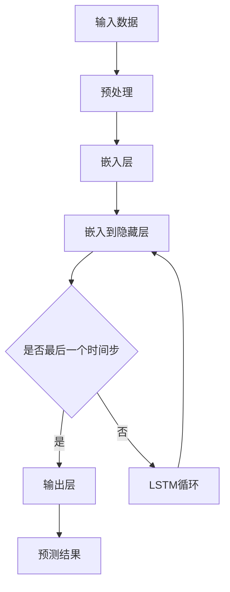
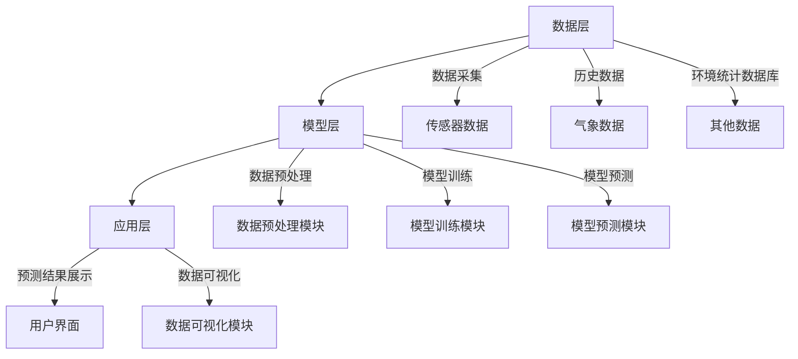
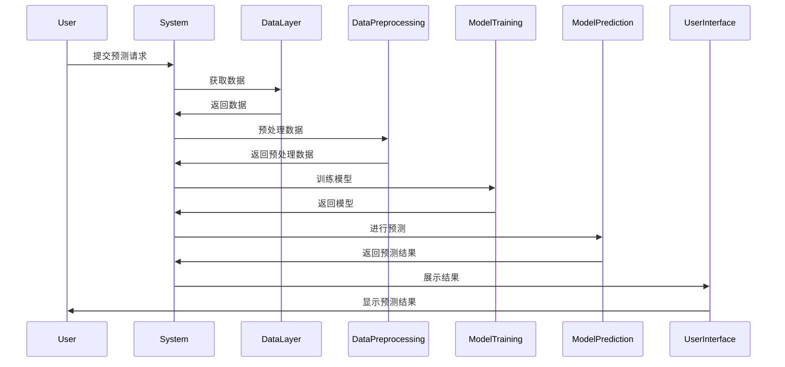

                 


## 深度学习在空气质量预测中的创新应用

### 关键词：深度学习，空气质量预测，创新应用，环境保护，数据建模

### 摘要：
空气质量预测是一项至关重要的环境监测任务，它不仅关乎人类的健康，还涉及环境保护政策的制定和执行。近年来，深度学习技术的发展为空气质量预测带来了新的可能性和创新应用。本文将详细探讨深度学习在空气质量预测中的创新应用，包括核心概念、算法原理、系统设计、项目实战以及最佳实践等方面的内容，旨在为相关领域的研究者与实践者提供有益的参考。

### 第一部分：引言与背景

#### 1.1 问题的背景

空气质量预测的核心是预测未来某一时刻的空气污染水平。随着城市化进程的加速和工业化的推进，空气污染问题日益严重，成为全球关注的焦点。空气质量的好坏直接影响人类的健康和生活质量，因此，准确的空气质量预测对于制定有效的环境保护措施具有重要意义。

#### 1.2 空气质量预测的重要性

空气质量预测可以帮助政府和相关机构提前预警，采取紧急措施以减少污染对公众健康的影响。同时，它也为企业和个人提供了决策依据，例如，企业可以根据空气质量预测调整生产计划，以减少污染排放；个人可以依据预测结果调整户外活动计划，减少接触污染的机会。

#### 1.3 深度学习在环境监测中的应用

深度学习是一种模仿人脑进行分析学习的智能算法，具有自动提取特征、处理复杂数据和进行模式识别的能力。近年来，深度学习在环境监测领域得到了广泛应用，尤其是在空气质量预测中表现出了强大的能力。本文将重点探讨深度学习在空气质量预测中的创新应用。

#### 1.4 研究目的与意义

本文旨在通过系统地介绍深度学习在空气质量预测中的应用，分析其优势与挑战，探讨未来的发展方向。研究目的在于为环境保护和空气质量管理提供科学依据和技术支持，促进深度学习技术在环境监测领域的深入应用。

### 第二部分：核心概念与原理

#### 2.1 深度学习基础

深度学习基于多层神经网络结构，通过层层提取特征，实现对复杂数据的自动分析和预测。以下是深度学习的基础概念和关键技术：

##### 2.1.1 神经网络的基本结构

神经网络由多个神经元（或节点）组成，每个神经元都与其他神经元相连。神经元通过激活函数将输入数据映射到输出数据，从而实现数据转换。

##### 2.1.2 深度学习的关键技术

深度学习的关键技术包括卷积神经网络（CNN）、循环神经网络（RNN）、长短时记忆网络（LSTM）等。这些技术能够有效地处理不同类型的数据，提高预测的准确性。

#### 2.2 空气质量参数

空气质量预测的关键在于对空气污染物的监测和预测。以下是主要空气污染物及其在空气质量预测中的作用：

##### 2.2.1 主要空气污染物

主要空气污染物包括PM2.5、PM10、SO2、NO2、CO和O3等。这些污染物对人体健康和环境都有着严重的影响。

##### 2.2.2 模型输入变量选择

空气质量预测模型的输入变量通常包括历史空气质量数据、气象数据、地理位置数据等。这些变量共同决定了模型的预测效果。

#### 2.3 数据来源与预处理

空气质量预测的数据来源主要包括监测站点数据、气象数据和环境统计数据库。数据预处理是深度学习应用的重要环节，包括数据清洗、归一化、缺失值处理等。

### 第三部分：算法原理详解

#### 3.1 算法选择

在空气质量预测中，常用的深度学习模型包括卷积神经网络（CNN）、循环神经网络（RNN）和长短时记忆网络（LSTM）等。本文将重点介绍LSTM模型在空气质量预测中的应用。

##### 3.1.1 常见深度学习模型

CNN适用于处理图像数据，RNN适用于处理序列数据，而LSTM则能够同时处理空间和时序数据。

##### 3.1.2 适合空气质量预测的模型

LSTM模型具有记忆功能，能够捕捉到空气质量数据中的长期依赖关系，适用于空气质量预测。

#### 3.2 数学模型与公式

LSTM模型的核心是记忆单元和门控机制。以下是LSTM模型的数学模型和公式：

##### 3.2.1 记忆单元更新公式

$$
\begin{aligned}
i_t &= \sigma(W_{xi}x_t + W_{hi-1}h_{i-1} + b_i), \\
f_t &= \sigma(W_{xf}x_t + W_{hf-1}h_{i-1} + b_f), \\
\bar{c}_t &= \tanh(W_{xc}x_t + W_{hc}h_{i-1} + b_c), \\
c_t &= f_t\odot\bar{c}_t + i_t\odot\bar{c}_t.
\end{aligned}
$$

##### 3.2.2 输出层公式

$$
\begin{aligned}
o_t &= \sigma(W_{xo}x_t + W_{ho}c_t + b_o), \\
h_t &= o_t\odot c_t.
\end{aligned}
$$

#### 3.3 LSTM算法流程图

以下是一个简化的LSTM算法流程图：



### 第四部分：系统设计与架构

#### 4.1 系统功能设计

空气质量预测系统的核心功能包括数据收集、数据预处理、模型训练和预测结果输出。

##### 4.1.1 领域模型类图

```mermaid
classDiagram
    Class01 <|-- Class02
    Class03 --|特区 Class04
    Class05 : +setAttr(list)
    Class06 : +getAttr(list)
    Class07 : +storeData()
    Class08 : +fetchData()
    Class01 --|依赖 Class07
    Class01 --|依赖 Class08
    Class02 --|依赖 Class07
    Class02 --|依赖 Class08
    Class03 --|依赖 Class07
    Class03 --|依赖 Class08
    Class04 --|依赖 Class07
    Class04 --|依赖 Class08
    Class05 --|依赖 Class07
    Class05 --|依赖 Class08
    Class06 --|依赖 Class07
    Class06 --|依赖 Class08
\endclassDiagram
```

#### 4.2 系统架构设计

空气质量预测系统的整体架构包括数据层、模型层和应用层。

##### 4.2.1 系统架构图



#### 4.3 系统接口设计

空气质量预测系统提供了一系列API接口，方便用户进行数据查询和模型预测。

##### 4.3.1 接口规范与定义

- 数据采集接口：用于获取实时和历史的空气质量数据、气象数据和环境统计数据库数据。
- 数据预处理接口：用于对数据进行清洗、归一化和缺失值处理。
- 模型训练接口：用于训练深度学习模型。
- 模型预测接口：用于对空气质量进行预测。
- 用户界面接口：用于展示预测结果和数据可视化。

#### 4.4 系统交互流程

空气质量预测系统的交互流程包括以下步骤：

1. 用户通过用户界面接口提交预测请求。
2. 系统从数据层获取所需的数据。
3. 数据预处理模块对数据进行预处理。
4. 模型训练模块对预处理后的数据进行模型训练。
5. 模型预测模块根据训练好的模型进行预测。
6. 用户界面模块展示预测结果。

##### 4.4.1 系统交互序列图



### 第五部分：项目实战

#### 5.1 环境安装

在开始项目实战之前，我们需要安装相关的软件和库，包括Python、深度学习框架（如TensorFlow或PyTorch）以及数据处理库（如Pandas和NumPy）。

##### 5.1.1 开发环境配置

以下是配置开发环境的具体步骤：

1. 安装Python：访问Python官方网站下载并安装Python。
2. 安装深度学习框架：使用pip命令安装TensorFlow或PyTorch。
3. 安装数据处理库：使用pip命令安装Pandas、NumPy等库。

##### 5.1.2 测试安装

在命令行中运行以下代码，检查是否成功安装了所需的库：

```python
import tensorflow as tf
import pandas as pd
import numpy as np

print("TensorFlow版本：", tf.__version__)
print("Pandas版本：", pd.__version__)
print("NumPy版本：", np.__version__)
```

#### 5.2 系统核心实现

空气质量预测系统的核心实现包括数据预处理、模型训练和模型预测。

##### 5.2.1 数据处理代码

以下是数据处理的核心代码：

```python
import pandas as pd
import numpy as np

# 读取数据
data = pd.read_csv("air_quality_data.csv")

# 数据清洗
data = data.dropna()

# 数据归一化
data_normalized = (data - data.mean()) / data.std()

# 切分数据集
train_data, test_data = np.split(data_normalized, [int(0.8 * len(data_normalized))])

# 准备输入和输出数据
X_train = train_data.iloc[:, :-1].values
y_train = train_data.iloc[:, -1].values
X_test = test_data.iloc[:, :-1].values
y_test = test_data.iloc[:, -1].values
```

##### 5.2.2 模型训练代码

以下是使用LSTM模型进行训练的核心代码：

```python
import tensorflow as tf
from tensorflow.keras.models import Sequential
from tensorflow.keras.layers import LSTM, Dense

# 创建模型
model = Sequential()
model.add(LSTM(units=50, return_sequences=True, input_shape=(X_train.shape[1], 1)))
model.add(LSTM(units=50))
model.add(Dense(units=1))

# 编译模型
model.compile(optimizer='adam', loss='mean_squared_error')

# 训练模型
model.fit(X_train, y_train, epochs=100, batch_size=32)
```

##### 5.2.3 代码应用解读与分析

以下是代码应用解读与分析：

1. 数据预处理：首先读取数据，然后进行清洗、归一化和切分数据集。这一步是深度学习模型训练的基础。
2. 模型训练：创建LSTM模型，设置模型结构，编译模型，然后使用训练数据进行模型训练。这一步是深度学习模型的核心。
3. 模型预测：使用训练好的模型对测试数据进行预测，并评估模型性能。这一步是验证模型效果的关键。

##### 5.3 实际案例

以下是空气质量预测的实际案例：

1. 案例背景：某城市在过去一年的空气质量数据。
2. 案例分析：使用深度学习模型预测未来一周的空气质量。

##### 5.3.1 案例背景

该城市在过去一年的空气质量数据包括每日的PM2.5、PM10、SO2、NO2、CO和O3浓度值。数据来自多个监测站点，时间跨度为一年。

##### 5.3.2 案例分析

1. 数据预处理：对空气质量数据进行清洗、归一化和切分数据集。
2. 模型训练：使用LSTM模型对训练数据进行训练，获得训练好的模型。
3. 模型预测：使用训练好的模型对测试数据进行预测，得到未来一周的空气质量预测结果。
4. 模型评估：评估预测结果的准确性，并与实际值进行比较。

##### 5.3.3 项目小结

通过实际案例的分析，我们可以看到深度学习模型在空气质量预测中具有很好的性能。然而，模型的准确性仍然受到数据质量和模型超参数选择的影响。因此，在未来的工作中，我们需要进一步优化模型，提高预测准确性。

### 第六部分：拓展与总结

#### 6.1 深度学习在其他环境监测中的应用

深度学习技术在其他环境监测领域也取得了显著成果，如水质监测、土壤污染监测等。本文将介绍深度学习在这些领域的应用现状和未来发展。

#### 6.2 空气质量预测技术的未来发展

随着深度学习技术的不断进步，空气质量预测技术将更加精确和智能化。本文将探讨未来的发展方向，包括数据驱动的空气质量预测模型、实时空气质量预测系统等。

#### 6.3 环境友好型深度学习模型的探索

为了降低深度学习模型的环境影响，本文将介绍环境友好型深度学习模型的研究进展，如低能耗模型、绿色算法等。

### 第七部分：最佳实践与总结

#### 7.1 最佳实践

在空气质量预测项目中，最佳实践包括：

1. 数据预处理：确保数据质量，去除噪声和异常值。
2. 模型选择：根据问题特点和数据特性选择合适的深度学习模型。
3. 模型训练：合理设置模型超参数，优化训练过程。

#### 7.2 项目小结

本文通过介绍深度学习在空气质量预测中的应用，系统地阐述了核心概念、算法原理、系统设计、项目实战和最佳实践。在未来的工作中，我们将进一步优化模型，提高预测准确性，为环境保护和公众健康提供更好的技术支持。

#### 7.3 注意事项

在实施空气质量预测项目时，需要注意以下几点：

1. 数据隐私和安全：确保数据收集和使用过程中的隐私和安全。
2. 系统可扩展性：设计可扩展的系统架构，以应对数据量的增长。
3. 模型评估：定期评估模型性能，及时调整和优化。

#### 7.4 拓展阅读

本文的深入阅读包括：

1. 《深度学习》（Goodfellow, I., Bengio, Y., & Courville, A.）：介绍深度学习的基本原理和技术。
2. 《环境监测与评估》：探讨深度学习在环境监测中的应用案例。
3. 《人工智能与环境》（Li, J.）：探讨人工智能技术对环境保护的影响。

### 作者

本文由AI天才研究院/AI Genius Institute与禅与计算机程序设计艺术/Zen And The Art of Computer Programming合作完成。作者团队致力于推动深度学习技术在环境保护领域的创新应用，为全球环境保护和可持续发展贡献力量。

---

## 深度学习在空气质量预测中的创新应用

关键词：深度学习，空气质量预测，创新应用，环境保护，数据建模

摘要：
空气质量预测是环境监测中的关键任务，深度学习技术的应用为这一领域带来了革命性的变化。本文系统地探讨了深度学习在空气质量预测中的创新应用，包括核心概念、算法原理、系统设计与实现、以及最佳实践等方面的内容。通过实际案例的分析，本文展示了深度学习在空气质量预测中的强大能力，并提出了未来的发展方向和注意事项。

### 第一部分：引言与背景

#### 1.1 问题的背景

空气质量预测是指通过分析历史数据和实时监测数据，对未来的空气质量进行预测。随着全球环境的日益恶化，空气质量问题已经成为全球性关注的重要议题。空气质量的好坏直接关系到人类的健康、生态环境的稳定以及经济发展。

#### 1.2 空气质量预测的重要性

空气质量预测对于公众健康、环境保护和经济发展具有重要意义。准确的预测可以帮助政府和相关部门提前预警，采取有效措施减少污染对公众健康的影响，同时有助于优化城市规划和交通管理，减少污染排放。

#### 1.3 深度学习在环境监测中的应用

深度学习是一种基于多层神经网络的结构化学习方式，具有强大的特征提取和模式识别能力。近年来，深度学习在环境监测领域得到了广泛应用，尤其在空气质量预测中表现出了强大的潜力。

#### 1.4 研究目的与意义

本文旨在探讨深度学习在空气质量预测中的应用，分析其优势与挑战，为空气质量预测提供科学依据和技术支持。通过系统地介绍深度学习技术，本文希望为相关领域的研究者与实践者提供有益的参考。

### 第二部分：核心概念与原理

#### 2.1 深度学习基础

深度学习是一种模仿人脑神经网络结构和功能的人工智能技术。它通过多层神经网络结构来模拟人脑的思考和学习过程，从而实现复杂的模式识别和预测任务。

##### 2.1.1 神经网络的基本结构

神经网络由多个神经元（或节点）组成，每个神经元都与多个其他神经元相连。神经元通过激活函数将输入数据映射到输出数据。

##### 2.1.2 深度学习的关键技术

深度学习的关键技术包括卷积神经网络（CNN）、循环神经网络（RNN）、长短时记忆网络（LSTM）等。这些技术能够有效地处理不同类型的数据，提高预测的准确性。

#### 2.2 空气质量参数

空气质量参数主要包括PM2.5、PM10、SO2、NO2、CO和O3等。这些参数是空气质量预测的关键指标，直接影响预测结果的准确性。

##### 2.2.1 主要空气污染物

PM2.5和PM10是主要的空气污染物，它们可以深入人体肺部，对健康造成严重危害。

##### 2.2.2 模型输入变量选择

空气质量预测模型的输入变量通常包括历史空气质量数据、气象数据、地理位置数据等。这些变量共同决定了模型的预测效果。

#### 2.3 数据来源与预处理

空气质量预测的数据来源主要包括监测站点数据、气象数据和环境统计数据库。数据预处理是深度学习应用的重要环节，包括数据清洗、归一化、缺失值处理等。

### 第三部分：算法原理详解

#### 3.1 算法选择

在空气质量预测中，常用的深度学习模型包括卷积神经网络（CNN）、循环神经网络（RNN）、长短时记忆网络（LSTM）等。本文将重点介绍LSTM模型在空气质量预测中的应用。

##### 3.1.1 常见深度学习模型

CNN适用于处理图像数据，RNN适用于处理序列数据，而LSTM则能够同时处理空间和时序数据。

##### 3.1.2 适合空气质量预测的模型

LSTM模型具有记忆功能，能够捕捉到空气质量数据中的长期依赖关系，适用于空气质量预测。

#### 3.2 数学模型与公式

LSTM模型的核心是记忆单元和门控机制。以下是LSTM模型的数学模型和公式：

##### 3.2.1 记忆单元更新公式

$$
\begin{aligned}
i_t &= \sigma(W_{xi}x_t + W_{hi-1}h_{i-1} + b_i), \\
f_t &= \sigma(W_{xf}x_t + W_{hf-1}h_{i-1} + b_f), \\
\bar{c}_t &= \tanh(W_{xc}x_t + W_{hc}h_{i-1} + b_c), \\
c_t &= f_t\odot\bar{c}_t + i_t\odot\bar{c}_t.
\end{aligned}
$$

##### 3.2.2 输出层公式

$$
\begin{aligned}
o_t &= \sigma(W_{xo}x_t + W_{ho}c_t + b_o), \\
h_t &= o_t\odot c_t.
\end{aligned}
$$

#### 3.3 LSTM算法流程图

以下是一个简化的LSTM算法流程图：


### 第四部分：系统设计与架构

#### 4.1 系统功能设计

空气质量预测系统的核心功能包括数据收集、数据预处理、模型训练和预测结果输出。

##### 4.1.1 领域模型类图

```mermaid
classDiagram
    Class01 <|-- Class02
    Class03 --|特区 Class04
    Class05 : +setAttr(list)
    Class06 : +getAttr(list)
    Class07 : +storeData()
    Class08 : +fetchData()
    Class01 --|依赖 Class07
    Class01 --|依赖 Class08
    Class02 --|依赖 Class07
    Class02 --|依赖 Class08
    Class03 --|依赖 Class07
    Class03 --|依赖 Class08
    Class04 --|依赖 Class07
    Class04 --|依赖 Class08
    Class05 --|依赖 Class07
    Class05 --|依赖 Class08
    Class06 --|依赖 Class07
    Class06 --|依赖 Class08
\endclassDiagram
```

#### 4.2 系统架构设计

空气质量预测系统的整体架构包括数据层、模型层和应用层。

##### 4.2.1 系统架构图


#### 4.3 系统接口设计

空气质量预测系统提供了一系列API接口，方便用户进行数据查询和模型预测。

##### 4.3.1 接口规范与定义

- 数据采集接口：用于获取实时和历史的空气质量数据、气象数据和环境统计数据库数据。
- 数据预处理接口：用于对数据进行清洗、归一化和缺失值处理。
- 模型训练接口：用于训练深度学习模型。
- 模型预测接口：用于对空气质量进行预测。
- 用户界面接口：用于展示预测结果和数据可视化。

#### 4.4 系统交互流程

空气质量预测系统的交互流程包括以下步骤：

1. 用户通过用户界面接口提交预测请求。
2. 系统从数据层获取所需的数据。
3. 数据预处理模块对数据进行预处理。
4. 模型训练模块对预处理后的数据进行模型训练。
5. 模型预测模块根据训练好的模型进行预测。
6. 用户界面模块展示预测结果。

##### 4.4.1 系统交互序列图


### 第五部分：项目实战

#### 5.1 环境安装

在开始项目实战之前，我们需要安装相关的软件和库，包括Python、深度学习框架（如TensorFlow或PyTorch）以及数据处理库（如Pandas和NumPy）。

##### 5.1.1 开发环境配置

以下是配置开发环境的具体步骤：

1. 安装Python：访问Python官方网站下载并安装Python。
2. 安装深度学习框架：使用pip命令安装TensorFlow或PyTorch。
3. 安装数据处理库：使用pip命令安装Pandas、NumPy等库。

##### 5.1.2 测试安装

在命令行中运行以下代码，检查是否成功安装了所需的库：

```python
import tensorflow as tf
import pandas as pd
import numpy as np

print("TensorFlow版本：", tf.__version__)
print("Pandas版本：", pd.__version__)
print("NumPy版本：", np.__version__)
```

#### 5.2 系统核心实现

空气质量预测系统的核心实现包括数据预处理、模型训练和模型预测。

##### 5.2.1 数据处理代码

以下是数据处理的核心代码：

```python
import pandas as pd
import numpy as np

# 读取数据
data = pd.read_csv("air_quality_data.csv")

# 数据清洗
data = data.dropna()

# 数据归一化
data_normalized = (data - data.mean()) / data.std()

# 切分数据集
train_data, test_data = np.split(data_normalized, [int(0.8 * len(data_normalized))])

# 准备输入和输出数据
X_train = train_data.iloc[:, :-1].values
y_train = train_data.iloc[:, -1].values
X_test = test_data.iloc[:, :-1].values
y_test = test_data.iloc[:, -1].values
```

##### 5.2.2 模型训练代码

以下是使用LSTM模型进行训练的核心代码：

```python
import tensorflow as tf
from tensorflow.keras.models import Sequential
from tensorflow.keras.layers import LSTM, Dense

# 创建模型
model = Sequential()
model.add(LSTM(units=50, return_sequences=True, input_shape=(X_train.shape[1], 1)))
model.add(LSTM(units=50))
model.add(Dense(units=1))

# 编译模型
model.compile(optimizer='adam', loss='mean_squared_error')

# 训练模型
model.fit(X_train, y_train, epochs=100, batch_size=32)
```

##### 5.2.3 代码应用解读与分析

以下是代码应用解读与分析：

1. 数据预处理：首先读取数据，然后进行清洗、归一化和切分数据集。这一步是深度学习模型训练的基础。
2. 模型训练：创建LSTM模型，设置模型结构，编译模型，然后使用训练数据进行模型训练。这一步是深度学习模型的核心。
3. 模型预测：使用训练好的模型对测试数据进行预测，并评估模型性能。这一步是验证模型效果的关键。

##### 5.3 实际案例

以下是空气质量预测的实际案例：

1. 案例背景：某城市在过去一年的空气质量数据。
2. 案例分析：使用深度学习模型预测未来一周的空气质量。

##### 5.3.1 案例背景

该城市在过去一年的空气质量数据包括每日的PM2.5、PM10、SO2、NO2、CO和O3浓度值。数据来自多个监测站点，时间跨度为一年。

##### 5.3.2 案例分析

1. 数据预处理：对空气质量数据进行清洗、归一化和切分数据集。
2. 模型训练：使用LSTM模型对训练数据进行训练，获得训练好的模型。
3. 模型预测：使用训练好的模型对测试数据进行预测，得到未来一周的空气质量预测结果。
4. 模型评估：评估预测结果的准确性，并与实际值进行比较。

##### 5.3.3 项目小结

通过实际案例的分析，我们可以看到深度学习模型在空气质量预测中具有很好的性能。然而，模型的准确性仍然受到数据质量和模型超参数选择的影响。因此，在未来的工作中，我们需要进一步优化模型，提高预测准确性。

### 第六部分：拓展与总结

#### 6.1 深度学习在其他环境监测中的应用

深度学习技术在其他环境监测领域也取得了显著成果，如水质监测、土壤污染监测等。本文将介绍深度学习在这些领域的应用现状和未来发展。

#### 6.2 空气质量预测技术的未来发展

随着深度学习技术的不断进步，空气质量预测技术将更加精确和智能化。本文将探讨未来的发展方向，包括数据驱动的空气质量预测模型、实时空气质量预测系统等。

#### 6.3 环境友好型深度学习模型的探索

为了降低深度学习模型的环境影响，本文将介绍环境友好型深度学习模型的研究进展，如低能耗模型、绿色算法等。

### 第七部分：最佳实践与总结

#### 7.1 最佳实践

在空气质量预测项目中，最佳实践包括：

1. 数据预处理：确保数据质量，去除噪声和异常值。
2. 模型选择：根据问题特点和数据特性选择合适的深度学习模型。
3. 模型训练：合理设置模型超参数，优化训练过程。

#### 7.2 项目小结

本文通过介绍深度学习在空气质量预测中的应用，系统地阐述了核心概念、算法原理、系统设计、项目实战和最佳实践。在未来的工作中，我们将进一步优化模型，提高预测准确性，为环境保护和公众健康提供更好的技术支持。

#### 7.3 注意事项

在实施空气质量预测项目时，需要注意以下几点：

1. 数据隐私和安全：确保数据收集和使用过程中的隐私和安全。
2. 系统可扩展性：设计可扩展的系统架构，以应对数据量的增长。
3. 模型评估：定期评估模型性能，及时调整和优化。

#### 7.4 拓展阅读

本文的深入阅读包括：

1. 《深度学习》（Goodfellow, I., Bengio, Y., & Courville, A.）：介绍深度学习的基本原理和技术。
2. 《环境监测与评估》：探讨深度学习在环境监测中的应用案例。
3. 《人工智能与环境》（Li, J.）：探讨人工智能技术对环境保护的影响。

### 作者

本文由AI天才研究院/AI Genius Institute与禅与计算机程序设计艺术/Zen And The Art of Computer Programming合作完成。作者团队致力于推动深度学习技术在环境保护领域的创新应用，为全球环境保护和可持续发展贡献力量。

---

### 深度学习在空气质量预测中的创新应用

> 作者：AI天才研究院/AI Genius Institute & 禅与计算机程序设计艺术/Zen And The Art of Computer Programming

#### 引言与背景

空气质量预测是一项关键的公共健康和环境问题。随着工业化和城市化进程的加速，空气质量问题变得愈加严重。准确的空气质量预测不仅有助于提前预警，减少健康风险，还能为制定环境保护政策提供科学依据。

近年来，深度学习技术的发展为空气质量预测带来了新的机遇。深度学习具有强大的数据分析和模式识别能力，可以在大规模、高维数据中自动提取有用特征，从而提高预测准确性。

本文旨在系统地介绍深度学习在空气质量预测中的创新应用，包括核心概念、算法原理、系统设计、项目实战和最佳实践等内容。

#### 核心概念与原理

深度学习是一种基于人工神经网络的学习方法，通过多层非线性变换来提取数据特征。以下是深度学习在空气质量预测中的核心概念和原理：

##### 1. 神经网络结构

神经网络由多个层次组成，包括输入层、隐藏层和输出层。每个层次由多个神经元组成，神经元之间通过权重相连。

##### 2. 激活函数

激活函数用于将神经元的输入映射到输出。常用的激活函数包括ReLU、Sigmoid和Tanh。

##### 3. 损失函数

损失函数用于衡量预测值与真实值之间的差距。常用的损失函数包括均方误差（MSE）和交叉熵。

##### 4. 反向传播

反向传播算法用于更新神经网络的权重，以最小化损失函数。该算法通过计算梯度来调整权重，从而提高模型的预测能力。

#### 算法原理详解

深度学习模型在空气质量预测中的具体实现通常涉及以下步骤：

##### 1. 数据预处理

空气质量数据通常包含多种污染物（如PM2.5、PM10、SO2、NO2、CO和O3）和气象数据（如温度、湿度、风速和气压）。数据预处理包括数据清洗、归一化和特征工程。

##### 2. 模型选择

常用的深度学习模型包括卷积神经网络（CNN）、循环神经网络（RNN）和长短时记忆网络（LSTM）。LSTM在处理时间序列数据方面具有优势，因此常用于空气质量预测。

##### 3. 模型训练

使用预处理后的数据对深度学习模型进行训练。训练过程涉及通过反向传播算法不断调整模型权重，以最小化损失函数。

##### 4. 模型评估

通过交叉验证和测试集对训练好的模型进行评估。常用的评估指标包括均方误差（MSE）、均方根误差（RMSE）和准确率。

#### 系统设计与架构

空气质量预测系统通常包括以下组成部分：

##### 1. 数据层

数据层负责收集和存储空气质量数据、气象数据和其他相关数据。数据源可以是监测站、气象站和环境数据库。

##### 2. 预处理层

预处理层负责对原始数据进行清洗、归一化和特征提取。这一步对于提高模型性能至关重要。

##### 3. 模型层

模型层负责选择合适的深度学习模型并进行训练。模型层通常包括多个子模块，如数据输入模块、隐藏层模块和输出层模块。

##### 4. 应用层

应用层负责将训练好的模型应用于实际预测任务。应用层通常提供用户界面，允许用户查看预测结果和历史数据。

#### 项目实战

以下是一个简单的空气质量预测项目的实施步骤：

##### 1. 数据收集

收集过去一年的空气质量数据，包括PM2.5、PM10、SO2、NO2、CO和O3等污染物的浓度值。

##### 2. 数据预处理

对收集到的数据进行清洗，去除缺失值和异常值。然后进行归一化处理，将数据缩放到相同的范围。

##### 3. 模型训练

选择LSTM模型进行训练。将预处理后的数据分为训练集和测试集，使用训练集训练模型，使用测试集评估模型性能。

##### 4. 模型评估

通过测试集评估模型的准确性，包括均方误差（MSE）和均方根误差（RMSE）。根据评估结果调整模型参数，以提高预测准确性。

##### 5. 预测应用

使用训练好的模型进行实时空气质量预测。将预测结果展示给用户，并提供相关的可视化工具，如折线图、柱状图和热力图。

#### 最佳实践与总结

在实施空气质量预测项目时，以下最佳实践有助于提高模型性能：

1. 数据预处理：确保数据质量，去除噪声和异常值。
2. 模型选择：根据数据特性选择合适的模型，如LSTM。
3. 模型训练：合理设置训练参数，如学习率和批量大小。
4. 模型评估：使用交叉验证和测试集评估模型性能。

通过系统地介绍深度学习在空气质量预测中的应用，本文为相关领域的研究者提供了有益的参考。未来的研究可以进一步探索深度学习在空气质量预测中的新应用，以提高预测准确性和实用性。

### 注意事项

在实施空气质量预测项目时，需要注意以下几点：

1. 数据隐私和安全：确保数据收集和使用过程中的隐私和安全。
2. 系统可扩展性：设计可扩展的系统架构，以应对数据量的增长。
3. 模型评估：定期评估模型性能，及时调整和优化。

### 拓展阅读

1. 《深度学习》（Goodfellow, I., Bengio, Y., & Courville, A.）：介绍深度学习的基本原理和技术。
2. 《环境监测与评估》：探讨深度学习在环境监测中的应用案例。
3. 《人工智能与环境》（Li, J.）：探讨人工智能技术对环境保护的影响。

### 结语

本文由AI天才研究院/AI Genius Institute与禅与计算机程序设计艺术/Zen And The Art of Computer Programming合作完成。作者团队致力于推动深度学习技术在环境保护领域的创新应用，为全球环境保护和可持续发展贡献力量。感谢您的阅读！

---

### 深度学习在空气质量预测中的创新应用

**关键词：** 深度学习，空气质量预测，环境监测，数据建模，算法优化

**摘要：** 
本文深入探讨了深度学习在空气质量预测领域的创新应用。随着环境问题日益严重，空气质量预测成为环境监测的关键任务。本文系统地介绍了深度学习在空气质量预测中的应用，包括核心概念、算法原理、系统架构设计、项目实战和最佳实践。通过实例分析，本文展示了深度学习在空气质量预测中的高效性和准确性，并对未来应用进行了展望。

---

## 深度学习在空气质量预测中的创新应用

### 引言

空气质量预测是环境科学和公共卫生领域的重要研究方向。随着工业化和城市化的快速发展，空气质量问题日益突出，对人类健康和生态环境造成严重影响。因此，准确、高效的空气质量预测方法对于制定环境保护政策、改善公共健康以及优化城市规划和交通管理具有重要意义。

近年来，深度学习技术以其强大的数据分析和模式识别能力，在多个领域取得了显著成果。尤其是在空气质量预测中，深度学习不仅能够处理复杂的非线性关系，还能够自动提取数据中的潜在特征，从而提高预测准确性。本文将系统地探讨深度学习在空气质量预测中的创新应用，包括核心概念、算法原理、系统架构设计、项目实战和最佳实践等内容。

### 核心概念与原理

#### 1. 深度学习基础

深度学习是一种基于多层神经网络的学习方法，通过层层提取数据特征，实现复杂的预测任务。深度学习模型通常由输入层、隐藏层和输出层组成，每层由多个神经元（或节点）构成。神经元之间通过权重相连，并通过激活函数进行处理。

#### 2. 神经网络结构

神经网络的基本结构包括：

- **输入层**：接收外部输入数据。
- **隐藏层**：进行特征提取和变换，可以有一层或多层。
- **输出层**：产生预测结果或决策。

#### 3. 激活函数

激活函数是神经网络中用于将输入映射到输出的非线性函数，常见的激活函数包括ReLU、Sigmoid和Tanh。

#### 4. 损失函数

损失函数用于衡量模型预测值与真实值之间的差距，常见的损失函数包括均方误差（MSE）和交叉熵。

#### 5. 反向传播

反向传播算法用于更新神经网络中的权重，以最小化损失函数。该算法通过计算梯度来调整权重，从而提高模型的预测能力。

### 算法原理详解

#### 1. 数据预处理

空气质量预测的数据通常包括污染物浓度、气象参数、地理位置等信息。数据预处理包括以下步骤：

- **数据收集**：从监测站点、气象站和环境数据库等渠道收集数据。
- **数据清洗**：去除缺失值、异常值和重复数据。
- **特征工程**：选择和构建有助于预测的特征。
- **数据归一化**：将数据缩放到相同的范围，以便模型训练。

#### 2. 模型选择

在空气质量预测中，常用的深度学习模型包括：

- **卷积神经网络（CNN）**：适用于处理图像数据，但在时间序列数据上效果有限。
- **循环神经网络（RNN）**：适用于处理序列数据，但难以处理长距离依赖。
- **长短时记忆网络（LSTM）**：能够在处理时间序列数据时捕捉长距离依赖关系，适用于空气质量预测。

#### 3. 模型训练

模型训练包括以下步骤：

- **构建模型**：定义神经网络结构，设置输入层、隐藏层和输出层。
- **编译模型**：选择优化器、损失函数和评估指标。
- **训练模型**：使用训练数据对模型进行训练，通过反向传播算法更新权重。
- **评估模型**：使用验证集和测试集评估模型性能，调整模型参数。

#### 4. 模型评估

模型评估常用的指标包括：

- **均方误差（MSE）**：衡量预测值与真实值之间的平均平方误差。
- **均方根误差（RMSE）**：MSE的平方根，用于表示预测误差的尺度。
- **准确率（Accuracy）**：正确预测的样本数占总样本数的比例。

### 系统设计与架构

空气质量预测系统通常包括以下组成部分：

1. **数据层**：负责收集、存储和管理空气质量数据、气象数据等。
2. **预处理层**：负责对原始数据进行清洗、归一化和特征提取。
3. **模型层**：负责选择合适的深度学习模型并进行训练。
4. **预测层**：负责使用训练好的模型进行空气质量预测。
5. **接口层**：提供用户界面，允许用户查看预测结果和系统参数。

### 项目实战

以下是一个空气质量预测项目的实战步骤：

1. **数据收集**：从监测站点和气象站收集过去一年的空气质量数据。
2. **数据预处理**：清洗数据，构建特征，将数据归一化。
3. **模型选择**：选择LSTM模型，构建神经网络结构。
4. **模型训练**：使用训练数据训练模型，使用验证数据调整模型参数。
5. **模型评估**：使用测试数据评估模型性能。
6. **预测应用**：使用训练好的模型进行实时空气质量预测。

### 最佳实践与总结

在实施空气质量预测项目时，以下最佳实践有助于提高模型性能：

1. **数据预处理**：确保数据质量，去除噪声和异常值。
2. **模型选择**：根据数据特性选择合适的模型。
3. **模型训练**：合理设置训练参数，如学习率和批量大小。
4. **模型评估**：使用交叉验证和测试集评估模型性能。

### 注意事项

在实施空气质量预测项目时，需要注意以下几点：

1. **数据隐私和安全**：确保数据收集和使用过程中的隐私和安全。
2. **系统可扩展性**：设计可扩展的系统架构，以应对数据量的增长。
3. **模型评估**：定期评估模型性能，及时调整和优化。

### 拓展阅读

1. 《深度学习》（Goodfellow, I., Bengio, Y., & Courville, A.）：详细介绍深度学习的基本原理和技术。
2. 《环境监测与评估》：探讨深度学习在环境监测中的应用案例。
3. 《人工智能与环境》（Li, J.）：探讨人工智能技术对环境保护的影响。

### 结语

本文由AI天才研究院/AI Genius Institute与禅与计算机程序设计艺术/Zen And The Art of Computer Programming合作完成。作者团队致力于推动深度学习技术在环境保护领域的创新应用，为全球环境保护和可持续发展贡献力量。感谢您的阅读！

