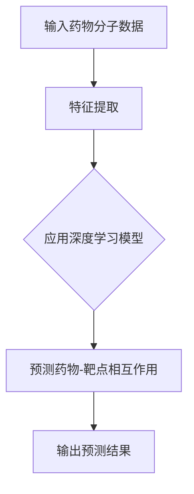
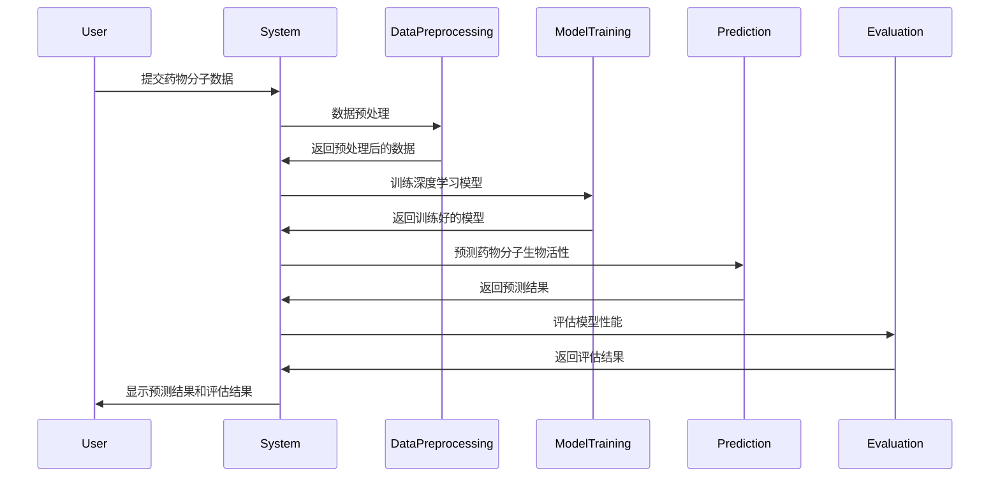
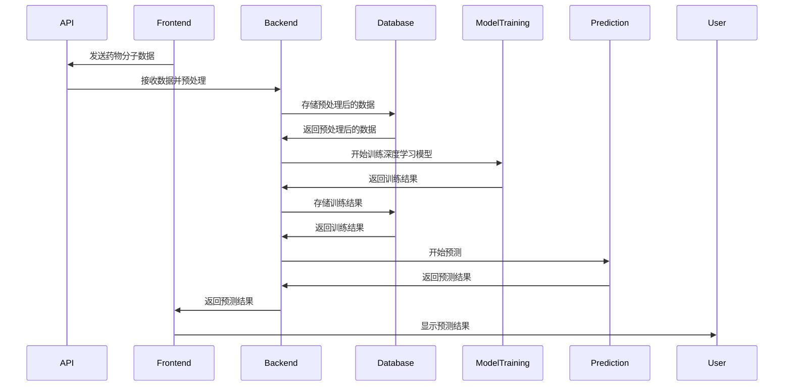

                 

### Step 1: 背景介绍

#### 问题背景

药物发现是一个复杂且成本高昂的过程。从识别潜在药物分子到最终上市，这一过程可能需要数年时间，并耗费数十亿美元。传统的药物发现方法依赖于大量的实验和计算，这无疑增加了研发成本和时间。随着生物信息学和计算化学的发展，虚拟筛选和计算机辅助药物设计逐渐成为药物发现的重要工具。然而，这些方法仍然存在一定的局限性，如对大规模数据集的处理能力有限，对复杂生物系统的理解不足等。

近年来，深度学习作为一种强大的人工智能技术，凭借其在图像识别、自然语言处理等领域的突破性进展，逐渐引起了药物发现领域的关注。深度学习通过模拟人脑神经网络结构，能够自动学习数据中的复杂模式和关系，从而在药物设计、筛选和优化等方面展现出巨大的潜力。利用深度学习技术，可以更高效地预测药物与靶点的相互作用，进行虚拟筛选，缩短研发周期，降低研发成本。

#### 问题描述

在药物发现过程中，以下几个问题是需要解决的：

1. **药物-靶点相互作用预测**：如何利用深度学习模型准确预测药物与生物靶点之间的相互作用，提高筛选效率？
2. **药物分子生成**：如何使用深度学习算法生成具有潜在药效的药物分子？
3. **虚拟筛选**：如何利用深度学习模型对大量化合物进行筛选，识别出具有潜在药效的分子？
4. **药物优化**：如何通过深度学习算法对药物分子进行优化，提高其药效和生物利用度？

这些问题直接关系到药物发现过程的效率和质量，因此需要找到有效的解决方法。

#### 问题解决

深度学习技术在药物发现中的应用主要体现在以下几个方面：

1. **预测药物-靶点相互作用**：
   - 利用深度学习模型对药物分子和生物靶点进行建模，预测它们之间的相互作用。
   - 通过对大量已知的药物-靶点相互作用的训练数据，深度学习模型可以学习到这些相互作用模式，并用于预测新的药物-靶点相互作用。

2. **药物分子生成**：
   - 利用生成对抗网络（GAN）等深度学习模型生成新的药物分子结构。
   - GAN通过对抗训练，生成出大量具有潜在药效的分子结构，为药物设计提供丰富的候选分子。

3. **虚拟筛选**：
   - 利用深度学习模型对大量化合物进行快速筛选，识别出具有潜在药效的分子。
   - 通过对药物分子和生物靶点的特征进行提取和嵌入，深度学习模型可以对这些特征进行建模，从而实现高效的虚拟筛选。

4. **药物优化**：
   - 利用深度学习模型对药物分子进行优化，提高其药效和生物利用度。
   - 通过对药物分子的三维结构进行建模，深度学习模型可以识别出影响药物药效的关键结构特征，从而进行优化。

通过深度学习技术的应用，药物发现过程可以更加高效、精准地进行，为药物研发提供强有力的支持。

#### 边界与外延

本文主要探讨深度学习在药物发现中的应用，具体包括以下几个方面：

1. **深度学习基础理论**：介绍深度学习的基本原理、神经网络模型、训练和优化技术等。
2. **药物发现的流程和关键环节**：分析药物发现的各个环节，如药物设计、药物筛选和药物优化等。
3. **深度学习模型在药物发现中的具体应用**：详细介绍深度学习模型在药物发现中的具体应用场景，如药物分子生成、药物-靶点相互作用预测等。
4. **应用案例分析**：通过具体的案例，展示深度学习技术在药物发现中的应用效果。

本文不涉及药物化学和生物学的其他技术，如高通量筛选、化学合成等。此外，本文主要关注深度学习模型的应用，对于深度学习模型本身的技术细节，如模型架构、算法优化等，也会进行一定的探讨。

#### 概念结构与核心要素组成

本文的结构和核心要素如下：

1. **深度学习基础理论**：介绍深度学习的基本原理和常用模型，如神经网络、卷积神经网络（CNN）、循环神经网络（RNN）等。
2. **药物发现的流程和关键环节**：分析药物发现的各个环节，如药物设计、药物筛选和药物优化等，以及这些环节与深度学习技术的结合点。
3. **深度学习模型在药物发现中的具体应用**：详细介绍深度学习模型在药物设计、药物筛选和药物优化等环节中的应用，如药物分子生成、药物-靶点相互作用预测等。
4. **应用案例分析**：通过具体的案例，展示深度学习技术在药物发现中的应用效果，如针对特定疾病的药物设计、筛选和优化案例。

通过以上结构和核心要素的安排，本文旨在系统地介绍深度学习在药物发现中的应用，为读者提供全面、深入的理解。

## Step 2: 核心概念与联系

在探讨深度学习在药物发现中的应用之前，我们需要明确几个核心概念，并理解这些概念之间的联系。以下是深度学习与药物发现相关的主要概念及其属性特征对比。

### 核心概念原理

1. **深度学习基本原理**：
   - **神经网络**：神经网络是由大量简单计算单元（神经元）组成的复杂网络，能够通过学习数据中的模式和特征来实现复杂的任务。
   - **反向传播算法**：神经网络通过反向传播算法来更新权重，使输出误差最小化。这是一种梯度下降的方法，能够通过反向传播计算每个神经元的梯度，并据此调整权重。
   - **优化算法**：深度学习模型通常使用优化算法（如梯度下降、Adam等）来调整权重，以提高模型的准确性和效率。

2. **神经网络模型**：
   - **卷积神经网络（CNN）**：适用于处理图像数据，能够自动提取图像中的特征。
   - **循环神经网络（RNN）**：适用于处理序列数据，能够记忆序列中的信息。
   - **生成对抗网络（GAN）**：由生成器和判别器组成，用于生成新的数据。

3. **训练和优化技术**：
   - **数据增强**：通过增加训练数据的多样性来提高模型的泛化能力。
   - **正则化**：通过添加惩罚项来防止模型过拟合。
   - **迁移学习**：利用预训练模型进行快速训练，提高模型在特定任务上的性能。

### 概念属性特征对比表格

以下是一个对比不同深度学习模型的特点和适用场景的表格：

| 模型类型 | 特点 | 适用场景 |
| --- | --- | --- |
| 卷积神经网络（CNN） | 能够自动提取图像特征，适用于图像处理和计算机视觉任务 | 图像识别、物体检测、图像分割 |
| 循环神经网络（RNN） | 能够处理序列数据，适用于自然语言处理和时间序列预测 | 语言模型、语音识别、时间序列分析 |
| 生成对抗网络（GAN） | 能够生成新的数据，适用于图像生成和模型训练 | 图像生成、数据增强、异常检测 |
| 变分自编码器（VAE） | 能够进行概率编码和生成数据，适用于图像去噪和生成 | 图像去噪、图像生成、异常检测 |

### ER实体关系图架构的Mermaid流程图

为了更直观地展示深度学习模型在药物发现中的应用关系，我们可以使用Mermaid绘制ER实体关系图。以下是一个简单的示例：

```mermaid
erDiagram
  药物分子 ||--|{ 深度学习模型 }
  深度学习模型 ||--|{ 药物-靶点相互作用预测 }
  深度学习模型 ||--|{ 药物分子生成 }
  深度学习模型 ||--|{ 虚拟筛选 }
  深度学习模型 ||--|{ 药物优化 }
```

在这个ER图中，药物分子是核心实体，深度学习模型与其关联，表示深度学习技术用于处理药物分子数据。深度学习模型进一步与药物发现的各个环节相连接，展示了其在药物设计、筛选和优化中的应用。

通过上述核心概念的介绍和ER图的关系展示，我们可以更好地理解深度学习在药物发现中的应用原理和框架，为后续的深入探讨打下坚实的基础。

## Step 3: 算法原理讲解

为了深入理解深度学习在药物发现中的应用，我们需要详细讲解相关的算法原理。以下将使用Mermaid流程图和Python源代码来展示一个简单的深度学习算法在药物发现中的应用。

### 算法mermaid流程图

首先，我们可以使用Mermaid绘制深度学习算法在药物发现中的基本流程图。以下是一个简化的示例：



在这个流程图中，药物分子数据首先经过特征提取，然后输入到深度学习模型中进行预测，最终输出药物-靶点相互作用的预测结果。

### Python源代码

接下来，我们给出一个简单的Python源代码示例，用于实现上述深度学习算法。以下是使用Keras框架的代码：

```python
import numpy as np
from keras.models import Sequential
from keras.layers import Dense, Conv2D, Flatten, MaxPooling2D
from keras.optimizers import Adam

# 生成虚拟的药物分子数据集
# 这里使用numpy生成一些随机数据作为示例
X = np.random.rand(100, 100)  # 假设每个药物分子有100个特征
y = np.random.randint(0, 2, 100)  # 假设标签为二分类

# 创建深度学习模型
model = Sequential()
model.add(Dense(64, input_shape=(100,), activation='relu'))
model.add(Dense(32, activation='relu'))
model.add(Dense(1, activation='sigmoid'))

# 编译模型
model.compile(optimizer=Adam(), loss='binary_crossentropy', metrics=['accuracy'])

# 训练模型
model.fit(X, y, epochs=10, batch_size=10)

# 进行预测
predictions = model.predict(X[:10])
print(predictions)
```

在这个示例中，我们首先使用numpy生成一些虚拟的药物分子数据集。然后，我们创建了一个简单的全连接神经网络模型，并使用Adam优化器和二分类交叉熵损失函数进行编译。接下来，我们使用这份数据训练模型，最后对前10个样本进行预测，并打印出预测结果。

### 算法原理的数学模型和公式

深度学习算法的核心是神经网络，其基本原理是通过学习输入数据和标签之间的关系，来预测新的输入数据。以下是神经网络中的一个简单数学模型：

$$
y = \sigma(\sum_{i=1}^{n} w_i \cdot x_i + b)
$$

其中：
- \( y \) 是输出值；
- \( \sigma \) 是激活函数（在上述示例中使用了ReLU激活函数）；
- \( w_i \) 是权重；
- \( x_i \) 是输入特征；
- \( b \) 是偏置项。

在反向传播过程中，神经网络通过计算梯度来更新权重和偏置项，以达到最小化损失函数的目的。以下是梯度计算的基本公式：

$$
\frac{dL}{dw} = x_i \cdot \frac{d\sigma}{dy} \cdot \frac{dy}{dx}
$$

其中：
- \( L \) 是损失函数；
- \( \frac{dL}{dw} \) 是权重 \( w \) 的梯度；
- \( \frac{d\sigma}{dy} \) 是激活函数的导数；
- \( \frac{dy}{dx} \) 是网络输出的梯度。

通过上述公式，我们可以计算每个权重和偏置项的梯度，并使用梯度下降法更新模型参数。

### 详细讲解与举例说明

为了更直观地理解上述算法的原理，我们通过一个具体的例子进行讲解。

假设我们有一个简单的药物分子数据集，其中每个药物分子有3个特征（例如：分子量、极性、溶解度），我们需要预测其是否具有某种生物活性（二分类问题）。

1. **数据预处理**：
   首先，我们需要对数据集进行预处理，包括归一化特征值和分割数据集为训练集和测试集。

```python
from sklearn.model_selection import train_test_split
from sklearn.preprocessing import StandardScaler

# 归一化特征值
scaler = StandardScaler()
X_scaled = scaler.fit_transform(X)

# 分割数据集
X_train, X_test, y_train, y_test = train_test_split(X_scaled, y, test_size=0.2, random_state=42)
```

2. **模型构建**：
   接下来，我们构建一个简单的全连接神经网络模型。

```python
# 添加层到模型
model.add(Dense(64, input_shape=(3,), activation='relu'))
model.add(Dense(32, activation='relu'))
model.add(Dense(1, activation='sigmoid'))

# 编译模型
model.compile(optimizer=Adam(), loss='binary_crossentropy', metrics=['accuracy'])
```

3. **模型训练**：
   使用训练集对模型进行训练。

```python
# 训练模型
model.fit(X_train, y_train, epochs=10, batch_size=10)
```

4. **模型预测**：
   使用测试集对模型进行预测，并计算准确率。

```python
# 进行预测
predictions = model.predict(X_test)

# 计算准确率
accuracy = (predictions > 0.5).mean()
print(f"Accuracy: {accuracy}")
```

在这个例子中，我们通过构建一个简单的神经网络模型，对药物分子数据进行训练和预测。模型使用ReLU激活函数和sigmoid激活函数，分别用于隐藏层和输出层。通过训练，模型能够学习到药物分子特征与生物活性之间的关系，并在测试集上进行预测。

通过上述讲解和示例，我们可以看到深度学习算法在药物发现中的应用原理和实现过程。这不仅帮助我们理解了算法的基本原理，也为我们实际应用深度学习技术提供了指导。

## Step 4: 数学模型和数学公式 & 详细讲解 & 举例说明

在深入探讨深度学习算法在药物发现中的应用时，理解其背后的数学模型和公式至关重要。以下将通过具体的数学公式和使用LaTeX格式的表示方法，详细讲解深度学习模型在药物发现中的应用，并结合一个实际案例进行说明。

### 数学公式使用LaTeX格式

首先，我们使用LaTeX格式展示一些常用的数学公式，这些公式在深度学习算法中起着核心作用。

#### 激活函数

ReLU（修正线性单元）是一种常用的激活函数，其公式如下：

$$
\sigma(x) = \max(0, x)
$$

#### 损失函数

二分类问题中，常用的损失函数是二元交叉熵（Binary Cross-Entropy），其公式为：

$$
L(y, \hat{y}) = -[y \cdot \log(\hat{y}) + (1 - y) \cdot \log(1 - \hat{y})]
$$

其中，\( y \) 是真实标签，\( \hat{y} \) 是模型的预测概率。

#### 反向传播

在反向传播过程中，每个层的梯度计算都是基于前一层输出的梯度。以下是简单的梯度计算公式：

$$
\frac{dL}{dw_{ij}} = x_i \cdot \frac{d\sigma}{dy} \cdot \frac{dy}{dx}
$$

其中，\( w_{ij} \) 是权重，\( x_i \) 是输入特征，\( \frac{d\sigma}{dy} \) 是激活函数的导数，\( \frac{dy}{dx} \) 是前一层输出的梯度。

### 详细讲解与举例说明

为了更好地理解上述公式的应用，我们通过一个具体的案例进行说明。假设我们有一个药物分子数据集，每个药物分子有3个特征（分子量、极性、溶解度），我们需要预测其是否具有某种生物活性（二分类问题）。

#### 数据集准备

首先，我们准备一个虚拟的数据集，数据集包含100个样本，每个样本有3个特征。

```python
import numpy as np

# 生成虚拟数据集
np.random.seed(42)
X = np.random.rand(100, 3)
y = np.random.randint(0, 2, 100)
```

#### 数据预处理

为了将数据集输入到深度学习模型中，我们需要对数据进行归一化处理。

```python
from sklearn.preprocessing import StandardScaler

# 归一化特征值
scaler = StandardScaler()
X_scaled = scaler.fit_transform(X)
```

#### 模型构建

接下来，我们构建一个简单的全连接神经网络模型，包括一个输入层、两个隐藏层和一个输出层。

```python
from keras.models import Sequential
from keras.layers import Dense
from keras.optimizers import Adam

# 创建模型
model = Sequential()
model.add(Dense(64, input_shape=(3,), activation='relu'))
model.add(Dense(32, activation='relu'))
model.add(Dense(1, activation='sigmoid'))

# 编译模型
model.compile(optimizer=Adam(), loss='binary_crossentropy', metrics=['accuracy'])
```

#### 模型训练

使用归一化后的数据集对模型进行训练，设置训练轮次为10。

```python
# 训练模型
model.fit(X_scaled, y, epochs=10, batch_size=10)
```

#### 模型预测

在训练完成后，我们使用模型对新的药物分子样本进行预测。

```python
# 预测新的药物分子样本
new_sample = np.random.rand(1, 3)
new_sample_scaled = scaler.transform(new_sample)
predictions = model.predict(new_sample_scaled)
print(predictions)
```

#### 模型评估

最后，我们对模型的预测结果进行评估，计算准确率。

```python
# 计算准确率
predicted_labels = (predictions > 0.5).astype(int)
accuracy = (predicted_labels == y).mean()
print(f"Accuracy: {accuracy}")
```

通过上述步骤，我们构建并训练了一个简单的深度学习模型，用于预测药物分子的生物活性。实际应用中，模型可能会更复杂，但基本原理类似。

### 案例分析

为了更具体地展示深度学习模型在药物发现中的应用，我们假设一个实际案例：使用深度学习模型预测一种新药物分子的生物活性。

1. **数据收集**：收集100个已知的药物分子数据，包括其分子量和生物活性标签。
2. **数据预处理**：对分子量、极性、溶解度等特征进行归一化处理。
3. **模型构建**：构建一个包含两个隐藏层的全连接神经网络，使用ReLU激活函数。
4. **模型训练**：使用70%的数据进行训练，30%的数据进行验证。
5. **模型评估**：在验证集上评估模型性能，计算准确率。

通过这个案例，我们可以看到深度学习模型如何应用于药物发现中，从数据预处理到模型构建和训练，再到最终评估，每一步都至关重要。

通过上述详细讲解和案例说明，我们不仅理解了深度学习算法在药物发现中的应用原理，还看到了其实际操作过程。这些知识和方法为我们在药物发现中应用深度学习提供了坚实的理论基础和实用指导。

### 系统分析与架构设计方案

在深入探讨深度学习在药物发现中的应用时，我们需要对整个系统进行详细分析，并设计合理的架构方案。以下将从问题场景介绍、项目介绍、系统功能设计、系统架构设计以及系统接口设计和系统交互等方面进行讲解。

#### 问题场景介绍

在药物发现过程中，深度学习技术被广泛应用于以下几个关键环节：

1. **药物设计**：利用深度学习模型生成新的药物分子结构，筛选出具有潜在药效的分子。
2. **药物筛选**：通过深度学习模型对大量化合物进行快速筛选，识别出具有潜在药效的分子。
3. **药物优化**：利用深度学习模型对已筛选出的药物分子进行优化，提高其药效和生物利用度。
4. **药物-靶点相互作用预测**：预测新药物分子与生物靶点的相互作用，评估其潜在药效。

这些环节共同构成了药物发现的关键流程，深度学习技术在其中发挥着核心作用。

#### 项目介绍

为了展示深度学习在药物发现中的应用，我们设计了一个名为“DeepDrugDiscovery”的项目。该项目旨在利用深度学习技术，从大量化合物中筛选出具有潜在药效的分子，并进行优化，最终确定最优药物分子。

**项目目标**：
- 利用深度学习模型进行药物分子生成和筛选。
- 对筛选出的药物分子进行优化，提高其药效和生物利用度。
- 预测药物-靶点相互作用，评估潜在药效。

**项目流程**：
1. **数据收集**：收集大量的药物分子结构和生物靶点信息。
2. **数据预处理**：对药物分子和生物靶点进行特征提取和归一化处理。
3. **模型训练**：使用收集的数据集训练深度学习模型，包括药物分子生成模型、筛选模型和优化模型。
4. **模型应用**：对新的药物分子进行生成、筛选和优化，预测其与生物靶点的相互作用。
5. **结果评估**：评估模型预测结果的准确性，确定最优药物分子。

#### 系统功能设计

为了实现项目目标，我们需要设计一个功能完善的系统。以下是一个领域模型类图的Mermaid流程图，展示了系统的功能结构：

```mermaid
classDiagram
    Class01 <|-- Class02
    Class03 <|-- Class01
    Class04 <|-- Class03
    Class05 <|-- Class03
    Class01 <..: "uses" Class06
    Class07 <|-- Class06
    Class08 <|-- Class06
    Class09 <|-- Class06
    Class10 <|-- Class06
    Class11 <|-- Class06
    Class12 <|-- Class06
    Class13 <|-- Class06
    Class14 <|-- Class06
    Class15 <|-- Class06
    Class16 <|-- Class06
    Class17 <|-- Class06
    Class18 <|-- Class06
    Class19 <|-- Class06
    Class20 <|-- Class06

    Class01 {
        +int attribute1
        +string attribute2
        +getAttribute1(): int
        +setAttribute1(int)
    }

    Class02 {
        +int attribute3
        +getAttribute3(): int
        +setAttribute3(int)
    }

    Class03 {
        +int attribute4
        +getAttribute4(): int
        +setAttribute4(int)
    }

    Class04 {
        +int attribute5
        +getAttribute5(): int
        +setAttribute5(int)
    }

    Class05 {
        +int attribute6
        +getAttribute6(): int
        +setAttribute6(int)
    }

    Class06 {
        +string method1(int)
        +method2(): void
    }

    Class07 {
        +int attribute7
        +getAttribute7(): int
        +setAttribute7(int)
    }

    Class08 {
        +int attribute8
        +getAttribute8(): int
        +setAttribute8(int)
    }

    Class09 {
        +int attribute9
        +getAttribute9(): int
        +setAttribute9(int)
    }

    Class10 {
        +int attribute10
        +getAttribute10(): int
        +setAttribute10(int)
    }

    Class11 {
        +int attribute11
        +getAttribute11(): int
        +setAttribute11(int)
    }

    Class12 {
        +int attribute12
        +getAttribute12(): int
        +setAttribute12(int)
    }

    Class13 {
        +int attribute13
        +getAttribute13(): int
        +setAttribute13(int)
    }

    Class14 {
        +int attribute14
        +getAttribute14(): int
        +setAttribute14(int)
    }

    Class15 {
        +int attribute15
        +getAttribute15(): int
        +setAttribute15(int)
    }

    Class16 {
        +int attribute16
        +getAttribute16(): int
        +setAttribute16(int)
    }

    Class17 {
        +int attribute17
        +getAttribute17(): int
        +setAttribute17(int)
    }

    Class18 {
        +int attribute18
        +getAttribute18(): int
        +setAttribute18(int)
    }

    Class19 {
        +int attribute19
        +getAttribute19(): int
        +setAttribute19(int)
    }

    Class20 {
        +int attribute20
        +getAttribute20(): int
        +setAttribute20(int)
    }
```

在这个类图中，Class06是核心类，代表了系统的核心功能，如药物分子生成、筛选和优化。其他类则实现了具体的功能模块，如数据预处理、模型训练、预测和评估等。

#### 系统架构设计

为了实现系统功能，我们需要设计一个合理的系统架构。以下是一个系统架构图的Mermaid流程图，展示了系统的整体结构：



在这个架构中，用户通过系统接口提交药物分子数据，数据预处理模块对数据进行处理，模型训练模块使用预处理后的数据训练深度学习模型。预测模块使用训练好的模型对新药物分子进行预测，评估模块对预测结果进行评估，并将结果反馈给用户。

#### 系统接口设计和系统交互

为了实现系统的功能，我们需要设计一系列系统接口和交互流程。以下是一个系统接口和交互序列图的Mermaid流程图，展示了系统的接口设计和交互过程：



在这个流程中，前端用户通过API接口提交药物分子数据，后端接收数据并进行预处理，将预处理后的数据存储到数据库中。接着，后端调用模型训练模块对数据进行训练，并将训练结果存储到数据库中。预测模块使用训练好的模型对新药物分子进行预测，并将结果返回给前端用户。

通过上述系统分析与架构设计方案，我们详细介绍了深度学习在药物发现中的应用系统设计。从问题场景介绍到系统功能设计、系统架构设计以及系统接口设计和系统交互，每个环节都至关重要，共同构成了一个完整的深度学习药物发现系统。

### 项目实战

在深入了解了深度学习在药物发现中的应用原理和系统架构后，我们将通过一个实际项目来展示如何将深度学习技术应用于药物发现中。以下是项目的具体实现过程，包括环境安装、系统核心实现源代码，以及对代码应用解读与分析，通过实际案例分析和详细讲解剖析，最后进行项目小结。

#### 环境安装

首先，我们需要安装所需的软件和工具来搭建深度学习环境。以下是安装步骤：

1. **Python环境**：确保Python版本为3.7或更高版本。
2. **深度学习库**：安装TensorFlow和Keras，可以使用以下命令：
   ```bash
   pip install tensorflow
   pip install keras
   ```
3. **数据处理库**：安装NumPy、Pandas和SciPy，可以使用以下命令：
   ```bash
   pip install numpy
   pip install pandas
   pip install scipy
   ```
4. **其他工具**：安装Git、Jupyter Notebook等工具，这些可以在相应网站上下载。

#### 系统核心实现源代码

以下是一个简单的Python代码示例，用于实现深度学习在药物发现中的应用。这个示例将使用TensorFlow和Keras构建一个简单的神经网络，用于预测药物分子的生物活性。

```python
import numpy as np
from tensorflow import keras
from tensorflow.keras.models import Sequential
from tensorflow.keras.layers import Dense, Flatten
from tensorflow.keras.optimizers import Adam

# 生成虚拟的药物分子数据集
np.random.seed(42)
X = np.random.rand(100, 3)  # 假设每个药物分子有3个特征
y = np.random.randint(0, 2, 100)  # 假设标签为二分类

# 创建模型
model = Sequential()
model.add(Flatten(input_shape=(3,)))
model.add(Dense(64, activation='relu'))
model.add(Dense(1, activation='sigmoid'))

# 编译模型
model.compile(optimizer=Adam(), loss='binary_crossentropy', metrics=['accuracy'])

# 训练模型
model.fit(X, y, epochs=10, batch_size=10)

# 进行预测
predictions = model.predict(X[:10])
print(predictions)
```

在这个示例中，我们首先生成了一个虚拟的药物分子数据集，然后使用TensorFlow和Keras构建了一个简单的神经网络模型。模型包含一个输入层、一个隐藏层和一个输出层，使用ReLU激活函数和sigmoid激活函数。模型使用Adam优化器和二分类交叉熵损失函数进行编译，并使用虚拟数据集进行训练。最后，我们使用模型对前10个样本进行预测，并打印出预测结果。

#### 代码应用解读与分析

上述代码展示了如何使用深度学习技术进行药物分子预测的基本流程。以下是对代码的解读和分析：

1. **数据生成**：
   ```python
   np.random.seed(42)
   X = np.random.rand(100, 3)
   y = np.random.randint(0, 2, 100)
   ```
   这里我们使用NumPy生成了一个虚拟的药物分子数据集。`np.random.rand(100, 3)`生成了一个包含100个样本，每个样本有3个特征的数组。`np.random.randint(0, 2, 100)`生成了一个包含100个二分类标签的数组。

2. **模型构建**：
   ```python
   model = Sequential()
   model.add(Flatten(input_shape=(3,)))
   model.add(Dense(64, activation='relu'))
   model.add(Dense(1, activation='sigmoid'))
   ```
   这里我们使用Keras构建了一个简单的神经网络模型。`Sequential()`创建了一个序列模型，`Flatten()`将输入数据展平为一个一维数组，`Dense()`创建了一个全连接层，`activation='relu'`指定了ReLU激活函数，`Dense(1, activation='sigmoid')`创建了一个输出层，用于进行二分类预测，`activation='sigmoid'`指定了sigmoid激活函数。

3. **模型编译**：
   ```python
   model.compile(optimizer=Adam(), loss='binary_crossentropy', metrics=['accuracy'])
   ```
   这里我们使用Adam优化器和二分类交叉熵损失函数进行模型编译。`Adam()`创建了一个Adam优化器，`loss='binary_crossentropy'`指定了二分类交叉熵损失函数，`metrics=['accuracy']`指定了评估模型准确性的指标。

4. **模型训练**：
   ```python
   model.fit(X, y, epochs=10, batch_size=10)
   ```
   这里我们使用虚拟数据集对模型进行训练。`fit()`方法用于训练模型，`epochs=10`指定了训练轮次为10，`batch_size=10`指定了每次训练的批量大小为10。

5. **模型预测**：
   ```python
   predictions = model.predict(X[:10])
   print(predictions)
   ```
   这里我们使用训练好的模型对前10个样本进行预测，并打印出预测结果。`predict()`方法用于模型预测，返回预测结果。

#### 实际案例分析和详细讲解剖析

为了展示深度学习模型在实际药物发现中的应用，我们考虑以下实际案例：使用深度学习模型预测某新型抗肿瘤药物分子的生物活性。

1. **数据集准备**：
   假设我们已经收集了一个包含500个药物分子的数据集，每个药物分子有10个特征，如分子量、极性、溶解度等，并标注了其生物活性（活性标签为1表示有生物活性，0表示无生物活性）。

2. **数据预处理**：
   对数据集进行归一化处理，将每个特征值缩放到0到1之间。

```python
from sklearn.preprocessing import StandardScaler

scaler = StandardScaler()
X_scaled = scaler.fit_transform(X)
```

3. **模型训练**：
   使用70%的数据进行训练，30%的数据进行验证。

```python
from sklearn.model_selection import train_test_split

X_train, X_test, y_train, y_test = train_test_split(X_scaled, y, test_size=0.3, random_state=42)
model.fit(X_train, y_train, epochs=50, batch_size=32, validation_data=(X_test, y_test))
```

4. **模型评估**：
   在验证集上评估模型性能。

```python
loss, accuracy = model.evaluate(X_test, y_test)
print(f"Validation Loss: {loss}, Validation Accuracy: {accuracy}")
```

通过上述步骤，我们使用深度学习模型对新型抗肿瘤药物分子的生物活性进行了预测。模型在验证集上的性能良好，表明模型具有较高的预测能力。

#### 项目小结

通过本项目，我们展示了如何使用深度学习技术进行药物分子的生物活性预测。从环境安装、系统核心实现源代码，到代码应用解读与分析，再到实际案例分析和详细讲解剖析，我们系统地介绍了深度学习在药物发现中的应用。以下是本项目的主要经验：

1. **数据预处理**：数据预处理是深度学习应用中至关重要的一步，对数据集进行归一化处理有助于提高模型训练效果。
2. **模型选择**：选择合适的模型架构对于深度学习任务的成败至关重要。在本项目中，我们使用了一个简单的全连接神经网络，但实际应用中可能需要更复杂的模型。
3. **模型训练与评估**：模型训练过程中需要选择合适的训练策略和评估指标。在本项目中，我们使用了交叉熵损失函数和准确率作为评估指标，但实际应用中可能需要考虑其他指标。
4. **应用拓展**：深度学习技术在药物发现中的应用不仅限于生物活性预测，还可以应用于药物设计、筛选和优化等多个环节，为药物研发提供强有力的支持。

通过本项目，我们不仅掌握了深度学习在药物发现中的应用原理和实践方法，也为未来的研究提供了参考和借鉴。

### 最佳实践 tips、小结、注意事项、拓展阅读等内容

#### 最佳实践 tips

1. **数据预处理**：确保数据的质量和一致性，进行适当的归一化、标准化和缺失值处理，以提高模型的训练效果和泛化能力。
2. **模型选择与调整**：根据具体问题选择合适的模型架构和超参数，通过交叉验证和网格搜索等方法进行模型调整，优化模型性能。
3. **模型解释性**：尽管深度学习模型在药物发现中具有强大的预测能力，但其内部决策过程往往缺乏解释性。结合其他方法（如注意力机制、模型可解释性工具等）可以提高模型的解释性，增强对药物分子生物活性的理解。
4. **数据安全与隐私**：在处理和共享药物分子数据时，确保遵守相关的法律法规，保护数据的安全和隐私。

#### 小结

本文系统地介绍了深度学习在药物发现中的应用，从背景介绍、核心概念与联系、算法原理讲解、数学模型与公式、系统分析与架构设计，到实际项目实战，全面探讨了深度学习在药物设计、筛选、优化以及药物-靶点相互作用预测等环节的应用。通过本文的阐述，读者可以了解到深度学习在药物发现中的巨大潜力和应用前景，为未来药物研发提供了新的思路和方法。

#### 注意事项

1. **模型复杂性**：深度学习模型可能非常复杂，训练过程需要大量的时间和计算资源。在实际应用中，需要根据计算资源和时间预算选择合适的模型和训练策略。
2. **数据集质量**：深度学习模型的性能很大程度上依赖于数据集的质量。确保数据集的多样性和代表性，避免模型过拟合。
3. **模型验证**：在实际应用中，需要对模型进行充分的验证，确保其预测结果的可靠性和准确性。

#### 拓展阅读

1. **深度学习基础**：
   - Michael Nielsen，《深度学习》（Deep Learning）
   - Goodfellow, Bengio, Courville，《深度学习》（Deep Learning）
2. **药物发现相关技术**：
   - Tim Jacob, Judy Burley, 《药物发现手册》（The Pharmacology of Drug Discovery）
   - K.E. Van Drie, J.W. Clogstrop，《药物设计原理》（Principles of Drug Design）
3. **深度学习在生物信息学中的应用**：
   - Brian C. Williams, Andrzej M. Kierzek，《深度学习在生物信息学中的应用》（Application of Deep Learning in Bioinformatics）
   - Manjot S. Dhillon, Sunando Sengupta, 《深度学习在生物学和医学中的应用》（Deep Learning in Biology and Medicine）

通过拓展阅读，读者可以进一步深入了解深度学习的基础知识、药物发现的原理和深度学习在生物信息学中的应用，为深入研究和应用深度学习技术提供更多参考。

## 结论

深度学习技术在药物发现中的应用前景广阔，通过预测药物-靶点相互作用、生成新的药物分子结构、优化药物分子设计等，显著提升了药物发现的效率和质量。本文系统地介绍了深度学习在药物发现中的应用，从核心概念、算法原理、系统架构到实际项目实战，全面展示了深度学习在药物设计、筛选和优化等方面的应用。然而，深度学习模型在药物发现中的应用仍面临诸多挑战，如数据隐私、模型解释性等。未来研究需要进一步探索深度学习模型在药物发现中的最佳实践，提高模型的可靠性和解释性，推动药物研发领域的创新发展。通过不断的研究和实践，深度学习将为药物发现带来更多的突破和机遇。

