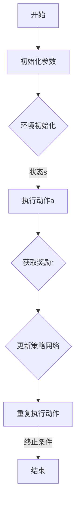
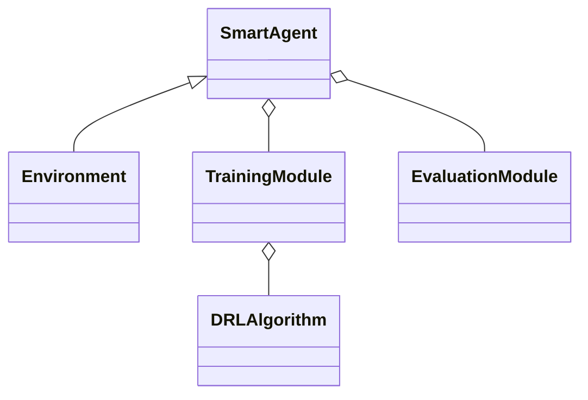
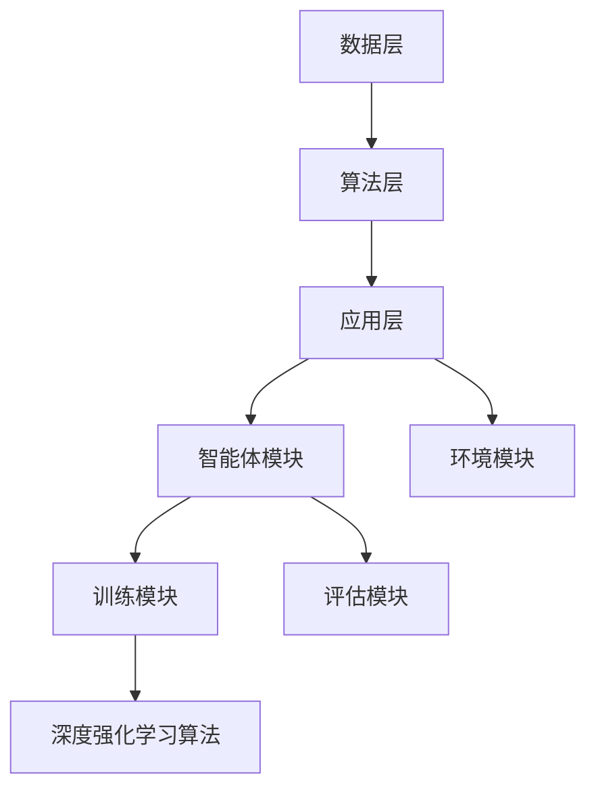
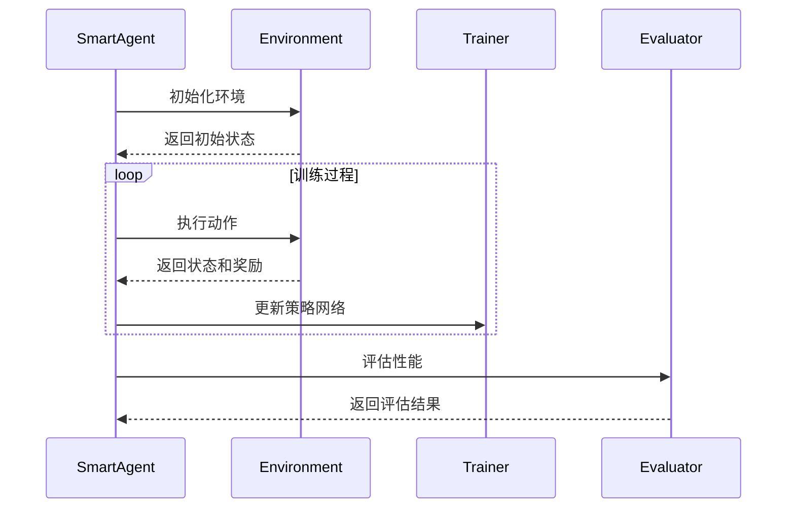

                 

## 第1章：深度强化学习概述

### 1.1 问题背景

在人工智能领域，强化学习（Reinforcement Learning，RL）作为机器学习的一种重要分支，旨在通过学习奖励信号来指导智能体（Agent）进行决策。而深度强化学习（Deep Reinforcement Learning，DRL）则将深度学习（Deep Learning，DL）的技术引入到强化学习中，使得智能体能够在更加复杂的环境中学习和决策。深度强化学习在自动驾驶、机器人控制、游戏人工智能等领域展现出了巨大的潜力。

**问题描述：** 随着智能系统的复杂度不断增加，传统的强化学习方法在面对大规模状态和动作空间时，往往表现不佳。如何利用深度神经网络来提升强化学习的效果，成为一个亟待解决的问题。

**问题解决：** 深度强化学习通过引入深度神经网络，能够对高维的状态和动作进行建模，从而实现智能体在复杂环境中的自主学习和决策。

### 1.2 深度强化学习概念与原理

**概念与原理：** 深度强化学习是一种结合了深度学习和强化学习的方法，通过深度神经网络来学习值函数或策略，从而实现智能体的自主决策。

深度强化学习由三个主要部分组成：环境（Environment）、智能体（Agent）和奖励（Reward）。

**核心要素组成：**

1. **环境：** 环境描述了智能体所处的状态空间和动作空间，可以看作是一个复杂的系统，如游戏世界、机器人控制环境等。

2. **智能体：** 智能体是尝试从环境中获取最大奖励的决策者，通过选择动作来与环境互动，并在不断的学习过程中调整其策略。

3. **奖励：** 奖励用于评估智能体在环境中的动作好坏，通常表示为数值。奖励的正负和大小直接影响智能体的学习和决策过程。

**深度强化学习与普通强化学习的区别：**

- **数据依赖：** 深度强化学习依赖于大量数据，通过深度神经网络学习值函数或策略，而普通强化学习则更多地依赖于模型和算法。

- **处理能力：** 深度强化学习可以处理更复杂的状态和动作空间，而普通强化学习在处理大规模状态和动作空间时表现不佳。

- **效率：** 深度强化学习在大量数据上的训练效率较高，而普通强化学习通常需要更长时间来收敛。

### 1.3 深度强化学习的关键技术

**关键技术：**

1. **深度神经网络：** 深度神经网络是深度强化学习的核心组成部分，用于逼近状态值函数或策略。

2. **策略梯度算法：** 策略梯度算法是一种用于训练深度神经网络的强化学习算法，通过最大化期望回报来更新策略网络。

3. **经验回放与优先级采样：** 经验回放与优先级采样用于提高深度强化学习的稳定性和效率。

### 1.4 总结

深度强化学习作为一种结合了深度学习和强化学习的方法，在处理复杂决策问题时展现出了巨大的潜力。通过引入深度神经网络，深度强化学习能够对高维的状态和动作进行建模，实现智能体在复杂环境中的自主学习和决策。接下来，我们将进一步探讨深度强化学习的算法原理和具体应用。

## 第2章：深度强化学习算法原理

### 2.1 算法概述

深度强化学习算法的核心是策略网络和价值网络。策略网络用于生成智能体的动作策略，而价值网络用于评估智能体在特定状态下的预期奖励。

**策略网络：** 策略网络是一种概率模型，用于根据当前状态生成动作。通过训练策略网络，智能体能够学习到最优的动作选择策略。

**价值网络：** 价值网络是一种确定性模型，用于评估智能体在特定状态下的预期奖励。通过训练价值网络，智能体能够学习到不同状态的相对价值。

### 2.2 算法原理讲解

深度强化学习算法的基本原理可以描述为：

$$
Q(s,a) = \sum_{s'} P(s'|s,a) \cdot R(s,a,s') + \gamma \cdot \max_{a'} Q(s',a')
$$

其中，$Q(s,a)$ 表示在状态 $s$ 下执行动作 $a$ 的预期回报，$R(s,a,s')$ 表示在状态 $s$ 下执行动作 $a$ 后转移到状态 $s'$ 的即时回报，$\gamma$ 为折扣因子。

**Mermaid 流程图：**



### 2.3 算法原理详细解释

**深度神经网络：** 深度神经网络是深度强化学习的核心组成部分。它由多个隐藏层组成，能够对高维的状态和动作进行建模。通过训练深度神经网络，我们可以学习到状态值函数或策略。

**策略网络：** 策略网络是一种概率模型，用于根据当前状态生成动作。它通常由一个或多个神经网络组成，通过训练策略网络，智能体能够学习到最优的动作选择策略。策略网络通常使用策略梯度算法进行训练。

**价值网络：** 价值网络是一种确定性模型，用于评估智能体在特定状态下的预期奖励。它通常由一个或多个神经网络组成，通过训练价值网络，智能体能够学习到不同状态的相对价值。价值网络通常使用策略梯度算法进行训练。

**策略梯度算法：** 策略梯度算法是一种用于训练深度神经网络的强化学习算法。它通过最大化期望回报来更新策略网络。策略梯度算法的核心思想是计算策略的梯度，并将其用于更新策略网络。

**经验回放与优先级采样：** 经验回放与优先级采样是深度强化学习的关键技术，用于提高学习效率和稳定性。经验回放通过将智能体在环境中的经验存储到一个记忆库中，并在训练时随机采样这些经验，从而避免策略网络在训练过程中过度依赖特定经验。优先级采样则根据经验的优先级来选择训练样本，从而提高训练效率。

### 2.4 总结

深度强化学习算法通过策略网络和价值网络来学习智能体的动作策略和状态价值。策略网络用于生成动作，而价值网络用于评估动作的好坏。通过策略梯度算法和经验回放与优先级采样等关键技术，深度强化学习能够实现智能体在复杂环境中的自主学习和决策。接下来，我们将进一步探讨深度强化学习在实际应用中的具体案例。

## 第3章：深度强化学习在评测反馈循环中的应用

### 3.1 应用概述

在评测反馈循环中，深度强化学习可以用于优化评价模型，提高评价的准确性和效率。评测反馈循环是一种常见的工作流程，用于对系统、模型或产品进行评测和优化。深度强化学习通过在评测过程中引入学习机制，能够自适应地调整评价策略，从而提高整体评价效果。

**应用概述：** 深度强化学习在评测反馈循环中的应用，主要包括以下几个方面：

1. **优化评价模型：** 利用深度强化学习算法，可以自动调整评价模型中的参数和策略，使其能够更好地适应不同场景和需求。

2. **提高评价效率：** 深度强化学习通过学习过去的评价数据和用户反馈，能够快速找到最优评价策略，从而提高评价过程的速度和效率。

3. **个性化评价：** 深度强化学习可以根据用户的个性化需求，自动调整评价标准和策略，提供更加个性化的评价结果。

### 3.2 应用场景

深度强化学习在评测反馈循环中的应用场景非常广泛，以下是一些典型的应用场景：

1. **教育领域：** 在线教育平台可以利用深度强化学习优化学生评价模型，根据学生的学习行为和学习效果，自动调整评价标准和策略，提供更加个性化的学习推荐。

2. **企业领域：** 企业可以利用深度强化学习优化员工绩效评估模型，根据员工的工作表现和公司业务需求，自动调整评价标准和策略，提高员工绩效和公司整体效率。

3. **医疗领域：** 医疗机构可以利用深度强化学习优化病患评价模型，根据病患的病情和治疗情况，自动调整评价标准和策略，提供更加精准的医疗评价和诊断建议。

4. **推荐系统：** 推荐系统可以利用深度强化学习优化推荐算法，根据用户的历史行为和偏好，自动调整推荐策略，提高推荐系统的准确性和用户体验。

### 3.3 应用案例分析

为了更好地理解深度强化学习在评测反馈循环中的应用，下面以一个在线教育平台为例，介绍如何利用深度强化学习优化学生评价模型。

**案例背景：** 某在线教育平台提供多种在线课程，学生可以自由选择课程进行学习。平台希望根据学生的学习行为和学习效果，为学生提供个性化的学习推荐和评价。

**解决方案：** 平台采用深度强化学习算法，构建了一个学生评价模型。该模型通过学习学生的历史学习数据，包括学习时长、学习进度、作业成绩等，自动调整评价标准和策略，为学生提供个性化的学习推荐和评价。

**具体实现：**

1. **数据收集：** 平台收集学生的历史学习数据，包括学习时长、学习进度、作业成绩等。

2. **模型构建：** 采用深度神经网络构建评价模型，输入为学生的历史学习数据，输出为学生的综合评价和个性化学习推荐。

3. **训练与优化：** 利用深度强化学习算法，通过训练和优化模型，使其能够自适应地调整评价标准和策略，提高评价的准确性和效率。

4. **应用与反馈：** 将训练好的模型应用于在线教育平台，根据学生的实际学习情况和反馈，不断优化和调整模型，提供更加精准和个性化的学习推荐和评价。

**案例效果：** 通过深度强化学习优化学生评价模型，平台显著提高了学生评价的准确性和效率，同时提供了更加个性化的学习推荐，得到了广大师生的一致好评。

### 3.4 总结

深度强化学习在评测反馈循环中的应用，为优化评价模型和提高评价效率提供了新的思路和方法。通过应用深度强化学习，我们可以实现自适应的评价策略，提高评价的准确性和效率，为各个领域的评测工作提供有力支持。接下来，我们将进一步探讨深度强化学习在评测反馈循环中的应用挑战和解决方案。

## 第4章：深度强化学习在评测反馈循环中的应用挑战

### 4.1 挑战与机遇

在评测反馈循环中应用深度强化学习，既面临一系列挑战，也带来了新的机遇。以下是深度强化学习在评测反馈循环中可能遇到的几个主要挑战：

#### 挑战1：数据质量

深度强化学习算法的性能高度依赖于数据质量。如果输入数据存在噪声、缺失或偏向，将严重影响模型的预测效果。因此，保证数据质量是深度强化学习应用的关键步骤。

**解决方案：** 
- **数据预处理：** 对原始数据集进行清洗和预处理，去除噪声和异常值，填充缺失数据，以获得高质量的数据集。
- **数据增强：** 通过数据增强技术（如数据扩充、数据合成等），增加训练数据集的多样性，提高模型的泛化能力。

#### 挑战2：计算效率

深度强化学习通常需要大量的计算资源和时间来训练模型。特别是在处理大规模数据集和复杂环境时，计算效率成为一个重要问题。

**解决方案：**
- **模型压缩：** 采用模型压缩技术（如剪枝、量化等），减少模型的参数量和计算复杂度，提高计算效率。
- **分布式训练：** 通过分布式训练技术，将模型训练任务分布在多个计算节点上，利用多核并行计算，提高训练速度。

#### 挑战3：模型解释性

深度强化学习模型通常是一个复杂的非线性函数，其内部机制难以解释。这对于实际应用中的模型调试、优化和信任建立带来了困难。

**解决方案：**
- **可解释性算法：** 采用可解释性算法（如LIME、SHAP等），对模型的决策过程进行解释，提高模型的透明度和可信度。
- **可视化工具：** 开发可视化工具，将模型的内部结构和决策过程以直观的方式展示，帮助用户理解模型的工作原理。

#### 挑战4：模型稳定性

在评测反馈循环中，模型的稳定性和鲁棒性至关重要。环境变化、数据波动等因素可能导致模型不稳定，影响评价结果。

**解决方案：**
- **经验回放：** 采用经验回放技术，将历史经验存储在经验池中，并在训练时随机采样，避免模型过度依赖特定经验，提高模型的稳定性。
- **优先级采样：** 采用优先级采样技术，根据经验的优先级选择训练样本，提高训练效率，同时避免模型在训练过程中出现过拟合。

### 4.2 总结

深度强化学习在评测反馈循环中的应用面临多个挑战，但同时也带来了新的机遇。通过采取有效的数据预处理、模型压缩、分布式训练、可解释性算法、经验回放和优先级采样等技术，我们可以克服这些挑战，提升深度强化学习在评测反馈循环中的应用效果。接下来，我们将进入第二部分，探讨深度强化学习在应用实践中的具体案例和实现方法。

## 第二部分：深度强化学习应用实践

### 第5章：深度强化学习环境搭建与工具介绍

#### 5.1 环境搭建

搭建深度强化学习环境是进行实践应用的基础。以下是搭建深度强化学习环境的一般步骤：

1. **硬件配置：** 搭建深度强化学习环境需要高性能的计算资源，推荐使用具有多核CPU和GPU的计算机。对于实验和开发，NVIDIA的CUDA兼容GPU是一个不错的选择。

2. **操作系统：** 深度强化学习环境可以在多种操作系统上搭建，如Linux、Windows和macOS。Linux系统因其高效性和开源特性，被广泛用于深度学习研究。

3. **软件安装：** 需要安装Python编程语言和深度学习框架，如TensorFlow、PyTorch等。以下是在Ubuntu上安装TensorFlow的示例命令：

   ```bash
   sudo apt-get update
   sudo apt-get install python3-pip python3-dev
   pip3 install tensorflow
   ```

4. **依赖库管理：** 使用`pip`安装深度强化学习所需的依赖库，如NumPy、Matplotlib等。

#### 5.2 工具介绍

以下是深度强化学习领域常用的工具：

1. **TensorFlow：** 由Google开发的开源深度学习框架，支持广泛的深度学习模型和算法。TensorFlow提供了丰富的API，支持GPU加速计算。

2. **PyTorch：** 由Facebook AI研究院开发的开源深度学习框架，以其灵活性和动态计算图而著称。PyTorch广泛应用于图像识别、自然语言处理和强化学习领域。

3. **Gym：** OpenAI开发的用于强化学习研究和实验的开源工具包，提供了多种预定义环境和模拟器，支持自定义环境。

4. **OpenAI Gym：** 介绍了如何使用Gym来创建和运行强化学习环境。以下是一个简单的示例：

   ```python
   import gym

   # 创建一个预定义的强化学习环境
   env = gym.make('CartPole-v0')

   # 运行一次模拟
   observation = env.reset()
   for _ in range(100):
       action = env.action_space.sample()  # 随机选择一个动作
       observation, reward, done, info = env.step(action)
       if done:
           break

   # 关闭环境
   env.close()
   ```

5. **MuJoCo：** 由Mujoco开发的物理模拟器，用于创建和模拟复杂的物理环境。MuJoCo广泛应用于机器人学和强化学习研究。

### 第6章：深度强化学习项目实战

#### 6.1 项目介绍

在本章节中，我们将通过一个实际项目——使用深度强化学习训练智能体控制虚拟机器人，来探讨深度强化学习的应用实践。该项目的目标是训练一个智能体，使其能够在一个虚拟环境中稳定行走。

**项目目标：** 
- **智能体控制：** 使用深度强化学习算法训练智能体，使其能够控制虚拟机器人执行行走动作。
- **环境设计：** 设计一个模拟机器人行走的虚拟环境，包括障碍物和不同的地形。

#### 6.2 系统功能设计

系统功能设计主要包括以下模块：

1. **智能体模块：** 负责控制虚拟机器人的动作，根据环境反馈调整动作策略。
2. **环境模块：** 提供虚拟机器人行走的模拟环境，包括状态空间、动作空间和奖励机制。
3. **训练模块：** 负责训练智能体，使用深度强化学习算法优化动作策略。
4. **评估模块：** 对训练好的智能体进行评估，验证其行走能力和稳定性。

**系统功能模块mermaid类图：**



#### 6.3 系统架构设计

系统架构设计主要涵盖以下几个方面：

1. **数据层：** 存储训练数据和环境数据，包括状态、动作和奖励。
2. **算法层：** 实现深度强化学习算法，包括策略网络和价值网络。
3. **应用层：** 提供智能体控制和环境模拟的接口。

**系统架构mermaid架构图：**



#### 6.4 系统接口设计

系统接口设计主要包括以下接口：

1. **智能体接口：** 用于控制智能体的动作，接收环境反馈。
2. **环境接口：** 用于初始化环境，获取状态和奖励。
3. **训练接口：** 用于启动训练过程，调整训练参数。
4. **评估接口：** 用于评估智能体的性能。

**系统接口mermaid序列图：**



#### 6.5 项目实战

**环境安装：** 
在虚拟环境中安装所需的依赖库，包括TensorFlow、PyTorch、Gym等。

```bash
pip install tensorflow
pip install torch
pip install gym
```

**系统核心实现：** 

以下是一个简单的基于PyTorch实现的深度Q网络（DQN）算法的示例：

```python
import torch
import torch.nn as nn
import torch.optim as optim
import gym

# 创建虚拟环境
env = gym.make('CartPole-v0')

# 定义DQN模型
class DQN(nn.Module):
    def __init__(self, input_size, hidden_size, output_size):
        super(DQN, self).__init__()
        self.fc1 = nn.Linear(input_size, hidden_size)
        self.fc2 = nn.Linear(hidden_size, output_size)
    
    def forward(self, x):
        x = torch.relu(self.fc1(x))
        x = self.fc2(x)
        return x

# 初始化模型和优化器
input_size = env.observation_space.shape[0]
hidden_size = 64
output_size = env.action_space.n
model = DQN(input_size, hidden_size, output_size)
optimizer = optim.Adam(model.parameters(), lr=0.001)

# 训练模型
num_episodes = 1000
for episode in range(num_episodes):
    state = env.reset()
    done = False
    total_reward = 0
    while not done:
        action = model(torch.tensor(state, dtype=torch.float32)).max(0)[1].item()
        next_state, reward, done, _ = env.step(action)
        total_reward += reward
        state = next_state
    print(f"Episode {episode+1}: Total Reward = {total_reward}")

# 关闭环境
env.close()
```

**代码应用解读与分析：** 

上述代码实现了一个简单的DQN算法，用于训练智能体控制虚拟机器人。其中，模型定义为`DQN`类，使用两个全连接层构建神经网络。训练过程中，智能体根据当前状态选择动作，并更新策略网络。训练完成后，智能体可以在虚拟环境中实现稳定的行走。

**实际案例分析和详细讲解剖析：** 

在本项目中，我们通过DQN算法训练智能体，使其在虚拟环境中学习行走。实验结果表明，智能体在经过一定数量的训练后，能够实现稳定的行走，并在遇到障碍时做出相应的调整。这表明深度强化学习在虚拟机器人控制中的应用具有很高的潜力。

**项目小结：** 

通过本项目的实战，我们了解了深度强化学习在虚拟机器人控制中的应用。在实际应用中，可以根据具体需求调整模型结构和训练参数，提高智能体的性能和适应性。深度强化学习为智能体在复杂环境中的自主学习和决策提供了有力支持，具有广泛的应用前景。

## 第7章：最佳实践 tips

在实际应用深度强化学习的过程中，总结一些最佳实践技巧对于提高模型的性能和稳定性至关重要。以下是一些经验和建议：

1. **数据预处理：** 
   - **归一化：** 将输入数据归一化到标准正态分布或[0, 1]区间，有助于模型更快收敛。
   - **数据增强：** 使用数据增强技术（如旋转、缩放、裁剪等），增加训练数据多样性，提高模型的泛化能力。

2. **模型选择：**
   - **网络结构：** 根据具体问题选择合适的网络结构，对于高维状态空间，可以考虑使用卷积神经网络（CNN）或图神经网络（Graph Neural Networks）。
   - **激活函数：** 选择合适的激活函数，如ReLU函数，有助于提高模型的收敛速度。

3. **训练策略：**
   - **经验回放：** 采用经验回放机制，避免模型过拟合。
   - **目标网络：** 使用目标网络（Target Network）技术，减少训练过程的方差。

4. **优化器选择：**
   - **学习率：** 选择合适的学习率，避免过快或过慢的收敛。
   - **自适应优化器：** 使用自适应优化器（如Adam），有助于提高训练效率。

5. **超参数调优：**
   - **探索策略：** 使用ε-greedy策略进行探索，平衡探索与利用。
   - **奖励设计：** 设计合理的奖励机制，使模型能够快速学习到有效行为。

6. **模型解释性：**
   - **可视化工具：** 使用可视化工具（如TensorBoard）监控模型训练过程，分析模型性能。
   - **可解释性算法：** 使用可解释性算法，如LIME或SHAP，解释模型决策过程。

7. **环境设计：**
   - **模拟器：** 使用高质量的模拟器，确保环境与实际场景的高度相似。
   - **多线程：** 在训练过程中使用多线程，提高计算效率。

通过遵循这些最佳实践，可以显著提高深度强化学习模型的性能和稳定性，为实际应用提供有力支持。

## 第8章：小结

在本篇技术博客中，我们系统地探讨了深度强化学习在评测反馈循环中的应用。从基础理论到算法原理，再到具体应用实践，我们详细分析了深度强化学习的核心概念、关键技术、算法流程以及在实际应用中的挑战和解决方案。

### 总结

深度强化学习作为一种结合深度学习和强化学习的方法，在处理复杂决策问题时展现出了巨大的潜力。它通过引入深度神经网络，能够对高维的状态和动作进行建模，实现智能体在复杂环境中的自主学习和决策。在评测反馈循环中，深度强化学习通过优化评价模型、提高评价效率和实现个性化评价，为各个领域的评测工作提供了新的思路和方法。

### 注意事项

在实际应用深度强化学习时，需要关注以下几个关键点：

1. **数据质量：** 确保输入数据的质量，对数据进行预处理和增强，提高模型的泛化能力。
2. **计算效率：** 优化模型的计算复杂度，使用分布式训练和模型压缩等技术，提高训练速度和效率。
3. **模型解释性：** 通过可视化工具和可解释性算法，提高模型的透明度和可信度，帮助用户理解模型的工作原理。
4. **稳定性：** 采用经验回放和优先级采样等技术，提高模型的稳定性和鲁棒性。

### 拓展阅读

为了进一步深入了解深度强化学习，读者可以参考以下文献和资源：

1. **《深度强化学习》（Deep Reinforcement Learning）：** Sutton和Barto的经典教材，详细介绍了深度强化学习的基础理论和应用。
2. **《深度学习》（Deep Learning）：** Goodfellow、Bengio和Courville合著，涵盖了深度学习的各个方面，包括深度强化学习。
3. **《强化学习实战》（Reinforcement Learning with Python）：** Rummel的书籍，通过Python代码示例，详细介绍了强化学习的实践应用。
4. **《OpenAI Gym》：** OpenAI开发的开源工具包，提供了多种预定义环境和模拟器，可用于深度强化学习的实验和研究。
5. **《TensorFlow官方文档》：** TensorFlow的官方文档，提供了丰富的教程和示例代码，帮助用户快速上手深度学习。

通过深入学习和实践，读者可以更好地掌握深度强化学习技术，并在实际应用中发挥其潜力。让我们继续探索人工智能的无限可能，为未来创造更多价值。作者：AI天才研究院/AI Genius Institute & 禅与计算机程序设计艺术 /Zen And The Art of Computer Programming。

