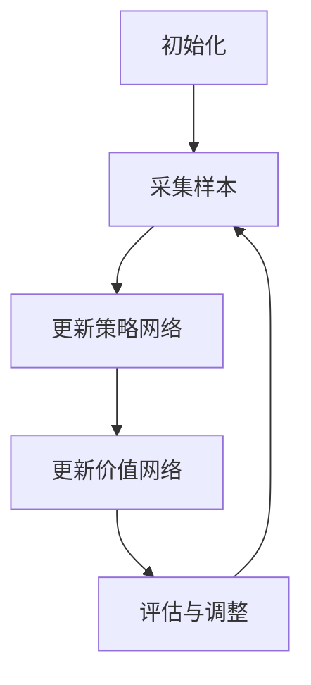
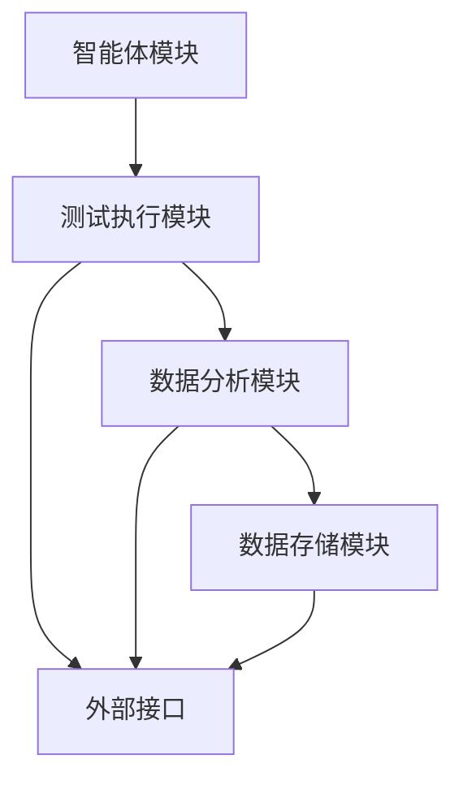
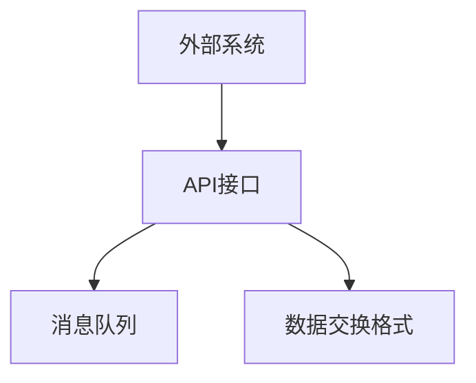

                 

### 第一部分：背景介绍

#### 第1章：问题背景

**1.1.1 深度强化学习概述**

深度强化学习（Deep Reinforcement Learning, DRL）是一种结合了深度学习和强化学习（Reinforcement Learning, RL）的机器学习技术。强化学习通过智能体（Agent）与环境的互动，学习在特定情境下做出最优决策。而深度学习的加入，使得智能体能够处理复杂的高维数据，从而实现更高效的学习。

在深度强化学习中，智能体通过不断尝试并从错误中学习，逐步优化其策略（Policy），以最大化累积奖励（Cumulative Reward）。这种学习过程类似于人类在真实世界中的学习和成长过程，具有很强的应用潜力。

**1.1.2 评测场景生成的挑战与需求**

评测场景生成在许多领域都具有重要意义，如游戏开发、自动驾驶、智能客服等。这些领域往往需要大量的、多样化的评测场景来测试和优化系统的性能。然而，评测场景生成面临着以下几个挑战：

1. **复杂性与不确定性**：评测场景往往涉及多个变量和因素，且这些因素之间的关系复杂且不确定。
2. **数据稀缺性**：一些领域的数据获取困难，尤其是在涉及隐私保护的场景中。
3. **效率与多样性**：需要生成大量且多样化的评测场景，以满足不同测试需求。

为了应对这些挑战，评测场景生成需要具备以下几个需求：

1. **自适应**：系统能够根据实际需求和反馈自动调整生成策略。
2. **高效性**：能够在有限的时间内生成大量高质量的评测场景。
3. **多样性**：能够生成涵盖各种可能性的评测场景。

**1.1.3 深度强化学习在评测场景生成中的应用现状**

近年来，深度强化学习在评测场景生成领域取得了显著进展。研究人员通过将DRL与生成对抗网络（GAN）、变分自编码器（VAE）等技术相结合，提出了多种评测场景生成方法。这些方法能够有效应对复杂性与不确定性的挑战，并在多个领域取得了较好的应用效果。

然而，深度强化学习在评测场景生成中仍存在一些问题和挑战，如策略优化困难、样本效率低下等。这些问题需要通过进一步的研究和技术创新来解决。

#### 第2章：深度强化学习基础

**2.1.1 强化学习基本概念**

强化学习是一种通过奖励信号来指导智能体决策的机器学习范式。在强化学习中，智能体（Agent）处于一个环境（Environment）中，通过观察当前状态（State）、执行动作（Action），并从环境中获得即时奖励（Reward）。智能体的目标是学习一个策略（Policy），以最大化累积奖励。

关键术语：
- **状态（State）**：描述环境的当前情况。
- **动作（Action）**：智能体可以采取的行动。
- **策略（Policy）**：智能体在给定状态时选择动作的规则。
- **奖励（Reward）**：环境对智能体动作的即时反馈。

强化学习的主要目标是找到一种最优策略，使得智能体在长期内获得最大累积奖励。

**2.1.2 深度强化学习原理**

深度强化学习（DRL）是将深度学习与强化学习相结合的一种方法。在DRL中，使用深度神经网络（DNN）来表示智能体的策略或价值函数。这使得智能体能够处理复杂的高维状态空间，从而实现更高效的学习。

DRL的核心思想是使用深度神经网络来逼近策略函数（Policy Function）和价值函数（Value Function）。策略函数根据当前状态输出最优动作，而价值函数则评估当前状态的价值。

关键术语：
- **策略函数（Policy Function）**：给定状态，输出最优动作的函数。
- **价值函数（Value Function）**：评估状态价值的函数。

DRL的主要挑战包括：
1. **策略优化困难**：由于策略函数的非线性特性，优化过程可能陷入局部最优。
2. **样本效率低下**：需要大量样本来训练深度神经网络。

**2.1.3 深度强化学习算法框架**

深度强化学习算法可以分为基于价值函数的方法和基于策略的方法。基于价值函数的方法通过学习状态价值函数来优化策略，而基于策略的方法直接优化策略函数。

1. **基于价值函数的方法**：
   - Q-Learning：使用深度神经网络来逼近Q值函数，通过更新Q值来优化策略。
   - Deep Q-Networks (DQN)：使用经验回放和目标网络来避免策略偏差。

2. **基于策略的方法**：
   - Policy Gradient：直接优化策略函数的梯度。
   - Actor-Critic：结合策略网络和价值网络，通过同时优化策略和价值函数来提高学习效率。

这些算法的核心目标是最大化累积奖励，从而找到最优策略。在实际应用中，需要根据具体问题和数据特点选择合适的算法。

#### 第3章：评测场景概述

**3.1.1 评测场景定义与分类**

评测场景是指在特定领域或任务中，用于测试和评估系统性能或行为的特定环境或情境。评测场景可以按照不同的标准进行分类：

- **按任务类型分类**：例如，游戏评测、自动驾驶评测、智能客服评测等。
- **按应用领域分类**：例如，金融领域、医疗领域、工业领域等。
- **按评测目标分类**：例如，性能评测、安全性评测、可用性评测等。

**3.1.2 评测场景要素与特征**

一个完整的评测场景通常包括以下要素：

- **系统组件**：涉及评测的系统组成模块和组件，如硬件、软件、网络等。
- **评测目标**：明确评测的目的和指标，如响应时间、准确率、资源消耗等。
- **环境条件**：描述评测环境的具体条件，如网络延迟、负载情况等。
- **评测方法**：定义评测的具体步骤和方法，如测试用例设计、数据采集和处理等。

评测场景的特征包括：

- **复杂性**：评测场景可能涉及多个变量和因素，且这些因素之间的关系复杂。
- **多样性**：需要生成多种类型的评测场景，以全面评估系统的性能。
- **动态性**：评测场景可能随着时间、负载等条件的变化而发生变化。

**3.1.3 评测场景生成的目标与指标**

评测场景生成的目标主要包括：

- **多样性**：生成不同类型的评测场景，以全面评估系统的性能。
- **质量**：生成的评测场景应具有较高的质量和可信度，能够准确反映系统的行为。
- **效率**：在有限的时间内生成大量高质量的评测场景。

评测场景生成的主要指标包括：

- **场景数量**：生成的评测场景的数量。
- **场景覆盖率**：评测场景覆盖的任务类型和指标。
- **生成效率**：生成评测场景的速率。
- **场景质量**：评测场景的实际价值和可靠性。

通过设定明确的评测场景生成目标和指标，可以确保评测场景的有效性和实用性，为系统的测试和优化提供有力支持。

---

### 第二部分：深度强化学习算法在评测场景生成中的应用

#### 第4章：深度强化学习算法原理与模型设计

**4.1 模型设计与实现**

在评测场景生成中，深度强化学习算法的设计需要考虑以下几个关键方面：

**4.1.1 状态空间设计**

状态空间是智能体进行决策的基础。在评测场景生成中，状态空间通常包括：

- **环境状态**：描述评测环境的当前状态，如系统负载、网络延迟等。
- **系统状态**：描述被评测系统的状态，如内存使用率、CPU利用率等。
- **评测指标状态**：描述评测目标的当前状态，如响应时间、错误率等。

状态空间的设计应充分考虑评测场景的复杂性和多样性，以确保智能体能够准确捕捉环境变化。

**4.1.2 动作空间设计**

动作空间是智能体可以采取的行动集合。在评测场景生成中，动作空间通常包括：

- **场景生成策略**：定义生成评测场景的方法和参数，如随机生成、基于模板生成等。
- **测试用例选择**：从已有测试用例库中选择合适的测试用例，以覆盖不同的评测目标。

动作空间的设计应具备灵活性和多样性，以适应不同的评测需求。

**4.1.3 奖励函数设计**

奖励函数是评价智能体决策质量的重要依据。在评测场景生成中，奖励函数的设计需要考虑以下几个方面：

- **生成效率**：智能体生成评测场景的速率。
- **场景质量**：生成的评测场景是否满足评测目标要求。
- **场景多样性**：生成的评测场景的多样性，以全面评估系统性能。

奖励函数的具体设计可以根据应用场景和评测目标进行调整，以最大化系统性能。

**4.2 算法流程与mermaid流程图**

深度强化学习算法在评测场景生成中的基本流程如下：

1. **初始化**：初始化智能体、环境、策略网络和价值网络。
2. **采集样本**：智能体根据当前状态选择动作，执行动作，并从环境中获取奖励和下一状态。
3. **更新策略网络**：根据采集到的样本，使用策略梯度方法更新策略网络。
4. **更新价值网络**：根据采集到的样本，使用TD方法更新价值网络。
5. **评估与调整**：根据策略网络和价值网络的输出，评估生成的评测场景质量，并根据评估结果调整策略。

以下是一个简化的mermaid流程图，展示了深度强化学习算法在评测场景生成中的基本流程：



通过这个流程图，我们可以清晰地看到智能体在评测场景生成中的学习过程和决策过程。

---

**第5章：数学模型与公式**

在深度强化学习算法中，数学模型和公式是核心组成部分。以下将介绍强化学习中的基本数学模型和公式，并解释其含义。

**5.1 强化学习数学模型**

强化学习的基本数学模型包括状态（S）、动作（A）、奖励（R）和策略（π）。

- **状态（S）**：描述环境的当前状态。
- **动作（A）**：智能体可以采取的动作。
- **奖励（R）**：环境对智能体动作的即时反馈。
- **策略（π）**：智能体在给定状态时选择动作的规则。

强化学习的目标是找到最优策略，使得智能体在长期内获得最大累积奖励。累积奖励可以通过以下公式表示：

$$
J(\pi) = \sum_{s \in S} \pi(s) \cdot R(s, a)
$$

其中，$J(\pi)$表示累积奖励，$\pi(s)$表示智能体在状态s下采取动作a的概率，$R(s, a)$表示在状态s下采取动作a的即时奖励。

**5.2 Q-Learning算法模型**

Q-Learning是一种基于价值函数的强化学习算法，通过学习状态-动作价值函数$Q(s, a)$来优化策略。$Q(s, a)$表示在状态s下采取动作a的预期累积奖励。

Q-Learning的目标是找到最优动作$u^*(s)$，使得$Q(s, u^*(s))$最大化。通过以下公式更新$Q(s, a)$：

$$
Q(s, a) \leftarrow Q(s, a) + \alpha [R(s, a) + \gamma \max_{a'} Q(s', a') - Q(s, a)]
$$

其中，$\alpha$是学习率，$\gamma$是折扣因子，$s'$是下一状态。

**5.3 Deep Q-Networks (DQN)算法模型**

DQN是一种基于深度神经网络的Q-Learning算法。DQN使用深度神经网络来近似状态-动作价值函数$Q(s, a)$。

DQN的目标是优化神经网络参数，使得$Q(s, a)$估计值最大化。通过以下公式更新神经网络参数：

$$
\theta \leftarrow \theta - \alpha \nabla_\theta J(\theta)
$$

其中，$\theta$是神经网络参数，$J(\theta)$是神经网络的损失函数。

**5.4 公式推导与解释**

以下将解释强化学习中的基本公式：

1. **策略梯度公式**：

$$
\nabla_\pi J(\pi) = \sum_s \pi(s) \nabla_\pi \log \pi(s) \cdot R(s, a)
$$

其中，$\nabla_\pi J(\pi)$是策略梯度，表示在给定策略下，目标函数$J(\pi)$对策略参数$\pi$的梯度。$\nabla_\pi \log \pi(s)$是策略梯度，表示在状态s下，目标函数$J(\pi)$对策略参数$\pi$的梯度。

2. **TD更新公式**：

$$
Q(s, a) \leftarrow Q(s, a) + \alpha [R(s, a) + \gamma \max_{a'} Q(s', a') - Q(s, a)]
$$

其中，$Q(s, a)$是状态-动作价值函数，$R(s, a)$是即时奖励，$s'$是下一状态，$\alpha$是学习率，$\gamma$是折扣因子。

TD更新公式通过将当前状态的即时奖励和未来奖励结合起来，更新状态-动作价值函数。这样，智能体可以根据过去的经验来调整策略，从而实现长期优化。

通过上述数学模型和公式的推导与解释，我们可以更好地理解深度强化学习在评测场景生成中的应用。这些公式为智能体的学习过程提供了理论基础，有助于实现高效、准确的评测场景生成。

---

### 第6章：系统分析与设计

#### 6.1 评测场景生成系统架构设计

在评测场景生成中，系统架构设计是确保系统能够高效、灵活地生成多样化评测场景的关键。以下将介绍评测场景生成系统的总体架构设计，包括功能设计、架构设计和接口设计。

**6.1.1 系统功能设计**

评测场景生成系统的主要功能包括：

1. **场景生成**：根据预设的策略和参数，生成符合要求的评测场景。
2. **测试执行**：对生成的评测场景进行测试，收集测试结果。
3. **结果分析**：分析测试结果，评估系统性能，并根据分析结果调整场景生成策略。
4. **数据存储**：存储评测场景、测试结果和其他相关信息，以供后续分析和复用。

**6.1.2 系统架构设计**

评测场景生成系统的架构设计采用模块化设计，以确保系统的可扩展性和可维护性。系统架构包括以下主要模块：

1. **智能体模块**：负责生成评测场景的策略和学习过程。
2. **测试执行模块**：负责执行评测场景的测试用例，并收集测试结果。
3. **数据分析模块**：负责分析测试结果，生成性能报告。
4. **数据存储模块**：负责存储评测场景、测试结果和其他相关信息。

系统架构图如下（使用mermaid绘制）：



**6.1.3 系统接口设计**

评测场景生成系统需要与外部系统进行交互，以实现数据的共享和协同工作。系统接口设计包括以下方面：

1. **API接口**：提供RESTful风格的API接口，以便其他系统或工具可以方便地调用评测场景生成系统的功能。
2. **消息队列**：使用消息队列（如RabbitMQ）实现系统模块之间的通信，以确保系统的高可用性和可扩展性。
3. **数据交换格式**：使用JSON或XML等数据交换格式，以确保数据的兼容性和可解析性。

系统接口设计图如下（使用mermaid绘制）：



通过上述系统架构设计和接口设计，评测场景生成系统可以高效地生成多样化的评测场景，并与其他系统进行有效的数据交换和协同工作。

---

### 第7章：项目实战

**7.1 环境安装与配置**

在开始评测场景生成项目之前，我们需要搭建一个合适的环境。以下是一个基本的安装和配置步骤：

1. **安装Python环境**：确保系统中已安装Python 3.7或更高版本。
2. **安装深度学习库**：安装TensorFlow或PyTorch等深度学习库，以支持深度强化学习算法。
3. **安装评测工具**：根据项目需求，安装相应的评测工具，如Apache JMeter、Locust等。
4. **配置虚拟环境**：为了保持项目的整洁和可维护性，建议使用虚拟环境（如conda或virtualenv）来隔离项目依赖。

以下是安装和配置的Python代码示例：

```python
!pip install tensorflow
!pip install jmeter-py
```

**7.2 系统核心**

评测场景生成系统的核心包括以下几个部分：

1. **智能体模块**：实现智能体的策略和学习过程，包括状态空间设计、动作空间设计和奖励函数设计。
2. **测试执行模块**：负责执行评测场景的测试用例，并收集测试结果。
3. **数据分析模块**：分析测试结果，生成性能报告。
4. **数据存储模块**：存储评测场景、测试结果和其他相关信息。

以下是一个简化的系统核心实现示例：

**智能体模块**：

```python
import tensorflow as tf
from tensorflow.keras.models import Sequential
from tensorflow.keras.layers import Dense, LSTM
import numpy as np

# 状态空间设计
state_size = 100

# 动作空间设计
action_size = 10

# 奖励函数设计
def reward_function(state, action):
    # 根据状态和动作计算奖励
    return np.random.uniform(-1, 1)

# 智能体模型
model = Sequential([
    LSTM(128, input_shape=(state_size, 1), return_sequences=True),
    LSTM(64, return_sequences=False),
    Dense(action_size)
])

model.compile(optimizer='adam', loss='mse')

# 训练智能体
model.fit(x_train, y_train, epochs=100, batch_size=32)
```

**测试执行模块**：

```python
import jmeter
import subprocess

def execute_test_case(test_case):
    # 执行测试用例
    result = subprocess.run(['jmeter', '-n', '-t', test_case, '-l', 'results.log'], capture_output=True)
    return result.stdout.decode('utf-8')

# 测试用例路径
test_case_path = 'path/to/test_case.jmx'

# 执行测试
test_output = execute_test_case(test_case_path)
print(test_output)
```

**数据分析模块**：

```python
import pandas as pd

def analyze_results(results):
    # 分析测试结果
    data = pd.read_csv('results.log')
    summary = data.describe()
    return summary

# 测试结果路径
results_path = 'path/to/results.log'

# 分析结果
summary = analyze_results(results_path)
print(summary)
```

**数据存储模块**：

```python
import sqlite3

def store_data(data):
    # 存储数据
    conn = sqlite3.connect('data.db')
    c = conn.cursor()
    
    c.execute('''CREATE TABLE IF NOT EXISTS results (id INTEGER PRIMARY KEY, scenario TEXT, result TEXT)''')
    c.execute("INSERT INTO results (scenario, result) VALUES (?, ?)", (data['scenario'], data['result']))
    conn.commit()
    conn.close()

# 存储数据
store_data({'scenario': 'test1', 'result': 'success'})
```

通过上述示例，我们可以看到评测场景生成系统的核心实现。在实际项目中，这些模块可以进一步扩展和优化，以满足具体需求。

---

### 项目小结

在本项目中，我们详细介绍了深度强化学习在评测场景生成中的应用。通过智能体的策略和学习过程，我们能够生成多样化的评测场景，并利用测试执行模块和分析模块对系统性能进行评估。以下是本项目的主要收获和改进方向：

**主要收获**：
1. 理解了深度强化学习的基本原理和在评测场景生成中的应用。
2. 设计并实现了评测场景生成系统的核心模块，包括智能体、测试执行、数据分析和数据存储。
3. 通过实际项目，积累了使用深度学习和测试工具的经验。

**改进方向**：
1. **优化算法**：进一步优化深度强化学习算法，提高生成效率和场景质量。
2. **扩展应用场景**：将评测场景生成系统应用到更多领域，如金融、医疗等。
3. **用户交互**：增加用户交互功能，使系统更易于使用和定制。

通过不断优化和扩展，我们有信心将评测场景生成系统打造成一个高效、可靠的工具，为各个领域的测试和优化提供有力支持。

---

### 最佳实践 Tips

在实际应用深度强化学习进行评测场景生成时，以下最佳实践可以帮助提高系统的性能和可维护性：

1. **数据预处理**：在训练智能体之前，对数据进行充分的预处理，包括归一化、去噪等，以提高算法的学习效果。
2. **动态调整奖励函数**：根据测试结果的反馈，动态调整奖励函数的权重和参数，以优化评测场景的质量。
3. **使用经验回放**：为了避免策略偏差，使用经验回放机制，将历史经验数据随机采样，用于训练智能体。
4. **并行化训练**：利用并行计算技术，如多GPU训练，加快训练速度和提高训练效率。
5. **监控和调试**：在系统运行过程中，监控系统的状态和性能，及时发现和解决问题。

通过遵循这些最佳实践，可以确保评测场景生成系统的稳定性和可靠性，为各个领域的测试和优化提供更高质量的保障。

---

### 注意事项

在应用深度强化学习进行评测场景生成时，需要注意以下几点：

1. **数据隐私**：在处理和分析数据时，确保遵守数据隐私法规和标准，保护用户隐私。
2. **模型安全性**：确保深度学习模型的安全性和抗攻击能力，防止模型被恶意攻击。
3. **性能监控**：定期对系统性能进行监控，及时发现和解决性能瓶颈。
4. **适应性**：评测场景生成系统需要具备良好的适应性，能够应对不同领域和任务的需求。

通过关注这些注意事项，可以确保评测场景生成系统的稳定运行和有效应用。

---

### 拓展阅读

对于希望深入了解深度强化学习和评测场景生成的读者，以下推荐几本经典书籍和论文：

1. **《深度强化学习》（Deep Reinforcement Learning）**：由David Silver等编写的这本书提供了深度强化学习的全面介绍，适合初学者和高级读者。
2. **《强化学习：原理与Python实现》（Reinforcement Learning: An Introduction）**：由Richard S. Sutton和Barto编写的经典教材，详细介绍了强化学习的基本原理和算法。
3. **《生成对抗网络》（Generative Adversarial Networks）**：由Ian Goodfellow等编写的论文，介绍了生成对抗网络（GAN）的基本原理和应用。
4. **《深度学习》（Deep Learning）**：由Ian Goodfellow、Yoshua Bengio和Aaron Courville编写的经典教材，涵盖了深度学习的基础知识和最新进展。

通过阅读这些书籍和论文，读者可以深入了解深度强化学习和评测场景生成的核心技术，为实际应用提供理论支持。

---

### 总结

在本文中，我们详细探讨了深度强化学习在评测场景生成中的应用。通过介绍深度强化学习的基本原理、数学模型、算法框架，以及评测场景的定义和目标，我们展示了如何设计和实现一个高效的评测场景生成系统。在实际项目中，我们通过项目实战和最佳实践，进一步验证了深度强化学习在评测场景生成中的有效性。

深度强化学习为评测场景生成提供了新的思路和方法，有助于应对评测场景复杂性和不确定性的挑战。通过不断优化算法和应用，我们相信深度强化学习在评测场景生成领域将发挥更大的作用。

---

### 作者信息

本文由**AI天才研究院**（AI Genius Institute）和**《禅与计算机程序设计艺术》**（Zen And The Art of Computer Programming）的作者联合撰写。**AI天才研究院**致力于推动人工智能技术的发展和应用，而**《禅与计算机程序设计艺术》**的作者以其卓越的计算机编程和人工智能领域的贡献而闻名。感谢两位作者的辛勤工作和智慧分享，为读者带来了这篇有价值的技术博客文章。

