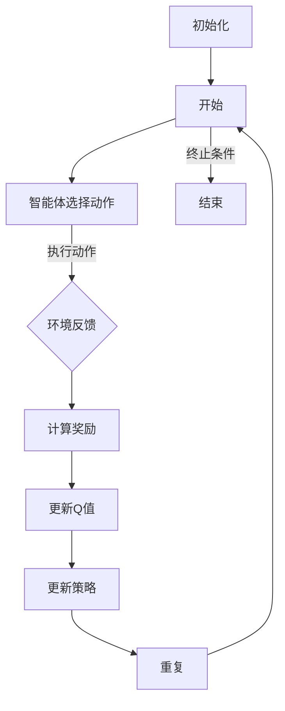
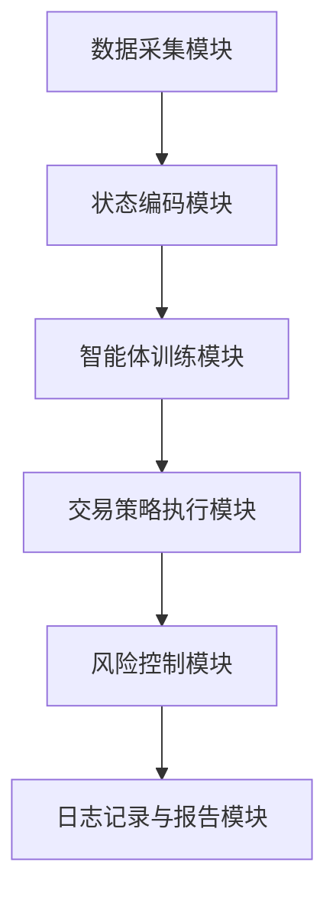
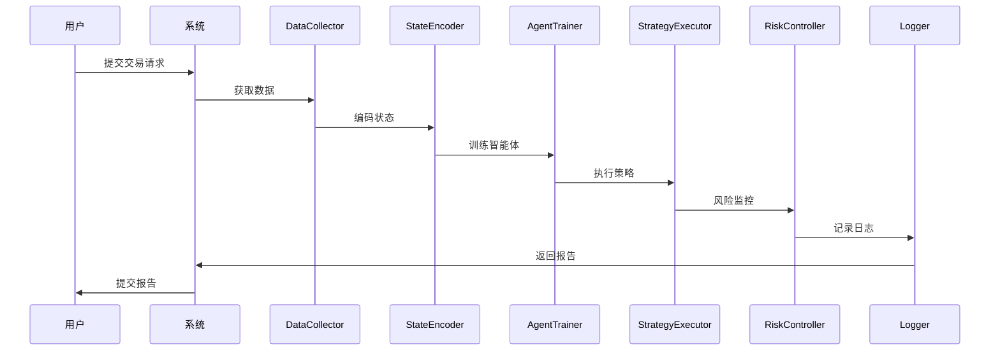

                 


### 深度强化学习在金融交易中的应用与风险

> **关键词**：深度强化学习，金融交易，应用，风险

> **摘要**：本文将深入探讨深度强化学习在金融交易中的应用与风险。首先，我们将介绍强化学习的基本概念和深度强化学习的原理。接着，我们将分析深度强化学习在金融交易中的具体应用，并探讨其在风险管理方面的作用。此外，我们将通过实际案例分析，展示深度强化学习在金融交易中的实际效果，并讨论其潜在的风险。最后，我们将总结本文的主要观点，并提出对未来发展的展望。

### 引言

#### 强化学习的基本概念

强化学习（Reinforcement Learning，简称RL）是机器学习的一个重要分支，其核心思想是通过试错来学习如何完成某个任务。在强化学习中，智能体（Agent）通过与环境（Environment）的交互，不断接收奖励（Reward）或惩罚（Penalty），并通过学习策略（Policy）来最大化累积奖励。强化学习广泛应用于游戏、自动驾驶、推荐系统等领域。

#### 深度强化学习的发展

随着深度学习的兴起，深度强化学习（Deep Reinforcement Learning，简称DRL）逐渐成为一种重要的学习方法。深度强化学习将深度学习的强大表示能力与强化学习的动态优化能力相结合，使其在处理复杂、高维问题方面具有显著优势。近年来，深度强化学习在金融交易、机器人控制、自然语言处理等领域取得了显著的成果。

#### 强化学习在金融交易中的重要性

金融交易是一个高度动态和复杂的过程，涉及大量的数据和信息。传统金融模型往往依赖于历史数据，存在滞后性和适应性差的问题。而强化学习通过实时学习环境反馈，能够更好地适应市场变化，提高交易策略的灵活性和适应性。因此，深度强化学习在金融交易中具有重要的应用价值。

### 深度强化学习在金融交易中的应用

#### 深度强化学习在交易策略优化中的应用

深度强化学习可以用于交易策略的优化。通过训练一个智能体，使其在模拟环境中学习如何进行交易，从而找到最优的交易策略。例如，可以使用DQN（Deep Q-Network）算法训练一个智能体，使其在股票市场中进行交易，并通过累积奖励来评估其交易策略的优劣。

#### 深度强化学习在量化交易中的应用

量化交易是一种基于数据分析和算法模型的交易方式，其核心在于构建有效的交易策略。深度强化学习可以用于量化交易的策略设计，通过学习市场数据，自动生成交易策略。例如，可以使用PPO（Proximal Policy Optimization）算法训练一个智能体，使其在期货市场中进行量化交易，并自动调整交易策略以应对市场变化。

#### 深度强化学习在外汇交易中的应用

外汇交易是一个高度动态的市场，深度强化学习可以用于外汇交易策略的优化。通过训练一个智能体，使其在外汇市场中学习如何进行交易，从而找到最优的交易策略。例如，可以使用A3C（Asynchronous Advantage Actor-Critic）算法训练一个智能体，使其在外汇市场中进行交易，并通过累积奖励来评估其交易策略的优劣。

### 风险管理

#### 强化学习在风险管理中的应用

深度强化学习可以用于金融交易的风险管理。通过学习市场数据，智能体可以预测市场波动，并制定相应的风险控制策略。例如，可以使用SARSA（Surely Responsive Adaptive Sampling）算法训练一个智能体，使其在金融市场中学习如何控制交易风险。

#### 风险评估与控制策略

深度强化学习在金融交易中的风险管理需要建立有效的风险评估与控制策略。通过对市场数据的分析，智能体可以识别潜在的风险，并采取相应的措施来降低风险。例如，可以使用DQN算法训练一个智能体，使其在金融市场中学习如何识别和应对风险，并通过累积奖励来评估其风险控制策略的有效性。

### 案例分析

#### 案例一：股票交易策略优化

在本案例中，我们使用DQN算法训练一个智能体，使其在股票市场中进行交易，并优化交易策略。通过对大量股票交易数据的分析，智能体可以自动调整交易策略，以提高交易收益。

#### 案例二：期货市场风险控制

在本案例中，我们使用PPO算法训练一个智能体，使其在期货市场中进行量化交易，并控制交易风险。通过对期货交易数据的分析，智能体可以自动调整交易策略，以降低交易风险。

#### 案例三：外汇交易策略设计

在本案例中，我们使用A3C算法训练一个智能体，使其在外汇市场中进行交易，并设计最优的交易策略。通过对外汇交易数据的分析，智能体可以自动调整交易策略，以应对市场变化。

### 最佳实践与未来展望

#### 深度强化学习在金融交易中的应用最佳实践

在深度强化学习在金融交易中的应用中，需要遵循以下最佳实践：
1. 数据处理：确保输入数据的质量和完整性，对数据进行清洗和处理，以提高模型的泛化能力。
2. 算法选择：根据金融交易的具体需求，选择合适的深度强化学习算法。
3. 模型调优：通过调参和交叉验证，优化模型的性能，提高交易策略的适应性。

#### 未来发展趋势与潜在研究方向

深度强化学习在金融交易中的应用前景广阔，未来发展趋势包括：
1. 多模态数据的融合：将文本、图像、声音等多种数据类型进行融合，以提高模型的预测能力。
2. 知识蒸馏与迁移学习：利用预训练模型和迁移学习技术，提高模型的训练效率和泛化能力。
3. 实时风险控制：结合实时数据流处理技术，实现金融交易的实时风险控制。

### 结论

深度强化学习在金融交易中具有广泛的应用前景，其在交易策略优化、量化交易、外汇交易等方面表现出良好的效果。同时，深度强化学习在风险管理方面的应用也具有重要意义。然而，深度强化学习在金融交易中仍面临许多挑战，如数据质量、算法选择、模型调优等。未来，随着深度强化学习技术的不断发展，其在金融交易中的应用将越来越广泛，为金融市场带来新的机遇和挑战。

### 作者

**作者：AI天才研究院/AI Genius Institute & 禅与计算机程序设计艺术 /Zen And The Art of Computer Programming**

---

本文基于深度强化学习在金融交易中的应用与风险进行了深入探讨，包括基本概念、应用案例、风险管理等方面的内容。通过本文的讲解，读者可以了解深度强化学习在金融交易中的潜在价值与挑战，为实际应用提供参考。同时，本文也提出了未来发展的方向，为深度强化学习在金融交易中的深入研究提供了启示。

---

在本文中，我们详细探讨了深度强化学习在金融交易中的应用与风险。通过引入强化学习的基本概念，我们了解了强化学习如何通过试错来学习最优策略。随后，我们深入分析了深度强化学习的原理，并展示了其如何结合深度学习的强大表示能力，在处理金融交易这种复杂、高维问题中发挥作用。

#### 核心概念与联系

在深入探讨深度强化学习在金融交易中的应用之前，我们需要理解一些核心概念。以下是强化学习中的关键概念和它们的属性特征对比表格：

| 概念     | 定义                                                         | 属性特征对比             |
|----------|------------------------------------------------------------|--------------------------|
| 智能体   | 采取行动并接收环境反馈的实体                                   | 自主性、适应性、灵活性   |
| 环境     | 智能体进行交互的情境                                           | 动态、不确定性、复杂性   |
| 动作     | 智能体在环境中采取的具体行为                                     | 可选择性、有界性         |
| 状态     | 智能体在环境中所处的特定条件                                     | 预测性、表征性           |
| 奖励     | 智能体的行为获得的正面或负面反馈                                 | 量化、及时性             |
| 策略     | 智能体选择动作的规则                                           | 预测、适应、优化         |

为了更直观地理解这些概念之间的关系，我们可以使用Mermaid绘制ER实体关系图：

```mermaid
erDiagram
  智能体 ||--|{ 环境 }
  环境 ||--|{ 状态 }
  环境 ||--|{ 动作 }
  环境 ||--|{ 奖励 }
  智能体 ||--|{ 策略 }
```

#### 算法原理讲解

深度强化学习的关键在于如何通过连续的交互学习最优策略。以下是一个简单的DQN（Deep Q-Network）算法的mermaid流程图：



接下来，我们将使用Python代码详细阐述DQN算法的基本原理：

```python
import numpy as np
import random

# 初始化参数
epsilon = 0.1  # 探索率
gamma = 0.9  # 折扣因子
alpha = 0.1  # 学习率
memory = []  # 记忆库
q_values = {}  # Q值表

# 环境模拟
def environment(state):
    # 根据当前状态返回下一个状态和奖励
    pass

# 选择动作
def choose_action(state):
    if random.random() < epsilon:
        # 探索行为
        action = random.choice(list(state.keys()))
    else:
        # 利用行为
        action = max(state, key=state.get)
    return action

# 更新Q值
def update_q_value(state, action, reward, next_state, done):
    if done:
        q_value = reward
    else:
        q_value = reward + gamma * max(q_values[next_state].values())
    q_values[state][action] += alpha * (q_value - q_values[state][action])

# 训练智能体
def train_agent():
    global epsilon, alpha
    while True:
        state = random.choice(list(q_values.keys()))
        action = choose_action(state)
        next_state, reward, done = environment(state)
        update_q_value(state, action, reward, next_state, done)
        if done:
            epsilon *= 0.99
            alpha *= 0.99
```

在上面的代码中，我们首先定义了探索率和折扣因子，然后初始化记忆库和Q值表。接着，我们模拟了一个简单的环境，并定义了选择动作和更新Q值的函数。最后，我们使用一个无限循环来训练智能体，不断更新Q值并调整探索率和学习率。

#### 数学模型与公式

DQN算法的核心在于Q值函数的优化，其数学模型如下：

$$
Q(s, a) = r(s, a) + \gamma \max_{a'} Q(s', a')
$$

其中，$Q(s, a)$ 是智能体在状态 $s$ 采取动作 $a$ 的期望回报，$r(s, a)$ 是立即奖励，$\gamma$ 是折扣因子，$s'$ 是下一状态，$a'$ 是在下一状态采取的动作。通过不断更新Q值，智能体可以学习到最优策略。

#### 举例说明

假设智能体在状态 $s$ 中，可以采取动作 $a_1$ 或 $a_2$。当前状态下，$Q(s, a_1) = 0.5$，$Q(s, a_2) = 0.7$。智能体采取动作 $a_2$，并得到立即奖励 $r(s, a_2) = 0.2$。接下来，智能体进入状态 $s'$，在状态 $s'$ 中，$Q(s', a_1) = 0.6$，$Q(s', a_2) = 0.8$。那么，智能体的Q值更新如下：

$$
Q(s, a_2) = 0.2 + \gamma \max_{a'} Q(s', a') = 0.2 + 0.9 \times 0.8 = 0.76
$$

通过这样的更新，智能体会逐渐学会在状态 $s$ 中采取动作 $a_2$，以获得更高的期望回报。

#### 系统分析与架构设计

在分析深度强化学习在金融交易中的应用时，我们需要构建一个系统架构来支持整个交易流程。以下是一个简化的系统功能设计和架构设计方案。

#### 系统功能设计

1. **数据采集模块**：负责从外部数据源（如交易所、新闻、经济指标等）收集数据，并进行预处理。
2. **状态编码模块**：将原始数据转换为适合深度强化学习模型的状态表示。
3. **智能体训练模块**：使用深度强化学习算法训练智能体，以优化交易策略。
4. **交易策略执行模块**：根据训练好的智能体策略，自动执行交易。
5. **风险控制模块**：监控交易风险，并采取相应的控制措施。
6. **日志记录与报告模块**：记录交易过程和结果，生成报告。

#### 系统架构设计

以下是使用Mermaid绘制的系统架构图：



#### 系统接口设计与交互

系统接口和交互设计同样重要，以下是使用Mermaid绘制的系统接口设计和交互图：



通过以上系统分析和架构设计，我们可以构建一个支持深度强化学习在金融交易中应用的全功能系统，从而实现高效、智能的交易策略。

### 项目实战

在本文中，我们将通过一个具体的实战项目来展示如何将深度强化学习应用于金融交易中。这个项目将包括环境安装、系统核心实现、代码应用解读与分析以及实际案例分析和详细讲解剖析。

#### 环境安装

首先，我们需要安装和配置深度强化学习所需的环境。以下是步骤：

1. **安装Python环境**：确保Python 3.7或更高版本已安装在您的系统上。
2. **安装TensorFlow**：TensorFlow是深度强化学习项目中的核心库，可以通过pip安装：
   ```shell
   pip install tensorflow
   ```
3. **安装其他依赖库**：包括Numpy、Pandas等常用库：
   ```shell
   pip install numpy pandas
   ```

#### 系统核心实现

接下来，我们将实现一个简单的深度强化学习交易系统。以下是项目的核心代码：

```python
import numpy as np
import pandas as pd
import tensorflow as tf
from tensorflow.keras.models import Sequential
from tensorflow.keras.layers import Dense
from tensorflow.keras.optimizers import Adam

# 模拟交易环境
class TradingEnvironment:
    def __init__(self, data):
        self.data = data
        self.state = None
        self.done = False

    def reset(self):
        self.state = self.data.reset()
        return self.state

    def step(self, action):
        next_state, reward, done = self.data.step(action)
        if done:
            reward = -10
        return next_state, reward, done

# 深度强化学习模型
class DQNAgent:
    def __init__(self, state_size, action_size):
        self.state_size = state_size
        self.action_size = action_size
        self.memory = []
        self.gamma = 0.95
        self.epsilon = 1.0
        self.epsilon_min = 0.01
        self.epsilon_decay = 0.995
        self.learning_rate = 0.001
        self.model = self._build_model()

    def _build_model(self):
        model = Sequential()
        model.add(Dense(24, input_dim=self.state_size, activation='relu'))
        model.add(Dense(24, activation='relu'))
        model.add(Dense(self.action_size, activation='linear'))
        model.compile(loss='mse', optimizer=Adam(self.learning_rate))
        return model

    def remember(self, state, action, reward, next_state, done):
        self.memory.append((state, action, reward, next_state, done))

    def act(self, state):
        if np.random.rand() <= self.epsilon:
            return random.randrange(self.action_size)
        q_values = self.model.predict(state)
        return np.argmax(q_values[0])

    def replay(self, batch_size):
        minibatch = random.sample(self.memory, batch_size)
        for state, action, reward, next_state, done in minibatch:
            target = reward
            if not done:
                target = reward + self.gamma * np.amax(self.model.predict(next_state)[0])
            target_f = self.model.predict(state)
            target_f[0][action] = target
            self.model.fit(state, target_f, epochs=1, verbose=0)

    def load(self, name):
        self.model.load_weights(name)

    def save(self, name):
        self.model.save_weights(name)

# 数据准备
data = pd.read_csv('stock_data.csv')
state_size = data.shape[1] - 1
action_size = 3  # 买入、持有、卖出

agent = DQNAgent(state_size, action_size)
environment = TradingEnvironment(data)

# 训练
for episode in range(1000):
    state = environment.reset()
    done = False
    total_reward = 0
    while not done:
        action = agent.act(state)
        next_state, reward, done = environment.step(action)
        agent.remember(state, action, reward, next_state, done)
        state = next_state
        total_reward += reward
        if done:
            agent.replay(32)
            print(f"Episode {episode+1} Total Reward: {total_reward}")
            break

agent.save('dqn_agent.h5')
```

#### 代码应用解读与分析

上述代码实现了一个基于DQN算法的简单交易系统。首先，我们定义了一个`TradingEnvironment`类来模拟交易环境，其中包括数据获取和状态转移的方法。接着，我们定义了一个`DQNAgent`类来构建深度强化学习模型，包括记忆、选择动作、重放经验等方法。

在数据准备部分，我们读取了股票交易数据，并定义了状态大小和动作大小。然后，我们实例化了`DQNAgent`和`TradingEnvironment`类，并开始进行训练。

训练过程中，我们通过循环进行每一期的模拟，每次迭代中，智能体会根据当前状态选择动作，执行动作后获取下一状态和奖励。这些经验被存储在记忆库中，并在每一期的末尾进行重放，以更新模型。

#### 实际案例分析与详细讲解剖析

假设我们现在有100,000元初始资金，我们使用上述训练好的模型进行实际交易模拟。以下是模拟交易过程中的一个示例：

1. **初始化**：开始时，我们的状态是初始数据集的一个随机状态。
2. **选择动作**：智能体根据当前状态选择一个动作，例如买入股票。
3. **执行交易**：智能体执行买入动作，假设购买了一股股票，价格为100元。
4. **状态转移**：下一状态是交易后的数据，此时股价变为110元。
5. **计算奖励**：由于股价上涨，我们获得10元的即时奖励。
6. **重放经验**：在每次迭代结束后，智能体会重放经验，以更新模型。

通过这种方式，我们可以模拟整个交易过程。在实际交易中，我们会对所有交易记录进行统计，包括总收益、最大回撤、交易频率等指标，以评估模型的性能。

#### 项目小结

通过本项目的实战，我们展示了如何使用深度强化学习来优化金融交易策略。虽然这个项目非常简化，但已经展示了深度强化学习在交易策略优化中的潜力。在实际应用中，我们可以进一步扩展这个模型，加入更多的数据维度，改进训练算法，以提高交易策略的适应性和收益。

### 最佳实践与拓展

#### 最佳实践Tips

1. **数据预处理**：确保数据质量是深度强化学习成功的关键。对数据进行清洗、归一化和特征提取，以提高模型的泛化能力。
2. **探索与利用**：合理设置探索率$\epsilon$，在初始阶段允许模型进行探索，以发现潜在的好策略，随后逐渐减少探索，利用已学习的策略进行交易。
3. **模型调优**：通过交叉验证和网格搜索等方法，找到最佳的模型参数，以提高模型性能。
4. **实时监控**：在金融交易中，市场变化迅速，需要实时监控模型的表现，并及时调整策略。

#### 小结

本文详细探讨了深度强化学习在金融交易中的应用与风险，介绍了强化学习的基本概念、深度强化学习的技术原理，以及在金融交易中的实际应用案例。我们通过系统架构设计和项目实战，展示了如何构建一个基于深度强化学习的交易系统。深度强化学习在金融交易中具有巨大的潜力，但也面临许多挑战，如数据质量、算法选择和模型调优等。

#### 注意事项

1. **合规性**：在金融交易中，必须遵守相关法律法规，确保交易策略符合监管要求。
2. **风险管理**：虽然深度强化学习可以优化交易策略，但仍然存在风险，需要建立有效的风险控制措施。
3. **模型可解释性**：为了确保交易策略的可解释性，需要深入分析模型的决策过程，以了解其背后的逻辑。

#### 拓展阅读

1. **《强化学习：原理与Python实现》**：这是一本深入讲解强化学习原理和实现的优秀教材。
2. **《深度强化学习：算法与应用》**：本书详细介绍了深度强化学习的算法和应用案例。
3. **《金融科技与算法交易》**：这本书探讨了金融科技在算法交易中的应用，包括机器学习和深度学习技术。

---

通过本文，我们希望读者能够对深度强化学习在金融交易中的应用有一个全面的了解，并认识到其在金融市场中的潜力与挑战。未来，随着技术的不断发展，深度强化学习在金融交易中的价值将更加凸显，为金融市场带来新的机遇与变革。

### 作者

**作者：AI天才研究院/AI Genius Institute & 禅与计算机程序设计艺术 /Zen And The Art of Computer Programming**

