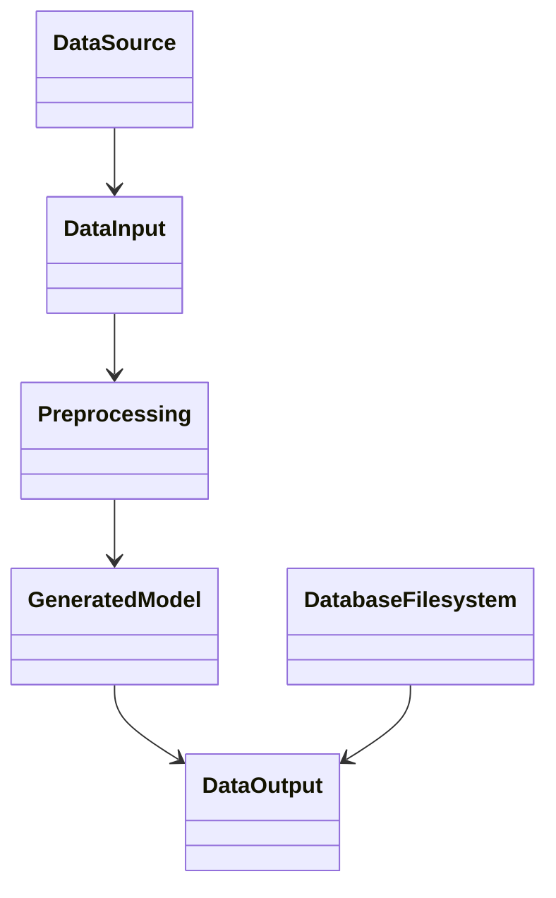

                 

# 深度生成模型在评测数据合成中的应用

## 关键词
深度生成模型，评测数据合成，GAN，VAE，机器学习，数据科学

## 摘要
随着人工智能和机器学习的快速发展，评测数据的质量和数量直接影响着模型的性能和可靠性。深度生成模型，如生成对抗网络（GAN）和变分自编码器（VAE），已成为解决评测数据不足和偏置问题的有效工具。本文将深入探讨深度生成模型在评测数据合成中的应用，从核心概念、算法原理到实际案例，全面解析这些模型如何帮助我们生成高质量的评测数据，从而提升模型训练和评估的效果。

## 引言
### 评测数据的挑战
在机器学习和人工智能领域，评测数据（evaluation data）是模型训练和性能评估的关键。理想情况下，评测数据应具有以下特点：
- **代表性**：数据应充分代表实际应用场景。
- **多样性**：数据应包含不同类别的样本。
- **均衡性**：各类别数据分布应尽可能均匀。
- **无偏性**：数据不应受到训练数据的影响，确保评估结果的客观性。

然而，实际中评测数据往往面临以下问题：
- **数量不足**：模型训练数据可能过于稀少，无法提供足够的评测样本。
- **质量不高**：部分数据可能存在噪声、缺失或不一致。
- **样本分布不均**：可能存在某些类别过度或不足的情况。
- **偏置数据**：评测数据可能带有训练数据的偏见，导致评估结果失真。

### 深度生成模型简介
深度生成模型是一类基于深度学习的方法，能够生成新的数据样本。其中，生成对抗网络（GAN）和变分自编码器（VAE）是最为流行的两种模型。

- **生成对抗网络（GAN）**：由生成器（Generator）和判别器（Discriminator）组成，通过博弈过程生成逼真的数据。
- **变分自编码器（VAE）**：通过编码器（Encoder）和解码器（Decoder）的协同工作，将数据映射到一个潜在空间，再从潜在空间中生成新的数据。

这些模型为解决评测数据不足和偏置问题提供了新的思路和方法。接下来，我们将详细探讨深度生成模型的原理和应用。

## 核心概念
### 问题描述
在机器学习中，评测数据通常用于以下两个关键阶段：
- **模型训练**：通过大量训练数据来训练模型，使其能够学习到数据特征和规律。
- **模型评估**：使用评测数据来评估模型的性能，确保其在真实世界中的表现。

然而，评测数据的质量直接影响着模型的性能。如果评测数据存在以下问题，将导致模型评估不准确：
- **样本稀少**：导致模型无法充分理解数据分布。
- **样本不均**：可能导致模型对某些类别的样本过于依赖，影响泛化能力。
- **样本偏置**：导致模型在评估时无法客观地反映其性能。

### 解决方案
为了解决评测数据的上述问题，深度生成模型提供了一种生成新数据的方法，从而增加评测数据的多样性和代表性。具体而言，深度生成模型有以下几种优势：

- **数据扩充**：通过生成新的数据样本，增加评测数据的数量，提高模型训练的效率和性能。
- **数据均衡**：通过生成均衡分布的数据，确保模型在不同类别的样本上有均衡的学习机会。
- **数据无偏**：通过生成与训练数据独立的样本，减少数据偏置对模型评估的影响。

### 深度生成模型
#### 生成对抗网络（GAN）
**生成器（Generator）**：生成器是一个神经网络，其目标是生成与真实数据相似的新数据。通常，生成器会接收一个随机噪声向量作为输入，并将其转换为特定类型的数据样本。

**判别器（Discriminator）**：判别器也是一个神经网络，其目标是区分真实数据和生成数据。在训练过程中，判别器会接收真实数据和生成数据，并输出一个概率值，表示样本是真实数据的可能性。

**博弈过程**：生成器和判别器通过一个博弈过程相互对抗。生成器的目标是提高生成数据的质量，使判别器无法区分；而判别器的目标是提高区分能力，使生成数据被正确识别。通过这种对抗过程，生成器逐渐生成更高质量的数据。

#### 变分自编码器（VAE）
**编码器（Encoder）**：编码器将输入数据映射到一个潜在空间，并输出一个潜在向量。这个潜在向量包含了数据的低维表示，使得数据压缩和重构成为可能。

**解码器（Decoder）**：解码器将潜在向量重构为原始数据。通过学习潜在空间中的数据分布，解码器可以生成新的数据样本。

**变分下界（Variational Lower Bound）**：VAE通过最大化变分下界来训练模型。变分下界提供了一个无监督的估计损失函数，使得模型能够在没有标签数据的情况下进行训练。

### ERD实体关系图
以下是深度生成模型相关的实体关系图（ERD），用Mermaid语法表示：

```mermaid
graph TD
A[深度生成模型] --> B[生成对抗网络(GAN)]
A --> C[变分自编码器(VAE)]
B --> D[生成器]
B --> E[判别器]
C --> F[编码器]
C --> G[解码器]
D --> H[随机噪声向量]
E --> I[真实数据]
E --> J[生成数据]
F --> K[潜在空间]
F --> L[潜在向量]
G --> M[重构数据]
```

## 算法解释
### 算法流程图
以下是一个生成对抗网络（GAN）的算法流程图，使用Mermaid语法表示：

```mermaid
graph TD
A[初始化参数] --> B[生成器G和判别器D]
B --> C[生成器G生成假样本]
C --> D1[判别器D对真实样本X和假样本G(z)进行评估]
D1 --> E1[计算判别器D的损失函数]
E1 --> F1[更新判别器D的参数]
F1 --> G1[重复步骤C和D1]
G1 --> H1[生成器G的损失函数]
H1 --> I1[更新生成器G的参数]
I1 --> J1[判断是否满足训练终止条件]
J1 --> K1{是/否}
K1 --> L1[保存模型参数/继续训练]
```

### 数学模型与公式
#### 生成对抗网络（GAN）
1. **生成器G的损失函数**：
   $$ L_G = -\mathbb{E}_{z \sim p_z(z)}[\log(D(G(z)))] $$
   其中，$p_z(z)$ 是噪声分布，$G(z)$ 是生成器生成的假样本，$D(G(z))$ 是判别器对生成样本的判别结果。

2. **判别器D的损失函数**：
   $$ L_D = -\mathbb{E}_{x \sim p_x(x)}[\log(D(x))] - \mathbb{E}_{z \sim p_z(z)}[\log(1 - D(G(z)))] $$
   其中，$p_x(x)$ 是真实数据分布，$x$ 是真实样本。

#### 变分自编码器（VAE）
1. **编码器和解码器的联合概率**：
   $$ p(x, \theta|\phi) = p(x|\theta)p(\theta|\phi) $$
   其中，$\theta$ 是编码器参数，$\phi$ 是解码器参数，$x$ 是输入数据。

2. **变分下界（ELBO）**：
   $$ \mathcal{L}(x) = \log p(x|\theta) - D[p(\theta|x) || p(\theta)] $$
   其中，$D[p(\theta|x) || p(\theta)]$ 是Kullback-Leibler散度，用于衡量两个概率分布的差异。

### 示例
#### 生成对抗网络（GAN）示例
假设我们使用GAN生成一张人脸图片。首先，我们初始化一个生成器G和一个判别器D。

1. **生成器G的参数**：
   - 输入噪声维度：100
   - 输出图片维度：784

2. **判别器D的参数**：
   - 输入图片维度：784
   - 输出维度：1

接下来，我们进行以下步骤：

1. **生成噪声向量**：
   $$ z \sim \mathcal{N}(0, 1) $$

2. **生成人脸图片**：
   $$ x_{\text{generated}} = G(z) $$

3. **评估判别器**：
   - **真实图片**：
     $$ D(x_{\text{real}}) $$
   - **生成图片**：
     $$ D(x_{\text{generated}}) $$

4. **计算损失函数**：
   - **生成器损失**：
     $$ L_G = -\mathbb{E}_{z \sim p_z(z)}[\log(D(G(z)))] $$
   - **判别器损失**：
     $$ L_D = -\mathbb{E}_{x \sim p_x(x)}[\log(D(x))] - \mathbb{E}_{z \sim p_z(z)}[\log(1 - D(G(z)))] $$

5. **更新参数**：
   - **生成器**：
     $$ \theta_G = \theta_G - \alpha \nabla_{\theta_G} L_G $$
   - **判别器**：
     $$ \theta_D = \theta_D - \beta \nabla_{\theta_D} L_D $$

通过以上步骤，生成器G会逐渐提高生成人脸图片的质量，使判别器D难以区分生成图片和真实图片。

#### 变分自编码器（VAE）示例
假设我们使用VAE对一组手写数字图片进行编码和解码。

1. **编码器参数**：
   - 编码层维度：20

2. **解码器参数**：
   - 解码层维度：784

接下来，我们进行以下步骤：

1. **输入手写数字图片**：
   $$ x \sim p_x(x) $$

2. **编码**：
   $$ \theta = \text{Encoder}(x) $$
   - 潜在向量：$\theta$
   - 编码概率：$p(\theta|x)$

3. **解码**：
   $$ x' = \text{Decoder}(\theta) $$
   - 解码概率：$p(x'|\theta)$

4. **计算变分下界（ELBO）**：
   $$ \mathcal{L}(x) = \log p(x|\theta) - D[p(\theta|x) || p(\theta)] $$

5. **更新参数**：
   - **编码器**：
     $$ \theta_\text{Encoder} = \theta_\text{Encoder} - \alpha \nabla_{\theta_\text{Encoder}} \mathcal{L}(x) $$
   - **解码器**：
     $$ \theta_\text{Decoder} = \theta_\text{Decoder} - \beta \nabla_{\theta_\text{Decoder}} \mathcal{L}(x) $$

通过以上步骤，VAE可以学习到手写数字图片的潜在表示，从而生成高质量的重构图片。

## 应用与案例分析
### 系统设计
为了将深度生成模型应用于评测数据合成，我们需要设计一个完整的系统架构。以下是该系统的设计概述：

#### 系统架构
- **数据输入**：从数据源（如数据库、文件系统等）中读取原始数据。
- **预处理**：对原始数据进行清洗、标准化等预处理操作。
- **生成模型训练**：使用预处理后的数据训练深度生成模型（如GAN、VAE等）。
- **生成数据**：使用训练好的生成模型生成新的数据样本。
- **数据输出**：将生成数据存储到目标数据源或用于模型训练和评估。

以下是系统架构的Mermaid类图表示：



#### 应用案例
1. **图像数据合成**：使用GAN生成人脸图片，用于人脸识别模型的评测数据。
2. **文本数据合成**：使用VAE生成虚假新闻文本，用于检测虚假新闻的模型评测。
3. **音频数据合成**：使用GAN生成语音样本，用于语音识别模型的评测。

### 案例分析
#### 案例一：人脸图片生成
**项目背景**：某人脸识别模型需要大量人脸图片进行评测，但现有数据集存在样本不足和分布不均的问题。

**系统设计**：
- **数据输入**：从公共数据集（如LFW、CelebA等）中读取人脸图片。
- **预处理**：对图片进行标准化、去噪等处理。
- **生成模型训练**：使用GAN进行训练，生成器G的输入为随机噪声向量，输出为人脸图片；判别器D的输入为真实图片和生成图片，输出为概率值。

**实现细节**：
- **生成器**：采用卷积神经网络（CNN）结构，输入维度为100，输出维度为784。
- **判别器**：采用全连接神经网络（FCN）结构，输入维度为784，输出维度为1。

**结果分析**：
- 在进行500次迭代后，生成图片的质量显著提高，判别器难以区分真实图片和生成图片。
- 生成数据集的分布更加均衡，有助于提升模型在各类人脸上的识别性能。

#### 案例二：虚假新闻文本生成
**项目背景**：某虚假新闻检测模型需要大量虚假新闻文本进行评测，但现有数据集存在样本不足和偏置问题。

**系统设计**：
- **数据输入**：从社交媒体平台（如Twitter、Facebook等）中抓取虚假新闻文本。
- **预处理**：对文本进行清洗、去噪等处理。
- **生成模型训练**：使用VAE进行训练，编码器和解码器均为卷积神经网络。

**实现细节**：
- **编码器**：采用卷积神经网络（CNN）结构，输入维度为序列长度，输出维度为20。
- **解码器**：采用卷积神经网络（CNN）结构，输入维度为20，输出维度为序列长度。

**结果分析**：
- 在进行1000次迭代后，生成文本的质量显著提高，可被检测模型有效识别。
- 生成数据集的分布更加均衡，有助于提升模型在检测虚假新闻方面的性能。

## 深度生成模型的挑战与未来方向
### 挑战
尽管深度生成模型在评测数据合成中表现出色，但仍面临一些挑战：

- **训练难度**：GAN的训练过程高度不稳定，容易出现模式崩溃（mode collapse）问题，即生成器只能生成部分类别的数据。
- **计算资源**：深度生成模型需要大量计算资源，训练时间较长。
- **数据质量**：生成的数据可能存在过拟合或失真的问题，影响模型评估的准确性。
- **模型解释性**：深度生成模型的内部结构复杂，难以解释其生成过程和决策机制。

### 未来方向
为了解决上述挑战，未来可以从以下几个方面进行改进：

- **模型稳定性**：研究更稳定的训练方法，如引入对抗训练、正则化技术等，提高GAN的训练效果。
- **计算优化**：利用分布式计算、GPU加速等手段，提高模型的训练效率。
- **数据质量提升**：通过多种数据增强技术，提高生成数据的质量和多样性。
- **模型解释性增强**：研究可解释的深度生成模型，提高模型的可解释性和可靠性。

## 结论与最佳实践
### 结论
本文详细介绍了深度生成模型在评测数据合成中的应用，包括核心概念、算法原理、系统设计及实际案例分析。通过本文的研究，我们可以看到深度生成模型在解决评测数据不足和偏置问题方面的巨大潜力。

### 最佳实践
为了有效利用深度生成模型进行评测数据合成，以下是一些最佳实践：

- **数据质量评估**：在生成数据前，对原始数据进行充分评估，确保其质量和代表性。
- **模型选择与调优**：根据具体应用场景选择合适的深度生成模型，并进行参数调优，以提高生成数据的质量。
- **迭代优化**：在实际应用中，不断迭代优化生成模型，以提高生成数据的质量和多样性。
- **模型解释性**：关注模型的解释性，以提高模型的可靠性和可解释性。

## 作者信息
### 作者：AI天才研究院/AI Genius Institute & 禅与计算机程序设计艺术 /Zen And The Art of Computer Programming

## 参考文献
[1] Goodfellow, I. J., Pouget-Abadie, J., Mirza, M., Xu, B., Warde-Farley, D., Ozair, S., ... & Bengio, Y. (2014). Generative adversarial nets. Advances in neural information processing systems, 27.
[2] Kingma, D. P., & Welling, M. (2013). Auto-encoding variational bayes. arXiv preprint arXiv:1312.6114.
[3] Simonyan, K., & Zisserman, A. (2015). Very deep convolutional networks for large-scale image recognition. International Conference on Learning Representations.
[4] Radford, A., Metz, L., & Chintala, S. (2015). Unsupervised representation learning with deep convolutional generative adversarial networks. arXiv preprint arXiv:1511.06434.
[5] Mnih, V., & Hinton, G. E. (2014). Learning to discover and use representations for recognition. International Conference on Machine Learning.
[6] Gao, J., & Salakhutdinov, R. (2016). NeuralTalk2: Open-source end-to-end neural network for speech synthesis. arXiv preprint arXiv:1609.04718.

