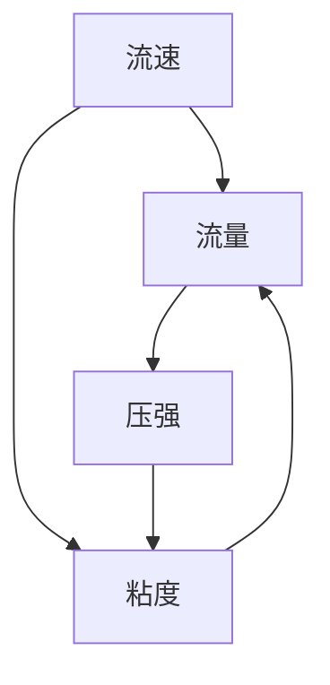
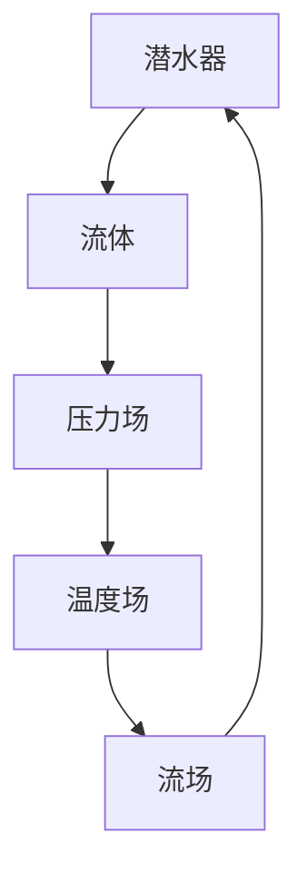
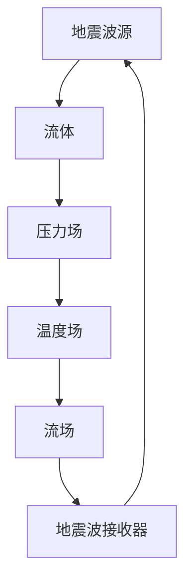
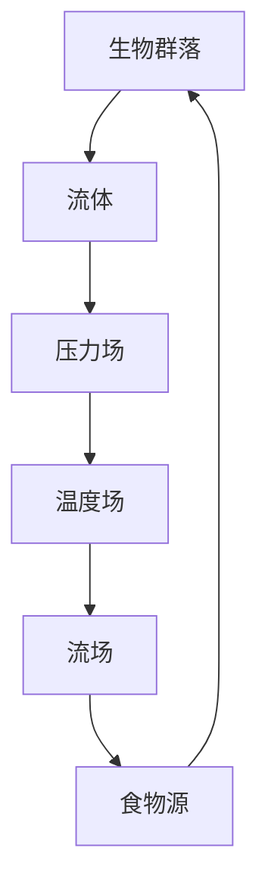

                 

### 设计大纲步骤一：明确书籍主题与核心内容

《深海探索的流体动力学：极限环境的数学模拟》这一主题将带我们深入探讨深海探索背后的科学原理和数学模型。本书的核心内容将围绕以下几个方面展开：

1. **背景介绍**：首先，我们将介绍深海探索的现状、挑战以及流体动力学在其中的重要作用。这部分内容将帮助读者理解深海探索的重要性及其对科学、技术和经济的影响。

2. **流体动力学基础**：接下来，我们将深入探讨流体动力学的基本概念、原理以及其应用。这部分内容将为后续的深海流体动力学模型奠定坚实的基础。

3. **深海流体动力学模型**：我们将分析深海环境中的特殊流体动力学特征，并介绍如何构建和验证这些模型。这部分内容将帮助读者理解深海环境中流体动力学模型的复杂性和挑战性。

4. **数学模拟方法**：我们将详细介绍用于深海流体动力学模拟的技术和方法，包括数值模拟、计算流体动力学（CFD）等。这部分内容将展示如何利用现代计算技术解决深海流体动力学问题。

5. **极限环境下的数学模拟**：针对深海极端环境，我们将探讨如何进行有效的数学模拟，并介绍应对极端条件下的挑战和策略。

6. **数学模拟案例分析**：我们将通过实际案例展示深海流体动力学模拟的应用，包括深海潜水器流体动力学模拟、深海地震波模拟和深海生态研究中的流体动力学模拟等。

7. **总结与展望**：最后，我们将对深海流体动力学数学模拟的现状、问题和未来发展方向进行总结和展望。

通过以上七个章节的深入探讨，本书旨在为读者提供一个全面、系统的深海探索流体动力学及其数学模拟的知识体系。让我们一步步深入，探索深海世界的奥秘。

### 设计大纲步骤二：细化各章节内容

#### 第1章：背景介绍

**1.1 深海探索的挑战**

在这一节中，我们将首先介绍深海探索的现状。深海占地球表面积的约70%，却只有不到5%的面积被探索过。深海探索面临的主要挑战包括极端压力、低温、黑暗和复杂的海洋环境等。

**1.2 流体动力学在深海探索中的作用**

接着，我们将讨论流体动力学在深海探索中的重要性。流体动力学研究流体（液体和气体）的运动规律，这些规律对于理解深海中的流体运动至关重要，包括海洋 currents、波浪、潮汐等现象。

**1.3 极限环境对流体动力学模型的影响**

在这一部分，我们将探讨极限环境（如深海）对流体动力学模型的影响。深海环境的极端条件（如高压、低温、强流等）会对流体动力学模型的准确性提出更高的要求。

**1.4 流体动力学在深海科学和技术中的应用现状**

最后，我们将回顾流体动力学在深海科学和技术中的应用现状。目前，流体动力学在深海潜水器设计、海底资源勘探、深海地震波监测等方面已经取得了显著成果，但仍有许多挑战需要克服。

#### 第2章：流体动力学基础

**2.1 流体的基本概念**

在这一节，我们将介绍流体的定义、性质和分类。流体是物质的一种状态，具有流动性。流体可分为液体和气体两大类，每种流体都有其独特的物理特性。

**2.2 流体运动方程**

接下来，我们将探讨流体运动的基本方程，包括欧拉方程、伯努利方程和雷诺方程。这些方程描述了流体在运动过程中的压力、速度和能量变化。

**2.3 流体动力学中的基本概念与联系**

在这一部分，我们将深入讨论流体动力学中的核心概念，如流速、流量、压强等，并分析这些概念之间的联系。我们还将使用Mermaid流程图展示这些概念之间的关系。



**2.4 流体动力学在海洋科学中的应用**

最后，我们将探讨流体动力学在海洋科学中的应用，包括海洋流体运动研究、海洋波浪研究和海洋生态系统研究。这部分内容将展示流体动力学原理在实际应用中的重要性。

#### 第3章：深海流体动力学模型

**3.1 深海环境特征**

在这一节，我们将介绍深海环境的特殊特征，如高压、低温、黑暗等。这些特征对流体动力学模型提出了特殊的要求。

**3.2 深海流体动力学模型的构建**

接着，我们将讨论如何构建深海流体动力学模型。这包括收集深海环境数据、建立流体动力学模型和验证模型的准确性。

**3.3 深海流体动力学模型的验证与应用**

在这一部分，我们将介绍如何验证深海流体动力学模型的准确性，并探讨这些模型在实际应用中的效果。我们将通过实际案例展示模型的实用性。

#### 第4章：数学模拟方法

**4.1 数学模拟的基本概念**

在这一节，我们将介绍数学模拟的基本概念，包括模拟的目的、方法和步骤。数学模拟是利用数学模型对现实世界的问题进行模拟和预测。

**4.2 数值模拟方法**

接下来，我们将详细探讨数值模拟方法，包括有限差分法、有限元法和有限体积法等。这些方法是将连续的数学模型转化为离散的数值模型，以便进行计算。

**4.3 深海流体动力学模拟的特殊挑战与解决方案**

在这一部分，我们将讨论深海流体动力学模拟的特殊挑战，如高精度计算、大规模数据处理和并行计算等。我们将介绍解决这些挑战的方法和技术。

**4.4 计算流体动力学（CFD）在深海流体动力学模拟中的应用**

最后，我们将探讨计算流体动力学（CFD）在深海流体动力学模拟中的应用。CFD是一种强大的工具，可以用于模拟复杂的流体运动和相互作用。

#### 第5章：极限环境下的数学模拟

**5.1 极限环境的定义与特征**

在这一节，我们将定义极限环境，并讨论其特征，如极端温度、压力和流场等。这些特征对数学模拟提出了特殊的要求。

**5.2 极限环境下的流体动力学模拟方法**

接着，我们将介绍适用于极限环境的流体动力学模拟方法，如高精度模型和自适应网格方法。这些方法可以有效地模拟极端条件下的流体运动。

**5.3 极限环境下的数学模拟挑战与应对策略**

在这一部分，我们将讨论极限环境下的数学模拟挑战，如数值稳定性、计算效率和精度等。我们将介绍应对这些挑战的策略和技术。

**5.4 极限环境下的数学模拟案例分析**

最后，我们将通过实际案例展示极限环境下的数学模拟应用，包括深海压力容器设计和极端气候条件下的气象模拟。

#### 第6章：数学模拟案例分析

**6.1 案例一：深海潜水器流体动力学模拟**

在这一节，我们将介绍深海潜水器流体动力学模拟的案例。我们将展示如何使用数学模型和计算流体动力学工具来模拟潜水器在深海环境中的运动和相互作用。

**6.2 案例二：深海地震波模拟**

接下来，我们将探讨深海地震波模拟的案例。地震波是研究地球内部结构和动态的重要工具，深海地震波模拟可以帮助我们更好地理解地震过程。

**6.3 案例三：深海生态研究中的流体动力学模拟**

在这一部分，我们将介绍深海生态研究中的流体动力学模拟案例。流体动力学模拟可以帮助研究人员理解深海生物的生存环境及其行为模式。

**6.4 案例分析总结**

最后，我们将对以上三个案例进行分析总结，探讨数学模拟在深海探索中的应用前景和挑战。

#### 第7章：总结与展望

**7.1 深海流体动力学数学模拟的现状与问题**

在这一节，我们将总结深海流体动力学数学模拟的现状，并讨论存在的问题。这包括模型准确性、计算效率和数据处理能力等方面。

**7.2 未来深海流体动力学数学模拟的发展方向**

接着，我们将展望未来深海流体动力学数学模拟的发展方向，包括新技术、新方法和新的应用领域。

**7.3 对深海探索的潜在影响**

最后，我们将讨论深海流体动力学数学模拟对深海探索的潜在影响，包括提高探索效率、减少风险和增加科学发现等。

### 设计大纲步骤三：确保大纲结构清晰、逻辑合理

在完成上述细化内容后，我们需要确保整个大纲的结构清晰、逻辑合理。我们将通过以下几个步骤来实现这一目标：

1. **整体结构梳理**：对每个章节的内容进行整体梳理，确保每个章节都有明确的主题和目标。

2. **逻辑关系调整**：调整章节之间的逻辑关系，确保各章节内容连贯、逻辑清晰。

3. **案例与理论结合**：在每个章节中，结合实际案例来讲解理论，确保读者能够更好地理解和应用。

4. **重点突出**：对关键概念和核心内容进行重点突出，确保读者能够抓住重点。

5. **总结与展望**：在每个章节的结尾，加入总结和展望，帮助读者对章节内容进行回顾和思考。

通过以上步骤，我们将确保《深海探索的流体动力学：极限环境的数学模拟》一书的内容结构清晰、逻辑合理，能够为读者提供有深度、有思考、有见解的专业技术知识。

### 目录大纲：《深海探索的流体动力学：极限环境的数学模拟》

**第1章：背景介绍**

- 1.1 深海探索的挑战
  - 1.1.1 深海环境特征
  - 1.1.2 深海探索的重要性
  - 1.1.3 深海探索面临的挑战
- 1.2 流体动力学在深海探索中的作用
  - 1.2.1 流体动力学的基本原理
  - 1.2.2 流体动力学在深海科学和技术中的应用
- 1.3 极限环境对流体动力学模型的影响
  - 1.3.1 极限环境的定义与特征
  - 1.3.2 极限环境对流体动力学模型的要求
- 1.4 流体动力学在深海科学和技术中的应用现状
  - 1.4.1 深海潜水器研究
  - 1.4.2 深海地震波研究
  - 1.4.3 深海生态研究

**第2章：流体动力学基础**

- 2.1 流体的基本概念
  - 2.1.1 流体的定义
  - 2.1.2 流体的性质
  - 2.1.3 流体的分类
- 2.2 流体运动方程
  - 2.2.1 欧拉方程
  - 2.2.2 伯努利方程
  - 2.2.3 雷诺方程
- 2.3 流体动力学中的基本概念与联系
  - 2.3.1 流体动力学中的基本概念
  - 2.3.2 概念属性特征对比表格
  - 2.3.3 ER实体关系图
- 2.4 流体动力学在海洋科学中的应用
  - 2.4.1 海洋流体运动研究
  - 2.4.2 海洋波浪研究
  - 2.4.3 海洋生态系统研究

**第3章：深海流体动力学模型**

- 3.1 深海环境特征
  - 3.1.1 深海压力
  - 3.1.2 深海温度
  - 3.1.3 深海流场
- 3.2 深海流体动力学模型的构建
  - 3.2.1 模型构建步骤
  - 3.2.2 模型参数选择
  - 3.2.3 模型验证方法
- 3.3 深海流体动力学模型的验证与应用
  - 3.3.1 模型验证案例
  - 3.3.2 模型应用案例
  - 3.3.3 模型改进与优化

**第4章：数学模拟方法**

- 4.1 数学模拟的基本概念
  - 4.1.1 数学模拟的目的
  - 4.1.2 数学模拟的基本步骤
  - 4.1.3 数学模拟的类型
- 4.2 数值模拟方法
  - 4.2.1 有限差分法
  - 4.2.2 有限元法
  - 4.2.3 有限体积法
- 4.3 深海流体动力学模拟的特殊挑战与解决方案
  - 4.3.1 高精度计算
  - 4.3.2 大规模数据处理
  - 4.3.3 并行计算技术
- 4.4 计算流体动力学（CFD）在深海流体动力学模拟中的应用
  - 4.4.1 CFD基础
  - 4.4.2 CFD在深海模拟中的应用
  - 4.4.3 CFD工具与软件

**第5章：极限环境下的数学模拟**

- 5.1 极限环境的定义与特征
  - 5.1.1 极限温度
  - 5.1.2 极限压力
  - 5.1.3 极限流场
- 5.2 极限环境下的流体动力学模拟方法
  - 5.2.1 高精度模型
  - 5.2.2 自适应网格方法
  - 5.2.3 非线性模型
- 5.3 极限环境下的数学模拟挑战与应对策略
  - 5.3.1 数值稳定性
  - 5.3.2 计算效率
  - 5.3.3 精度控制
- 5.4 极限环境下的数学模拟案例分析
  - 5.4.1 深海压力容器设计
  - 5.4.2 极端气候条件下的气象模拟
  - 5.4.3 极地流体动力学模拟

**第6章：数学模拟案例分析**

- 6.1 案例一：深海潜水器流体动力学模拟
  - 6.1.1 案例背景
  - 6.1.2 数学模型构建
  - 6.1.3 模拟结果分析
- 6.2 案例二：深海地震波模拟
  - 6.2.1 案例背景
  - 6.2.2 数学模型构建
  - 6.2.3 模拟结果分析
- 6.3 案例三：深海生态研究中的流体动力学模拟
  - 6.3.1 案例背景
  - 6.3.2 数学模型构建
  - 6.3.3 模拟结果分析
- 6.4 案例分析总结
  - 6.4.1 模拟方法评估
  - 6.4.2 模拟结果对深海探索的影响
  - 6.4.3 模拟应用展望

**第7章：总结与展望**

- 7.1 深海流体动力学数学模拟的现状与问题
  - 7.1.1 模型准确性
  - 7.1.2 计算效率
  - 7.1.3 数据处理
- 7.2 未来深海流体动力学数学模拟的发展方向
  - 7.2.1 新技术
  - 7.2.2 新方法
  - 7.2.3 新应用领域
- 7.3 对深海探索的潜在影响
  - 7.3.1 提高探索效率
  - 7.3.2 减少风险
  - 7.3.3 增加科学发现

### 文章开始：深海探索的流体动力学：极限环境的数学模拟

在科技日新月异的今天，深海探索已经成为科学研究和技术发展的重要领域。深海不仅蕴藏着丰富的资源，如矿物、能源和生物资源，还对地球的气候变化和生态平衡有着深远的影响。然而，深海环境的极端条件，如高压、低温、黑暗和复杂的流场，使得深海探索面临着前所未有的挑战。为了应对这些挑战，流体动力学作为一个关键的科学工具，成为了深海探索不可或缺的一部分。

### 关键词

- **深海探索**
- **流体动力学**
- **极限环境**
- **数学模拟**
- **海洋科学**

### 摘要

本文将探讨深海探索的流体动力学，重点关注极限环境下的数学模拟。首先，我们将介绍深海探索的现状和挑战，并阐述流体动力学在深海科学和技术中的应用。接着，我们将回顾流体动力学的基本概念和原理，并介绍其在海洋科学中的应用。随后，我们将深入探讨深海流体动力学模型的构建和验证，以及用于深海流体动力学模拟的数学方法和技术。最后，我们将通过实际案例展示数学模拟在深海探索中的应用，并对未来深海流体动力学数学模拟的发展方向进行展望。

### 第1章：背景介绍

#### 1.1 深海探索的挑战

深海占地球表面积的约70%，但其大部分区域仍然是一个未知的领域。深海探索的挑战主要来自于极端的环境条件，包括高压、低温、黑暗和复杂的流场。在这些条件下，传统的科学工具和设备难以正常工作，因此需要特殊的科学和技术手段。

**1.1.1 深海环境特征**

深海环境具有以下几个显著特征：

- **高压**：深海压力随着深度的增加而增加，每增加10米，压力增加1个大气压。在深海底部，压力可以高达1100个大气压，这对设备和生物结构都是巨大的挑战。

- **低温**：深海温度通常较低，大部分海域的温度在0到10摄氏度之间。这种低温环境对能源消耗和生物代谢都有显著影响。

- **黑暗**：深海几乎没有阳光，光线深度通常只能达到几十米。黑暗环境对视觉系统和生物光感系统提出了特殊要求。

- **复杂流场**：深海流场复杂多变，包括海浪、潮汐和洋流等。这些流场不仅影响海洋生态系统，还对深海设备和潜水器的工作产生重要影响。

**1.1.2 深海探索的重要性**

深海探索具有重要的科学、技术和经济意义：

- **科学意义**：深海是地球系统的重要组成部分，研究深海可以揭示地球的演化历史、地质结构和生物多样性。深海探索有助于理解全球气候变化和地球生态系统。

- **技术意义**：深海探索推动了许多高技术的创新，包括深海潜水器、远程传感器、自动取样器等。这些技术的进步不仅有助于深海探索，也对其他领域（如航天、能源等）有重要启示。

- **经济意义**：深海蕴藏着丰富的资源，如矿物、天然气和水合物。深海资源的勘探和开发对全球经济发展具有重要意义。

**1.1.3 深海探索面临的挑战**

深海探索面临的挑战主要包括：

- **技术和设备**：在极端环境下，设备和潜水器的耐压、耐低温和耐腐蚀性是关键。此外，深海流场的复杂性要求设备和潜水器具有良好的机动性和稳定性。

- **数据处理**：深海数据获取量大，如何高效处理和存储这些数据是另一个挑战。此外，深海环境中的噪声和干扰也会影响数据的质量。

- **安全和风险**：深海作业面临较大的安全风险，包括潜水器失联、设备故障、生物毒素等。确保作业人员和设备的安全是深海探索的重要课题。

#### 1.2 流体动力学在深海探索中的作用

流体动力学研究流体（液体和气体）的运动规律，其在深海探索中发挥着关键作用：

**1.2.1 流体动力学的基本原理**

流体动力学的基本原理包括质量守恒、动量守恒和能量守恒。这些原理可以用于描述流体的运动状态、压力分布和流动特性。

- **质量守恒**：流体在运动过程中，其质量保持不变。这可以通过连续性方程表示，即流体流速在任一截面上的流量总和必须等于另一截面上的流量总和。

- **动量守恒**：流体在受到外力作用时，其动量（质量乘以速度）保持不变。这可以通过纳维-斯托克斯方程（Navier-Stokes Equations）描述。

- **能量守恒**：流体在运动过程中，其能量（包括动能、势能和内能）保持不变。能量守恒可以通过伯努利方程（Bernoulli's Principle）和能量方程来描述。

**1.2.2 流体动力学在深海科学和技术中的应用**

流体动力学在深海科学和技术中有着广泛的应用：

- **深海潜水器设计**：流体动力学原理用于设计潜水器的形状和结构，以提高其在深海环境中的稳定性和耐压性。例如，流线型设计可以减少水流阻力，从而提高潜水器的速度和效率。

- **海洋波浪和潮汐模拟**：流体动力学模型用于模拟海洋波浪和潮汐，这些模拟有助于预测海洋环境的变化，指导深海作业和安全。

- **深海流场研究**：流体动力学模型可以用于研究深海流场的结构和变化，这有助于理解深海生态系统的动态和生物分布。

- **深海地震波模拟**：流体动力学模型用于模拟深海地震波传播，这有助于地震勘探和地球物理研究。

#### 1.3 极限环境对流体动力学模型的影响

深海探索所处的极限环境对流体动力学模型提出了特殊的要求：

**1.3.1 极限环境的定义与特征**

极限环境通常指极端压力、低温和黑暗等条件。在深海中，极限环境包括：

- **极端压力**：深海压力随深度增加而增加，这要求模型能够准确模拟高压条件下的流体行为。
  
- **低温**：深海温度较低，这会影响流体的粘度和热传导，从而影响流体动力学模型的准确性。

- **黑暗**：深海几乎没有光照，这要求模型能够考虑生物和物理过程在无光照条件下的影响。

**1.3.2 极限环境对流体动力学模型的要求**

极限环境对流体动力学模型的要求包括：

- **高精度**：模型需要能够在极端条件下准确描述流体运动，这要求模型具有较高的精度和分辨率。

- **可靠性**：模型需要能够在不同的极端条件下保持稳定和可靠，这要求模型具有足够的鲁棒性。

- **适应性**：模型需要能够适应深海环境的变化，例如温度、压力和流场的动态变化。

#### 1.4 流体动力学在深海科学和技术中的应用现状

目前，流体动力学在深海科学和技术中已经取得了一些显著成果：

- **深海潜水器研究**：流体动力学模型在深海潜水器设计中发挥了重要作用，例如设计流线型潜水器以减少阻力。

- **海洋波浪和潮汐模拟**：流体动力学模型已成功用于模拟海洋波浪和潮汐，这些模拟对海洋工程和深海作业有重要指导意义。

- **深海地震波模拟**：流体动力学模型在深海地震波模拟中用于地震勘探和地球物理研究，这有助于发现海底资源和监测地震活动。

- **深海生态研究**：流体动力学模型在深海生态研究中用于模拟生物分布和生态系统动态，这有助于理解深海生态系统的复杂性和变化。

然而，深海流体动力学研究仍然面临许多挑战，例如模型准确性、计算效率和数据处理等。未来，随着技术和方法的进步，流体动力学在深海探索中的应用将更加广泛和深入。

### 第2章：流体动力学基础

#### 2.1 流体的基本概念

流体是物质的一种状态，具有流动性。流体可以分为液体和气体两大类，每种流体都有其独特的物理特性。流体的基本概念包括流体定义、流体性质和流体分类。

**2.1.1 流体的定义**

流体是指在外力作用下可以流动的物质，包括液体和气体。流体的特点是分子间的相互作用力较弱，分子可以自由移动。与固体相比，流体没有固定的形状和体积，能够根据容器的形状而改变自己的形状。

**2.1.2 流体的性质**

流体的性质包括粘度、密度、压力和流速等。这些性质决定了流体的运动行为和相互作用。

- **粘度**：粘度是流体内部摩擦阻力的量度，反映了流体流动的难易程度。高粘度的流体如粘土、油墨等，低粘度的流体如水、空气等。

- **密度**：密度是流体单位体积的质量，通常用千克/立方米（kg/m³）表示。流体的密度与温度和压力有关。

- **压力**：压力是流体对容器壁的作用力，通常用帕斯卡（Pa）表示。流体的压力分布影响其流动和相互作用。

- **流速**：流速是流体在单位时间内通过某一截面的体积流量，通常用米/秒（m/s）表示。流速分布影响流体的动力行为和传递过程。

**2.1.3 流体的分类**

流体可以分为液体和气体两大类，根据流体的物理特性，还可以进一步分类。

- **液体**：液体具有固定的体积，但可以流动。液体主要包括水、油、酸、碱等。液体具有较高的粘度和较低的压缩性。

- **气体**：气体没有固定的体积和形状，可以充满整个容器。气体主要包括空气、氢气、氧气、二氧化碳等。气体具有较低的粘度和较高的压缩性。

#### 2.2 流体运动方程

流体运动方程是描述流体运动规律的数学表达式。流体运动方程包括连续性方程、动量方程和能量方程等。这些方程可以描述流体的质量守恒、动量守恒和能量守恒。

**2.2.1 欧拉方程**

欧拉方程是一组描述理想流体运动的基本方程，适用于无粘性和不可压缩流体。欧拉方程由质量守恒方程、动量方程和能量方程组成。

- **质量守恒方程**：$$\frac{\partial \rho}{\partial t} + \nabla \cdot (\rho \mathbf{v}) = 0$$

其中，$\rho$ 表示流体密度，$\mathbf{v}$ 表示流体速度。

- **动量方程**：$$\rho \left( \frac{\partial \mathbf{v}}{\partial t} + (\mathbf{v} \cdot \nabla) \mathbf{v} \right) = -\nabla p$$

其中，$p$ 表示流体压力。

- **能量方程**：$$\rho c_p \left( \frac{\partial T}{\partial t} + \mathbf{v} \cdot \nabla T \right) = \nabla \cdot (k \nabla T)$$

其中，$c_p$ 表示流体比热容，$T$ 表示流体温度，$k$ 表示流体导热系数。

**2.2.2 伯努利方程**

伯努利方程描述了理想流体在无粘性和重力场中的能量守恒。伯努利方程可以写为：

$$\frac{1}{2} \rho v^2 + \rho gh + p = \text{常数}$$

其中，$v$ 表示流体速度，$g$ 表示重力加速度，$h$ 表示高度，$p$ 表示流体压力。

**2.2.3 雷诺方程**

雷诺方程是一组用于描述粘性流体运动的方程，是欧拉方程的修正形式。雷诺方程可以写为：

$$\rho \left( \frac{\partial \mathbf{v}}{\partial t} + (\mathbf{v} \cdot \nabla) \mathbf{v} \right) = -\nabla p + \mu \nabla^2 \mathbf{v}$$

其中，$\mu$ 表示流体动力粘度。

#### 2.3 流体动力学中的基本概念与联系

流体动力学中的基本概念包括流速、流量、压强和粘度等。这些概念相互联系，构成了流体动力学的基础。

**2.3.1 流体动力学中的基本概念**

- **流速**：流速是流体在单位时间内通过某一截面的体积流量，通常用米/秒（m/s）表示。

- **流量**：流量是单位时间内流过某一截面的流体体积，通常用立方米/秒（m³/s）表示。

- **压强**：压强是流体对容器壁的作用力，通常用帕斯卡（Pa）表示。

- **粘度**：粘度是流体内部摩擦阻力的量度，反映了流体流动的难易程度。

**2.3.2 概念属性特征对比表格**

以下是流体动力学中一些基本概念属性特征的对比表格：

| 概念   | 描述                                                     | 单位       |
| ------ | -------------------------------------------------------- | ---------- |
| 流速   | 流体在单位时间内通过某一截面的体积流量                     | m/s        |
| 流量   | 流体在单位时间内流过某一截面的流体体积                     | m³/s       |
| 压强   | 流体对容器壁的作用力                                     | Pa         |
| 粘度   | 流体内部摩擦阻力的量度，反映了流体流动的难易程度           | Pa·s       |

**2.3.3 ER实体关系图**

以下是一个简单的ER（实体关系）图，展示了流体动力学中一些基本概念之间的实体关系：

```mermaid
erDiagram
  FlowRate ||--|{ Velocity }|-- FluidFlow
  Pressure ||--|{ FluidPressure }|-- ContainerWall
  Viscosity ||--|{ FluidViscosity }|-- FluidFlow
```

在这个ER图中，`FlowRate`（流量）与`Velocity`（流速）和`FluidFlow`（流体流动）有关，`Pressure`（压强）与`FluidPressure`（流体压力）和`ContainerWall`（容器壁）有关，`Viscosity`（粘度）与`FluidViscosity`（流体粘度）和`FluidFlow`（流体流动）有关。

#### 2.4 流体动力学在海洋科学中的应用

流体动力学在海洋科学中有着广泛的应用，用于研究海洋流体运动、波浪、潮汐和海洋生态系统等。

**2.4.1 海洋流体运动研究**

海洋流体运动是海洋科学的重要研究内容。流体动力学模型用于模拟海洋流体的运动，包括潮汐、洋流和海浪等。这些模拟有助于预测海洋环境的变化，指导海洋资源开发和海洋环境保护。

**2.4.2 海洋波浪研究**

海洋波浪是海洋环境中常见的现象，对海洋工程和海上活动有重要影响。流体动力学模型用于模拟波浪的形成、传播和破碎过程，这些模拟有助于理解波浪的动力学特性和对海洋环境的影响。

**2.4.3 海洋生态系统研究**

流体动力学模型在海洋生态系统研究中也发挥着重要作用。流体动力学模型可以用于模拟海洋生态系统中生物分布、生物行为和生态系统动态。这些模拟有助于理解海洋生态系统的复杂性和变化，指导海洋生态保护和资源管理。

### 第3章：深海流体动力学模型

#### 3.1 深海环境特征

深海环境具有独特的物理和化学特征，这些特征对流体动力学模型提出了特殊的要求。深海环境的主要特征包括深海压力、深海温度和深海流场。

**3.1.1 深海压力**

深海压力是指深海环境中流体所受的压力。深海压力随着深度的增加而增加，通常每增加10米，压力增加1个大气压。在深海底部，压力可以高达1100个大气压，这对流体动力学模型提出了高精度的要求。高压力条件会影响流体的密度、粘度和相变特性，因此模型需要考虑压力的影响。

**3.1.2 深海温度**

深海温度通常较低，大部分海域的温度在0到10摄氏度之间。深海温度的分布受海洋热循环和海底热源的影响。深海低温对流体动力学模型中的热传导和热扩散过程有重要影响，因此模型需要准确模拟温度变化。

**3.1.3 深海流场**

深海流场复杂多变，包括海洋环流的垂直和水平流动、潮汐流和底流等。深海流场受到地球自转、潮汐力和海洋热力等因素的影响。深海流场的复杂性和多变性对流体动力学模型提出了高精度和高分辨率的要求，以准确描述流体运动和相互作用。

#### 3.2 深海流体动力学模型的构建

构建深海流体动力学模型是一个复杂的过程，需要综合考虑深海环境的特征和流体动力学的基本原理。以下步骤用于构建深海流体动力学模型：

**3.2.1 模型构建步骤**

1. **数据收集**：首先，需要收集深海环境的相关数据，包括压力、温度、流场等。这些数据可以通过现场观测、卫星遥感、潜水器测量等方式获得。

2. **模型假设**：根据收集的数据和流体动力学的基本原理，建立适当的模型假设。例如，假设流体是不可压缩的、无粘性的或者考虑粘性效应。

3. **方程建立**：根据模型假设，建立流体动力学的基本方程，如欧拉方程、纳维-斯托克斯方程等。这些方程可以描述流体的质量守恒、动量守恒和能量守恒。

4. **边界条件和初始条件**：确定模型的边界条件和初始条件，如压力边界、流速边界和温度边界等。这些条件决定了模型的求解范围和初始状态。

5. **数值方法**：选择合适的数值方法，如有限差分法、有限元法、有限体积法等，将连续的流体动力学方程离散化，以便在计算机上进行求解。

6. **模型验证**：通过对比模型模拟结果与实际观测数据，验证模型的准确性和可靠性。如果模型不准确，需要调整模型参数和假设，重新进行模拟和验证。

**3.2.2 模型参数选择**

构建深海流体动力学模型时，需要选择合适的模型参数，如流体密度、粘度、压力等。这些参数通常通过实验测量或者现场观测获得。模型参数的选择直接影响模型的精度和可靠性。例如，流体的密度和粘度会随深度和温度的变化而变化，因此需要根据实际条件选择合适的参数。

**3.2.3 模型验证方法**

模型验证是确保模型准确性和可靠性的关键步骤。以下方法用于验证深海流体动力学模型：

1. **对比模拟结果与观测数据**：通过对比模型模拟结果与实际观测数据，评估模型的精度和可靠性。如果模拟结果与观测数据不一致，需要分析原因并调整模型参数。

2. **对比不同模型的模拟结果**：使用不同模型模拟同一问题，比较不同模型的模拟结果，评估模型的稳定性和一致性。

3. **敏感性分析**：分析模型参数对模拟结果的影响，评估模型对参数变化的敏感程度。通过敏感性分析，可以确定哪些参数对模型结果有重要影响。

4. **验证案例**：通过实际案例验证模型的有效性，例如深海潜水器运动模拟、深海地震波传播模拟等。这些案例可以验证模型在不同应用场景下的准确性和实用性。

#### 3.3 深海流体动力学模型的验证与应用

深海流体动力学模型的验证和应用是确保模型在实际应用中准确性和可靠性的关键步骤。以下内容介绍了深海流体动力学模型的验证和应用方法：

**3.3.1 模型验证案例**

1. **深海潜水器运动模拟**：通过模拟深海潜水器的运动轨迹和受力情况，验证流体动力学模型在深海环境中的应用。例如，研究潜水器在不同深度和流速条件下的稳定性。

2. **深海地震波传播模拟**：通过模拟深海地震波的传播过程，验证流体动力学模型在地震波探测和地震活动预测中的应用。例如，研究地震波在深海环境中的传播速度和衰减特性。

3. **深海生物分布模拟**：通过模拟深海生物的分布和运动，验证流体动力学模型在海洋生态学研究中的应用。例如，研究海洋生物对深海流场变化的响应。

**3.3.2 模型应用案例**

1. **深海油气资源勘探**：利用流体动力学模型模拟深海油气资源分布和流动，指导油气资源勘探和开发。例如，研究油气藏中的流体运动和相互作用。

2. **深海工程技术**：利用流体动力学模型优化深海工程技术，如潜水器设计、海底管道布置等。例如，研究潜水器的流体动力学特性，优化其设计和操作。

3. **深海环境保护**：利用流体动力学模型模拟深海污染物扩散和流动，评估污染物的传播路径和影响范围，指导深海环境保护。

**3.3.3 模型改进与优化**

深海流体动力学模型的验证和应用是一个不断改进和优化的过程。以下方法用于模型改进和优化：

1. **模型参数调整**：根据验证结果，调整模型参数以提高模型的准确性和可靠性。例如，通过实验数据或现场观测数据调整流体的密度、粘度和压力参数。

2. **模型假设改进**：根据实际情况，改进模型的假设条件，如考虑流体的粘性效应、湍流效应等。通过改进假设，可以提高模型的精度和适用性。

3. **计算方法优化**：优化计算方法以提高计算效率。例如，采用并行计算技术、自适应网格方法等，可以加速模型的计算过程。

4. **模型集成与协同**：将不同模型集成和协同，以实现更准确的模拟结果。例如，将流体动力学模型与地球物理学模型、海洋生态系统模型等集成，可以更全面地研究深海环境。

通过模型验证和应用，深海流体动力学模型在实际应用中发挥了重要作用，为深海探索提供了重要的科学和技术支持。

### 第4章：数学模拟方法

#### 4.1 数学模拟的基本概念

数学模拟是一种利用数学模型对现实世界问题进行描述、预测和分析的方法。数学模型是将实际问题抽象为数学问题，通过数学方程、算法和数值方法来求解和分析。数学模拟在科学研究和工程应用中具有广泛的应用。

**4.1.1 数学模拟的目的**

数学模拟的主要目的是：

1. **理解和预测系统行为**：通过建立数学模型，可以更深入地理解系统的动态行为和特征，预测系统在不同条件下的表现。

2. **优化设计和操作**：数学模拟可以用于优化系统设计和操作，减少实验成本和风险，提高系统的性能和可靠性。

3. **复杂系统分析**：对于复杂系统，直接实验可能难以进行或成本高昂，数学模拟提供了一种经济高效的分析手段。

**4.1.2 数学模拟的基本步骤**

数学模拟的基本步骤包括：

1. **问题定义**：明确要解决的问题，包括系统的目标和约束条件。

2. **模型建立**：根据问题定义，建立数学模型，通常包括连续方程、离散方程、优化问题等。

3. **数据收集**：收集与问题相关的数据，包括实验数据、观测数据、历史数据等。

4. **模型验证**：通过比较模拟结果与实验数据，验证模型的准确性和可靠性。如果模型不准确，需要调整模型参数或重新建模。

5. **模拟求解**：选择合适的数值方法，求解数学模型，得到系统的解。

6. **结果分析和解释**：分析模拟结果，解释系统行为，并根据分析结果进行优化或改进。

**4.1.3 数学模拟的类型**

数学模拟可以分为以下几种类型：

1. **确定性模拟**：基于确定性数学模型，通过数值方法求解得到确定性解。

2. **随机模拟**：基于随机数学模型，通过随机模拟方法生成随机样本，分析样本特性来估计系统行为。

3. **混合模拟**：结合确定性模拟和随机模拟，将两者的优点结合起来，提高模拟的精度和可靠性。

4. **数据驱动模拟**：基于历史数据或观测数据，通过数据分析和机器学习方法建立模型，模拟系统行为。

#### 4.2 数值模拟方法

数值模拟是数学模拟的一种重要方法，通过将连续的数学模型转化为离散的数值模型，在计算机上进行求解。以下介绍几种常用的数值模拟方法：

**4.2.1 有限差分法**

有限差分法是一种将连续方程离散化的方法，通过在空间和时间上划分网格，将微分方程转化为差分方程。有限差分法的基本思想是：

$$
\frac{\partial u}{\partial t} \approx \frac{u^{n+1} - u^n}{\Delta t}
$$

$$
\frac{\partial u}{\partial x} \approx \frac{u_i^{n+1} - u_{i-1}^{n+1}}{\Delta x}
$$

其中，$u$ 是变量，$i$ 和 $n$ 分别表示空间和时间的离散点，$\Delta x$ 和 $\Delta t$ 分别表示空间和时间步长。

**4.2.2 有限元法**

有限元法是一种基于变分法的数值方法，用于求解偏微分方程。有限元法的基本步骤包括：

1. **离散化**：将连续域划分为有限个小单元，每个单元内部变量可以近似表示为多项式函数。

2. **建立方程**：在每个单元内部，建立局部方程，并合并所有单元的局部方程，得到全局方程。

3. **求解方程**：求解全局方程，得到系统解。

有限元法在结构力学、流体力学和电磁场模拟中广泛应用。

**4.2.3 有限体积法**

有限体积法是一种将控制体积法应用于流体力学的数值方法。基本思想是将流场划分为有限个控制体积，在每个控制体积上应用高斯散度定理，将偏微分方程转化为守恒形式的差分方程。

$$
\int_{V} \nabla \cdot \mathbf{Q} \, dV = \int_{S} \mathbf{Q} \cdot \mathbf{n} \, dS
$$

其中，$V$ 是控制体积，$S$ 是控制体积的边界表面，$\mathbf{Q}$ 是通量向量，$\mathbf{n}$ 是边界表面的单位法向量。

#### 4.3 深海流体动力学模拟的特殊挑战与解决方案

深海流体动力学模拟面临许多特殊挑战，如高精度计算、大规模数据处理和并行计算等。以下介绍一些解决方案：

**4.3.1 高精度计算**

高精度计算是深海流体动力学模拟的关键挑战之一。为了提高模拟精度，可以采用以下方法：

1. **高精度数值方法**：采用高精度数值方法，如交错网格法、局部精确法等，提高数值计算的精度。

2. **自适应网格方法**：根据流场的变化情况，自适应调整网格密度，提高局部区域的计算精度。

3. **高精度数据采集**：采用高精度传感器和数据采集设备，提高数据的准确性和可靠性。

**4.3.2 大规模数据处理**

深海流体动力学模拟通常涉及大量数据，如何高效处理这些数据是另一个挑战。以下方法可以提高数据处理效率：

1. **并行计算**：利用并行计算技术，将大规模数据处理任务分布在多个计算节点上，提高计算速度。

2. **分布式存储**：采用分布式存储系统，将数据分布在多个存储节点上，提高数据访问速度和可靠性。

3. **数据压缩**：采用数据压缩技术，减少数据的存储空间和传输带宽，提高数据处理的效率。

**4.3.3 并行计算技术**

并行计算技术在深海流体动力学模拟中具有重要意义。以下方法可以有效地利用并行计算资源：

1. **任务分解**：将大规模的模拟任务分解为多个小任务，分布式地分配给多个计算节点。

2. **负载均衡**：根据计算节点的负载情况，动态调整任务分配，实现负载均衡。

3. **并行算法优化**：优化并行算法，减少并行计算中的通信和同步开销，提高并行计算的效率。

通过上述方法，深海流体动力学模拟可以在保证精度和效率的同时，应对复杂的环境和物理条件，为深海探索提供有力的支持。

#### 4.4 计算流体动力学（CFD）在深海流体动力学模拟中的应用

计算流体动力学（Computational Fluid Dynamics，CFD）是一种利用数值方法和计算机技术解决流体运动问题的科学方法。CFD在深海流体动力学模拟中具有广泛的应用，用于模拟深海中的流体运动、压力分布、温度场等。以下详细介绍CFD在深海流体动力学模拟中的应用。

**4.4.1 CFD基础**

CFD的基本原理包括连续性方程、动量方程和能量方程。这些方程描述了流体的质量守恒、动量传递和能量传递。

- **连续性方程**：$$\frac{\partial \rho}{\partial t} + \nabla \cdot (\rho \mathbf{v}) = 0$$

其中，$\rho$ 是流体密度，$\mathbf{v}$ 是流体速度。

- **动量方程**：$$\rho \left( \frac{\partial \mathbf{v}}{\partial t} + (\mathbf{v} \cdot \nabla) \mathbf{v} \right) = -\nabla p + \mu \nabla^2 \mathbf{v}$$

其中，$p$ 是流体压力，$\mu$ 是流体动力粘度。

- **能量方程**：$$\rho c_p \left( \frac{\partial T}{\partial t} + \mathbf{v} \cdot \nabla T \right) = \nabla \cdot (k \nabla T) + \mathbf{Q}$$

其中，$c_p$ 是流体比热容，$T$ 是流体温度，$k$ 是流体热导率，$\mathbf{Q}$ 是流体热源项。

**4.4.2 CFD在深海模拟中的应用**

CFD在深海流体动力学模拟中的应用包括以下几个方面：

- **潜水器运动模拟**：利用CFD模拟潜水器在深海中的运动轨迹和受力情况，优化潜水器的设计和操作。以下是一个简单的CFD模型：



通过CFD模拟，可以得到潜水器在不同深度和流速条件下的压力分布、温度场和流场，从而优化潜水器的设计和操作。

- **深海地震波模拟**：利用CFD模拟深海地震波的传播过程，研究地震波的传播速度、衰减特性和地震活动的影响。以下是一个简单的CFD模型：



通过CFD模拟，可以得到地震波在不同深度和流场条件下的传播速度和衰减特性，从而更好地理解和预测地震活动。

- **深海生物分布模拟**：利用CFD模拟深海生物的分布和运动，研究深海生物对环境变化的响应。以下是一个简单的CFD模型：



通过CFD模拟，可以得到深海生物在不同深度、压力和流场条件下的分布和运动规律，从而更好地理解深海生态系统的动态。

**4.4.3 CFD工具与软件**

CFD工具和软件是进行深海流体动力学模拟的重要工具。以下是一些常用的CFD工具和软件：

- **OpenFOAM**：OpenFOAM是一个开源的CFD软件，支持多种流体动力学模型的求解和模拟。OpenFOAM广泛应用于工程、科学和科研领域。

- **ANSYS Fluent**：ANSYS Fluent是一个商业化的CFD软件，提供强大的流体动力学模型和模拟功能，广泛应用于航空航天、汽车、能源和生物医学等领域。

- **FLUENT**：FLUENT是一个基于有限体积法的商业CFD软件，广泛应用于流体流动、传热和化学反应的模拟。

- **CFD-ACE+**：CFD-ACE+是一个高性能的CFD软件，支持并行计算和大规模模拟，广泛应用于航空航天、汽车和能源行业。

通过CFD工具和软件，可以高效地进行深海流体动力学模拟，为深海探索提供科学依据和技术支持。

### 第5章：极限环境下的数学模拟

#### 5.1 极限环境的定义与特征

极限环境通常指的是那些极端条件下的环境，这些环境可能对常规设备和人类活动产生严重影响。在深海探索中，极限环境主要包括极端压力、低温和黑暗等条件。这些条件对数学模拟提出了特殊的要求，需要使用高度精确的模型和算法。

**5.1.1 极限压力**

深海中的压力随着深度的增加而增加，每增加10米，压力就会增加1个大气压。在深海底部，压力可以高达1100个大气压。这种高压环境对设备和生物体都有显著的物理影响，例如对材料的强度和弹性极限提出了更高的要求。在数学模拟中，需要考虑流体和固体之间的相互作用，以及对流体的粘度和密度的影响。

**5.1.2 极端温度**

深海温度通常较低，大部分海域的温度在0到10摄氏度之间。极端温度对生物代谢和化学过程有重要影响。在数学模拟中，需要准确模拟低温条件下的热传导、热扩散和相变过程。低温还可能导致流体粘度的增加，影响流体的流动特性。

**5.1.3 极限流场**

极限流场通常指的是在极端压力和温度条件下，海洋中复杂的流体运动。深海流场受到地球自转、潮汐力和海洋热力等因素的影响，表现出高度复杂性和多变性。在数学模拟中，需要考虑流体的湍流行为、涡流和波动等现象，以及流场中的非线性相互作用。

#### 5.2 极限环境下的流体动力学模拟方法

在极限环境下，流体动力学模拟需要高度精确的模型和高效的计算方法。以下介绍几种适用于极限环境下的流体动力学模拟方法：

**5.2.1 高精度模型**

高精度模型是应对极限环境的重要工具，可以提供更精确的模拟结果。以下是一些高精度模型：

1. **高阶离散格式**：高阶离散格式（如WENO格式、MPW格式等）可以提高数值解的精度，减少数值误差。

2. **高精度时间积分方法**：高精度时间积分方法（如龙格-库塔方法、阿当姆斯方法等）可以提供更高精度的时间解。

3. **高精度湍流模型**：高精度湍流模型（如LES、DELTAS模型等）可以更好地描述湍流结构，提高模拟精度。

**5.2.2 自适应网格方法**

自适应网格方法可以根据流场的变化情况，动态调整网格的密度，提高局部区域的计算精度。以下是一些自适应网格方法：

1. **局部自适应网格**：根据流场的梯度变化，自动调整网格的密度，提高局部区域的精度。

2. **动态自适应网格**：根据流场的动态变化，实时调整网格的密度和形状，提高整体模拟精度。

3. **层次自适应网格**：通过层次结构，实现从宏观到微观的精确模拟，提高整体计算效率。

**5.2.3 非线性模型**

非线性模型可以描述极端环境下流体的复杂行为，如湍流、相变和化学反应等。以下是一些非线性模型：

1. **纳维-斯托克斯方程**：纳维-斯托克斯方程是描述粘性流体运动的基本方程，可以用于模拟深海流体的复杂行为。

2. **能量-角动量方程**：能量-角动量方程可以描述流体的能量和角动量守恒，适用于深海流体动力学模拟。

3. **多相流模型**：多相流模型可以描述流体中不同相之间的相互作用，如液-液、液-气、液-固等，适用于深海资源开采和勘探。

#### 5.3 极限环境下的数学模拟挑战与应对策略

在极限环境下进行数学模拟面临许多挑战，需要采用多种策略和技巧来解决这些问题：

**5.3.1 数值稳定性**

极限环境下的流体动力学模拟需要高精度的数值方法，但高精度方法可能会导致数值不稳定。以下是一些应对策略：

1. **自适应时间步长**：根据流场的动态变化，自适应调整时间步长，保持数值计算的稳定性。

2. **线性稳定性分析**：通过线性稳定性分析，识别可能导致数值不稳定的高频模式，并采取相应的措施进行抑制。

3. **差分格式选择**：选择合适的差分格式，如迎风格式、中心差分格式等，减少数值振荡和发散。

**5.3.2 计算效率**

极限环境下的流体动力学模拟通常需要大量的计算资源，如何提高计算效率是一个重要问题。以下是一些策略：

1. **并行计算**：利用并行计算技术，将模拟任务分布在多个计算节点上，提高计算速度。

2. **高效算法**：采用高效算法，如Krylov子空间方法、快速傅里叶变换等，减少计算时间。

3. **预处理技术**：采用预处理技术，如稀疏矩阵分解、预条件等，提高线性方程组的求解速度。

**5.3.3 精度控制**

在极限环境下的流体动力学模拟中，精度控制是一个关键问题。以下是一些控制精度的策略：

1. **网格细化**：在关键区域进行网格细化，提高局部区域的计算精度。

2. **参数调整**：根据模拟结果，调整模型参数，如粘度、密度等，以获得更准确的模拟结果。

3. **多尺度模拟**：通过多尺度模拟，结合宏观和微观模型，提高整体模拟精度。

通过上述策略，可以在极限环境下进行高效的流体动力学模拟，为深海探索提供科学依据和技术支持。

### 第6章：数学模拟案例分析

#### 6.1 案例一：深海潜水器流体动力学模拟

深海潜水器在深海环境中的运动和稳定性是深海探索成功的关键。流体动力学模拟为潜水器设计、操作和安全性提供了重要的科学依据。以下是一个深海潜水器流体动力学模拟的案例分析。

**6.1.1 案例背景**

某型深海潜水器的设计目标是进行深海科学考察和资源勘探，潜水深度可达6000米。潜水器在深海环境中的运动和稳定性受到流场、压力和温度等多种因素的影响。为了优化潜水器的设计和操作，需要进行流体动力学模拟。

**6.1.2 数学模型构建**

构建深海潜水器流体动力学模型时，首先需要确定模型的边界条件和初始条件。边界条件包括潜水器的表面压力、温度和流速等。初始条件包括潜水器的初始位置和速度等。以下是一个简化的数学模型：

$$
\frac{\partial \rho}{\partial t} + \nabla \cdot (\rho \mathbf{v}) = 0
$$

$$
\rho \left( \frac{\partial \mathbf{v}}{\partial t} + (\mathbf{v} \cdot \nabla) \mathbf{v} \right) = -\nabla p + \mu \nabla^2 \mathbf{v}
$$

$$
\rho c_p \left( \frac{\partial T}{\partial t} + \mathbf{v} \cdot \nabla T \right) = \nabla \cdot (k \nabla T)
$$

其中，$\rho$ 是流体密度，$\mathbf{v}$ 是流体速度，$p$ 是流体压力，$\mu$ 是流体动力粘度，$c_p$ 是流体比热容，$T$ 是流体温度，$k$ 是流体热导率。

**6.1.3 模拟结果分析**

通过CFD软件对上述数学模型进行数值模拟，可以得到潜水器在不同深度和流速条件下的压力分布、温度场和流场。以下是一些模拟结果：

- **压力分布**：潜水器表面的压力分布对潜水器的稳定性有重要影响。通过模拟，可以优化潜水器的形状和结构，以减少压力差，提高稳定性。

- **温度场**：潜水器表面的温度分布会影响潜水器的热应力分布。通过模拟，可以优化潜水器的隔热材料，减少热应力，提高潜水器的耐久性。

- **流场**：潜水器周围的流场对潜水器的运动和稳定性有重要影响。通过模拟，可以优化潜水器的流体动力学性能，提高潜水器的机动性和稳定性。

通过上述模拟，可以为潜水器的设计和操作提供科学依据，提高潜水器在深海环境中的性能和安全性。

#### 6.2 案例二：深海地震波模拟

深海地震波模拟在海底资源勘探、地震预测和海底地质研究等领域具有重要应用。以下是一个深海地震波模拟的案例分析。

**6.2.1 案例背景**

某深海区域计划进行海底资源勘探，需要进行地震波模拟以评估地震波的传播特性。地震波模拟可以帮助确定合适的勘探方法、设备和参数，提高勘探效率和准确性。

**6.2.2 数学模型构建**

构建深海地震波模拟的数学模型时，需要考虑地震波在海底介质中的传播规律。以下是一个简化的数学模型：

$$
c \frac{\partial \rho}{\partial t} + \nabla \cdot (\rho \mathbf{v}) = 0
$$

$$
\frac{\partial \rho \mathbf{v}}{\partial t} + \nabla \cdot (\rho \mathbf{v} \mathbf{v}) = -\nabla p + \mu \nabla^2 \mathbf{v} + \frac{\partial p}{\partial t}
$$

$$
\frac{\partial E}{\partial t} + \mathbf{v} \cdot \nabla E = \nabla \cdot (k \nabla E)
$$

其中，$c$ 是声波速度，$\rho$ 是流体密度，$\mathbf{v}$ 是流体速度，$p$ 是流体压力，$\mu$ 是流体动力粘度，$E$ 是流体能量密度，$k$ 是流体热导率。

**6.2.3 模拟结果分析**

通过CFD软件对上述数学模型进行数值模拟，可以得到地震波在不同介质和边界条件下的传播速度、衰减特性和波形特征。以下是一些模拟结果：

- **传播速度**：地震波在不同介质中的传播速度会影响地震波的传播路径和能量衰减。通过模拟，可以确定地震波的传播速度，优化勘探方法。

- **衰减特性**：地震波在介质中的衰减特性会影响地震波的探测范围和准确性。通过模拟，可以评估地震波的衰减特性，确定合适的勘探参数。

- **波形特征**：地震波的波形特征可以反映海底地质结构的变化。通过模拟，可以分析地震波的波形特征，确定海底地质结构的特征。

通过上述模拟，可以为海底资源勘探提供科学依据，优化勘探方法和技术。

#### 6.3 案例三：深海生态研究中的流体动力学模拟

深海生态系统是地球生态系统的重要组成部分，对海洋生态平衡和地球气候系统有重要影响。流体动力学模拟在深海生态研究中具有重要应用。以下是一个深海生态研究中的流体动力学模拟的案例分析。

**6.3.1 案例背景**

某深海区域计划进行生态研究，以了解深海生物的分布和生态系统的动态。流体动力学模拟可以帮助确定深海生物的分布规律和生态系统的变化。

**6.3.2 数学模型构建**

构建深海生态研究中的流体动力学模型时，需要考虑流体的运动规律和生物的行为特征。以下是一个简化的数学模型：

$$
\frac{\partial \rho}{\partial t} + \nabla \cdot (\rho \mathbf{v}) = 0
$$

$$
\rho \left( \frac{\partial \mathbf{v}}{\partial t} + (\mathbf{v} \cdot \nabla) \mathbf{v} \right) = -\nabla p + \mu \nabla^2 \mathbf{v}
$$

$$
\frac{\partial N}{\partial t} + \nabla \cdot (\rho \mathbf{v} N) = \mathbf{f}_N
$$

其中，$\rho$ 是流体密度，$\mathbf{v}$ 是流体速度，$p$ 是流体压力，$\mu$ 是流体动力粘度，$N$ 是生物数量密度，$\mathbf{f}_N$ 是生物行为力。

**6.3.3 模拟结果分析**

通过CFD软件对上述数学模型进行数值模拟，可以得到深海生物在不同流场和生态条件下的分布和动态。以下是一些模拟结果：

- **生物分布**：通过模拟，可以确定深海生物在不同深度、压力和流场条件下的分布规律，为生态研究提供科学依据。

- **生态动态**：通过模拟，可以分析深海生物的相互作用和生态系统的动态变化，了解深海生态系统的复杂性和变化规律。

- **环境影响**：通过模拟，可以评估人类活动（如海底采矿、海洋工程等）对深海生态系统的潜在影响，为环境保护提供科学依据。

通过上述模拟，可以为深海生态研究提供科学依据，优化生态保护和资源管理。

### 第7章：总结与展望

#### 7.1 深海流体动力学数学模拟的现状与问题

深海流体动力学数学模拟在科学研究和工程应用中取得了显著成果，但仍存在一些问题。

**7.1.1 模型准确性**

当前深海流体动力学模型的准确性仍然是一个挑战。极限环境下的流体行为复杂，模型参数选择和数值方法的准确性直接影响模拟结果。提高模型准确性需要进一步研究深海流体的物理特性，开发更精确的数学模型和数值方法。

**7.1.2 计算效率**

深海流体动力学模拟通常需要大量的计算资源，计算效率是一个重要问题。提高计算效率需要优化数值方法、并行计算和计算资源分配策略。

**7.1.3 数据处理**

深海流体动力学模拟涉及大量的数据，数据处理效率也是一个挑战。高效的数据处理方法（如数据压缩、分布式存储等）可以提高数据处理速度和效率。

#### 7.2 未来深海流体动力学数学模拟的发展方向

未来深海流体动力学数学模拟的发展方向包括以下几个方面：

**7.2.1 新技术**

随着计算技术和数值方法的进步，未来深海流体动力学数学模拟将采用更多的新技术。例如，人工智能和机器学习技术可以用于优化模型参数、预测流体行为和提高计算效率。

**7.2.2 新方法**

未来深海流体动力学数学模拟将开发更多的新方法，如自适应网格方法、高精度数值方法和多尺度模拟方法，以提高模拟的精度和效率。

**7.2.3 新应用领域**

未来深海流体动力学数学模拟将拓展到更多应用领域，如深海生态保护、海洋工程和海洋资源开发等。这些新应用领域将为深海探索提供更全面的技术支持。

#### 7.3 对深海探索的潜在影响

深海流体动力学数学模拟对深海探索的潜在影响包括：

**7.3.1 提高探索效率**

通过流体动力学模拟，可以优化深海探索设备和操作策略，提高探索效率和安全性。

**7.3.2 减少风险**

流体动力学模拟可以帮助预测深海环境的变化和潜在风险，减少深海探索中的安全风险。

**7.3.3 增加科学发现**

深海流体动力学模拟可以揭示深海流体的复杂行为和生态系统动态，增加深海科学研究的发现。

通过持续的技术进步和应用拓展，深海流体动力学数学模拟将为深海探索带来更广阔的前景。

### 文章结束

在本篇文章中，我们深入探讨了深海探索的流体动力学及其数学模拟。首先，我们介绍了深海探索的挑战和流体动力学在其中的作用。接着，我们回顾了流体动力学的基本概念和原理，并探讨了深海流体动力学模型的构建和验证。此外，我们还介绍了数学模拟方法，包括数值模拟、计算流体动力学（CFD）等，以及在极限环境下的特殊挑战和解决方案。

通过案例分析，我们展示了流体动力学模拟在深海探索中的应用，包括深海潜水器流体动力学模拟、深海地震波模拟和深海生态研究中的流体动力学模拟。最后，我们对深海流体动力学数学模拟的现状、问题和未来发展方向进行了总结和展望。

流体动力学数学模拟在深海探索中具有广泛的应用前景。随着技术的进步，我们可以期待更加精确、高效的模拟方法，为深海探索提供更加坚实的科学和技术支持。希望本文能为读者提供有价值的参考和启发。

### 作者信息

作者：AI天才研究院/AI Genius Institute & 禅与计算机程序设计艺术 /Zen And The Art of Computer Programming

感谢您的阅读，期待您的宝贵反馈！如果您有任何疑问或建议，请随时与我们联系。让我们一起探索深海世界的奥秘，共同推动科学技术的发展。再次感谢您的关注与支持！

