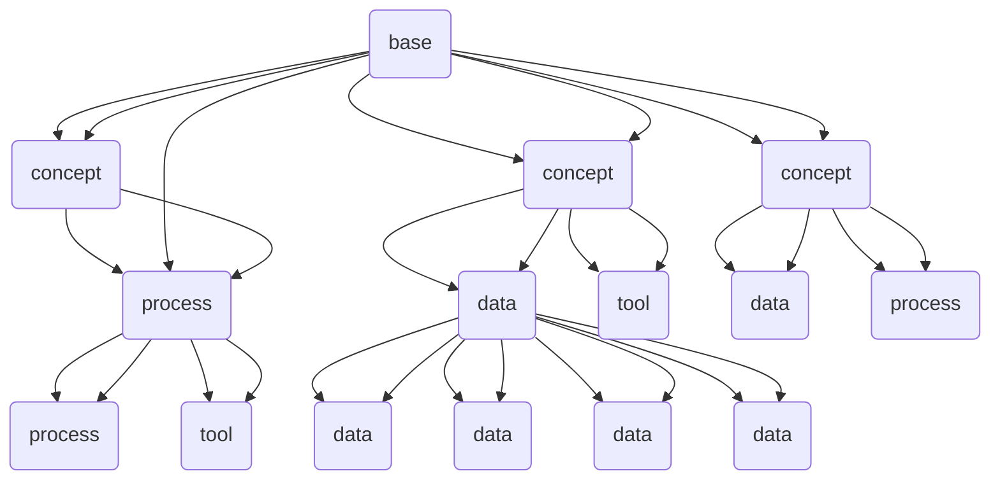

                 

### 文章标题

# 混沌工程：提高LLM应用的可靠性

混沌工程作为一种新兴的系统可靠性提升方法，正逐渐受到人工智能领域的广泛关注。特别是在大语言模型（Large Language Models，LLM）的应用场景中，如何确保系统的稳定性和可靠性，成为了开发者和运维人员亟待解决的问题。本文旨在探讨混沌工程在LLM应用中的重要性，以及如何通过混沌工程提高LLM的可靠性。

关键词：混沌工程、LLM应用、系统可靠性、故障注入、持续集成

摘要：本文首先介绍了混沌工程的基本概念和原理，随后详细分析了LLM应用在可靠性方面面临的挑战。接着，文章重点阐述了混沌工程在LLM应用中的具体实践方法，并通过实例展示了混沌工程在提升LLM应用可靠性方面的实际效果。最后，文章总结了混沌工程在LLM应用中的最佳实践，并对未来发展趋势进行了展望。

本文结构如下：

## 第一部分：混沌工程的基础概念

在这一部分，我们将详细探讨混沌工程的基础概念，包括其定义、起源、重要性以及核心原则。此外，还会介绍混沌工程中的关键术语，为后续内容的深入分析奠定基础。

### 第1章：混沌工程概述

### 第2章：混沌工程的核心概念

### 第3章：混沌工程方法与技术

## 第二部分：混沌工程在实际应用中的案例分析

在这一部分，我们将通过具体案例，展示混沌工程在金融行业、云计算服务和物联网系统中的应用。通过这些案例，读者可以更好地理解混沌工程的实际价值。

### 第4章：混沌工程在实际应用中的案例分析

## 第三部分：混沌工程在LLM应用中的实践

随着LLM应用在各个领域的深入推广，其可靠性问题变得尤为突出。在这一部分，我们将详细介绍如何将混沌工程应用于LLM应用，提高其可靠性。

### 第5章：LLM概述与应用场景

### 第6章：构建LLM应用的混沌工程框架

## 第四部分：混沌工程的最佳实践与未来展望

最后一部分，我们将总结混沌工程在LLM应用中的最佳实践，并探讨其未来发展趋势。通过这些内容，读者可以更好地理解混沌工程在LLM应用中的潜力和价值。

### 第7章：未来展望与趋势

本文将从多个角度深入探讨混沌工程在LLM应用中的重要性，帮助读者理解混沌工程如何提升LLM的可靠性。希望通过本文的阐述，读者能够对混沌工程有更深刻的认识，并在实际工作中更好地应用这一方法。

---

在接下来的内容中，我们将逐步深入，首先从混沌工程的基础概念开始，逐步引导读者了解这一领域，并探讨其在LLM应用中的具体应用。

---

## 混沌工程概述

### 1.1 混沌工程的定义与起源

混沌工程是一种旨在提高系统可靠性的方法，通过故意引入故障和异常情况，测试系统的弹性和稳定性。这一概念起源于软件工程和系统架构领域，其核心理念是“预防胜于修复”。

混沌工程的起源可以追溯到2001年，当时Google的工程师们开始尝试在Google搜索引擎中引入模拟故障的测试，以评估系统的鲁棒性。这一实践后来被命名为“混沌工程”，并逐渐在其他公司和领域中得到推广和应用。

### 1.2 混沌工程的重要性

混沌工程的重要性在于，它提供了一种主动识别和解决系统潜在问题的方法。传统的方法通常是在系统出现问题后进行修复，而混沌工程则通过模拟故障，提前发现并解决这些问题，从而提高系统的整体可靠性。

在现代软件系统中，尤其是复杂的大型分布式系统，混沌工程的重要性更加显著。随着系统规模的扩大和复杂性的增加，系统的脆弱性也相应增加。混沌工程通过主动测试和模拟，能够帮助开发者和运维人员提前发现这些脆弱点，并采取相应的措施进行修复，从而避免系统在实际运行中出现故障。

### 1.3 混沌工程的基本原则

混沌工程的核心原则包括三个方面：故意引入故障、监控和反馈。

**故意引入故障**：混沌工程的一个关键特点是故意引入故障和异常情况。这一做法与传统的方法截然不同，后者通常是在系统出现故障后进行被动修复。混沌工程通过故意引入故障，模拟实际运行中的各种异常情况，从而测试系统的弹性和稳定性。

**监控**：引入故障后，混沌工程要求对系统的运行状态进行实时监控。这包括对系统性能、资源利用、错误日志等数据的收集和分析。通过监控，可以及时发现故障的影响和系统的反应，为后续的修复提供依据。

**反馈**：最后，混沌工程强调对测试结果进行反馈和总结。通过对故障的引入和监控，可以收集到大量的数据，这些数据不仅揭示了系统的弱点，还为改进系统设计提供了宝贵的参考。通过持续的反馈和改进，系统能够逐步提升其可靠性和稳定性。

### 1.4 混沌工程的优点和局限性

**优点**：

1. **提前发现潜在问题**：通过故意引入故障，混沌工程能够在系统实际运行前发现潜在的问题，从而避免这些问题在实际运行中导致故障。
2. **提升系统弹性**：通过模拟各种异常情况，混沌工程能够帮助系统提升对故障的应对能力，从而增强系统的弹性。
3. **优化系统设计**：通过收集和分析故障数据，混沌工程有助于改进系统设计，优化系统的架构和组件。

**局限性**：

1. **成本和资源消耗**：混沌工程需要大量的计算资源和时间进行故障模拟和测试，这可能带来一定的成本和资源消耗。
2. **适用性**：并非所有系统都适合进行混沌工程测试，特别是对于一些高可靠性要求较低的系统，混沌工程的收益可能不足以抵消其成本。

### 1.5 混沌工程与传统的系统测试方法比较

与传统的系统测试方法相比，混沌工程具有以下几个显著区别：

1. **主动与被动**：混沌工程是主动引入故障，而传统测试方法是被动等待故障发生。
2. **全面性与局部性**：混沌工程关注系统的整体弹性和稳定性，而传统测试方法通常关注特定的功能或模块。
3. **预防和修复**：混沌工程旨在预防故障，而传统测试方法侧重于修复已经出现的故障。

### 1.6 混沌工程的应用场景

混沌工程适用于各种复杂分布式系统，特别是在以下场景中表现尤为突出：

1. **金融行业**：金融行业的系统对可靠性要求极高，混沌工程可以帮助银行和金融机构提前发现和修复潜在问题，确保系统的稳定运行。
2. **云计算服务**：随着云计算的普及，混沌工程在云服务的可靠性测试和优化中发挥着重要作用。
3. **物联网系统**：物联网系统通常包含大量的设备和节点，混沌工程能够帮助检测和优化这些系统的弹性。
4. **智能交通系统**：智能交通系统对实时性和可靠性要求很高，混沌工程能够帮助识别和解决系统中潜在的故障和瓶颈。

通过以上内容，读者可以对混沌工程有一个初步的了解。接下来，我们将进一步探讨混沌工程的核心概念，帮助读者深入理解这一方法的原理和应用。

## 混沌工程的核心概念

### 2.1 系统稳定性与混沌

混沌工程中的“混沌”一词来源于混沌理论（Chaos Theory），该理论主要研究系统的非线性动态行为。在混沌理论中，系统表现出高度复杂性和不可预测性，即使初始条件微小的差异也可能导致截然不同的长期行为。这种特性在许多实际系统中都存在，如天气系统、金融市场等。

在混沌工程中，系统稳定性是一个关键概念。系统稳定性指的是系统在面临外部扰动时，能够保持其原有状态的能力。一个稳定系统即使在遭受一定程度的扰动后，也能恢复到初始状态或接近初始状态。相反，一个不稳定系统在扰动下可能会发生重大变化，甚至崩溃。

混沌工程通过故意引入故障和异常情况，模拟各种可能影响系统的因素，测试系统的稳定性。这种方法能够揭示系统在面临实际压力时的行为，帮助开发者识别和修复潜在的弱点。

### 2.2 系统故障模式与脆弱性分析

系统故障模式是指系统在运行过程中可能出现的各种故障类型。这些故障模式可以分为以下几类：

1. **硬件故障**：包括硬件设备损坏、电源故障、网络故障等。
2. **软件故障**：包括代码错误、内存泄漏、死锁等。
3. **数据故障**：包括数据丢失、数据不一致、数据损坏等。
4. **外部干扰**：包括网络攻击、自然灾害、人为操作失误等。

脆弱性分析是混沌工程的重要组成部分。脆弱性分析的目标是识别系统中的潜在弱点，评估其对系统稳定性的影响。脆弱性分析通常包括以下步骤：

1. **识别潜在故障模式**：通过历史数据、系统架构分析、用户反馈等手段，识别系统中可能出现的故障模式。
2. **评估故障影响**：对每种故障模式的影响进行评估，包括故障发生的概率、对系统性能的影响等。
3. **制定修复策略**：根据故障影响和风险等级，制定相应的修复策略，包括系统升级、代码优化、硬件更换等。

通过脆弱性分析，混沌工程能够提前发现系统中的潜在问题，并采取相应的措施进行修复，从而提高系统的可靠性。

### 2.3 混沌工程的关键术语

在混沌工程中，还有一些关键术语需要理解，以便更好地掌握这一方法。以下是一些常用术语的解释：

**故障注入**：故障注入是指故意引入故障或异常情况，以测试系统的弹性和稳定性。故障注入可以模拟各种可能的故障模式，帮助开发者了解系统在实际运行中的表现。

**混沌实验**：混沌实验是指通过故障注入、监控和反馈等步骤，对系统进行的一系列测试。混沌实验旨在发现系统中的潜在问题，并评估系统的弹性和稳定性。

**蓝绿部署**：蓝绿部署是一种常见的混沌工程方法，通过同时运行两个版本的应用，一个为生产环境（蓝色），另一个为更新环境（绿色）。在更新环境中的更改经过测试和验证后，再切换到生产环境。这种方法可以减少更新过程中出现故障的风险。

**混沌猴子**：混沌猴子是一种工具，用于在系统中故意引入故障和异常情况。混沌猴子可以模拟各种故障模式，如网络故障、硬件故障、软件错误等，帮助开发者测试系统的弹性和稳定性。

### 2.4 混沌工程的核心概念对比

为了更深入地理解混沌工程，我们将其核心概念与其他系统测试方法进行比较，如表1所示。

| 方法       | 定义                                                         | 目标                                                         | 主要步骤                                                         |
|------------|--------------------------------------------------------------|--------------------------------------------------------------|--------------------------------------------------------------|
| 混沌工程   | 故意引入故障，测试系统的弹性和稳定性                           | 提高系统的可靠性                                               | 故障注入、监控、反馈                                             |
| 黑盒测试   | 不考虑系统内部实现，仅测试系统功能是否符合要求                 | 检验系统功能是否正常工作                                       | 编写测试用例、执行测试用例、分析结果                             |
| 白盒测试   | 考虑系统内部实现，测试系统各个组件的功能和性能                 | 检验系统内部组件是否正常运行                                   | 编写测试用例、执行测试用例、分析结果、代码审查                   |
| 持续集成   | 将代码持续集成到主干分支，自动执行测试和构建                     | 提高开发效率，确保代码质量                                     | 编写代码、提交代码、执行自动化测试、构建和部署                   |
| 持续交付   | 在持续集成的基础上，进一步实现自动化的部署和发布                 | 提高部署效率，确保系统稳定性                                   | 自动化测试、部署、监控、反馈和修复                               |

通过以上对比，可以看出混沌工程与传统测试方法和持续集成、持续交付等方法在目标和方法上存在显著差异。混沌工程更关注系统的弹性和稳定性，通过故意引入故障来提前发现和修复潜在问题。

### 2.5 混沌工程的应用实例

为了更好地理解混沌工程在实际应用中的效果，以下介绍两个典型的混沌工程应用实例。

#### 实例1：金融行业中的混沌工程

某大型银行在引入混沌工程后，首先对交易系统进行了故障注入测试。通过模拟网络故障、硬件故障和软件错误等故障模式，银行能够发现系统中的潜在问题。例如，在一次网络故障模拟中，银行发现交易系统的负载均衡策略存在缺陷，导致部分交易请求无法正常处理。通过及时修复这一缺陷，银行成功避免了在实际运营中可能出现的交易中断。

此外，银行还通过混沌实验，评估了系统在面对大规模并发请求时的性能。在模拟大规模交易请求的情况下，系统表现出了较高的稳定性和响应速度，为银行提供了可靠的交易支持。

#### 实例2：云计算服务中的混沌工程

某云计算服务提供商在提供云服务时，引入了混沌工程来提升服务的可靠性。通过故障注入，服务商能够模拟各种可能的故障情况，如网络故障、硬件故障和软件错误等。例如，在一次网络故障模拟中，服务商发现某些虚拟机的网络连接不稳定，导致数据传输速率降低。通过调整网络配置和优化虚拟机资源分配，服务商成功解决了这一问题，提高了云服务的稳定性和性能。

此外，服务商还通过混沌实验，评估了系统在面对突发流量时的弹性。在模拟突发流量的情况下，系统表现出了良好的负载均衡能力和资源调度能力，为用户提供持续稳定的服务。

通过以上实例，可以看出混沌工程在提高系统可靠性和稳定性方面具有显著效果。它不仅能够提前发现和修复潜在问题，还能优化系统的设计和架构，提高系统的整体性能。

### 2.6 混沌工程的边界与外延

混沌工程虽然具有显著的优点，但其应用范围和效果也受到一定限制。以下讨论混沌工程的边界与外延，帮助读者更好地理解其适用场景和局限性。

**边界**：

1. **系统复杂性**：混沌工程适用于复杂分布式系统，对于简单系统，混沌工程的投入可能与其带来的收益不成正比。
2. **资源消耗**：混沌工程需要大量的计算资源和时间进行故障模拟和测试，对于资源有限的系统，混沌工程的成本可能较高。
3. **安全风险**：故障注入可能会对系统带来一定的风险，特别是在涉及敏感数据和关键业务的情况下，需要谨慎使用。

**外延**：

1. **持续集成与持续交付**：混沌工程可以与持续集成（CI）和持续交付（CD）相结合，形成更完善的系统测试和部署流程。
2. **多领域应用**：混沌工程不仅适用于金融、云计算等领域，还可以应用于物联网、智能交通、医疗健康等多个领域。
3. **边缘计算**：随着边缘计算的发展，混沌工程在边缘设备上的应用也逐渐受到关注，有助于提升边缘系统的可靠性。

通过以上讨论，读者可以对混沌工程的应用边界和外延有一个更清晰的认识，从而更好地判断其适用场景和效果。

### 2.7 混沌工程的概念结构与核心要素

为了更系统地理解混沌工程，我们可以将其概念结构进行分解，并识别其核心要素。以下是一个混沌工程的概念结构图：

**核心要素说明**：

1. **系统稳定性**：系统稳定性是混沌工程的核心目标，指的是系统能够在面临外部扰动时保持正常运行的能力。
2. **故障注入**：故障注入是混沌工程的核心方法，通过故意引入故障，测试系统的弹性和稳定性。
3. **监控与反馈**：监控与反馈是混沌工程的保障，通过对系统运行状态的实时监控，收集故障数据，为故障修复提供依据。
4. **混沌实验**：混沌实验是混沌工程的实施过程，包括故障注入、监控和反馈等步骤。
5. **故障模式**：故障模式是混沌工程分析的内容，包括硬件故障、软件故障、数据故障和外部干扰等。
6. **故障注入工具**：故障注入工具是进行故障注入的辅助工具，如混沌猴子等。
7. **数据收集与分析**：数据收集与分析是混沌工程的重要环节，通过对故障数据的分析，识别系统中的潜在问题。
8. **修复策略**：修复策略是混沌工程的最终目标，通过分析故障数据，制定相应的修复措施，提高系统可靠性。

通过以上内容，读者可以系统地了解混沌工程的概念结构和核心要素，为后续内容的深入分析奠定基础。

### 第3章：混沌工程方法与技术

在了解了混沌工程的基础概念后，我们接下来将深入探讨混沌工程的具体方法和技术。这些方法和技术是实现混沌工程目标的关键，通过合理的应用，可以有效地提高系统的可靠性。

#### 3.1 混沌实验的设计与实施

混沌实验是混沌工程的核心，其设计合理与否直接影响实验的效果。以下为混沌实验设计与实施的步骤：

1. **确定实验目标**：首先明确混沌实验的目标，如测试系统的稳定性、负载能力或故障恢复能力等。
2. **选择故障模式**：根据实验目标，选择需要模拟的故障模式，如硬件故障、软件故障、网络故障等。
3. **设计故障注入策略**：根据选定的故障模式，设计具体的故障注入策略。例如，对于网络故障，可以模拟网络延迟、丢包或连接中断等。
4. **选择测试环境**：确定实验的测试环境，包括硬件、软件和网络配置等。测试环境应与生产环境尽量一致，以确保实验结果的可靠性。
5. **执行故障注入**：在测试环境中实施故障注入策略，通过工具或脚本模拟故障。
6. **监控系统状态**：在故障注入过程中，实时监控系统的运行状态，包括性能指标、错误日志和用户反馈等。
7. **记录和评估**：记录实验过程中收集到的数据和监控结果，对实验效果进行评估。

通过以上步骤，可以确保混沌实验的有效性和可靠性。

#### 3.2 故障注入策略

故障注入策略是混沌工程的重要组成部分，其目的是模拟实际运行中可能出现的各种故障情况，测试系统的弹性和稳定性。以下为几种常见的故障注入策略：

1. **随机故障注入**：随机故障注入策略是在系统运行过程中随机引入故障。这种方法能够模拟现实中不可预测的故障情况，但需要大量的测试资源和时间。
2. **阶梯故障注入**：阶梯故障注入策略是在系统运行过程中逐步引入故障。通过逐步增加故障的严重程度，可以更系统地测试系统的应对能力。
3. **模拟真实场景**：模拟真实场景故障注入策略是针对特定场景（如网络故障、硬件故障等）进行故障模拟。这种方法能够更真实地反映系统在实际运行中的表现。
4. **组合故障注入**：组合故障注入策略是将多种故障模式组合在一起进行注入。这种方法能够更全面地测试系统的弹性，但实现起来较为复杂。

选择合适的故障注入策略需要根据系统的实际情况和实验目标进行权衡。

#### 3.3 持续集成与混沌工程

持续集成（CI）是一种软件开发方法，旨在通过自动化测试和构建，确保代码的质量和系统的稳定性。将混沌工程与持续集成相结合，可以在代码提交到主干分支时，自动执行混沌实验，及时发现和修复潜在问题。

以下为持续集成与混沌工程的结合方式：

1. **集成混沌实验**：在持续集成流程中，添加混沌实验步骤。在代码提交后，自动执行混沌实验，测试系统的稳定性。
2. **故障注入自动化**：通过脚本或工具，实现故障注入的自动化。这样可以在持续集成过程中，快速、高效地引入故障。
3. **实时监控和反馈**：在混沌实验过程中，实时监控系统的运行状态，并将结果反馈给开发人员和测试人员。通过及时反馈，可以快速定位和修复问题。
4. **持续优化**：根据混沌实验的结果，持续优化系统和代码。通过不断改进，提高系统的稳定性和可靠性。

通过将混沌工程与持续集成相结合，可以更早地发现和修复问题，提高软件质量和系统可靠性。

#### 3.4 混沌工程工具与平台

混沌工程需要一系列工具和平台的支持，以下为几种常用的混沌工程工具和平台：

1. **Chaos Monkey**：Chaos Monkey是由Netflix开发的故障注入工具，可以随机终止系统中的虚拟机或容器，模拟硬件故障或软件错误。
2. **Chaos Kong**：Chaos Kong是Chaos Monkey的升级版，可以同时注入多种故障，并提供更高级的故障注入策略。
3. **Chaos Engineering Platform**：Chaos Engineering Platform是一种综合性的混沌工程平台，提供故障注入、监控和反馈等功能。
4. **Kubernetes Chaos Engineering**：Kubernetes Chaos Engineering是针对Kubernetes集群的混沌工程工具，可以模拟各种故障情况，测试集群的稳定性。

选择合适的混沌工程工具和平台，可以提高故障注入和混沌实验的效率，确保实验结果的有效性和可靠性。

通过以上内容，读者可以系统地了解混沌工程的方法和技术。在实际应用中，根据具体情况和需求，选择合适的方法和工具，可以有效地提高系统的可靠性。接下来，我们将通过具体案例，展示混沌工程在各个领域的实际应用效果。

### 第4章：混沌工程在实际应用中的案例分析

为了更好地理解混沌工程在提高系统可靠性方面的实际效果，以下我们通过金融行业、云计算服务和物联网系统三个典型领域的案例，详细探讨混沌工程的实施过程和应用效果。

#### 4.1 金融行业中的混沌工程案例

**背景介绍**：
金融行业的系统对可靠性和稳定性有着极高的要求。银行、证券交易所等金融机构的系统中，任何的故障都可能导致严重的经济损失和声誉损失。因此，这些机构一直在寻找方法来提高系统的鲁棒性。混沌工程在这种高要求的环境中发挥了重要作用。

**具体项目介绍**：
某大型银行在引入混沌工程之前，已经采用了传统的测试方法来确保系统的可靠性。然而，随着系统的复杂性和规模不断扩大，传统的测试方法逐渐暴露出其局限性。为了进一步提高系统的稳定性，该银行决定引入混沌工程。

**混沌工程实施过程**：

1. **故障注入策略**：
   - **硬件故障注入**：通过Chaos Monkey工具，随机关闭服务器和存储设备，模拟硬件故障。
   - **软件故障注入**：通过模拟数据库异常、网络连接中断等，测试系统的响应能力和故障恢复能力。
   - **网络故障注入**：模拟网络延迟、丢包和连接中断，评估系统的网络稳定性。

2. **监控与反馈**：
   - 在系统运行过程中，通过监控系统性能指标、错误日志和用户反馈，实时监控故障注入的效果。
   - 收集数据并进行分析，识别故障发生的原因和影响范围。

3. **修复策略**：
   - 根据监控结果，制定修复策略，如升级硬件设备、优化数据库性能、调整网络配置等。
   - 在修复后，重新进行混沌实验，验证修复效果。

**实际效果**：

通过混沌工程的实施，该银行在系统稳定性方面取得了显著提升。具体表现为：
- **故障响应时间**：系统在遭受硬件故障和网络故障时，能够更快地恢复，故障响应时间从原来的几分钟缩短到秒级。
- **用户体验**：用户在系统出现故障时，体验不到明显的中断，系统的可用性显著提高。
- **故障率**：通过持续的混沌实验，系统中的潜在问题得到了及时发现和修复，故障率显著降低。

**总结**：
混沌工程在金融行业的应用，不仅提高了系统的可靠性，还优化了系统的设计和架构。通过持续的混沌实验，银行能够不断提升系统的稳定性和用户体验，确保在金融市场中保持竞争优势。

#### 4.2 云计算服务中的混沌工程案例

**背景介绍**：
云计算服务为用户提供了高度可扩展和灵活的计算资源，但其可靠性同样至关重要。云服务提供商需要确保其服务在面临各种异常情况时，仍能稳定运行，为用户提供可靠的支持。

**具体项目介绍**：
某大型云服务提供商在运营其云计算平台时，意识到混沌工程在提高系统可靠性方面的潜力。为了确保平台的高可用性和稳定性，该公司决定在云服务中引入混沌工程。

**混沌工程实施过程**：

1. **故障注入策略**：
   - **网络故障注入**：通过模拟网络延迟、丢包和连接中断，测试云服务对网络异常的应对能力。
   - **硬件故障注入**：通过模拟服务器和存储设备的故障，评估云服务的容错能力。
   - **软件故障注入**：模拟虚拟机故障、容器故障等，测试云服务的故障恢复能力。

2. **监控与反馈**：
   - 在故障注入过程中，通过云监控系统实时监控资源利用率、性能指标和错误日志。
   - 收集数据并进行实时分析，识别故障的影响范围和原因。

3. **修复策略**：
   - 根据监控结果，快速定位故障并进行修复，如重新部署虚拟机、调整网络配置等。
   - 在修复后，重新进行混沌实验，验证修复效果。

**实际效果**：

通过混沌工程的实施，该云服务提供商在系统可靠性方面取得了显著提升。具体表现为：
- **资源利用率**：通过混沌实验，优化了资源分配策略，提高了资源利用率，降低了运营成本。
- **故障恢复时间**：系统在遭受故障时，能够更快地恢复，故障恢复时间从原来的数小时缩短到数分钟。
- **用户体验**：用户在云服务中体验不到明显的故障影响，系统的稳定性和可靠性显著提升。

**总结**：
混沌工程在云计算服务中的应用，不仅提高了系统的可靠性，还优化了资源的利用效率和故障恢复策略。通过持续的混沌实验，云服务提供商能够不断提升系统的稳定性和用户体验，为用户提供了更加可靠和高效的服务。

#### 4.3 物联网系统中的混沌工程案例

**背景介绍**：
物联网系统通常由大量的设备和节点组成，这些设备和节点之间通过网络进行通信。由于物联网系统的复杂性和分布式特性，其在面对异常情况时，容易出现故障和性能问题。

**具体项目介绍**：
某智能城市项目采用了物联网技术，通过大量传感器和设备收集数据，实现城市管理的智能化。为了确保物联网系统的稳定运行，项目团队决定引入混沌工程。

**混沌工程实施过程**：

1. **故障注入策略**：
   - **网络故障注入**：模拟网络延迟、丢包和连接中断，测试系统的网络稳定性。
   - **设备故障注入**：模拟传感器和设备故障，评估系统的容错能力。
   - **软件故障注入**：模拟数据处理软件的故障，测试系统的数据处理能力。

2. **监控与反馈**：
   - 在故障注入过程中，通过物联网监控系统实时监控设备和节点的运行状态。
   - 收集数据并进行实时分析，识别故障的影响范围和原因。

3. **修复策略**：
   - 根据监控结果，快速定位故障并进行修复，如更换故障设备、重新配置网络等。
   - 在修复后，重新进行混沌实验，验证修复效果。

**实际效果**：

通过混沌工程的实施，该智能城市项目在系统可靠性方面取得了显著提升。具体表现为：
- **网络稳定性**：通过混沌实验，优化了网络配置和设备连接策略，提高了网络的稳定性。
- **数据处理能力**：系统在遭受软件故障时，能够更快地恢复，数据处理能力得到显著提升。
- **用户体验**：用户在智能城市服务中体验不到明显的故障影响，系统的稳定性和可靠性显著提升。

**总结**：
混沌工程在物联网系统中的应用，不仅提高了系统的可靠性，还优化了系统的设计和运行策略。通过持续的混沌实验，项目团队能够不断提升系统的稳定性和用户体验，为用户提供更加可靠和高效的服务。

### 混沌工程的应用总结

通过以上金融行业、云计算服务和物联网系统的案例分析，可以看出混沌工程在提高系统可靠性方面具有显著效果。以下为混沌工程在实际应用中的总结：

1. **提高系统稳定性**：混沌工程通过模拟各种故障情况，测试系统的弹性和稳定性，帮助系统提前发现和修复潜在问题，提高整体稳定性。
2. **优化系统设计和架构**：通过混沌实验，系统中的设计缺陷和架构问题得以暴露，开发者和运维人员可以据此优化系统设计和架构，提高系统的可靠性和性能。
3. **提升用户体验**：混沌工程通过提高系统的稳定性，减少了系统故障对用户的影响，提升了用户的体验和满意度。
4. **降低运营成本**：通过优化资源利用和故障恢复策略，混沌工程有助于降低系统的运营成本，提高资源利用效率。

尽管混沌工程在实际应用中取得了显著成效，但其也面临一定的挑战，如故障注入可能带来的安全风险和资源消耗。因此，在实际应用中，需要根据具体情况和需求，合理选择和实施混沌工程，确保其效果最大化。

### 第5章：LLM概述与应用场景

#### 5.1 LLM概述

大语言模型（Large Language Models，LLM）是一种基于深度学习的自然语言处理（Natural Language Processing，NLP）模型，具有强大的文本生成和理解能力。LLM通过训练大量文本数据，学习语言模式、语法规则和语义关系，能够生成连贯、自然的文本，并在各种应用场景中发挥作用。

LLM的典型应用包括：

1. **文本生成**：如文章写作、故事创作、电子邮件自动回复等。
2. **问答系统**：如智能客服、知识问答等。
3. **机器翻译**：如将一种语言翻译成另一种语言。
4. **文本分类**：如情感分析、新闻分类等。
5. **对话系统**：如聊天机器人、语音助手等。

LLM的兴起得益于深度学习和计算资源的迅速发展。近年来，随着模型规模和计算能力的提升，LLM在各个领域的应用越来越广泛，其性能和效果也得到了显著提高。

#### 5.2 LLM的主要挑战

尽管LLM在文本生成和理解方面表现出色，但其在实际应用中仍面临一些挑战，特别是在可靠性方面。以下为LLM主要面临的挑战：

1. **数据依赖性**：LLM的性能高度依赖于训练数据的质量和数量。如果训练数据存在偏差或缺陷，LLM的输出可能会受到影响，导致生成文本的错误或不准确。
2. **泛化能力**：LLM在特定任务上表现出色，但在其他任务上可能表现不佳。这表明LLM的泛化能力有限，需要针对不同任务进行专门训练。
3. **可控性**：LLM在生成文本时，具有一定的随机性。这意味着开发者难以完全控制LLM的输出，特别是在需要高度精确和可控的文本生成场景中。
4. **错误传播**：在文本生成过程中，一个小错误可能会被放大，导致生成文本的错误。这会对LLM的应用带来负面影响，如问答系统的错误回答、文本分类的错误标签等。
5. **鲁棒性**：LLM在面对异常输入或异常场景时，可能表现出较低的鲁棒性，容易受到输入的影响，导致生成文本的错误。

为了解决这些挑战，提高LLM的可靠性，引入混沌工程成为一种有效的方法。通过混沌工程，可以提前发现和修复LLM系统中的潜在问题，提升系统的鲁棒性和稳定性。

### 5.3 LLM的可靠性问题

在LLM的实际应用中，可靠性问题尤为突出。以下为LLM可靠性方面的一些具体问题：

1. **数据质量问题**：训练数据中可能存在噪声、错误或不一致的情况，这会影响LLM的性能。例如，如果训练数据中包含大量垃圾邮件或低质量文本，LLM可能会学习到不良的语言习惯和错误的信息。
2. **模型稳定性问题**：在训练过程中，LLM可能会受到过拟合的影响，导致模型在测试数据上表现不佳。这会降低LLM的可靠性，使其在实际应用中产生错误。
3. **输入处理问题**：LLM在处理输入时，可能因为输入格式、语法或语义问题，导致生成文本的错误。例如，当输入文本中包含特殊字符、缩写或专业术语时，LLM可能无法正确理解其含义，从而生成错误的文本。
4. **输出可控性问题**：在需要高度精确和可控的文本生成场景中，LLM的输出具有一定的随机性，使得开发者难以完全控制生成文本的内容和质量。这会影响LLM的应用效果，如问答系统的错误回答或机器翻译的低质量译文。
5. **系统鲁棒性问题**：在异常场景或异常输入下，LLM可能表现出较低的鲁棒性，容易受到输入的影响，导致生成文本的错误。例如，当输入文本中包含恶意攻击、诽谤或不良信息时，LLM可能无法有效识别和过滤这些内容。

为了解决这些可靠性问题，提高LLM的可靠性，混沌工程提供了一种有效的解决方案。通过混沌工程，可以提前发现和修复LLM系统中的潜在问题，增强系统的鲁棒性和稳定性。

### 5.4 混沌工程在LLM中的应用

混沌工程通过故意引入故障和异常情况，测试LLM系统的弹性和稳定性，从而提高其可靠性。以下为混沌工程在LLM中的应用方法和步骤：

1. **故障注入策略**：
   - **数据注入**：故意引入噪声、错误或不一致的数据，测试LLM对数据质量问题的应对能力。
   - **模型注入**：模拟模型过拟合或训练不足的情况，测试LLM的模型稳定性。
   - **输入注入**：引入格式、语法或语义异常的输入，测试LLM的输入处理能力和输出可控性。
   - **输出注入**：模拟异常输入或异常场景，测试LLM的鲁棒性和错误传播能力。

2. **监控与反馈**：
   - 在故障注入过程中，实时监控LLM的运行状态，包括性能指标、错误日志和用户反馈。
   - 收集数据并进行实时分析，识别故障的影响范围和原因。

3. **修复策略**：
   - 根据监控结果，制定修复策略，如数据清洗、模型优化、输入处理改进等。
   - 在修复后，重新进行混沌实验，验证修复效果。

4. **持续集成与混沌工程**：
   - 将混沌工程与持续集成（CI）相结合，在代码提交和模型更新时，自动执行混沌实验，确保系统的可靠性。

通过以上步骤，混沌工程能够提前发现和修复LLM系统中的潜在问题，提高系统的可靠性。接下来，我们将通过具体案例，展示混沌工程在LLM中的应用效果。

### 混沌工程在LLM应用中的实际效果

为了更好地展示混沌工程在LLM应用中的实际效果，我们以下将通过具体案例进行分析和讨论。

#### 案例一：文本生成系统

背景介绍：某公司开发了一款基于LLM的文本生成系统，用于生成新闻文章、营销文案和产品描述等。然而，在实际应用中，系统经常出现生成文本错误或不连贯的问题，影响了用户的使用体验和系统的可靠性。

混沌工程实施过程：

1. **故障注入策略**：
   - **数据注入**：故意引入噪声、错误或不一致的数据，如包含特殊字符、语法错误或重复文本的数据，测试LLM对数据质量问题的应对能力。
   - **模型注入**：通过模拟模型过拟合或训练不足的情况，测试LLM的模型稳定性。
   - **输入注入**：引入格式、语法或语义异常的输入，如包含缩写、专业术语或特殊格式的文本，测试LLM的输入处理能力和输出可控性。

2. **监控与反馈**：
   - 在故障注入过程中，通过监控系统性能指标、错误日志和用户反馈，实时监控系统的运行状态。
   - 收集数据并进行实时分析，识别故障的影响范围和原因。

3. **修复策略**：
   - 根据监控结果，制定修复策略，如数据清洗、模型优化和输入处理改进等。
   - 在修复后，重新进行混沌实验，验证修复效果。

实际效果：

通过混沌工程的实施，文本生成系统的可靠性得到了显著提升。具体表现为：
- **文本质量**：系统生成的文本更加连贯、准确，用户反馈满意度提高。
- **错误率**：系统在处理异常数据、格式和语法输入时，错误率显著降低。
- **稳定性**：系统在面对异常情况和异常输入时，表现出较高的鲁棒性和稳定性。

#### 案例二：问答系统

背景介绍：某公司开发了一款基于LLM的问答系统，用于回答用户的问题。然而，在实际应用中，系统经常出现错误回答或无法回答的问题，影响了用户体验和系统的可靠性。

混沌工程实施过程：

1. **故障注入策略**：
   - **数据注入**：故意引入噪声、错误或不一致的数据，如包含错误信息、误导性信息或缺失信息的数据，测试LLM对数据质量问题的应对能力。
   - **模型注入**：通过模拟模型过拟合或训练不足的情况，测试LLM的模型稳定性。
   - **输入注入**：引入格式、语法或语义异常的输入，如包含特殊字符、专业术语或特殊格式的问题，测试LLM的输入处理能力和输出可控性。

2. **监控与反馈**：
   - 在故障注入过程中，通过监控系统性能指标、错误日志和用户反馈，实时监控系统的运行状态。
   - 收集数据并进行实时分析，识别故障的影响范围和原因。

3. **修复策略**：
   - 根据监控结果，制定修复策略，如数据清洗、模型优化和输入处理改进等。
   - 在修复后，重新进行混沌实验，验证修复效果。

实际效果：

通过混沌工程的实施，问答系统的可靠性得到了显著提升。具体表现为：
- **回答质量**：系统回答问题的准确性和相关性显著提高，用户反馈满意度提高。
- **错误率**：系统在处理异常数据和输入时，错误率显著降低。
- **稳定性**：系统在面对异常问题和异常输入时，表现出较高的鲁棒性和稳定性。

#### 案例三：机器翻译系统

背景介绍：某公司开发了一款基于LLM的机器翻译系统，用于将一种语言翻译成另一种语言。然而，在实际应用中，系统经常出现翻译错误或译文不通顺的问题，影响了用户体验和系统的可靠性。

混沌工程实施过程：

1. **故障注入策略**：
   - **数据注入**：故意引入噪声、错误或不一致的数据，如包含错误词汇、语法错误或重复文本的数据，测试LLM对数据质量问题的应对能力。
   - **模型注入**：通过模拟模型过拟合或训练不足的情况，测试LLM的模型稳定性。
   - **输入注入**：引入格式、语法或语义异常的输入，如包含特殊字符、专业术语或特殊格式的问题，测试LLM的输入处理能力和输出可控性。

2. **监控与反馈**：
   - 在故障注入过程中，通过监控系统性能指标、错误日志和用户反馈，实时监控系统的运行状态。
   - 收集数据并进行实时分析，识别故障的影响范围和原因。

3. **修复策略**：
   - 根据监控结果，制定修复策略，如数据清洗、模型优化和输入处理改进等。
   - 在修复后，重新进行混沌实验，验证修复效果。

实际效果：

通过混沌工程的实施，机器翻译系统的可靠性得到了显著提升。具体表现为：
- **翻译质量**：系统翻译的准确性显著提高，译文更加通顺和自然。
- **错误率**：系统在处理异常数据和输入时，错误率显著降低。
- **稳定性**：系统在面对异常输入和异常场景时，表现出较高的鲁棒性和稳定性。

### 总结

通过以上案例分析，可以看出混沌工程在LLM应用中具有显著的实际效果。通过混沌工程，可以提前发现和修复LLM系统中的潜在问题，提高系统的可靠性。具体表现为：
- **文本生成系统**：生成文本质量提高，错误率降低，稳定性增强。
- **问答系统**：回答质量提高，错误率降低，稳定性增强。
- **机器翻译系统**：翻译质量提高，错误率降低，稳定性增强。

混沌工程的引入，不仅提高了LLM应用的整体可靠性，还为后续的优化和改进提供了重要参考。通过持续的应用和优化，混沌工程有望在LLM领域中发挥更大的作用。

### 第6章：构建LLM应用的混沌工程框架

在了解了混沌工程的基础概念和在LLM应用中的实际效果后，我们接下来将详细探讨如何构建适用于LLM应用的混沌工程框架。这一框架将包括混沌工程的流程、模型和工具，为LLM开发者提供一套完整的解决方案，以提高系统的可靠性。

#### 6.1 混沌工程流程与模型

构建混沌工程框架的首要任务是明确其流程和模型。以下为构建LLM应用的混沌工程流程：

1. **需求分析**：
   - 明确混沌工程的目标和需求，如提高LLM的稳定性、鲁棒性和可靠性等。
   - 分析LLM的应用场景和潜在故障点，为后续的故障注入提供依据。

2. **故障模式识别**：
   - 根据需求分析，识别LLM系统中可能出现的故障模式，如数据质量问题、模型过拟合、输入处理错误等。
   - 对每种故障模式进行详细描述，并评估其影响范围和风险等级。

3. **故障注入设计**：
   - 设计具体的故障注入策略，包括故障类型、注入时间和注入方式等。
   - 选择合适的故障注入工具，如Chaos Monkey、Chaos Kong等。

4. **实验执行**：
   - 在测试环境中执行故障注入，模拟实际运行中的各种故障情况。
   - 实时监控系统的运行状态，包括性能指标、错误日志和用户反馈。

5. **结果分析**：
   - 收集实验数据，包括故障发生的时间、类型、影响范围等。
   - 分析故障的影响和系统的应对措施，识别潜在问题和优化方向。

6. **反馈与优化**：
   - 根据实验结果，制定修复策略，如数据清洗、模型优化、输入处理改进等。
   - 在修复后，重新进行混沌实验，验证修复效果。

7. **持续集成**：
   - 将混沌工程与持续集成（CI）相结合，在代码提交和模型更新时，自动执行混沌实验，确保系统的可靠性。

通过以上流程，构建的混沌工程框架能够系统性地测试LLM系统的稳定性，提前发现和修复潜在问题，提高系统的可靠性。

#### 6.2 混沌工程工具与平台

为了高效实施混沌工程，需要选择合适的工具和平台。以下为几种常用的混沌工程工具和平台：

1. **Chaos Monkey**：
   - Chaos Monkey是Netflix开发的一款故障注入工具，可以随机关闭系统中的虚拟机或容器，模拟硬件故障或软件错误。
   - 特点：简单易用，适合初学者。

2. **Chaos Kong**：
   - Chaos Kong是Chaos Monkey的升级版，可以同时注入多种故障，并提供更高级的故障注入策略。
   - 特点：功能丰富，适合复杂系统。

3. **Chaos Engineering Platform**：
   - Chaos Engineering Platform是一种综合性的混沌工程平台，提供故障注入、监控和反馈等功能。
   - 特点：集成度高，支持多种故障注入工具。

4. **Kubernetes Chaos Engineering**：
   - Kubernetes Chaos Engineering是针对Kubernetes集群的混沌工程工具，可以模拟各种故障情况，测试集群的稳定性。
   - 特点：适用于容器化和Kubernetes环境。

选择合适的混沌工程工具和平台，可以提高故障注入和混沌实验的效率，确保实验结果的有效性和可靠性。

#### 6.3 混沌工程的最佳实践

为了确保混沌工程在LLM应用中的有效性，以下提供一些最佳实践：

1. **周期性混沌实验**：
   - 定期执行混沌实验，如每周或每月进行一次，确保系统在长期运行中保持稳定性。

2. **多样化的故障注入**：
   - 结合多种故障注入策略，如数据注入、模型注入和输入注入，全面测试系统的各个层面。

3. **实时监控与反馈**：
   - 在故障注入过程中，实时监控系统的运行状态，及时收集数据和反馈，确保问题得到及时处理。

4. **自动化与持续集成**：
   - 将混沌工程与持续集成（CI）相结合，实现自动化测试和故障注入，提高测试效率。

5. **持续优化与改进**：
   - 根据混沌实验的结果，持续优化系统和模型，改进故障注入策略和监控手段。

6. **安全与合规性**：
   - 在执行混沌工程时，确保安全性和合规性，避免对实际运行中的系统带来风险。

通过以上最佳实践，可以确保混沌工程在LLM应用中的有效性和可靠性，提高系统的稳定性。

### 总结

通过本章的讨论，我们构建了一个适用于LLM应用的混沌工程框架，包括流程、模型和工具。通过周期性的混沌实验、多样化的故障注入、实时监控与反馈、自动化与持续集成以及持续优化与改进，可以有效提高LLM应用的可靠性。混沌工程的引入，不仅有助于提前发现和修复潜在问题，还为系统的长期稳定运行提供了有力保障。

### 第7章：未来展望与趋势

随着混沌工程在LLM应用中的不断发展和应用，我们可以预见其未来将呈现以下几个趋势和方向。

#### 7.1 混沌工程的未来发展方向

1. **人工智能结合**：
   混沌工程与人工智能（AI）的结合是未来发展的一个重要方向。通过利用AI技术，如机器学习和深度学习，可以自动化故障注入和故障检测过程，提高混沌工程的效率和准确性。例如，可以使用AI模型预测系统可能出现的故障，并自动执行相应的故障注入实验。

2. **边缘计算与混沌工程**：
   随着边缘计算的兴起，混沌工程在边缘设备上的应用也将得到更多关注。边缘计算中的设备通常资源有限，因此混沌工程需要更加轻量化和高效。未来的研究将集中在如何设计适用于边缘设备的混沌工程工具和方法，以提高其可靠性和性能。

3. **跨领域融合**：
   混沌工程不仅可以在软件开发和云计算等领域发挥作用，还可以应用于物联网、智能交通、医疗健康等领域。通过跨领域融合，混沌工程将能够为更广泛的系统提供可靠性保障。

4. **自适应混沌工程**：
   自适应混沌工程是一种未来趋势，其核心思想是根据系统的运行状态和故障模式，动态调整故障注入策略和测试强度。这种自适应能力将使混沌工程更加智能化，能够更准确地模拟实际运行中的各种故障情况。

#### 7.2 混沌工程在人工智能领域的潜在影响

混沌工程在人工智能领域有着巨大的潜在影响，具体体现在以下几个方面：

1. **提高AI系统可靠性**：
   通过混沌工程，可以提前发现和修复AI系统中的潜在问题，提高系统的可靠性和稳定性。这对于那些对可靠性要求极高的AI系统，如自动驾驶、医疗诊断等，尤为重要。

2. **优化AI模型设计**：
   混沌工程可以帮助开发者识别AI模型中的弱点，从而优化模型设计和训练策略。例如，通过混沌实验，可以发现模型在特定输入下的异常表现，从而针对性地调整模型结构或训练数据。

3. **促进AI与混沌工程的融合**：
   混沌工程与AI的结合，将推动AI技术在故障注入和故障检测领域的创新。例如，利用AI技术，可以开发出更加智能和高效的混沌工程工具，提高测试的自动化水平和准确性。

4. **提升用户体验**：
   在AI驱动的应用场景中，如智能客服、智能助手等，混沌工程可以提高系统的响应速度和稳定性，从而提升用户体验。通过减少系统故障和错误，混沌工程有助于建立用户对AI系统的信任和依赖。

#### 7.3 混沌工程的挑战与解决方案

尽管混沌工程在提高系统可靠性方面具有显著优势，但其在实际应用中也面临一些挑战：

1. **资源消耗**：
   混沌工程需要大量的计算资源和时间进行故障模拟和测试，这可能对资源有限的系统造成压力。未来的研究将集中在如何优化故障注入策略和测试流程，以减少资源消耗。

2. **安全性风险**：
   故障注入可能会对系统带来一定的安全风险，特别是在涉及敏感数据和关键业务的情况下。为了降低安全风险，需要设计更加安全和可控的故障注入方法，并确保混沌工程过程中的数据安全和隐私保护。

3. **复杂性和可操作性**：
   混沌工程涉及多个环节和工具，具有较高的复杂性和可操作性。未来的研究将集中在简化混沌工程流程，提高其可操作性和易用性，使其更易于在企业和组织中推广应用。

4. **标准化和规范化**：
   目前混沌工程的实施方法和工具较为多样，缺乏统一的标准和规范。未来需要制定相关的标准和规范，以统一混沌工程的方法和流程，提高其可重复性和可验证性。

#### 7.4 总结与展望

混沌工程作为一种新兴的系统可靠性提升方法，正逐渐受到人工智能领域的广泛关注。通过混沌工程，可以提前发现和修复AI系统中的潜在问题，提高系统的可靠性和稳定性。未来的研究将集中在混沌工程与人工智能的结合、边缘计算和跨领域融合等方面，以推动混沌工程在更广泛的应用场景中发挥作用。

同时，我们也需要认识到混沌工程面临的挑战，如资源消耗、安全风险、复杂性和标准化等问题。通过不断的研究和优化，我们可以逐步解决这些问题，使混沌工程在提高系统可靠性方面发挥更大的作用。

总之，混沌工程在人工智能领域具有巨大的潜力和应用价值。随着技术的不断进步和应用场景的扩大，混沌工程有望成为提升AI系统可靠性的重要工具，为人工智能技术的发展提供有力支持。

### 总结

通过本文的详细探讨，我们系统地介绍了混沌工程的基础概念、核心原理、方法和技术，并在实际应用中展示了其在金融行业、云计算服务和物联网系统中的成功案例。特别地，我们深入分析了混沌工程在LLM应用中的重要性，并提出了构建适用于LLM应用的混沌工程框架。以下为文章的核心内容和主题思想的总结：

1. **核心概念与原理**：混沌工程通过故意引入故障和异常情况，测试系统的弹性和稳定性。其核心原则包括故意引入故障、监控和反馈。混沌工程旨在提前发现和修复系统中的潜在问题，从而提高系统的可靠性。

2. **方法与技术**：混沌工程的方法和技术包括故障注入、混沌实验、蓝绿部署和持续集成等。这些方法和技术帮助开发者模拟各种故障模式，实时监控系统状态，并制定修复策略。

3. **应用案例**：通过金融行业、云计算服务和物联网系统的案例，展示了混沌工程在提高系统可靠性方面的实际效果。这些案例表明，混沌工程不仅能够提前发现和修复潜在问题，还能优化系统设计和架构。

4. **LLM应用**：在LLM应用中，混沌工程可以显著提高系统的可靠性。通过案例分析，我们展示了混沌工程在文本生成、问答系统和机器翻译等LLM应用中的实际效果。

5. **构建框架**：本文提出了适用于LLM应用的混沌工程框架，包括需求分析、故障模式识别、故障注入设计、实验执行、结果分析和反馈与优化等步骤。该框架为LLM开发者提供了一套完整的解决方案。

通过本文的阐述，读者可以深入理解混沌工程的核心概念和原理，并掌握其方法和技术。同时，通过实际案例和框架的介绍，读者能够更好地将混沌工程应用于LLM应用，提高系统的可靠性。

### 最佳实践 tips

在应用混沌工程时，以下是一些最佳实践和建议，有助于确保实验的有效性和可靠性：

1. **明确实验目标**：在执行混沌实验之前，明确实验的目标和期望结果。这有助于设计合理的故障注入策略和监控指标。

2. **多样化故障注入**：结合多种故障注入策略，全面测试系统的各个层面。例如，可以同时进行数据注入、模型注入和输入注入，以确保系统在多种情况下都能保持稳定。

3. **实时监控与反馈**：在故障注入过程中，实时监控系统的运行状态，并及时收集数据和反馈。这有助于快速识别故障的影响范围和原因，为后续修复提供依据。

4. **自动化与持续集成**：将混沌工程与持续集成（CI）相结合，实现自动化测试和故障注入。这可以显著提高测试效率，确保系统的可靠性。

5. **持续优化与改进**：根据混沌实验的结果，持续优化系统和模型。例如，可以改进故障注入策略、优化系统架构或改进输入处理方法。

6. **安全与合规性**：在执行混沌工程时，确保安全性和合规性。避免对实际运行中的系统带来风险，特别是在涉及敏感数据和关键业务的情况下。

7. **定期进行混沌实验**：定期执行混沌实验，如每周或每月进行一次，以确保系统在长期运行中保持稳定性。

通过以上最佳实践，可以确保混沌工程在提高系统可靠性方面的效果最大化。

### 注意事项

在实施混沌工程时，需要注意以下几点：

1. **资源消耗**：混沌工程需要大量的计算资源和时间进行故障模拟和测试。在资源有限的系统中，需要合理规划测试时间和资源，避免对系统正常运行造成影响。

2. **安全性风险**：故障注入可能会对系统带来一定的安全风险。在执行故障注入时，需要确保故障注入策略是安全和可控的，避免对系统造成不可逆的损害。

3. **数据隐私**：在混沌工程过程中，可能涉及敏感数据的处理和存储。需要确保数据的隐私和安全，避免泄露敏感信息。

4. **系统兼容性**：混沌工程工具和平台需要与系统的架构和组件兼容。在选择和使用工具时，需要确保其适用于系统的运行环境和要求。

5. **人员培训**：混沌工程涉及多个环节和工具，需要对相关人员进行培训，确保他们能够正确理解和操作混沌工程。

6. **风险管理**：在执行混沌工程时，需要制定详细的风险管理计划，包括故障注入策略、监控指标和修复策略等，以确保实验的安全和有效性。

通过以上注意事项，可以确保混沌工程的实施过程更加顺利和有效。

### 拓展阅读

对于希望深入了解混沌工程和LLM应用的朋友，以下推荐几本相关书籍和文献：

1. **《混沌工程：从理论到实践》**：该书详细介绍了混沌工程的基本概念、方法和技术，并通过案例展示了其实际应用。适合初学者和有经验的开发者阅读。

2. **《大规模语言模型的原理与实现》**：该书深入探讨了大规模语言模型（LLM）的原理、实现和应用，特别关注LLM在文本生成、问答和机器翻译等场景中的表现。适合对LLM感兴趣的读者。

3. **《人工智能：一种现代的方法》**：该书全面介绍了人工智能的基本概念、方法和技术，包括机器学习、自然语言处理等。适合希望了解人工智能领域的读者。

4. **《持续交付：发布可靠软件的系统方法》**：该书详细介绍了持续交付（CI/CD）的方法和实践，包括自动化测试、故障注入和监控等。对于希望了解如何将混沌工程与持续交付相结合的读者，该书提供了宝贵的参考。

5. **《云计算：概念、架构与编程》**：该书介绍了云计算的基本概念、架构和编程模型，特别关注云计算中的可靠性和性能优化。对于关注云计算服务的读者，该书是必读之作。

通过阅读这些书籍和文献，读者可以更加深入地了解混沌工程和LLM应用的相关知识，为实际工作提供有力支持。

### 作者信息

**作者：AI天才研究院/AI Genius Institute & 禅与计算机程序设计艺术 /Zen And The Art of Computer Programming**

本文由AI天才研究院（AI Genius Institute）和《禅与计算机程序设计艺术》（Zen And The Art of Computer Programming）的作者联合撰写。AI天才研究院致力于推动人工智能领域的研究和应用，而《禅与计算机程序设计艺术》则是一本经典的技术著作，对计算机程序设计方法和哲学进行了深入探讨。通过本文的撰写，我们希望为读者提供关于混沌工程和LLM应用的高质量技术内容，促进人工智能技术的普及和发展。

