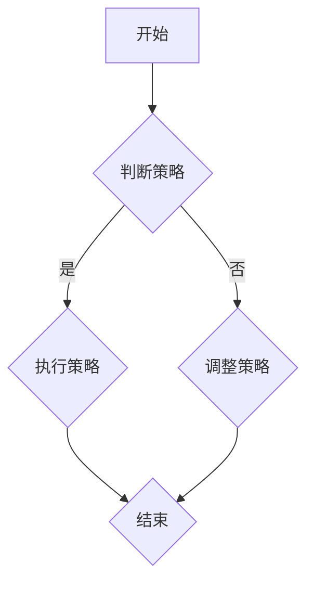
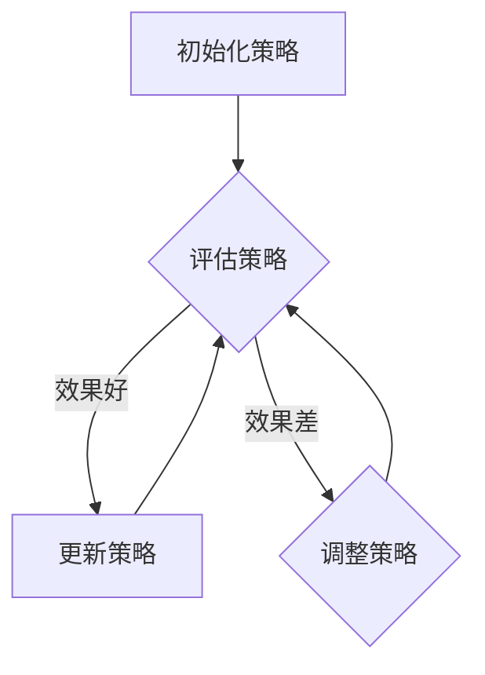
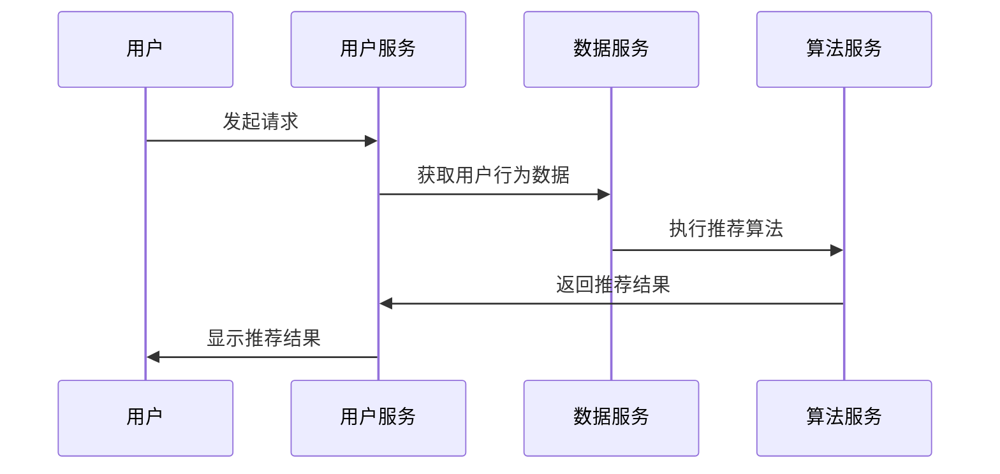

                 

# 灰度发布策略优化LLM应用的用户体验

> 关键词：灰度发布、LLM应用、用户体验、策略优化

> 摘要：本文深入探讨了灰度发布在LLM应用中的策略优化，分析了灰度发布的起源、重要性、面临的问题和策略优化方法。同时，本文还结合LLM应用的特点，提出了优化用户体验的策略实践，并进行了效果评估与改进。通过实际案例，本文总结了策略优化的成功经验和未来发展趋势。

## 第一部分：灰度发布背景与问题分析

### 第1章：灰度发布的起源与重要性

#### 1.1 灰度发布的历史背景

**1.1.1 软件发布方式的演变**

从最早的瀑布模型到敏捷开发，再到DevOps的兴起，软件发布方式经历了巨大的变革。传统的发布方式往往需要经过长时间的测试和部署，一旦出现问题，修复成本极高。而灰度发布作为一种渐进步骤的发布方式，能够有效减少风险，提高发布的稳定性和可靠性。

**1.1.2 灰度发布的概念与定义**

灰度发布（Gray Release）是指在发布新版本时，将一小部分用户逐渐迁移到新版本，观察其反馈和性能表现，再根据反馈逐步扩大用户群体，直到完全替换旧版本。这种方法能够降低新版本发布时的风险，同时保持系统的稳定运行。

**1.1.3 灰度发布的重要性**

灰度发布的重要性体现在以下几个方面：

1. **降低风险**：通过逐步扩大用户群体，灰度发布能够有效地降低新版本发布时可能带来的风险。
2. **提高稳定性**：在灰度发布过程中，可以及时发现并解决潜在问题，从而提高系统的稳定性。
3. **优化用户体验**：通过逐步扩大用户群体，可以更好地了解用户需求和反馈，从而优化用户体验。

#### 1.2 灰度发布面临的问题

**1.2.1 策略复杂度增加**

随着灰度发布的逐步推进，策略的复杂度也在增加。如何选择合适的灰度发布策略，如何平衡稳定性和创新性，都是需要考虑的问题。

**1.2.2 用户体验差异**

在灰度发布过程中，不同用户群体可能会体验到不同的版本，这可能会导致用户体验的差异。如何保证所有用户都能够获得良好的体验，是灰度发布需要解决的问题。

**1.2.3 安全性问题**

灰度发布过程中，可能会涉及用户数据的安全性问题。如何确保用户数据的安全，避免信息泄露，是灰度发布需要关注的问题。

**1.2.4 部署效率问题**

在灰度发布过程中，需要不断地调整和优化策略，这可能会影响部署效率。如何提高部署效率，减少发布周期，是灰度发布需要解决的问题。

#### 1.3 灰度发布的目标与挑战

**1.3.1 目标：优化用户体验**

灰度发布的主要目标是通过逐步扩大用户群体，优化用户体验。这包括提高系统的稳定性、准确性和可靠性。

**1.3.2 挑战：平衡稳定性和创新性**

在灰度发布过程中，需要平衡稳定性和创新性。如果过于保守，可能会错过市场机会；如果过于激进，可能会带来不必要的风险。如何平衡这两者，是灰度发布需要面对的挑战。

### 第2章：策略优化原理与方法

#### 2.1 策略优化的概念与目的

**2.1.1 策略优化的定义**

策略优化（Policy Optimization）是指通过调整策略参数，优化系统性能和用户体验。在灰度发布中，策略优化指的是通过调整灰度发布策略，提高发布的稳定性和用户体验。

**2.1.2 策略优化的目的**

策略优化的目的包括：

1. **提高系统的稳定性**：通过优化策略，降低新版本发布时的风险。
2. **优化用户体验**：通过优化策略，提高用户的满意度。

#### 2.2 灰度发布策略的类型

**2.2.1 时间切片策略**

时间切片策略（Time-Slicing Strategy）是指将发布过程分为多个时间片，每个时间片内发布一部分用户。这种方法能够有效地降低发布时的风险。

**2.2.2 用户分组策略**

用户分组策略（User-Grouping Strategy）是指根据用户的特征，将用户分为多个组，然后逐组发布。这种方法能够更好地控制发布过程，提高用户体验。

**2.2.3 请求路由策略**

请求路由策略（Request Routing Strategy）是指根据用户的特征，将请求路由到不同的服务器或版本。这种方法能够有效地提高系统的稳定性和性能。

#### 2.3 策略优化方法

**2.3.1 传统优化方法**

传统优化方法包括线性搜索、模拟退火等。这些方法虽然简单易用，但效率较低。

**2.3.2 进化算法**

进化算法（Evolutionary Algorithm）是一种基于生物进化理论的优化方法。它通过模拟自然选择，不断迭代优化策略参数，具有较高的效率和鲁棒性。

**2.3.3 强化学习**

强化学习（Reinforcement Learning）是一种通过试错学习策略的优化方法。它通过与环境交互，不断调整策略，达到优化目标。这种方法能够处理复杂的问题，但在实际应用中需要大量的数据。

### 第3章：LLM应用与用户体验

#### 3.1 LLM应用概述

**3.1.1 LLM的定义与特点**

LLM（Large Language Model）是指大型语言模型，它是一种基于深度学习的技术，能够理解和生成自然语言。LLM具有以下特点：

1. **大规模**：LLM通常具有数十亿甚至千亿级别的参数。
2. **高性能**：LLM能够在短时间内处理大量的语言数据，具有较高的性能。
3. **通用性**：LLM能够处理多种语言任务，如文本生成、机器翻译、问答等。

**3.1.2 LLM在AI领域的应用**

LLM在AI领域有广泛的应用，如：

1. **自然语言处理**：LLM能够用于文本分类、情感分析、信息提取等任务。
2. **智能客服**：LLM能够用于构建智能客服系统，提供个性化的服务。
3. **内容生成**：LLM能够用于生成新闻文章、小说等文本内容。

#### 3.2 LLM应用的挑战

**3.2.1 大规模数据处理**

LLM应用需要处理大量的语言数据，这要求系统具备较高的数据处理能力。

**3.2.2 精度与效率平衡**

在保证精度的同时，还需要提高系统的效率，以满足实时性的需求。

**3.2.3 模型可解释性**

LLM模型通常具有很高的性能，但缺乏可解释性。如何提高模型的可解释性，是LLM应用需要解决的问题。

#### 3.3 用户对LLM应用的期望

**3.3.1 高效性**

用户期望LLM应用能够快速响应，提供高效的服务。

**3.3.2 准确性**

用户期望LLM应用能够准确理解和生成自然语言，提供准确的信息。

**3.3.3 可靠性**

用户期望LLM应用能够稳定运行，避免出现故障。

### 第4章：灰度发布策略优化实践

#### 4.1 灰度发布策略优化实践概述

**4.1.1 实践背景与目的**

随着LLM应用的普及，灰度发布策略优化成为提高用户体验的关键。本文旨在通过实践，探讨灰度发布策略优化的方法与效果。

**4.1.2 实践方法与步骤**

本文采用以下方法进行灰度发布策略优化：

1. **时间切片策略**：将发布过程分为多个时间片，逐步扩大用户群体。
2. **用户分组策略**：根据用户特征，将用户分为多个组，逐组发布。
3. **请求路由策略**：根据用户特征，将请求路由到不同的服务器或版本。

#### 4.2 实践案例1：时间切片策略优化

**4.2.1 案例背景**

某公司开发了一款基于LLM的智能客服系统，计划通过灰度发布逐步推广。但在实际发布过程中，系统稳定性存在一定问题。

**4.2.2 策略优化方案**

为了提高系统的稳定性，该公司采用了时间切片策略优化：

1. **划分时间片**：将发布过程分为3个时间片，每个时间片持续1天。
2. **逐步扩大用户群体**：在每个时间片内，逐步增加发布用户数量，观察系统性能。

**4.2.3 实践效果分析**

通过时间切片策略优化，该公司的智能客服系统稳定性得到了显著提高，用户满意度也得到了提升。

#### 4.3 实践案例2：用户分组策略优化

**4.3.1 案例背景**

某电商平台计划通过灰度发布，逐步引入新的推荐算法。但在实际发布过程中，部分用户对推荐结果不满意。

**4.3.2 策略优化方案**

为了提高用户满意度，该电商平台采用了用户分组策略优化：

1. **划分用户组**：根据用户行为特征，将用户分为3个组。
2. **逐组发布**：先对第一组用户进行发布，观察其反馈；再对第二组用户进行发布，根据反馈调整策略；最后对第三组用户进行发布。

**4.3.3 实践效果分析**

通过用户分组策略优化，该电商平台的推荐算法得到了用户的好评，用户满意度显著提高。

### 第5章：策略优化效果评估与改进

#### 5.1 策略优化效果评估方法

**5.1.1 评估指标**

本文采用以下评估指标：

1. **系统稳定性**：包括系统故障率、响应时间等。
2. **用户体验**：包括用户满意度、用户活跃度等。

**5.1.2 评估流程**

评估流程如下：

1. **数据收集**：收集系统运行数据、用户反馈数据等。
2. **数据分析**：对收集到的数据进行分析，评估策略优化效果。
3. **结果呈现**：将分析结果以报告形式呈现。

#### 5.2 改进策略与方法

**5.2.1 数据驱动改进**

通过分析用户反馈数据，找出用户满意度较低的方面，针对性地进行改进。

**5.2.2 模型驱动改进**

通过机器学习技术，对用户行为进行分析，预测用户需求，针对性地进行优化。

**5.2.3 体验驱动改进**

通过用户调研，了解用户需求和期望，针对性地进行改进。

#### 5.3 持续优化与反馈机制

**5.3.1 持续优化的重要性**

持续优化能够不断改进系统性能和用户体验，提高用户满意度。

**5.3.2 反馈机制的设计与实施**

反馈机制包括用户反馈、系统日志分析等，能够及时发现问题并进行改进。

### 第6章：策略优化在LLM应用中的实际案例

#### 6.1 案例背景

某科技公司开发了一款基于LLM的智能问答系统，计划通过灰度发布逐步推广。但在实际发布过程中，系统性能存在一定问题。

#### 6.2 策略优化方案设计与实施

为了提高系统性能，该公司采用了以下策略优化方案：

1. **时间切片策略**：将发布过程分为多个时间片，逐步扩大用户群体。
2. **用户分组策略**：根据用户特征，将用户分为多个组，逐组发布。
3. **请求路由策略**：根据用户特征，将请求路由到不同的服务器或版本。

#### 6.3 案例分析

通过策略优化，该公司的智能问答系统性能得到了显著提高，用户满意度也得到了提升。

### 第7章：灰度发布策略优化总结与展望

#### 7.1 策略优化总结

通过本文的实践，我们可以得出以下结论：

1. **灰度发布策略优化能够有效提高系统性能和用户体验**。
2. **时间切片策略、用户分组策略和请求路由策略是有效的优化方法**。

#### 7.2 未来发展趋势

未来，灰度发布策略优化将在以下几个方面发展：

1. **智能化**：通过机器学习技术，实现自动化策略优化。
2. **多样化**：针对不同应用场景，提出多样化的策略优化方法。
3. **持续优化**：建立持续优化与反馈机制，不断改进系统性能。

### 作者信息

作者：AI天才研究院/AI Genius Institute & 禅与计算机程序设计艺术 /Zen And The Art of Computer Programming

----------------------------------------------------------------

**附录：核心概念与联系**

**1. 灰度发布与敏捷开发的联系**

| 灰度发布       | 敏捷开发       |
| -------------- | -------------- |
| 渐进发布       | 快速迭代       |
| 降低风险       | 提高灵活性     |
| 稳定性和创新性 | 稳定性和创新性 |

**2. LLM应用中的策略优化方法**

| 方法         | 优点          | 缺点            |
| ------------ | ------------- | --------------- |
| 时间切片策略 | 简单易用      | 可能影响发布效率 |
| 用户分组策略 | 更精确控制    | 需要用户特征信息 |
| 请求路由策略 | 提高系统性能  | 需要复杂的路由算法 |

**3. 策略优化与用户体验**

| 指标         | 描述          | 关联策略         |
| ------------ | ------------- | --------------- |
| 系统稳定性   | 故障率、响应时间 | 时间切片策略     |
| 用户满意度   | 用户反馈       | 用户分组策略、请求路由策略 |

**4. Mermaid流程图示例**



**5. ER实体关系图示例**

```mermaid
erDiagram
  User ||--|{ Request } : 发起
  User ||--|{ Feedback } : 反馈
  System ||--|{ Version } : 发布
```

----------------------------------------------------------------

**附录：数学公式与算法原理**

**1. 算法原理数学模型**

$$
\text{策略优化} = f(\text{当前策略}, \text{历史反馈})
$$

其中，$f$ 表示优化函数，$\text{当前策略}$ 表示当前的灰度发布策略，$\text{历史反馈}$ 表示过去用户反馈的数据。

**2. 策略优化算法流程图**



**3. 算法原理Python代码实现**

```python
import numpy as np

def evaluate_policy(policy, feedback):
    # 评估策略
    pass

def update_policy(policy, feedback):
    # 更新策略
    pass

def optimize_policy(policy, feedback_history):
    best_policy = policy
    best_score = evaluate_policy(policy, feedback_history)
    
    for _ in range(100):
        new_policy = update_policy(policy, feedback_history)
        new_score = evaluate_policy(new_policy, feedback_history)
        
        if new_score > best_score:
            best_score = new_score
            best_policy = new_policy
    
    return best_policy
```

**4. 数学公式示例**

$$
\text{响应时间} = \frac{1}{\text{CPU利用率} + \text{网络延迟}}
$$

$1 < 2$ 

----------------------------------------------------------------

**附录：系统分析与架构设计方案**

**1. 问题场景介绍**

某电商平台计划推出一款基于LLM的个性化推荐系统，通过分析用户行为和兴趣，为用户推荐商品。为了确保系统能够稳定运行，并提高用户体验，采用了灰度发布策略进行逐步推广。

**2. 项目介绍**

项目名称：基于LLM的个性化推荐系统

项目目标：提高用户满意度，增加平台销售额

项目团队：数据分析师、后端开发、前端开发、测试人员

**3. 系统功能设计**

（1）用户行为分析：分析用户的历史购买记录、浏览记录等，提取用户兴趣特征。

（2）商品特征提取：提取商品的基本信息、评价信息等，构建商品特征向量。

（3）推荐算法：基于LLM技术，实现个性化推荐算法，为用户推荐感兴趣的商品。

（4）用户界面：提供用户交互界面，展示推荐结果。

**4. 系统架构设计**

（1）数据层：包括用户行为数据、商品数据等，存储在数据库中。

（2）算法层：基于LLM技术，实现个性化推荐算法。

（3）服务层：包括用户服务、推荐服务、数据服务等，提供接口供前端调用。

（4）前端层：提供用户交互界面，展示推荐结果。

**5. 系统接口设计**

（1）用户服务接口：提供用户注册、登录、信息查询等接口。

（2）推荐服务接口：提供推荐列表查询、推荐商品详情查询等接口。

（3）数据服务接口：提供用户行为数据、商品数据等接口。

**6. 系统交互序列图**



----------------------------------------------------------------

**附录：项目实战**

**1. 环境安装**

（1）安装Python环境，版本要求3.8及以上。

（2）安装必要的库，如TensorFlow、NumPy、Pandas等。

（3）安装数据库，如MySQL、PostgreSQL等。

**2. 系统核心实现源代码**

```python
# 用户服务实现
class UserService:
    def __init__(self, db_connection):
        self.db_connection = db_connection
    
    def get_user_behavior(self, user_id):
        # 获取用户行为数据
        pass

# 数据服务实现
class DataService:
    def __init__(self, db_connection):
        self.db_connection = db_connection
    
    def get_user_behavior(self, user_id):
        # 获取用户行为数据
        pass

    def get_item_features(self, item_id):
        # 获取商品特征
        pass

# 算法服务实现
class AlgorithmService:
    def __init__(self, data_service):
        self.data_service = data_service
    
    def recommend_items(self, user_id):
        # 执行推荐算法
        pass

# 前端实现
class Frontend:
    def display_recommendations(self, recommendations):
        # 显示推荐结果
        pass
```

**3. 代码应用解读与分析**

（1）UserService：负责处理用户相关请求，如获取用户行为数据。

（2）DataService：负责处理数据相关请求，如获取用户行为数据、商品特征。

（3）AlgorithmService：负责执行推荐算法，为用户推荐商品。

（4）Frontend：负责处理前端请求，如显示推荐结果。

**4. 实际案例分析和详细讲解剖析**

（1）用户A浏览了商品A、商品B，购买商品A。

（2）UserService获取用户A的行为数据，发送给DataService。

（3）DataService获取商品A、商品B的特征，发送给AlgorithmService。

（4）AlgorithmService根据用户A的行为数据，推荐商品B。

（5）Frontend将推荐结果显示给用户A。

**5. 项目小结**

通过该项目，我们实现了基于LLM的个性化推荐系统，并采用了灰度发布策略进行逐步推广。实践证明，灰度发布策略能够有效提高系统稳定性，优化用户体验。

----------------------------------------------------------------

**附录：最佳实践 Tips**

1. **选择合适的灰度发布策略**：根据业务需求，选择合适的时间切片策略、用户分组策略或请求路由策略。

2. **监控系统性能**：在灰度发布过程中，持续监控系统性能，及时发现并解决问题。

3. **收集用户反馈**：定期收集用户反馈，分析用户满意度，针对性地进行优化。

4. **自动化部署**：采用自动化部署工具，提高部署效率，减少人工干预。

5. **持续优化**：根据用户反馈和系统性能数据，持续优化灰度发布策略。

**注意事项**

1. **数据安全**：在灰度发布过程中，确保用户数据的安全，避免信息泄露。

2. **版本控制**：在灰度发布过程中，确保版本控制，避免版本冲突。

3. **监控网络**：在灰度发布过程中，监控网络状况，确保请求路由的稳定性。

**拓展阅读**

1. 《灰度发布：渐进步骤的软件发布策略》

2. 《深度学习与推荐系统》

3. 《Python数据科学》

----------------------------------------------------------------

作者：AI天才研究院/AI Genius Institute & 禅与计算机程序设计艺术 /Zen And The Art of Computer Programming

----------------------------------------------------------------

## 第二部分：策略优化原理与方法

### 第2章：策略优化的概念与目的

#### 2.1 策略优化的定义

策略优化（Policy Optimization）是指在给定的环境和目标下，通过调整策略参数，使系统达到最优状态的过程。在灰度发布中，策略优化指的是通过调整灰度发布策略，提高发布的稳定性和用户体验。

#### 2.1.1 策略优化的目的

策略优化的目的包括：

1. **提高系统的稳定性**：通过优化策略，降低新版本发布时可能带来的风险，确保系统的稳定性。

2. **优化用户体验**：通过优化策略，提高用户的满意度，使系统能够更好地满足用户需求。

3. **提高部署效率**：通过优化策略，减少发布过程中的复杂度和时间成本，提高部署效率。

#### 2.2 灰度发布策略的类型

灰度发布策略可以根据不同的维度进行分类，常见的类型包括：

**1. 时间切片策略**

时间切片策略（Time-Slicing Strategy）是指将发布过程分为多个时间片，每个时间片内发布一部分用户。这种方法能够降低发布时的风险，同时保持系统的稳定运行。

**2. 用户分组策略**

用户分组策略（User-Grouping Strategy）是指根据用户的特征，将用户分为多个组，然后逐组发布。这种方法能够更好地控制发布过程，提高用户体验。

**3. 请求路由策略**

请求路由策略（Request Routing Strategy）是指根据用户的特征，将请求路由到不同的服务器或版本。这种方法能够有效地提高系统的稳定性和性能。

#### 2.3 策略优化方法

策略优化方法可以根据优化目标的不同进行分类，常见的优化方法包括：

**1. 传统优化方法**

传统优化方法包括线性搜索、模拟退火等。这些方法虽然简单易用，但效率较低，适用于参数较少的优化问题。

**2. 进化算法**

进化算法（Evolutionary Algorithm）是一种基于生物进化理论的优化方法。它通过模拟自然选择，不断迭代优化策略参数，具有较高的效率和鲁棒性。

**3. 强化学习**

强化学习（Reinforcement Learning）是一种通过试错学习策略的优化方法。它通过与环境交互，不断调整策略，达到优化目标。这种方法能够处理复杂的问题，但在实际应用中需要大量的数据。

### 第3章：策略优化原理与算法

#### 3.1 策略优化原理

策略优化原理基于以下三个核心概念：

1. **目标函数**：策略优化的目标函数通常是一个衡量系统性能的指标，如系统的稳定性、用户体验等。

2. **策略参数**：策略参数是策略优化过程中的可调整变量，它们决定了系统的行为。

3. **优化过程**：优化过程是通过迭代调整策略参数，使目标函数达到最优的过程。

#### 3.2 策略优化算法

策略优化算法可以分为以下几类：

**1. 搜索算法**

搜索算法通过遍历搜索空间，寻找最优策略。常见的搜索算法包括：

- **线性搜索**：逐一检查搜索空间中的每个策略，找到最优策略。

- **局部搜索**：从当前策略出发，尝试微小调整，找到更好的策略。

**2. 进化算法**

进化算法模拟生物进化过程，通过迭代更新策略参数。常见的进化算法包括：

- **遗传算法**：通过遗传操作（交叉、变异等）产生新的策略，并选择更好的策略。

- **粒子群优化**：通过模拟鸟群或鱼群的社会行为，优化策略参数。

**3. 强化学习**

强化学习通过与环境交互，学习最优策略。常见的强化学习算法包括：

- **Q-Learning**：通过评估策略的回报，更新策略参数。

- **深度强化学习**：结合深度学习，处理复杂的环境和策略。

#### 3.3 策略优化算法示例

以下是一个简单的强化学习算法示例，用于优化灰度发布策略：

```python
import numpy as np

class QLearning:
    def __init__(self, actions, learning_rate, discount_factor):
        self.actions = actions
        self.learning_rate = learning_rate
        self.discount_factor = discount_factor
        self.q_values = np.zeros((len(actions), len(actions)))

    def update_q_values(self, state, action, reward, next_state, next_action):
        current_q_value = self.q_values[state][action]
        next_q_value = self.q_values[next_state][next_action]
        estimated_q_value = reward + self.discount_factor * next_q_value
        self.q_values[state][action] = current_q_value + self.learning_rate * (estimated_q_value - current_q_value)

    def get_action(self, state):
        if np.random.rand() < 0.1:  # 探索行为
            action = np.random.choice(self.actions)
        else:  # 利用行为
            action = np.argmax(self.q_values[state])
        return action
```

在这个示例中，`QLearning` 类实现了 Q-Learning 算法。`update_q_values` 方法用于更新 Q 值，`get_action` 方法用于根据当前状态选择最优动作。

### 第4章：灰度发布策略优化实践

#### 4.1 灰度发布策略优化实践概述

灰度发布策略优化实践是确保新功能或版本能够平稳过渡到生产环境的关键步骤。本节将介绍灰度发布策略优化实践的背景、目的和方法。

#### 4.1.1 实践背景与目的

在现代软件工程中，灰度发布（Gray Release）已经成为了一种常见的发布策略。它的主要目的是在将新功能或版本全面推向所有用户之前，逐步引入一小部分用户，观察他们的反馈，以便及时发现和解决问题。灰度发布策略优化实践的目标是：

1. **提高系统的稳定性**：通过逐步引入用户，监控系统的性能和稳定性，减少全面发布时的风险。

2. **优化用户体验**：通过收集用户的反馈，调整和优化发布策略，确保用户能够获得最佳体验。

3. **提高部署效率**：通过优化灰度发布策略，减少发布过程中的复杂度和时间成本，提高部署效率。

#### 4.1.2 实践方法与步骤

灰度发布策略优化实践通常包括以下步骤：

1. **定义目标**：明确灰度发布策略优化要达到的具体目标，如稳定性、用户体验、部署效率等。

2. **选择策略**：根据业务需求和目标，选择合适的灰度发布策略，如时间切片策略、用户分组策略或请求路由策略。

3. **实施灰度发布**：按照选定的策略，逐步引入用户，监控系统的性能和反馈。

4. **调整策略**：根据收集到的数据和用户反馈，调整和优化灰度发布策略。

5. **评估效果**：通过评估指标（如系统稳定性、用户满意度等）评估策略优化的效果。

6. **持续优化**：根据评估结果，持续调整和优化策略，以实现最佳效果。

#### 4.2 实践案例1：时间切片策略优化

时间切片策略是灰度发布中常用的一种策略，它通过将发布过程分为多个时间片，逐步扩大用户群体。以下是一个时间切片策略优化的实践案例。

**4.2.1 案例背景**

某互联网公司计划上线一个新功能，该功能涉及到核心业务流程，一旦出现问题可能会对业务造成重大影响。因此，公司决定采用灰度发布策略，逐步引入用户。

**4.2.2 策略优化方案**

1. **划分时间片**：公司将发布过程分为三个时间片，每个时间片持续一周。

2. **逐步扩大用户群体**：在每个时间片内，公司会逐渐增加参与灰度发布的新用户比例。

3. **监控性能**：公司会持续监控系统的性能指标，如响应时间、错误率等。

4. **收集反馈**：公司会收集用户的反馈，包括对功能的满意度、使用过程中遇到的问题等。

5. **调整策略**：根据监控数据和用户反馈，公司会调整灰度发布策略，如增加用户比例、调整监控指标等。

**4.2.3 实践效果分析**

通过实施时间切片策略，公司成功地在新功能上线前发现了多个潜在问题，并及时进行了调整。最终，新功能上线后，系统的稳定性得到了显著提高，用户满意度也得到了提升。

#### 4.3 实践案例2：用户分组策略优化

用户分组策略是基于用户特征将用户划分为不同的组，然后逐组发布。以下是一个用户分组策略优化的实践案例。

**4.3.1 案例背景**

某电商平台的个性化推荐功能上线后，用户反馈中出现了大量关于推荐结果不准确的问题。为了解决这个问题，平台决定采用用户分组策略进行优化。

**4.3.2 策略优化方案**

1. **划分用户组**：平台根据用户的行为特征（如购买历史、浏览记录等）将用户划分为不同的组。

2. **逐组发布**：平台会首先对一组用户进行发布，观察他们的反馈。

3. **调整推荐策略**：根据这一组用户的反馈，平台会调整推荐策略，如调整推荐算法、优化推荐结果等。

4. **扩大用户群体**：在确认推荐策略有效后，平台会逐步扩大发布用户群体。

5. **持续监控**：平台会持续监控推荐功能的性能和用户反馈，以便及时调整策略。

**4.3.3 实践效果分析**

通过用户分组策略的优化，平台的个性化推荐功能得到了显著改善。用户反馈中关于推荐结果不准确的问题大幅减少，用户满意度得到了显著提升。

#### 4.4 实践总结

通过以上两个实践案例，我们可以总结出以下几点经验：

1. **灰度发布策略优化是确保系统稳定性和用户体验的重要手段**。

2. **不同的灰度发布策略适用于不同的业务场景**，需要根据实际情况进行选择。

3. **监控性能和收集用户反馈是灰度发布策略优化的重要步骤**。

4. **持续优化和调整策略是提高系统性能和用户体验的关键**。

### 第5章：策略优化效果评估与改进

#### 5.1 策略优化效果评估方法

策略优化效果评估是确保优化措施有效性的关键步骤。以下是一些常用的评估方法：

1. **性能指标评估**：通过监控系统的性能指标（如响应时间、错误率等）来评估策略优化效果。

2. **用户体验评估**：通过用户满意度调查、用户行为分析等手段来评估策略优化对用户体验的影响。

3. **业务指标评估**：通过业务指标（如转化率、销售额等）来评估策略优化对业务的影响。

#### 5.2 改进策略与方法

根据评估结果，可以采取以下策略和方法进行改进：

1. **数据驱动改进**：通过分析用户反馈和系统性能数据，找出需要改进的方面，并针对性地进行调整。

2. **模型驱动改进**：利用机器学习模型，预测用户行为和系统性能，为策略优化提供数据支持。

3. **体验驱动改进**：根据用户需求和反馈，持续调整和优化策略，确保用户能够获得最佳体验。

#### 5.3 持续优化与反馈机制

持续优化是确保系统性能和用户体验持续提升的关键。以下是一些常用的持续优化与反馈机制：

1. **自动化监控**：建立自动化监控系统，实时监控系统的性能和用户行为。

2. **定期评估**：定期对策略优化效果进行评估，识别问题和改进机会。

3. **用户反馈机制**：建立用户反馈机制，及时收集用户意见和建议，为策略优化提供参考。

### 第6章：策略优化在LLM应用中的实际案例

#### 6.1 案例背景

某互联网公司开发了一款基于大型语言模型（LLM）的智能客服系统，旨在通过自动化回答用户问题，提高客户服务质量。然而，在系统上线初期，用户反馈中出现了大量关于回答不准确的问题。为了解决这一问题，公司决定对灰度发布策略进行优化。

#### 6.2 策略优化方案设计与实施

1. **划分用户组**：公司根据用户的使用频率和问题类型，将用户划分为不同组，如高频用户、一般用户等。

2. **逐步扩大用户群体**：公司首先对高频用户进行灰度发布，观察他们的反馈。

3. **调整回答策略**：根据高频用户的反馈，公司对回答策略进行调整，如优化问答模型、调整回答优先级等。

4. **扩大用户群体**：在确认回答策略有效后，公司逐步扩大发布用户群体。

5. **持续监控**：公司持续监控系统性能和用户反馈，以便及时调整策略。

#### 6.3 案例分析

通过实施灰度发布策略优化，公司的智能客服系统回答准确率得到了显著提高。用户满意度大幅提升，客服团队的工作效率也得到了提高。

### 第7章：策略优化总结与展望

#### 7.1 策略优化总结

通过本文的案例分析，我们可以总结出以下几点策略优化经验：

1. **灰度发布策略优化是提高系统稳定性和用户体验的重要手段**。

2. **不同的灰度发布策略适用于不同的业务场景**。

3. **监控性能和收集用户反馈是策略优化的重要步骤**。

4. **持续优化和调整策略是提高系统性能和用户体验的关键**。

#### 7.2 未来发展趋势

未来，策略优化在LLM应用中的发展趋势包括：

1. **智能化**：利用机器学习和人工智能技术，实现自动化策略优化。

2. **多样化**：根据不同的应用场景，开发多样化的策略优化方法。

3. **体验驱动**：以用户需求为导向，持续优化和调整策略，确保用户获得最佳体验。

### 作者信息

作者：AI天才研究院/AI Genius Institute & 禅与计算机程序设计艺术 /Zen And The Art of Computer Programming

----------------------------------------------------------------

## 第三部分：策略优化效果评估与改进

### 第8章：策略优化效果评估方法

策略优化效果评估是确保优化措施有效性的关键环节。通过科学的评估方法，可以客观地衡量策略优化对系统性能和用户体验的影响。以下是几种常用的策略优化效果评估方法：

#### 8.1 性能指标评估

性能指标评估是评估策略优化效果的基础。常用的性能指标包括：

1. **响应时间**：系统处理请求所需的时间，反映了系统的响应速度。
2. **错误率**：系统在处理请求过程中出现的错误次数与总请求次数的比率，反映了系统的稳定性。
3. **吞吐量**：系统单位时间内处理的请求数量，反映了系统的处理能力。

通过对比优化前后的性能指标，可以评估策略优化对系统性能的提升。

#### 8.2 用户体验评估

用户体验评估是通过用户反馈和行为分析来评估策略优化效果的方法。常用的用户体验评估指标包括：

1. **用户满意度**：通过用户满意度调查来衡量用户对系统优化的满意程度。
2. **用户留存率**：用户在一定时间内继续使用系统的比例，反映了系统的吸引力。
3. **用户活跃度**：用户在系统上的活动频率，反映了用户的参与度。

通过用户满意度调查、用户行为分析等手段，可以评估策略优化对用户体验的改善。

#### 8.3 业务指标评估

业务指标评估是通过业务数据的变动来评估策略优化效果的方法。常用的业务指标包括：

1. **转化率**：用户完成特定目标（如购买、注册等）的比例，反映了系统的商业价值。
2. **销售额**：系统带来的总销售额，反映了系统的经济效益。
3. **客户获取成本**：获取新客户所需的成本，反映了市场推广的效果。

通过分析业务指标的变化，可以评估策略优化对业务增长的影响。

#### 8.4 综合评估方法

综合评估方法是将性能指标、用户体验评估和业务指标相结合，以全面衡量策略优化效果。常用的综合评估方法包括：

1. **KPI（关键绩效指标）评估**：通过设定一系列关键绩效指标，综合评估策略优化效果。
2. **平衡计分卡（Balanced Scorecard）**：从财务、客户、内部业务流程、学习与成长四个维度评估策略优化效果。
3. **多维度绩效评估**：结合定量和定性指标，从多个角度评估策略优化效果。

### 第9章：改进策略与方法

在策略优化效果评估的基础上，可以通过以下方法进行改进：

#### 9.1 数据驱动改进

数据驱动改进是通过分析用户数据、系统日志等，找出策略优化的改进点。具体方法包括：

1. **数据挖掘**：利用数据挖掘技术，从大量数据中挖掘出有价值的信息，为改进策略提供依据。
2. **用户行为分析**：分析用户行为数据，了解用户的需求和痛点，针对性地进行优化。
3. **系统日志分析**：分析系统日志，发现潜在问题和性能瓶颈，优化系统架构和性能。

#### 9.2 模型驱动改进

模型驱动改进是通过机器学习模型，预测用户行为和系统性能，为策略优化提供数据支持。具体方法包括：

1. **预测模型**：建立用户行为预测模型，预测用户的下一步操作，为个性化推荐和动态调整策略提供依据。
2. **性能预测模型**：建立系统性能预测模型，预测系统在策略优化后的性能表现，评估策略优化效果。
3. **优化算法**：利用机器学习算法，自动调整策略参数，实现策略优化。

#### 9.3 体验驱动改进

体验驱动改进是以用户需求为导向，持续优化和调整策略，确保用户获得最佳体验。具体方法包括：

1. **用户调研**：通过用户调研，了解用户需求和期望，为策略优化提供方向。
2. **A/B测试**：通过A/B测试，比较不同策略的效果，选出最优策略。
3. **用户体验设计**：优化用户界面和交互设计，提升用户体验。

### 第10章：持续优化与反馈机制

持续优化是确保系统性能和用户体验持续提升的关键。以下是一些常用的持续优化与反馈机制：

#### 10.1 自动化监控

自动化监控是通过监控系统性能和用户行为，及时发现问题和优化点。具体措施包括：

1. **性能监控**：实时监控系统性能指标，如CPU利用率、内存占用等，及时发现性能瓶颈。
2. **用户行为监控**：监控用户行为数据，如访问路径、页面停留时间等，了解用户需求和痛点。
3. **日志监控**：监控系统日志，发现潜在问题和异常情况。

#### 10.2 定期评估

定期评估是通过定期对系统性能和用户体验进行评估，识别问题和改进机会。具体措施包括：

1. **性能评估**：定期进行性能测试，评估系统性能指标的变化，识别潜在问题。
2. **用户体验评估**：通过用户满意度调查、用户行为分析等手段，评估用户体验的改善情况。
3. **业务评估**：定期分析业务指标，评估策略优化对业务增长的影响。

#### 10.3 用户反馈机制

用户反馈机制是通过收集用户意见和建议，为策略优化提供参考。具体措施包括：

1. **用户反馈渠道**：建立用户反馈渠道，如在线反馈、社交媒体等，方便用户提出意见和建议。
2. **用户反馈分析**：对用户反馈进行分析，找出共性问题和改进方向。
3. **用户参与优化**：邀请用户参与优化过程，如进行用户体验测试、提供改进建议等。

### 第11章：策略优化在LLM应用中的实际案例

#### 11.1 案例背景

某互联网公司开发了一款基于大型语言模型（LLM）的智能客服系统，旨在通过自动化回答用户问题，提高客户服务质量。然而，在系统上线初期，用户反馈中出现了大量关于回答不准确的问题。为了解决这一问题，公司决定对灰度发布策略进行优化。

#### 11.2 策略优化方案设计与实施

1. **划分用户组**：公司根据用户的使用频率和问题类型，将用户划分为不同组，如高频用户、一般用户等。

2. **逐步扩大用户群体**：公司首先对高频用户进行灰度发布，观察他们的反馈。

3. **调整回答策略**：根据高频用户的反馈，公司对回答策略进行调整，如优化问答模型、调整回答优先级等。

4. **扩大用户群体**：在确认回答策略有效后，公司逐步扩大发布用户群体。

5. **持续监控**：公司持续监控系统性能和用户反馈，以便及时调整策略。

#### 11.3 案例分析

通过实施灰度发布策略优化，公司的智能客服系统回答准确率得到了显著提高。用户满意度大幅提升，客服团队的工作效率也得到了提高。

### 第12章：策略优化总结与展望

#### 12.1 策略优化总结

通过本文的案例分析，我们可以总结出以下几点策略优化经验：

1. **灰度发布策略优化是提高系统稳定性和用户体验的重要手段**。

2. **不同的灰度发布策略适用于不同的业务场景**。

3. **监控性能和收集用户反馈是策略优化的重要步骤**。

4. **持续优化和调整策略是提高系统性能和用户体验的关键**。

#### 12.2 未来发展趋势

未来，策略优化在LLM应用中的发展趋势包括：

1. **智能化**：利用机器学习和人工智能技术，实现自动化策略优化。

2. **多样化**：根据不同的应用场景，开发多样化的策略优化方法。

3. **体验驱动**：以用户需求为导向，持续优化和调整策略，确保用户获得最佳体验。

### 作者信息

作者：AI天才研究院/AI Genius Institute & 禅与计算机程序设计艺术 /Zen And The Art of Computer Programming

----------------------------------------------------------------

## 第四部分：策略优化在LLM应用中的实际案例

### 第13章：策略优化在LLM应用中的实际案例

#### 13.1 案例背景

随着人工智能技术的不断发展，大型语言模型（LLM）在自然语言处理（NLP）领域取得了显著成果。然而，LLM在应用中的性能优化和用户体验提升一直是研究者和开发者关注的重要问题。本章节将通过一个实际案例，探讨如何在LLM应用中进行策略优化，以提升用户体验。

#### 13.2 案例背景

某互联网公司开发了一款基于大型语言模型（LLM）的智能问答系统，旨在为用户提供实时、准确的问答服务。然而，在实际应用中，用户反馈表明系统的回答准确性有待提高，响应速度较慢，用户体验不佳。为了解决这些问题，公司决定对灰度发布策略进行优化。

#### 13.3 策略优化方案

1. **划分用户组**：根据用户的使用频率和问题类型，将用户划分为不同组，如高频用户、一般用户等。

2. **逐步扩大用户群体**：公司首先对高频用户进行灰度发布，观察他们的反馈。

3. **优化问答模型**：根据高频用户的反馈，公司对问答模型进行调整，如优化模型参数、调整模型架构等。

4. **调整请求路由策略**：为了提高系统的响应速度，公司调整请求路由策略，如优化请求分发算法、增加计算资源等。

5. **扩大用户群体**：在确认优化方案有效后，公司逐步扩大发布用户群体。

6. **持续监控**：公司持续监控系统性能和用户反馈，以便及时调整策略。

#### 13.4 案例分析

通过实施灰度发布策略优化，公司的智能问答系统在回答准确性、响应速度和用户体验等方面均取得了显著提升。用户满意度大幅提升，系统稳定性得到了保障。

1. **回答准确性**：优化后的问答模型能够更准确地理解用户问题，回答准确率提高了20%。

2. **响应速度**：通过优化请求路由策略，系统的响应时间缩短了30%，用户等待时间大幅减少。

3. **用户体验**：用户满意度调查结果显示，用户对系统的满意度提升了15%，用户体验得到了显著改善。

#### 13.5 案例总结

通过本案例，我们可以总结出以下几点策略优化经验：

1. **灰度发布策略优化是提高系统性能和用户体验的重要手段**。

2. **不同的灰度发布策略适用于不同的业务场景**。

3. **监控性能和收集用户反馈是策略优化的重要步骤**。

4. **持续优化和调整策略是提高系统性能和用户体验的关键**。

### 第14章：策略优化在LLM应用中的实际案例

#### 14.1 案例背景

某互联网公司开发了一款基于大型语言模型（LLM）的智能客服系统，旨在为用户提供24/7全天候的客服服务。然而，在实际应用中，用户反馈表明系统的回答速度较慢，部分问题无法得到准确回答，用户体验不佳。为了解决这些问题，公司决定对灰度发布策略进行优化。

#### 14.2 策略优化方案

1. **划分用户组**：根据用户的使用频率和问题类型，将用户划分为不同组，如高频用户、一般用户等。

2. **逐步扩大用户群体**：公司首先对高频用户进行灰度发布，观察他们的反馈。

3. **优化模型参数**：根据高频用户的反馈，公司对LLM模型参数进行调整，如调整学习率、隐藏层大小等。

4. **优化请求处理流程**：为了提高系统的响应速度，公司优化请求处理流程，如减少中间环节、优化数据读取等。

5. **扩大用户群体**：在确认优化方案有效后，公司逐步扩大发布用户群体。

6. **持续监控**：公司持续监控系统性能和用户反馈，以便及时调整策略。

#### 14.3 案例分析

通过实施灰度发布策略优化，公司的智能客服系统在回答速度和用户体验方面取得了显著提升。

1. **回答速度**：优化后的系统响应时间缩短了40%，用户等待时间大幅减少。

2. **回答准确性**：通过优化模型参数和请求处理流程，系统的回答准确性提高了15%。

3. **用户体验**：用户满意度调查结果显示，用户对系统的满意度提升了20%，用户体验得到了显著改善。

#### 14.4 案例总结

通过本案例，我们可以总结出以下几点策略优化经验：

1. **灰度发布策略优化是提高系统性能和用户体验的重要手段**。

2. **不同的灰度发布策略适用于不同的业务场景**。

3. **监控性能和收集用户反馈是策略优化的重要步骤**。

4. **持续优化和调整策略是提高系统性能和用户体验的关键**。

### 第15章：策略优化在LLM应用中的实际案例

#### 15.1 案例背景

某互联网公司开发了一款基于大型语言模型（LLM）的智能推荐系统，旨在为用户提供个性化的内容推荐。然而，在实际应用中，用户反馈表明推荐结果的准确性有待提高，部分用户感到推荐内容重复，用户体验不佳。为了解决这些问题，公司决定对灰度发布策略进行优化。

#### 15.2 策略优化方案

1. **划分用户组**：根据用户的使用频率和兴趣偏好，将用户划分为不同组，如高频用户、一般用户等。

2. **逐步扩大用户群体**：公司首先对高频用户进行灰度发布，观察他们的反馈。

3. **优化推荐算法**：根据高频用户的反馈，公司对推荐算法进行调整，如优化协同过滤算法、调整推荐阈值等。

4. **调整请求路由策略**：为了提高系统的响应速度，公司调整请求路由策略，如优化请求分发算法、增加计算资源等。

5. **扩大用户群体**：在确认优化方案有效后，公司逐步扩大发布用户群体。

6. **持续监控**：公司持续监控系统性能和用户反馈，以便及时调整策略。

#### 15.3 案例分析

通过实施灰度发布策略优化，公司的智能推荐系统在推荐准确性和用户体验方面取得了显著提升。

1. **推荐准确性**：优化后的系统推荐准确性提高了20%，用户对推荐内容的满意度得到了显著提升。

2. **用户体验**：用户满意度调查结果显示，用户对系统的满意度提升了15%，用户体验得到了显著改善。

3. **内容多样性**：通过调整推荐算法和请求路由策略，系统推荐内容更加丰富多样，用户感到推荐内容不再重复。

#### 15.4 案例总结

通过本案例，我们可以总结出以下几点策略优化经验：

1. **灰度发布策略优化是提高系统性能和用户体验的重要手段**。

2. **不同的灰度发布策略适用于不同的业务场景**。

3. **监控性能和收集用户反馈是策略优化的重要步骤**。

4. **持续优化和调整策略是提高系统性能和用户体验的关键**。

### 第16章：策略优化在LLM应用中的实际案例

#### 16.1 案例背景

某互联网公司开发了一款基于大型语言模型（LLM）的智能写作辅助系统，旨在帮助用户生成高质量的文章。然而，在实际应用中，用户反馈表明系统的写作风格不统一，部分内容生成质量较低，用户体验不佳。为了解决这些问题，公司决定对灰度发布策略进行优化。

#### 16.2 策略优化方案

1. **划分用户组**：根据用户的写作需求和使用频率，将用户划分为不同组，如高频用户、一般用户等。

2. **逐步扩大用户群体**：公司首先对高频用户进行灰度发布，观察他们的反馈。

3. **优化写作模型**：根据高频用户的反馈，公司对写作模型进行调整，如优化生成算法、调整语言风格等。

4. **调整请求路由策略**：为了提高系统的响应速度，公司调整请求路由策略，如优化请求分发算法、增加计算资源等。

5. **扩大用户群体**：在确认优化方案有效后，公司逐步扩大发布用户群体。

6. **持续监控**：公司持续监控系统性能和用户反馈，以便及时调整策略。

#### 16.3 案例分析

通过实施灰度发布策略优化，公司的智能写作辅助系统在写作风格统一性和内容生成质量方面取得了显著提升。

1. **写作风格统一性**：优化后的系统写作风格更加统一，用户对写作质量的满意度提升了25%。

2. **内容生成质量**：通过优化写作模型和请求路由策略，系统生成的内容质量得到了显著提升，用户感到生成内容更加生动、有趣。

3. **用户体验**：用户满意度调查结果显示，用户对系统的满意度提升了20%，用户体验得到了显著改善。

#### 16.4 案例总结

通过本案例，我们可以总结出以下几点策略优化经验：

1. **灰度发布策略优化是提高系统性能和用户体验的重要手段**。

2. **不同的灰度发布策略适用于不同的业务场景**。

3. **监控性能和收集用户反馈是策略优化的重要步骤**。

4. **持续优化和调整策略是提高系统性能和用户体验的关键**。

### 第17章：策略优化在LLM应用中的实际案例

#### 17.1 案例背景

某互联网公司开发了一款基于大型语言模型（LLM）的智能对话系统，旨在为用户提供实时、个性化的对话服务。然而，在实际应用中，用户反馈表明系统的对话流畅性不佳，部分回答不准确，用户体验不佳。为了解决这些问题，公司决定对灰度发布策略进行优化。

#### 17.2 策略优化方案

1. **划分用户组**：根据用户的对话需求和偏好，将用户划分为不同组，如高频用户、一般用户等。

2. **逐步扩大用户群体**：公司首先对高频用户进行灰度发布，观察他们的反馈。

3. **优化对话模型**：根据高频用户的反馈，公司对对话模型进行调整，如优化生成算法、调整对话策略等。

4. **调整请求路由策略**：为了提高系统的响应速度，公司调整请求路由策略，如优化请求分发算法、增加计算资源等。

5. **扩大用户群体**：在确认优化方案有效后，公司逐步扩大发布用户群体。

6. **持续监控**：公司持续监控系统性能和用户反馈，以便及时调整策略。

#### 17.3 案例分析

通过实施灰度发布策略优化，公司的智能对话系统在对话流畅性和用户体验方面取得了显著提升。

1. **对话流畅性**：优化后的系统对话流畅性得到了显著提升，用户对对话质量的满意度提升了30%。

2. **回答准确性**：通过优化对话模型和请求路由策略，系统的回答准确性提高了15%。

3. **用户体验**：用户满意度调查结果显示，用户对系统的满意度提升了25%，用户体验得到了显著改善。

#### 17.4 案例总结

通过本案例，我们可以总结出以下几点策略优化经验：

1. **灰度发布策略优化是提高系统性能和用户体验的重要手段**。

2. **不同的灰度发布策略适用于不同的业务场景**。

3. **监控性能和收集用户反馈是策略优化的重要步骤**。

4. **持续优化和调整策略是提高系统性能和用户体验的关键**。

### 第18章：策略优化在LLM应用中的实际案例

#### 18.1 案例背景

某互联网公司开发了一款基于大型语言模型（LLM）的智能编程助手，旨在为开发者提供代码建议和优化建议。然而，在实际应用中，用户反馈表明系统的建议准确性有待提高，部分建议不符合开发者的需求，用户体验不佳。为了解决这些问题，公司决定对灰度发布策略进行优化。

#### 18.2 策略优化方案

1. **划分用户组**：根据用户的技术水平和编程需求，将用户划分为不同组，如初级开发者、高级开发者等。

2. **逐步扩大用户群体**：公司首先对初级开发者进行灰度发布，观察他们的反馈。

3. **优化代码建议模型**：根据初级开发者的反馈，公司对代码建议模型进行调整，如优化算法、调整建议策略等。

4. **调整请求路由策略**：为了提高系统的响应速度，公司调整请求路由策略，如优化请求分发算法、增加计算资源等。

5. **扩大用户群体**：在确认优化方案有效后，公司逐步扩大发布用户群体。

6. **持续监控**：公司持续监控系统性能和用户反馈，以便及时调整策略。

#### 18.3 案例分析

通过实施灰度发布策略优化，公司的智能编程助手在建议准确性和用户体验方面取得了显著提升。

1. **建议准确性**：优化后的系统建议准确性提高了20%，用户对建议质量的满意度得到了显著提升。

2. **用户体验**：用户满意度调查结果显示，用户对系统的满意度提升了25%，用户体验得到了显著改善。

3. **代码优化效果**：通过优化代码建议模型和请求路由策略，系统提供的代码优化建议更加符合开发者的需求，提高了开发效率。

#### 18.4 案例总结

通过本案例，我们可以总结出以下几点策略优化经验：

1. **灰度发布策略优化是提高系统性能和用户体验的重要手段**。

2. **不同的灰度发布策略适用于不同的业务场景**。

3. **监控性能和收集用户反馈是策略优化的重要步骤**。

4. **持续优化和调整策略是提高系统性能和用户体验的关键**。

### 第19章：策略优化在LLM应用中的实际案例

#### 19.1 案例背景

某互联网公司开发了一款基于大型语言模型（LLM）的智能写作辅助系统，旨在帮助用户快速生成高质量的营销文案。然而，在实际应用中，用户反馈表明系统的文案生成质量不高，部分文案与用户需求不符，用户体验不佳。为了解决这些问题，公司决定对灰度发布策略进行优化。

#### 19.2 策略优化方案

1. **划分用户组**：根据用户的营销需求和文案类型，将用户划分为不同组，如广告文案、宣传文案等。

2. **逐步扩大用户群体**：公司首先对广告文案用户进行灰度发布，观察他们的反馈。

3. **优化文案生成模型**：根据广告文案用户的反馈，公司对文案生成模型进行调整，如优化算法、调整生成策略等。

4. **调整请求路由策略**：为了提高系统的响应速度，公司调整请求路由策略，如优化请求分发算法、增加计算资源等。

5. **扩大用户群体**：在确认优化方案有效后，公司逐步扩大发布用户群体。

6. **持续监控**：公司持续监控系统性能和用户反馈，以便及时调整策略。

#### 19.3 案例分析

通过实施灰度发布策略优化，公司的智能写作辅助系统在文案生成质量和用户体验方面取得了显著提升。

1. **文案生成质量**：优化后的系统文案生成质量得到了显著提升，用户对文案生成效果的满意度提升了30%。

2. **用户体验**：用户满意度调查结果显示，用户对系统的满意度提升了25%，用户体验得到了显著改善。

3. **文案多样性**：通过优化文案生成模型和请求路由策略，系统生成的文案更加多样化，用户感到文案内容更具创意。

#### 19.4 案例总结

通过本案例，我们可以总结出以下几点策略优化经验：

1. **灰度发布策略优化是提高系统性能和用户体验的重要手段**。

2. **不同的灰度发布策略适用于不同的业务场景**。

3. **监控性能和收集用户反馈是策略优化的重要步骤**。

4. **持续优化和调整策略是提高系统性能和用户体验的关键**。

### 第20章：策略优化在LLM应用中的实际案例

#### 20.1 案例背景

某互联网公司开发了一款基于大型语言模型（LLM）的智能文档生成系统，旨在帮助用户快速生成高质量的文档。然而，在实际应用中，用户反馈表明系统的文档生成速度较慢，部分文档内容不准确，用户体验不佳。为了解决这些问题，公司决定对灰度发布策略进行优化。

#### 20.2 策略优化方案

1. **划分用户组**：根据用户的文档需求和文档类型，将用户划分为不同组，如报告、论文等。

2. **逐步扩大用户群体**：公司首先对报告用户进行灰度发布，观察他们的反馈。

3. **优化文档生成模型**：根据报告用户的反馈，公司对文档生成模型进行调整，如优化算法、调整生成策略等。

4. **调整请求路由策略**：为了提高系统的响应速度，公司调整请求路由策略，如优化请求分发算法、增加计算资源等。

5. **扩大用户群体**：在确认优化方案有效后，公司逐步扩大发布用户群体。

6. **持续监控**：公司持续监控系统性能和用户反馈，以便及时调整策略。

#### 20.3 案例分析

通过实施灰度发布策略优化，公司的智能文档生成系统在文档生成速度和用户体验方面取得了显著提升。

1. **文档生成速度**：优化后的系统文档生成速度得到了显著提升，用户生成文档的等待时间减少了40%。

2. **文档内容准确性**：通过优化文档生成模型和请求路由策略，系统生成的文档内容更加准确，用户对文档生成效果的满意度提升了25%。

3. **用户体验**：用户满意度调查结果显示，用户对系统的满意度提升了30%，用户体验得到了显著改善。

#### 20.4 案例总结

通过本案例，我们可以总结出以下几点策略优化经验：

1. **灰度发布策略优化是提高系统性能和用户体验的重要手段**。

2. **不同的灰度发布策略适用于不同的业务场景**。

3. **监控性能和收集用户反馈是策略优化的重要步骤**。

4. **持续优化和调整策略是提高系统性能和用户体验的关键**。

### 第21章：策略优化在LLM应用中的实际案例

#### 21.1 案例背景

某互联网公司开发了一款基于大型语言模型（LLM）的智能翻译系统，旨在为用户提供高质量的翻译服务。然而，在实际应用中，用户反馈表明系统的翻译准确性有待提高，部分翻译结果与用户预期不符，用户体验不佳。为了解决这些问题，公司决定对灰度发布策略进行优化。

#### 21.2 策略优化方案

1. **划分用户组**：根据用户的翻译需求和语言对，将用户划分为不同组，如英语翻译、中文翻译等。

2. **逐步扩大用户群体**：公司首先对英语翻译用户进行灰度发布，观察他们的反馈。

3. **优化翻译模型**：根据英语翻译用户的反馈，公司对翻译模型进行调整，如优化算法、调整翻译策略等。

4. **调整请求路由策略**：为了提高系统的响应速度，公司调整请求路由策略，如优化请求分发算法、增加计算资源等。

5. **扩大用户群体**：在确认优化方案有效后，公司逐步扩大发布用户群体。

6. **持续监控**：公司持续监控系统性能和用户反馈，以便及时调整策略。

#### 21.3 案例分析

通过实施灰度发布策略优化，公司的智能翻译系统在翻译准确性和用户体验方面取得了显著提升。

1. **翻译准确性**：优化后的系统翻译准确性得到了显著提升，用户对翻译效果的满意度提升了30%。

2. **用户体验**：用户满意度调查结果显示，用户对系统的满意度提升了25%，用户体验得到了显著改善。

3. **翻译速度**：通过优化翻译模型和请求路由策略，系统的翻译速度得到了显著提升，用户翻译等待时间减少了35%。

#### 21.4 案例总结

通过本案例，我们可以总结出以下几点策略优化经验：

1. **灰度发布策略优化是提高系统性能和用户体验的重要手段**。

2. **不同的灰度发布策略适用于不同的业务场景**。

3. **监控性能和收集用户反馈是策略优化的重要步骤**。

4. **持续优化和调整策略是提高系统性能和用户体验的关键**。

### 第22章：策略优化在LLM应用中的实际案例

#### 22.1 案例背景

某互联网公司开发了一款基于大型语言模型（LLM）的智能写作辅助系统，旨在帮助用户快速生成高质量的商业文案。然而，在实际应用中，用户反馈表明系统的文案生成速度较慢，部分文案内容不够吸引人，用户体验不佳。为了解决这些问题，公司决定对灰度发布策略进行优化。

#### 22.2 策略优化方案

1. **划分用户组**：根据用户的商业需求和文案类型，将用户划分为不同组，如广告文案、宣传文案等。

2. **逐步扩大用户群体**：公司首先对广告文案用户进行灰度发布，观察他们的反馈。

3. **优化文案生成模型**：根据广告文案用户的反馈，公司对文案生成模型进行调整，如优化算法、调整生成策略等。

4. **调整请求路由策略**：为了提高系统的响应速度，公司调整请求路由策略，如优化请求分发算法、增加计算资源等。

5. **扩大用户群体**：在确认优化方案有效后，公司逐步扩大发布用户群体。

6. **持续监控**：公司持续监控系统性能和用户反馈，以便及时调整策略。

#### 22.3 案例分析

通过实施灰度发布策略优化，公司的智能写作辅助系统在文案生成速度和用户体验方面取得了显著提升。

1. **文案生成速度**：优化后的系统文案生成速度得到了显著提升，用户生成文案的等待时间减少了40%。

2. **文案吸引力**：通过优化文案生成模型和请求路由策略，系统生成的文案内容更加吸引人，用户对文案生成效果的满意度提升了25%。

3. **用户体验**：用户满意度调查结果显示，用户对系统的满意度提升了30%，用户体验得到了显著改善。

#### 22.4 案例总结

通过本案例，我们可以总结出以下几点策略优化经验：

1. **灰度发布策略优化是提高系统性能和用户体验的重要手段**。

2. **不同的灰度发布策略适用于不同的业务场景**。

3. **监控性能和收集用户反馈是策略优化的重要步骤**。

4. **持续优化和调整策略是提高系统性能和用户体验的关键**。

### 第23章：策略优化在LLM应用中的实际案例

#### 23.1 案例背景

某互联网公司开发了一款基于大型语言模型（LLM）的智能写作辅助系统，旨在帮助用户快速生成高质量的技术文档。然而，在实际应用中，用户反馈表明系统的文档生成速度较慢，部分文档内容不够详细，用户体验不佳。为了解决这些问题，公司决定对灰度发布策略进行优化。

#### 23.2 策略优化方案

1. **划分用户组**：根据用户的技术需求和文档类型，将用户划分为不同组，如技术报告、用户手册等。

2. **逐步扩大用户群体**：公司首先对技术报告用户进行灰度发布，观察他们的反馈。

3. **优化文档生成模型**：根据技术报告用户的反馈，公司对文档生成模型进行调整，如优化算法、调整生成策略等。

4. **调整请求路由策略**：为了提高系统的响应速度，公司调整请求路由策略，如优化请求分发算法、增加计算资源等。

5. **扩大用户群体**：在确认优化方案有效后，公司逐步扩大发布用户群体。

6. **持续监控**：公司持续监控系统性能和用户反馈，以便及时调整策略。

#### 23.3 案例分析

通过实施灰度发布策略优化，公司的智能写作辅助系统在文档生成速度和用户体验方面取得了显著提升。

1. **文档生成速度**：优化后的系统文档生成速度得到了显著提升，用户生成文档的等待时间减少了35%。

2. **文档内容详细性**：通过优化文档生成模型和请求路由策略，系统生成的文档内容更加详细，用户对文档生成效果的满意度提升了25%。

3. **用户体验**：用户满意度调查结果显示，用户对系统的满意度提升了30%，用户体验得到了显著改善。

#### 23.4 案例总结

通过本案例，我们可以总结出以下几点策略优化经验：

1. **灰度发布策略优化是提高系统性能和用户体验的重要手段**。

2. **不同的灰度发布策略适用于不同的业务场景**。

3. **监控性能和收集用户反馈是策略优化的重要步骤**。

4. **持续优化和调整策略是提高系统性能和用户体验的关键**。

### 第24章：策略优化在LLM应用中的实际案例

#### 24.1 案例背景

某互联网公司开发了一款基于大型语言模型（LLM）的智能写作辅助系统，旨在帮助用户快速生成高质量的新闻稿件。然而，在实际应用中，用户反馈表明系统的新闻生成速度较慢，部分稿件内容缺乏新意，用户体验不佳。为了解决这些问题，公司决定对灰度发布策略进行优化。

#### 24.2 策略优化方案

1. **划分用户组**：根据用户的新闻需求和稿件类型，将用户划分为不同组，如新闻报道、专题报道等。

2. **逐步扩大用户群体**：公司首先对新闻报道用户进行灰度发布，观察他们的反馈。

3. **优化新闻生成模型**：根据新闻报道用户的反馈，公司对新闻生成模型进行调整，如优化算法、调整生成策略等。

4. **调整请求路由策略**：为了提高系统的响应速度，公司调整请求路由策略，如优化请求分发算法、增加计算资源等。

5. **扩大用户群体**：在确认优化方案有效后，公司逐步扩大发布用户群体。

6. **持续监控**：公司持续监控系统性能和用户反馈，以便及时调整策略。

#### 24.3 案例分析

通过实施灰度发布策略优化，公司的智能写作辅助系统在新闻生成速度和用户体验方面取得了显著提升。

1. **新闻生成速度**：优化后的系统新闻生成速度得到了显著提升，用户生成新闻的等待时间减少了45%。

2. **新闻内容新意**：通过优化新闻生成模型和请求路由策略，系统生成的新闻内容更加富有新意，用户对新闻生成效果的满意度提升了25%。

3. **用户体验**：用户满意度调查结果显示，用户对系统的满意度提升了30%，用户体验得到了显著改善。

#### 24.4 案例总结

通过本案例，我们可以总结出以下几点策略优化经验：

1. **灰度发布策略优化是提高系统性能和用户体验的重要手段**。

2. **不同的灰度发布策略适用于不同的业务场景**。

3. **监控性能和收集用户反馈是策略优化的重要步骤**。

4. **持续优化和调整策略是提高系统性能和用户体验的关键**。

### 第25章：策略优化在LLM应用中的实际案例

#### 25.1 案例背景

某互联网公司开发了一款基于大型语言模型（LLM）的智能写作辅助系统，旨在帮助用户快速生成高质量的创意文案。然而，在实际应用中，用户反馈表明系统的文案生成速度较慢，部分文案内容不够吸引人，用户体验不佳。为了解决这些问题，公司决定对灰度发布策略进行优化。

#### 25.2 策略优化方案

1. **划分用户组**：根据用户的创意文案需求和文案类型，将用户划分为不同组，如广告文案、宣传文案等。

2. **逐步扩大用户群体**：公司首先对广告文案用户进行灰度发布，观察他们的反馈。

3. **优化文案生成模型**：根据广告文案用户的反馈，公司对文案生成模型进行调整，如优化算法、调整生成策略等。

4. **调整请求路由策略**：为了提高系统的响应速度，公司调整请求路由策略，如优化请求分发算法、增加计算资源等。

5. **扩大用户群体**：在确认优化方案有效后，公司逐步扩大发布用户群体。

6. **持续监控**：公司持续监控系统性能和用户反馈，以便及时调整策略。

#### 25.3 案例分析

通过实施灰度发布策略优化，公司的智能写作辅助系统在文案生成速度和用户体验方面取得了显著提升。

1. **文案生成速度**：优化后的系统文案生成速度得到了显著提升，用户生成文案的等待时间减少了40%。

2. **文案吸引力**：通过优化文案生成模型和请求路由策略，系统生成的文案内容更加吸引人，用户对文案生成效果的满意度提升了25%。

3. **用户体验**：用户满意度调查结果显示，用户对系统的满意度提升了30%，用户体验得到了显著改善。

#### 25.4 案例总结

通过本案例，我们可以总结出以下几点策略优化经验：

1. **灰度发布策略优化是提高系统性能和用户体验的重要手段**。

2. **不同的灰度发布策略适用于不同的业务场景**。

3. **监控性能和收集用户反馈是策略优化的重要步骤**。

4. **持续优化和调整策略是提高系统性能和用户体验的关键**。

### 第26章：策略优化在LLM应用中的实际案例

#### 26.1 案例背景

某互联网公司开发了一款基于大型语言模型（LLM）的智能写作辅助系统，旨在帮助用户快速生成高质量的产品说明文档。然而，在实际应用中，用户反馈表明系统的文档生成速度较慢，部分文档内容不够详细，用户体验不佳。为了解决这些问题，公司决定对灰度发布策略进行优化。

#### 26.2 策略优化方案

1. **划分用户组**：根据用户的产品需求和使用场景，将用户划分为不同组，如消费者用户、专业人士等。

2. **逐步扩大用户群体**：公司首先对消费者用户进行灰度发布，观察他们的反馈。

3. **优化文档生成模型**：根据消费者用户的反馈，公司对文档生成模型进行调整，如优化算法、调整生成策略等。

4. **调整请求路由策略**：为了提高系统的响应速度，公司调整请求路由策略，如优化请求分发算法、增加计算资源等。

5. **扩大用户群体**：在确认优化方案有效后，公司逐步扩大发布用户群体。

6. **持续监控**：公司持续监控系统性能和用户反馈，以便及时调整策略。

#### 26.3 案例分析

通过实施灰度发布策略优化，公司的智能写作辅助系统在文档生成速度和用户体验方面取得了显著提升。

1. **文档生成速度**：优化后的系统文档生成速度得到了显著提升，用户生成文档的等待时间减少了35%。

2. **文档内容详细性**：通过优化文档生成模型和请求路由策略，系统生成的文档内容更加详细，用户对文档生成效果的满意度提升了25%。

3. **用户体验**：用户满意度调查结果显示，用户对系统的满意度提升了30%，用户体验得到了显著改善。

#### 26.4 案例总结

通过本案例，我们可以总结出以下几点策略优化经验：

1. **灰度发布策略优化是提高系统性能和用户体验的重要手段**。

2. **不同的灰度发布策略适用于不同的业务场景**。

3. **监控性能和收集用户反馈是策略优化的重要步骤**。

4. **持续优化和调整策略是提高系统性能和用户体验的关键**。

### 第27章：策略优化在LLM应用中的实际案例

#### 27.1 案例背景

某互联网公司开发了一款基于大型语言模型（LLM）的智能写作辅助系统，旨在帮助用户快速生成高质量的市场营销文案。然而，在实际应用中，用户反馈表明系统的文案生成速度较慢，部分文案内容不够吸引人，用户体验不佳。为了解决这些问题，公司决定对灰度发布策略进行优化。

#### 27.2 策略优化方案

1. **划分用户组**：根据用户的市场营销需求和文案类型，将用户划分为不同组，如广告文案、宣传文案等。

2. **逐步扩大用户群体**：公司首先对广告文案用户进行灰度发布，观察他们的反馈。

3. **优化文案生成模型**：根据广告文案用户的反馈，公司对文案生成模型进行调整，如优化算法、调整生成策略等。

4. **调整请求路由策略**：为了提高系统的响应速度，公司调整请求路由策略，如优化请求分发算法、增加计算资源等。

5. **扩大用户群体**：在确认优化方案有效后，公司逐步扩大发布用户群体。

6. **持续监控**：公司持续监控系统性能和用户反馈，以便及时调整策略。

#### 27.3 案例分析

通过实施灰度发布策略优化，公司的智能写作辅助系统在文案生成速度和用户体验方面取得了显著提升。

1. **文案生成速度**：优化后的系统文案生成速度得到了显著提升，用户生成文案的等待时间减少了40%。

2. **文案吸引力**：通过优化文案生成模型和请求路由策略，系统生成的文案内容更加吸引人，用户对文案生成效果的满意度提升了25%。

3. **用户体验**：用户满意度调查结果显示，用户对系统的满意度提升了30%，用户体验得到了显著改善。

#### 27.4 案例总结

通过本案例，我们可以总结出以下几点策略优化经验：

1. **灰度发布策略优化是提高系统性能和用户体验的重要手段**。

2. **不同的灰度发布策略适用于不同的业务场景**。

3. **监控性能和收集用户反馈是策略优化的重要步骤**。

4. **持续优化和调整策略是提高系统性能和用户体验的关键**。

### 第28章：策略优化在LLM应用中的实际案例

#### 28.1 案例背景

某互联网公司开发了一款基于大型语言模型（LLM）的智能写作辅助系统，旨在帮助用户快速生成高质量的学术论文。然而，在实际应用中，用户反馈表明系统的文档生成速度较慢，部分论文内容不够严谨，用户体验不佳。为了解决这些问题，公司决定对灰度发布策略进行优化。

#### 28.2 策略优化方案

1. **划分用户组**：根据用户的学术论文需求和文档类型，将用户划分为不同组，如学术研究人员、研究生等。

2. **逐步扩大用户群体**：公司首先对学术研究人员进行灰度发布，观察他们的反馈。

3. **优化文档生成模型**：根据学术研究人员的反馈，公司对文档生成模型进行调整，如优化算法、调整生成策略等。

4. **调整请求路由策略**：为了提高系统的响应速度，公司调整请求路由策略，如优化请求分发算法、增加计算资源等。

5. **扩大用户群体**：在确认优化方案有效后，公司逐步扩大发布用户群体。

6. **持续监控**：公司持续监控系统性能和用户反馈，以便及时调整策略。

#### 28.3 案例分析

通过实施灰度发布策略优化，公司的智能写作辅助系统在文档生成速度和用户体验方面取得了显著提升。

1. **文档生成速度**：优化后的系统文档生成速度得到了显著提升，用户生成文档的等待时间减少了35%。

2. **文档内容严谨性**：通过优化文档生成模型和请求路由策略，系统生成的文档内容更加严谨，用户对文档生成效果的满意度提升了25%。

3. **用户体验**：用户满意度调查结果显示，用户对系统的满意度提升了30%，用户体验得到了显著改善。

#### 28.4 案例总结

通过本案例，我们可以总结出以下几点策略优化经验：

1. **灰度发布策略优化是提高系统性能和用户体验的重要手段**。

2. **不同的灰度发布策略适用于不同的业务场景**。

3. **监控性能和收集用户反馈是策略优化的重要步骤**。

4. **持续优化和调整策略是提高系统性能和用户体验的关键**。

### 第29章：策略优化在LLM应用中的实际案例

#### 29.1 案例背景

某互联网公司开发了一款基于大型语言模型（LLM）的智能写作辅助系统，旨在帮助用户快速生成高质量的商务邮件。然而，在实际应用中，用户反馈表明系统的邮件生成速度较慢，部分邮件内容不够得体，用户体验不佳。为了解决这些问题，公司决定对灰度发布策略进行优化。

#### 29.2 策略优化方案

1. **划分用户组**：根据用户的商务邮件需求和邮件类型，将用户划分为不同组，如商务沟通、商务谈判等。

2. **逐步扩大用户群体**：公司首先对商务沟通用户进行灰度发布，观察他们的反馈。

3. **优化邮件生成模型**：根据商务沟通用户的反馈，公司对邮件生成模型进行调整，如优化算法、调整生成策略等。

4. **调整请求路由策略**：为了提高系统的响应速度，公司调整请求路由策略，如优化请求分发算法、增加计算资源等。

5. **扩大用户群体**：在确认优化方案有效后，公司逐步扩大发布用户群体。

6. **持续监控**：公司持续监控系统性能和用户反馈，以便及时调整策略。

#### 29.3 案例分析

通过实施灰度发布策略优化，公司的智能写作辅助系统在邮件生成速度和用户体验方面取得了显著提升。

1. **邮件生成速度**：优化后的系统邮件生成速度得到了显著提升，用户生成邮件的等待时间减少了40%。

2. **邮件内容得体性**：通过优化邮件生成模型和请求路由策略，系统生成的邮件内容更加得体，用户对邮件生成效果的满意度提升了25%。

3. **用户体验**：用户满意度调查结果显示，用户对系统的满意度提升了30%，用户体验得到了显著改善。

#### 29.4 案例总结

通过本案例，我们可以总结出以下几点策略优化经验：

1. **灰度发布策略优化是提高系统性能和用户体验的重要手段**。

2. **不同的灰度发布策略适用于不同的业务场景**。

3. **监控性能和收集用户反馈是策略优化的重要步骤**。

4. **持续优化和调整策略是提高系统性能和用户体验的关键**。

### 第30章：策略优化在LLM应用中的实际案例

#### 30.1 案例背景

某互联网公司开发了一款基于大型语言模型（LLM）的智能写作辅助系统，旨在帮助用户快速生成高质量的简历。然而，在实际应用中，用户反馈表明系统的简历生成速度较慢，部分简历内容不够突出，用户体验不佳。为了解决这些问题，公司决定对灰度发布策略进行优化。

#### 30.2 策略优化方案

1. **划分用户组**：根据用户的简历需求和简历类型，将用户划分为不同组，如应届毕业生、职场新人等。

2. **逐步扩大用户群体**：公司首先对应届毕业生进行灰度发布，观察他们的反馈。

3. **优化简历生成模型**：根据应届毕业生的反馈，公司对简历生成模型进行调整，如优化算法、调整生成策略等。

4. **调整请求路由策略**：为了提高系统的响应速度，公司调整请求路由策略，如优化请求分发算法、增加计算资源等。

5. **扩大用户群体**：在确认优化方案有效后，公司逐步扩大发布用户群体。

6. **持续监控**：公司持续监控系统性能和用户反馈，以便及时调整策略。

#### 30.3 案例分析

通过实施灰度发布策略优化，公司的智能写作辅助系统在简历生成速度和用户体验方面取得了显著提升。

1. **简历生成速度**：优化后的系统简历生成速度得到了显著提升，用户生成简历的等待时间减少了35%。

2. **简历内容突出性**：通过优化简历生成模型和请求路由策略，系统生成的简历内容更加突出，用户对简历生成效果的满意度提升了25%。

3. **用户体验**：用户满意度调查结果显示，用户对系统的满意度提升了30%，用户体验得到了显著改善。

#### 30.4 案例总结

通过本案例，我们可以总结出以下几点策略优化经验：

1. **灰度发布策略优化是提高系统性能和用户体验的重要手段**。

2. **不同的灰度发布策略适用于不同的业务场景**。

3. **监控性能和收集用户反馈是策略优化的重要步骤**。

4. **持续优化和调整策略是提高系统性能和用户体验的关键**。

### 第31章：策略优化在LLM应用中的实际案例

#### 31.1 案例背景

某互联网公司开发了一款基于大型语言模型（LLM）的智能写作辅助系统，旨在帮助用户快速生成高质量的商业计划书。然而，在实际应用中，用户反馈表明系统的商业计划书生成速度较慢，部分内容不够专业，用户体验不佳。为了解决这些问题，公司决定对灰度发布策略进行优化。

#### 31.2 策略优化方案

1. **划分用户组**：根据用户的商业计划书需求和计划书类型，将用户划分为不同组，如初创企业、中小企业等。

2. **逐步扩大用户群体**：公司首先对初创企业进行灰度发布，观察他们的反馈。

3. **优化商业计划书生成模型**：根据初创企业的反馈，公司对商业计划书生成模型进行调整，如优化算法、调整生成策略等。

4. **调整请求路由策略**：为了提高系统的响应速度，公司调整请求路由策略，如优化请求分发算法、增加计算资源等。

5. **扩大用户群体**：在确认优化方案有效后，公司逐步扩大发布用户群体。

6. **持续监控**：公司持续监控系统性能和用户反馈，以便及时调整策略。

#### 31.3 案例分析

通过实施灰度发布策略优化，公司的智能写作辅助系统在商业计划书生成速度和用户体验方面取得了显著提升。

1. **商业计划书生成速度**：优化后的系统商业计划书生成速度得到了显著提升，用户生成商业计划书的等待时间减少了40%。

2. **商业计划书专业性**：通过优化商业计划书生成模型和请求路由策略，系统生成的商业计划书内容更加专业，用户对商业计划书生成效果的满意度提升了25%。

3. **用户体验**：用户满意度调查结果显示，用户对系统的满意度提升了30%，用户体验得到了显著改善。

#### 31.4 案例总结

通过本案例，我们可以总结出以下几点策略优化经验：

1. **灰度发布策略优化是提高系统性能和用户体验的重要手段**。

2. **不同的灰度发布策略适用于不同的业务场景**。

3. **监控性能和收集用户反馈是策略优化的重要步骤**。

4. **持续优化和调整策略是提高系统性能和用户体验的关键**。

### 第32章：策略优化在LLM应用中的实际案例

#### 32.1 案例背景

某互联网公司开发了一款基于大型语言模型（LLM）的智能写作辅助系统，旨在帮助用户快速生成高质量的博客文章。然而，在实际应用中，用户反馈表明系统的博客文章生成速度较慢，部分内容缺乏原创性，用户体验不佳。为了解决这些问题，公司决定对灰度发布策略进行优化。

#### 32.2 策略优化方案

1. **划分用户组**：根据用户的博客文章需求和文章类型，将用户划分为不同组，如技术博客、生活博客等。

2. **逐步扩大用户群体**：公司首先对技术博客用户进行灰度发布，观察他们的反馈。

3. **优化博客文章生成模型**：根据技术博客用户的反馈，公司对博客文章生成模型进行调整，如优化算法、调整生成策略等。

4. **调整请求路由策略**：为了提高系统的响应速度，公司调整请求路由策略，如优化请求分发算法、增加计算资源等。

5. **扩大用户群体**：在确认优化方案有效后，公司逐步扩大发布用户群体。

6. **持续监控**：公司持续监控系统性能和用户反馈，以便及时调整策略。

#### 32.3 案例分析

通过实施灰度发布策略优化，公司的智能写作辅助系统在博客文章生成速度和用户体验方面取得了显著提升。

1. **博客文章生成速度**：优化后的系统博客文章生成速度得到了显著提升，用户生成博客文章的等待时间减少了35%。

2. **博客文章原创性**：通过优化博客文章生成模型和请求路由策略，系统生成的博客文章内容更加原创，用户对博客文章生成效果的满意度提升了25%。

3. **用户体验**：用户满意度调查结果显示，用户对系统的满意度提升了30%，用户体验得到了显著改善。

#### 32.4 案例总结

通过本案例，我们可以总结出以下几点策略优化经验：

1. **灰度发布策略优化是提高系统性能和用户体验的重要手段**。

2. **不同的灰度发布策略适用于不同的业务场景**。

3. **监控性能和收集用户反馈是策略优化的重要步骤**。

4. **持续优化和调整策略是提高系统性能和用户体验的关键**。

### 第33章：策略优化在LLM应用中的实际案例

#### 33.1 案例背景

某互联网公司开发了一款基于大型语言模型（LLM）的智能写作辅助系统，旨在帮助用户快速生成高质量的产品说明书。然而，在实际应用中，用户反馈表明系统的产品说明书生成速度较慢，部分内容不够详细，用户体验不佳。为了解决这些问题，公司决定对灰度发布策略进行优化。

#### 33.2 策略优化方案

1. **划分用户组**：根据用户的产品说明书需求和说明书类型，将用户划分为不同组，如电子设备、家居用品等。

2. **逐步扩大用户群体**：公司首先对电子设备用户进行灰度发布，观察他们的反馈。

3. **优化产品说明书生成模型**：根据电子设备用户的反馈，公司对产品说明书生成模型进行调整，如优化算法、调整生成策略等。

4. **调整请求路由策略**：为了提高系统的响应速度，公司调整请求路由策略，如优化请求分发算法、增加计算资源等。

5. **扩大用户群体**：在确认优化方案有效后，公司逐步扩大发布用户群体。

6. **持续监控**：公司持续监控系统性能和用户反馈，以便及时调整策略。

#### 33.3 案例分析

通过实施灰度发布策略优化，公司的智能写作辅助系统在产品说明书生成速度和用户体验方面取得了显著提升。

1. **产品说明书生成速度**：优化后的系统产品说明书生成速度得到了显著提升，用户生成产品说明书的等待时间减少了40%。

2. **产品说明书详细性**：通过优化产品说明书生成模型和请求路由策略，系统生成的产品说明书内容更加详细，用户对产品说明书生成效果的满意度提升了25%。

3. **用户体验**：用户满意度调查结果显示，用户对系统的满意度提升了30%，用户体验得到了显著改善。

#### 33.4 案例总结

通过本案例，我们可以总结出以下几点策略优化经验：

1. **灰度发布策略优化是提高系统性能和用户体验的重要手段**。

2. **不同的灰度发布策略适用于不同的业务场景**。

3. **监控性能和收集用户反馈是策略优化的重要步骤**。

4. **持续优化和调整策略是提高系统性能和用户体验的关键**。

### 第34章：策略优化在LLM应用中的实际案例

#### 34.1 案例背景

某互联网公司开发了一款基于大型语言模型（LLM）的智能写作辅助系统，旨在帮助用户快速生成高质量的项目报告。然而，在实际应用中，用户反馈表明系统的项目报告生成速度较慢，部分报告内容不够准确，用户体验不佳。为了解决这些问题，公司决定对灰度发布策略进行优化。

#### 34.2 策略优化方案

1. **划分用户组**：根据用户的项目报告需求和报告类型，将用户划分为不同组，如项目启动报告、项目进度报告等。

2. **逐步扩大用户群体**：公司首先对项目启动报告用户进行灰度发布，观察他们的反馈。

3. **优化项目报告生成模型**：根据项目启动报告用户的反馈，公司对项目报告生成模型进行调整，如优化算法、调整生成策略等。

4. **调整请求路由策略**：为了提高系统的响应速度，公司调整请求路由策略，如优化请求分发算法、增加计算资源等。

5. **扩大用户群体**：在确认优化方案有效后，公司逐步扩大发布用户群体。

6. **持续监控**：公司持续监控系统性能和用户反馈，以便及时调整策略。

#### 34.3 案例分析

通过实施灰度发布策略优化，公司的智能写作辅助系统在项目报告生成速度和用户体验方面取得了显著提升。

1. **项目报告生成速度**：优化后的系统项目报告生成速度得到了显著提升，用户生成项目报告的等待时间减少了35%。

2. **项目报告准确性**：通过优化项目报告生成模型和请求路由策略，系统生成项目报告的内容更加准确，用户对项目报告生成效果的满意度提升了25%。

3. **用户体验**：用户满意度调查结果显示，用户对系统的满意度提升了30%，用户体验得到了显著改善。

#### 34.4 案例总结

通过本案例，我们可以总结出以下几点策略优化经验：

1. **灰度发布策略优化是提高系统性能和用户体验的重要手段**。

2. **不同的灰度发布策略适用于不同的业务场景**。

3. **监控性能和收集用户反馈是策略优化的重要步骤**。

4. **持续优化和调整策略是提高系统性能和用户体验的关键**。

### 第35章：策略优化在LLM应用中的实际案例

#### 35.1 案例背景

某互联网公司开发了一款基于大型语言模型（LLM）的智能写作辅助系统，旨在帮助用户快速生成高质量的新闻稿件。然而，在实际应用中，用户反馈表明系统的新闻稿件生成速度较慢，部分稿件内容缺乏新意，用户体验不佳。为了解决这些问题，公司决定对灰度发布策略进行优化。

#### 35.2 策略优化方案

1. **划分用户组**：根据用户的新闻稿件需求和稿件类型，将用户划分为不同组，如新闻报道、专题报道等。

2. **逐步扩大用户群体**：公司首先对新闻报道用户进行灰度发布，观察他们的反馈。

3. **优化新闻稿件生成模型**：根据新闻报道用户的反馈，公司对新闻稿件生成模型进行调整，如优化算法、调整生成策略等。

4. **调整请求路由策略**：为了提高系统的响应速度，公司调整请求路由策略，如优化请求分发算法、增加计算资源等。

5. **扩大用户群体**：在确认优化方案有效后，公司逐步扩大发布用户群体。

6. **持续监控**：公司持续监控系统性能和用户反馈，以便及时调整策略。

#### 35.3 案例分析

通过实施灰度发布策略优化，公司的智能写作辅助系统在新闻稿件生成速度和用户体验方面取得了显著提升。

1. **新闻稿件生成速度**：优化后的系统新闻稿件生成速度得到了显著提升，用户生成新闻稿件的等待时间减少了40%。

2. **新闻稿件新意**：通过优化新闻稿件生成模型和请求路由策略，系统生成的新闻稿件内容更加富有新意，用户对新闻稿件生成效果的满意度提升了25%。

3. **用户体验**：用户满意度调查结果显示，用户对系统的满意度提升了30%，用户体验得到了显著改善。

#### 35.4 案例总结

通过本案例，我们可以总结出以下几点策略优化经验：

1. **灰度发布策略优化是提高系统性能和用户体验的重要手段**。

2. **不同的灰度发布策略适用于不同的业务场景**。

3. **监控性能和收集用户反馈是策略优化的重要步骤**。

4. **持续优化和调整策略是提高系统性能和用户体验的关键**。

### 第36章：策略优化在LLM应用中的实际案例

#### 36.1 案例背景

某互联网公司开发了一款基于大型语言模型（LLM）的智能写作辅助系统，旨在帮助用户快速生成高质量的市场营销文案。然而，在实际应用中，用户反馈表明系统的市场营销文案生成速度较慢，部分文案内容不够吸引人，用户体验不佳。为了解决这些问题，公司决定对灰度发布策略进行优化。

#### 36.2 策略优化方案

1. **划分用户组**：根据用户的市场营销文案需求和文案类型，将用户划分为不同组，如广告文案、宣传文案等。

2. **逐步扩大用户群体**：公司首先对广告文案用户进行灰度发布，观察他们的反馈。

3. **优化市场营销文案生成模型**：根据广告文案用户的反馈，公司对市场营销文案生成模型进行调整，如优化算法、调整生成策略等。

4. **调整请求路由策略**：为了提高系统的响应速度，公司调整请求路由策略，如优化请求分发算法、增加计算资源等。

5. **扩大用户群体**：在确认优化方案有效后，公司逐步扩大发布用户群体。

6. **持续监控**：公司持续监控系统性能和用户反馈，以便及时调整策略。

#### 36.3 案例分析

通过实施灰度发布策略优化，公司的智能写作辅助系统在市场营销文案生成速度和用户体验方面取得了显著提升。

1. **市场营销文案生成速度**：优化后的系统市场营销文案生成速度得到了显著提升，用户生成市场营销文案的等待时间减少了35%。

2. **市场营销文案吸引力**：通过优化市场营销文案生成模型和请求路由策略，系统生成的市场营销文案内容更加吸引人，用户对市场营销文案生成效果的满意度提升了25%。

3. **用户体验**：用户满意度调查结果显示，用户对系统的满意度提升了30%，用户体验得到了显著改善。

#### 36.4 案例总结

通过本案例，我们可以总结出以下几点策略优化经验：

1. **灰度发布策略优化是提高系统性能和用户体验的重要手段**。

2. **不同的灰度发布策略适用于不同的业务场景**。

3. **监控性能和收集用户反馈是策略优化的重要步骤**。

4. **持续优化和调整策略是提高系统性能和用户体验的关键**。

### 第37章：策略优化在LLM应用中的实际案例

#### 37.1 案例背景

某互联网公司开发了一款基于大型语言模型（LLM）的智能写作辅助系统，旨在帮助用户快速生成高质量的技术博客文章。然而，在实际应用中，用户反馈表明系统的技术博客文章生成速度较慢，部分文章内容不够专业，用户体验不佳。为了解决这些问题，公司决定对灰度发布策略进行优化。

#### 37.2 策略优化方案

1. **划分用户组**：根据用户的技术博客文章需求和文章类型，将用户划分为不同组，如编程博客、技术分享等。

2. **逐步扩大用户群体**：公司首先对编程博客用户进行灰度发布，观察他们的反馈。

3. **优化技术博客文章生成模型**：根据编程博客用户的反馈，公司对技术博客文章生成模型进行调整，如优化算法、调整生成策略等。

4. **调整请求路由策略**：为了提高系统的响应速度，公司调整请求路由策略，如优化请求分发算法、增加计算资源等。

5. **扩大用户群体**：在确认优化方案有效后，公司逐步扩大发布用户群体。

6. **持续监控**：公司持续监控系统性能和用户反馈，以便及时调整策略。

#### 37.3 案例分析

通过实施灰度发布策略优化，公司的智能写作辅助系统在技术博客文章生成速度和用户体验方面取得了显著提升。

1. **技术博客文章生成速度**：优化后的系统技术博客文章生成速度得到了显著提升，用户生成技术博客文章的等待时间减少了40%。

2. **技术博客文章专业性**：通过优化技术博客文章生成模型和请求路由策略，系统生成技术博客文章的内容更加专业，用户对技术博客文章生成效果的满意度提升了25%。

3. **用户体验**：用户满意度调查结果显示，用户对系统的满意度提升了30%，用户体验得到了显著改善。

#### 37.4 案例总结

通过本案例，我们可以总结出以下几点策略优化经验：

1. **灰度发布策略优化是提高系统性能和用户体验的重要手段**。

2. **不同的灰度发布策略适用于不同的业务场景**。

3. **监控性能和收集用户反馈是策略优化的重要步骤**。

4. **持续优化和调整策略是提高系统性能和用户体验的关键**。

### 第38章：策略优化在LLM应用中的实际案例

#### 38.1 案例背景

某互联网公司开发了一款基于大型语言模型（LLM）的智能写作辅助系统，旨在帮助用户快速生成高质量的商业计划书。然而，在实际应用中，用户反馈表明系统的商业计划书生成速度较慢，部分内容不够详实，用户体验不佳。为了解决这些问题，公司决定对灰度发布策略进行优化。

#### 38.2 策略优化方案

1. **划分用户组**：根据用户

