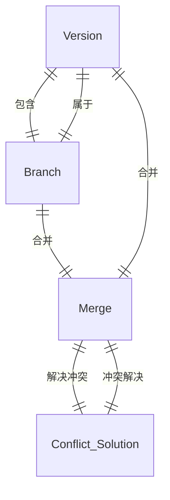

                 

## 版本控制：提示词迭代和管理的必要性

在软件工程和系统开发领域，版本控制是一种至关重要的技术手段。它不仅能够有效地管理和追踪代码的变更历史，还能在多人协作开发中确保代码的完整性和一致性。随着现代软件开发项目规模和复杂性的不断增加，版本控制的重要性愈发凸显。版本控制不仅有助于开发团队高效地进行代码迭代，还能够在项目演进过程中提供可靠的历史记录和安全保障。

### 1.1 版本控制的背景

版本控制的历史可以追溯到20世纪60年代，当时计算机科学家开始意识到在多用户环境中管理文件版本的需求。早期的版本控制系统主要是集中式的，如RS/6（Resource Sharing System 6），它由Commodore公司于1970年代开发，是第一个提供文件版本管理功能的系统。随着计算机技术的发展，版本控制系统逐渐变得更加复杂和强大，逐渐从集中式系统演变为分布式系统。

集中式版本控制系统（如RCS和CVS）在早期得到了广泛应用，但它们存在一些局限性。例如，中央仓库的单点故障可能会导致整个系统的瘫痪，而文件锁定机制可能会降低并行开发效率。为了解决这些问题，分布式版本控制系统（如Git和Mercurial）应运而生。

### 1.2 版本控制的概念

版本控制是一种跟踪和记录文件或代码变更的技术手段。以下是版本控制中的一些核心概念：

#### 版本

版本是代码或文件的一个特定状态，它通常由一个唯一的标识符来表示，如版本号或提交哈希值。每个版本都代表了代码的一个完整快照，可以从这个快照恢复到特定的状态。

#### 分支

分支是代码库中的一个独立副本，它允许开发者在不同的方向上独立地进行开发。分支使得并行开发成为可能，同时保持主分支的稳定性和一致性。

#### 合并

合并是将两个或多个分支的更改合并到一起的过程。这个过程通常涉及合并请求（Pull Request）和冲突解决。合并的目的是将不同分支上的改进和修复整合到主分支中。

#### 冲突解决

当两个或多个开发者对同一文件的不同部分进行了修改，并尝试合并这些更改时，可能会产生冲突。冲突解决是指解决这些冲突的过程，通常需要手动介入。

### 1.3 版本控制的重要性

版本控制的重要性体现在以下几个方面：

1. **代码管理**：版本控制系统能够跟踪代码的所有变更历史，确保代码的可追溯性和可复现性。
2. **团队协作**：版本控制系统能够支持多人协作开发，通过分支和合并机制协调不同开发者的工作。
3. **故障恢复**：通过历史记录，版本控制系统能够帮助快速定位和回滚到特定的代码状态，从而有效地解决故障。
4. **版本迭代**：版本控制系统支持快速迭代和发布新功能，同时确保老版本代码的可维护性。

### 1.4 版本控制的发展历程

从早期的集中式版本控制系统到现代的分布式版本控制系统，版本控制技术经历了巨大的发展。每个阶段都有其代表性和里程碑事件，如：

- **RCS（1970s）**：第一个提供版本管理功能的系统。
- **CVS（1980s-1990s）**：早期广泛使用的集中式版本控制系统。
- **SVN（2000s）**：改进的集中式版本控制系统，继续得到广泛应用。
- **Git（2005年）**：由Linus Torvalds创建的分布式版本控制系统，迅速成为开发者的首选。
- **Mercurial（2005年）**：另一个流行的分布式版本控制系统，与Git类似但有一些区别。

### 1.5 本章小结

通过以上对版本控制背景、概念和重要性的介绍，我们可以看到版本控制不仅在技术层面具有深远的意义，还在现代软件开发中发挥着不可替代的作用。在接下来的章节中，我们将进一步探讨版本控制工具的具体应用和实践经验。

## 核心概念与联系

在深入理解版本控制之前，我们需要掌握一些核心概念和它们之间的关系。这些概念是版本控制的基础，对于理解后续内容至关重要。以下是几个关键概念及其关系：

### 版本

版本是代码或文件的特定状态，通常由一个唯一的标识符来表示。版本可以是代码库的一个快照，也可以是特定功能或修复的一个实现。版本控制系统的核心功能之一就是跟踪这些版本的创建、更新和删除。

#### 版本属性

- **唯一标识**：每个版本都有一个唯一的标识符，如版本号或哈希值。
- **历史记录**：版本控制系统记录了每个版本的创建者、时间、变更内容等信息，便于追溯和管理。

### 分支

分支是代码库中的一个独立副本，它允许开发者在不影响主分支的情况下进行独立的开发。每个分支都有自己的版本历史，可以独立合并到主分支。

#### 分支类型

- **功能分支**：用于开发新功能。
- **修复分支**：用于修复已知问题。
- **发布分支**：用于准备发布新版本。

#### 分支属性

- **独立性**：分支允许开发者并行工作，不受主分支的直接影响。
- **合并**：分支开发完成后，需要将其更改合并回主分支。

### 合并

合并是将两个或多个分支的更改合并到一起的过程。这个过程通常涉及冲突解决，因为不同分支上的变更可能会相互冲突。

#### 合并类型

- **快照合并**：将一个分支的特定版本合并到另一个分支。
- **连续合并**：将一个分支的所有变更连续合并到另一个分支。

#### 合并属性

- **冲突解决**：合并过程中可能产生冲突，需要手动或自动解决。
- **一致性**：合并的目的是确保代码库的一致性和完整性。

### 冲突解决

冲突解决是指在合并过程中解决不同分支间冲突的过程。冲突通常发生在对同一文件的同一部分进行了不同的修改。

#### 冲突类型

- **文本冲突**：文本编辑器直接显示不同分支的修改内容。
- **结构冲突**：文件结构或目录结构的变更冲突。

#### 冲突解决方法

- **手动解决**：开发者手动查看冲突内容，选择保留哪一个变更。
- **自动解决**：某些版本控制系统能够自动解决一些简单的冲突。

### 关系

这些核心概念之间存在紧密的关系，如下所示：

- **版本**是代码的特定状态，每个版本对应一个代码库的历史快照。
- **分支**是基于某个版本创建的独立副本，允许开发者进行独立开发。
- **合并**是将分支上的变更整合到主分支的过程。
- **冲突解决**是合并过程中解决不同分支间冲突的方法。

### 表格对比

以下是一个核心概念属性对比表格，帮助读者更清晰地理解这些概念：

| 概念     | 属性                     | 关系                    |
|----------|--------------------------|-------------------------|
| 版本     | 唯一标识、历史记录       | 代码的特定状态          |
| 分支     | 独立性、合并             | 版本库的独立副本        |
| 合并     | 冲突解决、一致性         | 整合不同分支的变更      |
| 冲突解决 | 文本冲突、结构冲突、自动解决 | 解决合并过程中的冲突    |

### ER实体关系图

为了更直观地展示这些概念之间的关系，我们使用Mermaid绘制一个ER（实体关系）图：



在这个ER图中，`Version`（版本）是核心实体，它包含了所有代码的快照。`Branch`（分支）是独立的副本，基于版本创建，并可以合并回主分支。`Merge`（合并）和`Conflict_Solution`（冲突解决）则是与分支和版本相关联的操作。

通过这些核心概念及其关系的介绍，我们为后续章节的内容奠定了坚实的基础。在接下来的章节中，我们将进一步探讨版本控制工具，并深入分析这些概念在实际开发中的应用。

### 常见的版本控制工具

在版本控制领域，有几种工具被广泛使用，每种工具都有其独特的特点和适用场景。以下是几种主流的版本控制工具的介绍：

#### Git

Git 是由 Linux 内核的开发者 Linus Torvalds 创造的分布式版本控制系统。它具有高效的变更跟踪和分支管理功能，因此在开源项目和大型团队协作中非常流行。

**优点**：
- **分布式**：每个开发者都有自己的完整副本，可以进行离线工作。
- **快速**：通过 SHA-1 哈希算法确保数据的完整性。
- **灵活性**：支持多种分支策略，如线性、瀑布式、矩阵式。

**缺点**：
- **学习曲线**：Git 的命令行操作较为复杂，需要一定的学习成本。
- **历史记录问题**：在某些情况下，历史记录可能需要重写，这可能导致混乱。

#### SVN

SVN 是 Subversion 的简称，是一个集中式的版本控制系统。它易于使用，特别是在初学者和小型团队中。

**优点**：
- **简单**：集中式结构使得使用和管理较为简单。
- **稳定性**：经过多年的使用，SVN 被证明是一个稳定可靠的系统。

**缺点**：
- **单点故障**：中央仓库的单点故障可能导致整个系统瘫痪。
- **并行性**：集中式模型不利于并行开发。

#### Mercurial

Mercurial 是另一种分布式版本控制系统，与 Git 类似但有一些不同之处。它由 Matt Mackall 开发，特别适合对性能有高要求的团队。

**优点**：
- **性能**：Mercurial 在某些操作上比 Git 更快。
- **易用性**：Mercurial 的命令行接口被认为比 Git 更易用。

**缺点**：
- **社区和支持**：与 Git 相比，Mercurial 的社区和文档资源较少。

#### 其他版本控制工具

除了上述三种主要工具，还有一些其他版本控制工具，如 Bazaar、Hg（Mercurial）、PVCS 等。这些工具各有特色，适用于不同的开发场景。

**Bazaar**：
- **易用性**：提供直观的用户界面。
- **社区**：拥有强大的社区支持。

**Hg（Mercurial）**：
- **性能**：在某些操作上优于 Git。
- **插件**：支持丰富的插件和扩展。

**PVCS**：
- **企业级**：专为大型企业项目设计。
- **功能丰富**：提供复杂的权限管理和审核功能。

### 选择合适的版本控制工具

选择合适的版本控制工具需要考虑多个因素，包括团队规模、项目需求、个人偏好等。

- **小型团队**：对于小型团队或个人项目，SVN 或 Bazaar 可能是更好的选择，因为它们易于设置和管理。
- **大型项目**：对于大型项目和开源项目，Git 是首选，因为它提供了强大的分布式功能和支持。
- **企业级需求**：如果需要高级的权限管理和复杂的审核流程，PVCS 可能是更好的选择。

### 本章小结

通过以上对常见版本控制工具的介绍，我们可以看到每种工具都有其独特的优势和适用场景。选择合适的版本控制工具是确保团队协作和代码管理效率的关键。在下一章中，我们将深入探讨版本控制中的提示词迭代和管理，这是一个确保代码质量和团队协作的重要环节。

### 提示词概述

在版本控制中，提示词是一个关键概念，它用于描述和标识特定的代码变更。理解提示词的定义、作用和类型对于有效进行版本控制至关重要。

#### 提示词的定义

提示词是用于描述代码变更的一条信息，通常包含变更的内容、影响范围、作者等信息。在版本控制系统中，每次提交代码时都需要添加一个提示词，以便于后续的追踪和管理。提示词不仅提供了代码变更的上下文信息，还帮助团队理解每次提交的目的和背景。

#### 提示词的作用

提示词在版本控制中扮演着多个重要角色：

1. **变更追踪**：提示词记录了每次代码变更的具体内容和作者，有助于追溯代码历史和变更路径。
2. **代码管理**：通过提示词，版本控制系统可以有效地管理和组织代码库，提高代码的可读性和可维护性。
3. **团队协作**：在多人协作开发中，提示词提供了清晰的沟通渠道，帮助团队成员了解代码变更的目的和影响。

#### 提示词的类型

根据用途和内容，提示词可以分为以下几种类型：

1. **用户提示词**：这类提示词是由开发者编写的，用于描述代码变更的具体内容和目的。例如，“修复了登录页面bug”、“添加了用户注册功能”。
2. **系统提示词**：这类提示词是由版本控制系统自动生成的，用于描述代码操作的细节。例如，“创建分支”、“合并分支”、“提交更改”。

#### 提示词的管理

提示词的管理包括创建、更新和删除等操作。以下是一些关键的管理步骤：

1. **创建提示词**：在每次提交代码时，开发者需要编写一个清晰、具体的提示词。好的提示词应该简洁明了，同时提供足够的上下文信息。
2. **更新提示词**：在代码变更过程中，如果提示词需要修改，开发者应更新提示词以确保其与实际变更一致。
3. **删除提示词**：如果某个提示词不再相关或错误，开发者可以删除它，以保持代码库的整洁和准确。

#### 提示词的迭代

提示词的迭代是指定期评估和改进提示词的编写和使用的流程。以下是提示词迭代的一些关键步骤：

1. **评估**：定期评估现有提示词的有效性，确定是否存在模糊或冗长的提示词。
2. **改进**：根据评估结果，改进提示词的编写规范，例如缩短提示词长度、增加具体细节等。
3. **培训**：为开发团队提供提示词编写的培训，确保每个成员都理解并遵循统一的标准。

通过有效的提示词迭代，团队可以确保代码库的清晰性和可维护性，从而提高整体开发效率。

#### 本章小结

通过本章对提示词的定义、作用、类型及其管理的介绍，我们可以看到提示词在版本控制中的重要性。有效的提示词管理不仅有助于提高代码的可读性和可维护性，还能在团队协作中提供清晰的沟通渠道。在下一章中，我们将深入探讨如何通过版本控制工具实现提示词的迭代和管理。

### 提示词迭代过程

在版本控制中，提示词的迭代是一个持续改进的过程，它确保代码库的清晰性、一致性和可维护性。一个有效的迭代过程包括评估、改进和培训等步骤，以下是具体的迭代过程和管理策略：

#### 评估

提示词评估是迭代过程的第一步，目的是确定现有提示词的有效性和质量。评估可以通过以下方式进行：

1. **数据分析**：分析提示词的长度、内容覆盖范围、重复率等指标。一个高质量的提示词应简洁明了，同时提供足够的信息。
2. **团队反馈**：收集开发团队的反馈，了解他们对现有提示词的满意度和使用体验。通过团队讨论和问卷调查等方式，获取真实的使用情况和改进建议。
3. **案例研究**：选取一些典型的代码变更案例，分析其提示词的编写质量和效果。通过对比不同类型的提示词，找出最佳实践。

#### 改进

在评估完成后，下一步是改进提示词的编写规范和内容。以下是一些改进策略：

1. **规范制定**：根据评估结果，制定一套统一的提示词编写规范。规范应包括提示词的格式、内容要求、长度限制等，以确保每个提示词都能清晰地传达变更信息。
2. **模板应用**：为常见类型的代码变更提供提示词模板，例如bug修复、功能添加、性能优化等。模板应简洁明了，方便开发者快速使用。
3. **示例展示**：提供一些高质量的提示词示例，供开发者参考。通过示例展示，帮助团队成员理解如何编写高质量的提示词。

#### 培训

提示词迭代不仅需要制定规范和模板，还需要通过培训确保开发团队理解和遵循这些规范。以下是一些培训策略：

1. **内部培训**：组织内部培训课程，介绍提示词编写的重要性和最佳实践。培训内容应包括提示词的格式、编写技巧、常见问题及解决方案等。
2. **实战演练**：通过实战演练，让开发者实际编写和审查提示词。实战演练可以帮助开发者更好地理解和应用提示词规范，同时发现和解决实际问题。
3. **定期回顾**：定期回顾培训效果，评估开发团队对提示词规范的理解和应用程度。通过回顾，及时调整培训内容和策略，确保培训效果。

#### 管理策略

有效的提示词迭代和管理还需要一系列管理策略，以确保整个过程顺利进行：

1. **反馈机制**：建立有效的反馈机制，鼓励开发者提供对提示词编写和迭代的意见和建议。通过反馈机制，可以及时发现和解决问题，不断改进提示词质量。
2. **跟踪记录**：记录每次提示词评估、改进和培训的过程，确保整个迭代过程的透明和可追溯。跟踪记录有助于评估迭代效果，并为未来的迭代提供参考。
3. **持续改进**：提示词迭代是一个持续改进的过程，不应一次性完成。应定期评估和改进提示词，确保其始终符合团队需求和发展。

#### 本章小结

通过上述对提示词迭代过程的详细介绍，我们可以看到，有效的提示词迭代和管理对于提高代码质量和团队协作效率至关重要。通过评估、改进和培训等步骤，团队可以确保提示词的清晰性和一致性，从而更好地管理代码库。在下一章中，我们将深入探讨版本控制在实际项目中的应用和实践，进一步展示提示词迭代和管理的具体效果。

### 版本控制实际应用

在软件工程和系统开发中，版本控制的应用至关重要，它不仅能够管理代码变更，还能提升团队协作效率和项目可维护性。以下将通过一个具体的实际项目，详细介绍如何使用版本控制工具进行项目开发，并分析其核心实现和效果。

#### 项目背景

假设我们正在开发一个电子商务网站，该项目需要实现用户注册、商品浏览、购物车、订单管理等核心功能。项目团队由前端开发、后端开发、测试人员和产品经理等多角色组成，团队成员分布在不同的地理位置，需要高效协同工作。为了确保代码的一致性和可追溯性，我们选择使用Git进行版本控制。

#### 环境搭建

首先，团队需要在本地计算机上安装Git，并配置用户信息，以便于代码的追踪和协作。以下是一个简单的环境搭建流程：

1. **安装Git**：在官方网站（[https://git-scm.com/downloads](https://git-scm.com/downloads)）下载并安装Git。
2. **配置用户信息**：
    ```bash
    git config --global user.name "Your Name"
    git config --global user.email "your.email@example.com"
    ```

接下来，我们将代码托管到一个代码托管平台，如GitHub或GitLab。团队可以在平台上创建一个仓库，并将其克隆到本地计算机：

```bash
git clone https://github.com/your-username/ecommerce.git
cd ecommerce
```

#### 版本控制操作指南

在项目开发过程中，版本控制操作包括初始化仓库、提交代码、分支管理、合并代码和解决冲突等。以下是这些操作的具体指南：

1. **初始化仓库**：

    在项目目录中，执行以下命令初始化本地仓库：

    ```bash
    git init
    ```

    这将创建一个隐藏的`.git`目录，用于存储版本控制信息。

2. **提交代码**：

    在对项目进行了更改后，需要提交这些更改到版本库中。例如，修改了`index.html`文件后，执行以下命令：

    ```bash
    git add index.html
    git commit -m "Update homepage layout"
    ```

    `git add`命令将文件添加到暂存区，`git commit`命令则将暂存区的更改提交到本地仓库，并附带一条描述性信息。

3. **分支管理**：

    在项目开发过程中，我们通常会在主分支（通常命名为`main`或`master`）之外创建多个功能分支，以便于独立开发新功能或修复问题。创建一个新功能分支的命令如下：

    ```bash
    git checkout -b new-feature-login
    ```

    这将创建并切换到一个名为`new-feature-login`的新分支。

4. **合并代码**：

    在新功能开发完成后，我们需要将其合并到主分支。以下是一个简单的合并过程：

    ```bash
    git checkout main
    git merge new-feature-login
    ```

    这会将`new-feature-login`分支上的更改合并到主分支。

5. **解决冲突**：

    在合并过程中，如果出现冲突，Git会暂停合并过程，并提示冲突的文件。开发者需要手动解决这些冲突，然后继续合并：

    ```bash
    git add resolved-file
    git commit -m "Merge new-feature-login branch"
    ```

#### 代码应用解读与分析

在版本控制过程中，我们不仅需要执行上述基本操作，还需要深入理解代码的变更和应用。

1. **代码审查**：

    在每个提交或合并过程中，团队成员应进行代码审查，确保代码质量。代码审查可以通过Git的提交信息、Pull Request（GitHub）或代码评审工具（如GitLab）进行。

    ```bash
    git log --author="Your Name"
    ```

    这将显示某个开发者提交的历史记录，方便代码审查。

2. **分支策略**：

    团队应制定合适的分支策略，例如功能分支、修复分支和发布分支。这些分支有助于确保代码库的整洁和可维护性。例如：

    ```bash
    git checkout -b feature-X
    git push -u origin feature-X
    ```

    这将创建一个功能分支并将其推送到远程仓库，以便其他团队成员进行协作。

3. **版本发布**：

    在完成所有功能开发后，团队可以将代码合并到发布分支，并进行完整的测试和发布。以下是一个发布流程的示例：

    ```bash
    git checkout release-1.0
    git merge main
    git push origin release-1.0
    ```

    这会将主分支的更改合并到发布分支，并推送到远程仓库。

#### 项目实战

以下是一个具体的实际项目实战，包括环境搭建、系统实现和代码解读：

1. **环境搭建**：

    在开始开发之前，团队需搭建开发环境，包括安装必要的依赖库和工具。例如，使用Docker容器化技术确保环境一致性：

    ```bash
    docker-compose up -d
    ```

    这将启动一个包含所有依赖的服务容器。

2. **系统实现**：

    在开发过程中，团队会创建多个功能分支，例如`feature-user-auth`、`feature-shopping-cart`等，每个分支负责实现一个特定的功能模块。

    ```bash
    git checkout -b feature-user-auth
    ```

    在`feature-user-auth`分支上，开发者实现用户注册和登录功能，并提交代码：

    ```bash
    git add .
    git commit -m "Add user authentication"
    git push
    ```

3. **代码解读与分析**：

    通过Git日志，团队可以查看代码变更历史：

    ```bash
    git log --oneline
    ```

    这将显示每次提交的简要信息，方便团队成员理解代码演变过程。此外，团队还可以使用Git blame工具查看代码文件的修改历史：

    ```bash
    git blame file.txt
    ```

    这将高亮显示每个行最后一次修改的用户和日期。

#### 项目小结

通过以上实际项目的介绍，我们可以看到版本控制工具在软件开发中的重要性。Git等版本控制工具不仅帮助团队管理代码变更，还提升了代码质量和团队协作效率。有效的版本控制实践，如代码审查、分支管理和冲突解决，是确保项目成功的关键。通过持续迭代和改进，团队可以不断提高开发效率和质量，为企业的持续创新提供有力支持。

### 版本控制最佳实践

在版本控制中，遵循最佳实践是确保项目顺利推进和团队高效协作的关键。以下是一些常见的最佳实践，包括团队协作、项目管理、安全管理等方面的建议：

#### 团队协作最佳实践

1. **代码审查**：在进行提交之前，团队成员应进行代码审查，确保代码质量。这有助于发现潜在问题，提高代码一致性。
2. **分支策略**：制定明确的分支策略，如功能分支、修复分支和发布分支。这有助于隔离不同类型的工作，减少冲突和混乱。
3. **定期同步**：定期合并各分支的更改到主分支，确保代码库的一致性和最新性。
4. **权限管理**：根据团队成员的角色和职责，设置合适的权限，确保只有授权人员能够进行关键操作。

#### 项目管理最佳实践

1. **版本规划**：在项目开始前，制定详细的版本规划，包括版本目标、发布日期和功能列表。
2. **任务分配**：根据团队成员的技能和兴趣，合理分配任务，确保每个任务都有明确的负责人。
3. **进度跟踪**：使用版本控制工具的进度跟踪功能，监控项目进展，及时调整计划和资源。
4. **文档管理**：保持项目文档的及时更新，包括设计文档、用户手册和测试用例，确保团队成员对项目有清晰的理解。

#### 安全管理最佳实践

1. **备份策略**：定期备份代码库，防止数据丢失。可以使用自动化工具进行备份，并确保备份存储在安全的地方。
2. **权限控制**：严格管理权限，确保只有授权人员能够访问和修改代码库。
3. **审核日志**：记录所有关键操作的日志，包括提交、合并和分支创建等，以便在出现问题时进行追踪和分析。
4. **漏洞修复**：定期检查和修复代码库中的漏洞，确保系统的安全性。

#### 版本控制工具的优化

1. **配置优化**：根据团队需求，调整版本控制工具的配置，优化其性能和易用性。
2. **自动化流程**：使用自动化工具和脚本，简化常见操作，如代码同步、备份和构建等。
3. **集成工具**：将版本控制工具与其他开发工具（如代码审查工具、持续集成/持续部署工具）集成，实现更高效的工作流程。

#### 本章小结

通过遵循版本控制的最佳实践，团队可以显著提高开发效率、代码质量和协作效果。在项目开发过程中，应根据实际情况灵活应用这些最佳实践，确保项目顺利进行。在下一章中，我们将推荐一些拓展阅读资源，帮助读者进一步学习和提升版本控制技能。

### 拓展阅读

为了帮助读者更深入地了解版本控制和提示词迭代与管理，我们推荐以下书籍、在线课程和版本控制工具教程，这些资源将为您提供丰富的知识和实用的技巧。

#### 书籍推荐

1. **《版本控制指南：Git、SVN和Mercurial》**
   - 作者：Joel Spolsky
   - 简介：这是一本全面的版本控制入门指南，涵盖了Git、SVN和Mercurial的使用方法和最佳实践。

2. **《Git权威指南》**
   - 作者：Scott Chacon 和 Ben Straub
   - 简介：这本书是Git的权威指南，详细介绍了Git的底层机制、高级功能和最佳实践。

3. **《版本控制的秘密》**
   - 作者：Jon Loeliger 和 Matthew Doar
   - 简介：这本书通过案例研究和实践技巧，揭示了版本控制背后的核心原理。

#### 在线课程与讲座

1. **GitHub官方教程**
   - 网址：[https://education.github.com/courses](https://education.github.com/courses)
   - 简介：GitHub提供了多个在线教程和课程，涵盖了从基础到高级的Git知识。

2. **Git中文社区**
   - 网址：[https://git-scm.com/book/zh/v2](https://git-scm.com/book/zh/v2)
   - 简介：Git中文社区提供了丰富的Git中文教程和资源，适合不同水平的读者。

3. **GitLab教程**
   - 网址：[https://about.gitlab.com/gitlab-com/tutorial/](https://about.gitlab.com/gitlab-com/tutorial/)
   - 简介：GitLab提供了详细的教程和指南，帮助用户掌握GitLab的基本操作和安全配置。

#### 版本控制工具教程

1. **Git教程**
   - 网址：[https://git-scm.com/docs](https://git-scm.com/docs)
   - 简介：Git官方文档提供了详细的命令行教程和参考手册，适合初学者和高级用户。

2. **SVN教程**
   - 网址：[https://www.cvshome.org/docs/svn-book.html](https://www.cvshome.org/docs/svn-book.html)
   - 简介：Subversion官方文档提供了全面的SVN教程和操作指南。

3. **Mercurial教程**
   - 网址：[https://www.mercurial-scm.org/wiki/QuickStart](https://www.mercurial-scm.org/wiki/QuickStart)
   - 简介：Mercurial官方文档提供了简洁易懂的快速入门教程。

通过这些书籍、在线课程和教程，读者可以系统学习版本控制的理论和实践，提升自己的技能，更好地应用于实际项目开发中。

## 总结与展望

通过本文的详细阐述，我们系统地介绍了版本控制的核心概念、常见工具、提示词迭代和管理，以及实际应用的最佳实践。版本控制不仅是软件开发中的基石，更是团队协作、代码管理、故障恢复的关键手段。有效的版本控制能够提高开发效率，保障代码质量，并增强项目的可维护性。

未来的研究可以在以下几个方面进行深入：

1. **自动化提示词生成**：探索如何利用自然语言处理技术自动生成高质量的提示词，以减少开发者的负担。
2. **分布式版本控制优化**：研究分布式版本控制系统的性能优化和安全性问题，提高其在大型团队和高并发场景下的表现。
3. **版本控制与智能工具集成**：探索如何将版本控制与智能工具（如智能代码审查、自动测试）集成，实现更智能的开发流程。

通过不断探索和创新，版本控制技术将继续为软件开发和系统开发领域带来更多价值。希望本文能对您在版本控制领域的实践和研究有所启发。

