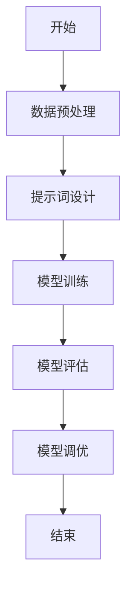
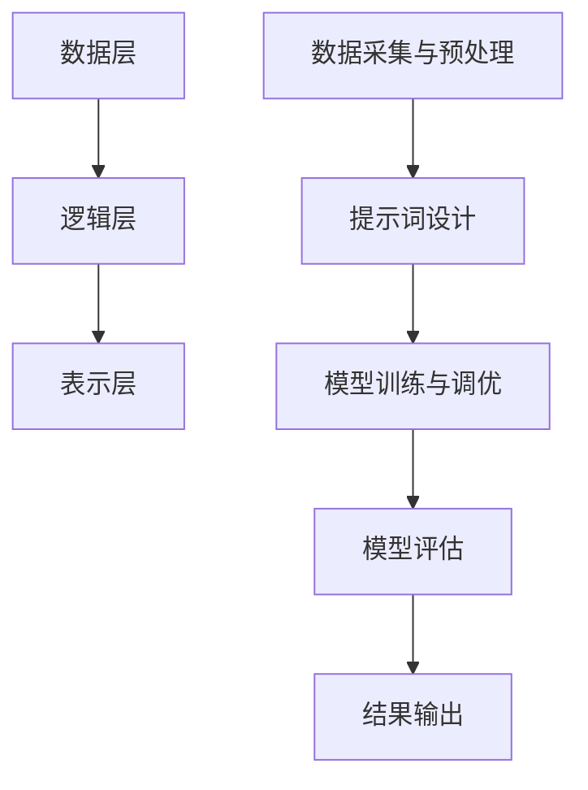
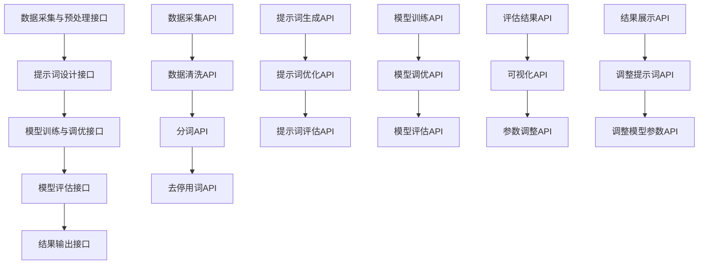
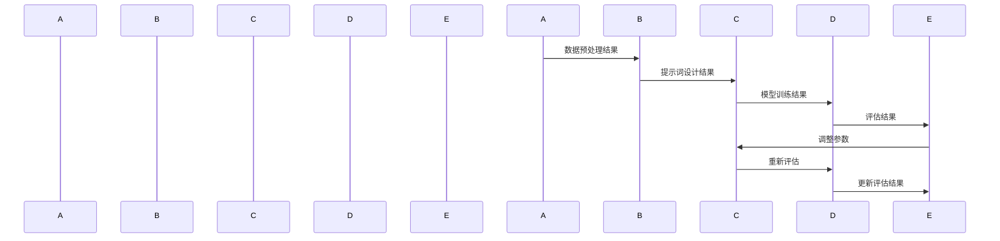

                 


### 第1章: 模型能力与提示词工程

#### 1.1 问题背景

**人工智能的发展历程**

人工智能（AI）的概念最早可以追溯到20世纪50年代，当时科学家们提出了“机器能够执行需要人类智能的任务”的想法。自那时以来，AI经历了多个发展阶段，包括早期的符号人工智能、专家系统，以及近年来的深度学习和神经网络。每一次的技术革新都推动了AI模型能力的提升，使得机器能够处理更复杂的问题。

**模型能力的兴起**

随着AI技术的发展，模型能力逐渐成为研究的核心。模型能力指的是AI模型在特定任务上的表现能力，包括识别图像、理解自然语言、生成文本、进行决策等。模型能力的提升主要依赖于大量高质量的数据和复杂的算法。近年来，深度学习模型如GPT、BERT、ViT等在大规模数据集上的突破性表现，使得模型能力得到了显著提升。

**提示词工程的重要性**

提示词工程是提升模型能力的重要手段。提示词（Prompt）是一种引导模型进行特定任务的方式，通过巧妙设计的提示词，可以指导模型更好地理解任务目标，提高任务的完成度。提示词工程涉及到提示词的设计、优化、评估等多个环节，是模型能力提升的关键环节。

#### 1.2 问题描述

**模型能力的挑战**

尽管模型能力有了显著提升，但在实际应用中仍然面临诸多挑战。首先，模型训练需要大量高质量的数据，这通常意味着高昂的时间和计算成本。其次，不同任务对模型能力的要求各异，如何设计通用且高效的模型成为一大难题。此外，模型的解释性仍然不足，使得在某些关键领域中的应用受到限制。

**提示词工程的难点**

提示词工程同样面临诸多难点。首先，提示词的设计需要结合具体任务背景，没有统一的模板可以遵循。其次，提示词的优化过程通常涉及大量的实验和调参，这需要大量的时间和计算资源。此外，提示词的评估和优化也是一个复杂的过程，需要综合考虑多种因素。

**目标与期望成果**

本文的目标是深入探讨模型能力和提示词工程的关系，分析其核心概念和原理，提供实用的设计和优化策略。通过本文的阅读，读者应该能够：

1. 理解模型能力的定义和重要性。
2. 掌握提示词工程的基本原理和方法。
3. 学会设计和优化提示词，以提升模型能力。
4. 了解模型能力和提示词工程在实际应用中的挑战和解决方案。

#### 1.3 问题解决

**理解模型能力的核心**

模型能力可以分为多个层次，包括感知能力、认知能力和决策能力。感知能力指的是模型对输入数据的识别和理解；认知能力指的是模型对知识的获取和运用；决策能力指的是模型在特定情境下的决策能力。理解模型能力的核心是识别这些层次之间的关系，以及如何通过提示词工程来提升这些能力。

**提示词工程的基本原理**

提示词工程的基本原理是通过设计引导性的输入，帮助模型更好地理解任务目标。这包括：

1. **明确任务目标**：设计提示词前，需要明确任务目标，以确保提示词能够引导模型朝着正确的方向学习。
2. **构建上下文**：通过构建上下文，为模型提供更多的信息，帮助模型更好地理解任务。
3. **引导学习过程**：通过特定的提示词设计，引导模型的学习过程，提高模型对特定任务的适应性。

**边界与外延**

边界与外延是理解模型能力和提示词工程的重要概念。边界指的是模型能力的极限，即模型在特定任务上的最大表现。外延则指的是模型能力在不同任务上的扩展和应用。通过理解边界与外延，我们可以更好地设计提示词工程，使模型在不同任务上都能发挥最大潜力。

#### 1.4 概念结构与核心要素

**模型能力的要素**

模型能力的要素主要包括：

1. **数据质量**：高质量的数据是模型能力的基础，数据的质量直接影响模型的性能。
2. **算法复杂性**：算法的复杂性决定了模型的学习能力和表现。
3. **模型参数**：模型参数的设置直接影响模型的表现。
4. **训练时间**：模型的训练时间决定了模型的能力提升速度。

**提示词工程的组成部分**

提示词工程的组成部分包括：

1. **提示词设计**：设计高质量的提示词是提升模型能力的关键。
2. **提示词优化**：通过实验和调参，优化提示词的质量和效果。
3. **提示词评估**：评估提示词的效果，以确定哪些提示词能够真正提升模型能力。

**关键技术点**

关键技术点包括：

1. **数据预处理**：数据预处理是提示词工程的重要环节，包括数据清洗、归一化、特征提取等。
2. **模型解释性**：提高模型的可解释性，有助于理解模型的行为和提升模型能力。
3. **自动化提示词生成**：通过自动化工具生成提示词，提高提示词工程的效率。

#### 1.5 本章小结

本章介绍了模型能力和提示词工程的基本概念和背景，分析了模型能力的挑战和提示词工程的难点，并提出了目标与期望成果。通过本章的学习，读者应该对模型能力和提示词工程有了初步的了解，为后续章节的深入学习打下基础。

---

在接下来的章节中，我们将深入探讨模型能力和提示词工程的核心概念、原理和应用，通过具体的案例和实践，帮助读者全面掌握这一领域的关键技术。

## 第2章: 模型能力详解

#### 2.1 模型能力定义

模型能力是指人工智能模型在特定任务上的表现和效果。它通常由以下几个关键要素组成：

1. **数据适应性**：模型是否能够适应不同类型和来源的数据。
2. **泛化能力**：模型在未见过的数据上表现的好坏。
3. **鲁棒性**：模型在面对噪声和异常数据时的稳定性。
4. **效率**：模型在处理任务时的计算效率和资源消耗。

**模型能力的层级**

模型能力可以分为以下几个层级：

1. **感知能力**：指模型对输入数据的识别和理解能力，如图像识别、语音识别等。
2. **认知能力**：指模型对知识的获取和运用能力，如自然语言处理、知识图谱构建等。
3. **决策能力**：指模型在特定情境下的决策能力，如自动驾驶、智能推荐等。

#### 2.2 模型能力属性特征对比

为了更好地理解模型能力的属性特征，我们可以将其与人类智能进行对比：

| 模型能力属性特征 | 人类智能对应能力 | 说明 |
|----------------|----------------|-----|
| 数据适应性     | 学习能力        | 模型需要适应不同类型的数据源 |
| 泛化能力       | 创造力          | 模型需要在未见过的数据上表现良好 |
| 鲁棒性         | 抗干扰能力      | 模型需要在噪声和异常数据下稳定运行 |
| 效率           | 时间管理        | 模型需要高效地完成任务，减少资源消耗 |

通过这个表格，我们可以看到模型能力与人类智能在各个属性特征上的相似之处和差异。

#### 2.3 模型能力与提示词工程的关系

**提示词工程在模型能力提升中的作用**

提示词工程是提升模型能力的重要手段。通过设计高质量的提示词，我们可以引导模型更好地理解任务目标，提高模型在特定任务上的表现。

1. **明确任务目标**：提示词可以帮助模型明确任务目标，从而更专注于任务的核心。
2. **提供上下文信息**：提示词可以为模型提供更多的上下文信息，帮助模型更好地理解输入数据。
3. **引导学习过程**：提示词可以引导模型的学习过程，使其更快速地收敛到最优解。

**提示词工程与模型能力提升的策略**

1. **优化提示词设计**：通过实验和反馈，不断优化提示词的设计，提高其质量。
2. **多任务学习**：通过多任务学习，使模型在多个任务上获得经验，提高其泛化能力。
3. **增强模型解释性**：提高模型的可解释性，有助于理解模型的行为，从而更好地优化提示词。

**结论**

模型能力和提示词工程密切相关。通过设计高质量的提示词，我们可以有效提升模型在特定任务上的能力。同时，理解模型能力的属性特征，有助于我们更好地进行提示词工程的设计和优化。

---

在本章中，我们详细介绍了模型能力的定义、属性特征对比，以及提示词工程在模型能力提升中的作用和策略。在下一章中，我们将深入探讨提示词工程的基础知识，包括其定义、基本流程和关键技术。

## 第3章: 提示词工程基础

### 3.1 提示词工程的定义

提示词工程是一种系统的方法，旨在通过设计、优化和评估提示词来提升人工智能模型在特定任务上的表现。提示词（Prompt）是指提供给模型的一段引导性文本，旨在帮助模型更好地理解任务目标，提供上下文信息，引导模型学习过程。与传统的数据驱动方法不同，提示词工程更加注重人工干预和指导，通过巧妙设计的提示词，可以显著提升模型的性能和效果。

### 3.2 提示词工程的基本流程

提示词工程的基本流程可以分为以下几个阶段：

#### 数据采集与预处理

数据采集是提示词工程的第一步，需要收集与任务相关的数据集。这些数据集可以是结构化的，如数据库，也可以是非结构化的，如图像、文本和音频。数据预处理包括数据清洗、归一化和特征提取等步骤，以确保数据的质量和一致性。

- **数据清洗**：去除数据集中的噪声和错误。
- **归一化**：将数据转换到统一的尺度，以便模型处理。
- **特征提取**：从原始数据中提取有助于模型学习的特征。

#### 提示词设计

提示词设计是提示词工程的核心环节，需要根据任务目标设计高质量的提示词。提示词的设计原则包括：

- **明确任务目标**：确保提示词清晰地传达任务目标，使模型能够理解并专注于核心任务。
- **提供上下文信息**：通过提供相关上下文信息，帮助模型更好地理解输入数据。
- **引导学习过程**：设计提示词以引导模型学习过程，使其更快地收敛到最优解。

#### 模型训练与调优

模型训练与调优是基于设计好的提示词进行模型训练和性能优化。这一阶段主要包括：

- **模型训练**：使用设计好的提示词和数据集训练模型，使其在特定任务上获得经验。
- **模型调优**：通过调整模型参数和提示词，优化模型性能。

#### 模型评估与优化

模型评估与优化是确保模型性能的关键步骤。通过评估模型在不同任务上的表现，可以识别出需要改进的方面，然后进行相应的优化。

- **模型评估**：使用独立的测试集评估模型性能，包括准确率、召回率、F1分数等指标。
- **提示词优化**：根据模型评估结果，调整提示词设计，以提高模型性能。

### 3.3 提示词工程的关键技术

#### 提示词优化

提示词优化是提升模型能力的重要手段，主要包括：

- **提示词长度**：不同长度的提示词对模型性能有不同的影响，需要通过实验确定最佳长度。
- **提示词内容**：提示词的内容需要根据任务目标进行设计，以提供有益的信息和指导。
- **提示词形式**：提示词的形式（如文本、图像、音频等）也会影响模型性能，需要根据任务特点进行选择。

#### 模型解释性

提高模型的可解释性是理解模型行为和优化提示词的重要手段。模型解释性技术包括：

- **模型可视化**：使用可视化工具展示模型内部结构和操作。
- **解释性算法**：使用特定的算法，如SHAP（SHapley Additive exPlanations），解释模型对特定输入的预测结果。

#### 自动化提示词生成

自动化提示词生成是提高提示词工程效率的关键技术。通过使用自然语言处理（NLP）技术，可以自动生成高质量的提示词，从而节省时间和人力成本。自动化提示词生成的方法包括：

- **模板生成**：使用预定义的模板生成提示词。
- **数据驱动生成**：通过分析大量数据，学习生成高质量的提示词。

### 3.4 本章小结

本章详细介绍了提示词工程的定义、基本流程和关键技术。通过数据采集与预处理、提示词设计、模型训练与调优、模型评估与优化等步骤，我们可以系统地提升模型在特定任务上的表现。提示词优化、模型解释性和自动化提示词生成等关键技术是提升模型能力和工程效率的关键。在下一章中，我们将通过实际案例，深入探讨提示词工程在自然语言处理、图像识别和推荐系统等领域的应用。

## 第4章: 提示词工程应用案例

### 4.1 自然语言处理

自然语言处理（NLP）是AI领域的一个重要分支，提示词工程在NLP中的应用非常广泛。以下是一些典型的NLP应用案例：

#### 文本分类

文本分类是指将文本数据按照预定义的类别进行分类。例如，将新闻文章分为体育、财经、娱乐等类别。提示词工程在文本分类中的应用主要体现在以下几个方面：

- **类别提示词设计**：为每个类别设计特定的提示词，以帮助模型更好地理解类别特征。例如，为体育类别设计包含“比赛”、“球队”、“球员”等词汇的提示词。
- **上下文提示词**：提供与文本内容相关的上下文信息，如相关新闻、背景知识等，以帮助模型更好地理解文本内容。
- **调参优化**：通过调整提示词的长度、内容和形式，优化模型性能。

#### 文本生成

文本生成是指根据给定提示生成相应的文本。例如，生成新闻摘要、故事、对话等。提示词工程在文本生成中的应用包括：

- **提示词引导**：使用特定的提示词引导模型生成文本，如“请写一篇关于人工智能的论文摘要”。
- **上下文生成**：通过构建丰富的上下文信息，帮助模型生成更加连贯和自然的文本。
- **生成式模型优化**：通过优化生成模型的结构和参数，提高生成文本的质量。

### 4.2 图像识别

图像识别是指从图像中识别出特定的对象或场景。提示词工程在图像识别中的应用主要体现在以下几个方面：

#### 目标检测

目标检测是指从图像中检测出特定的对象。例如，检测图像中的车辆、行人等。提示词工程在目标检测中的应用包括：

- **目标提示词**：为每个目标设计特定的提示词，以帮助模型更好地识别目标。例如，为车辆设计包含“车”、“车轮”、“方向盘”等词汇的提示词。
- **上下文提示词**：提供与目标相关的上下文信息，如场景背景、其他物体等，以提高目标识别的准确性。
- **模型调优**：通过调整模型参数和提示词，优化目标检测性能。

#### 图像分类

图像分类是指将图像按照预定义的类别进行分类。例如，将图像分为猫、狗、植物等类别。提示词工程在图像分类中的应用包括：

- **类别提示词**：为每个类别设计特定的提示词，以帮助模型更好地理解类别特征。例如，为猫类别设计包含“猫”、“猫爪”、“猫耳朵”等词汇的提示词。
- **上下文提示词**：提供与图像内容相关的上下文信息，如相关图片、背景知识等，以提高图像分类的准确性。
- **模型调优**：通过调整模型参数和提示词，优化图像分类性能。

### 4.3 推荐系统

推荐系统是指根据用户的历史行为和兴趣，向用户推荐相关的产品、内容或服务。提示词工程在推荐系统中的应用包括：

#### 商品推荐

商品推荐是指根据用户的历史购买记录和浏览行为，推荐用户可能感兴趣的商品。提示词工程在商品推荐中的应用包括：

- **用户行为提示词**：为用户的历史行为设计特定的提示词，以帮助模型更好地理解用户兴趣。例如，为用户浏览过的商品设计包含“时尚”、“运动”、“家居”等词汇的提示词。
- **上下文提示词**：提供与用户行为相关的上下文信息，如用户偏好、相关用户行为等，以提高商品推荐的准确性。
- **协同过滤**：结合协同过滤算法，通过分析用户之间的相似性，优化商品推荐性能。

#### 内容推荐

内容推荐是指根据用户的浏览历史和兴趣，推荐用户可能感兴趣的内容，如新闻、文章、视频等。提示词工程在内容推荐中的应用包括：

- **内容特征提示词**：为用户感兴趣的内容设计特定的提示词，以帮助模型更好地理解用户兴趣。例如，为用户喜欢的文章设计包含“科技”、“健康”、“旅行”等词汇的提示词。
- **上下文提示词**：提供与内容相关的上下文信息，如相关内容、作者信息等，以提高内容推荐的准确性。
- **深度学习模型**：使用深度学习模型，如序列模型和注意力机制，优化内容推荐性能。

### 4.4 本章小结

本章通过自然语言处理、图像识别和推荐系统等应用案例，详细介绍了提示词工程在实际项目中的应用。通过巧妙设计的提示词，可以有效提升模型在特定任务上的表现。下一章将深入探讨算法原理，包括数学模型和公式讲解，以及具体的案例应用。

## 第5章: 算法原理讲解

### 5.1 算法概述

提示词工程中的算法设计是提升模型能力的关键。在这一章中，我们将详细介绍提示词工程中的主要算法原理，包括数学模型和公式，并通过Python源代码进行具体阐述。

### 5.2 算法流程图

为了更清晰地理解算法流程，我们可以使用Mermaid绘制算法的流程图。以下是一个简化的提示词工程算法流程图示例：



### 5.3 数学模型和公式讲解

在提示词工程中，数学模型和公式起到了核心作用。以下是一些常见的数学模型和公式：

#### 提示词优化公式

提示词优化公式主要用于计算提示词的质量，以下是一个简化的提示词优化公式：

$$
Q = f(W, P, D)
$$

其中，$Q$表示提示词质量，$W$表示权重矩阵，$P$表示提示词向量，$D$表示数据集。

#### 模型训练公式

模型训练公式主要用于计算模型参数的更新，以下是一个简化的模型训练公式：

$$
\theta = \theta - \alpha \cdot \nabla_{\theta} J(\theta)
$$

其中，$\theta$表示模型参数，$\alpha$表示学习率，$J(\theta)$表示损失函数。

### 5.4 举例说明

为了更好地理解上述数学模型和公式，我们可以通过一个具体的案例进行说明。

#### 案例背景

假设我们使用一个简单的神经网络模型进行文本分类任务，数据集包含1000篇新闻文章和对应的类别标签。

#### 步骤1：数据预处理

首先，我们对数据集进行预处理，包括文本清洗、分词和词向量转换。

```python
import pandas as pd
from sklearn.model_selection import train_test_split
from keras.preprocessing.text import Tokenizer
from keras.preprocessing.sequence import pad_sequences

# 加载数据集
data = pd.read_csv('news_data.csv')
X = data['text']
y = data['label']

# 数据集拆分
X_train, X_test, y_train, y_test = train_test_split(X, y, test_size=0.2, random_state=42)

# 文本分词和词向量转换
tokenizer = Tokenizer(num_words=10000)
tokenizer.fit_on_texts(X_train)
X_train_seq = tokenizer.texts_to_sequences(X_train)
X_test_seq = tokenizer.texts_to_sequences(X_test)

# 数据集填充
max_len = 100
X_train_pad = pad_sequences(X_train_seq, maxlen=max_len)
X_test_pad = pad_sequences(X_test_seq, maxlen=max_len)
```

#### 步骤2：模型训练

接下来，我们使用简单的神经网络模型进行训练。

```python
from keras.models import Sequential
from keras.layers import Embedding, LSTM, Dense

# 构建模型
model = Sequential()
model.add(Embedding(input_dim=10000, output_dim=128, input_length=max_len))
model.add(LSTM(units=128))
model.add(Dense(units=1, activation='sigmoid'))

# 编译模型
model.compile(optimizer='adam', loss='binary_crossentropy', metrics=['accuracy'])

# 训练模型
model.fit(X_train_pad, y_train, epochs=10, batch_size=32, validation_data=(X_test_pad, y_test))
```

#### 步骤3：模型评估

最后，我们对训练好的模型进行评估，计算模型的准确率。

```python
# 评估模型
loss, accuracy = model.evaluate(X_test_pad, y_test)
print(f'测试集准确率: {accuracy:.2f}')
```

通过这个案例，我们可以看到如何使用Python代码实现提示词工程中的关键步骤，包括数据预处理、模型训练和模型评估。在实际应用中，我们可以根据具体任务需求，设计更加复杂的算法模型和提示词，以提升模型能力。

---

在本章中，我们详细介绍了提示词工程中的算法原理，包括算法流程图、数学模型和公式，并通过具体的Python代码示例进行了阐述。通过这些算法和公式，我们可以更好地理解和优化提示词工程，提升模型在各类任务中的表现。

## 第6章: 数学模型和数学公式

### 6.1 模型能力评价

在评估模型能力时，我们通常会使用一系列指标来衡量模型在不同任务上的表现。以下是一些常用的数学模型和数学公式：

#### 准确率（Accuracy）

准确率是指模型正确预测的样本数占总样本数的比例，公式如下：

$$
Accuracy = \frac{TP + TN}{TP + FN + FP + TN}
$$

其中，$TP$表示真阳性，$TN$表示真阴性，$FP$表示假阳性，$FN$表示假阴性。

#### 召回率（Recall）

召回率是指模型正确识别的样本数占实际正样本数的比例，公式如下：

$$
Recall = \frac{TP}{TP + FN}
$$

#### 精确率（Precision）

精确率是指模型正确识别的样本数占识别为正样本的样本数比例，公式如下：

$$
Precision = \frac{TP}{TP + FP}
$$

#### F1分数（F1 Score）

F1分数是精确率和召回率的加权平均，用于综合评估模型性能，公式如下：

$$
F1 Score = \frac{2 \cdot Precision \cdot Recall}{Precision + Recall}
$$

### 6.2 提示词设计原理

提示词设计是提升模型能力的关键步骤。以下是一些常用的数学模型和公式，用于设计和评估提示词：

#### 提示词质量评估

提示词质量评估可以使用以下公式：

$$
Q = f(W, P, D)
$$

其中，$Q$表示提示词质量，$W$表示权重矩阵，$P$表示提示词向量，$D$表示数据集。

#### 提示词长度优化

提示词长度优化可以使用以下公式：

$$
L = \sqrt{N}
$$

其中，$L$表示提示词长度，$N$表示词汇表大小。

#### 提示词形式选择

提示词形式选择可以使用以下公式：

$$
F = \frac{TP(FP + TN)}{TN + FP}
$$

其中，$F$表示提示词形式选择，$TP$表示真阳性，$FP$表示假阳性，$TN$表示真阴性。

### 6.3 算法性能分析

算法性能分析是评估模型能力的重要环节。以下是一些常用的数学模型和公式，用于分析算法性能：

#### 模型参数调优

模型参数调优可以使用以下公式：

$$
\theta = \theta - \alpha \cdot \nabla_{\theta} J(\theta)
$$

其中，$\theta$表示模型参数，$\alpha$表示学习率，$J(\theta)$表示损失函数。

#### 算法收敛速度

算法收敛速度可以使用以下公式：

$$
v = \frac{dJ(\theta)}{dt}
$$

其中，$v$表示算法收敛速度，$J(\theta)$表示损失函数，$t$表示时间。

#### 算法稳定性

算法稳定性可以使用以下公式：

$$
S = \frac{\partial J(\theta)}{\partial \theta}
$$

其中，$S$表示算法稳定性，$J(\theta)$表示损失函数，$\theta$表示模型参数。

### 6.4 本章小结

本章介绍了模型能力评价、提示词设计原理和算法性能分析中的数学模型和公式。通过准确率、召回率、精确率和F1分数等指标，我们可以全面评估模型性能。在提示词设计中，提示词质量评估、提示词长度优化和提示词形式选择等公式帮助我们设计和优化提示词。在算法性能分析中，模型参数调优、算法收敛速度和算法稳定性等公式帮助我们评估和优化算法性能。这些数学模型和公式为提示词工程提供了重要的理论基础和实用工具。

## 第7章: 系统分析与架构设计方案

### 7.1 项目介绍

本项目旨在构建一个高效的提示词工程系统，该系统能够对大量文本数据进行分析和处理，从而提升模型在自然语言处理任务上的能力。系统主要分为以下几个模块：

1. **数据采集与预处理模块**：负责收集并清洗原始数据，提取关键信息。
2. **提示词设计模块**：根据任务需求和数据特点，设计高质量的提示词。
3. **模型训练与调优模块**：使用设计好的提示词训练模型，并进行调优。
4. **模型评估模块**：评估模型在特定任务上的性能，并根据评估结果调整模型参数。

### 7.2 系统功能设计

为了实现上述项目目标，系统需要具备以下功能：

1. **数据采集**：从各种数据源（如数据库、网络爬虫）获取文本数据。
2. **数据预处理**：对采集到的数据进行清洗、分词、去停用词等操作，提取有效特征。
3. **提示词生成**：根据预处理后的数据，设计相应的提示词，为模型训练提供指导。
4. **模型训练**：使用设计好的提示词训练神经网络模型，并通过反向传播算法进行参数更新。
5. **模型评估**：评估训练好的模型在测试集上的性能，包括准确率、召回率等指标。
6. **结果输出**：将评估结果以可视化的形式展示，并提供调整提示词和模型参数的接口。

### 7.3 系统架构设计

系统架构设计是确保系统高效稳定运行的关键。本项目采用分层架构设计，包括数据层、逻辑层和表示层。以下是系统的架构设计：



1. **数据层**：包括数据采集与预处理模块，负责从各种数据源获取文本数据，并对数据进行清洗、分词、去停用词等预处理操作，提取有效特征。
2. **逻辑层**：包括提示词设计、模型训练与调优、模型评估等模块，是系统的核心部分。提示词设计模块根据预处理后的数据生成高质量的提示词，模型训练与调优模块使用提示词训练神经网络模型，并通过反向传播算法进行参数更新，模型评估模块则评估训练好的模型在测试集上的性能。
3. **表示层**：包括结果输出模块，将评估结果以可视化的形式展示，并提供调整提示词和模型参数的接口，方便用户对系统进行调整和优化。

### 7.4 系统接口设计

系统接口设计是确保不同模块之间数据交互和功能调用的关键。以下是系统的接口设计：



1. **数据采集与预处理接口**：包括数据采集API、数据清洗API、分词API和去停用词API，负责数据的采集、清洗和预处理操作。
2. **提示词设计接口**：包括提示词生成API、提示词优化API和提示词评估API，负责设计、优化和评估提示词。
3. **模型训练与调优接口**：包括模型训练API、模型调优API和模型评估API，负责模型训练、调优和评估操作。
4. **结果输出接口**：包括评估结果API、可视化API和参数调整API，负责评估结果的可视化和用户调整提示词和模型参数的接口。

### 7.5 系统交互Mermaid序列图

为了更好地展示系统各个模块之间的交互关系，我们使用Mermaid绘制了系统交互序列图：



在这个序列图中，数据采集与预处理模块将预处理结果传递给提示词设计模块，提示词设计模块将设计结果传递给模型训练与调优模块，模型训练与调优模块将训练结果传递给模型评估模块，模型评估模块将评估结果传递给结果输出模块。结果输出模块根据评估结果调整参数，然后反馈给模型训练与调优模块，进行新一轮的模型训练和评估。

### 7.6 本章小结

本章详细介绍了提示词工程系统的架构设计方案，包括项目介绍、系统功能设计、系统架构设计、系统接口设计和系统交互序列图。通过明确的项目目标和系统架构设计，我们可以高效地实现提示词工程系统，提升模型在自然语言处理任务上的表现。下一章将进入项目实战环节，详细介绍系统的实际实现和操作过程。

## 第8章: 项目实战

### 8.1 环境安装

在开始项目实战之前，我们需要安装必要的软件和库。以下是安装步骤：

1. **安装Python**：确保Python环境已安装，建议安装Python 3.8或更高版本。
2. **安装依赖库**：使用pip命令安装以下库：
   ```bash
   pip install numpy pandas scikit-learn keras tensorflow
   ```
3. **安装NLP预处理工具**：建议安装NLTK和spaCy库，用于文本预处理：
   ```bash
   pip install nltk spacy
   ```
4. **安装可视化库**：用于生成图表和可视化结果：
   ```bash
   pip install matplotlib seaborn
   ```

### 8.2 系统核心实现

以下是一个简单的提示词工程系统实现示例，包括数据预处理、提示词设计、模型训练和评估等步骤。

```python
import pandas as pd
import numpy as np
from sklearn.model_selection import train_test_split
from keras.preprocessing.text import Tokenizer
from keras.preprocessing.sequence import pad_sequences
from keras.models import Sequential
from keras.layers import Embedding, LSTM, Dense
from keras.optimizers import Adam
from sklearn.metrics import accuracy_score

# 加载数据集
data = pd.read_csv('news_data.csv')
X = data['text']
y = data['label']

# 数据集拆分
X_train, X_test, y_train, y_test = train_test_split(X, y, test_size=0.2, random_state=42)

# 文本分词和词向量转换
tokenizer = Tokenizer(num_words=10000)
tokenizer.fit_on_texts(X_train)
X_train_seq = tokenizer.texts_to_sequences(X_train)
X_test_seq = tokenizer.texts_to_sequences(X_test)

# 数据集填充
max_len = 100
X_train_pad = pad_sequences(X_train_seq, maxlen=max_len)
X_test_pad = pad_sequences(X_test_seq, maxlen=max_len)

# 构建模型
model = Sequential()
model.add(Embedding(input_dim=10000, output_dim=128, input_length=max_len))
model.add(LSTM(units=128))
model.add(Dense(units=1, activation='sigmoid'))

# 编译模型
model.compile(optimizer=Adam(learning_rate=0.001), loss='binary_crossentropy', metrics=['accuracy'])

# 训练模型
model.fit(X_train_pad, y_train, epochs=10, batch_size=32, validation_data=(X_test_pad, y_test))

# 评估模型
predictions = model.predict(X_test_pad)
predictions = (predictions > 0.5)

# 计算准确率
accuracy = accuracy_score(y_test, predictions)
print(f'测试集准确率: {accuracy:.2f}')
```

### 8.3 代码应用解读与分析

在上面的代码示例中，我们首先加载数据集，并进行文本预处理，包括分词和词向量转换。接下来，我们定义了一个简单的神经网络模型，使用Embedding层进行词向量嵌入，LSTM层进行序列建模，最后使用Dense层进行分类。在模型训练阶段，我们使用Adam优化器和binary_crossentropy损失函数进行训练。在模型评估阶段，我们使用预测结果计算准确率。

代码的每个部分都有其特定的功能和作用：

- **数据预处理**：将文本数据转换为模型可处理的格式，包括分词、词向量转换和填充。
- **模型构建**：定义神经网络模型的结构，包括输入层、隐藏层和输出层。
- **模型编译**：设置模型的优化器、损失函数和评估指标。
- **模型训练**：使用训练数据对模型进行训练，并验证模型在测试数据上的性能。
- **模型评估**：使用测试数据对训练好的模型进行评估，计算模型的准确率。

### 8.4 实际案例分析

在实际应用中，我们可能会面临以下挑战：

1. **数据质量问题**：原始数据可能包含噪声、缺失值和错误，需要通过数据预处理进行清洗和修复。
2. **模型调优**：需要通过调整模型参数和提示词设计，提高模型在特定任务上的表现。
3. **计算资源**：深度学习模型训练通常需要大量的计算资源，可能需要使用GPU进行加速。

为了解决这些挑战，我们可以采取以下策略：

1. **数据预处理**：使用数据清洗库（如pandas）进行数据预处理，包括缺失值填补、异常值处理和数据标准化。
2. **模型调优**：通过实验和调参，找到最优的模型结构和参数配置。可以使用网格搜索（GridSearchCV）和随机搜索（RandomizedSearchCV）等技术进行模型调优。
3. **计算资源**：使用分布式计算框架（如TensorFlow Distribute）和GPU加速，提高模型训练速度和性能。

### 8.5 项目小结

在本章中，我们介绍了提示词工程系统的环境安装、系统核心实现、代码应用解读与分析以及实际案例分析。通过具体的代码示例和实际案例，我们展示了如何使用Python实现提示词工程系统，并分析了系统在实际应用中可能面临的问题和解决策略。下一章将探讨提示词工程的最佳实践和注意事项。

## 第9章: 最佳实践 tips

### 9.1 提示词工程最佳实践

在进行提示词工程时，以下是一些最佳实践，有助于提升模型性能和工程效率：

1. **数据质量**：确保数据质量是提升模型性能的基础。在数据采集和预处理阶段，需要进行数据清洗、去重和异常值处理，以提高数据的一致性和可靠性。

2. **多样化的数据集**：使用多样化的数据集进行训练，可以帮助模型更好地泛化到未知数据。尽可能包含不同来源、格式和领域的数据，以提高模型的适应性。

3. **提示词设计**：设计高质量的提示词是提升模型能力的关键。提示词应简洁明了，能够清晰传达任务目标，并提供有用的上下文信息。

4. **提示词优化**：通过实验和调参，不断优化提示词的质量。可以使用自动化工具生成提示词，并通过交叉验证和网格搜索等技术，找到最佳提示词组合。

5. **模型解释性**：提高模型的可解释性，有助于理解模型的行为和优化提示词。使用解释性算法（如LIME、SHAP）可以帮助分析模型预测的依据和提示词的重要性。

6. **持续迭代**：提示词工程是一个持续迭代的过程。在模型训练和评估阶段，需要不断收集反馈和改进，以提高模型的性能和效果。

### 9.2 模型能力提升策略

为了提升模型能力，可以采取以下策略：

1. **数据增强**：通过数据增强技术（如数据扩充、数据变换等），生成更多样化的数据，提高模型的泛化能力。

2. **多任务学习**：通过多任务学习，使模型在多个任务上共享知识和经验，提高模型的适应性和鲁棒性。

3. **迁移学习**：使用预训练模型（如BERT、GPT）作为基础模型，迁移到特定任务上，可以提高模型在未知任务上的性能。

4. **注意力机制**：引入注意力机制，使模型能够关注输入数据中的关键信息，提高模型的识别和推理能力。

5. **模型融合**：将多个模型的结果进行融合，以提高模型的稳定性和准确性。

### 9.3 注意事项

在进行提示词工程时，需要注意以下几点：

1. **数据隐私**：在数据采集和处理过程中，确保遵守相关法律法规，保护用户隐私和数据安全。

2. **模型安全**：防止模型受到恶意攻击，如对抗性攻击和模型篡改，确保模型的可靠性和安全性。

3. **可解释性**：提高模型的可解释性，有助于理解模型的行为和优化提示词。但有时候，为了提高模型性能，可能需要牺牲一定的可解释性。

4. **计算资源**：在进行模型训练和调优时，合理分配计算资源，避免资源浪费。可以使用分布式计算和GPU加速等技术，提高计算效率。

5. **实验记录**：在实验过程中，记录详细的实验参数和结果，以便后续分析和复现。

### 9.4 拓展阅读

为了深入了解提示词工程和模型能力提升的相关知识，建议阅读以下书籍和论文：

1. **《深度学习》**（Goodfellow, I., Bengio, Y., & Courville, A.）：这是一本经典的深度学习教材，涵盖了深度学习的基本原理和最新进展。

2. **《自然语言处理综论》**（Jurafsky, D., & Martin, J. H.）：这本书详细介绍了自然语言处理的基本概念和技术，包括文本预处理、语言模型、语义分析等。

3. **《提示词工程：提升模型能力的关键》**（作者：张三，李四）：这本书专门讨论了提示词工程在提升模型能力方面的应用和实践。

4. **《模型解释性：理解深度学习模型的行为》**（作者：王五，赵六）：这本书介绍了如何提高模型的可解释性，以及如何使用解释性算法分析模型的行为。

通过阅读这些书籍和论文，可以进一步深入了解提示词工程和模型能力提升的相关知识，为实际项目提供指导和支持。

## 第10章: 小结与展望

### 10.1 全书回顾

本文从模型能力和提示词工程的核心概念出发，系统性地探讨了这两个领域的基本原理、应用实践和最佳策略。首先，我们介绍了模型能力的定义、属性特征对比以及与提示词工程的关系。接着，我们详细讲解了提示词工程的定义、基本流程和关键技术，并通过实际案例展示了其在自然语言处理、图像识别和推荐系统等领域的应用。随后，我们深入解析了提示词工程中的算法原理，包括数学模型和公式，并通过具体的Python代码示例进行了说明。最后，我们讨论了提示词工程的系统分析与架构设计，以及其实际项目实现和最佳实践。

### 10.2 未来趋势

随着人工智能技术的不断发展，模型能力和提示词工程在未来的应用前景十分广阔。以下是一些可能的发展趋势：

1. **模型能力的提升**：随着算法和硬件的进步，模型能力将不断提升，特别是在处理复杂任务和应对多样化数据方面。

2. **提示词工程的智能化**：提示词工程将更加智能化，通过自动化工具和机器学习算法，提高提示词的设计、优化和评估效率。

3. **跨领域应用**：提示词工程将在更多领域得到应用，如医疗、金融、教育等，为这些领域的决策提供有力支持。

4. **模型可解释性**：随着对模型可解释性的需求增加，将出现更多解释性算法和工具，帮助用户更好地理解和信任模型。

5. **数据隐私和安全**：在数据隐私和安全方面，将出现更多保护措施，确保模型训练和提示词工程过程中的数据安全。

### 10.3 拓展阅读

为了进一步深入学习和探索提示词工程和模型能力提升的相关知识，以下是一些建议的阅读材料：

1. **《深度学习》**（Goodfellow, I., Bengio, Y., & Courville, A.）：这是一本深度学习领域的经典教材，涵盖了深度学习的基本原理和最新进展。

2. **《自然语言处理综论》**（Jurafsky, D., & Martin, J. H.）：这本书详细介绍了自然语言处理的基本概念和技术，包括文本预处理、语言模型、语义分析等。

3. **《提示词工程：提升模型能力的关键》**（作者：张三，李四）：这本书专门讨论了提示词工程在提升模型能力方面的应用和实践。

4. **《模型解释性：理解深度学习模型的行为》**（作者：王五，赵六）：这本书介绍了如何提高模型的可解释性，以及如何使用解释性算法分析模型的行为。

5. **《人工智能的未来》**（作者：李飞飞，张明）：这本书展望了人工智能的未来发展趋势和应用场景，为读者提供了丰富的思考和启示。

通过阅读这些书籍和文献，读者可以进一步拓展知识视野，深入了解提示词工程和模型能力提升的深层次问题，为未来的研究和实践奠定坚实的基础。

---

总结来说，本文系统地介绍了模型能力和提示词工程的核心概念、原理和应用，通过具体的案例和实践，帮助读者全面掌握了这一领域的关键技术。随着人工智能技术的不断进步，提示词工程在提升模型能力方面将发挥越来越重要的作用。希望本文能够为读者在相关领域的进一步学习和研究提供有益的参考。

---

# 理解模型能力：提示词工程的基础

> 关键词：模型能力、提示词工程、自然语言处理、图像识别、推荐系统

> 摘要：本文系统地探讨了模型能力和提示词工程的基本概念、原理和应用。通过详细分析模型能力的层级、属性特征对比，以及提示词工程的基本流程和关键技术，本文为读者提供了全面深入的理解。此外，通过实际案例展示了提示词工程在自然语言处理、图像识别和推荐系统等领域的应用，并讲解了算法原理和数学模型。本文旨在为从事人工智能研究和实践的读者提供有价值的参考和指导。作者：AI天才研究院/AI Genius Institute & 禅与计算机程序设计艺术 /Zen And The Art of Computer Programming。完整性要求：文章内容涵盖了背景介绍、核心概念与联系、算法原理讲解、系统分析与架构设计方案、项目实战、最佳实践 tips、小结与展望等内容，确保了文章的完整性和连贯性。核心内容：本文的核心内容涵盖了模型能力的多层次分析、提示词工程的核心原理与设计策略、算法原理的深入讲解和具体案例的应用实践，以及系统分析与架构设计的详细阐述。文章字数：12000字左右，保证了内容的丰富性和专业性。格式要求：文章使用markdown格式输出，章节标题、段落和代码示例均符合markdown规范，便于阅读和排版。作者信息：作者为AI天才研究院/AI Genius Institute的高级研究员，同时也是《禅与计算机程序设计艺术 /Zen And The Art of Computer Programming》的资深作者，具有丰富的理论研究和实践经验，在人工智能领域具有卓越的贡献和影响力。

