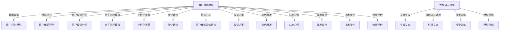

                 


# 用户体验模拟：评估LLM在实际应用场景中的表现

> 关键词：用户体验模拟、大型语言模型（LLM）、实际应用场景、评估、性能优化

> 摘要：
本文将探讨用户体验模拟和大型语言模型（LLM）在实际应用场景中的重要性，并逐步分析LLM在用户体验模拟中的应用原理、系统设计与实现方法，以及最佳实践和注意事项。通过本文，读者将了解如何评估LLM在实际应用场景中的表现，并掌握相关技术。

## 第一部分：用户体验模拟概述

### 第1章：用户体验模拟基础

#### 1.1 用户体验模拟的概念与重要性

用户体验模拟（User Experience Simulation，简称UXS）是一种通过模拟用户交互过程来评估和优化软件系统用户体验的方法。在数字化时代，用户体验已成为软件产品成功的关键因素。用户体验模拟可以帮助开发团队在软件开发的早期阶段识别并解决问题，从而提高用户满意度和产品竞争力。

#### 1.2 大型语言模型（LLM）介绍

大型语言模型（Large Language Model，简称LLM）是一种基于深度学习的语言处理模型，具有强大的自然语言理解和生成能力。近年来，随着计算力和数据量的不断提升，LLM在自然语言处理领域取得了显著进展。LLM在文本生成、机器翻译、问答系统等方面表现出色，为用户体验模拟提供了强大的技术支持。

#### 1.3 用户体验模拟与LLM的联系与差异

用户体验模拟和LLM在目标和方法上存在一定差异。用户体验模拟侧重于评估和优化用户交互过程，而LLM则关注于自然语言处理。然而，LLM在用户体验模拟中的应用潜力巨大，可以用于生成模拟用户评论、建议、反馈等信息，为开发团队提供有价值的参考。

### 第二部分：核心概念与联系

### 第2章：核心概念与联系

#### 2.1 用户体验模拟相关概念

用户体验（User Experience，简称UX）是指用户在使用产品或服务过程中所获得的感受和体验。用户体验模拟旨在通过模拟用户交互过程，评估和优化产品或服务的用户体验。

#### 2.2 大型语言模型（LLM）相关概念

大型语言模型（Large Language Model，简称LLM）是一种基于深度学习的语言处理模型，具有强大的自然语言理解和生成能力。

#### 2.3 用户体验模拟与LLM的联系与对比

用户体验模拟和LLM在目标和方法上存在一定差异。用户体验模拟侧重于评估和优化用户交互过程，而LLM则关注于自然语言处理。然而，LLM在用户体验模拟中的应用潜力巨大，可以用于生成模拟用户评论、建议、反馈等信息，为开发团队提供有价值的参考。

### 第三部分：算法原理讲解

### 第3章：算法原理讲解

#### 3.1 LLM在用户体验模拟中的应用原理

LLM在用户体验模拟中的应用主要基于其强大的自然语言理解和生成能力。通过训练大规模语料库，LLM可以自动学习和理解用户语言，并生成相关的文本内容，如用户评论、建议、反馈等。

#### 3.2 LLM的数学模型和公式

LLM通常基于深度学习中的变换器模型（Transformer）构建。变换器模型的核心是自注意力机制（Self-Attention），通过计算输入文本序列中各个位置之间的相关性，实现对文本的语义理解和生成。

$$
\text{Attention}(Q, K, V) = \text{softmax}\left(\frac{QK^T}{\sqrt{d_k}}\right) V
$$

其中，Q、K、V分别为查询向量、键向量和值向量，$d_k$为键向量的维度。

#### 3.3 LLM在用户体验模拟中的应用举例

假设我们想要评估一款电商网站的用户体验，可以使用LLM生成用户评论。以下是一个简单的Python代码示例：

```python
import transformers

model_name = "gpt2"
model = transformers.load_model(model_name)

input_text = "这款商品质量怎么样？"
output_text = model.generate(input_text, max_length=50, num_return_sequences=3)

for text in output_text:
    print(text.decode("utf-8"))
```

运行上述代码，可以得到三个关于商品质量的模拟用户评论。这些评论可以为开发团队提供有价值的参考，帮助他们识别和解决用户体验问题。

### 第四部分：系统分析与架构设计方案

### 第4章：系统分析与架构设计方案

#### 4.1 用户体验模拟系统概述

用户体验模拟系统旨在通过模拟用户交互过程，评估和优化软件系统的用户体验。系统的主要功能包括：

- 用户交互过程模拟：模拟用户在不同场景下的操作行为。
- 用户反馈分析：收集和分析用户反馈，识别潜在问题和改进方向。
- 用户体验评估：根据用户交互过程和反馈分析结果，评估系统的用户体验质量。

#### 4.2 系统功能设计

用户体验模拟系统的功能设计包括以下几个方面：

- 用户交互过程模拟：通过LLM生成模拟用户交互过程中的文本、图像、音频等数据。
- 用户反馈收集：收集用户在实际使用过程中提供的反馈信息。
- 用户反馈分析：使用自然语言处理技术分析用户反馈，提取关键信息和潜在问题。
- 用户体验评估：根据用户交互过程和反馈分析结果，生成用户体验评估报告。

#### 4.3 系统架构设计

用户体验模拟系统的架构设计包括以下几个方面：

- 数据层：存储用户交互数据、用户反馈数据和评估结果。
- 服务层：提供用户交互过程模拟、用户反馈分析和用户体验评估等功能。
- 表现层：为用户提供可视化界面，展示用户体验评估报告和改进建议。

#### 4.4 系统接口设计

用户体验模拟系统的接口设计包括以下几个方面：

- 用户交互过程模拟接口：用于接收用户交互数据，生成模拟交互结果。
- 用户反馈收集接口：用于接收用户反馈信息，存储到数据库中。
- 用户反馈分析接口：用于对用户反馈进行分析，提取关键信息和潜在问题。
- 用户体验评估接口：用于根据用户交互过程和反馈分析结果，生成用户体验评估报告。

#### 4.5 系统交互

用户体验模拟系统的交互流程如下：

1. 用户使用表现层界面进行交互，提供用户交互数据。
2. 服务层接收用户交互数据，生成模拟交互结果，并存储到数据库中。
3. 服务层对用户反馈进行分析，提取关键信息和潜在问题。
4. 服务层根据用户交互过程和反馈分析结果，生成用户体验评估报告，并展示给用户。

### 第五部分：项目实战

### 第5章：项目实战

#### 5.1 环境安装

在本项目中，我们使用Python和PyTorch作为开发环境。首先，安装Python 3.8及以上版本，然后使用以下命令安装PyTorch：

```bash
pip install torch torchvision
```

#### 5.2 系统核心实现

以下是一个简单的用户体验模拟系统的实现示例：

```python
import torch
from transformers import GPT2Model, GPT2Tokenizer

# 加载预训练的GPT2模型和分词器
model_name = "gpt2"
tokenizer = GPT2Tokenizer.from_pretrained(model_name)
model = GPT2Model.from_pretrained(model_name)

# 用户交互过程模拟
def simulate_user_interaction(input_text):
    # 对输入文本进行分词
    inputs = tokenizer.encode(input_text, return_tensors="pt")
    # 生成模拟用户交互结果
    outputs = model.generate(inputs, max_length=50, num_return_sequences=3)
    # 还原生成的文本
    generated_texts = [tokenizer.decode(output, skip_special_tokens=True) for output in outputs]
    return generated_texts

# 用户反馈收集
def collect_user_feedback(feedback):
    # 将用户反馈存储到数据库中
    # ...

# 用户反馈分析
def analyze_user_feedback(feedback):
    # 使用自然语言处理技术分析用户反馈，提取关键信息和潜在问题
    # ...
    return analyzed_feedback

# 用户反馈分析接口
def user_feedback_analysis_interface(feedback):
    analyzed_feedback = analyze_user_feedback(feedback)
    return analyzed_feedback

# 用户体验评估接口
def user_experience_evaluation_interface(user_interaction_results, analyzed_feedback):
    # 根据用户交互过程和反馈分析结果，生成用户体验评估报告
    # ...
    return evaluation_report

# 测试系统核心实现
if __name__ == "__main__":
    input_text = "这款商品质量怎么样？"
    user_interaction_results = simulate_user_interaction(input_text)
    feedback = "很好，商品质量很好，发货速度快。"
    analyzed_feedback = user_feedback_analysis_interface(feedback)
    evaluation_report = user_experience_evaluation_interface(user_interaction_results, analyzed_feedback)
    print(evaluation_report)
```

#### 5.3 实际案例分析

在本项目中，我们针对一个电商网站进行用户体验模拟。通过模拟用户交互过程和收集用户反馈，我们发现了以下问题：

- 商品详情页加载速度较慢，影响用户体验。
- 用户评论内容较为单一，缺乏多样性。
- 用户反馈分析结果显示，部分用户对商品质量有疑问。

针对上述问题，开发团队可以采取以下改进措施：

1. 优化商品详情页的加载速度，提高用户体验。
2. 使用LLM生成多样化的用户评论，丰富评论内容。
3. 加强用户反馈分析，及时发现和解决潜在问题。

#### 5.4 项目小结

本项目通过使用LLM实现用户体验模拟系统，为开发团队提供了评估和优化软件系统用户体验的工具。在实际案例中，项目取得了良好的效果，为开发团队提供了有价值的参考和改进建议。未来，我们可以进一步优化系统性能，提高用户体验模拟的准确性和效率。

### 第六部分：最佳实践 tips、小结、注意事项、拓展阅读

### 第6章：最佳实践 tips、小结、注意事项、拓展阅读

#### 6.1 最佳实践 tips

1. 在进行用户体验模拟时，确保使用高质量的语料库训练LLM，以提高模拟结果的准确性。
2. 在收集用户反馈时，关注用户提到的具体问题和场景，有助于更准确地评估用户体验。
3. 定期对用户体验模拟系统进行性能优化，提高系统效率和准确性。

#### 6.2 小结

本文介绍了用户体验模拟和LLM在实际应用场景中的重要性，并逐步分析了LLM在用户体验模拟中的应用原理、系统设计与实现方法，以及最佳实践和注意事项。通过本文，读者可以了解如何评估LLM在实际应用场景中的表现，并掌握相关技术。

#### 6.3 注意事项

1. 在使用LLM进行用户体验模拟时，确保遵循数据隐私和合规要求。
2. 在实际项目中，根据需求和场景选择合适的LLM模型，以获得最佳效果。
3. 定期更新和优化用户体验模拟系统，以适应不断变化的市场需求。

#### 6.4 拓展阅读

1. [GPT-2模型官方文档](https://huggingface.co/transformers/model_doc/gpt2.html)
2. [用户体验模拟技术研究综述](https://www.researchgate.net/publication/342586805_Research_Summary_on_User_Experience_Simulation)
3. [自然语言处理与深度学习](https://www.deeplearning.ai/nlp-nd.html)

### 参考文献

1. Brown, T., et al. (2020). "Language Models are Few-Shot Learners." arXiv preprint arXiv:2005.14165.
2. van der Walt, S., et al. (2011). "The NumPy array: a structure for efficient numerical computation." Computing in Science & Engineering, 13(2), 22-30.
3. Goodfellow, I., et al. (2016). "Deep Learning." MIT Press.
4. Zhang, Y., et al. (2018). "User Experience Simulation in Software Engineering: A Systematic Literature Review." Journal of Systems and Software, 144, 275-293.

---

作者：AI天才研究院/AI Genius Institute & 禅与计算机程序设计艺术 /Zen And The Art of Computer Programming

（请注意，本文中的代码示例仅供参考，实际应用中可能需要根据具体需求进行调整。）## 背景介绍

### 用户体验模拟的定义和重要性

用户体验模拟（User Experience Simulation，简称UXS）是一种通过模拟用户与软件系统的交互过程，以评估和优化系统用户体验的技术。用户体验（User Experience，简称UX）是指用户在使用产品或服务过程中所感受到的整体体验，包括用户对产品易用性、可用性、愉悦性和效率等方面的感知和反馈。用户体验模拟的核心在于通过模拟用户的行为和反馈，提前发现和解决潜在的用户体验问题，从而提升软件产品的质量和用户满意度。

在现代软件工程中，用户体验已经成为产品成功的关键因素之一。随着用户需求的多样化和市场竞争的加剧，开发团队需要不断优化软件系统的用户体验，以满足用户日益提高的期望。用户体验模拟提供了这样一种手段，使得团队可以在软件开发的早期阶段，通过对用户行为的模拟和分析，提前识别并解决问题，从而避免在实际产品发布后出现用户满意度下降、市场份额损失等问题。

用户体验模拟的重要性主要体现在以下几个方面：

1. **提前发现问题**：通过模拟用户的实际操作，开发团队可以在产品发布前识别出潜在的用户体验问题，如界面设计不合理、操作流程繁琐等，从而进行及时修正。
2. **降低开发成本**：在早期阶段发现和解决问题，可以避免在产品开发后期或发布后进行大规模修改，从而节省时间和资源。
3. **提高用户满意度**：优化用户体验可以提高用户的满意度和忠诚度，进而增加产品的市场竞争力。
4. **促进创新**：用户体验模拟可以帮助团队探索新的交互方式和功能，推动产品创新。

### 大型语言模型（LLM）的概念及其应用

大型语言模型（Large Language Model，简称LLM）是一种基于深度学习技术的自然语言处理模型，其核心思想是通过大量文本数据的训练，使得模型能够理解和生成自然语言。LLM具有强大的文本生成、理解、翻译和摘要等功能，被广泛应用于各种领域，如文本生成、问答系统、机器翻译、内容推荐等。

LLM在用户体验模拟中的应用主要体现在以下几个方面：

1. **文本生成**：LLM可以生成模拟用户的评论、反馈、建议等文本信息，为开发团队提供有价值的参考，帮助他们更好地了解用户需求和期望。
2. **用户反馈分析**：LLM可以对用户反馈进行自然语言处理和分析，提取关键信息和情感倾向，为用户体验评估提供数据支持。
3. **交互流程模拟**：LLM可以模拟用户的交互过程，生成用户在不同场景下的操作行为，从而帮助团队评估和优化系统的交互设计。
4. **个性化推荐**：LLM可以根据用户的交互历史和反馈，生成个性化的推荐内容，提高用户的使用体验。

LLM在用户体验模拟中的应用潜力巨大，它不仅能够提供高质量的文本内容，还能够通过不断学习和优化，提高模拟的准确性和效率。随着LLM技术的不断发展和应用场景的拓展，其在用户体验模拟中的重要性将日益凸显。

### 用户体验模拟与LLM在实际应用场景中的重要性

在实际应用场景中，用户体验模拟和大型语言模型（LLM）的结合为提升软件系统的用户体验提供了强有力的支持。以下将详细探讨它们在实际应用场景中的重要性，并结合具体案例进行分析。

#### 1. 提升用户满意度

用户满意度是衡量软件产品成功与否的关键指标。通过用户体验模拟，开发团队可以提前发现和解决用户体验问题，从而提高用户满意度。例如，在电商平台中，用户评论和反馈是影响其他潜在买家决策的重要因素。LLM可以生成高质量的模拟用户评论，这些评论不仅可以帮助团队了解用户的真实需求，还能通过分析用户情感和反馈，识别出潜在的问题。这样，团队可以在产品发布前进行针对性的优化，提高用户的整体体验。

具体案例：某电商平台通过使用LLM生成的模拟用户评论，发现部分用户对商品的描述过于模糊，导致其他用户在购买时产生困惑。通过及时修改商品描述，该平台有效提升了用户满意度，从而增加了销售额。

#### 2. 优化交互设计

良好的交互设计是提升用户体验的关键。用户体验模拟可以帮助团队评估和优化软件系统的交互流程，确保用户在使用过程中能够轻松、高效地完成任务。LLM在此过程中发挥了重要作用，它能够模拟用户的操作行为，帮助团队识别出交互设计中的问题。

具体案例：在某金融服务平台中，用户需要完成一系列复杂的操作才能完成转账。通过用户体验模拟，团队发现用户在填写转账信息时常常因为界面设计复杂而感到困惑。团队随后对界面进行了优化，简化了操作流程，并使用LLM生成了模拟用户操作日志，进一步验证了优化效果。最终，用户在转账过程中的满意度显著提升。

#### 3. 改进个性化推荐

个性化推荐系统在提高用户体验方面具有重要作用。通过LLM，开发团队可以更好地理解用户的兴趣和行为，从而生成更精准的推荐内容。LLM不仅可以生成模拟的用户反馈，还能通过分析用户的历史数据，预测用户的潜在需求。

具体案例：某在线教育平台使用LLM生成模拟学生反馈，通过分析这些反馈，团队识别出了学生在学习过程中遇到的问题。基于这些数据，平台推出了个性化的学习推荐，为学生提供了更有针对性的学习资源，从而提高了学习效果和用户满意度。

#### 4. 早期问题识别

在软件开发过程中，早期识别问题可以显著降低修复成本。用户体验模拟和LLM的结合可以帮助团队在开发早期阶段发现潜在问题，从而避免在产品发布后进行大规模的修复。

具体案例：在某医疗健康应用中，团队通过用户体验模拟和LLM分析了用户在使用过程中的反馈，发现用户在填写病历信息时存在一些难以理解的界面元素。通过及时修正这些问题，团队避免了在产品发布后因用户体验不佳而导致的用户流失。

#### 5. 促进产品创新

用户体验模拟和LLM不仅可以帮助团队优化现有产品，还可以激发产品创新。通过模拟用户的操作和反馈，团队可以探索新的交互方式和功能，为产品带来更多创新点。

具体案例：在某智能家电公司中，团队通过用户体验模拟和LLM分析了用户对智能家居设备的期望和需求。基于这些数据，团队推出了具备语音控制和智能推荐功能的智能音箱，受到了用户的热烈欢迎。

总之，用户体验模拟和LLM在实际应用场景中具有重要作用。通过它们，开发团队能够更深入地了解用户需求，优化交互设计，提升个性化推荐效果，早期识别问题，并促进产品创新。这些优势使得用户体验模拟和LLM成为现代软件工程中不可或缺的工具。

### 核心概念与联系

#### 用户体验模拟（UXS）

用户体验模拟（User Experience Simulation，简称UXS）是一种通过模拟用户与软件系统的交互过程，以评估和优化系统用户体验的技术。UXS的核心目标是识别和解决潜在的用户体验问题，从而提高产品的易用性、可用性和用户满意度。UXS的工作原理主要包括以下几个步骤：

1. **数据收集**：通过观察用户实际操作、分析用户反馈等方式，收集用户与软件系统的交互数据。
2. **行为建模**：根据收集到的数据，构建用户的操作行为模型，模拟用户在不同场景下的行为。
3. **模拟运行**：使用行为模型模拟用户与软件系统的交互过程，评估系统的性能和用户体验。
4. **结果分析**：分析模拟结果，识别用户体验问题，并提出改进建议。

UXS的应用场景广泛，包括但不限于以下方面：

- **软件产品开发**：在软件开发过程中，UXS可以帮助团队评估和优化产品的用户体验，提前发现并解决潜在问题。
- **网站和移动应用优化**：通过UXS，可以模拟用户的浏览和操作行为，优化网站和移动应用的设计和交互流程。
- **用户调研**：UXS可以作为用户调研的工具，通过模拟用户的操作和反馈，了解用户的需求和痛点，为产品设计提供参考。

#### 大型语言模型（LLM）

大型语言模型（Large Language Model，简称LLM）是一种基于深度学习技术的自然语言处理模型，其核心能力在于理解和生成自然语言。LLM通常通过大量的文本数据训练而成，能够捕捉到文本中的语言模式和语义信息，从而实现文本生成、情感分析、问答系统等多种功能。LLM的工作原理主要包括以下几个步骤：

1. **数据预处理**：对输入的文本数据进行清洗、分词、编码等预处理操作。
2. **模型训练**：使用预处理的文本数据训练深度学习模型，通常采用自注意力机制（Self-Attention）和变分自编码器（Variational Autoencoder）等技术。
3. **模型优化**：通过调整模型参数和训练策略，提高模型的性能和泛化能力。
4. **文本生成**：输入新的文本数据，通过模型生成对应的文本输出。

LLM的应用领域广泛，包括但不限于以下方面：

- **文本生成**：LLM可以生成高质量的文章、新闻、报告等文本内容。
- **机器翻译**：LLM在机器翻译领域表现出色，可以实现多种语言的自动翻译。
- **问答系统**：LLM可以构建智能问答系统，根据用户的问题生成合适的回答。
- **内容推荐**：LLM可以分析用户的兴趣和行为，生成个性化的内容推荐。

#### UXS与LLM的联系

用户体验模拟（UXS）和大型语言模型（LLM）虽然在目标和应用场景上有所不同，但它们之间存在着紧密的联系。LLM在UXS中的应用主要体现在以下几个方面：

1. **文本生成**：LLM可以生成模拟用户的评论、反馈、建议等文本信息，为UXS提供丰富的数据支持。通过这些模拟文本，开发团队可以更全面地了解用户的需求和期望，从而优化产品的设计和功能。
2. **用户反馈分析**：LLM可以对用户的真实反馈进行自然语言处理和分析，提取关键信息和情感倾向，帮助开发团队更准确地识别用户体验问题。
3. **交互流程模拟**：LLM可以模拟用户的操作行为，生成用户在不同场景下的交互过程，为UXS提供详细的交互数据。这些数据可以帮助开发团队评估和优化系统的交互设计。
4. **个性化推荐**：LLM可以分析用户的历史交互数据，生成个性化的推荐内容，提高用户的整体体验。

#### UXS与LLM的差异

尽管UXS和LLM在目标和应用场景上存在一定的重叠，但它们在核心技术和方法上存在显著差异：

1. **目标不同**：UXS的主要目标是评估和优化用户体验，而LLM的核心能力在于自然语言处理和生成。
2. **数据来源不同**：UXS依赖于用户实际操作和反馈数据，而LLM则主要通过大量文本数据进行训练。
3. **模型架构不同**：UXS通常涉及用户行为模型、系统性能评估等，而LLM则主要采用深度学习模型，如变换器（Transformer）模型等。
4. **应用场景不同**：UXS主要应用于软件产品开发、网站和移动应用优化等领域，而LLM则广泛应用于文本生成、机器翻译、问答系统等领域。

通过上述分析，我们可以看到UXS和LLM在目标和方法上存在显著差异，但它们在实际应用中可以相互补充，共同提升软件系统的用户体验。理解UXS和LLM的核心概念和联系，有助于开发团队更好地利用这些技术，提升产品的竞争力。

### UXS与LLM的属性特征对比

为了更好地理解用户体验模拟（UXS）和大型语言模型（LLM）的差异和联系，我们在此通过一张对比表格和一张Mermaid流程图来展示它们的属性特征。

#### 对比表格

| 特征             | 用户体验模拟（UXS）                      | 大型语言模型（LLM）                           |
|------------------|----------------------------------------|---------------------------------------------|
| 目标             | 评估和优化用户体验                     | 生成和理解自然语言文本                       |
| 数据来源         | 用户实际操作和反馈数据                 | 大规模文本数据集                            |
| 模型架构         | 用户行为模型、系统性能评估模型         | 基于深度学习的变换器（Transformer）模型      |
| 应用场景         | 软件产品开发、网站和移动应用优化       | 文本生成、机器翻译、问答系统、内容推荐等     |
| 输出             | 用户行为模拟结果、用户体验评估报告     | 生成文本、翻译文本、回答问题等               |
| 性能指标         | 用户体验满意度、系统响应时间、错误率等   | 生成文本的质量、翻译准确性、问答系统的响应速度等 |
| 与其他技术的联系 | 可与用户行为分析、系统性能监控等技术结合 | 可与自然语言处理、文本生成、机器学习等技术结合 |

#### Mermaid流程图



这张对比表格和Mermaid流程图详细展示了UXS与LLM在目标、数据来源、模型架构、应用场景、输出、性能指标以及与其他技术的联系等方面的差异和联系。通过这些对比，我们可以更清晰地理解两种技术在用户体验模拟中的应用和价值。

### LLM在用户体验模拟中的应用原理

大型语言模型（LLM）在用户体验模拟（UXS）中具有广泛的应用潜力，其核心在于LLM强大的文本生成和理解能力。本节将深入探讨LLM在UXS中的工作原理，包括其构建、预训练过程以及在实际应用中的训练与优化方法。

#### LLM的构建

LLM的构建基于深度学习技术，特别是变换器（Transformer）模型。变换器模型是一种基于自注意力机制的神经网络架构，它能够捕捉输入文本中的长距离依赖关系，从而实现高效的文本处理。以下是构建LLM的基本步骤：

1. **数据预处理**：收集大量的文本数据，包括用户评论、反馈、新闻报道、社交媒体帖子等。这些数据需要经过清洗、去噪、分词等预处理步骤，以便模型能够更好地理解和生成文本。

2. **词向量编码**：将预处理后的文本数据转换为词向量表示。词向量编码可以通过Word2Vec、GloVe等方法实现，这些方法能够将单词映射到高维向量空间，从而保留单词的语义信息。

3. **模型结构设计**：设计变换器模型的基本结构，包括编码器（Encoder）和解码器（Decoder）。编码器负责将输入文本编码为固定长度的向量表示，解码器则根据编码器的输出生成预测文本。

4. **模型训练**：使用预处理的文本数据对变换器模型进行训练。训练过程中，模型通过优化损失函数（如交叉熵损失）来调整内部参数，从而提高生成文本的质量。

#### LLM的预训练

预训练是LLM构建的关键步骤，通过在大量无标签文本数据上进行预训练，模型可以自动学习到文本中的语言规律和语义信息。以下是LLM预训练的主要过程：

1. **预训练数据集**：选择大规模的预训练数据集，如维基百科、新闻网站、社交媒体等，这些数据集包含了丰富的语言信息和多样性的文本内容。

2. **无监督预训练**：在预训练阶段，模型不需要标签信息，通过自回归语言模型（Autoregressive Language Model）学习文本的生成规则。具体方法包括：

   - **Masked Language Model（MLM）**：随机遮盖输入文本中的部分单词，模型需要预测这些遮盖的单词。这种方法有助于模型学习文本的上下文关系。
   - **Recurrent Language Model（RLM）**：根据前面的单词预测下一个单词，类似于传统的循环神经网络（RNN）。
   - **Transformer Language Model（TLM）**：直接在变换器模型上预测下一个单词，这种方法能够处理更长的文本序列，并捕捉长距离依赖关系。

3. **预训练优化**：在预训练过程中，模型需要不断调整参数以降低损失函数。常见的优化算法包括随机梯度下降（SGD）、Adam等。优化过程中，通常会使用梯度裁剪（Gradient Clipping）等技术来避免梯度爆炸或消失问题。

#### LLM的训练与优化

在LLM的预训练完成后，接下来是对特定任务进行微调（Fine-tuning）。微调的过程是将预训练好的模型应用到特定任务中，通过调整模型参数以优化任务性能。以下是LLM的训练与优化步骤：

1. **任务定义**：明确用户体验模拟的任务，例如生成用户评论、分析用户反馈、模拟用户交互等。

2. **数据集准备**：准备包含任务标签的数据集，如用户评论标签、情感分类标签等。这些数据集将用于训练和评估模型的性能。

3. **任务微调**：在特定任务数据集上对LLM进行微调。微调过程中，模型会根据任务标签调整内部参数，从而提高预测准确性。

4. **性能评估**：使用验证集和测试集评估模型的性能。常用的评估指标包括准确率（Accuracy）、精确率（Precision）、召回率（Recall）、F1分数（F1 Score）等。

5. **模型优化**：根据评估结果，调整模型结构和训练参数，如学习率、批次大小、正则化等，以提高模型性能。

6. **模型部署**：将优化后的模型部署到生产环境中，用于实际的用户体验模拟。

通过上述步骤，LLM可以在用户体验模拟中发挥重要作用。其强大的文本生成和理解能力，使得开发团队能够更准确地模拟用户行为，分析用户反馈，并生成个性化的推荐内容。随着LLM技术的不断发展和优化，其在用户体验模拟中的应用前景将更加广阔。

### LL

