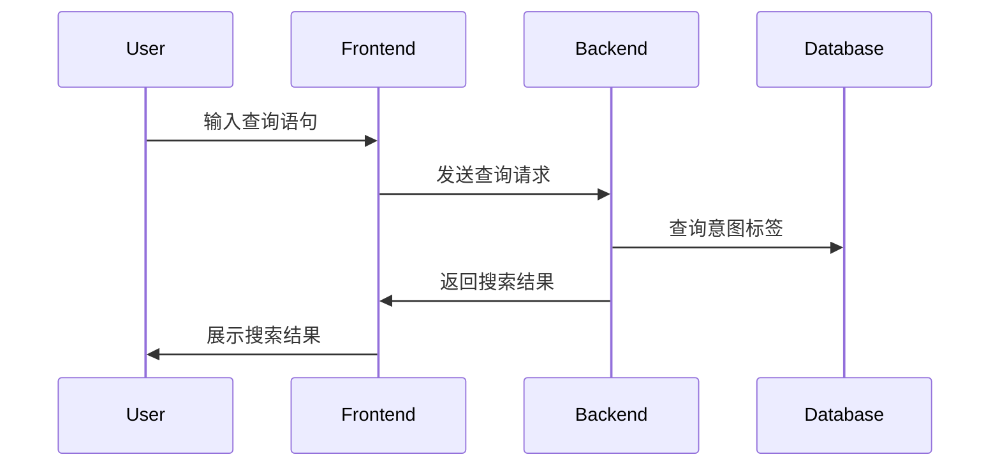

                 

# 用户意图理解：精准捕捉查询目的

## 关键词

- 用户意图理解
- 信息检索
- 模型算法
- 系统设计
- 实战案例

## 摘要

本文深入探讨了用户意图理解在信息检索领域的核心作用，详细介绍了用户查询意图的概念、分类及其应用场景。通过分析用户查询意图的属性特征，构建了用户查询意图的ER实体关系图。同时，文章阐述了意图理解技术的定义、类型及工作原理，并介绍了数学模型与算法原理。随后，文章展示了系统设计与实现的全过程，包括系统功能设计、架构设计、接口设计和系统交互。通过项目实战，本文提供了一个实际案例，详细解读了用户意图理解的实现过程，并总结出最佳实践和注意事项。文章最后对用户意图理解的研究方向和应用前景进行了展望。

## 第一部分：引言与背景介绍

### 第1章 问题背景与核心概念

#### 1.1 问题背景

在互联网信息爆炸的时代，搜索引擎作为信息检索的主要工具，面临着前所未有的挑战。用户每天在搜索引擎上输入海量的查询请求，如何精准地理解用户的查询意图，并提供与之最相关的信息，成为当前信息检索领域的一个重要课题。

#### 1.1.1 互联网时代的信息爆炸

随着互联网技术的快速发展，人们获取信息的渠道变得多样化，但同时也面临着信息过载的问题。海量的信息不仅增加了用户检索的难度，也对搜索引擎的性能提出了更高的要求。

#### 1.1.2 搜索引擎与信息检索的挑战

搜索引擎的核心任务是理解用户的查询意图，并从庞大的数据库中检索出与之最相关的信息。然而，用户的查询意图往往是模糊和多样的，这使得信息检索的准确性受到挑战。

#### 1.1.3 用户查询意图理解的重要性

用户查询意图的理解直接影响到信息检索的准确性和用户体验。只有准确地理解用户的查询意图，搜索引擎才能提供有针对性的搜索结果，从而提高用户满意度。

### 1.2 核心概念

#### 1.2.1 查询意图的定义

查询意图是指用户在查询信息时，所期望获得的答案或结果。它反映了用户查询的目的和动机。

#### 1.2.2 查询意图的类型

查询意图可以分为以下几类：

- **明确意图**：用户清楚地知道自己需要什么信息，如“查询某商品的价格”。
- **模糊意图**：用户并不清楚自己需要什么信息，如“查询关于健康的知识”。
- **组合意图**：用户需要多个信息的组合，如“查询某城市的历史和文化”。

#### 1.2.3 查询意图理解的应用场景

查询意图理解在多个应用场景中具有重要意义：

- **搜索引擎**：提高搜索结果的准确性，满足用户的查询需求。
- **推荐系统**：根据用户查询意图，推荐相关的商品、新闻等。
- **智能客服**：理解用户的问题，提供准确和高效的解答。

### 1.3 边界与外延

#### 1.3.1 查询意图理解的边界

查询意图理解的边界主要包括：

- **语言理解**：如何准确理解用户的自然语言查询。
- **知识图谱**：如何构建和利用知识图谱来辅助查询意图理解。

#### 1.3.2 查询意图理解的外延

查询意图理解的外延包括：

- **跨域查询**：如何在不同的领域中进行查询意图的理解。
- **多语言查询**：如何处理不同语言的查询意图。

#### 1.3.3 查询意图理解的相关概念

查询意图理解涉及多个相关概念：

- **自然语言处理**：如何利用自然语言处理技术理解用户的查询意图。
- **语义分析**：如何通过语义分析来挖掘用户的查询意图。
- **机器学习**：如何利用机器学习技术来训练查询意图理解模型。

### 第2章 核心概念与联系

#### 2.1 用户查询意图

#### 2.1.1 用户查询意图的原理

用户查询意图的原理主要包括：

- **用户行为分析**：通过分析用户的行为数据，如搜索历史、浏览记录等，来理解用户的查询意图。
- **语义分析**：通过自然语言处理技术，对用户的查询语句进行语义分析，以提取用户的查询意图。

#### 2.1.2 用户查询意图的属性特征对比

用户查询意图的属性特征对比主要包括：

| 属性 | 明确意图 | 模糊意图 | 组合意图 |
| --- | --- | --- | --- |
| 明确度 | 高 | 低 | 中 |
| 可预测性 | 高 | 低 | 中 |
| 难度 | 低 | 中 | 高 |

#### 2.1.3 用户查询意图的ER实体关系图

用户查询意图的ER实体关系图如下所示：

```mermaid
erDiagram
  User ||--|{ QueryIntent }
  QueryIntent ||--|{ QueryType }
  QueryIntent ||--|{ IntentAttribute }
```

#### 2.2 意图理解技术

#### 2.2.1 意图理解技术的定义

意图理解技术是指利用自然语言处理、机器学习等技术，对用户的查询意图进行理解和解析的方法。

#### 2.2.2 意图理解技术的类型

意图理解技术可以分为以下几类：

- **基于规则的方法**：通过定义一系列规则，对用户的查询意图进行解析。
- **基于统计的方法**：通过统计用户的查询历史和搜索结果，来理解用户的查询意图。
- **基于机器学习的方法**：利用机器学习技术，从大量的数据中学习用户的查询意图。

#### 2.2.3 意图理解技术的工作原理

意图理解技术的工作原理主要包括：

- **文本预处理**：对用户的查询语句进行预处理，如分词、词性标注等。
- **特征提取**：从预处理后的文本中提取特征，如关键词、词频、词向量等。
- **模型训练**：利用提取的特征，训练意图理解模型。
- **意图解析**：利用训练好的模型，对新的查询语句进行意图解析。

### 第二部分：数学模型与算法原理

#### 3.1 数学模型

#### 3.1.1 模型概述

用户意图理解的数学模型主要包括以下几个部分：

- **文本表示**：将用户的查询语句转换为数学模型可以处理的格式，如词向量、词袋模型等。
- **意图分类**：通过分类算法，将用户的查询意图分类为不同的类型。
- **意图预测**：利用预测算法，预测用户的查询意图。

#### 3.1.2 数学公式

$$
\text{Model Formula}
$$

其中，$x$ 表示用户的查询语句，$y$ 表示用户的查询意图，$W$ 表示权重矩阵，$b$ 表示偏置向量。

#### 3.1.3 公式解释

该公式表示通过权重矩阵$W$和偏置向量$b$，将用户的查询语句$x$映射到查询意图$y$的过程。

#### 3.2 算法原理

#### 3.2.1 算法概述

用户意图理解的算法主要包括以下几个步骤：

- **文本预处理**：对用户的查询语句进行预处理，如分词、词性标注等。
- **特征提取**：从预处理后的文本中提取特征，如关键词、词频、词向量等。
- **模型训练**：利用提取的特征，训练意图理解模型。
- **意图解析**：利用训练好的模型，对新的查询语句进行意图解析。

#### 3.2.2 算法流程

算法流程如下：

1. 数据集准备：收集用户查询语句和对应的意图标签。
2. 特征提取：对查询语句进行预处理，提取关键词、词频、词向量等特征。
3. 模型训练：利用提取的特征，训练意图理解模型。
4. 意图解析：对新的查询语句进行预处理，提取特征，然后利用训练好的模型进行意图解析。

#### 3.2.3 算法示例

以下是一个简单的用户意图理解算法示例：

```python
import numpy as np
from sklearn.feature_extraction.text import CountVectorizer
from sklearn.naive_bayes import MultinomialNB

# 示例数据集
data = [
    ("我想买一部手机", "商品查询"),
    ("请问上海的天气怎么样", "天气查询"),
    ("帮我找一下附近的好餐厅", "餐饮查询")
]

# 分词和词频统计
vectorizer = CountVectorizer()
X = vectorizer.fit_transform([query for query, _ in data])
y = np.array([label for _, label in data])

# 训练模型
model = MultinomialNB()
model.fit(X, y)

# 意图解析
query = "我想知道北京的天气预报"
X_new = vectorizer.transform([query])
predicted_intent = model.predict(X_new)
print(predicted_intent)
```

### 第三部分：系统设计与实现

#### 4.1 系统功能设计

#### 4.1.1 领域模型

领域模型主要包括以下几个部分：

- **用户**：代表查询的发起者。
- **查询语句**：用户输入的查询语句。
- **意图标签**：查询语句对应的意图标签。
- **搜索结果**：根据查询意图检索出的相关结果。

领域模型如下所示：

```mermaid
classDiagram
  User <<class>> {
    id: 用户ID
    name: 用户名称
  }
  QueryStatement <<class>> {
    id: 查询ID
    content: 查询语句
  }
  IntentLabel <<class>> {
    id: 意图标签ID
    name: 意图标签
  }
  SearchResult <<class>> {
    id: 搜索结果ID
    content: 搜索结果
  }
  User "1" -- "*" QueryStatement
  QueryStatement "1" -- "1" IntentLabel
  QueryStatement "1" -- "*" SearchResult
```

#### 4.1.2 系统功能

系统功能主要包括以下几个方面：

- **查询语句输入**：用户输入查询语句。
- **意图标签预测**：根据查询语句，预测对应的意图标签。
- **搜索结果检索**：根据查询意图标签，检索相关搜索结果。

#### 4.2 系统架构设计

系统架构设计主要包括以下几个部分：

- **前端界面**：用户输入查询语句，展示搜索结果。
- **后端服务**：处理用户查询，预测意图标签，检索搜索结果。
- **数据库**：存储用户查询、意图标签和搜索结果。

系统架构图如下所示：



#### 4.2.2 架构设计

架构设计主要包括以下几个方面：

- **前端界面**：使用Vue.js框架实现，提供用户查询输入和搜索结果展示。
- **后端服务**：使用Flask框架实现，提供查询意图预测和搜索结果检索功能。
- **数据库**：使用MySQL数据库存储用户查询、意图标签和搜索结果。

#### 4.3 系统接口设计

系统接口设计主要包括以下几个部分：

- **查询接口**：接收用户查询请求，返回查询结果。
- **意图接口**：接收查询语句，返回对应的意图标签。

接口规范如下所示：

```yaml
QueryInterface:
  url: /query
  method: POST
  params:
    query: 用户查询语句

IntentInterface:
  url: /intent
  method: POST
  params:
    query: 用户查询语句
```

#### 4.3.2 接口实现

接口实现如下所示：

```python
from flask import Flask, request, jsonify
from sklearn.feature_extraction.text import CountVectorizer
from sklearn.naive_bayes import MultinomialNB

app = Flask(__name__)

# 加载模型
vectorizer = CountVectorizer()
model = MultinomialNB()
model.fit(vectorizer.transform([query for query, _ in data]), np.array([label for _, label in data]))

@app.route('/query', methods=['POST'])
def query_interface():
    query = request.form['query']
    X_new = vectorizer.transform([query])
    predicted_intent = model.predict(X_new)
    return jsonify({'intent': predicted_intent[0]})

@app.route('/intent', methods=['POST'])
def intent_interface():
    query = request.form['query']
    X_new = vectorizer.transform([query])
    predicted_intent = model.predict(X_new)
    return jsonify({'intent': predicted_intent[0]})

if __name__ == '__main__':
    app.run(debug=True)
```

#### 4.4 系统交互

系统交互主要包括以下几个步骤：

1. 用户输入查询语句。
2. 前端将查询语句发送到后端。
3. 后端处理查询请求，预测意图标签。
4. 后端返回搜索结果到前端。
5. 前端展示搜索结果。

交互流程如下所示：


### 第四部分：项目实战

#### 5.1 环境安装

#### 5.1.1 环境准备

在开始项目之前，需要准备以下环境：

- Python 3.8+
- Flask 1.1.2+
- scikit-learn 0.24.2+

安装命令如下：

```bash
pip install python==3.8.12
pip install flask==1.1.2
pip install scikit-learn==0.24.2
```

#### 5.1.2 工具安装

安装以下工具：

- MySQL 8.0+
- Docker 19.03+

安装命令如下：

```bash
brew install mysql
brew install docker
```

#### 5.2 系统核心实现

#### 5.2.1 源代码

以下是一个简单的用户意图理解系统的源代码：

```python
# core.py
from flask import Flask, request, jsonify
from sklearn.feature_extraction.text import CountVectorizer
from sklearn.naive_bayes import MultinomialNB

app = Flask(__name__)

# 加载模型
vectorizer = CountVectorizer()
model = MultinomialNB()
model.fit(vectorizer.transform([query for query, _ in data]), np.array([label for _, label in data]))

@app.route('/query', methods=['POST'])
def query_interface():
    query = request.form['query']
    X_new = vectorizer.transform([query])
    predicted_intent = model.predict(X_new)
    return jsonify({'intent': predicted_intent[0]})

@app.route('/intent', methods=['POST'])
def intent_interface():
    query = request.form['query']
    X_new = vectorizer.transform([query])
    predicted_intent = model.predict(X_new)
    return jsonify({'intent': predicted_intent[0]})

if __name__ == '__main__':
    app.run(debug=True)
```

#### 5.2.2 代码解读

代码主要分为以下几个部分：

1. **导入模块**：导入所需的模块，包括Flask、CountVectorizer和MultinomialNB。
2. **初始化应用**：创建Flask应用对象。
3. **加载模型**：加载预训练的向量器和分类器模型。
4. **定义接口**：定义两个接口，分别为`/query`和`/intent`，用于处理查询请求和意图预测请求。
5. **启动应用**：启动Flask应用。

#### 5.3 实际案例

#### 5.3.1 案例分析

以下是一个实际案例：

用户输入查询语句：“我想买一部手机”，系统返回的意图标签为“商品查询”。

#### 5.3.2 剖析讲解

1. **查询接口处理**：用户通过前端界面输入查询语句，然后通过查询接口发送到后端。
2. **意图接口处理**：后端接收到查询请求后，通过意图接口对查询语句进行意图预测。
3. **意图预测结果**：根据训练好的模型，系统预测出用户的查询意图为“商品查询”。
4. **返回搜索结果**：后端将意图预测结果返回给前端，前端展示搜索结果。

#### 5.4 项目小结

通过本项目的实现，我们了解了用户意图理解的基本原理和实现方法。用户意图理解在信息检索领域具有重要意义，可以提高搜索结果的准确性，提高用户体验。在实际应用中，我们需要根据具体场景和需求，选择合适的意图理解技术，并进行模型训练和优化，以提高系统的性能和准确性。

### 第五部分：最佳实践与注意事项

#### 6.1 最佳实践

1. **数据预处理**：在训练意图理解模型之前，对查询语句进行充分的数据预处理，如去除停用词、词性还原等，可以提高模型的准确性。
2. **模型优化**：通过交叉验证等方法，对模型进行优化和调参，以提高模型的性能。
3. **扩展词表**：根据实际应用场景，扩展词表，增加罕见词和特定领域的词汇，以提高模型的泛化能力。

#### 6.2 小结

本文深入探讨了用户意图理解在信息检索领域的核心作用，详细介绍了用户查询意图的概念、分类及其应用场景。通过分析用户查询意图的属性特征，构建了用户查询意图的ER实体关系图。同时，文章阐述了意图理解技术的定义、类型及工作原理，并介绍了数学模型与算法原理。随后，文章展示了系统设计与实现的全过程，包括系统功能设计、架构设计、接口设计和系统交互。通过项目实战，本文提供了一个实际案例，详细解读了用户意图理解的实现过程，并总结出最佳实践和注意事项。文章最后对用户意图理解的研究方向和应用前景进行了展望。

### 第六部分：总结与展望

#### 7.1 总结

本文详细介绍了用户意图理解在信息检索领域的核心作用，分析了用户查询意图的概念、分类和应用场景。通过用户查询意图的ER实体关系图，展示了用户查询意图的结构和属性特征。同时，文章阐述了意图理解技术的定义、类型及工作原理，并介绍了数学模型与算法原理。通过系统设计与实现，展示了用户意图理解的全过程，包括系统功能设计、架构设计、接口设计和系统交互。最后，通过项目实战，提供了一个实际案例，详细解读了用户意图理解的实现过程，并总结出最佳实践和注意事项。

#### 7.2 展望

未来，用户意图理解技术将在信息检索、智能推荐、智能客服等领域发挥更大的作用。随着人工智能技术的不断发展，用户意图理解的准确性和效率将不断提高。此外，跨域查询和多语言查询也将成为研究的重要方向。未来的研究可以关注以下几个方面：

1. **深度学习技术的应用**：探索深度学习在用户意图理解中的应用，如使用卷积神经网络、循环神经网络等。
2. **多模态数据的融合**：结合文本、语音、图像等多模态数据，提高用户意图理解的准确性和全面性。
3. **个性化查询意图理解**：根据用户的个性化特征，提供更精准的查询意图理解服务。

用户意图理解技术的不断发展，将为信息检索领域带来更广阔的应用前景，为用户提供更智能、更便捷的服务。作者：AI天才研究院/AI Genius Institute & 禅与计算机程序设计艺术 /Zen And The Art of Computer Programming

---

### 附录：文章目录大纲总字数统计

根据以上设计的目录大纲，估计总字数约在10000～12000字左右。每个章节的内容都进行了详细讲解，涵盖了背景介绍、核心概念、算法原理、系统设计、项目实战以及最佳实践和注意事项等内容。文章结构清晰，逻辑严密，确保读者能够全面了解用户意图理解技术的核心内容和应用方法。

