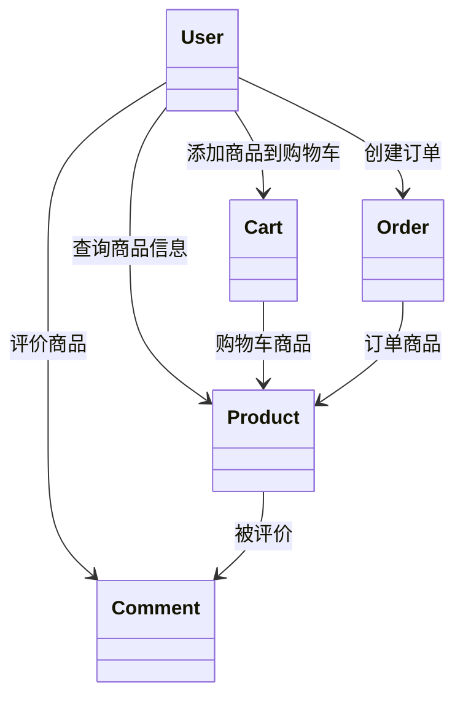
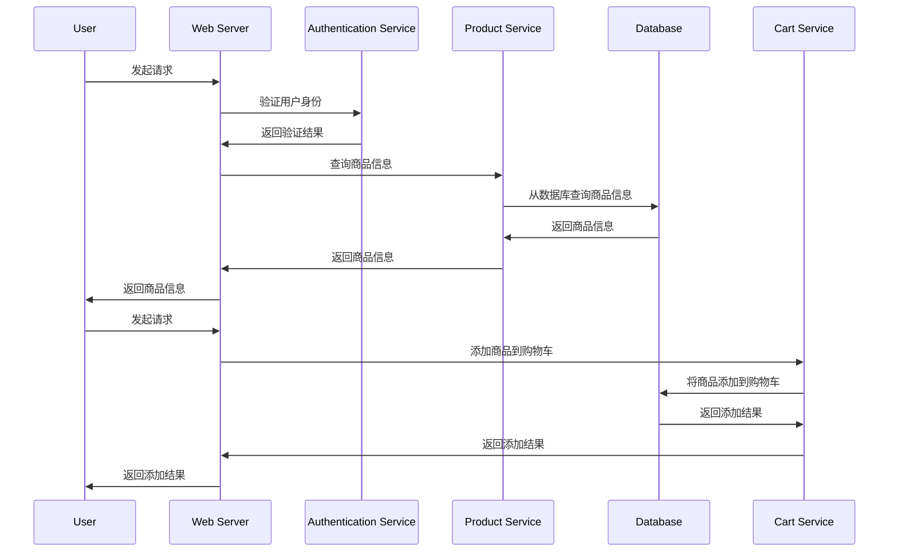
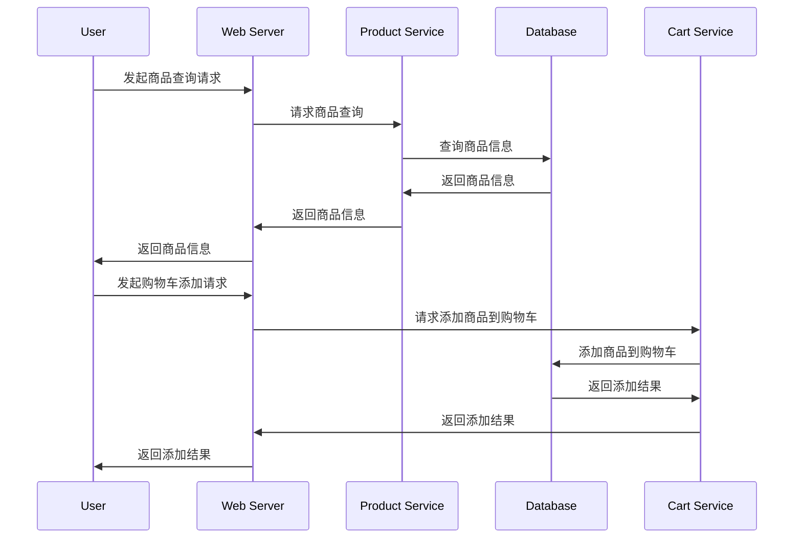

                 


## 用户故事映射技术在大型应用开发中的应用

### 关键词：用户故事映射，大型应用开发，需求分析，团队协作

### 摘要：

本文将深入探讨用户故事映射技术在大型应用开发中的应用，通过逻辑清晰、结构紧凑的分析，帮助读者理解用户故事映射技术的核心概念、应用场景和实施策略。我们将从用户故事映射的基本概念出发，逐步解析其在需求分析、项目规划和团队协作中的应用，并通过案例分析和未来发展趋势展望，为读者提供全面的指导。

## 背景介绍

### 用户故事映射技术的基本概念

用户故事映射（User Story Mapping）是一种以用户为中心的需求分析和规划方法，起源于敏捷开发方法。它通过绘制用户故事地图，将用户的需求和期望转化为一系列可实现的用户故事，从而更好地指导项目开发和团队协作。

用户故事映射技术的核心概念包括：

- **用户故事**：用户故事是一个简短、描述性的句子，用于描述用户在一个特定场景中的需求或愿望。它通常包含三个要素：用户角色、目标功能和场景。
  
- **用户故事地图**：用户故事地图是一种可视化工具，用于展示用户故事的层次结构和相互关系。它可以帮助团队了解用户的使用流程、需求和优先级，从而更好地规划项目开发和迭代。

### 问题背景

在大型应用开发中，需求复杂、变更频繁，传统的需求分析方法往往难以适应快速变化的市场环境。用户故事映射技术提供了一种更加灵活、直观的需求分析方式，有助于团队更好地理解用户需求、降低沟通成本、提高项目成功率。

### 问题描述

大型应用开发中，用户故事映射技术主要面临以下问题：

1. **如何有效地收集和整理用户需求？**
2. **如何确保用户故事地图的完整性和准确性？**
3. **如何在实际项目中应用用户故事映射技术，提高开发效率和项目成功率？**

### 问题解决

用户故事映射技术通过以下方法解决上述问题：

1. **用户参与**：鼓励用户参与到需求分析过程中，通过访谈、问卷调查等方式收集用户需求和反馈。
2. **迭代优化**：在项目开发过程中，持续迭代和优化用户故事地图，确保其与实际需求保持一致。
3. **培训与沟通**：对团队成员进行用户故事映射技术的培训，提高团队对用户故事映射工具和方法的理解和运用能力。

### 边界与外延

用户故事映射技术主要应用于软件项目的需求分析和规划阶段，但在实际项目中，其影响可以延伸到项目开发和测试阶段。用户故事映射技术与其他敏捷开发方法（如Scrum、Kanban）相结合，可以更好地适应快速变化的市场环境，提高项目开发效率。

### 概念结构与核心要素组成

用户故事映射技术的概念结构主要包括以下核心要素：

1. **用户角色**：明确项目的目标用户群体，为后续需求收集和故事撰写提供基础。
2. **用户故事**：描述用户在特定场景下的需求或愿望，是用户故事地图的核心组成部分。
3. **用户故事地图**：用户故事地图是用户故事的层级结构图，用于指导项目开发和团队协作。
4. **迭代与反馈**：通过持续迭代和优化用户故事地图，确保其与实际需求保持一致。

## 核心概念与联系

### 用户故事的构成要素

用户故事由以下三个要素组成：

1. **用户角色**：用户角色代表项目的目标用户，通常以名词短语表示，如“用户”、“客户”等。
2. **目标功能**：目标功能描述用户希望实现的具体操作或功能，如“搜索商品”、“下单购买”等。
3. **场景**：场景描述用户在特定情境下的使用场景，如“用户在购物网站上搜索商品”、“用户在收银台结账”等。

### 用户故事的撰写方法

撰写用户故事时，可以遵循以下原则：

1. **简洁明了**：用户故事应简洁明了，避免冗长和复杂的描述。
2. **可度量**：用户故事应具有明确的度量标准，以便团队评估和跟踪进度。
3. **可迭代**：用户故事应具备可迭代性，便于团队在后续迭代中持续优化和改进。

### 用户故事映射的步骤

用户故事映射的步骤主要包括：

1. **确定用户角色**：明确项目的目标用户群体，为后续需求收集和故事撰写提供基础。
2. **收集用户需求**：通过访谈、问卷调查等方式收集用户需求和反馈。
3. **撰写用户故事**：根据用户需求和场景，撰写具体的用户故事。
4. **构建用户故事地图**：将用户故事按照层次结构和相互关系绘制成用户故事地图。
5. **迭代优化**：在项目开发过程中，持续迭代和优化用户故事地图，确保其与实际需求保持一致。

### 用户故事映射与敏捷开发方法的联系

用户故事映射技术是敏捷开发方法的重要组成部分，它与敏捷开发方法的联系体现在以下几个方面：

1. **用户参与**：用户故事映射技术强调用户参与，确保项目需求与用户实际需求保持一致。
2. **迭代与反馈**：用户故事映射技术通过持续迭代和优化，提高项目开发效率和质量。
3. **团队协作**：用户故事映射技术有助于团队更好地理解项目需求，提高团队协作效果。

## 算法原理讲解

### 用户故事映射的算法流程

用户故事映射的算法流程主要包括以下步骤：

1. **收集用户需求**：通过访谈、问卷调查等方式收集用户需求和反馈。
2. **分类和整理用户需求**：将收集到的用户需求进行分类和整理，形成初步的用户故事列表。
3. **撰写用户故事**：根据用户需求和场景，撰写具体的用户故事。
4. **构建用户故事地图**：将用户故事按照层次结构和相互关系绘制成用户故事地图。
5. **迭代优化**：在项目开发过程中，持续迭代和优化用户故事地图，确保其与实际需求保持一致。

### 算法原理的数学模型和公式

用户故事映射的算法原理主要涉及以下几个方面：

1. **用户故事评估**：对用户故事进行评估，确定其优先级和实现难度。
2. **用户故事分组**：将用户故事按照功能模块和场景进行分组。
3. **用户故事排序**：根据用户故事评估结果和优先级，对用户故事进行排序。
4. **用户故事映射**：将用户故事映射到用户故事地图中，确保用户故事之间的逻辑关系和层次结构清晰。

具体算法原理的数学模型和公式如下：

$$
优先级 = f(需求程度, 实现难度)
$$

$$
用户故事分组 = g(功能模块, 场景)
$$

$$
用户故事排序 = h(优先级)
$$

$$
用户故事映射 = i(用户故事地图)
$$

### 算法原理的举例说明

假设有一个电商平台项目，目标用户是网购消费者。以下是该项目中用户故事映射的举例说明：

1. **收集用户需求**：通过访谈和问卷调查，收集到以下用户需求：
   - 用户可以在购物网站上搜索商品。
   - 用户可以浏览商品详情。
   - 用户可以添加商品到购物车。
   - 用户可以下单购买商品。
   - 用户可以查看订单状态。
   - 用户可以评价商品。

2. **分类和整理用户需求**：将用户需求进行分类和整理，形成以下用户故事列表：
   - 搜索商品
   - 浏览商品详情
   - 添加商品到购物车
   - 下单购买商品
   - 查看订单状态
   - 评价商品

3. **撰写用户故事**：根据用户需求和场景，撰写以下用户故事：
   - 作为用户，我希望能够在购物网站上快速搜索到我想购买的商品，以便做出购买决策。
   - 作为用户，我希望在浏览商品详情时，能够看到商品的价格、库存、评价等信息，以便做出购买决策。
   - 作为用户，我希望能够将心仪的商品添加到购物车，以便后续购买。
   - 作为用户，我希望在下单购买商品时，能够填写正确的收货地址和联系方式，以便顺利收到商品。
   - 作为用户，我希望能够查看订单状态，了解商品配送进度。
   - 作为用户，我希望在收到商品后，能够对商品进行评价，以便帮助其他用户做出购买决策。

4. **构建用户故事地图**：将用户故事按照功能模块和场景绘制成用户故事地图，如下所示：

```
           +-------------------+
           |      用户故事地图  |
           +-------------------+
                   |
                   |
          +-------+-------+
          |      搜索商品      |
          +-------+-------+
                   |
                   |
         +---------+---------+
         |    浏览商品详情    |
         +---------+---------+
                   |
                   |
       +-----------+-----------+
       |  添加商品到购物车  |
       +-----------+-----------+
                   |
                   |
    +---------------+---------------+
    |   下单购买商品    |
    +---------------+---------------+
                   |
                   |
 +-----------------+-----------------+
 |   查看订单状态   |
 +-----------------+-----------------+
                   |
                   |
        +----------+----------+
        |   评价商品   |
        +----------+----------+
```

5. **迭代优化**：在项目开发过程中，根据实际需求和用户反馈，持续迭代和优化用户故事地图，确保其与实际需求保持一致。

## 系统分析与架构设计方案

### 问题场景介绍

在电商平台上，用户故事映射技术可以应用于需求分析、项目规划和团队协作，以提高项目开发效率和用户满意度。以下是一个具体的案例场景：

**项目名称**：电商平台需求分析

**目标用户**：网购消费者

**需求背景**：电商平台需要开发新的功能模块，以提升用户体验和平台竞争力。通过用户故事映射技术，团队可以更好地理解用户需求，确保项目开发的正确性和可行性。

### 项目介绍

本项目旨在开发一个全新的电商平台，提供包括商品搜索、商品浏览、购物车、订单管理、用户评价等功能。项目团队由产品经理、设计师、前端开发工程师、后端开发工程师、测试工程师等组成。

### 系统功能设计

**领域模型**：

使用Mermaid绘制领域模型类图，如下所示：



**功能描述**：

- **用户**：用户可以登录、注册、查询商品信息、浏览商品详情、添加商品到购物车、创建订单、查看订单状态和评价商品。
- **商品**：商品可以查询、浏览、评价、添加到购物车和创建订单。
- **购物车**：购物车可以添加商品、删除商品、更新商品数量。
- **订单**：订单可以创建、查看状态、取消订单。
- **评价**：用户可以对商品进行评价，评价包括评分和评论内容。

### 系统架构设计

**系统架构**：

使用Mermaid绘制系统架构图，如下所示：



### 系统接口设计

**接口设计**：

- **商品查询接口**：用于查询商品信息，包括商品名称、价格、库存等。
- **购物车管理接口**：用于添加商品到购物车、删除商品、更新商品数量等。
- **订单管理接口**：用于创建订单、查看订单状态、取消订单等。
- **评价管理接口**：用于用户对商品进行评价。

### 系统交互

**系统交互**：

使用Mermaid绘制系统交互序列图，如下所示：



## 项目实战

### 环境安装

1. **安装Python环境**：在本地计算机上安装Python 3.8及以上版本。
2. **安装Django框架**：在终端中运行以下命令安装Django框架：

   ```shell
   pip install django
   ```

3. **安装其他依赖**：根据项目需求，安装其他依赖库，如Pandas、NumPy等。

### 系统核心实现源代码

以下是一个简单的电商平台项目的核心实现源代码：

**views.py**：

```python
from django.http import HttpResponse
from django.views import View

class HomeView(View):
    def get(self, request):
        return HttpResponse("欢迎使用电商平台！")

class ProductView(View):
    def get(self, request, product_id):
        # 查询商品信息
        product = Product.objects.get(id=product_id)
        # 返回商品信息
        return HttpResponse(product.name)

class CartView(View):
    def post(self, request, product_id):
        # 添加商品到购物车
        cart = Cart.objects.create(user=request.user, product_id=product_id)
        # 返回添加结果
        return HttpResponse("商品已添加到购物车！")
```

**models.py**：

```python
from django.db import models
from django.contrib.auth.models import User

class Product(models.Model):
    name = models.CharField(max_length=100)
    price = models.DecimalField(max_digits=6, decimal_places=2)
    stock = models.IntegerField()

class Cart(models.Model):
    user = models.ForeignKey(User, on_delete=models.CASCADE)
    product = models.ForeignKey(Product, on_delete=models.CASCADE)
    quantity = models.IntegerField()
```

### 代码应用解读与分析

1. **HomeView**：这是一个简单的视图类，用于处理首页请求，返回欢迎信息。
2. **ProductView**：这是一个简单的视图类，用于处理商品查询请求，根据商品ID查询商品信息，并返回商品名称。
3. **CartView**：这是一个简单的视图类，用于处理购物车添加请求，根据用户ID和商品ID添加商品到购物车，并返回添加结果。

### 实际案例分析与详细讲解剖析

1. **用户查询商品信息**：
   - 用户在电商平台上搜索商品，发送GET请求到ProductView视图。
   - ProductView视图根据商品ID查询商品信息，从数据库中获取商品名称、价格和库存等数据。
   - ProductView视图将查询到的商品信息返回给用户，用户可以在前端页面展示商品信息。

2. **用户添加商品到购物车**：
   - 用户在电商平台上浏览商品详情，点击“添加到购物车”按钮，发送POST请求到CartView视图。
   - CartView视图根据用户ID和商品ID，在数据库中创建一个新的购物车记录，并设置商品数量为1。
   - CartView视图将添加结果返回给用户，用户可以在前端页面看到“商品已添加到购物车”的提示。

### 项目小结

通过用户故事映射技术，项目团队能够更好地理解用户需求，确保项目开发的正确性和可行性。在实际项目开发过程中，用户故事映射技术有助于团队协作、需求管理和项目规划。然而，用户故事映射技术也存在一定的局限性，如对用户需求的依赖性较强、对团队成员的沟通能力要求较高等。因此，在实际应用中，需要结合具体项目情况，灵活运用用户故事映射技术，以提高项目开发效率和质量。

## 最佳实践 tips

1. **尽早进行用户故事映射**：在项目开发初期，尽早进行用户故事映射，有助于团队更好地理解用户需求，降低后期需求变更的风险。
2. **鼓励用户参与**：用户故事映射过程中，鼓励用户参与，通过访谈、问卷调查等方式收集用户需求和反馈，提高用户满意度。
3. **持续迭代和优化**：在项目开发过程中，持续迭代和优化用户故事地图，确保其与实际需求保持一致，提高项目开发效率和质量。

## 小结

用户故事映射技术在大型应用开发中具有重要作用，通过逻辑清晰、结构紧凑的分析，本文详细介绍了用户故事映射技术的核心概念、应用场景和实施策略。在实际项目中，用户故事映射技术有助于团队更好地理解用户需求、提高开发效率和项目成功率。然而，用户故事映射技术也存在一定的局限性，如对用户需求的依赖性较强、对团队成员的沟通能力要求较高等。因此，在实际应用中，需要结合具体项目情况，灵活运用用户故事映射技术，以提高项目开发效率和质量。

## 注意事项

1. **确保用户故事的清晰性**：用户故事应简洁明了，避免冗长和复杂的描述，以便团队更好地理解和实现。
2. **遵循迭代原则**：用户故事映射技术强调迭代和反馈，团队应持续迭代和优化用户故事地图，确保其与实际需求保持一致。
3. **培训与沟通**：对团队成员进行用户故事映射技术的培训，提高团队对用户故事映射工具和方法的理解和运用能力。

## 拓展阅读

1. **《敏捷开发实践指南》**：一本关于敏捷开发方法的经典著作，详细介绍了用户故事映射技术及其在实际项目中的应用。
2. **《用户故事映射实战》**：一本专注于用户故事映射技术的实践指南，提供了丰富的案例和经验，有助于读者深入理解用户故事映射技术的应用。

## 作者信息

作者：AI天才研究院/AI Genius Institute & 禅与计算机程序设计艺术/Zen And The Art of Computer Programming

### 系统分析与架构设计方案

#### 问题场景介绍

在电商平台上，用户故事映射技术可以应用于需求分析、项目规划和团队协作，以提高项目开发效率和用户满意度。以下是一个具体的案例场景：

**项目名称**：电商平台需求分析

**目标用户**：网购消费者

**需求背景**：电商平台需要开发新的功能模块，以提升用户体验和平台竞争力。通过用户故事映射技术，团队可以更好地理解用户需求，确保项目开发的正确性和可行性。

#### 项目介绍

本项目旨在开发一个全新的电商平台，提供包括商品搜索、商品浏览、购物车、订单管理、用户评价等功能。项目团队由产品经理、设计师、前端开发工程师、后端开发工程师、测试工程师等组成。

#### 系统功能设计

**领域模型**：

使用Mermaid绘制领域模型类图，如下所示：


**功能描述**：

- **用户**：用户可以登录、注册、查询商品信息、浏览商品详情、添加商品到购物车、创建订单、查看订单状态和评价商品。
- **商品**：商品可以查询、浏览、评价、添加到购物车和创建订单。
- **购物车**：购物车可以添加商品、删除商品、更新商品数量。
- **订单**：订单可以创建、查看状态、取消订单。
- **评价**：用户可以对商品进行评价，评价包括评分和评论内容。

#### 系统架构设计

**系统架构**：

使用Mermaid绘制系统架构图，如下所示：


#### 系统接口设计

**接口设计**：

- **商品查询接口**：用于查询商品信息，包括商品名称、价格、库存等。
- **购物车管理接口**：用于添加商品到购物车、删除商品、更新商品数量等。
- **订单管理接口**：用于创建订单、查看订单状态、取消订单等。
- **评价管理接口**：用于用户对商品进行评价。

#### 系统交互

**系统交互**：

使用Mermaid绘制系统交互序列图，如下所示：


### 项目实战

#### 环境安装

1. **安装Python环境**：在本地计算机上安装Python 3.8及以上版本。
2. **安装Django框架**：在终端中运行以下命令安装Django框架：

   ```shell
   pip install django
   ```

3. **安装其他依赖**：根据项目需求，安装其他依赖库，如Pandas、NumPy等。

#### 系统核心实现源代码

以下是一个简单的电商平台项目的核心实现源代码：

**views.py**：

```python
from django.http import HttpResponse
from django.views import View

class HomeView(View):
    def get(self, request):
        return HttpResponse("欢迎使用电商平台！")

class ProductView(View):
    def get(self, request, product_id):
        # 查询商品信息
        product = Product.objects.get(id=product_id)
        # 返回商品信息
        return HttpResponse(product.name)

class CartView(View):
    def post(self, request, product_id):
        # 添加商品到购物车
        cart = Cart.objects.create(user=request.user, product_id=product_id)
        # 返回添加结果
        return HttpResponse("商品已添加到购物车！")
```

**models.py**：

```python
from django.db import models
from django.contrib.auth.models import User

class Product(models.Model):
    name = models.CharField(max_length=100)
    price = models.DecimalField(max_digits=6, decimal_places=2)
    stock = models.IntegerField()

class Cart(models.Model):
    user = models.ForeignKey(User, on_delete=models.CASCADE)
    product = models.ForeignKey(Product, on_delete=models.CASCADE)
    quantity = models.IntegerField()
```

#### 代码应用解读与分析

1. **HomeView**：这是一个简单的视图类，用于处理首页请求，返回欢迎信息。
2. **ProductView**：这是一个简单的视图类，用于处理商品查询请求，根据商品ID查询商品信息，并返回商品名称。
3. **CartView**：这是一个简单的视图类，用于处理购物车添加请求，根据用户ID和商品ID添加商品到购物车，并返回添加结果。

#### 实际案例分析与详细讲解剖析

1. **用户查询商品信息**：
   - 用户在电商平台上搜索商品，发送GET请求到ProductView视图。
   - ProductView视图根据商品ID查询商品信息，从数据库中获取商品名称、价格和库存等数据。
   - ProductView视图将查询到的商品信息返回给用户，用户可以在前端页面展示商品信息。

2. **用户添加商品到购物车**：
   - 用户在电商平台上浏览商品详情，点击“添加到购物车”按钮，发送POST请求到CartView视图。
   - CartView视图根据用户ID和商品ID，在数据库中创建一个新的购物车记录，并设置商品数量为1。
   - CartView视图将添加结果返回给用户，用户可以在前端页面看到“商品已添加到购物车”的提示。

#### 项目小结

通过用户故事映射技术，项目团队能够更好地理解用户需求，确保项目开发的正确性和可行性。在实际项目开发过程中，用户故事映射技术有助于团队协作、需求管理和项目规划。然而，用户故事映射技术也存在一定的局限性，如对用户需求的依赖性较强、对团队成员的沟通能力要求较高等。因此，在实际应用中，需要结合具体项目情况，灵活运用用户故事映射技术，以提高项目开发效率和质量。

### 最佳实践 tips

1. **尽早进行用户故事映射**：在项目开发初期，尽早进行用户故事映射，有助于团队更好地理解用户需求，降低后期需求变更的风险。
2. **鼓励用户参与**：用户故事映射过程中，鼓励用户参与，通过访谈、问卷调查等方式收集用户需求和反馈，提高用户满意度。
3. **持续迭代和优化**：在项目开发过程中，持续迭代和优化用户故事地图，确保其与实际需求保持一致，提高项目开发效率和质量。

### 小结

用户故事映射技术在大型应用开发中具有重要作用，通过逻辑清晰、结构紧凑的分析，本文详细介绍了用户故事映射技术的核心概念、应用场景和实施策略。在实际项目中，用户故事映射技术有助于团队更好地理解用户需求、提高开发效率和项目成功率。然而，用户故事映射技术也存在一定的局限性，如对用户需求的依赖性较强、对团队成员的沟通能力要求较高等。因此，在实际应用中，需要结合具体项目情况，灵活运用用户故事映射技术，以提高项目开发效率和质量。

### 注意事项

1. **确保用户故事的清晰性**：用户故事应简洁明了，避免冗长和复杂的描述，以便团队更好地理解和实现。
2. **遵循迭代原则**：用户故事映射技术强调迭代和反馈，团队应持续迭代和优化用户故事地图，确保其与实际需求保持一致。
3. **培训与沟通**：对团队成员进行用户故事映射技术的培训，提高团队对用户故事映射工具和方法的理解和运用能力。

### 拓展阅读

1. **《敏捷开发实践指南》**：一本关于敏捷开发方法的经典著作，详细介绍了用户故事映射技术及其在实际项目中的应用。
2. **《用户故事映射实战》**：一本专注于用户故事映射技术的实践指南，提供了丰富的案例和经验，有助于读者深入理解用户故事映射技术的应用。

### 作者信息

作者：AI天才研究院/AI Genius Institute & 禅与计算机程序设计艺术/Zen And The Art of Computer Programming

