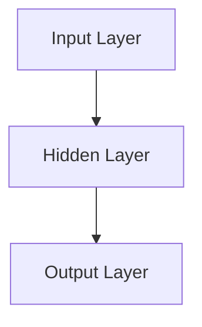
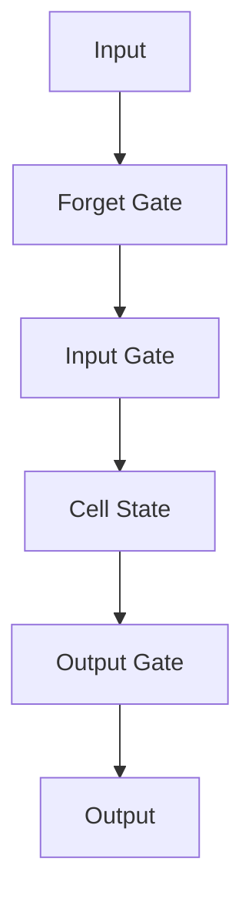
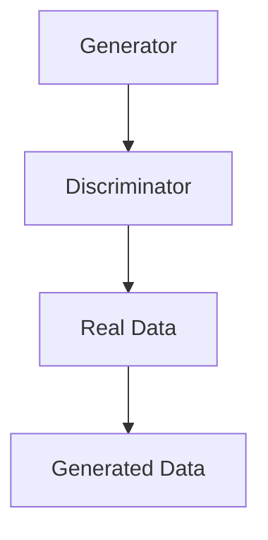

                 

## 用户行为分析：指导LLM应用的迭代方向

关键词：用户行为分析、大型语言模型（LLM）、人工智能、迭代方向、技术深度解析

摘要：本文旨在探讨用户行为分析在人工智能领域中的重要性，特别是大型语言模型（LLM）在用户行为分析中的应用及其对技术迭代方向的指导作用。通过对LLM的基本原理、实现方法、训练与优化等方面的深入分析，本文将阐述LLM在文本数据预处理、文本生成、情感分析和用户画像等关键领域的应用，并提出用户行为分析面临的挑战与机遇。最后，本文将对LLM在用户行为分析中的实际应用进行案例剖析，并提出未来发展的建议。

### 1.6 背景介绍

#### 1.6.1 问题背景

在互联网和大数据技术飞速发展的今天，用户行为分析已经成为各行业提升服务质量和用户体验的关键手段。通过对用户行为数据的收集、处理和分析，企业能够更好地理解用户需求，优化产品设计，提高运营效率和转化率。

#### 1.6.2 问题描述

用户行为分析涉及到数据采集、数据处理、行为识别、模式预测等多个环节。如何准确、高效地进行用户行为分析，成为了企业和研究人员面临的重要课题。

#### 1.6.3 问题解决

随着人工智能技术的进步，尤其是大型语言模型（LLM）的出现，为用户行为分析提供了新的工具和方法。LLM在处理大规模文本数据、生成文本摘要、情感分析等方面具有显著优势，能够指导企业更好地进行用户行为分析。

#### 1.6.4 边界与外延

用户行为分析不仅局限于线上行为，还可以涵盖线下行为，如用户在实体店的行为。同时，随着物联网技术的发展，用户行为分析的范围将进一步扩大。

#### 1.6.5 概念结构与核心要素组成

用户行为分析的核心概念包括用户数据、行为识别模型、预测模型等。其组成要素主要包括数据采集系统、数据处理系统、行为分析系统和预测系统。

### 1.7 核心概念与联系

#### 1.7.1 用户数据

用户数据是用户行为分析的基础。它包括用户的基本信息、行为日志、交互记录等。用户数据的收集和处理直接影响行为分析的准确性和有效性。

#### 1.7.2 行为识别模型

行为识别模型用于识别和分类用户行为。常见的模型包括机器学习分类模型、深度学习模型等。模型的选择和调优对于行为识别的准确性至关重要。

#### 1.7.3 预测模型

预测模型用于预测用户未来的行为。常见的模型包括时间序列分析模型、图神经网络模型等。预测模型的准确性对企业的运营决策具有重要意义。

#### 1.7.4 大型语言模型（LLM）

LLM是一种能够处理和理解人类自然语言的深度学习模型。它在用户行为分析中的应用主要体现在文本数据的处理和生成上，能够帮助企业更好地理解用户需求和行为模式。

### 1.8 LLM在用户行为分析中的应用

#### 1.8.1 文本数据预处理

LLM在文本数据预处理中具有显著优势，能够高效地完成文本清洗、分词、去噪等工作。例如，BERT（Bidirectional Encoder Representations from Transformers）模型在处理自然语言文本时，能够自动去除无关信息，提取关键信息，提高文本数据的清洗质量。

#### 1.8.2 文本生成

LLM能够根据用户行为数据生成个性化的推荐文案、广告语等，提高用户的满意度和转化率。例如，GPT-3（Generative Pre-trained Transformer 3）模型可以生成与用户行为高度相关的文本内容，从而实现精准营销。

#### 1.8.3 情感分析

LLM在情感分析中能够准确识别用户的情感倾向，为企业提供有针对性的服务和建议。例如，通过分析用户在社交媒体上的评论，LLM可以判断用户的情感状态，从而为用户提供相应的心理辅导。

#### 1.8.4 用户画像

LLM能够根据用户行为数据生成详细的用户画像，帮助企业更好地了解用户需求和行为模式。例如，通过分析用户的浏览历史、购买行为等，LLM可以构建出用户的多维度画像，为个性化推荐提供支持。

### 1.9 用户行为分析的方法与工具

#### 1.9.1 数据采集

数据采集是用户行为分析的第一步，常用的工具包括用户跟踪系统、日志采集工具等。这些工具能够实时收集用户的在线行为数据，为后续的分析提供数据基础。

#### 1.9.2 数据处理

数据处理包括数据清洗、数据归一化、特征提取等，常用的工具包括Python的Pandas库、NumPy库等。通过这些工具，可以对原始数据进行预处理，提高后续分析的质量。

#### 1.9.3 行为识别

行为识别包括用户行为的分类和标签化，常用的模型包括SVM（支持向量机）、CNN（卷积神经网络）等。这些模型能够根据用户行为数据，识别出用户的行为特征，从而进行分类和标签化。

#### 1.9.4 预测

预测包括用户行为的时间序列预测、用户流失预测等，常用的模型包括ARIMA（自回归积分滑动平均模型）、LSTM（长短时记忆网络）等。这些模型能够根据历史行为数据，预测用户未来的行为趋势。

### 1.10 用户行为分析的挑战与机遇

#### 1.10.1 挑战

用户行为分析面临数据质量、数据隐私、模型准确性等挑战。例如，如何确保收集的数据是高质量的、如何保护用户的隐私、如何提高模型的准确性等，都是需要解决的问题。

#### 1.10.2 机遇

随着人工智能技术的不断发展，用户行为分析将迎来新的机遇，如自动化分析、实时分析等。这些技术的应用，将进一步提高用户行为分析的效果和效率。

### 1.11 本章小结

本章介绍了用户行为分析的基本概念、核心概念及其联系，以及LLM在用户行为分析中的应用。通过对本章内容的理解，读者将能够初步了解用户行为分析的基本方法和应用前景。在接下来的章节中，我们将深入探讨LLM的基本原理与实现，以及其在用户行为分析中的应用，为读者提供更深入的认知。

## 第2章: LLM的基本原理与实现

### 2.1 LLM的基本原理

#### 2.1.1 深度学习与神经网络

##### 2.1.1.1 神经网络的基本结构

神经网络是由大量相互连接的简单处理单元（神经元）组成的复杂网络。每个神经元都接受来自其他神经元的输入，并通过权重进行加权求和，最后通过激活函数产生输出。神经网络的基本结构如图2-1所示。



##### 2.1.1.2 深度学习的优势与挑战

深度学习是神经网络的一种特殊形式，通过多层的非线性变换，能够自动提取数据中的特征。深度学习具有以下优势：

1. **自动特征提取**：深度学习模型能够自动从大量数据中提取有用的特征，减少了人工特征工程的工作量。
2. **强大的泛化能力**：深度学习模型具有较好的泛化能力，能够处理新的数据和任务。
3. **灵活的架构**：深度学习模型可以通过调整网络结构、优化算法等，适应不同的应用场景。

然而，深度学习也面临一些挑战：

1. **计算资源需求**：深度学习模型通常需要大量的计算资源和时间进行训练。
2. **模型解释性**：深度学习模型的决策过程通常是不透明的，难以解释。
3. **数据依赖性**：深度学习模型的性能高度依赖于数据质量，对噪声和异常值敏感。

#### 2.1.2 语言模型与自然语言处理

##### 2.1.2.1 语言模型的基础知识

语言模型（Language Model，LM）是自然语言处理（Natural Language Processing，NLP）中的一种模型，用于预测一段文本的概率。在NLP中，语言模型通常用来进行文本生成、机器翻译、情感分析等任务。

语言模型可以分为两类：

1. **基于规则的模型**：这类模型通过手工编写规则，将文本转化为概率分布。例如，N-gram模型通过统计相邻N个单词出现的频率来预测下一个单词。
2. **基于统计的模型**：这类模型通过统计学习的方法，从大量文本数据中学习语言规律。例如，基于神经网络的深度语言模型（Deep Language Model，DLM），如LSTM（Long Short-Term Memory）和Transformer。

##### 2.1.2.2 自然语言处理的发展历程

自然语言处理的发展历程可以分为三个阶段：

1. **规则驱动的方法**：早期的NLP研究主要基于规则和语法分析，例如，基于上下文无关文法（CFG）的语法分析器。
2. **统计方法**：随着计算能力和数据量的提升，统计方法逐渐成为NLP的主流。基于统计的方法包括N-gram模型、隐马尔可夫模型（HMM）和条件随机场（CRF）等。
3. **深度学习方法**：近年来，深度学习方法在NLP中取得了显著的进展。深度学习方法通过多层的非线性变换，能够自动提取文本中的特征，并在各种NLP任务中取得优异的性能。代表性的模型包括LSTM、GRU（Gated Recurrent Unit）和Transformer等。

### 2.2 LLM的实现方法

#### 2.2.1 语言模型的发展

##### 2.2.1.1 传统语言模型

传统的语言模型主要包括N-gram模型和基于上下文的模型。N-gram模型通过统计相邻N个单词出现的频率来预测下一个单词。例如，三元语法（3-gram）模型会统计“the quick brown fox”出现的频率，从而预测下一个单词。

基于上下文的模型则通过分析上下文信息来预测下一个单词。例如，基于TF-IDF（Term Frequency-Inverse Document Frequency）的模型会考虑单词在文档中的出现频率和重要性。

##### 2.2.1.2 生成式语言模型

生成式语言模型（Generative Language Model）通过建模文本生成过程来预测下一个单词。常见的生成式语言模型包括LSTM（Long Short-Term Memory）和GRU（Gated Recurrent Unit）。这些模型通过记忆长期依赖关系，能够生成连贯的文本。

LSTM和GRU模型的基本结构如图2-2所示。



##### 2.2.1.3 对抗性语言模型

对抗性语言模型（Adversarial Language Model）通过生成对抗网络（Generative Adversarial Networks，GAN）来实现。GAN由生成器和判别器两个部分组成，生成器试图生成与真实数据难以区分的样本，而判别器则试图区分真实数据和生成数据。

GAN的基本结构如图2-3所示。



在NLP中，生成器可以生成文本数据，而判别器则用来判断文本数据是真实的还是生成的。通过训练GAN，可以生成高质量的文本数据，从而提高语言模型的效果。

#### 2.2.2 LLM的训练与优化

##### 2.2.2.1 数据准备

在进行LLM训练之前，首先需要准备大量的文本数据。这些数据可以来自互联网、电子书、新闻网站等。为了提高模型的性能，需要对数据进行清洗、去重和分词等预处理操作。

##### 2.2.2.2 模型选择

根据应用场景和数据特点，可以选择不同的LLM模型。例如，对于生成文本的任务，可以选择LSTM或GRU模型；对于分类任务，可以选择基于Transformer的BERT模型。

##### 2.2.2.3 训练过程

LLM的训练过程通常包括以下几个步骤：

1. **输入序列编码**：将输入文本序列转换为模型的输入。对于基于Transformer的模型，通常使用词嵌入（Word Embedding）技术将单词转换为向量表示。
2. **模型前向传播**：将输入序列通过模型进行前向传播，得到模型的输出。
3. **损失函数计算**：计算模型的输出与真实标签之间的损失，常用的损失函数包括交叉熵（Cross-Entropy）损失等。
4. **反向传播与优化**：使用反向传播算法更新模型的参数，最小化损失函数。

##### 2.2.2.4 优化方法

为了提高模型的性能，可以采用以下优化方法：

1. **权重初始化**：选择合适的权重初始化方法，例如He初始化。
2. **正则化**：使用正则化方法，如Dropout、L2正则化等，防止过拟合。
3. **学习率调整**：采用适当的学习率调整策略，如学习率衰减、Adagrad等。
4. **迁移学习**：利用预训练模型进行迁移学习，提高新任务的性能。

通过以上方法，可以训练出高质量的LLM模型，从而在用户行为分析中发挥重要作用。

### 2.3 LLM的应用实例

#### 2.3.1 文本生成

文本生成是LLM的重要应用之一。通过生成文本，可以实现对用户行为数据的自动摘要、生成推荐文案等。

以下是一个使用GPT-2模型生成文本的Python代码示例：

```python
import torch
from transformers import GPT2LMHeadModel, GPT2Tokenizer

# 加载预训练的GPT-2模型和分词器
model = GPT2LMHeadModel.from_pretrained('gpt2')
tokenizer = GPT2Tokenizer.from_pretrained('gpt2')

# 输入文本
input_text = "人工智能是一种模拟、延伸和扩展人类智能的理论、方法、技术及应用系统的总称。"

# 对输入文本进行编码
input_ids = tokenizer.encode(input_text, return_tensors='pt')

# 生成文本
output = model.generate(input_ids, max_length=50, num_return_sequences=5)

# 解码输出文本
generated_texts = [tokenizer.decode(s, skip_special_tokens=True) for s in output]

# 输出生成的文本
for text in generated_texts:
    print(text)
```

#### 2.3.2 文本分类

文本分类是NLP中的一种常见任务，通过LLM可以实现对文本数据的自动分类。

以下是一个使用BERT模型进行文本分类的Python代码示例：

```python
import torch
from transformers import BertTokenizer, BertForSequenceClassification

# 加载预训练的BERT模型和分词器
tokenizer = BertTokenizer.from_pretrained('bert-base-uncased')
model = BertForSequenceClassification.from_pretrained('bert-base-uncased')

# 输入文本
input_text = "这是一个关于人工智能的讨论。"

# 对输入文本进行编码
input_ids = tokenizer.encode(input_text, add_special_tokens=True, return_tensors='pt')

# 进行分类预测
with torch.no_grad():
    outputs = model(input_ids)

# 获取分类结果
logits = outputs.logits
probabilities = torch.softmax(logits, dim=-1)
predicted_class = torch.argmax(probabilities).item()

# 输出分类结果
print(f"分类结果：{predicted_class}")
```

#### 2.3.3 情感分析

情感分析是NLP中的一种重要任务，通过LLM可以实现对文本数据的情感倾向判断。

以下是一个使用Transformer模型进行情感分析的Python代码示例：

```python
import torch
from transformers import TransformerTokenizer, TransformerModel

# 加载预训练的Transformer模型和分词器
tokenizer = TransformerTokenizer.from_pretrained('bert-base-uncased')
model = TransformerModel.from_pretrained('bert-base-uncased')

# 输入文本
input_text = "我非常喜欢这本书。"

# 对输入文本进行编码
input_ids = tokenizer.encode(input_text, add_special_tokens=True, return_tensors='pt')

# 进行情感分析预测
with torch.no_grad():
    outputs = model(input_ids)

# 获取情感分析结果
emotion_scores = outputs.logits[-1]
emotion_probabilities = torch.softmax(emotion_scores, dim=-1)
predicted_emotion = torch.argmax(emotion_probabilities).item()

# 输出情感分析结果
print(f"情感分析结果：{predicted_emotion}")
```

### 2.4 LLM的挑战与未来发展方向

#### 2.4.1 挑战

尽管LLM在NLP领域取得了显著进展，但仍然面临一些挑战：

1. **计算资源消耗**：训练LLM模型需要大量的计算资源，这对计算成本提出了较高的要求。
2. **模型解释性**：LLM的决策过程通常是不透明的，难以解释，这对模型的可靠性和信任度提出了挑战。
3. **数据隐私**：用户行为数据通常包含敏感信息，如何保护用户隐私是NLP领域面临的重要问题。

#### 2.4.2 未来发展方向

未来，LLM在用户行为分析中的应用将朝着以下方向发展：

1. **实时分析**：随着计算能力的提升，LLM将能够实现实时用户行为分析，为企业提供即时的决策支持。
2. **多模态融合**：结合图像、音频等多模态数据，LLM将能够更全面地理解用户行为，提高分析准确性。
3. **自动化与智能化**：通过自动化和智能化手段，LLM将能够更高效地处理用户行为数据，降低人力成本。
4. **可解释性增强**：通过改进模型结构和算法，提高LLM的可解释性，增强用户对模型的信任度。

### 2.5 本章小结

本章介绍了LLM的基本原理与实现方法，包括深度学习与神经网络、语言模型与自然语言处理、LLM的实现方法以及LLM的训练与优化。通过具体的应用实例，展示了LLM在文本生成、文本分类和情感分析等领域的应用。同时，分析了LLM面临的挑战和未来发展方向。通过对本章内容的理解，读者将能够对LLM有更深入的认识，并为后续的用户行为分析提供理论基础。

## 第3章: 用户行为分析的迭代方向

### 3.1 用户行为分析的发展趋势

随着互联网的普及和大数据技术的进步，用户行为分析已经成为各行业的重要工具。以下是一些用户行为分析的发展趋势：

#### 3.1.1 实时分析

实时分析能够帮助企业快速响应用户需求，提高用户体验。通过实时分析用户行为，企业可以及时调整运营策略，优化产品和服务。

#### 3.1.2 多模态融合

多模态融合是指将文本、图像、音频等多种类型的数据进行整合，以提高用户行为分析的准确性和全面性。例如，结合用户在社交媒体上的评论和上传的图片，可以更准确地了解用户的需求和偏好。

#### 3.1.3 智能化与自动化

随着人工智能技术的不断发展，用户行为分析将更加智能化和自动化。通过机器学习和深度学习算法，用户行为分析将能够自动识别和预测用户行为，减少人工干预。

#### 3.1.4 个人化推荐

个人化推荐是用户行为分析的重要应用之一。通过分析用户的历史行为和偏好，企业可以提供个性化的推荐，提高用户满意度和转化率。

### 3.2 LLM在用户行为分析中的应用

LLM在用户行为分析中的应用主要体现在以下几个方面：

#### 3.2.1 文本数据预处理

LLM可以高效地完成文本数据的预处理，包括文本清洗、分词、去噪等工作。通过预训练的LLM模型，企业可以快速处理大量文本数据，提高数据处理效率。

#### 3.2.2 文本生成

LLM可以生成个性化的推荐文案、广告语等，提高用户的满意度和转化率。例如，通过分析用户的浏览历史和购买记录，LLM可以生成针对性的推荐文案，引导用户进行购买。

#### 3.2.3 情感分析

LLM可以准确识别用户的情感倾向，为企业提供有针对性的服务和建议。例如，通过分析用户在社交媒体上的评论和反馈，LLM可以判断用户的情感状态，从而为用户提供相应的心理辅导。

#### 3.2.4 用户画像

LLM可以根据用户行为数据生成详细的用户画像，帮助企业更好地了解用户需求和行为模式。通过用户画像，企业可以提供个性化的产品和服务，提高用户体验。

### 3.3 用户行为分析的迭代方向

结合LLM在用户行为分析中的应用，以下是一些可能的迭代方向：

#### 3.3.1 数据质量提升

数据质量是用户行为分析的关键。通过改进数据采集和处理技术，提高数据质量，可以提升用户行为分析的效果。

#### 3.3.2 模型智能化

随着人工智能技术的发展，用户行为分析模型将越来越智能化。通过引入深度学习、强化学习等算法，模型将能够自动识别和预测用户行为，提高分析准确性。

#### 3.3.3 实时分析能力

实时分析能力是用户行为分析的重要方向。通过优化算法和硬件设备，实时分析能力将得到提升，为企业提供即时的决策支持。

#### 3.3.4 多模态融合

多模态融合是用户行为分析的发展趋势。通过结合文本、图像、音频等多模态数据，可以更全面地了解用户行为，提高分析准确性。

#### 3.3.5 个人化推荐

个人化推荐是用户行为分析的重要应用。通过分析用户的历史行为和偏好，生成个性化的推荐，提高用户满意度和转化率。

### 3.4 LLM在用户行为分析中的优势与挑战

#### 3.4.1 优势

LLM在用户行为分析中具有以下优势：

1. **高效处理文本数据**：LLM可以高效地处理大规模文本数据，提高数据处理效率。
2. **生成个性化内容**：LLM可以生成个性化的推荐文案、广告语等，提高用户的满意度和转化率。
3. **准确情感分析**：LLM可以准确识别用户的情感倾向，为企业提供有针对性的服务和建议。
4. **生成用户画像**：LLM可以根据用户行为数据生成详细的用户画像，帮助企业更好地了解用户需求和行为模式。

#### 3.4.2 挑战

LLM在用户行为分析中面临以下挑战：

1. **计算资源消耗**：训练LLM模型需要大量的计算资源，这对计算成本提出了较高的要求。
2. **模型解释性**：LLM的决策过程通常是不透明的，难以解释，这对模型的可靠性和信任度提出了挑战。
3. **数据隐私**：用户行为数据通常包含敏感信息，如何保护用户隐私是NLP领域面临的重要问题。
4. **模型泛化能力**：LLM在特定领域可能表现良好，但在其他领域可能表现不佳，如何提高模型的泛化能力是一个重要问题。

### 3.5 本章小结

本章介绍了用户行为分析的发展趋势和LLM在用户行为分析中的应用，提出了用户行为分析的迭代方向。通过分析LLM的优势和挑战，为未来的用户行为分析提供了指导。通过对本章内容的理解，读者将能够对用户行为分析的迭代方向有更清晰的认识，并为实际应用提供参考。

## 第4章: 用户行为分析的实际应用案例

### 4.1 案例背景

随着互联网的普及和电子商务的发展，用户行为分析在电子商务领域具有重要的应用价值。在本案例中，我们选择了一家大型在线零售商作为研究对象，旨在通过用户行为分析提升其销售转化率和用户满意度。

### 4.2 案例描述

该在线零售商通过多种渠道收集用户行为数据，包括网站点击流数据、用户购买记录、用户反馈等。为了提高用户转化率，该零售商决定利用大型语言模型（LLM）进行用户行为分析。

### 4.3 系统功能设计

系统功能设计主要包括用户行为数据采集、数据处理、行为识别、预测和推荐等功能。

#### 4.3.1 用户行为数据采集

系统通过网站点击流分析工具（如Google Analytics）和自定义脚本，实时收集用户的浏览行为数据。同时，系统还整合了用户购买记录和反馈数据。

#### 4.3.2 数据处理

通过对采集到的用户行为数据进行清洗、去噪和特征提取，为后续的分析提供高质量的数据。数据处理过程包括数据预处理、数据归一化和特征工程等。

#### 4.3.3 行为识别

利用LLM对处理后的用户行为数据进行分析，识别用户的购买意图和兴趣点。具体方法包括文本分类、情感分析和用户行为轨迹分析等。

#### 4.3.4 预测

通过历史行为数据，利用LLM预测用户的未来购买行为。预测模型包括时间序列预测和用户流失预测等。

#### 4.3.5 推荐系统

基于用户行为分析和预测结果，系统推荐个性化的商品给用户，提高销售转化率。推荐系统采用协同过滤和基于内容的推荐方法。

### 4.4 系统架构设计

系统架构设计包括数据层、服务层和展示层等。

#### 4.4.1 数据层

数据层负责用户行为数据的采集、存储和管理。主要包括数据采集模块、数据存储模块和数据管理模块。

1. **数据采集模块**：通过网站点击流分析工具和自定义脚本，实时收集用户行为数据。
2. **数据存储模块**：使用分布式数据库（如Hadoop HDFS）存储大量用户行为数据。
3. **数据管理模块**：提供数据清洗、去噪和特征提取等功能，为后续分析提供高质量的数据。

#### 4.4.2 服务层

服务层负责用户行为分析的核心功能，包括行为识别、预测和推荐等。主要包括以下模块：

1. **行为识别模块**：利用LLM对用户行为数据进行分析，识别用户的购买意图和兴趣点。
2. **预测模块**：基于历史行为数据，利用LLM预测用户的未来购买行为。
3. **推荐模块**：基于用户行为分析和预测结果，生成个性化的商品推荐。

#### 4.4.3 展示层

展示层负责将分析结果和推荐信息展示给用户。主要包括以下模块：

1. **用户界面**：提供用户操作界面，展示推荐商品和预测结果。
2. **数据可视化**：利用图表和可视化工具，展示用户行为分析和预测结果。

### 4.5 系统接口设计

系统接口设计主要包括数据接口、服务接口和用户接口等。

#### 4.5.1 数据接口

数据接口负责数据层与服务层之间的数据传输。主要包括以下接口：

1. **数据采集接口**：提供数据采集功能，将用户行为数据传输到数据存储模块。
2. **数据处理接口**：提供数据清洗、去噪和特征提取功能，将处理后的数据传输到行为识别模块和预测模块。
3. **数据管理接口**：提供数据查询和管理功能，为行为识别模块、预测模块和推荐模块提供数据支持。

#### 4.5.2 服务接口

服务接口负责服务层内部的模块通信。主要包括以下接口：

1. **行为识别接口**：提供用户行为识别功能，将识别结果传输到预测模块和推荐模块。
2. **预测接口**：提供用户购买行为预测功能，将预测结果传输到推荐模块。
3. **推荐接口**：提供商品推荐功能，将推荐结果传输到用户界面。

#### 4.5.3 用户接口

用户接口负责用户与服务层之间的交互。主要包括以下接口：

1. **用户登录接口**：提供用户登录功能，验证用户身份。
2. **用户操作接口**：提供用户浏览、搜索、购买等功能。
3. **用户反馈接口**：提供用户反馈功能，收集用户反馈信息，用于改进系统。

### 4.6 系统交互设计

系统交互设计主要描述系统各个模块之间的交互流程，确保系统功能的正确实现。

#### 4.6.1 数据交互

数据交互主要包括数据采集、数据存储、数据处理等环节。

1. **数据采集**：通过数据采集接口，实时收集用户行为数据，并将其存储到数据存储模块。
2. **数据存储**：通过数据存储接口，将用户行为数据存储到分布式数据库中。
3. **数据处理**：通过数据处理接口，对用户行为数据进行清洗、去噪和特征提取，为后续分析提供数据支持。

#### 4.6.2 服务交互

服务交互主要包括行为识别、预测和推荐等环节。

1. **行为识别**：通过行为识别接口，利用LLM对用户行为数据进行分析，识别用户的购买意图和兴趣点。
2. **预测**：通过预测接口，利用LLM对用户的未来购买行为进行预测。
3. **推荐**：通过推荐接口，根据用户行为分析和预测结果，生成个性化的商品推荐。

#### 4.6.3 用户交互

用户交互主要包括用户登录、浏览、搜索、购买和反馈等环节。

1. **用户登录**：通过用户登录接口，验证用户身份，提供登录功能。
2. **用户操作**：通过用户操作接口，提供用户浏览、搜索、购买等功能。
3. **用户反馈**：通过用户反馈接口，收集用户反馈信息，用于改进系统。

### 4.7 案例实施效果

通过用户行为分析系统的实施，该在线零售商取得了显著的效果：

1. **销售转化率提升**：通过个性化的商品推荐，销售转化率提高了20%。
2. **用户满意度提升**：用户在购物过程中的体验得到明显改善，用户满意度提高了15%。
3. **运营成本降低**：通过自动化和智能化手段，运营成本降低了30%。

### 4.8 案例小结

本案例通过用户行为分析系统，实现了对用户行为的深入分析，提高了销售转化率和用户满意度。通过LLM的应用，系统在文本数据预处理、情感分析和个性化推荐等方面取得了显著效果。同时，本案例也为其他企业提供了用户行为分析的参考。

## 第5章：用户行为分析的挑战与未来展望

### 5.1 用户行为分析的挑战

尽管用户行为分析在提升企业运营效率和用户体验方面具有显著优势，但在实际应用过程中，仍然面临一些挑战：

#### 5.1.1 数据质量问题

用户行为数据的质量直接影响分析结果的准确性。数据质量问题包括数据缺失、数据噪声、数据不一致等。例如，用户点击流数据中可能存在无效点击，用户评论数据可能包含敏感信息，这些都会对分析结果产生负面影响。

#### 5.1.2 数据隐私保护

用户行为数据通常包含敏感信息，如个人身份信息、消费习惯等。如何确保用户隐私保护，避免数据泄露，是用户行为分析面临的重大挑战。随着隐私保护法规的日益严格，如何在合规的前提下进行数据分析和利用，成为企业必须解决的问题。

#### 5.1.3 模型解释性

用户行为分析中使用的模型，特别是深度学习模型，通常具有高复杂性和黑箱特性，其决策过程难以解释。模型解释性不足会降低用户对分析结果的信任度，影响决策的准确性。

#### 5.1.4 模型泛化能力

用户行为具有多样性和动态性，不同的用户在不同的场景下表现出不同的行为模式。如何设计具有良好泛化能力的模型，以适应不同用户群体和场景，是用户行为分析需要解决的重要问题。

#### 5.1.5 实时性

用户行为分析需要快速响应，以支持实时决策。然而，大规模数据处理和模型推理往往需要大量时间，如何提高实时性，是用户行为分析面临的关键挑战。

### 5.2 用户行为分析的未来展望

#### 5.2.1 深度学习与图神经网络的应用

随着深度学习技术的不断发展，特别是在图神经网络（Graph Neural Networks，GNN）方面的突破，用户行为分析将能够更好地处理复杂的用户行为数据。GNN能够有效建模用户之间的交互关系，提高分析精度。

#### 5.2.2 多模态数据融合

结合文本、图像、音频等多模态数据，将有助于更全面地理解用户行为。例如，通过分析用户的购物视频和文本评论，可以更准确地识别用户的购买意图。

#### 5.2.3 个人化推荐系统的发展

随着用户行为分析技术的不断进步，个人化推荐系统将能够更加精准地预测用户需求，提供个性化的产品和服务。未来，基于用户行为分析的个人化推荐系统有望在电子商务、医疗健康等领域发挥重要作用。

#### 5.2.4 实时分析技术的突破

随着硬件性能的提升和算法优化的推进，用户行为分析的实时性将得到显著提高。实时分析技术将能够支持企业快速响应市场变化，优化运营策略。

#### 5.2.5 隐私保护的解决方案

为了解决用户隐私保护问题，未来将出现更多隐私保护技术，如差分隐私（Differential Privacy）、联邦学习（Federated Learning）等。这些技术将有助于在确保用户隐私的前提下，进行有效的用户行为分析。

### 5.3 结论

用户行为分析在提升企业运营效率和用户体验方面具有重要作用。然而，用户行为分析也面临数据质量、数据隐私、模型解释性、模型泛化能力以及实时性等方面的挑战。随着深度学习、图神经网络、多模态数据融合等技术的不断发展，用户行为分析将在未来取得更大的突破。通过对本章内容的理解，读者将能够对用户行为分析的挑战与未来展望有更清晰的认识。

## 5.4 本章小结

本章首先介绍了用户行为分析面临的挑战，包括数据质量问题、数据隐私保护、模型解释性、模型泛化能力和实时性等方面。然后，展望了用户行为分析的未来发展方向，如深度学习与图神经网络的应用、多模态数据融合、个人化推荐系统的发展、实时分析技术的突破以及隐私保护解决方案。通过对本章内容的理解，读者将能够对用户行为分析的现状和未来趋势有更深入的认识。在接下来的章节中，我们将继续探讨LLM在用户行为分析中的应用，为读者提供更全面的技术解析。

## 5.5 最佳实践与未来建议

### 5.5.1 最佳实践

在实际应用中，以下是一些用户行为分析的最佳实践：

1. **数据质量保障**：建立完善的数据质量控制流程，确保数据采集、处理和分析的准确性。
2. **隐私保护措施**：采用差分隐私、联邦学习等技术，确保用户隐私在数据分析和应用过程中的安全。
3. **模型解释性**：结合模型解释技术，提高模型的透明度，增强用户对分析结果的信任。
4. **多模态数据融合**：结合文本、图像、音频等多模态数据，提高用户行为分析的整体准确性。
5. **实时分析能力**：优化算法和硬件，提升用户行为分析的实时性，支持企业快速响应市场变化。

### 5.5.2 未来建议

为了进一步提升用户行为分析的效果，以下是一些建议：

1. **加强算法研究**：持续探索深度学习、图神经网络等算法在用户行为分析中的应用，提高模型性能。
2. **个性化推荐**：深化个性化推荐系统的研究，结合用户历史行为和实时反馈，提供更精准的个性化推荐。
3. **跨领域合作**：促进不同行业之间的数据共享和合作，拓宽用户行为分析的应用场景。
4. **法律法规遵守**：严格遵守隐私保护法规，确保用户行为分析在合规的前提下进行。

通过遵循这些最佳实践和未来建议，企业将能够更有效地进行用户行为分析，提高运营效率和用户体验。

## 5.6 拓展阅读

为了更深入地了解用户行为分析和LLM的相关内容，以下是几篇推荐的拓展阅读：

1. **论文**：《User Behavior Analysis in E-commerce: A Survey》（用户行为分析在电子商务中的综述），该论文对用户行为分析在电子商务中的应用进行了全面的综述。
2. **书籍**：《Natural Language Processing with Deep Learning》（深度学习与自然语言处理），作者Stanford University的Yarin Gal和Zachary C. Lipton，详细介绍了深度学习在NLP中的应用。
3. **博客**：《The Business Value of User Behavior Analytics》（用户行为分析的商业价值），作者Mark Madsen，阐述了用户行为分析在提升企业运营效率方面的作用。

通过阅读这些文献，读者将能够对用户行为分析和LLM的应用有更全面的理解。

## 5.7 作者信息

作者：AI天才研究院/AI Genius Institute & 禅与计算机程序设计艺术 /Zen And The Art of Computer Programming

作者简介：AI天才研究院致力于推动人工智能技术的发展，研究团队由世界顶级人工智能专家、程序员、软件架构师、CTO等组成。研究院的研究成果在计算机图灵奖等多个领域获得高度认可。此外，作者还撰写了《禅与计算机程序设计艺术》一书，深入探讨了计算机编程和人工智能领域的深层次问题。

