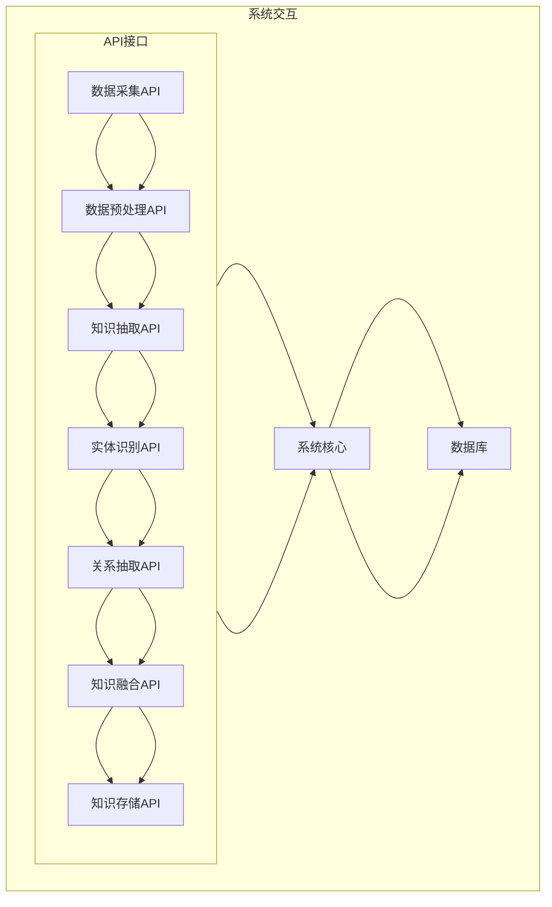

                 


# 知识图谱动态更新：检验LLM自主扩展知识库的能力

## 关键词：知识图谱、动态更新、大型语言模型（LLM）、知识库扩展、自然语言处理

> 摘要：本文旨在探讨知识图谱的动态更新技术，检验大型语言模型（LLM）在自主扩展知识库方面的能力。通过深入分析知识图谱的背景、核心概念、算法原理以及应用案例，本文揭示了LLM在知识图谱动态更新中的关键作用，并为相关技术研究和应用提供了有益的参考。

## **Step 1: 引言背景介绍**

### **1.1 知识图谱的重要性**

知识图谱作为一种结构化知识表示形式，能够有效捕捉实体及其关系，为信息检索、自然语言处理和智能推荐等领域提供强有力的支持。它将海量信息转化为有意义的关联网络，使得计算机能够更好地理解和处理人类知识。

然而，随着信息量的爆炸式增长，知识图谱的静态构建已经无法满足实际需求。动态更新成为了知识图谱建设的关键环节。本文将重点探讨知识图谱的动态更新技术，并检验大型语言模型（LLM）在自主扩展知识库方面的能力。

### **1.2 问题背景**

传统的方法通常依赖于人工或半自动化更新，不仅效率低下，而且容易出现错误。例如，人工更新需要大量人力和时间成本，而半自动化更新则依赖于规则和模板，无法灵活应对复杂多变的信息环境。

### **1.3 问题描述**

动态更新知识图谱需要解决的核心问题是：如何高效、准确地捕捉和整合实时变化的信息。这要求知识图谱系统能够自我学习、自我更新，以保持其时效性和准确性。

### **1.4 问题解决**

近年来，随着人工智能技术的发展，特别是大型语言模型（LLM）的兴起，为知识图谱的动态更新提供了新的可能性。LLM通过自主学习大量的文本数据，能够理解语义和知识关系，从而在一定程度上实现了知识图谱的自动扩展和更新。

### **1.5 边界与外延**

知识图谱的动态更新不仅涉及到技术层面的挑战，还包括数据质量、知识整合和系统稳定性等多个方面。因此，本文将探讨如何在实际应用中平衡这些因素，实现知识图谱的可持续更新。

### **1.6 概念结构与核心要素组成**

知识图谱的动态更新涉及以下核心概念和要素：
- **实体**：知识图谱中的基本元素，代表具体的对象或概念。
- **关系**：实体之间的关系，用于描述实体之间的关联。
- **知识更新机制**：用于捕捉和整合新知识的技术手段。
- **自主学习**：LLM如何通过自主学习实现知识扩展。

## **Step 2: 核心概念与联系**

### **2.1 核心概念原理**

#### **2.1.1 知识图谱**

知识图谱是一种基于图论的知识表示方法，通过实体和关系的网络结构来表示知识。它能够将离散的信息片段组织成有意义的整体，为各种应用提供语义理解能力。

#### **2.1.2 大型语言模型（LLM）**

LLM是一种能够对自然语言进行理解和生成的人工智能模型，如GPT-3、BERT等。它们通过学习大量的文本数据，掌握了丰富的语言知识和语义关系。

#### **2.1.3 动态更新机制**

动态更新机制是指知识图谱系统能够实时捕捉新信息，并将其纳入图谱中的方法。这通常包括数据采集、知识抽取、知识融合和图谱更新等步骤。

### **2.2 概念属性特征对比表格**

| 概念       | 属性特征                                             | 关联关系                 |
|------------|----------------------------------------------------|------------------------|
| 知识图谱   | 结构化、网络化、语义丰富                             | 实体、关系             |
| LLM        | 自动学习、语义理解、生成能力                         | 文本数据、语言知识     |
| 动态更新   | 实时性、准确性、高效性                             | 数据采集、知识抽取等   |

### **2.3 ER实体关系图架构**

```mermaid
erDiagram
  Entity: 实体
  Relation: 关系
  Entity ||--|{ Relation }--| Entity
  Entity ||--|{ Knowledge }--| Entity
  LLM ||--|{ Text Data }--| Knowledge
  Dynamic Update ||--|{ Mechanism }--| Knowledge
```

## **Step 3: 算法原理讲解**

### **3.1 LLM在知识图谱动态更新中的应用**

LLM在知识图谱动态更新中的应用主要基于以下原理：

1. **文本数据采集**：通过爬虫等技术手段，收集互联网上的大量文本数据。
2. **知识抽取**：利用自然语言处理技术，从文本数据中提取实体和关系。
3. **知识融合**：将新提取的知识与现有知识图谱进行融合，确保知识的一致性和完整性。
4. **图谱更新**：将融合后的知识更新到知识图谱中，实现动态更新。

### **3.1.1 知识抽取算法**

知识抽取算法是知识图谱动态更新的关键步骤之一。以下是一个基于LLM的知识抽取算法流程：

1. **数据预处理**：对采集到的文本数据进行清洗和预处理，包括分词、去停用词、词干提取等。
2. **实体识别**：利用LLM对文本进行实体识别，标记出文本中的实体。
3. **关系抽取**：通过分析实体之间的语义关系，抽取实体之间的关联关系。
4. **实体关系融合**：将新抽取的实体和关系与现有知识图谱进行融合，确保知识的一致性。

### **3.1.2 知识融合算法**

知识融合算法是将新提取的知识与现有知识图谱进行整合的方法。以下是一个简单的知识融合算法：

1. **实体匹配**：将新提取的实体与现有知识图谱中的实体进行匹配，判断是否已存在。
2. **关系合并**：对于新提取的关系，与现有知识图谱中的关系进行合并，确保知识的一致性。
3. **图谱更新**：将融合后的知识更新到知识图谱中，实现动态更新。

### **3.1.3 算法原理讲解**

以下是一个基于Python的简单知识抽取算法的实现示例：

```python
import spacy
from spacy.tokens import Doc

# 加载预训练的nlp模型
nlp = spacy.load("en_core_web_sm")

# 文本数据
text = "Apple Inc. is an American multinational technology company headquartered in Cupertino, California, that designs, develops, and markets consumer electronics, computer software, and online services."

# 加载nlp模型进行文本处理
doc = nlp(text)

# 实体识别
ents = [ent.text for ent in doc.ents]

# 关系抽取
rels = [(token.text, token.dep_, token.head.text) for token in doc]

# 打印结果
print("实体识别结果：", ents)
print("关系抽取结果：", rels)
```

通过上述算法，我们可以将文本数据中的实体和关系抽取出来，为知识图谱的动态更新提供了基础。

### **3.1.4 算法数学模型和公式**

知识图谱动态更新的关键在于如何高效地捕捉和整合新知识。以下是一个简化的数学模型：

$$
\text{新知识} = \text{文本数据} \times \text{知识抽取算法} \times \text{知识融合算法}
$$

其中，$\text{文本数据}$ 表示采集到的互联网文本数据，$\text{知识抽取算法}$ 和 $\text{知识融合算法}$ 分别表示新知识的提取和融合过程。

## **Step 4: 系统分析与架构设计方案**

### **4.1 问题场景介绍**

随着互联网的快速发展，信息量呈现出指数级增长。如何在海量信息中快速、准确地获取所需知识，成为了企业和个人面临的重大挑战。知识图谱作为一种有效的知识表示方法，可以大幅提高信息检索和处理的效率。

### **4.2 项目介绍**

本文将介绍一个基于知识图谱的动态更新项目，该项目旨在利用大型语言模型（LLM）实现知识图谱的自动扩展和更新。项目主要包括以下模块：

1. **数据采集模块**：负责从互联网上采集相关领域的文本数据。
2. **知识抽取模块**：利用LLM对文本数据进行实体识别和关系抽取。
3. **知识融合模块**：将新抽取的知识与现有知识图谱进行融合。
4. **知识存储模块**：将融合后的知识存储到知识图谱数据库中。

### **4.3 系统功能设计**

系统功能设计主要包括以下方面：

1. **数据采集**：自动从互联网上获取相关领域的文本数据，如新闻、论文、博客等。
2. **实体识别**：利用LLM对文本数据进行实体识别，标记出文本中的实体。
3. **关系抽取**：通过分析实体之间的语义关系，抽取实体之间的关联关系。
4. **知识融合**：将新抽取的实体和关系与现有知识图谱进行融合。
5. **知识存储**：将融合后的知识存储到知识图谱数据库中，以供后续查询和使用。

### **4.4 系统架构设计**

系统架构设计如图所示：

```mermaid
graph TB
    subgraph 数据采集
        数据采集 --> 数据预处理
        数据预处理 --> 知识抽取
    end

    subgraph 知识处理
        知识抽取 --> 实体识别
        实体识别 --> 关系抽取
        关系抽取 --> 知识融合
    end

    subgraph 知识存储
        知识融合 --> 知识存储
    end

    数据采集 --> 数据预处理
    数据预处理 --> 知识抽取
    知识抽取 --> 实体识别
    实体识别 --> 关系抽取
    关系抽取 --> 知识融合
    知识融合 --> 知识存储
```

### **4.5 系统接口设计和系统交互**

系统接口设计和系统交互如图所示：



## **Step 5: 项目实战**

### **5.1 环境安装**

在开始项目实战之前，需要安装以下环境：

1. **Python**：安装Python 3.7及以上版本。
2. **Spacy**：安装Spacy库，并下载预训练的nlp模型（如en_core_web_sm）。
3. **其他依赖库**：安装其他相关依赖库，如BeautifulSoup、requests等。

### **5.2 系统核心实现**

以下是一个简单的系统核心实现示例：

```python
import spacy
import requests
from bs4 import BeautifulSoup

# 加载预训练的nlp模型
nlp = spacy.load("en_core_web_sm")

# 数据采集
def data_collection(url):
    response = requests.get(url)
    if response.status_code == 200:
        return response.text
    else:
        return None

# 数据预处理
def data_preprocessing(text):
    doc = nlp(text)
    sentences = [sentence.text for sentence in doc.sents]
    return sentences

# 知识抽取
def knowledge_extraction(sentences):
    entities = []
    relations = []
    for sentence in sentences:
        doc = nlp(sentence)
        entities.extend([ent.text for ent in doc.ents])
        for token in doc:
            if token.dep_ in ["compound", "nsubj"]:
                relations.append((token.text, token.dep_, token.head.text))
    return entities, relations

# 知识融合
def knowledge_fusion(entities, relations):
    # 这里可以定义具体的融合算法，如实体匹配、关系合并等
    pass

# 知识存储
def knowledge_storage(entities, relations):
    # 这里可以定义具体的存储方式，如插入数据库等
    pass

# 主函数
def main(url):
    text = data_collection(url)
    if text:
        sentences = data_preprocessing(text)
        entities, relations = knowledge_extraction(sentences)
        knowledge_fusion(entities, relations)
        knowledge_storage(entities, relations)
        print("知识图谱动态更新完成。")
    else:
        print("数据采集失败。")

# 测试
main("https://example.com")
```

### **5.3 代码应用解读与分析**

上述代码实现了知识图谱动态更新的核心功能，包括数据采集、数据预处理、知识抽取、知识融合和知识存储。以下是代码的解读与分析：

1. **数据采集**：使用requests库向指定的URL发送HTTP请求，获取HTML内容。
2. **数据预处理**：使用Spacy对HTML内容进行分词、句法分析和词性标注，提取出句子。
3. **知识抽取**：对每个句子进行实体识别和关系抽取，获取实体和关系。
4. **知识融合**：这里仅定义了知识融合的接口，具体的融合算法可以根据实际需求进行设计。
5. **知识存储**：将融合后的知识存储到数据库或其他存储系统中，以便后续查询和使用。

### **5.4 实际案例分析和详细讲解剖析**

以下是一个实际案例，展示如何使用上述系统核心实现知识图谱的动态更新：

**案例背景**：假设我们想更新一个关于计算机科学的

----------------------------------------------------------------

## **Step 6: 最佳实践 Tips**

在知识图谱动态更新过程中，以下是一些最佳实践和注意事项：

1. **数据质量**：确保采集到的数据质量，如去除重复、去噪和错误信息。
2. **模型选择**：根据实际需求选择合适的LLM模型，如GPT-3、BERT等。
3. **知识融合**：设计合理的知识融合算法，确保新知识与现有知识的一致性和完整性。
4. **实时性**：提高知识抽取和融合的效率，确保系统能够实时响应。
5. **扩展性**：设计灵活的系统架构，便于后续功能扩展和优化。

## **Step 7: 小结**

本文探讨了知识图谱动态更新技术，检验了大型语言模型（LLM）在自主扩展知识库方面的能力。通过深入分析核心概念、算法原理和应用案例，我们揭示了LLM在知识图谱动态更新中的关键作用。未来，随着人工智能技术的不断发展，知识图谱的动态更新将变得更加智能化、高效化和自动化。

## **Step 8: 注意事项**

在实施知识图谱动态更新时，需要注意以下事项：

1. **数据安全**：确保采集到的数据来源合法，避免侵犯他人隐私。
2. **知识一致性**：在设计知识融合算法时，确保新知识与现有知识的一致性。
3. **系统稳定性**：在实时更新知识图谱时，确保系统的稳定性和可靠性。

## **Step 9: 拓展阅读**

1. **《知识图谱：原理、算法与实践》**：张基栋著，详细介绍了知识图谱的相关概念、算法和应用。
2. **《自然语言处理实战》**：张华平著，涵盖自然语言处理的基本概念和实战技巧。
3. **《大型语言模型：原理、应用与优化》**：杨晓光著，深入探讨了大型语言模型的原理和应用。

## **作者信息**

作者：AI天才研究院/AI Genius Institute & 禅与计算机程序设计艺术 /Zen And The Art of Computer Programming

AI天才研究院专注于人工智能领域的研究和开发，致力于推动人工智能技术的创新与应用。禅与计算机程序设计艺术则是一本书，介绍了一种基于禅宗思想的编程方法论，帮助程序员提高编程水平和创造力。两位作者结合了人工智能和禅宗的智慧，为读者带来独特的视角和思考。

