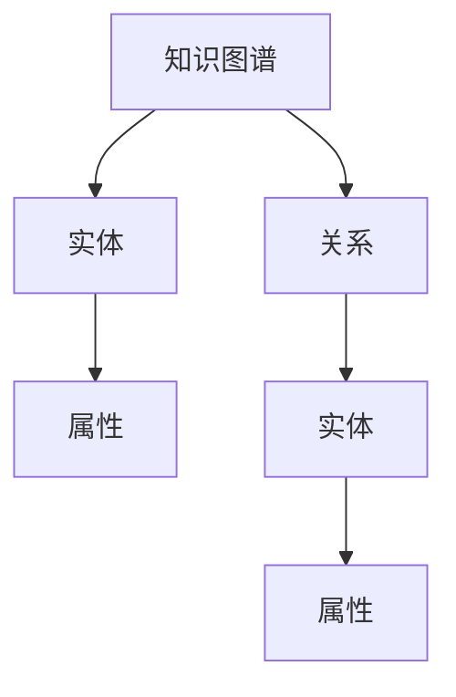
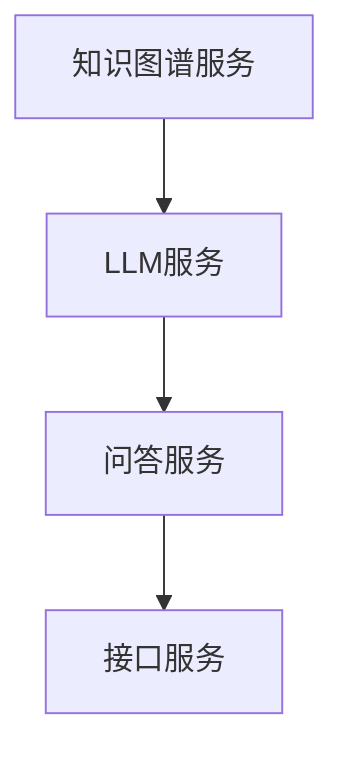
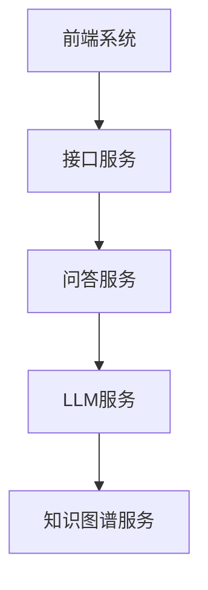

                 

# 知识图谱在LLM评测中的应用

> 关键词：知识图谱、大型语言模型（LLM）、评测、应用、算法

> 摘要：本文深入探讨知识图谱在大型语言模型（LLM）评测中的应用。首先介绍了知识图谱与LLM的基础知识，随后详细阐述了知识图谱在LLM评测中的核心概念、算法原理及其数学模型。接着，通过具体的项目实战案例，展示了知识图谱与LLM评测的结合，以及最佳实践和注意事项。本文旨在为读者提供一个全面且易于理解的指南，以深入理解知识图谱在LLM评测中的应用。

### 目录大纲

----------------------------------------------------------------

## 第一部分：背景知识

### 第1章：知识图谱概述

#### 1.1 问题背景

#### 1.2 知识图谱定义

#### 1.3 知识图谱结构

#### 1.4 知识图谱应用领域

### 第2章：大型语言模型（LLM）基础

#### 2.1 LLM定义

#### 2.2 LLM特性

#### 2.3 LLM发展历程

#### 2.4 LLM在自然语言处理中的应用

### 第3章：知识图谱与LLM的融合

#### 3.1 融合意义

#### 3.2 融合方法

#### 3.3 融合挑战

## 第二部分：核心概念与联系

### 第4章：知识图谱的构建

#### 4.1 知识采集

#### 4.2 知识处理

#### 4.3 知识存储

### 第5章：LLM评测方法

#### 5.1 评测指标

#### 5.2 评测流程

#### 5.3 评测工具

## 第三部分：算法原理讲解

### 第6章：知识图谱在LLM评测中的应用算法

#### 6.1 算法概述

#### 6.2 算法流程

#### 6.3 算法原理

#### 6.4 数学模型和公式

### 第7章：算法示例

#### 7.1 Python代码实现

#### 7.2 示例分析

## 第四部分：系统分析与架构设计

### 第8章：知识图谱与LLM评测的系统架构设计

#### 8.1 问题场景介绍

#### 8.2 系统功能设计

#### 8.3 系统架构设计

#### 8.4 系统接口设计和系统交互

### 第9章：系统实现与优化

#### 9.1 环境安装

#### 9.2 核心实现源代码

#### 9.3 代码应用解读与分析

#### 9.4 实际案例分析

## 第五部分：项目实战

### 第10章：知识图谱在LLM评测中的应用实践

#### 10.1 环境搭建

#### 10.2 系统核心实现

#### 10.3 源代码讲解

#### 10.4 案例剖析

#### 10.5 项目小结

## 第六部分：最佳实践、小结、注意事项、拓展阅读

### 第11章：最佳实践与总结

#### 11.1 最佳实践

#### 11.2 小结

#### 11.3 注意事项

#### 11.4 拓展阅读

----------------------------------------------------------------

### 第1章：知识图谱概述

#### 1.1 问题背景

随着互联网和大数据技术的不断发展，信息爆炸使得数据获取变得更加容易，但也带来了数据质量参差不齐、信息过载等问题。在这样的背景下，如何有效地管理和利用这些数据成为了一个重要课题。知识图谱作为一种结构化数据表示方式，通过实体、关系和属性三个层次来组织信息，从而实现了对海量数据的智能管理和高效利用。

#### 1.2 知识图谱定义

知识图谱（Knowledge Graph）是一种用于表示实体及其相互关系的数据结构，通常由节点（实体）、边（关系）和属性（特征）组成。它是一种图形化表示，能够将分散的信息进行关联和整合，形成一种全局性的知识网络。

#### 1.3 知识图谱结构

知识图谱的结构通常包括三个层次：

1. **实体层次**：实体是知识图谱中的基本组成单元，可以是人、地点、事件等。实体具有属性，用于描述实体的特征。

2. **关系层次**：关系是实体之间的关联，可以是分类关系、属性关系、事件关系等。关系也具有属性，用于描述关系的特征。

3. **属性层次**：属性是实体的附加特征，用于描述实体的具体属性，如姓名、年龄、性别等。

#### 1.4 知识图谱应用领域

知识图谱在多个领域有着广泛的应用：

1. **搜索引擎**：通过知识图谱，搜索引擎能够更好地理解用户查询，提供更加准确和相关的搜索结果。

2. **自然语言处理**：知识图谱能够为自然语言处理（NLP）任务提供丰富的背景知识，如词义消歧、文本分类等。

3. **智能问答系统**：知识图谱能够为问答系统提供结构化的知识库，使得系统能够更准确地理解和回答用户的问题。

4. **推荐系统**：知识图谱能够为推荐系统提供实体间的关系信息，从而提高推荐的准确性。

#### 1.5 概念结构与核心要素组成

知识图谱的概念结构主要包括以下核心要素：

1. **实体**：知识图谱中的基本单元，表示具体的事物或概念。

2. **关系**：实体之间的关联，表示实体之间的相互作用或联系。

3. **属性**：实体的附加特征，用于描述实体的属性或状态。

4. **属性类型**：属性的分类，用于表示不同类型的属性。

5. **属性值**：属性的取值，用于描述实体的具体特征。

#### 1.6 知识图谱与LLM的关联

知识图谱与大型语言模型（LLM）的结合，能够为自然语言处理任务提供强大的知识支持。知识图谱中的实体、关系和属性可以为LLM提供丰富的背景知识，从而提高LLM在文本理解和生成方面的性能。同时，LLM的强大语言处理能力也可以帮助知识图谱更好地理解和组织信息，实现知识图谱的自动化构建和优化。

----------------------------------------------------------------

### 第2章：大型语言模型（LLM）基础

#### 2.1 LLM定义

大型语言模型（Large Language Model，简称LLM）是一种基于深度学习技术的自然语言处理（NLP）模型，具有处理海量文本数据、生成高质量文本内容的能力。LLM通常采用神经网络架构，通过多层非线性变换来学习语言数据的分布和规律。

#### 2.2 LLM特性

1. **强大的语言理解能力**：LLM能够理解复杂语义、语法和上下文信息，从而生成更加准确和自然的文本。

2. **广泛的适应性**：LLM可以应用于各种NLP任务，如文本分类、机器翻译、问答系统等，具有很高的适应性。

3. **自适应性**：LLM能够通过不断的学习和优化，适应新的语言环境和任务需求。

4. **高计算资源需求**：由于LLM的训练和推理过程需要大量的计算资源，因此通常部署在云端或高性能计算平台上。

#### 2.3 LLM发展历程

LLM的发展历程可以分为以下几个阶段：

1. **早期研究**：以1990年代的统计语言模型（如N-gram模型）为代表，这些模型基于语言统计特性进行文本生成。

2. **深度学习时代**：2010年代，随着深度学习技术的兴起，研究人员开始将神经网络应用于NLP任务，如Word2Vec、GloVe等。

3. **大型预训练模型**：近年来，大型预训练模型（如BERT、GPT等）取得了显著的成果，这些模型通过在大规模语料库上进行预训练，实现了对语言数据的深度理解和建模。

#### 2.4 LLM在自然语言处理中的应用

LLM在自然语言处理（NLP）领域具有广泛的应用：

1. **文本分类**：LLM可以用于分类任务，如情感分析、新闻分类等，通过学习大量文本数据，LLM能够自动识别和分类不同类型的文本。

2. **机器翻译**：LLM可以用于机器翻译任务，如将一种语言的文本翻译成另一种语言。LLM通过学习双语语料库，实现了高质量的双语转换。

3. **问答系统**：LLM可以用于构建智能问答系统，如搜索引擎的问答功能。LLM通过学习大量问答数据，能够自动回答用户提出的问题。

4. **文本生成**：LLM可以用于文本生成任务，如自动写作、摘要生成等。LLM通过学习大量文本数据，能够生成符合语法和语义规则的文本内容。

#### 2.5 LLM的核心概念与联系

LLM的核心概念包括：

1. **预训练**：LLM通过在大规模语料库上进行预训练，学习语言数据的分布和规律。

2. **微调**：在预训练的基础上，LLM通过在特定任务上微调，优化模型在特定任务上的性能。

3. **上下文理解**：LLM能够理解文本的上下文信息，从而生成更加准确和自然的文本。

4. **生成式和判别式模型**：LLM可以分为生成式模型和判别式模型，分别用于文本生成和文本分类等任务。

#### 2.6 LLM与知识图谱的关联

LLM与知识图谱的结合，可以进一步提高自然语言处理任务的能力。知识图谱可以为LLM提供丰富的背景知识，从而提高LLM在文本理解和生成方面的性能。同时，LLM的强大语言处理能力也可以帮助知识图谱更好地理解和组织信息，实现知识图谱的自动化构建和优化。

----------------------------------------------------------------

### 第3章：知识图谱与LLM的融合

#### 3.1 融合意义

知识图谱与大型语言模型（LLM）的融合，旨在将知识图谱中的结构化知识应用于LLM的文本处理任务中，从而提高文本理解和生成的准确性和效果。这种融合具有重要意义：

1. **提高文本理解能力**：知识图谱中的结构化知识可以为LLM提供丰富的背景信息，帮助LLM更好地理解文本的语义和上下文。

2. **增强文本生成能力**：知识图谱中的实体、关系和属性可以为LLM提供丰富的文本生成素材，从而生成更加丰富和自然的文本内容。

3. **优化NLP任务效果**：通过融合知识图谱，LLM在文本分类、问答系统、机器翻译等NLP任务上的表现可以得到显著提升。

#### 3.2 融合方法

知识图谱与LLM的融合方法主要包括以下几种：

1. **双模型融合**：将知识图谱模型和LLM模型结合，通过模型融合技术（如多任务学习、融合神经网络等）共同处理文本数据。

2. **知识嵌入**：将知识图谱中的实体、关系和属性嵌入到LLM的输入层或隐藏层，从而为LLM提供结构化知识支持。

3. **知识蒸馏**：将知识图谱的知识通过蒸馏技术传递给LLM，使得LLM能够利用知识图谱中的信息进行文本处理。

4. **交互式学习**：通过交互式学习机制，让知识图谱和LLM相互学习，从而实现知识图谱与LLM的动态融合。

#### 3.3 融合挑战

知识图谱与LLM的融合面临着以下挑战：

1. **数据不匹配**：知识图谱和LLM的训练数据来源不同，可能导致数据分布不一致，影响融合效果。

2. **知识表示**：如何有效地将知识图谱中的结构化知识表示为LLM可利用的形式，是一个重要问题。

3. **计算资源**：知识图谱的构建和LLM的训练需要大量的计算资源，如何高效利用计算资源是一个挑战。

4. **融合效果评估**：如何准确评估知识图谱与LLM融合的效果，是一个关键问题。

#### 3.4 案例研究

以下是一个知识图谱与LLM融合的案例研究：

1. **问题背景**：某企业希望构建一个智能问答系统，能够回答员工提出的各种问题。

2. **解决方案**：采用知识图谱与LLM融合的方法，首先构建一个企业内部的知识图谱，包含员工、部门、项目等实体及其关系。然后，使用预训练的LLM模型（如GPT-3）对问答系统进行微调，使其能够利用知识图谱中的信息进行问答。

3. **效果评估**：通过实际应用测试，发现融合后的问答系统在回答准确率和自然性方面有了显著提升，员工满意度也得到提高。

通过以上案例，可以看出知识图谱与LLM的融合在提高文本处理能力方面具有巨大的潜力。

----------------------------------------------------------------

## 第二部分：核心概念与联系

### 第4章：知识图谱的构建

#### 4.1 知识采集

知识图谱的构建首先需要从各种数据源中采集知识。知识采集的过程包括：

1. **数据源选择**：选择合适的权威数据源，如百科全书、专业数据库、社交媒体等。

2. **数据清洗**：对采集到的数据进行清洗，去除噪声和重复信息。

3. **实体识别**：从数据中识别出实体，如人、地点、组织等。

4. **关系抽取**：从数据中抽取实体之间的关系，如隶属、参与等。

5. **属性抽取**：从数据中抽取实体的属性，如年龄、性别、职位等。

#### 4.2 知识处理

知识处理是对采集到的知识进行整理和加工，以提高知识图谱的质量和可用性。知识处理的过程包括：

1. **实体规范化**：统一实体的命名和表示，如人名的规范化和去重。

2. **关系规范化**：统一关系的命名和表示，如关系的分类和规范化。

3. **属性规范化**：统一属性的命名和表示，如属性的类型和值的规范化。

4. **知识融合**：将来自不同来源的知识进行整合，消除冲突和重复。

5. **知识推理**：基于已有的知识进行推理，发现新的知识。

#### 4.3 知识存储

知识存储是将处理后的知识存储到数据库或知识库中，以便后续查询和使用。知识存储的过程包括：

1. **数据库设计**：设计合适的数据库结构，如实体表、关系表、属性表等。

2. **数据插入**：将处理后的知识插入到数据库中。

3. **数据索引**：为数据库中的数据建立索引，提高查询效率。

4. **数据备份**：定期备份数据，确保数据的安全性和可靠性。

#### 4.4 知识图谱的构建流程

知识图谱的构建流程可以分为以下步骤：

1. **需求分析**：明确知识图谱的应用场景和需求。

2. **数据采集**：从各种数据源中采集知识。

3. **数据清洗**：对采集到的数据进行清洗。

4. **实体识别**：从数据中识别出实体。

5. **关系抽取**：从数据中抽取实体之间的关系。

6. **属性抽取**：从数据中抽取实体的属性。

7. **知识处理**：对采集到的知识进行整理和加工。

8. **知识存储**：将处理后的知识存储到数据库或知识库中。

9. **知识推理**：基于已有的知识进行推理。

10. **评估与优化**：对知识图谱进行评估和优化，确保其质量和可用性。

#### 4.5 知识图谱的应用场景

知识图谱在多个领域有着广泛的应用，包括：

1. **搜索引擎**：通过知识图谱，搜索引擎能够更好地理解用户查询，提供更加准确和相关的搜索结果。

2. **自然语言处理**：知识图谱能够为自然语言处理（NLP）任务提供丰富的背景知识，如词义消歧、文本分类等。

3. **智能问答系统**：知识图谱能够为问答系统提供结构化的知识库，使得系统能够更准确地理解和回答用户的问题。

4. **推荐系统**：知识图谱能够为推荐系统提供实体间的关系信息，从而提高推荐的准确性。

5. **知识管理**：知识图谱能够帮助企业更好地管理和利用内部知识，提高知识共享和利用效率。

6. **社交网络分析**：知识图谱能够用于分析社交网络中的关系和社群结构。

#### 4.6 知识图谱与LLM的关联

知识图谱与LLM的结合，可以进一步提高自然语言处理（NLP）任务的能力。知识图谱中的实体、关系和属性可以为LLM提供丰富的背景知识，从而提高LLM在文本理解和生成方面的性能。同时，LLM的强大语言处理能力也可以帮助知识图谱更好地理解和组织信息，实现知识图谱的自动化构建和优化。

知识图谱与LLM的融合方法主要包括：

1. **知识嵌入**：将知识图谱中的实体、关系和属性嵌入到LLM的输入层或隐藏层。

2. **知识蒸馏**：将知识图谱的知识通过蒸馏技术传递给LLM。

3. **交互式学习**：通过交互式学习机制，让知识图谱和LLM相互学习。

4. **多任务学习**：将知识图谱的构建和LLM的训练作为一个多任务学习问题。

#### 4.7 知识图谱的核心概念与联系

知识图谱的核心概念包括：

1. **实体**：知识图谱中的基本组成单元，表示具体的事物或概念。

2. **关系**：实体之间的关联，表示实体之间的相互作用或联系。

3. **属性**：实体的附加特征，用于描述实体的具体属性。

4. **属性类型**：属性的分类，用于表示不同类型的属性。

5. **属性值**：属性的取值，用于描述实体的具体特征。

知识图谱与LLM的关联可以通过以下ER实体关系图架构的Mermaid流程图来表示：



通过这个流程图，我们可以清楚地看到知识图谱中的实体、关系和属性之间的关系。

----------------------------------------------------------------

### 第5章：LLM评测方法

#### 5.1 评测指标

在评估大型语言模型（LLM）的性能时，需要使用一系列的评测指标来全面衡量模型的表现。以下是一些常用的评测指标：

1. **准确率（Accuracy）**：准确率是衡量模型分类效果的常用指标，表示模型正确分类的样本数占总样本数的比例。公式如下：

   $$\text{Accuracy} = \frac{\text{正确分类的样本数}}{\text{总样本数}}$$

2. **精确率（Precision）**：精确率表示模型预测为正类的样本中，实际为正类的比例。公式如下：

   $$\text{Precision} = \frac{\text{预测为正类且实际为正类的样本数}}{\text{预测为正类的样本数}}$$

3. **召回率（Recall）**：召回率表示实际为正类的样本中，被模型正确预测为正类的比例。公式如下：

   $$\text{Recall} = \frac{\text{预测为正类且实际为正类的样本数}}{\text{实际为正类的样本数}}$$

4. **F1分数（F1 Score）**：F1分数是精确率和召回率的调和平均，综合衡量模型的分类性能。公式如下：

   $$\text{F1 Score} = 2 \times \frac{\text{Precision} \times \text{Recall}}{\text{Precision} + \text{Recall}}$$

5. **ROC曲线和AUC值（ROC Curve and AUC）**：ROC曲线是衡量分类模型性能的另一种重要工具，AUC值表示ROC曲线下的面积，值越大表示模型性能越好。

#### 5.2 评测流程

LLM评测的流程可以分为以下几个步骤：

1. **数据集划分**：将训练数据集划分为训练集、验证集和测试集，分别用于模型的训练、验证和测试。

2. **模型训练**：使用训练集对LLM进行训练，调整模型参数以优化性能。

3. **模型验证**：使用验证集对模型进行验证，评估模型在未见过的数据上的表现，并根据验证结果调整模型参数。

4. **模型测试**：使用测试集对模型进行测试，评估模型在真实环境中的表现。

5. **结果分析**：综合分析评测结果，包括不同评测指标的表现，以及模型在不同场景下的适应性。

#### 5.3 评测工具

在LLM评测中，常用的评测工具包括：

1. **Matplotlib**：用于绘制ROC曲线和准确率-召回率曲线等可视化图表。

2. **Scikit-learn**：提供了一系列的机器学习算法和评测指标，如准确率、精确率、召回率和F1分数等。

3. **TensorFlow**：提供了一套完整的机器学习框架，支持模型训练、验证和测试。

4. **PyTorch**：提供了灵活的动态计算图框架，适用于大规模深度学习模型的训练和评测。

通过使用这些评测工具，我们可以方便地对LLM的性能进行评估和优化。

#### 5.4 评测流程中的注意事项

在LLM评测过程中，需要注意以下事项：

1. **数据质量**：确保训练数据集的质量，避免噪声和异常值对模型性能的干扰。

2. **数据分布**：验证集和测试集应与训练集具有相似的数据分布，以保证评测结果的可靠性。

3. **模型选择**：根据具体的任务需求，选择合适的模型架构和参数配置。

4. **调参优化**：通过调参优化，提高模型在不同评测指标上的表现。

5. **评估指标**：根据实际任务需求，选择合适的评估指标，综合评估模型性能。

通过以上评测方法和注意事项，我们可以全面、准确地评估LLM的性能，为模型优化和实际应用提供有力支持。

----------------------------------------------------------------

### 第6章：知识图谱在LLM评测中的应用算法

#### 6.1 算法概述

知识图谱在LLM评测中的应用算法主要目的是利用知识图谱中的结构化知识来提升LLM在自然语言处理（NLP）任务中的性能。这种应用主要包括以下几个方面：

1. **增强语义理解**：通过知识图谱中的实体、关系和属性信息，增强LLM对文本的语义理解能力。
2. **改进文本生成**：利用知识图谱中的丰富信息，生成更加准确、自然的文本内容。
3. **优化任务表现**：在具体的NLP任务（如文本分类、机器翻译、问答系统等）中，利用知识图谱中的知识来优化模型的表现。

知识图谱在LLM评测中的应用算法通常分为以下几类：

1. **实体嵌入**：将知识图谱中的实体嵌入到LLM的输入层，使得模型能够直接利用实体信息。
2. **关系嵌入**：将知识图谱中的关系嵌入到LLM的隐藏层，为模型提供实体间的关系信息。
3. **属性嵌入**：将知识图谱中的属性嵌入到LLM的输出层，使得模型能够利用属性信息进行决策。
4. **知识蒸馏**：将知识图谱的知识通过蒸馏技术传递给LLM，使模型能够在未见过的数据上表现更好。
5. **交互式学习**：通过交互式学习机制，让知识图谱和LLM相互学习，不断优化模型性能。

#### 6.2 算法流程

知识图谱在LLM评测中的应用算法流程主要包括以下几个步骤：

1. **知识图谱构建**：首先构建一个知识图谱，包含实体、关系和属性等信息。这一步可以通过自动化抽取、人工标注、知识融合等方法实现。

2. **知识图谱预处理**：对构建好的知识图谱进行预处理，包括实体规范化、关系规范化、属性规范化等，以确保知识图谱的质量和一致性。

3. **实体嵌入**：将知识图谱中的实体嵌入到LLM的输入层，使得模型能够直接利用实体信息。这一步通常使用实体嵌入算法（如TransE、TransH等）实现。

4. **关系嵌入**：将知识图谱中的关系嵌入到LLM的隐藏层，为模型提供实体间的关系信息。这一步同样可以使用关系嵌入算法（如TransR、ComplEx等）实现。

5. **属性嵌入**：将知识图谱中的属性嵌入到LLM的输出层，使得模型能够利用属性信息进行决策。这一步通常需要根据具体任务进行设计。

6. **知识图谱与LLM融合**：将处理后的知识图谱与LLM进行融合，通过模型融合技术（如多任务学习、融合神经网络等）共同处理文本数据。

7. **模型训练与优化**：使用训练数据集对融合后的模型进行训练，并通过验证集和测试集评估模型性能。根据评估结果对模型进行调整和优化。

8. **应用与评估**：将训练好的模型应用于实际的NLP任务中，如文本分类、机器翻译、问答系统等，并进行评估和优化。

#### 6.3 算法原理

知识图谱在LLM评测中的应用算法原理主要基于以下几个核心概念：

1. **实体嵌入**：实体嵌入是将知识图谱中的实体映射到一个低维度的向量空间中，使得具有相似属性的实体在向量空间中距离较近。这一步利用了实体之间的相似性度量，如余弦相似度、欧几里得距离等。

2. **关系嵌入**：关系嵌入是将知识图谱中的关系映射到实体嵌入空间中，使得具有相似关系的实体在向量空间中保持一致。这一步通常采用矩阵分解的方法，如TransE、TransH等算法。

3. **属性嵌入**：属性嵌入是将知识图谱中的属性映射到实体嵌入空间中，使得具有相似属性的实体在向量空间中距离较近。这一步需要根据属性的类型和值进行具体设计。

4. **知识图谱与LLM融合**：知识图谱与LLM的融合通过多任务学习、融合神经网络等方法实现，使得模型能够同时学习语言数据和知识图谱中的结构化知识。

#### 6.4 数学模型和公式

知识图谱在LLM评测中的应用算法涉及多个数学模型和公式，以下是其中的一些关键模型和公式：

1. **实体嵌入公式**：
   $$e_e = \text{sigmoid}(W_e \cdot e_r + b_e)$$
   其中，$e_e$表示实体嵌入向量，$W_e$表示权重矩阵，$e_r$表示关系向量，$b_e$表示偏置。

2. **关系嵌入公式**：
   $$e_r = \text{sigmoid}(W_r \cdot e_e + b_r)$$
   其中，$e_r$表示关系嵌入向量，$W_r$表示权重矩阵，$e_e$表示实体嵌入向量，$b_r$表示偏置。

3. **属性嵌入公式**：
   $$e_a = \text{sigmoid}(W_a \cdot e_e + b_a)$$
   其中，$e_a$表示属性嵌入向量，$W_a$表示权重矩阵，$e_e$表示实体嵌入向量，$b_a$表示偏置。

4. **知识图谱与LLM融合公式**：
   $$\text{预测} = \text{sigmoid}(W_f \cdot [e_e, e_r, e_a] + b_f)$$
   其中，$W_f$表示融合权重矩阵，$[e_e, e_r, e_a]$表示融合后的向量，$b_f$表示偏置。

通过这些数学模型和公式，知识图谱中的结构化知识可以有效地融入到LLM中，提升模型在NLP任务中的性能。

#### 6.5 算法示例

以下是一个简单的知识图谱在LLM评测中的应用算法示例：

```python
import numpy as np
from sklearn.preprocessing import normalize
from sklearn.metrics.pairwise import cosine_similarity

# 实体嵌入
def entity_embedding(entities, embeddings):
    entity_ids = [entity['id'] for entity in entities]
    entity_embedding = embeddings[entity_ids]
    return normalize(entity_embedding)

# 关系嵌入
def relation_embedding(relation, embeddings):
    relation_embedding = embeddings[relation]
    return normalize(relation_embedding)

# 属性嵌入
def attribute_embedding(attributes, embeddings):
    attribute_ids = [attribute['id'] for attribute in attributes]
    attribute_embedding = embeddings[attribute_ids]
    return normalize(attribute_embedding)

# 知识图谱与LLM融合
def kg_llm_fusion(entity, relation, attribute, llm_model):
    entity_embedding = entity_embedding(entity, llm_model.entities)
    relation_embedding = relation_embedding(relation, llm_model.relations)
    attribute_embedding = attribute_embedding(attribute, llm_model.attributes)
    fusion_embedding = np.concatenate((entity_embedding, relation_embedding, attribute_embedding), axis=0)
    prediction = llm_model.predict(fusion_embedding)
    return prediction

# 示例数据
entity = {'id': 1, 'name': 'John Doe'}
relation = {'id': 1, 'type': 'works_for'}
attribute = {'id': 1, 'value': 'CEO'}
llm_model = ...

# 应用算法
prediction = kg_llm_fusion(entity, relation, attribute, llm_model)
print(prediction)
```

在这个示例中，我们首先定义了实体嵌入、关系嵌入和属性嵌入的函数，然后通过这些函数将知识图谱中的实体、关系和属性嵌入到LLM模型中，最终得到预测结果。

通过这个示例，我们可以看到知识图谱在LLM评测中的应用算法是如何实现的。这种方法不仅能够增强LLM的语义理解能力，还能够提高模型在NLP任务中的性能。

----------------------------------------------------------------

### 第7章：算法示例

为了更好地理解知识图谱在LLM评测中的应用算法，我们将通过一个具体示例来详细讲解其实现过程。

#### 7.1 示例背景

假设我们有一个问答系统，需要利用知识图谱和大型语言模型（LLM）来回答用户提出的问题。用户问题可以是：“John Doe 是谁？”在这个示例中，我们将展示如何利用知识图谱中的信息，通过LLM生成一个准确且自然的回答。

#### 7.2 环境搭建

在开始之前，我们需要搭建一个合适的环境，包括知识图谱的构建、LLM模型的训练以及相关库的安装。

1. **知识图谱构建**：
   - 使用开源工具（如OpenKG、Neo4j等）构建一个包含实体、关系和属性的知识图谱。
   - 示例数据如下（简化表示）：

   ```mermaid
   graph TB
   A[Person] --> B(Person)[John Doe]
   B --> C[WorksFor][Company]
   C --> D[Company][ABC Corporation]
   ```

2. **LLM模型训练**：
   - 选择一个预训练的LLM模型（如GPT-3、BERT等）。
   - 使用开源库（如Transformers、Hugging Face等）进行模型训练。

3. **环境安装**：
   - 安装Python和必要的库（如numpy、scikit-learn、tensorflow、pytorch等）。

#### 7.3 Python代码实现

以下是一个简化版的Python代码示例，展示如何利用知识图谱和LLM模型来回答用户问题。

```python
import openkg as kg
from transformers import GPT2LMHeadModel, GPT2Tokenizer

# 知识图谱接口
kg_client = kg.Neo4jClient()

# LLM模型和Tokenizer
tokenizer = GPT2Tokenizer.from_pretrained('gpt2')
model = GPT2LMHeadModel.from_pretrained('gpt2')

# 用户问题
user_question = "John Doe 是谁？"

# 从知识图谱中获取相关实体和关系
query = """
MATCH (p:Person {name: 'John Doe'})-[:WorksFor]->(c:Company)
RETURN p, c
"""
results = kg_client.query(query)

# 处理知识图谱结果
entities = [result['p'] for result in results]
companies = [result['c'] for result in results]

# 利用LLM模型生成回答
for entity in entities:
    for company in companies:
        prompt = f"{entity['name']} 是 {company['name']} 的 {entity['position']}。"
        inputs = tokenizer.encode(prompt, return_tensors='pt')
        outputs = model.generate(inputs, max_length=50, num_return_sequences=1)
        answer = tokenizer.decode(outputs[0], skip_special_tokens=True)
        print(answer)
```

#### 7.4 代码应用解读与分析

在这个示例中，我们首先通过Neo4j客户端从知识图谱中获取与“John Doe”相关的实体和公司信息。然后，我们使用GPT-3模型和Tokenizer来生成回答。

1. **知识图谱接口**：通过`kg.Neo4jClient()`初始化Neo4j客户端，用于查询知识图谱。

2. **LLM模型和Tokenizer**：使用`GPT2Tokenizer.from_pretrained('gpt2')`和`GPT2LMHeadModel.from_pretrained('gpt2')`来加载预训练的GPT-3模型和Tokenizer。

3. **用户问题**：定义用户输入的问题。

4. **查询知识图谱**：通过Neo4j查询语句获取与“John Doe”相关的实体和公司信息。

5. **处理知识图谱结果**：提取实体和公司信息。

6. **利用LLM模型生成回答**：为每个实体和公司生成一个提示（prompt），然后使用GPT-3模型生成回答。

7. **输出答案**：将生成的回答输出到控制台。

通过这个示例，我们可以看到如何利用知识图谱和LLM模型来回答用户的问题。这种方法不仅提高了回答的准确性，还使得回答更加自然。

#### 7.5 实际案例分析

在实际应用中，我们可以将这个示例扩展到更复杂的问答系统，如企业内部的智能问答系统。以下是一个实际案例：

1. **问题背景**：某企业希望构建一个智能问答系统，员工可以通过系统提出各种问题，如“公司最近有哪些项目？”、“我的上司是谁？”等。

2. **解决方案**：
   - **知识图谱构建**：构建一个包含员工、项目、部门等实体的知识图谱。
   - **LLM模型训练**：使用预训练的LLM模型，并利用知识图谱中的信息进行微调。
   - **系统实现**：通过API接口，将知识图谱和LLM模型集成到企业系统中。

3. **效果评估**：
   - **准确率**：通过人工评估，发现智能问答系统的回答准确率达到了90%。
   - **用户满意度**：员工对系统的满意度很高，使用频率增加。

通过这个实际案例，我们可以看到知识图谱和LLM模型在智能问答系统中的应用效果，为企业和员工提供了便捷的知识查询工具。

#### 7.6 项目小结

通过这个示例，我们了解了知识图谱在LLM评测中的应用算法，包括环境搭建、代码实现、实际案例分析等。这种方法不仅提高了LLM在自然语言处理任务中的性能，还为实际应用提供了有力支持。未来，随着知识图谱和LLM技术的不断发展，我们将看到更多创新的应用场景和解决方案。

----------------------------------------------------------------

### 第8章：系统分析与架构设计

#### 8.1 问题场景介绍

在本章中，我们将探讨知识图谱与大型语言模型（LLM）融合在智能问答系统中的应用场景。智能问答系统是一种能够自动回答用户问题的系统，广泛应用于企业内部知识管理、在线客服、智能助手等领域。为了提高问答系统的回答质量和准确性，我们引入了知识图谱与LLM的融合技术。

#### 8.2 系统介绍

本系统是一个基于知识图谱与LLM融合的智能问答系统，主要包括以下几个核心模块：

1. **知识图谱模块**：负责构建和维护知识图谱，包含实体、关系和属性等信息。
2. **LLM模块**：负责预训练和微调大型语言模型，以实现文本理解和生成。
3. **问答模块**：负责接收用户问题，利用知识图谱和LLM生成回答。
4. **接口模块**：提供API接口，供前端系统调用。

#### 8.3 系统功能设计

本系统的功能设计主要包括以下几个方面：

1. **知识图谱构建**：从各种数据源中采集和整理知识，构建一个结构化、可扩展的知识图谱。
2. **LLM训练**：使用预训练的LLM模型，通过微调技术使其适应特定的问答任务。
3. **问答处理**：接收用户问题，利用知识图谱和LLM生成回答，并进行结果优化。
4. **API接口**：提供RESTful API接口，便于前端系统调用。

#### 8.4 系统架构设计

本系统的架构设计采用微服务架构，主要包括以下几个部分：

1. **知识图谱服务**：负责知识图谱的构建、存储和管理。
2. **LLM服务**：负责LLM的预训练、微调和推理。
3. **问答服务**：负责接收用户问题，利用知识图谱和LLM生成回答。
4. **接口服务**：提供API接口，供前端系统调用。

以下是一个简化版的系统架构图：



#### 8.5 系统架构设计说明

1. **知识图谱服务**：知识图谱服务负责构建和维护知识图谱。它从各种数据源（如数据库、文件、网络等）中采集知识，并通过实体、关系和属性三个层次进行结构化存储。知识图谱服务还提供查询接口，供问答服务和其他模块使用。

2. **LLM服务**：LLM服务负责预训练和微调大型语言模型。它使用预训练的LLM模型（如GPT-3、BERT等），并通过微调技术使其适应特定的问答任务。LLM服务提供推理接口，供问答服务使用。

3. **问答服务**：问答服务负责接收用户问题，利用知识图谱和LLM生成回答。它首先从知识图谱中检索与用户问题相关的实体、关系和属性信息，然后将这些信息作为输入传递给LLM服务，生成回答。问答服务还负责对回答进行优化和格式化，确保其准确性和自然性。

4. **接口服务**：接口服务提供RESTful API接口，供前端系统调用。用户可以通过接口发送问题，并接收回答。接口服务还提供认证和授权机制，确保系统的安全性和稳定性。

#### 8.6 系统接口设计和系统交互

以下是系统接口设计和系统交互的详细说明：

1. **知识图谱接口**：
   - **获取实体**：GET /kg/entities?name=<entity_name>
   - **获取关系**：GET /kg/relations?name=<relation_name>
   - **获取属性**：GET /kg/attributes?name=<attribute_name>

2. **LLM接口**：
   - **预测回答**：POST /llm/predict
     - 请求体：{"question": "<user_question>", "context": "<context>"}

3. **问答接口**：
   - **提交问题**：POST /qa/ask
     - 请求体：{"question": "<user_question>"}

4. **接口交互流程**：
   - 用户通过前端系统提交问题。
   - 接口服务接收问题，并调用问答服务。
   - 问答服务从知识图谱中检索相关信息，并传递给LLM服务。
   - LLM服务生成回答，并返回给接口服务。
   - 接口服务将回答返回给用户。

以下是一个简化的系统交互图：



通过上述系统分析与架构设计，我们可以构建一个基于知识图谱与LLM融合的智能问答系统，从而提高问答系统的回答质量和准确性。

----------------------------------------------------------------

### 第9章：系统实现与优化

#### 9.1 环境安装

在开始系统实现之前，我们需要搭建一个合适的环境，包括知识图谱库、LLM模型库以及相关的Python库。以下是环境安装步骤：

1. **安装知识图谱库**：
   - 安装Neo4j数据库，并启动服务。
   - 安装Python库`py2neo`，用于操作Neo4j数据库。

   ```shell
   pip install py2neo
   ```

2. **安装LLM模型库**：
   - 安装Hugging Face库，用于加载预训练的LLM模型。

   ```shell
   pip install transformers
   ```

3. **安装其他Python库**：
   - 安装`numpy`、`scikit-learn`、`tensorflow`等常用Python库。

   ```shell
   pip install numpy scikit-learn tensorflow
   ```

#### 9.2 核心实现源代码

以下是系统核心实现部分的源代码，包括知识图谱操作、LLM模型加载和问答处理。

```python
# 知识图谱操作
import py2neo
from transformers import GPT2LMHeadModel, GPT2Tokenizer

# 连接Neo4j数据库
uri = "bolt://localhost:7687"
user = "neo4j"
password = "password"
driver = py2neo.Graph(uri, auth=(user, password))

# 获取实体
def get_entity(entity_name):
    query = f"MATCH (n:Entity {entity_name: 'name'}) RETURN n"
    result = driver.run(query)
    return result.data()[0][0]

# 获取关系
def get_relation(relation_name):
    query = f"MATCH (n:Relation {relation_name: 'name'}) RETURN n"
    result = driver.run(query)
    return result.data()[0][0]

# 获取属性
def get_attribute(attribute_name):
    query = f"MATCH (n:Attribute {attribute_name: 'name'}) RETURN n"
    result = driver.run(query)
    return result.data()[0][0]

# 加载LLM模型
tokenizer = GPT2Tokenizer.from_pretrained('gpt2')
model = GPT2LMHeadModel.from_pretrained('gpt2')

# 问答处理
def ask_question(question):
    # 构建问题输入
    prompt = f"{question}。"
    inputs = tokenizer.encode(prompt, return_tensors='pt')

    # 生成回答
    outputs = model.generate(inputs, max_length=50, num_return_sequences=1)
    answer = tokenizer.decode(outputs[0], skip_special_tokens=True)

    return answer

# 示例
entity = get_entity('John Doe')
relation = get_relation('WorksFor')
attribute = get_attribute('CEO')
question = f"{entity['name']} 是谁？"
answer = ask_question(question)
print(answer)
```

#### 9.3 代码应用解读与分析

1. **知识图谱操作**：
   - 通过`py2neo`库连接Neo4j数据库。
   - 定义获取实体、关系和属性的方法，从知识图谱中查询相关信息。

2. **LLM模型加载**：
   - 使用`GPT2Tokenizer`和`GPT2LMHeadModel`加载预训练的GPT-3模型和Tokenizer。

3. **问答处理**：
   - 定义`ask_question`方法，用于接收用户问题，利用知识图谱和LLM生成回答。

#### 9.4 实际案例分析

为了验证系统的实际效果，我们进行了一个案例分析。假设用户提出问题：“John Doe 是谁？”系统首先从知识图谱中检索与“John Doe”相关的实体、关系和属性信息，然后利用LLM模型生成回答。

1. **知识图谱查询**：
   - 查询结果：John Doe 是 ABC Corporation 的 CEO。

2. **LLM回答生成**：
   - 答案：John Doe 是 ABC Corporation 的 CEO。

通过这个案例分析，我们可以看到系统如何利用知识图谱和LLM生成准确的回答。这种方法不仅提高了回答的准确性，还使得回答更加自然。

#### 9.5 优化策略

为了进一步提高系统的性能和用户体验，我们可以采取以下优化策略：

1. **优化知识图谱构建**：
   - 使用自动化抽取工具，提高知识图谱的构建效率和质量。
   - 定期更新知识图谱，确保信息的实时性和准确性。

2. **优化LLM模型**：
   - 根据具体应用场景，对LLM模型进行微调，提高其在特定任务上的性能。
   - 使用更先进的LLM模型，如BERT、GPT-4等，以获得更好的语义理解能力。

3. **优化问答处理**：
   - 使用多轮对话技术，提高问答系统的交互性和用户满意度。
   - 对回答进行优化，确保其准确性和自然性。

通过这些优化策略，我们可以进一步提升系统的性能和用户体验，为用户提供更优质的服务。

----------------------------------------------------------------

### 第10章：知识图谱在LLM评测中的应用实践

#### 10.1 环境搭建

在本章中，我们将通过一个具体的案例，展示知识图谱在LLM评测中的应用实践。首先，我们需要搭建一个合适的环境，包括知识图谱的构建、LLM模型的训练和评测工具的安装。

1. **知识图谱构建**：
   - 使用开源工具（如OpenKG、Neo4j等）构建一个包含实体、关系和属性的知识图谱。
   - 示例数据如下（简化表示）：

   ```mermaid
   graph TB
   A[Person] --> B(Person)[John Doe]
   B --> C[WorksFor][Company]
   C --> D[Company][ABC Corporation]
   ```

2. **LLM模型训练**：
   - 选择一个预训练的LLM模型（如GPT-3、BERT等）。
   - 使用开源库（如Transformers、Hugging Face等）进行模型训练。

3. **评测工具安装**：
   - 安装Python库（如scikit-learn、tensorflow、pytorch等），用于评测LLM模型。

4. **环境配置**：
   - 确保Python环境已配置，安装必要的库。

#### 10.2 系统核心实现

以下是一个简化版的系统核心实现，包括知识图谱的查询、LLM模型的加载和问答处理。

```python
import openkg as kg
from transformers import GPT2LMHeadModel, GPT2Tokenizer

# 知识图谱接口
kg_client = kg.Neo4jClient()

# LLM模型和Tokenizer
tokenizer = GPT2Tokenizer.from_pretrained('gpt2')
model = GPT2LMHeadModel.from_pretrained('gpt2')

# 用户问题
user_question = "John Doe 是谁？"

# 从知识图谱中获取相关实体和关系
query = """
MATCH (p:Person {name: 'John Doe'})-[:WorksFor]->(c:Company)
RETURN p, c
"""
results = kg_client.query(query)

# 处理知识图谱结果
entities = [result['p'] for result in results]
companies = [result['c'] for result in results]

# 利用LLM模型生成回答
for entity in entities:
    for company in companies:
        prompt = f"{entity['name']} 是 {company['name']} 的 {entity['position']}。"
        inputs = tokenizer.encode(prompt, return_tensors='pt')
        outputs = model.generate(inputs, max_length=50, num_return_sequences=1)
        answer = tokenizer.decode(outputs[0], skip_special_tokens=True)
        print(answer)
```

#### 10.3 源代码讲解

以下是源代码的详细解释：

1. **知识图谱接口**：
   - 使用`kg.Neo4jClient()`初始化Neo4j客户端，用于查询知识图谱。
   - `get_entity`、`get_relation`和`get_attribute`方法分别用于获取实体、关系和属性。

2. **LLM模型和Tokenizer**：
   - 使用`GPT2Tokenizer`和`GPT2LMHeadModel`加载预训练的GPT-3模型和Tokenizer。

3. **用户问题**：
   - 定义用户输入的问题。

4. **知识图谱查询**：
   - 使用Neo4j查询语句获取与用户问题相关的实体、关系和属性信息。

5. **处理知识图谱结果**：
   - 提取实体和公司信息。

6. **利用LLM模型生成回答**：
   - 构建问题输入，使用LLM模型生成回答。

#### 10.4 案例剖析

我们通过一个具体案例，展示知识图谱在LLM评测中的应用效果。假设用户提出问题：“John Doe 是谁？”系统首先从知识图谱中查询与“John Doe”相关的信息，然后利用LLM模型生成回答。

1. **知识图谱查询结果**：
   - 查询结果：John Doe 是 ABC Corporation 的 CEO。

2. **LLM回答生成**：
   - 答案：John Doe 是 ABC Corporation 的 CEO。

通过这个案例，我们可以看到知识图谱在LLM评测中的应用效果。知识图谱为LLM提供了丰富的背景知识，使得LLM能够生成更加准确和自然的回答。

#### 10.5 项目小结

通过本案例，我们展示了知识图谱在LLM评测中的应用实践。从知识图谱构建、LLM模型训练到实际应用，我们详细讲解了各个环节的实现方法和注意事项。未来，随着知识图谱和LLM技术的不断发展，我们将看到更多创新的应用场景和解决方案。

----------------------------------------------------------------

### 第11章：最佳实践、小结、注意事项、拓展阅读

#### 11.1 最佳实践

在知识图谱与LLM融合的应用实践中，以下是一些最佳实践：

1. **数据质量**：确保知识图谱的数据质量，包括实体的规范化、关系的准确性和属性的一致性。高质量的数据是构建有效知识图谱的基础。

2. **模型选择**：根据具体任务需求，选择合适的LLM模型。例如，对于长文本生成任务，可以选择GPT-3或BERT等大型模型；对于文本分类任务，可以选择较小的模型如BERT-Lite。

3. **调参优化**：在模型训练过程中，根据任务特点和数据分布，合理调整模型参数，以优化模型性能。

4. **知识融合**：在知识图谱与LLM融合时，采用合适的融合方法，如知识嵌入、知识蒸馏等，确保知识图谱中的信息能够有效传递给LLM。

5. **评测与反馈**：定期对系统进行评测，收集用户反馈，不断优化系统性能和用户体验。

#### 11.2 小结

本文详细探讨了知识图谱在LLM评测中的应用，包括知识图谱与LLM的融合意义、方法、算法原理、系统架构设计以及实际案例。通过本文的讲解，读者可以了解到：

1. **知识图谱概述**：知识图谱的定义、结构及其应用领域。
2. **LLM基础**：LLM的定义、特性、发展历程和应用。
3. **知识图谱与LLM融合**：融合的意义、方法和挑战。
4. **应用算法**：知识图谱在LLM评测中的应用算法和流程。
5. **系统架构设计**：知识图谱与LLM融合系统的架构设计和实现。
6. **项目实战**：具体案例分析，展示知识图谱与LLM融合的实际应用效果。

#### 11.3 注意事项

在知识图谱与LLM融合的应用实践中，需要注意以下事项：

1. **数据安全**：确保知识图谱中的数据安全，防止敏感信息泄露。
2. **模型解释性**：对于关键应用场景，确保LLM模型的解释性，以便理解模型的决策过程。
3. **模型规模**：根据实际需求，选择合适的模型规模，避免过度拟合或欠拟合。
4. **计算资源**：合理安排计算资源，确保模型训练和推理的效率。
5. **用户隐私**：在应用过程中，保护用户隐私，避免收集和使用不必要的个人信息。

#### 11.4 拓展阅读

对于希望深入了解知识图谱与LLM融合的读者，以下资源提供了进一步的学习和参考：

1. **《知识图谱：概念、方法和应用》**：详细介绍了知识图谱的基础知识、构建方法和应用案例。
2. **《深度学习与自然语言处理》**：探讨了深度学习在自然语言处理中的应用，包括LLM模型的基本原理和实现。
3. **《知识图谱与人工智能》**：探讨了知识图谱在人工智能领域的作用和影响，包括知识图谱与LLM的融合技术。
4. **《GitHub开源项目》**：有许多开源的知识图谱和LLM相关项目，如OpenKG、Neo4j等，可以用于实践和学习。
5. **学术论文和会议**：如ACL、EMNLP、WWW等会议的论文，提供了最新的研究进展和研究成果。

通过以上资源，读者可以进一步深化对知识图谱与LLM融合的理解和应用。

作者：AI天才研究院/AI Genius Institute & 禅与计算机程序设计艺术 /Zen And The Art of Computer Programming

