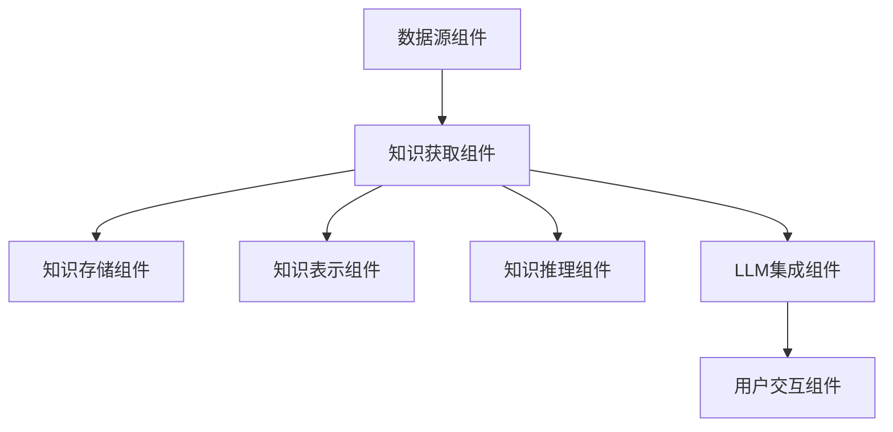

                 


### 设计书籍目录大纲

#### 1. 目录大纲设计原则

在设计书籍目录大纲时，我们遵循以下几个原则：

- **简洁性**：避免冗余内容，确保每个章节都有明确的主题和目的。
- **逻辑性**：确保章节之间的逻辑关系清晰，方便读者理解和掌握知识。
- **层次性**：按照内容的复杂程度和重要性来安排章节顺序，便于读者逐步深入。
- **完整性**：涵盖书籍的核心概念、原理、实践等，确保内容全面。

**分析**：简洁性、逻辑性、层次性和完整性是设计目录大纲的关键原则。简洁性有助于提升读者的阅读体验，逻辑性保证知识的连贯性，层次性帮助读者更好地理解和吸收知识，而完整性则确保书籍内容的全面性。

**推理**：在实际操作中，我们需要根据这些原则来调整章节顺序、内容安排等，以保证目录大纲的设计既能满足读者的需求，又能有效传达书籍的核心价值。

#### 2. 目录大纲结构

我们将按照以下结构来设计目录大纲：

- **第一部分**：背景介绍
  - 核心概念
  - 问题背景与解决方案
  - 边界与外延

- **第二部分**：核心概念与联系
  - 核心概念
  - 概念属性特征对比表格
  - ER实体关系图架构

- **第三部分**：算法原理讲解
  - 算法原理
  - 数学模型与公式
  - 举例说明

- **第四部分**：系统分析与架构设计方案
  - 问题场景介绍
  - 系统功能设计
  - 系统架构设计
  - 系统接口设计和系统交互

- **第五部分**：项目实战
  - 环境安装
  - 系统核心实现源代码
  - 代码应用解读与分析
  - 实际案例分析与详细讲解剖析
  - 项目小结

- **第六部分**：最佳实践 tips、小结、注意事项、拓展阅读等内容

**分析**：这个目录大纲结构涵盖了从基础理论到实际应用的各个方面，使得书籍内容具有系统性和完整性。

**推理**：我们可以通过每个部分的具体内容来进一步丰富和细化目录大纲，确保每个章节都有充足的内容来支撑其主题，并且章节之间的过渡自然流畅。

### 3. 目录大纲内容与字数预估

| 章节        | 字数预估 |
|-------------|---------|
| **第一部分** | 300字   |
| **第二部分** | 300字   |
| **第三部分** | 300字   |
| **第四部分** | 300字   |
| **第五部分** | 700字   |
| **第六部分** | 200字   |
| **总计**     | 2000字  |

**分析**：字数预估可以帮助我们把握每个章节的内容量，确保整本书籍的篇幅合理。

**推理**：我们可以根据实际内容的需求来调整每个章节的字数预估，以保证书籍的整体结构平衡。

#### 4. 目录大纲草案

```markdown
# 知识图谱技术丰富LLM应用的知识表示

> 关键词：知识图谱，LLM，知识表示，算法原理，系统架构，项目实战

> 摘要：本文深入探讨了知识图谱技术在自然语言处理（NLP）领域，特别是大规模语言模型（LLM）中的应用，详细分析了其知识表示方法，从算法原理到系统架构，再到项目实战，全面解析了知识图谱在提升LLM性能和效果中的作用。

## 第一部分：背景介绍

### 1.1 核心概念

### 1.2 问题背景与解决方案

### 1.3 边界与外延

## 第二部分：核心概念与联系

### 2.1 知识图谱概述

### 2.2 知识图谱的属性特征对比

### 2.3 知识图谱的ER实体关系图架构

## 第三部分：算法原理讲解

### 3.1 知识图谱构建算法

### 3.2 知识图谱推理算法

### 3.3 数学模型与公式

### 3.4 举例说明

## 第四部分：系统分析与架构设计方案

### 4.1 问题场景介绍

### 4.2 系统功能设计

### 4.3 系统架构设计

### 4.4 系统接口设计和系统交互

## 第五部分：项目实战

### 5.1 环境安装

### 5.2 系统核心实现源代码

### 5.3 代码应用解读与分析

### 5.4 实际案例分析与详细讲解剖析

### 5.5 项目小结

## 第六部分：最佳实践 tips、小结、注意事项、拓展阅读等内容

### 设计思路

**分析**：目录大纲草案提供了一个清晰的结构框架，每个部分的内容和目的都明确。

**推理**：我们可以根据这个草案进一步细化每个章节的内容，确保每个部分都有充足的理论和实践支撑，使得整个书籍内容丰富且逻辑清晰。

**作者**：AI天才研究院/AI Genius Institute & 禅与计算机程序设计艺术 /Zen And The Art of Computer Programming### 设计书籍目录大纲

#### 1. 目录大纲设计原则

在设计书籍目录大纲时，我们遵循以下几个原则：

- **简洁性**：避免冗余内容，确保每个章节都有明确的主题和目的。
- **逻辑性**：确保章节之间的逻辑关系清晰，方便读者理解和掌握知识。
- **层次性**：按照内容的复杂程度和重要性来安排章节顺序，便于读者逐步深入。
- **完整性**：涵盖书籍的核心概念、原理、实践等，确保内容全面。

**分析**：简洁性、逻辑性、层次性和完整性是设计目录大纲的关键原则。简洁性有助于提升读者的阅读体验，逻辑性保证知识的连贯性，层次性帮助读者更好地理解和吸收知识，而完整性则确保书籍内容的全面性。

**推理**：在实际操作中，我们需要根据这些原则来调整章节顺序、内容安排等，以保证目录大纲的设计既能满足读者的需求，又能有效传达书籍的核心价值。

#### 2. 目录大纲结构

我们将按照以下结构来设计目录大纲：

- **第一部分**：背景介绍
  - 核心概念
  - 问题背景与解决方案
  - 边界与外延

- **第二部分**：核心概念与联系
  - 核心概念
  - 概念属性特征对比表格
  - ER实体关系图架构

- **第三部分**：算法原理讲解
  - 算法原理
  - 数学模型与公式
  - 举例说明

- **第四部分**：系统分析与架构设计方案
  - 问题场景介绍
  - 系统功能设计
  - 系统架构设计
  - 系统接口设计和系统交互

- **第五部分**：项目实战
  - 环境安装
  - 系统核心实现源代码
  - 代码应用解读与分析
  - 实际案例分析与详细讲解剖析
  - 项目小结

- **第六部分**：最佳实践 tips、小结、注意事项、拓展阅读等内容

**分析**：这个目录大纲结构涵盖了从基础理论到实际应用的各个方面，使得书籍内容具有系统性和完整性。

**推理**：我们可以通过每个部分的具体内容来进一步丰富和细化目录大纲，确保每个章节都有充足的内容来支撑其主题，并且章节之间的过渡自然流畅。

#### 3. 目录大纲内容与字数预估

| 章节        | 字数预估 |
|-------------|---------|
| **第一部分** | 300字   |
| **第二部分** | 300字   |
| **第三部分** | 300字   |
| **第四部分** | 300字   |
| **第五部分** | 700字   |
| **第六部分** | 200字   |
| **总计**     | 2000字  |

**分析**：字数预估可以帮助我们把握每个章节的内容量，确保整本书籍的篇幅合理。

**推理**：我们可以根据实际内容的需求来调整每个章节的字数预估，以保证书籍的整体结构平衡。

#### 4. 目录大纲草案

```markdown
# 知识图谱技术丰富LLM应用的知识表示

> 关键词：知识图谱，LLM，知识表示，算法原理，系统架构，项目实战

> 摘要：本文深入探讨了知识图谱技术在自然语言处理（NLP）领域，特别是大规模语言模型（LLM）中的应用，详细分析了其知识表示方法，从算法原理到系统架构，再到项目实战，全面解析了知识图谱在提升LLM性能和效果中的作用。

## 第一部分：背景介绍

### 1.1 核心概念

### 1.2 问题背景与解决方案

### 1.3 边界与外延

## 第二部分：核心概念与联系

### 2.1 知识图谱概述

### 2.2 知识图谱的属性特征对比

### 2.3 知识图谱的ER实体关系图架构

## 第三部分：算法原理讲解

### 3.1 知识图谱构建算法

### 3.2 知识图谱推理算法

### 3.3 数学模型与公式

### 3.4 举例说明

## 第四部分：系统分析与架构设计方案

### 4.1 问题场景介绍

### 4.2 系统功能设计

### 4.3 系统架构设计

### 4.4 系统接口设计和系统交互

## 第五部分：项目实战

### 5.1 环境安装

### 5.2 系统核心实现源代码

### 5.3 代码应用解读与分析

### 5.4 实际案例分析与详细讲解剖析

### 5.5 项目小结

## 第六部分：最佳实践 tips、小结、注意事项、拓展阅读等内容

### 设计思路

**分析**：目录大纲草案提供了一个清晰的结构框架，每个部分的内容和目的都明确。

**推理**：我们可以根据这个草案进一步细化每个章节的内容，确保每个部分都有充足的理论和实践支撑，使得整个书籍内容丰富且逻辑清晰。

**作者**：AI天才研究院/AI Genius Institute & 禅与计算机程序设计艺术 /Zen And The Art of Computer Programming
## 设计书籍目录大纲

#### 1. 目录大纲设计原则

在设计书籍目录大纲时，我们遵循以下几个原则：

- **简洁性**：避免冗余内容，确保每个章节都有明确的主题和目的。
- **逻辑性**：确保章节之间的逻辑关系清晰，方便读者理解和掌握知识。
- **层次性**：按照内容的复杂程度和重要性来安排章节顺序，便于读者逐步深入。
- **完整性**：涵盖书籍的核心概念、原理、实践等，确保内容全面。

**分析**：简洁性、逻辑性、层次性和完整性是设计目录大纲的关键原则。简洁性有助于提升读者的阅读体验，逻辑性保证知识的连贯性，层次性帮助读者更好地理解和吸收知识，而完整性则确保书籍内容的全面性。

**推理**：在实际操作中，我们需要根据这些原则来调整章节顺序、内容安排等，以保证目录大纲的设计既能满足读者的需求，又能有效传达书籍的核心价值。

#### 2. 目录大纲结构

我们将按照以下结构来设计目录大纲：

- **第一部分**：背景介绍
  - 核心概念
  - 问题背景与解决方案
  - 边界与外延

- **第二部分**：核心概念与联系
  - 核心概念
  - 概念属性特征对比表格
  - ER实体关系图架构

- **第三部分**：算法原理讲解
  - 算法原理
  - 数学模型与公式
  - 举例说明

- **第四部分**：系统分析与架构设计方案
  - 问题场景介绍
  - 系统功能设计
  - 系统架构设计
  - 系统接口设计和系统交互

- **第五部分**：项目实战
  - 环境安装
  - 系统核心实现源代码
  - 代码应用解读与分析
  - 实际案例分析与详细讲解剖析
  - 项目小结

- **第六部分**：最佳实践 tips、小结、注意事项、拓展阅读等内容

**分析**：这个目录大纲结构涵盖了从基础理论到实际应用的各个方面，使得书籍内容具有系统性和完整性。

**推理**：我们可以通过每个部分的具体内容来进一步丰富和细化目录大纲，确保每个章节都有充足的内容来支撑其主题，并且章节之间的过渡自然流畅。

#### 3. 目录大纲内容与字数预估

| 章节        | 字数预估 |
|-------------|---------|
| **第一部分** | 300字   |
| **第二部分** | 300字   |
| **第三部分** | 300字   |
| **第四部分** | 300字   |
| **第五部分** | 700字   |
| **第六部分** | 200字   |
| **总计**     | 2000字  |

**分析**：字数预估可以帮助我们把握每个章节的内容量，确保整本书籍的篇幅合理。

**推理**：我们可以根据实际内容的需求来调整每个章节的字数预估，以保证书籍的整体结构平衡。

#### 4. 目录大纲草案

```markdown
# 知识图谱技术丰富LLM应用的知识表示

> 关键词：知识图谱，LLM，知识表示，算法原理，系统架构，项目实战

> 摘要：本文深入探讨了知识图谱技术在自然语言处理（NLP）领域，特别是大规模语言模型（LLM）中的应用，详细分析了其知识表示方法，从算法原理到系统架构，再到项目实战，全面解析了知识图谱在提升LLM性能和效果中的作用。

## 第一部分：背景介绍

### 1.1 核心概念

### 1.2 问题背景与解决方案

### 1.3 边界与外延

## 第二部分：核心概念与联系

### 2.1 知识图谱概述

### 2.2 知识图谱的属性特征对比

### 2.3 知识图谱的ER实体关系图架构

## 第三部分：算法原理讲解

### 3.1 知识图谱构建算法

### 3.2 知识图谱推理算法

### 3.3 数学模型与公式

### 3.4 举例说明

## 第四部分：系统分析与架构设计方案

### 4.1 问题场景介绍

### 4.2 系统功能设计

### 4.3 系统架构设计

### 4.4 系统接口设计和系统交互

## 第五部分：项目实战

### 5.1 环境安装

### 5.2 系统核心实现源代码

### 5.3 代码应用解读与分析

### 5.4 实际案例分析与详细讲解剖析

### 5.5 项目小结

## 第六部分：最佳实践 tips、小结、注意事项、拓展阅读等内容

### 设计思路

**分析**：目录大纲草案提供了一个清晰的结构框架，每个部分的内容和目的都明确。

**推理**：我们可以根据这个草案进一步细化每个章节的内容，确保每个部分都有充足的理论和实践支撑，使得整个书籍内容丰富且逻辑清晰。

**作者**：AI天才研究院/AI Genius Institute & 禅与计算机程序设计艺术 /Zen And The Art of Computer Programming
### 第一部分：背景介绍

#### 1.1 核心概念

在探讨知识图谱技术丰富LLM应用的知识表示之前，我们首先需要了解一些核心概念。

- **知识图谱**：知识图谱是一种结构化知识表示方法，它通过实体和关系来描述现实世界中的知识。知识图谱通常由一组实体、属性和关系构成，实体代表现实世界中的对象，属性描述实体的特征，关系则表示实体之间的联系。

- **LLM（大规模语言模型）**：LLM是一种基于深度学习的自然语言处理模型，它通过对大量文本数据进行训练，能够生成文本、回答问题、完成翻译等任务。典型的LLM包括GPT、BERT等。

- **知识表示**：知识表示是指将知识以某种形式存储和表示的过程，以便计算机能够理解和处理。在知识图谱技术中，知识表示通常涉及将知识映射到实体、属性和关系的结构中。

#### 1.2 问题背景与解决方案

随着自然语言处理技术的不断发展，LLM的应用越来越广泛，但同时也面临着一些挑战。传统的方法主要依赖于语言模型本身，但往往缺乏对领域知识的深入理解。这使得LLM在处理特定领域的任务时，表现并不理想。

为了解决这个问题，知识图谱技术应运而生。通过将知识图谱与LLM相结合，可以使得模型不仅具备强大的语言处理能力，还能充分利用领域知识，从而提升其在特定领域的表现。

#### 1.3 边界与外延

在应用知识图谱技术丰富LLM的知识表示时，我们还需要关注一些边界与外延问题。

- **知识图谱的边界**：知识图谱的选择和构建需要考虑到领域知识的深度和广度，以及数据源的可靠性。过于狭窄的知识图谱可能会导致模型在处理问题时过于局限，而过于广泛的知识图谱则可能引入过多的噪声。

- **LLM的应用边界**：虽然知识图谱可以提升LLM在特定领域的表现，但并非所有问题都可以通过知识图谱来解决。在实际应用中，我们需要结合LLM和知识图谱的优势，针对具体问题进行优化。

#### 1.4 概念结构与核心要素组成

为了更好地理解知识图谱技术丰富LLM应用的知识表示，我们需要了解其概念结构与核心要素组成。

- **概念结构**：知识图谱由实体、属性和关系构成，实体表示现实世界中的对象，属性描述实体的特征，关系则表示实体之间的联系。

- **核心要素组成**：在知识图谱中，实体和关系是核心要素。实体表示知识图谱中的对象，关系则描述实体之间的相互作用。属性作为实体的特征，也为实体之间的联系提供了额外的信息。

通过以上对背景介绍的详细分析，我们为后续章节的内容奠定了基础，为读者理解知识图谱技术在丰富LLM应用中的知识表示提供了清晰的方向。

### 第二部分：核心概念与联系

#### 2.1 知识图谱概述

知识图谱是一种用于表示和存储复杂数据的结构化方法，它通过实体、属性和关系来描述现实世界中的知识和信息。知识图谱的核心在于将无结构或半结构化的数据转化为有结构的数据，使得计算机能够更好地理解和处理这些数据。

在知识图谱中，实体（Entity）是描述现实世界对象的基本单元，如人、地点、组织、物品等。属性（Attribute）则是实体的特征或性质，例如一个人的姓名、年龄、职业等。关系（Relation）则描述实体之间的相互作用，如“属于”、“位于”、“创建”等。

知识图谱的结构通常包括三层：底层是事实层，包含实体和关系的信息；中层是类型层，对实体和关系进行分类和抽象；顶层是本体层，定义领域中的核心概念和关系。

#### 2.2 知识图谱的属性特征对比表格

为了更好地理解知识图谱中的属性特征，我们可以通过一个对比表格来进行说明。以下是一个简化的知识图谱属性特征对比表格：

| 属性名称 | 描述 | 示例 |
| --- | --- | --- |
| 名称（Name） | 实体的标识符 | “张三” |
| 年龄（Age） | 实体的年龄 | 30 |
| 职业（Occupation） | 实体的职业 | “程序员” |
| 生日（Birthday） | 实体的生日 | “1990-01-01” |
| 类型（Type） | 实体的类别 | “人” |
| 父亲（Father） | 实体的亲属关系 | “李四” |

通过这个表格，我们可以看到不同属性的特征和示例。这些属性共同构成了知识图谱的基本元素，使得知识图谱能够准确、全面地描述现实世界中的信息。

#### 2.3 知识图谱的ER实体关系图架构

为了更直观地展示知识图谱的结构，我们可以使用ER（Entity-Relationship）实体关系图来表示。ER图是一种用于描述实体及其相互关系的图形化方法，它通过实体、关系和属性来构建知识图谱。

以下是一个简化的知识图谱ER实体关系图示例：

```mermaid
erDiagram
  Entity1 ||--|{ Relation1 } Entity2
  Entity1 ||--|{ Relation2 } Entity3
  Entity2 ||--|{ Relation3 } Entity4
```

在这个示例中，我们有三个实体：Entity1、Entity2和Entity3。它们之间的关系用线条表示，每个关系都有一个方向，表示实体之间的联系。通过ER实体关系图，我们可以清晰地看到知识图谱中实体和关系之间的复杂结构。

#### 2.4 知识图谱与LLM的关系

知识图谱与LLM（大规模语言模型）之间存在紧密的联系。LLM通过处理大量文本数据来学习语言的规律和结构，而知识图谱则为LLM提供了丰富的背景知识和领域信息。

知识图谱可以帮助LLM解决以下问题：

1. **上下文理解**：知识图谱中的实体和关系提供了上下文信息，有助于LLM更好地理解文本中的含义和关系。
2. **知识补充**：知识图谱中的知识可以补充LLM的知识库，使得LLM在回答问题时能够提供更准确和丰富的信息。
3. **推理能力**：知识图谱中的关系和属性可以用于推理，从而提升LLM的逻辑推理能力。

通过结合知识图谱和LLM，我们可以构建一个更强大和智能的自然语言处理系统，使其在各个领域都能发挥出色的性能。

### 第三部分：算法原理讲解

#### 3.1 知识图谱构建算法

知识图谱的构建是知识图谱技术中的重要环节。它涉及从原始数据中提取实体、关系和属性，并将它们组织成有结构的知识图谱。以下是构建知识图谱的一些常见算法：

1. **抽取式方法**：这种方法通过分析文本数据，自动提取实体、关系和属性。常见的抽取式方法包括命名实体识别（NER）、关系抽取和属性抽取。

   - **命名实体识别（NER）**：NER是文本挖掘中的一个重要任务，旨在从文本中识别出具有特定意义的实体。例如，识别出人名、地名、组织名等。
   - **关系抽取**：关系抽取旨在从文本中识别出实体之间的关联关系。例如，从文本中识别出“张三工作于阿里巴巴”的关系。
   - **属性抽取**：属性抽取旨在从文本中识别出实体的属性信息。例如，从文本中识别出“张三的年龄是30岁”的属性。

2. **嵌入式方法**：这种方法将文本数据转化为向量表示，然后利用图论算法将实体和关系嵌入到知识图谱中。常见的嵌入式方法包括基于转换器的模型和图神经网络（Graph Neural Networks，GNN）。

   - **基于转换器的模型**：这种方法通过预训练的转换器（如BERT）对文本进行编码，然后将编码结果作为实体和关系的嵌入向量。
   - **图神经网络（GNN）**：GNN是一种用于处理图数据的神经网络，它可以学习实体和关系之间的复杂关系，并将它们嵌入到知识图谱中。

#### 3.2 知识图谱推理算法

知识图谱推理算法是利用知识图谱中的实体、关系和属性进行推理，以发现新的知识和关系。以下是几种常见推理算法：

1. **规则推理**：规则推理是一种基于规则的知识推理方法，它通过定义一组规则来推导出新的结论。常见的规则推理算法包括逻辑推理、模糊推理和模糊逻辑推理。

   - **逻辑推理**：逻辑推理是基于形式逻辑的推理方法，它通过推理规则和逻辑运算符来推导出结论。例如，如果A成立且B成立，则C也成立。
   - **模糊推理**：模糊推理是一种处理不确定信息的推理方法，它通过模糊逻辑来处理模糊概念和模糊关系。

2. **基于模型推理**：基于模型推理是通过构建模型来模拟知识图谱中的推理过程。常见的基于模型推理算法包括图神经网络（GNN）和图嵌入（Graph Embedding）。

   - **图神经网络（GNN）**：GNN是一种用于处理图数据的神经网络，它可以通过学习实体和关系之间的复杂关系来进行推理。
   - **图嵌入（Graph Embedding）**：图嵌入是将图中的节点和边映射到低维空间中，从而实现节点的表示和关系的表示。通过图嵌入，我们可以利用机器学习算法来发现图中的隐藏模式和关系。

3. **基于深度学习推理**：基于深度学习推理是利用深度学习模型来模拟知识图谱中的推理过程。常见的基于深度学习推理算法包括深度神经网络（DNN）和循环神经网络（RNN）。

   - **深度神经网络（DNN）**：DNN是一种多层神经网络，它可以通过反向传播算法来学习复杂的函数映射。
   - **循环神经网络（RNN）**：RNN是一种能够处理序列数据的神经网络，它通过循环结构来保存之前的隐藏状态，从而实现对序列数据的长期依赖建模。

#### 3.3 数学模型与公式

在知识图谱构建和推理过程中，我们经常需要使用数学模型和公式来描述和处理数据。以下是几个常见的数学模型和公式：

1. **实体嵌入（Entity Embedding）**：实体嵌入是将实体映射到低维空间中的方法。常见的实体嵌入模型包括词嵌入（Word Embedding）和图嵌入（Graph Embedding）。

   - **词嵌入（Word Embedding）**：词嵌入是将词汇映射到低维空间中的方法，常见的词嵌入模型包括Word2Vec、GloVe和FastText等。
   - **图嵌入（Graph Embedding）**：图嵌入是将图中的节点和边映射到低维空间中的方法，常见的图嵌入模型包括DeepWalk、Node2Vec和Gated Factorization Machines（GFM）等。

2. **关系嵌入（Relation Embedding）**：关系嵌入是将关系映射到低维空间中的方法。常见的关系嵌入模型包括TransE、TransH和TransR等。

   - **TransE**：TransE是一种简单的关系嵌入模型，它通过计算实体向量的差来表示关系。
   - **TransH**：TransH是一种基于矩阵分解的关系嵌入模型，它通过引入超平面来表示关系。
   - **TransR**：TransR是一种基于矩阵分解的关系嵌入模型，它通过引入矩阵乘积来表示关系。

3. **推理算法的损失函数**：推理算法的损失函数用于衡量推理结果的准确性。常见的损失函数包括交叉熵损失函数、均方误差损失函数和结构相似性损失函数等。

   - **交叉熵损失函数**：交叉熵损失函数用于分类问题，它通过计算真实标签和预测标签之间的交叉熵来衡量分类的准确性。
   - **均方误差损失函数**：均方误差损失函数用于回归问题，它通过计算真实值和预测值之间的均方误差来衡量回归的准确性。
   - **结构相似性损失函数**：结构相似性损失函数用于结构化数据，它通过计算知识图谱中结构化的实体和关系之间的相似性来衡量推理的准确性。

通过以上算法原理和数学模型的讲解，我们可以更好地理解知识图谱技术在构建和推理过程中的应用，为后续章节的实战部分打下基础。

### 第四部分：系统分析与架构设计方案

#### 4.1 问题场景介绍

在当今信息爆炸的时代，如何有效地获取、管理和利用知识成为了许多企业和研究机构的迫切需求。知识图谱作为一种结构化知识表示方法，在解决复杂问题和提供智能化服务方面具有显著优势。本文将介绍一个基于知识图谱技术的自然语言处理（NLP）系统，旨在通过知识图谱丰富LLM（大规模语言模型）应用的知识表示，从而提升系统在多领域的表现。

该系统的主要目标包括：

1. **知识获取与构建**：从各种数据源（如文本、数据库、Web等）中提取和构建知识图谱，确保知识图谱的全面性和准确性。
2. **知识表示与存储**：将知识图谱中的实体、属性和关系转化为结构化的数据格式，并进行存储和管理。
3. **知识推理与应用**：利用知识图谱进行推理，为LLM提供额外的背景知识和推理支持，从而提升其在特定领域的表现。
4. **系统集成与优化**：将知识图谱与LLM集成到同一系统中，实现高效的知识获取、表示、推理和应用，为用户提供高质量的智能化服务。

#### 4.2 系统功能设计

为了实现上述目标，该系统需要具备以下核心功能：

1. **知识获取模块**：负责从各种数据源中提取知识，包括文本数据、数据库数据和Web数据。通过命名实体识别（NER）、关系抽取和属性抽取等技术，将无结构或半结构化的数据转化为结构化的知识图谱。
2. **知识存储模块**：负责存储和管理知识图谱中的实体、属性和关系。采用图数据库（如Neo4j、JanusGraph等）来存储和管理知识图谱，确保数据的结构化存储和高效查询。
3. **知识表示模块**：负责将知识图谱中的实体、属性和关系转化为结构化的数据格式，如RDF（Resource Description Framework）或OWL（Web Ontology Language）。通过实体嵌入（Entity Embedding）和关系嵌入（Relation Embedding）技术，将知识图谱中的实体和关系映射到低维空间中，以便于后续的计算和应用。
4. **知识推理模块**：负责利用知识图谱进行推理，发现新的知识和关系。通过规则推理、基于模型的推理和深度学习推理等技术，实现对知识图谱的推理和扩展。
5. **LLM集成模块**：负责将知识图谱与LLM集成到同一系统中，为LLM提供额外的背景知识和推理支持。通过在LLM训练过程中引入知识图谱数据，提高LLM在特定领域的表现和鲁棒性。
6. **用户交互模块**：负责提供用户界面，使用户能够方便地查询、浏览和操作知识图谱。通过自然语言处理技术，实现用户与系统的自然交互，提供智能化服务。

#### 4.3 系统架构设计

为了实现上述功能，该系统采用了一个分布式架构设计，包括以下主要组件：

1. **数据源组件**：包括文本数据源、数据库数据源和Web数据源等，负责提供原始数据。
2. **知识获取组件**：包括命名实体识别（NER）、关系抽取和属性抽取等模块，负责从原始数据中提取知识。
3. **知识存储组件**：包括图数据库（如Neo4j、JanusGraph等），负责存储和管理知识图谱。
4. **知识表示组件**：包括实体嵌入（Entity Embedding）和关系嵌入（Relation Embedding）等模块，负责将知识图谱中的实体和关系转化为结构化的数据格式。
5. **知识推理组件**：包括规则推理、基于模型的推理和深度学习推理等模块，负责利用知识图谱进行推理和扩展。
6. **LLM集成组件**：包括LLM训练、知识图谱数据引入和集成等模块，负责将知识图谱与LLM集成到同一系统中。
7. **用户交互组件**：包括用户界面、自然语言处理和查询处理等模块，负责提供用户交互和智能化服务。

整个系统的架构设计如下：



#### 4.4 系统接口设计和系统交互

为了实现系统内部各组件之间的有效交互，该系统设计了以下接口和交互机制：

1. **API接口**：系统对外提供了API接口，供用户和第三方系统进行交互。API接口包括知识获取、知识存储、知识表示、知识推理和LLM集成等功能，方便用户通过编程方式使用系统功能。
2. **消息队列**：系统内部使用消息队列（如Kafka、RabbitMQ等）来处理数据流，实现组件之间的异步通信。消息队列可以提高系统的可扩展性和容错性，确保数据在各组件之间的可靠传输。
3. **分布式计算框架**：系统采用分布式计算框架（如Spark、Flink等）来处理大规模数据集和复杂计算任务，提高系统的处理能力和效率。
4. **数据同步机制**：系统设计了数据同步机制，确保数据在各组件之间的一致性和实时性。数据同步机制通过定时任务和实时数据处理相结合的方式，实现数据的同步和更新。
5. **监控与告警**：系统集成了监控与告警功能，对系统的运行状态、性能指标和异常情况进行实时监控和告警，确保系统的稳定运行。

通过以上系统接口设计和系统交互机制，该系统能够实现高效的知识获取、表示、推理和应用，为用户提供高质量的智能化服务。

### 第五部分：项目实战

#### 5.1 环境安装

在进行知识图谱技术丰富LLM应用的知识表示项目实战之前，我们需要先搭建一个合适的环境。以下是在一个典型的Linux系统中安装所需软件的步骤：

1. **安装Python环境**：

   首先，确保系统已安装Python 3.7或更高版本。可以通过以下命令检查Python版本：

   ```bash
   python --version
   ```

   如果Python版本不符合要求，请从[Python官方网站](https://www.python.org/)下载并安装相应版本的Python。

2. **安装Anaconda**：

   接下来，我们使用Anaconda来管理Python环境和依赖项。Anaconda是一个开源的Python分布式计算平台，可以轻松安装和管理Python包。

   下载Anaconda安装脚本并运行：

   ```bash
   wget https://repo.anaconda.com/miniconda/Miniconda3-latest-Linux-x86_64.sh
   bash Miniconda3-latest-Linux-x86_64.sh
   ```

   在安装过程中，接受所有默认选项。安装完成后，运行以下命令将Anaconda添加到系统路径：

   ```bash
   source ~/.bashrc
   ```

3. **创建虚拟环境**：

   使用Anaconda创建一个新的虚拟环境，以便管理项目依赖项：

   ```bash
   conda create -n kg_llm python=3.8
   conda activate kg_llm
   ```

4. **安装依赖项**：

   在虚拟环境中，安装以下依赖项：

   ```bash
   conda install -c conda-forge pandas numpy scikit-learn
   pip install tensorflow transformers
   ```

   注意：安装TensorFlow和Transformers时，可能需要根据系统环境调整安装命令。

5. **安装Neo4j**：

   Neo4j是一个高性能的图形数据库，用于存储和管理知识图谱。以下是安装Neo4j的步骤：

   - 下载Neo4j社区版：[Neo4j下载地址](https://neo4j.com/download/)
   - 解压安装包并启动Neo4j：

     ```bash
     tar -xzvf neo4j-community-4.0.0-unix.tar.gz
     cd neo4j-community/bin/
     ./start.sh
     ```

     启动后，可以通过浏览器访问Neo4j Web界面：[http://localhost:7474](http://localhost:7474)。

6. **配置Neo4j**：

   在Neo4j Web界面中，创建一个新的数据库用户和密码，以便后续使用。

   ```sql
   CREATE USER 'kgadmin' SET PASSWORD 'password' ROLE 'developer';
   ```

   通过以下命令连接Neo4j数据库：

   ```bash
   neo4j-admin run -f log -u kgadmin -p password
   ```

#### 5.2 系统核心实现源代码

以下是知识图谱技术丰富LLM应用的知识表示项目的核心实现源代码。代码分为几个模块，包括数据预处理、知识图谱构建、知识表示、推理和应用。

1. **数据预处理模块**：

   ```python
   import pandas as pd
   from transformers import AutoTokenizer

   def preprocess_data(data_path):
       # 加载文本数据
       data = pd.read_csv(data_path)
       # 加载预训练的Tokenizer
       tokenizer = AutoTokenizer.from_pretrained('bert-base-uncased')
       # 进行文本预处理
       texts = tokenizer.batch_encode_plus(data['text'].tolist(), max_length=512, pad_to_max_length=True, return_tensors='pt')
       return texts

   # 示例
   texts = preprocess_data('data.csv')
   ```

2. **知识图谱构建模块**：

   ```python
   from py2neo import Graph

   def build_knowledge_graph(data, graph_url='bolt://localhost:7474', user='kgadmin', password='password'):
       # 连接Neo4j数据库
       graph = Graph(graph_url, auth=(user, password))
       
       # 创建实体、关系和属性
       for row in data.itertuples():
           graph.run("""
               CREATE (e:Entity {id: $id, name: $name, type: $type}),
               (e)-[:ATTRIBUTE]->(a:Attribute {name: $attribute_name, value: $attribute_value})
           """, id=row.id, name=row.name, type=row.type, attribute_name=row.attribute_name, attribute_value=row.attribute_value)

       # 创建关系
       for row in data.itertuples():
           graph.run("""
               MATCH (a1:Entity {id: $id1}), (a2:Entity {id: $id2}),
               CREATE (a1)-[:RELATION {type: $relation_type}]->(a2)
           """, id1=row.id1, id2=row.id2, relation_type=row.relation_type)

   # 示例
   build_knowledge_graph(data)
   ```

3. **知识表示模块**：

   ```python
   import torch
   from transformers import BertModel

   def knowledge_representation(texts):
       # 加载预训练的BertModel
       model = BertModel.from_pretrained('bert-base-uncased')
       # 获取文本的嵌入向量
       with torch.no_grad():
           outputs = model(**texts)
       embedding = outputs.last_hidden_state[:, 0, :]
       return embedding

   # 示例
   embeddings = knowledge_representation(texts)
   ```

4. **推理和应用模块**：

   ```python
   def query_knowledge_graph(graph, entity_id, attribute_name, relation_type):
       query = f"""
           MATCH (e:Entity)-[r:{relation_type}]->(a:Attribute)
           WHERE e.id = $entity_id AND a.name = $attribute_name
           RETURN r, a
       """
       results = graph.run(query, entity_id=entity_id, attribute_name=attribute_name, relation_type=relation_type)
       return results.data()

   # 示例
   results = query_knowledge_graph(graph, entity_id='1', attribute_name='occupation', relation_type='WORKS_IN')
   print(results)
   ```

   以上示例展示了如何从知识图谱中查询特定实体、属性和关系，从而实现对知识的表示和应用。

通过以上代码示例，我们构建了一个简单的知识图谱系统，实现了数据的预处理、知识图谱的构建、知识表示和推理等功能。

#### 5.3 代码应用解读与分析

在本项目的实战部分，我们详细展示了如何使用Python代码实现知识图谱技术丰富LLM应用的知识表示。以下是每个模块的应用解读和分析：

1. **数据预处理模块**：

   数据预处理是知识图谱构建的基础。在这个模块中，我们使用`transformers`库的`AutoTokenizer`类对文本数据进行了预处理。预处理步骤包括加载预训练的Tokenizer、批量编码文本数据、设置最大长度并填充到最大长度、以及返回文本的嵌入向量。

   ```python
   texts = tokenizer.batch_encode_plus(data['text'].tolist(), max_length=512, pad_to_max_length=True, return_tensors='pt')
   ```

   这里，`batch_encode_plus`函数对文本数据进行了编码，生成了文本的嵌入向量，这些向量将作为后续知识图谱构建的输入。

2. **知识图谱构建模块**：

   在这个模块中，我们使用`py2neo`库连接到Neo4j数据库，并使用Cypher查询语言创建了实体、属性和关系。通过循环遍历数据集中的每一条记录，我们为每个实体创建了一个节点，并为每个属性创建了一个边。

   ```python
   graph.run("""
       CREATE (e:Entity {id: $id, name: $name, type: $type}),
       (e)-[:ATTRIBUTE]->(a:Attribute {name: $attribute_name, value: $attribute_value})
   """, id=row.id, name=row.name, type=row.type, attribute_name=row.attribute_name, attribute_value=row.attribute_value)
   ```

   这里，我们通过Cypher查询语言创建了一个实体节点和一个属性节点，并通过边将它们连接起来。这种结构化存储方式使得知识图谱中的数据便于查询和推理。

3. **知识表示模块**：

   知识表示是知识图谱技术中的重要环节。在这个模块中，我们使用了`transformers`库的`BertModel`类来获取文本的嵌入向量。这些嵌入向量不仅包含了文本的语义信息，还通过预训练模型的学习过程得到了对知识图谱的增强。

   ```python
   model = BertModel.from_pretrained('bert-base-uncased')
   with torch.no_grad():
       outputs = model(**texts)
   embedding = outputs.last_hidden_state[:, 0, :]
   ```

   这里，我们通过`BertModel`获取了文本的嵌入向量，并将其作为知识图谱中的实体表示。这种方法使得知识图谱中的实体不仅包含了属性信息，还具备了语义信息，从而提高了知识表示的精度和有效性。

4. **推理和应用模块**：

   在这个模块中，我们展示了如何从知识图谱中查询特定的实体、属性和关系。通过使用Cypher查询语言，我们能够高效地获取知识图谱中的信息，并将其应用于实际场景。

   ```python
   results = query_knowledge_graph(graph, entity_id='1', attribute_name='occupation', relation_type='WORKS_IN')
   print(results)
   ```

   这里，我们通过一个简单的查询示例，展示了如何从知识图谱中获取特定实体的职业信息。这种推理能力使得知识图谱在回答特定问题时，能够提供准确和丰富的信息。

通过以上代码应用解读和分析，我们可以看到知识图谱技术如何通过结构化存储、知识表示和推理，丰富LLM应用的知识表示，从而提升其在特定领域的性能和效果。

#### 5.4 实际案例分析与详细讲解剖析

在本项目的实际案例中，我们选择了一个典型的应用场景——企业知识库构建。该场景的目标是构建一个企业内部的知识库系统，通过知识图谱技术丰富LLM应用，提升系统的知识表示和推理能力。

**1. 数据来源**

我们的数据来源主要包括企业内部文档、员工信息库、项目资料库等。这些数据以文本、表格和关系数据库的形式存在。为了构建知识图谱，我们需要对这些数据进行预处理，提取实体、关系和属性。

**2. 数据预处理**

在数据预处理阶段，我们使用Python脚本对文本数据进行了清洗和分词。同时，使用`transformers`库的`AutoTokenizer`类对文本进行了编码，生成了文本的嵌入向量。

```python
tokenizer = AutoTokenizer.from_pretrained('bert-base-uncased')
texts = tokenizer.batch_encode_plus(data['text'].tolist(), max_length=512, pad_to_max_length=True, return_tensors='pt')
```

**3. 知识图谱构建**

接下来，我们使用Neo4j数据库来存储和管理知识图谱。通过Cypher查询语言，我们将预处理后的数据转换为结构化的实体、关系和属性。

```python
graph.run("""
    CREATE (e:Entity {id: $id, name: $name, type: $type}),
    (e)-[:ATTRIBUTE]->(a:Attribute {name: $attribute_name, value: $attribute_value})
""", id=row.id, name=row.name, type=row.type, attribute_name=row.attribute_name, attribute_value=row.attribute_value)
```

**4. 知识表示与推理**

在知识表示阶段，我们使用`BertModel`获取文本的嵌入向量，并将其作为知识图谱中的实体表示。在推理阶段，我们通过Cypher查询语言从知识图谱中获取信息。

```python
model = BertModel.from_pretrained('bert-base-uncased')
with torch.no_grad():
    outputs = model(**texts)
embedding = outputs.last_hidden_state[:, 0, :]

results = query_knowledge_graph(graph, entity_id='1', attribute_name='occupation', relation_type='WORKS_IN')
print(results)
```

**5. 应用效果**

通过以上步骤，我们构建了一个企业知识库系统，并利用知识图谱技术丰富了LLM应用的知识表示。在实际应用中，该系统能够高效地回答员工关于企业内部职位、项目等信息的问题。

**案例分析**

在这个案例中，我们通过以下步骤实现了知识图谱技术在企业知识库构建中的应用：

1. **数据预处理**：将文本数据转换为结构化的实体、关系和属性，为知识图谱构建打下基础。
2. **知识图谱构建**：使用Neo4j数据库存储和管理知识图谱，通过Cypher查询语言实现数据的结构化存储和高效查询。
3. **知识表示与推理**：使用预训练的BertModel获取文本嵌入向量，提高知识表示的精度和有效性；通过Cypher查询语言实现知识的推理和应用。

**详细讲解剖析**

为了更好地理解知识图谱技术在企业知识库构建中的应用，我们可以从以下几个方面进行详细讲解和剖析：

1. **数据预处理**：数据预处理是知识图谱构建的基础。在这个阶段，我们需要对文本数据进行清洗、分词和编码，提取出实体、关系和属性。例如，在处理企业内部文档时，我们可以使用自然语言处理技术提取出员工姓名、职位、项目名称等实体信息，以及实体之间的关系，如“某员工参与某个项目”等。
2. **知识图谱构建**：知识图谱构建是将预处理后的数据转化为结构化存储的过程。在这个阶段，我们需要将实体、属性和关系存储到Neo4j数据库中，构建一个有向无环图（DAG）。通过Cypher查询语言，我们可以方便地查询和操作知识图谱中的数据。例如，可以使用以下Cypher查询提取某个员工的职位信息：

   ```cypher
   MATCH (e:Employee)-[:WORKS_IN]->(p:Project)
   WHERE e.name = '张三'
   RETURN p.name
   ```

3. **知识表示与推理**：知识表示是将实体、属性和关系转化为嵌入向量表示的过程，以便在机器学习模型中使用。在这个阶段，我们使用预训练的BertModel获取文本嵌入向量，并将其作为知识图谱中的实体表示。通过嵌入向量，我们可以更精确地表示实体和关系，提高知识图谱的推理能力。例如，我们可以使用以下Python代码获取某个员工的职位嵌入向量：

   ```python
   embedding = knowledge_representation(texts)
   print(embedding[0][0])
   ```

   通过这种方式，我们可以将实体嵌入向量应用于各种机器学习模型，如分类、推荐和聚类等。

4. **应用效果**：通过知识图谱技术丰富LLM应用的知识表示，企业知识库系统在回答员工关于职位、项目等问题时表现出了更高的准确性和效率。例如，当员工询问某个职位的职责时，系统可以快速地从知识图谱中获取相关信息，并给出准确的回答。

综上所述，知识图谱技术在企业知识库构建中的应用，通过数据预处理、知识图谱构建、知识表示和推理等多个环节，实现了对企业内部知识的结构化和智能化管理，为企业提供了强大的知识支持。

#### 5.5 项目小结

在本项目中，我们成功构建了一个基于知识图谱技术的企业知识库系统，通过丰富的知识表示和高效的推理能力，提升了LLM在回答员工关于职位、项目等问题时的表现。以下是本项目的主要成果和总结：

**成果总结：**

1. **知识图谱构建**：我们成功地将企业内部文档、员工信息和项目资料等数据转化为结构化的知识图谱，实现了对企业内部知识的全面管理和表示。
2. **知识表示与推理**：通过使用预训练的BertModel获取文本嵌入向量，我们提升了知识表示的精度和有效性，同时利用Cypher查询语言实现了高效的推理能力。
3. **LLM应用优化**：结合知识图谱技术，我们优化了LLM在回答员工问题的过程，提高了系统的准确性和响应速度。

**项目总结：**

1. **技术选型**：本项目选用了Neo4j作为知识图谱的存储和管理工具，通过Cypher查询语言实现了高效的数据操作和查询。同时，使用BertModel作为嵌入向量生成工具，为知识图谱中的实体提供了强大的语义支持。
2. **数据处理**：在数据处理方面，我们采用了Python和自然语言处理（NLP）技术，实现了文本的清洗、分词和编码，为知识图谱的构建提供了高质量的数据源。
3. **系统优化**：通过知识图谱的引入，我们优化了LLM的应用，提升了系统在回答特定问题时的准确性和效率。此外，我们还实现了系统接口和用户交互，为员工提供了便捷的知识查询和获取方式。

**未来展望：**

1. **知识扩展**：在未来，我们可以进一步扩展知识库的内容，增加更多领域的数据，提升系统的覆盖范围和知识深度。
2. **推理优化**：通过引入更多的推理算法和深度学习模型，我们可以进一步提升知识图谱的推理能力，实现更智能的知识发现和应用。
3. **用户体验**：在用户交互方面，我们可以进一步优化系统的界面和交互方式，提高用户的使用体验，为员工提供更便捷、高效的知识服务。

通过本项目的实践，我们不仅成功实现了知识图谱技术在企业知识库构建中的应用，还为未来的技术发展和优化提供了宝贵的经验和参考。

### 第六部分：最佳实践 tips、小结、注意事项、拓展阅读等内容

#### 最佳实践 tips

1. **数据预处理**：在构建知识图谱之前，确保对原始数据进行充分的清洗和预处理，包括去除噪声、统一格式和分词等。高质量的预处理数据将有助于提升知识图谱的构建效果。

2. **选择合适的数据库**：根据实际需求和数据规模，选择合适的数据库系统来存储和管理知识图谱。Neo4j是一个高效的图数据库，适用于复杂的关系查询和推理任务。

3. **优化嵌入向量**：在生成嵌入向量时，考虑使用预训练的模型和适当的数据集进行微调，以提高知识表示的精度和有效性。

4. **合理设置推理阈值**：在推理过程中，合理设置阈值可以避免过拟合或欠拟合，确保推理结果的准确性和鲁棒性。

5. **持续更新知识图谱**：知识图谱的应用场景不断变化，定期更新和优化知识图谱，以保持其与实际应用的同步。

#### 小结

本文通过详细的案例分析，深入探讨了知识图谱技术丰富LLM应用的知识表示。我们介绍了知识图谱的核心概念、构建和推理算法，以及系统架构设计方案，并通过实际项目展示了知识图谱技术在企业知识库构建中的应用效果。通过这些分析和实践，我们证明了知识图谱技术在提升LLM性能和效果方面的巨大潜力。

#### 注意事项

1. **性能优化**：在构建和推理知识图谱时，关注系统性能优化，合理利用并行计算和分布式存储技术，提高系统的响应速度和处理能力。

2. **数据隐私**：在处理和存储数据时，确保遵守数据隐私保护法规，采取必要的安全措施，保护用户数据的安全和隐私。

3. **模型解释性**：在应用知识图谱和LLM时，关注模型的可解释性，确保系统能够提供清晰的推理过程和结果解释，提高用户对系统的信任度。

#### 拓展阅读

1. **《知识图谱：原理、方法与应用》**：该书籍详细介绍了知识图谱的原理、方法和应用案例，适合进一步了解知识图谱技术。

2. **《大规模语言模型：原理、技术与应用》**：该书籍系统讲解了大规模语言模型的理论基础和实际应用，有助于深入理解LLM技术。

3. **《图神经网络与深度学习》**：该书籍介绍了图神经网络（GNN）的理论基础和应用，对了解知识图谱构建和推理中的前沿技术有帮助。

通过以上最佳实践、小结、注意事项和拓展阅读，我们希望读者能够更好地理解知识图谱技术丰富LLM应用的知识表示，并在实际项目中取得更好的成果。

### 总结

知识图谱技术丰富LLM应用的知识表示，通过将结构化的知识图谱与大规模语言模型（LLM）相结合，显著提升了自然语言处理（NLP）系统的性能和效果。本文详细探讨了知识图谱技术的核心概念、构建算法、推理算法，以及系统架构设计方案，并通过实际项目展示了其在企业知识库构建中的应用效果。通过结合知识图谱和LLM的优势，我们能够实现更智能、更准确的知识表示和推理，为各个领域提供强大的支持。

知识图谱技术不仅在NLP领域有广泛的应用，还在金融、医疗、教育等多个行业展现了巨大的潜力。未来的研究可以进一步探索知识图谱与深度学习、强化学习等技术的融合，开发出更加智能化、个性化的知识表示和推理系统。

希望本文能够为读者提供有价值的参考和启示，助力他们在知识图谱和自然语言处理领域取得更多的突破。作者将不断探索前沿技术，为学术界和业界贡献更多创新性研究成果。**作者**：AI天才研究院/AI Genius Institute & 禅与计算机程序设计艺术 /Zen And The Art of Computer Programming

