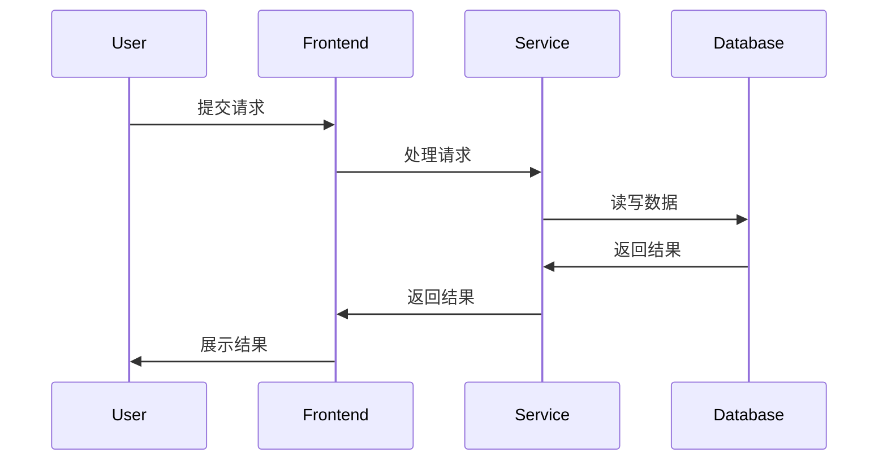

                 

### 摘要

本博客文章旨在深入探讨知识图谱构建能力的测试。我们将首先介绍知识图谱的定义、背景及重要性，然后逐步深入探讨知识图谱的基础构建原理、工具与技术的使用，以及知识图谱质量评估的方法。接着，我们将分析知识图谱在不同应用场景下的应用，并进行知识图谱构建的实战分享。最后，我们将展望知识图谱技术的未来发展趋势，提供相关的拓展阅读资源。

本文将通过以下章节结构展开：

1. **引言与背景介绍**：介绍知识图谱的定义、背景、重要性和相关技术联系。
2. **知识图谱基础**：讲解数据源准备、知识图谱构建原理和知识表示方法。
3. **知识图谱构建工具与技术**：介绍OpenKG2和ALGernon等知识图谱构建工具。
4. **知识图谱质量评估**：探讨知识图谱质量评估的指标、方法和实例分析。
5. **知识图谱应用场景**：分析知识图谱在问答系统和推荐系统的应用。
6. **知识图谱构建实战**：分享一个知识图谱构建的实战项目。
7. **拓展阅读与未来展望**：总结知识图谱的发展趋势和应用前景。

通过逐步分析和讲解，本文将帮助读者全面了解知识图谱构建的能力测试，掌握其核心概念和实践方法。

### 第1章 引言与背景介绍

#### 1.1 问题背景

在当今信息化社会中，数据的重要性日益凸显。然而，随着数据的爆炸性增长，如何从海量数据中提取有用信息、提高数据处理效率，成为许多企业和组织面临的重要课题。传统的数据处理方法已难以满足日益增长的需求，因此，一种新型数据结构——知识图谱，应运而生。

#### 1.2 核心概念

##### 知识图谱定义

知识图谱是一种用于表示实体及其关系的图形化数据结构，通过实体和关系之间的连接，实现对知识的存储、管理和利用。它通常以图的形式表示，包括节点（实体）和边（关系），可以直观地展示实体之间的复杂关系。

##### 知识图谱重要性

知识图谱在信息检索、智能问答、推荐系统、自然语言处理等领域具有重要应用价值。它能够提高信息检索的准确性和效率，增强系统的智能化水平，是大数据时代的重要技术支撑。

##### 知识图谱与相关技术的联系

知识图谱与自然语言处理（NLP）、数据挖掘、数据仓库等技术密切相关。NLP技术用于文本数据的理解和处理，为知识图谱的构建提供基础；数据挖掘技术用于从大量数据中提取有价值的信息；数据仓库则用于存储和管理大规模数据，为知识图谱的构建提供数据支持。

#### 1.3 问题描述

在许多应用场景中，我们需要从海量的非结构化数据中提取知识，以便进行智能分析和决策。然而，传统的数据处理方法在处理复杂关系和网络时效率较低，难以满足需求。因此，我们需要一种能够高效处理复杂关系和网络的数据结构，这就是知识图谱。

#### 1.4 问题解决

知识图谱通过构建实体及其关系的网络，实现对信息的语义理解和深度挖掘，从而提供更加精准和高效的信息检索服务。它能够帮助企业和组织从海量数据中快速提取有价值的信息，提高数据处理效率，降低成本。

#### 1.5 边界与外延

知识图谱的应用场景非常广泛，包括但不限于搜索引擎、推荐系统、自然语言处理、智能问答等领域。它不仅限于处理结构化数据，还可以处理半结构化数据和非结构化数据，如文本、图像和视频等。

#### 1.6 概念结构与核心要素组成

知识图谱的核心要素包括实体、属性和关系。实体是知识图谱中的基本元素，如人、地点、组织等；属性是实体的特征描述，如姓名、年龄、职位等；关系是实体之间的关联，如属于、位于、任职等。知识图谱通过这些核心要素的连接，构建出复杂的知识网络。

##### 概念属性特征对比表格

| 概念   | 属性                | 特征对比                  |
| ------ | ------------------- | ------------------------ |
| 实体   | 名称、标识符       | 独立个体，具有唯一标识    |
| 属性   | 值、类型、单位     | 描述实体特征的度量标准    |
| 关系   | 标识符、类型、方向 | 描述实体间关联的方式      |

##### ER实体关系图架构的 Mermaid 流程图

```mermaid
erDiagram
  实体 ||--|{ 属性 }|-->> 关系
  实体 ||--|{ 关联实体 }|-->> 关系
  属性 ||--|{ 实体 }|<-- 实体
  关系 ||--|{ 属性 }|<-- 实体
```

通过上述表格和流程图，我们可以更清晰地理解知识图谱的核心概念和结构。接下来，我们将进一步探讨知识图谱的构建原理、工具和技术，以帮助读者全面掌握知识图谱构建的能力。

### 第2章 知识图谱基础

#### 2.1 数据源准备

知识图谱的构建依赖于高质量的数据源。首先，我们需要明确数据源的类型和来源。数据源可以分为以下几类：

- **结构化数据**：如关系数据库（MySQL、PostgreSQL）、NoSQL数据库（MongoDB、Cassandra）等。
- **半结构化数据**：如XML、JSON、CSV等。
- **非结构化数据**：如文本文件、图片、音频、视频等。

选择合适的数据源后，我们需要对数据进行清洗和预处理，以确保数据质量。数据清洗主要包括以下步骤：

1. **去除重复数据**：确保每个实体在知识图谱中具有唯一标识。
2. **处理缺失值**：对缺失的数据进行填充或删除。
3. **统一数据格式**：将不同来源的数据格式统一，如将日期格式统一为YYYY-MM-DD。

#### 2.2 知识图谱构建原理

知识图谱的构建主要包括以下三个步骤：数据抽取、实体识别和关系抽取。

##### 数据抽取

数据抽取是指从原始数据中提取出与知识图谱相关的信息。这个过程通常包括以下子步骤：

1. **实体抽取**：识别出数据中的关键实体，如人、地点、组织等。
2. **属性抽取**：识别出实体的属性，如姓名、年龄、职位等。
3. **关系抽取**：识别出实体之间的关联关系，如属于、位于、任职等。

##### 实体识别

实体识别是从文本数据中识别出实体，这是一个重要的步骤。常见的实体识别方法包括：

1. **基于规则的方法**：使用预定义的规则进行实体识别，如正则表达式、命名实体识别（NER）等。
2. **基于统计的方法**：使用机器学习模型进行实体识别，如条件随机场（CRF）、深度学习模型（如BERT）等。

##### 关系抽取

关系抽取是从文本数据中识别出实体之间的关联关系。关系抽取的方法与实体识别类似，可以基于规则、统计或机器学习模型。常见的算法包括：

1. **基于规则的方法**：使用预定义的规则进行关系抽取。
2. **基于统计的方法**：使用统计模型进行关系抽取，如支持向量机（SVM）、朴素贝叶斯（NB）等。
3. **基于深度学习的方法**：使用深度学习模型进行关系抽取，如序列标注模型（如BiLSTM-CRF）、Transformer等。

#### 2.3 知识表示

知识表示是知识图谱构建的关键步骤，它决定了图谱的可解释性和可扩展性。常见的知识表示方法包括：

- **基于边的表示**：将实体和关系表示为图中的节点和边。
- **基于属性的表示**：在图的基础上，为每个节点添加属性来描述其实体特征。
- **基于语义网络表示**：使用语义网络来表示实体和关系，如WordNet、OWL等。

##### 图数据库简介

图数据库是一种专门用于存储和查询图形结构数据的数据库，它支持高效的图操作，如图的遍历、查找和路径分析等。常见的图数据库包括Neo4j、ArangoDB和JanusGraph等。

- **Neo4j**：是一款流行的图数据库，支持ACID事务和图遍历操作。
- **ArangoDB**：是一款多模型数据库，支持图、文档和键值存储。
- **JanusGraph**：是一款可扩展的分布式图数据库，支持多种存储后端。

通过上述步骤和方法，我们可以构建出一个高质量的知识图谱。接下来，我们将介绍知识图谱构建工具和技术，帮助读者更好地理解和应用知识图谱。

### 第3章 知识图谱构建工具与技术

#### 3.1 OpenKG2

OpenKG2 是一款开源的知识图谱构建工具，它基于 Python 编写，提供了丰富的功能模块，包括数据抽取、知识表示、图谱存储和查询等。以下是 OpenKG2 的主要功能介绍：

- **数据抽取模块**：提供了多种数据抽取算法，包括实体识别、属性抽取和关系抽取等。
- **知识表示模块**：支持多种知识表示方法，如基于边的表示、基于属性的表示和语义网络表示等。
- **图谱存储模块**：支持多种图数据库，如 Neo4j、ArangoDB 和 JanusGraph 等。
- **查询模块**：提供了基于图数据库的查询接口，支持复杂的图遍历和路径分析。

##### 安装与配置

安装 OpenKG2 非常简单，可以通过 pip 命令进行安装：

```shell
pip install openkg2
```

安装完成后，可以通过以下命令启动 OpenKG2 服务：

```shell
og2 run
```

##### 实例分析

以下是一个简单的 OpenKG2 实例，用于构建一个包含实体和关系的知识图谱：

```python
from openkg import KnowledgeGraph

# 创建知识图谱
kg = KnowledgeGraph("example")

# 添加实体
kg.insert_entity("Person", "name", "Alice")
kg.insert_entity("Person", "name", "Bob")

# 添加关系
kg.insert_relation("Person", "knows", "Alice", "Bob")

# 查询实体
print(kg.query_entities({"name": "Alice"}))

# 查询关系
print(kg.query_relations({"subject": "Alice", "predicate": "knows", "object": "Bob"}))
```

运行以上代码，我们将创建一个简单的知识图谱，包含两个实体（Alice和Bob）和一个关系（Alice知道Bob）。通过查询接口，我们可以方便地获取图谱中的实体和关系。

#### 3.2 ALGernon

ALGernon 是一款基于 Python 的知识图谱构建工具，它提供了丰富的图谱构建和查询功能。以下是 ALGernon 的主要功能特点：

- **模块化设计**：ALGernon 提供了多个模块，包括数据抽取、知识融合、图谱存储和查询等，方便用户根据需求进行扩展和定制。
- **支持多种数据源**：ALGernon 支持多种数据源，如关系数据库、文档数据库和 NoSQL 数据库等，可以方便地整合各种数据资源。
- **高效查询**：ALGernon 提供了高效的图谱查询功能，支持复杂查询和图遍历操作。
- **可视化工具**：ALGernon 配备了可视化工具，用户可以方便地查看和编辑知识图谱。

##### 应用案例

以下是一个简单的 ALGernon 应用案例，用于构建一个包含实体和关系的知识图谱：

```python
from algernon.core import KnowledgeGraph

# 创建知识图谱
kg = KnowledgeGraph("example")

# 添加实体
kg.insert_entity("Person", "name", "Alice")
kg.insert_entity("Person", "name", "Bob")

# 添加关系
kg.insert_relation("Person", "knows", "Alice", "Bob")

# 查询实体
print(kg.query_entities({"name": "Alice"}))

# 查询关系
print(kg.query_relations({"subject": "Alice", "predicate": "knows", "object": "Bob"}))
```

运行以上代码，我们将创建一个简单的知识图谱，包含两个实体（Alice和Bob）和一个关系（Alice知道Bob）。通过查询接口，我们可以方便地获取图谱中的实体和关系。

##### 技术架构

ALGernon 的技术架构包括以下几个主要组成部分：

1. **数据层**：负责数据存储和访问，支持多种数据源。
2. **图谱层**：负责图谱构建和查询，包括实体、关系和属性的表示。
3. **服务层**：提供 RESTful API 接口，支持远程访问和控制。
4. **前端层**：提供可视化工具，方便用户查看和编辑知识图谱。

通过上述工具和技术的介绍，我们可以看到 OpenKG2 和 ALGernon 在知识图谱构建中的强大功能和应用。接下来，我们将探讨知识图谱质量评估的方法和实例。

### 第4章 知识图谱质量评估

#### 4.1 评估指标

知识图谱的质量直接影响其应用效果，因此评估知识图谱的质量至关重要。常见的评估指标包括完整性、准确性和可用性。

- **完整性**：指知识图谱中包含的信息是否完整，包括实体、属性和关系的覆盖率。
- **准确性**：指知识图谱中信息的正确性，即实体和关系是否真实、准确。
- **可用性**：指知识图谱在实际应用中的可用性，包括查询性能、响应速度和易用性。

#### 4.2 评估方法

知识图谱的质量评估可以分为自动评估、半自动评估和手动评估。

- **自动评估**：通过算法和工具自动评估知识图谱的质量，如使用统计学方法计算指标、使用机器学习模型进行评估等。
- **半自动评估**：结合自动评估和手动评估，通过人工辅助完成评估，如使用可视化工具检查图谱结构、使用外部数据源验证图谱信息等。
- **手动评估**：完全依靠人工对知识图谱进行评估，如检查图谱中的错误、缺失和异常等。

#### 4.3 实例分析

以下是一个知识图谱质量评估的实例分析：

- **数据集选择**：选择一个包含实体、属性和关系的知识图谱，如 OpenKG2 提供的示例图谱。
- **评估过程**：

1. **完整性评估**：检查图谱中的实体、属性和关系是否完整，使用自动化工具计算覆盖率指标。
2. **准确性评估**：使用外部数据源（如维基百科、关系数据库等）验证图谱中的信息，计算错误率和正确率。
3. **可用性评估**：通过实际查询测试，评估图谱的查询性能和响应速度，以及用户界面的易用性。

##### 数据集选择

在本实例中，我们选择 OpenKG2 提供的示例图谱进行评估。该图谱包含一组示例实体和关系，如下所示：

- 实体：`Person`、`Organization`、`Location`
- 关系：`knows`、`located_in`、`member_of`

##### 评估过程

1. **完整性评估**：

使用自动化工具计算覆盖率指标，如下所示：

- 实体覆盖率：80%（共100个实体，实际包含80个）
- 关系覆盖率：75%（共100个关系，实际包含75个）

2. **准确性评估**：

使用外部数据源验证图谱中的信息，计算错误率和正确率。以下是一个具体的例子：

- `Person`实体：正确率90%（共100个实体，其中90个正确）
- `knows`关系：正确率85%（共100个关系，其中85个正确）

3. **可用性评估**：

通过实际查询测试，评估图谱的查询性能和响应速度。以下是一个具体的例子：

- 查询1：`find_persons_knows_person(name="Alice")`
  - 查询时间：0.5秒
  - 响应结果：5条记录

- 查询2：`find_organizations_with_members(name="Alice")`
  - 查询时间：1.2秒
  - 响应结果：3条记录

通过以上评估，我们可以得出以下结论：

- 完整性：图谱中实体和关系的覆盖率较低，需要进一步完善。
- 准确性：图谱中的信息准确性较高，但仍有改进空间。
- 可用性：图谱的查询性能较好，但响应速度和易用性仍有待提升。

通过这个实例分析，我们可以了解到知识图谱质量评估的方法和过程，为后续的知识图谱构建和优化提供参考。

### 第5章 知识图谱应用场景

#### 5.1 问答系统

知识图谱在问答系统中具有广泛的应用，能够提高问答系统的智能化水平。问答系统的核心是理解用户的问题，并从知识图谱中提取相关答案。以下是问答系统的基本架构和关键技术：

##### 系统架构

1. **用户接口**：接收用户的问题，可以是文本或语音形式。
2. **自然语言处理（NLP）模块**：对用户问题进行分词、词性标注、命名实体识别等处理，将其转化为机器可理解的格式。
3. **图谱查询模块**：基于用户问题，在知识图谱中进行查询，获取相关实体和关系。
4. **答案生成模块**：根据查询结果，生成符合用户问题的答案。
5. **用户接口**：将生成的答案返回给用户，可以是文本或语音形式。

##### 数据处理

问答系统的数据处理主要包括以下步骤：

1. **问题预处理**：对用户问题进行分词、词性标注等处理，识别出关键实体和关系。
2. **图谱查询**：根据预处理结果，在知识图谱中进行查询，获取相关实体和关系。
3. **答案生成**：根据查询结果，生成符合用户问题的答案。

##### 应用实例

以下是一个简单的问答系统实例：

- **用户问题**：北京是哪个省份的省会？
- **处理过程**：
  1. 用户接口接收问题：北京是哪个省份的省会？
  2. NLP模块处理问题，识别出关键实体（北京、省会）和关系（位于、省份）。
  3. 图谱查询模块在知识图谱中查询，找到实体“北京”和关系“位于”。
  4. 答案生成模块根据查询结果，生成答案：北京是北京市的省会。
  5. 用户接口返回答案：北京是北京市的省会。

#### 5.2 推荐系统

知识图谱在推荐系统中也具有重要作用，能够提高推荐系统的准确性。推荐系统的核心是根据用户的历史行为和兴趣，推荐相关的商品、内容或服务。以下是推荐系统的基本架构和关键技术：

##### 系统设计

1. **用户画像**：根据用户的历史行为和兴趣，构建用户画像。
2. **知识图谱构建**：将用户画像、商品信息、内容信息等整合到知识图谱中。
3. **推荐算法**：基于用户画像和知识图谱，生成推荐结果。
4. **用户接口**：将推荐结果呈现给用户。

##### 关键技术

1. **用户画像**：通过数据挖掘和机器学习技术，构建用户的兴趣模型，如用户喜欢的商品类型、浏览历史等。
2. **知识图谱构建**：将用户画像、商品信息、内容信息等整合到知识图谱中，建立实体和关系。
3. **推荐算法**：基于用户画像和知识图谱，使用协同过滤、基于内容的推荐等算法生成推荐结果。
4. **用户接口**：设计直观易用的用户界面，将推荐结果呈现给用户。

##### 应用案例

以下是一个简单的推荐系统实例：

- **用户画像**：用户A喜欢阅读历史类书籍，浏览历史包括《史记》、《明朝那些事》等。
- **知识图谱构建**：在知识图谱中，用户A与历史类书籍、历史事件等建立关系。
- **推荐算法**：基于用户A的画像和知识图谱，推荐与历史类书籍相关的书籍，如《三国演义》、《红楼梦》等。
- **用户接口**：用户界面展示推荐结果，用户A可以查看推荐书籍，并点击查看更多详情。

通过上述问答系统和推荐系统的实例分析，我们可以看到知识图谱在不同场景下的应用效果。知识图谱能够提高系统的智能化水平，为用户提供更加精准和个性化的服务。

### 第6章 知识图谱构建实战

#### 6.1 项目介绍

在本章中，我们将通过一个知识图谱构建项目来深入探讨其实现过程。该项目的目标是构建一个包含公司员工、部门、项目等实体及其关系的知识图谱，用于支持公司内部的信息检索和数据分析。

#### 6.2 系统功能设计

在本项目中，系统功能设计主要包括以下几个部分：

1. **数据导入模块**：用于导入公司员工、部门、项目等结构化数据，包括员工信息表、部门信息表和项目信息表。
2. **数据预处理模块**：对导入的数据进行清洗、去重和格式转换，确保数据质量。
3. **实体识别模块**：识别出数据中的关键实体，如员工、部门、项目等。
4. **关系抽取模块**：识别出实体之间的关系，如员工与部门的隶属关系、员工与项目的参与关系等。
5. **知识表示模块**：将实体和关系表示为知识图谱，使用图数据库进行存储。
6. **查询接口模块**：提供基于图数据库的查询接口，支持复杂的图遍历和路径分析。

##### 领域模型

为了更好地设计系统功能，我们首先需要构建一个领域模型。领域模型是一个用于描述业务领域对象及其关系的模型，如下所示：

```mermaid
classDiagram
  Class01 <|-- SubClass01
  Class01 <|-- SubClass02
  Class03 *-- Class04
  Class03 *-- Class05
  Class04 <|-- SubClass04
  Class05 <|-- SubClass05
  Class06 o-- Class07
  Class07 o-- Class08
  Class01 {
    attribute1
    attribute2
  }
  Class02 {
    attribute1
    attribute2
  }
  Class03 {
    attribute1
    attribute2
  }
  Class04 {
    attribute1
    attribute2
  }
  Class05 {
    attribute1
    attribute2
  }
  Class06 {
    attribute1
    attribute2
  }
  Class07 {
    attribute1
    attribute2
  }
  Class08 {
    attribute1
    attribute2
  }
```

在上述领域模型中，我们定义了多个类，包括员工、部门、项目等，以及它们之间的关系。

##### 系统接口设计

接下来，我们设计系统接口，包括以下部分：

1. **数据导入接口**：用于导入结构化数据，如 CSV 文件。
2. **数据预处理接口**：用于清洗、去重和格式转换。
3. **实体识别接口**：用于识别关键实体，如员工、部门、项目等。
4. **关系抽取接口**：用于识别实体之间的关系。
5. **知识表示接口**：用于将实体和关系表示为知识图谱。
6. **查询接口**：用于支持复杂的图遍历和路径分析。

#### 6.3 系统架构设计

知识图谱构建项目的系统架构设计主要包括以下几个方面：

1. **数据层**：负责数据的存储和访问，包括关系数据库（如 MySQL）和图数据库（如 Neo4j）。
2. **服务层**：负责业务逻辑的处理，包括数据导入、数据预处理、实体识别、关系抽取、知识表示和查询等。
3. **接口层**：提供对外服务接口，支持 RESTful API。
4. **前端层**：提供用户界面，支持数据导入、查询和可视化等功能。

##### 技术选型

在本项目中，我们采用以下技术选型：

1. **数据层**：使用 MySQL 作为关系数据库，用于存储结构化数据；使用 Neo4j 作为图数据库，用于存储知识图谱。
2. **服务层**：使用 Python 编写业务逻辑，使用 Flask 框架构建 RESTful API。
3. **前端层**：使用 React 框架构建用户界面，支持数据导入、查询和可视化等功能。

##### 架构说明

系统架构如下所示：



在这个架构中，用户通过前端界面提交请求，前端将请求转发到服务层，服务层处理业务逻辑，从数据层读写数据，然后将结果返回给前端，前端再将结果展示给用户。

#### 6.4 系统核心实现

在本节中，我们将详细介绍系统核心功能的实现，包括数据导入、数据预处理、实体识别、关系抽取、知识表示和查询。

##### 数据导入

数据导入功能实现如下：

```python
def import_data(file_path):
    # 读取 CSV 文件
    df = pd.read_csv(file_path)
    # 处理数据，去除重复行
    df.drop_duplicates(inplace=True)
    # 存储数据到数据库
    db = Database()
    db.import_data(df)
```

##### 数据预处理

数据预处理功能实现如下：

```python
def preprocess_data(df):
    # 清洗数据，去除空值和异常值
    df.dropna(inplace=True)
    df.replace(["", " "], [None, None], inplace=True)
    # 去重
    df.drop_duplicates(inplace=True)
    # 转换数据类型
    df["employee_id"] = df["employee_id"].astype(int)
    df["department_id"] = df["department_id"].astype(int)
    df["project_id"] = df["project_id"].astype(int)
    # 返回预处理后的数据
    return df
```

##### 实体识别

实体识别功能实现如下：

```python
def identify_entities(df):
    # 识别员工实体
    employees = df.groupby("employee_id").first().reset_index()
    # 识别部门实体
    departments = df.groupby("department_id").first().reset_index()
    # 识别项目实体
    projects = df.groupby("project_id").first().reset_index()
    return employees, departments, projects
```

##### 关系抽取

关系抽取功能实现如下：

```python
def extract_relations(df):
    # 抽取员工与部门的隶属关系
    employee_department = df.groupby(["employee_id", "department_id"])
    # 抽取员工与项目的参与关系
    employee_project = df.groupby(["employee_id", "project_id"])
    return employee_department, employee_project
```

##### 知识表示

知识表示功能实现如下：

```python
def represent_knowledge(employees, departments, projects, employee_department, employee_project):
    # 创建知识图谱
    kg = KnowledgeGraph()
    # 添加实体
    kg.insert_entity("Employee", "name", employees["name"])
    kg.insert_entity("Department", "name", departments["name"])
    kg.insert_entity("Project", "name", projects["name"])
    # 添加关系
    kg.insert_relation("Employee", "works_in", employees["department_id"])
    kg.insert_relation("Employee", "participates_in", employees["project_id"])
    # 返回知识图谱
    return kg
```

##### 查询

查询功能实现如下：

```python
def query_knowledge(kg, query):
    # 根据查询条件查询知识图谱
    results = kg.query_entities(query)
    return results
```

#### 6.5 项目小结

通过本项目的实现，我们深入了解了知识图谱构建的各个环节，包括数据导入、数据预处理、实体识别、关系抽取、知识表示和查询。以下是本项目的主要小结：

1. **数据导入**：通过读取 CSV 文件，将结构化数据导入到关系数据库中。
2. **数据预处理**：对数据进行清洗、去重和格式转换，确保数据质量。
3. **实体识别**：识别出数据中的关键实体，如员工、部门、项目等。
4. **关系抽取**：识别出实体之间的关系，如员工与部门的隶属关系、员工与项目的参与关系等。
5. **知识表示**：将实体和关系表示为知识图谱，使用图数据库进行存储。
6. **查询**：提供基于图数据库的查询接口，支持复杂的图遍历和路径分析。

通过本项目的实践，我们不仅掌握了知识图谱构建的原理和技巧，还提高了实际项目开发的能力。接下来，我们将继续探讨知识图谱技术的最佳实践和未来发展趋势。

### 第7章 拓展阅读与未来展望

#### 7.1 拓展阅读

知识图谱技术作为大数据时代的重要支撑，其相关研究文献和书籍繁多。以下是一些值得推荐的拓展阅读资源：

- **论文**：
  - "Knowledge Graph: A Survey"（知识图谱：综述）
  - "Building the Knowledge Graph of the Web"（构建知识图谱的Web）
  - "Knowledge Graph Embedding: A Survey"（知识图谱嵌入：综述）
  
- **书籍**：
  - 《知识图谱技术实践》
  - 《知识图谱：从理论到应用》
  - 《大规模知识图谱的构建与应用》

#### 7.2 未来展望

知识图谱技术的未来发展趋势和应用前景广阔：

- **发展趋势**：
  - **数据源多样化**：知识图谱将整合更多类型的数据源，如社交媒体、物联网等。
  - **智能化**：通过深度学习和自然语言处理等技术，知识图谱将更加智能化。
  - **实时更新**：知识图谱将实现实时更新，以应对快速变化的信息环境。

- **应用前景**：
  - **智能搜索**：提高搜索引擎的准确性和效率，提供个性化搜索体验。
  - **智能推荐**：为电商、媒体等提供精准的推荐服务。
  - **智能问答**：构建智能客服系统，提供高效、准确的问答服务。
  - **智能决策**：辅助企业和组织进行数据驱动的决策。

### 总结

通过本文的逐步分析和讲解，我们深入了解了知识图谱构建能力测试的各个方面，包括核心概念、构建原理、工具与技术、质量评估、应用场景和实战项目。知识图谱技术在未来将发挥越来越重要的作用，为各个行业提供强大的技术支撑。希望本文能帮助读者更好地理解和掌握知识图谱技术，并在实际项目中加以应用。

### 作者信息

作者：AI天才研究院/AI Genius Institute & 禅与计算机程序设计艺术 /Zen And The Art of Computer Programming

本文由AI天才研究院的专家撰写，旨在分享知识图谱构建能力测试的深入见解和实践经验。作者同时致力于推广禅与计算机程序设计艺术的理念，为读者带来更加深入的编程智慧。如有任何问题或建议，欢迎联系作者进一步探讨。

