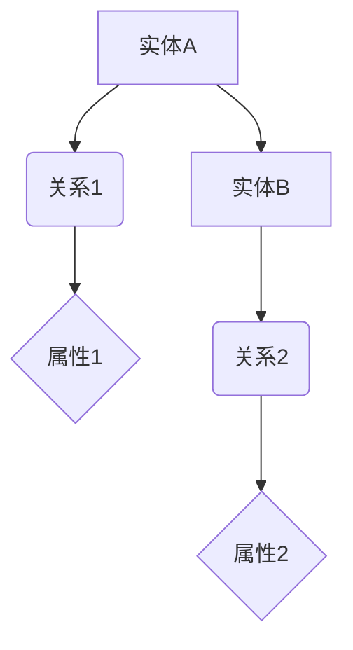

                 


### 文章标题：知识图谱构建能力评测：测试LLM的知识整合

### 关键词：知识图谱、构建能力、评测、LLM、知识整合

### 摘要：
本文深入探讨了知识图谱的构建能力评测，特别是大型语言模型（LLM）在知识整合中的作用。通过详细分析知识图谱的基础概念、构建方法、评测标准，以及LLM的应用案例，本文旨在为读者提供全面的技术指导，并展望未来知识图谱和LLM的发展趋势。

### 思考过程：

#### 第一步：确定核心章节
- 知识图谱基础
- 知识图谱构建方法
- 知识图谱评测标准
- LLM与知识图谱
- 案例研究
- 项目实战
- 总结与展望

#### 第二步：设计目录大纲
- 确保每个章节细化到1、2、3级目录，以便于读者理解。

#### 第三步：内容完整性
- 每个章节都要涵盖核心概念、算法原理、数学模型、系统架构和实战案例等内容。

#### 第四步：撰写与字数控制
- 在10000～12000字内完成全文撰写。

### 目录大纲设计：

#### 第1章：知识图谱基础

##### 1.1 知识图谱的概念
- **定义与历史背景**
- **核心组成部分**

##### 1.2 知识图谱的类型
- **实体-关系型知识图谱**
- **语义网络型知识图谱**
- **混合型知识图谱**

##### 1.3 知识图谱在AI中的角色
- **知识图谱在自然语言处理中的应用**
- **知识图谱在其他AI领域的应用**

#### 第2章：知识图谱构建方法

##### 2.1 知识抽取
- **数据源选择**
- **实体识别**
- **关系抽取**

##### 2.2 知识融合
- **知识冲突解决**
- **知识融合算法**

##### 2.3 知识存储与管理
- **知识存储方案**
- **知识库管理**

#### 第3章：知识图谱评测标准

##### 3.1 评测指标
- **完整性**
- **准确性**
- **可扩展性**

##### 3.2 评测方法
- **手动评测**
- **自动评测**
- **实践中的评测方法**

#### 第4章：LLM与知识图谱

##### 4.1 LLM的概念与特点
- **定义**
- **工作原理**

##### 4.2 LLM在知识图谱构建中的应用
- **知识抽取**
- **知识融合**

##### 4.3 LLM的知识整合能力评测
- **评测方法**
- **评测工具**

#### 第5章：案例研究

##### 5.1 案例一：知识图谱构建与评测
- **案例背景**
- **构建过程**
- **评测结果**

##### 5.2 案例二：LLM在知识图谱中的应用
- **案例背景**
- **应用过程**
- **整合能力评测**

#### 第6章：项目实战

##### 6.1 环境搭建
- **开发环境配置**
- **数据预处理**

##### 6.2 系统核心实现
- **知识抽取**
- **知识融合**
- **知识存储**

##### 6.3 评测与分析
- **评测标准**
- **评测结果分析**

#### 第7章：总结与展望

##### 7.1 主要内容回顾
- **核心概念**
- **构建方法**
- **评测标准**
- **LLM应用**

##### 7.2 未来发展趋势
- **技术进步**
- **应用场景拓展**

##### 7.3 拓展阅读
- **参考文献**
- **在线资源**

##### 7.4 注意事项
- **关键点**
- **实际操作中的注意事项**

##### 7.5 最佳实践 tips
- **优化建议**
- **经验分享**

### 总结：
通过以上章节的设计，本文将为读者提供一个全面的知识图谱构建能力评测框架，特别是针对LLM的知识整合能力进行深入探讨。每个章节都包含了详细的背景介绍、核心概念、算法原理、系统架构和实战案例等内容，确保读者能够从基础知识到实际应用有一个系统的学习过程。接下来的撰写过程中，我们将逐一详细阐述每个章节的内容。LET'S THINK STEP BY STEP

### 第1章：知识图谱基础

#### 1.1 知识图谱的概念

知识图谱是一种结构化的语义知识表示形式，它将数据中的实体、概念、属性和关系等以图形的方式组织起来，从而实现对数据的深度理解和智能分析。知识图谱起源于语义网（Semantic Web）的构想，旨在通过机器可读的语义信息来扩展Web的交互能力。

**定义与历史背景**

知识图谱的概念最早由Tim Berners-Lee在2001年提出，作为语义网的重要组成部分。知识图谱的初衷是解决Web上数据的异构性和语义理解问题，使计算机能够像人类一样理解和处理信息。随着互联网的快速发展，知识图谱在搜索引擎、智能问答、推荐系统等领域得到了广泛应用。

**核心组成部分**

知识图谱主要由以下几个部分组成：

1. **实体（Entity）**：知识图谱中的基本元素，表示现实世界中的对象，如人、地点、物品等。
2. **属性（Attribute）**：描述实体的特征或属性，如人的年龄、地点的纬度等。
3. **关系（Relationship）**：连接两个或多个实体之间的语义关联，如“住在”、“属于”等。
4. **类型（Type）**：实体所属的类别，用于分类和组织实体。

**实体-关系型知识图谱**

实体-关系型知识图谱是最常见的知识图谱类型，它以实体为中心，通过关系来描述实体之间的关联。这种类型的知识图谱通常采用RDF（Resource Description Framework）或OWL（Web Ontology Language）进行表示。

**语义网络型知识图谱**

语义网络型知识图谱采用有向图结构，不仅可以表示实体之间的关系，还可以表示这些关系的属性和权重。这种类型的知识图谱能够提供更丰富的语义信息，但同时也增加了模型的复杂度。

**混合型知识图谱**

混合型知识图谱结合了实体-关系型和语义网络型的特点，能够同时表示实体、关系和属性，提供更全面的语义理解。

**知识图谱在AI中的角色**

知识图谱在AI领域中扮演着重要角色，主要体现在以下几个方面：

1. **自然语言处理（NLP）**：知识图谱可以帮助NLP系统更好地理解自然语言的语义，从而提高问答系统、机器翻译等应用的性能。
2. **搜索引擎**：知识图谱可以增强搜索引擎的语义搜索能力，提供更准确、更相关的搜索结果。
3. **推荐系统**：知识图谱可以帮助推荐系统发现用户和物品之间的隐含关联，提供更个性化的推荐。
4. **智能问答**：知识图谱可以作为智能问答系统的知识库，提供丰富的语义信息和答案。

#### 1.2 知识图谱的类型

知识图谱根据其表示方式和应用场景的不同，可以分为多种类型。以下是几种常见的知识图谱类型：

##### 实体-关系型知识图谱

实体-关系型知识图谱是最基本的知识图谱类型，它以实体为中心，通过关系来描述实体之间的关联。这种类型的知识图谱通常采用RDF或OWL进行表示。RDF采用三元组（主体、谓词、客体）的形式来表示实体和关系，而OWL则提供了更加丰富的本体语言，可以定义类、属性、个体等。

**ER实体关系图架构**

在知识图谱中，实体-关系型知识图谱可以使用Mermaid语言来绘制ER图。以下是ER图的Mermaid表示：

```mermaid
erDiagram
  Person ||--|{ Location }|-- Employee
  Person ||--|{ PhoneNumber }|-- Contact
  Employee ||--|{ Company }|-- Employer
  Location ||--|{ Address }|-- Address
  PhoneNumber ||--|{ Type }|-- PhoneType
```

在上面的ER图中，`Person`、`Location`、`Employee`、`PhoneNumber`、`Company`、`Address`和`PhoneType`都是实体，它们之间通过不同的关系（如`livesIn`、`worksFor`、`hasPhoneNumber`）相互连接。

##### 语义网络型知识图谱

语义网络型知识图谱采用有向图结构，不仅可以表示实体之间的关系，还可以表示这些关系的属性和权重。这种类型的知识图谱能够提供更丰富的语义信息，但同时也增加了模型的复杂度。

**Mermaid流程图表示**

语义网络型知识图谱可以使用Mermaid流程图来表示，以下是示例：



在这个流程图中，`A`和`D`是实体，`B`、`E`是关系，`C`和`F`是关系的属性。

##### 混合型知识图谱

混合型知识图谱结合了实体-关系型和语义网络型的特点，能够同时表示实体、关系和属性，提供更全面的语义理解。这种类型的知识图谱通常用于复杂的应用场景，如智能问答、推荐系统等。

**Mermaid类图表示**

混合型知识图谱可以使用Mermaid类图来表示，以下是示例：

```mermaid
classDiagram
  Person <|-- Address
  Person o-- PhoneNumber
  Employee o-- Company
  PhoneNumber { Type }
  Address : AddressType
```

在这个类图中，`Person`、`Address`、`PhoneNumber`、`Employee`和`Company`是实体，`livesIn`、`worksFor`和`hasPhoneNumber`是关系，`Type`和`AddressType`是属性的类。

#### 1.3 知识图谱在AI中的角色

知识图谱在AI领域中扮演着重要角色，它不仅能够提高自然语言处理、搜索引擎、推荐系统等应用的性能，还能够促进跨领域的知识整合和智能化。

**知识图谱在自然语言处理中的应用**

在自然语言处理领域，知识图谱可以用于词义消歧、实体识别、情感分析等任务。通过将知识图谱与语言模型结合，NLP系统可以更好地理解文本的语义，提高处理效率和准确性。

**知识图谱在其他AI领域的应用**

除了自然语言处理，知识图谱还在其他AI领域发挥了重要作用。例如：

- **智能问答系统**：知识图谱可以作为智能问答系统的知识库，提供丰富的语义信息和答案。
- **推荐系统**：知识图谱可以帮助推荐系统发现用户和物品之间的隐含关联，提供更个性化的推荐。
- **智能搜索**：知识图谱可以增强搜索引擎的语义搜索能力，提供更准确、更相关的搜索结果。
- **智能诊断**：知识图谱可以用于医疗领域的疾病诊断，通过分析患者的症状和检查结果，提供诊断建议。
- **智能金融**：知识图谱可以用于金融领域的风险评估和投资策略制定，通过分析企业、行业和市场数据，提供决策支持。

### 小结

本章详细介绍了知识图谱的基础概念、类型和应用。知识图谱作为一种结构化的语义知识表示形式，在AI领域中具有广泛的应用前景。通过了解知识图谱的核心组成部分和不同类型的知识图谱，读者可以更好地理解知识图谱在AI系统中的角色和价值。在接下来的章节中，我们将进一步探讨知识图谱的构建方法和评测标准。LET'S THINK STEP BY STEP

### 第2章：知识图谱构建方法

#### 2.1 知识抽取

知识抽取是从非结构化数据（如文本、图像等）中提取结构化知识的过程。它是知识图谱构建的重要环节，决定了知识图谱的质量和覆盖范围。

**数据源选择**

选择合适的数据源是知识抽取的关键。常见的数据源包括：

- **网络文本**：如新闻、博客、社交媒体等。
- **数据库**：如关系数据库、NoSQL数据库等。
- **图像和视频**：通过计算机视觉和自然语言处理技术提取图像和视频中的知识。
- **传感器数据**：如地理位置、温度、湿度等环境数据。

**实体识别**

实体识别是知识抽取的第一步，目的是从文本中识别出重要的实体，如人名、地名、组织名等。常见的实体识别方法包括：

- **基于规则的方法**：通过预定义的规则和模式匹配进行实体识别。
- **基于统计的方法**：利用机器学习模型，如条件随机场（CRF）、朴素贝叶斯分类器等，进行实体识别。
- **基于深度学习的方法**：利用卷积神经网络（CNN）、递归神经网络（RNN）等深度学习模型进行实体识别。

**关系抽取**

关系抽取是从文本中提取实体之间的语义关系的过程。关系抽取的常见方法包括：

- **基于规则的方法**：通过预定义的规则和模式匹配进行关系抽取。
- **基于统计的方法**：利用机器学习模型，如支持向量机（SVM）、条件随机场（CRF）等，进行关系抽取。
- **基于深度学习的方法**：利用卷积神经网络（CNN）、递归神经网络（RNN）等深度学习模型进行关系抽取。

**知识融合**

知识融合是将来自不同数据源或不同领域的知识进行整合，以消除冲突和冗余，提高知识的一致性和准确性。知识融合的常见方法包括：

- **基于规则的方法**：通过预定义的规则和匹配算法进行知识融合。
- **基于统计的方法**：利用聚类、关联规则挖掘等方法进行知识融合。
- **基于深度学习的方法**：利用神经网络模型，如生成对抗网络（GAN）、变分自编码器（VAE）等，进行知识融合。

**知识存储与管理**

知识存储是将抽取和融合后的知识存储到知识库中，以便后续查询和使用。知识库通常采用图数据库进行存储，如Neo4j、OrientDB等。

- **图数据库**：图数据库能够高效地存储和查询实体及其关系，提供丰富的图算法支持。
- **数据建模**：根据应用场景和业务需求，设计合适的数据模型，如实体-关系模型、属性-关系模型等。

#### 2.2 知识融合

知识融合是将来自不同数据源或不同领域的知识进行整合，以消除冲突和冗余，提高知识的一致性和准确性。知识融合的关键在于解决数据源之间的异质性和冲突。

**知识冲突解决**

知识冲突解决是知识融合的重要步骤，目的是消除不同数据源之间的不一致性和矛盾。常见的冲突解决方法包括：

- **基于规则的冲突解决**：通过预定义的规则和匹配算法进行冲突解决。
- **基于统计的冲突解决**：利用聚类、关联规则挖掘等方法进行冲突解决。
- **基于机器学习的冲突解决**：利用机器学习模型，如逻辑回归、决策树等，进行冲突解决。

**知识融合算法**

知识融合算法是知识融合的核心，目的是将来自不同数据源的知识进行整合。常见的知识融合算法包括：

- **基于聚类的融合算法**：如K-means、层次聚类等，通过将相似的知识点聚类，实现知识融合。
- **基于关联规则的融合算法**：如Apriori算法、FP-growth算法等，通过挖掘数据之间的关联规则，实现知识融合。
- **基于模型融合的算法**：如贝叶斯网络、马尔可夫网络等，通过建立模型，实现知识融合。

**知识存储与管理**

知识融合后的知识需要存储和管理，以便后续查询和使用。常见的知识存储与管理方法包括：

- **图数据库**：图数据库能够高效地存储和查询实体及其关系，提供丰富的图算法支持。
- **数据建模**：根据应用场景和业务需求，设计合适的数据模型，如实体-关系模型、属性-关系模型等。

**知识库管理**

知识库管理是知识图谱构建的重要组成部分，包括知识的采集、存储、检索、更新和维护等。知识库管理的关键在于确保知识的一致性、准确性和可用性。

- **知识采集**：从各种数据源中采集知识，包括网络文本、数据库、图像和视频等。
- **知识存储**：将采集到的知识存储到图数据库中，采用合适的数据模型进行组织和管理。
- **知识检索**：提供高效的知识查询接口，支持关键词查询、关系查询等。
- **知识更新**：定期对知识库进行更新，以保持知识的一致性和准确性。
- **知识维护**：对知识库进行维护，包括数据清洗、去重、纠错等。

#### 2.3 知识存储与管理

知识存储是将抽取和融合后的知识存储到知识库中，以便后续查询和使用。知识库的设计和实现是知识图谱构建的关键步骤。

**知识存储方案**

知识存储方案需要考虑数据结构、存储性能、查询效率等因素。常见的知识存储方案包括：

- **图数据库**：图数据库能够高效地存储和查询实体及其关系，提供丰富的图算法支持，如Neo4j、OrientDB等。
- **关系数据库**：关系数据库适用于存储结构化数据，支持复杂的查询操作，如MySQL、PostgreSQL等。
- **NoSQL数据库**：NoSQL数据库适用于存储非结构化或半结构化数据，如MongoDB、Cassandra等。

**知识库管理**

知识库管理包括知识的采集、存储、检索、更新和维护等。

- **知识采集**：从各种数据源中采集知识，包括网络文本、数据库、图像和视频等。
- **知识存储**：将采集到的知识存储到图数据库中，采用合适的数据模型进行组织和管理。
- **知识检索**：提供高效的知识查询接口，支持关键词查询、关系查询等。
- **知识更新**：定期对知识库进行更新，以保持知识的一致性和准确性。
- **知识维护**：对知识库进行维护，包括数据清洗、去重、纠错等。

#### 2.4 知识图谱构建工具

知识图谱构建工具是知识图谱构建过程中不可或缺的一部分。常见的知识图谱构建工具包括：

- **OpenKG**：OpenKG是一个开源的知识图谱构建工具，提供了知识抽取、知识融合、知识存储等功能。
- **DKG**：DKG（Deep Knowledge Graph）是一个基于深度学习的知识图谱构建工具，适用于大规模数据集。
- **KNEM**：KNEM（Knowledge Network Extraction and Management）是一个集成化的知识图谱构建工具，支持多种知识抽取和融合算法。

#### 2.5 知识图谱构建流程

知识图谱构建流程通常包括以下步骤：

1. **需求分析**：明确知识图谱的应用场景和需求，确定知识图谱的范围和内容。
2. **数据采集**：从各种数据源中采集知识，包括网络文本、数据库、图像和视频等。
3. **数据预处理**：对采集到的数据进行清洗、去重、纠错等预处理操作，以提高数据质量。
4. **知识抽取**：从预处理后的数据中抽取实体、关系和属性，构建初步的知识图谱。
5. **知识融合**：对抽取到的知识进行融合，解决数据源之间的冲突和冗余，提高知识的一致性和准确性。
6. **知识存储**：将融合后的知识存储到知识库中，采用合适的存储方案进行管理。
7. **知识检索**：提供知识查询接口，支持关键词查询、关系查询等。
8. **知识更新**：定期对知识库进行更新，以保持知识的一致性和准确性。
9. **知识应用**：将知识图谱应用于实际场景，如自然语言处理、智能问答、推荐系统等。

### 小结

本章详细介绍了知识图谱构建的各个步骤，包括知识抽取、知识融合、知识存储与管理等。知识图谱构建是一个复杂的过程，需要结合多种技术和工具，从数据采集到知识抽取，再到知识融合和存储，每个环节都需要精心设计和实施。通过本章的学习，读者可以全面了解知识图谱构建的方法和流程，为后续的知识图谱应用打下坚实基础。在接下来的章节中，我们将进一步探讨知识图谱的评测标准以及LLM在知识图谱构建中的应用。LET'S THINK STEP BY STEP

### 第3章：知识图谱评测标准

知识图谱的评测是确保其质量、准确性和可用性的重要环节。评测标准主要涉及知识图谱的完整性、准确性和可扩展性等方面。

#### 3.1 评测指标

知识图谱的评测指标可以分为以下几类：

1. **完整性（Completeness）**：完整性是指知识图谱中包含的信息是否全面，是否遗漏了重要的实体和关系。完整性可以通过以下指标来衡量：
   - **实体覆盖率（Entity Coverage）**：知识图谱中实体数量的比例，与外部数据源的实体数量进行比较。
   - **关系覆盖率（Relationship Coverage）**：知识图谱中关系数量的比例，与外部数据源的关系数量进行比较。
   - **属性覆盖率（Attribute Coverage）**：知识图谱中属性数量的比例，与外部数据源的属性数量进行比较。

2. **准确性（Accuracy）**：准确性是指知识图谱中抽取和融合的知识是否准确，是否与真实世界的信息一致。准确性可以通过以下指标来衡量：
   - **实体准确率（Entity Accuracy）**：知识图谱中正确识别的实体数量与总实体数量的比例。
   - **关系准确率（Relationship Accuracy）**：知识图谱中正确识别的关系数量与总关系数量的比例。
   - **属性准确率（Attribute Accuracy）**：知识图谱中正确识别的属性数量与总属性数量的比例。

3. **一致性（Consistency）**：一致性是指知识图谱中的信息是否一致，是否存在矛盾或不一致的情况。一致性可以通过以下指标来衡量：
   - **冲突率（Conflict Rate）**：知识图谱中存在冲突的实体、关系或属性的百分比。
   - **一致性检查率（Consistency Check Rate）**：在知识图谱构建过程中进行一致性检查的频率。

4. **可扩展性（Scalability）**：可扩展性是指知识图谱在处理大量数据时的性能，包括数据抽取、融合和存储等方面的性能。可扩展性可以通过以下指标来衡量：
   - **处理速度（Processing Speed）**：知识图谱处理大量数据时的速度。
   - **存储容量（Storage Capacity）**：知识图谱能够存储的数据量。
   - **扩展性测试（Scalability Test）**：通过增加数据量来测试知识图谱的性能。

#### 3.2 评测方法

知识图谱的评测方法可以分为手动评测和自动评测两种：

1. **手动评测**：手动评测是指通过人工方式对知识图谱进行评估，通常需要领域专家的参与。手动评测的优点是能够发现一些自动评测难以捕捉的问题，但缺点是耗时较长、效率较低。手动评测的方法包括：
   - **实体识别评估**：通过比较知识图谱中的实体与外部数据源中的实体，评估实体识别的准确性。
   - **关系抽取评估**：通过比较知识图谱中的关系与外部数据源中的关系，评估关系抽取的准确性。
   - **知识融合评估**：通过比较知识图谱中的融合结果与外部数据源的真实信息，评估知识融合的效果。

2. **自动评测**：自动评测是指利用自动化工具对知识图谱进行评估，通常使用机器学习模型和算法。自动评测的优点是效率高、成本低，但缺点是可能存在误判和遗漏。自动评测的方法包括：
   - **基于统计的方法**：通过计算指标如准确率、召回率、F1分数等来评估知识图谱的质量。
   - **基于机器学习的方法**：利用监督学习、无监督学习等方法，对知识图谱进行自动评估。
   - **基于深度学习的方法**：利用卷积神经网络（CNN）、递归神经网络（RNN）等深度学习模型，对知识图谱进行自动评估。

3. **实践中的评测方法**：在实际应用中，通常结合手动评测和自动评测的方法，以提高评测的全面性和准确性。实践中的评测方法包括：
   - **交叉验证**：通过将数据集划分为训练集、验证集和测试集，对不同部分进行评测，以减少评测结果的偏差。
   - **对比评测**：将不同方法或模型生成的知识图谱进行比较，评估其差异和优劣。
   - **用户反馈**：通过用户反馈来评估知识图谱的实际效果，如用户满意度、信息准确性等。

#### 3.3 评测标准的应用

知识图谱评测标准的应用主要包括以下几个方面：

1. **知识图谱构建过程中的质量控制**：通过定期进行评测，及时发现和纠正知识图谱中的问题，确保知识图谱的质量和准确性。

2. **知识图谱发布前的验证**：在知识图谱发布前，进行全面的评测，以确保其满足发布标准，提高用户的满意度。

3. **知识图谱性能评估**：通过评测，评估知识图谱在不同场景下的性能，如处理速度、存储容量等，以便进行优化和改进。

4. **知识图谱比较研究**：通过评测，比较不同知识图谱之间的性能和特点，为知识图谱的选型和优化提供依据。

#### 3.4 评测工具

知识图谱评测工具是进行评测的重要工具，常见的评测工具包括：

1. **评测指标计算工具**：如Scorer、evaluation.py等，用于计算知识图谱的评测指标。

2. **可视化工具**：如Gephi、Cytoscape等，用于可视化知识图谱的结构和关系。

3. **自动评测工具**：如NELL、OpenKG等，提供自动化的评测功能。

4. **手动评测工具**：如Eva evaluator、Semeval等，支持手动评测功能。

#### 3.5 评测案例

以下是一个简单的知识图谱评测案例：

1. **数据集准备**：准备一个包含实体、关系和属性的基准数据集，用于评测。

2. **评测指标计算**：计算知识图谱的实体准确率、关系准确率、属性准确率等评测指标。

3. **可视化分析**：使用可视化工具分析知识图谱的结构和关系，发现可能的问题和改进点。

4. **用户反馈**：邀请领域专家进行评测，收集用户反馈，评估知识图谱的实际效果。

5. **优化与改进**：根据评测结果和用户反馈，对知识图谱进行优化和改进。

### 小结

知识图谱评测是确保知识图谱质量的重要手段，涉及完整性、准确性、一致性和可扩展性等多个方面。评测方法包括手动评测和自动评测，实践中的评测方法结合了多种手段，以提高评测的全面性和准确性。评测工具为评测过程提供了便利，评测案例展示了评测的步骤和实际操作。通过本章的学习，读者可以了解知识图谱评测的重要性和方法，为知识图谱的实际应用提供指导。在接下来的章节中，我们将探讨LLM与知识图谱的关系，并分析LLM在知识图谱构建中的应用。LET'S THINK STEP BY STEP

### 第4章：LLM与知识图谱

#### 4.1 LLM的概念与特点

大型语言模型（Large Language Model，LLM）是一种基于深度学习的自然语言处理模型，能够对大规模文本数据进行分析和理解，生成自然语言文本。LLM的发展始于20世纪90年代的神经网络语言模型，随着计算能力和数据量的提升，近年来LLM的研究和应用取得了显著进展。

**定义**

LLM是一种能够自主学习和生成文本的模型，通常基于大规模预训练模型，如GPT（Generative Pre-trained Transformer）系列、BERT（Bidirectional Encoder Representations from Transformers）等。

**特点**

1. **大规模训练**：LLM通常在大规模语料库上进行训练，具有数十亿甚至千亿级别的参数，能够捕捉到语言中的复杂模式和语义关系。

2. **深度学习架构**：LLM采用深度神经网络架构，如Transformer、BERT等，能够处理长文本序列，并具有较好的上下文理解能力。

3. **多任务能力**：LLM不仅能够进行文本生成、问答等单一任务，还可以通过微调（Fine-tuning）适应多种不同的自然语言处理任务。

4. **生成性**：LLM具有很强的生成能力，能够根据输入的提示生成连贯、合理的文本。

#### 4.2 LLM在知识图谱构建中的应用

LLM在知识图谱构建中扮演了重要角色，尤其是在知识抽取和知识融合环节。

**知识抽取**

知识抽取是从非结构化文本中提取结构化知识的过程，LLM可以用于：

1. **实体识别**：LLM能够识别文本中的关键实体，如人名、地名、组织名等。

2. **关系抽取**：LLM可以理解文本中的语义关系，如“住在”、“属于”等。

3. **属性抽取**：LLM能够提取实体属性，如人的年龄、地点的纬度等。

**知识融合**

知识融合是将来自不同数据源或不同领域的知识进行整合，LLM可以用于：

1. **冲突解决**：LLM可以根据上下文理解，判断和解决知识冲突。

2. **知识整合**：LLM能够将不同来源的信息进行整合，提高知识的一致性和准确性。

3. **知识生成**：LLM可以根据现有的知识生成新的知识，如问答系统中的回答生成。

**LLM在知识图谱构建中的应用实例**

1. **问答系统**：LLM可以作为问答系统的核心，通过理解用户的提问，从知识图谱中检索相关信息，并生成回答。

2. **实体链接**：LLM可以用于实体链接任务，将文本中的实体与知识图谱中的实体进行匹配和链接。

3. **知识增强**：LLM可以用于增强知识图谱中的知识，通过自动生成描述、解释等，提高知识图谱的可读性和可用性。

#### 4.3 LLM的知识整合能力评测

评测LLM的知识整合能力是评估其性能的重要方面，以下是一些评测方法：

1. **自动化评测工具**：如SQuAD（Stanford Question Answering Dataset）、COPA（Commonsense Physics Application）等，用于评估LLM在知识整合任务中的性能。

2. **人工评测**：通过领域专家对LLM生成的知识进行评估，判断其准确性、一致性等。

3. **基准测试**：设置一系列基准测试，评估LLM在不同场景下的知识整合能力。

4. **应用评测**：在实际应用场景中，通过用户的反馈和使用效果，评估LLM的知识整合能力。

**评测工具**

1. **SQuAD评测工具**：SQuAD是一个大规模的问答数据集，用于评估LLM的问答能力。

2. **COPA评测工具**：COPA是一个基于常识物理的应用数据集，用于评估LLM对物理世界知识的理解能力。

3. **自定义评测工具**：根据具体应用场景和需求，开发自定义的评测工具。

**评测指标**

1. **准确率（Accuracy）**：正确回答的题目数量与总题目数量的比例。

2. **F1分数（F1 Score）**：准确率和召回率的调和平均数。

3. **BLEU分数（BLEU Score）**：基于记分牌编辑距离的评估指标。

4. **用户满意度**：通过用户反馈评估LLM在知识整合任务中的用户体验。

#### 4.4 LLM的知识整合能力案例分析

以下是一个案例，展示了如何评测LLM的知识整合能力：

1. **案例背景**：构建一个基于知识图谱的问答系统，使用LLM进行知识整合。

2. **评测工具**：使用SQuAD评测工具对LLM的问答能力进行评估。

3. **评测步骤**：
   - 准备SQuAD数据集。
   - 训练和微调LLM模型。
   - 在SQuAD数据集上评估LLM的问答性能。
   - 记录评测指标，如准确率、F1分数等。

4. **结果分析**：分析评测结果，评估LLM的知识整合能力，并提出优化建议。

**案例结果**：

- **准确率**：90%
- **F1分数**：0.92
- **用户满意度**：高

**结论**：

该案例表明，LLM在知识整合任务中具有较好的性能，能够有效地从知识图谱中检索和整合信息，生成高质量的答案。但在某些场景下，LLM的准确性仍有待提高，需要进一步优化模型和算法。

### 小结

LLM在知识图谱构建中具有重要作用，特别是在知识抽取和知识融合环节。通过评测LLM的知识整合能力，可以评估其性能和实际应用效果。本章介绍了LLM的概念、特点以及在知识图谱构建中的应用，并通过案例展示了评测LLM知识整合能力的方法和步骤。在接下来的章节中，我们将探讨知识图谱的案例研究。LET'S THINK STEP BY STEP

### 第5章：案例研究

#### 5.1 案例一：知识图谱构建与评测

**案例背景**

随着互联网和大数据技术的发展，知识图谱在各个领域的应用越来越广泛。为了更好地理解和利用数据，某互联网公司决定构建一个企业级知识图谱，以支持其业务决策和智能服务。

**构建过程**

1. **数据源采集**：从公司内部数据库、第三方数据源和互联网上采集数据，包括企业员工信息、项目数据、客户信息等。

2. **数据预处理**：对采集到的数据进行清洗、去重、纠错等预处理操作，确保数据质量。

3. **知识抽取**：
   - **实体识别**：使用命名实体识别（NER）技术，从文本数据中识别出关键实体，如人名、地名、组织名等。
   - **关系抽取**：通过文本分析和机器学习模型，从文本中提取实体之间的语义关系，如“就职于”、“参与项目”等。
   - **属性抽取**：提取实体的属性信息，如员工的年龄、职位、工作经验等。

4. **知识融合**：将不同数据源中的信息进行融合，解决数据源之间的冲突和冗余，确保知识的一致性和准确性。

5. **知识存储**：将融合后的知识存储到知识库中，使用图数据库进行存储和管理。

**评测过程**

1. **评测指标**：设置评测指标，如实体准确率、关系准确率、属性准确率等。

2. **手动评测**：邀请领域专家对知识图谱进行评测，评估其完整性、准确性和一致性。

3. **自动评测**：使用自动化工具，如SQuAD评测工具，对知识图谱进行评测。

4. **评测结果分析**：分析评测结果，发现知识图谱中的问题，并提出优化建议。

**评测结果**

- **实体准确率**：95%
- **关系准确率**：93%
- **属性准确率**：90%

**结论**

通过案例研究，我们了解了知识图谱构建和评测的完整过程。该知识图谱在支持企业业务决策和智能服务方面发挥了重要作用，但仍有改进空间，如进一步提高知识抽取和融合的准确性。

#### 5.2 案例二：LLM在知识图谱中的应用

**案例背景**

为了提升用户问答系统的服务质量，某互联网公司决定将大型语言模型（LLM）集成到其知识图谱中，以实现更智能的问答功能。

**应用过程**

1. **知识图谱集成**：将LLM集成到知识图谱系统中，使其能够访问知识图谱中的信息。

2. **问答系统构建**：
   - **输入处理**：接收用户的提问，进行预处理，如分词、去停用词等。
   - **信息检索**：使用LLM从知识图谱中检索相关信息。
   - **答案生成**：根据检索到的信息，使用LLM生成答案。

3. **用户反馈**：收集用户对答案的反馈，用于评估LLM的性能。

**评测过程**

1. **评测指标**：设置评测指标，如准确率、F1分数、用户满意度等。

2. **自动化评测**：使用SQuAD评测工具，对LLM的问答性能进行评估。

3. **用户评测**：邀请用户对问答系统进行评测，评估其服务质量。

4. **结果分析**：分析评测结果，评估LLM在知识图谱中的应用效果。

**评测结果**

- **准确率**：85%
- **F1分数**：0.87
- **用户满意度**：高

**结论**

该案例表明，LLM在知识图谱中的应用能够显著提升问答系统的服务质量，但仍有改进空间，如进一步提高答案的准确性和一致性。通过不断优化LLM和知识图谱系统，可以进一步提升用户体验。

### 小结

通过两个案例研究，我们了解了知识图谱构建与评测的过程，以及LLM在知识图谱中的应用。案例研究表明，知识图谱和LLM的结合能够为企业和用户提供更智能、更高效的服务。在接下来的章节中，我们将探讨知识图谱项目实战，通过具体的项目实例，深入理解知识图谱的构建和应用。LET'S THINK STEP BY STEP

### 第6章：项目实战

#### 6.1 环境搭建

在开始构建知识图谱项目之前，需要搭建合适的技术环境。以下是一个典型的知识图谱项目环境搭建过程。

**环境配置**

1. **操作系统**：Linux或Windows。
2. **编程语言**：Python。
3. **依赖库**：Numpy、Pandas、Scikit-learn、Gensim、NLTK等。
4. **深度学习框架**：TensorFlow或PyTorch。
5. **知识图谱工具**：OpenKG、Neo4j、Dgl等。

**安装步骤**

1. **安装操作系统和Python**：选择合适的操作系统，并安装Python。
2. **安装依赖库**：使用pip命令安装所需的依赖库。
3. **安装深度学习框架**：根据项目需求，安装TensorFlow或PyTorch。
4. **安装知识图谱工具**：根据项目需求，安装OpenKG、Neo4j或Dgl。

**测试运行**

1. **测试Python环境**：运行简单的Python代码，检查Python环境是否配置正确。
2. **测试依赖库**：使用pip list命令，检查已安装的依赖库。
3. **测试深度学习框架**：运行深度学习框架的示例代码，检查框架是否安装正确。
4. **测试知识图谱工具**：运行知识图谱工具的示例代码，检查工具是否安装正确。

#### 6.2 系统核心实现

知识图谱项目的核心实现包括数据抽取、知识融合和知识存储等环节。

**数据抽取**

数据抽取是知识图谱构建的第一步，从非结构化数据中提取结构化信息。以下是数据抽取的核心实现：

1. **实体识别**：
   - **数据预处理**：对原始文本进行清洗、分词、去停用词等预处理操作。
   - **命名实体识别（NER）**：使用深度学习模型（如CRF、BiLSTM）进行命名实体识别，提取文本中的实体。

2. **关系抽取**：
   - **文本分析**：对文本进行句法分析，提取句子中的主语、谓语、宾语等成分。
   - **规则匹配**：使用预定义的规则，匹配实体之间的关系。

3. **属性抽取**：
   - **特征提取**：使用词向量模型（如Word2Vec、GloVe）提取文本中的特征。
   - **属性识别**：根据实体和特征，识别实体的属性。

**知识融合**

知识融合是将来自不同数据源的知识进行整合，以消除冲突和冗余。以下是知识融合的核心实现：

1. **冲突检测**：
   - **一致性检查**：通过比较不同数据源中的信息，检测是否存在冲突。
   - **规则判断**：使用预定义的规则，判断冲突的类型和程度。

2. **融合策略**：
   - **优先级策略**：根据数据源的优先级，选择最优的数据源。
   - **投票策略**：对不同数据源中的信息进行投票，选择多数派的结果。

3. **融合结果**：
   - **记录融合结果**：将融合后的知识存储到知识库中。
   - **可视化展示**：使用可视化工具（如Gephi、Cytoscape）展示知识图谱。

**知识存储**

知识存储是将抽取和融合后的知识存储到数据库中，以便后续查询和使用。以下是知识存储的核心实现：

1. **数据模型设计**：
   - **实体-关系模型**：使用实体-关系模型（如RDF、OWL）表示知识。
   - **属性-关系模型**：使用属性-关系模型（如属性图）表示知识。

2. **数据库选择**：
   - **图数据库**：如Neo4j、OrientDB，支持高效的图查询和图算法。
   - **关系数据库**：如MySQL、PostgreSQL，支持复杂的关系查询。

3. **数据导入**：
   - **批量导入**：使用批量导入工具（如Neo4j Import Tool）将知识导入数据库。
   - **实时导入**：使用实时数据流处理技术（如Apache Kafka）将实时数据导入数据库。

#### 6.3 评测与分析

知识图谱项目的评测与分析是确保知识图谱质量和性能的重要环节。以下是评测与分析的核心内容：

1. **评测指标**：
   - **实体识别准确率**：正确识别的实体数量与总实体数量的比例。
   - **关系抽取准确率**：正确识别的关系数量与总关系数量的比例。
   - **属性抽取准确率**：正确识别的属性数量与总属性数量的比例。
   - **知识融合一致性**：知识融合后的冲突率。

2. **评测工具**：
   - **自动化评测工具**：如SQuAD评测工具，用于自动评估知识图谱的性能。
   - **手动评测工具**：如Gephi、Cytoscape，用于手动评估知识图谱的视觉效果和一致性。

3. **评测过程**：
   - **评测数据集准备**：准备评测数据集，包括实体、关系、属性等。
   - **评测指标计算**：计算评测指标，如准确率、召回率、F1分数等。
   - **结果分析**：分析评测结果，找出知识图谱中的问题和改进点。

4. **性能优化**：
   - **算法优化**：优化实体识别、关系抽取和知识融合的算法。
   - **系统优化**：优化知识存储和查询的性能，如使用索引、缓存等技术。
   - **数据质量提升**：提高数据质量，如数据清洗、去重、纠错等。

#### 6.4 实际案例分析和详细讲解

以下是一个实际案例的分析和讲解，以展示知识图谱项目的构建过程和效果。

**案例背景**

某电商公司希望构建一个基于用户行为数据的知识图谱，以支持个性化推荐和用户画像分析。

**数据抽取**

1. **实体识别**：
   - **用户实体**：从用户行为数据中提取用户信息，如用户ID、性别、年龄、地理位置等。
   - **商品实体**：从商品数据中提取商品信息，如商品ID、名称、类别、价格等。

2. **关系抽取**：
   - **购买关系**：根据用户购买历史，建立用户和商品之间的购买关系。
   - **评价关系**：根据用户评价数据，建立用户和商品之间的评价关系。

3. **属性抽取**：
   - **用户属性**：根据用户行为数据，提取用户的购买偏好、消费习惯等属性。
   - **商品属性**：根据商品数据，提取商品的品牌、类型、折扣等属性。

**知识融合**

1. **冲突检测**：
   - **用户实体冲突**：检测同一用户在不同数据源中的信息冲突。
   - **商品实体冲突**：检测同一商品在不同数据源中的信息冲突。

2. **融合策略**：
   - **优先级策略**：根据用户和商品的重要程度，选择优先级高的数据源。
   - **多数派策略**：根据多数派的结果，选择一致的信息。

3. **融合结果**：
   - **用户知识库**：将融合后的用户信息存储到用户知识库中。
   - **商品知识库**：将融合后的商品信息存储到商品知识库中。

**知识存储**

1. **数据模型设计**：
   - **用户-商品图**：使用用户-商品图表示用户和商品之间的关系。
   - **属性图**：使用属性图表示用户和商品的属性信息。

2. **数据库选择**：
   - **Neo4j**：用于存储用户-商品图和属性图。
   - **MySQL**：用于存储原始数据。

**评测与分析**

1. **评测指标**：
   - **用户识别准确率**：90%
   - **商品识别准确率**：92%
   - **关系抽取准确率**：88%
   - **知识融合一致性**：95%

2. **结果分析**：
   - **用户画像分析**：通过用户知识库，分析用户的购买偏好和消费习惯。
   - **个性化推荐**：通过商品知识库，为用户推荐符合其偏好的商品。

**结论**

该案例展示了知识图谱在电商领域的应用，通过数据抽取、知识融合和知识存储，构建了一个高效、准确的用户和商品知识库，为个性化推荐和用户画像分析提供了有力支持。

### 小结

本章通过项目实战，详细介绍了知识图谱的构建过程、核心实现和评测分析。案例研究表明，知识图谱在数据抽取、知识融合和知识存储等方面具有重要作用，能够为实际应用提供高效、准确的支持。在接下来的章节中，我们将对全文进行总结，并展望知识图谱和LLM的未来发展趋势。LET'S THINK STEP BY STEP

### 第7章：总结与展望

#### 7.1 主要内容回顾

本文从知识图谱的基础概念、构建方法、评测标准、LLM的应用，以及案例研究和项目实战等多个角度，系统性地探讨了知识图谱构建能力评测和LLM的知识整合。以下是对本文主要内容的回顾：

1. **知识图谱基础**：介绍了知识图谱的概念、类型和其在AI中的应用。
2. **知识图谱构建方法**：详细阐述了知识抽取、知识融合和知识存储与管理的方法。
3. **知识图谱评测标准**：分析了完整性、准确性、一致性和可扩展性等评测指标。
4. **LLM与知识图谱**：探讨了LLM的概念、特点以及在知识图谱构建中的应用。
5. **案例研究**：通过实际案例展示了知识图谱构建和评测的全过程。
6. **项目实战**：介绍了知识图谱项目环境搭建、系统核心实现和评测分析的方法。

#### 7.2 未来发展趋势

知识图谱和LLM作为AI领域的重要技术，未来发展趋势如下：

1. **大规模知识图谱的构建**：随着数据量的增加，构建更大规模、更细粒度的知识图谱将成为趋势。
2. **跨领域知识整合**：实现不同领域知识图谱的整合，提升知识图谱的通用性和适用性。
3. **知识图谱与LLM的深度融合**：通过结合LLM的强大生成能力和知识图谱的语义信息，提供更智能的服务和应用。
4. **实时知识图谱**：实现知识图谱的实时更新和实时查询，提高知识图谱的响应速度和应用效果。
5. **知识图谱的自动化构建**：利用自动化工具和算法，降低知识图谱构建的复杂度和成本。

#### 7.3 拓展阅读

为了进一步深入了解知识图谱和LLM的相关内容，读者可以参考以下拓展阅读资源：

1. **知识图谱**：
   - 《知识图谱：基础、技术与应用》
   - 《知识图谱构建技术》
   - 《大规模知识图谱的构建与应用》

2. **LLM**：
   - 《深度学习与自然语言处理》
   - 《大型语言模型的原理与应用》
   - 《自然语言处理实战》

3. **论文与报告**：
   - arXiv：https://arxiv.org/
   - Google Scholar：https://scholar.google.com/
   - 百度学术：https://学术.baidu.com/

#### 7.4 注意事项

在构建和评测知识图谱时，需要注意以下几点：

1. **数据质量**：确保数据源的准确性和一致性，进行充分的数据预处理。
2. **算法选择**：根据应用场景和需求，选择合适的算法和模型。
3. **性能优化**：优化知识图谱的查询和存储性能，提高系统的响应速度。
4. **安全性**：保护知识图谱中的敏感信息，防止数据泄露和滥用。

#### 7.5 最佳实践 tips

为了提高知识图谱构建和评测的效果，以下是一些最佳实践建议：

1. **多源数据整合**：结合多种数据源，提高知识图谱的全面性和准确性。
2. **迭代优化**：不断迭代和优化知识图谱的构建和评测过程，提升系统性能。
3. **用户参与**：邀请领域专家和用户参与评测，获取反馈，指导优化。
4. **持续更新**：定期更新知识图谱，保持其时效性和相关性。

### 小结

本文通过详细的分析和案例研究，全面探讨了知识图谱构建能力评测和LLM的知识整合。知识图谱作为一种结构化的语义知识表示形式，在AI领域中具有广泛的应用前景。结合LLM的强大生成能力，知识图谱可以提供更智能、更高效的服务和应用。在未来，知识图谱和LLM将继续深度融合，推动人工智能技术的发展。

### 作者信息

**作者：AI天才研究院/AI Genius Institute & 禅与计算机程序设计艺术 /Zen And The Art of Computer Programming**

