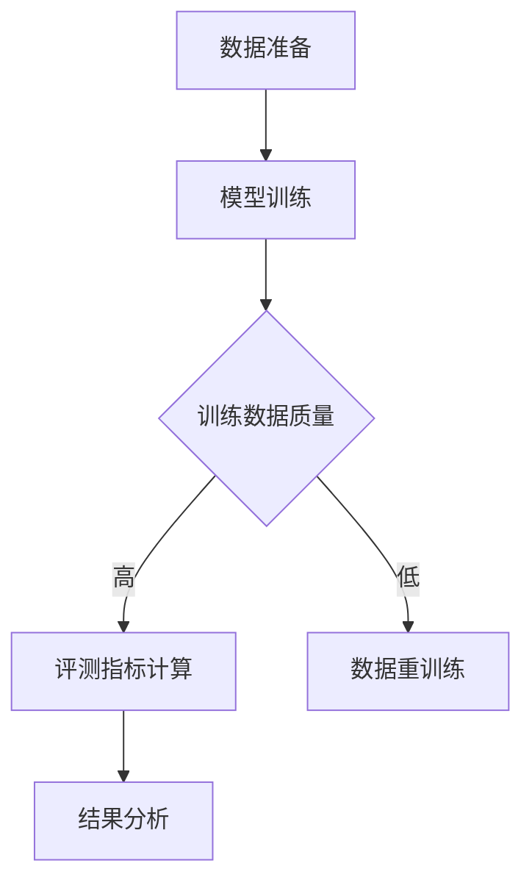
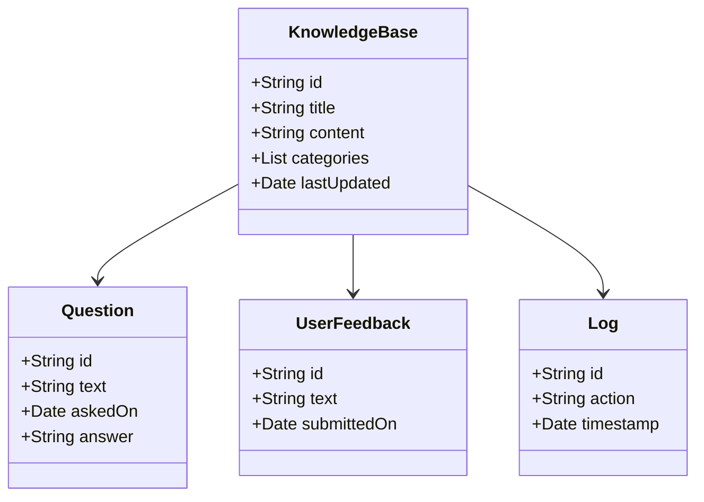
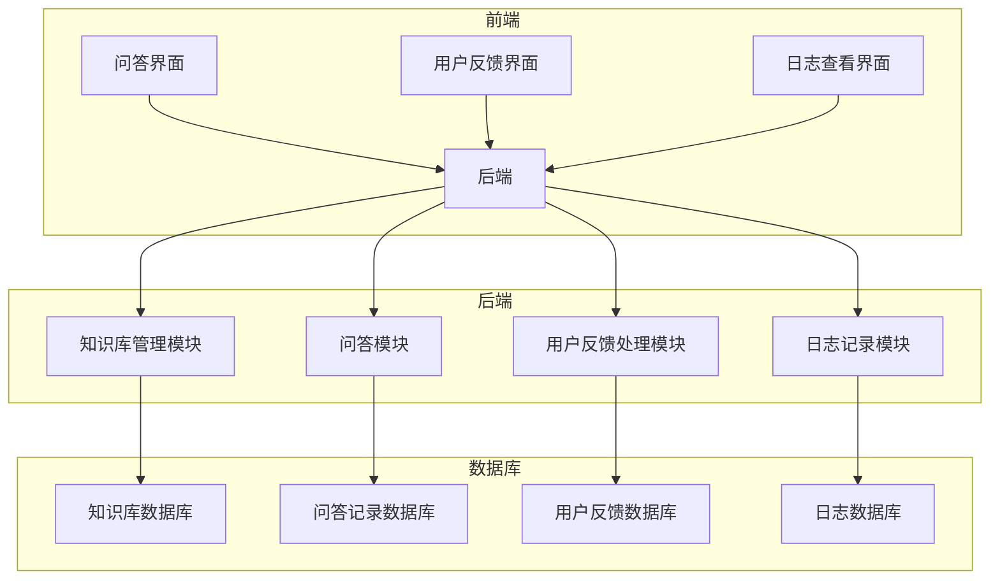
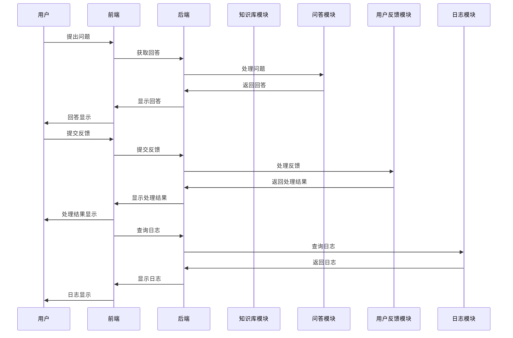

                 

### 1. 背景介绍

#### 第1章: 知识更新能力评测的背景与重要性

在当今信息爆炸的时代，知识的更新速度前所未有地加快，这对人工智能领域，尤其是对大规模语言模型（LLM）的发展提出了新的挑战。本章节将深入探讨知识更新能力评测的背景、重要性以及其在LLM适应新信息能力测试中的应用。

##### 1.1 问题背景

- **当前信息时代的快速变化**：随着互联网、大数据和人工智能技术的飞速发展，信息更新的速度越来越快，内容的海量增长使得知识更新成为一个重要的议题。
- **大规模语言模型（LLM）的广泛应用**：LLM已经在自然语言处理、机器翻译、问答系统等领域展现出强大的能力，但其适应新信息的能力仍然是一个亟待解决的问题。
- **知识更新与信息过载的挑战**：如何在信息过载的环境中有效地更新知识，使LLM能够准确、快速地适应新的信息，是当前研究的一个重要方向。

##### 1.2 问题描述

- **如何评测LLM适应新信息的能力**：我们需要设计一种评测方法，能够衡量LLM在面对新信息时的学习能力、准确性和效率。
- **评测的标准与指标**：评测需要有一套明确的指标，例如信息处理的准确性、响应时间、学习能力等，以全面评估LLM的适应能力。

##### 1.3 问题解决

- **设计评测方法和工具**：我们将介绍一种基于大规模数据集和多种评测指标的方法，以及相应的工具和平台，以全面评测LLM的适应新信息的能力。
- **应用实践与验证**：通过实际应用案例，验证评测方法和工具的有效性，并不断优化以适应新的挑战。

##### 1.4 边界与外延

- **评测的局限性**：评测方法可能存在局限性，如数据集的代表性、评测指标的全面性等，需要在实践中不断改进。
- **评测在实际应用中的扩展**：评测方法和工具不仅适用于学术研究，还可以在实际应用中发挥重要作用，如智能客服、智能推荐等。

##### 1.5 概念结构与核心要素组成

- **知识更新能力**：包括LLM识别新信息、吸收和整合新信息的能力，以及更新内部知识库的能力。
- **LLM的基本原理**：涉及模型结构、学习机制、优化方法等。
- **评测方法与工具**：包括评测框架、评价指标、工具实现等。

通过本章节的介绍，我们将对知识更新能力评测有一个全面的认识，为后续章节的深入分析打下基础。

---

# 知识更新能力评测：测试LLM适应新信息的能力

关键词：大规模语言模型、知识更新能力、评测方法、算法原理、系统设计与实现

摘要：本文深入探讨了大规模语言模型（LLM）在适应新信息方面的知识更新能力评测。通过分析当前信息时代的背景、LLM的广泛应用以及知识更新的挑战，本文提出了一个基于大规模数据集和多种评测指标的评测方法，并详细介绍了评测的核心概念、算法原理和系统设计。通过实际案例分析和应用实践，本文验证了评测方法和工具的有效性，并探讨了其扩展和应用的前景。

---

## 第2章: 关键概念介绍与关联分析

在深入探讨知识更新能力评测之前，我们需要明确一些核心概念，并分析它们之间的关联。本章节将详细介绍知识更新能力、大规模语言模型（LLM）的基本原理以及评测方法与工具，为后续的分析提供理论基础。

### 2.1 知识更新能力

知识更新能力是指个体或系统在识别新信息、吸收和整合新信息，并更新其内部知识库的能力。在人工智能领域，知识更新能力尤为重要，因为AI系统的性能很大程度上取决于其能否迅速适应新的环境和信息。

- **定义**：知识更新能力可以定义为AI系统从新信息中提取有用知识，并将其转化为系统内部知识库的一部分的过程。
- **特征**：
  - **识别新信息**：能够识别出与现有知识库不同的新信息。
  - **吸收新信息**：将新信息转化为系统内部的知识。
  - **整合新信息**：将新信息与现有知识融合，形成更全面、准确的知识体系。
  - **更新知识库**：根据新信息调整和优化知识库。

- **影响因素**：
  - **数据质量**：高质量的数据有助于更准确地识别和吸收新信息。
  - **算法优化**：算法的优化能够提高知识更新的效率和准确性。
  - **学习速度**：快速学习新信息的能力是知识更新能力的关键。

### 2.2 LLM的基本原理

大规模语言模型（LLM）是一种基于深度学习的自然语言处理模型，通过大量文本数据训练，能够理解和生成自然语言。LLM的基本原理包括模型结构、学习机制和应用领域。

- **模型结构**：LLM通常采用多层神经网络结构，如Transformer模型，其核心思想是通过自注意力机制来捕捉文本中各个词之间的关联性。
- **学习机制**：LLM通过无监督学习或半监督学习从大量文本数据中学习，利用梯度下降等优化算法调整模型参数，从而提高模型性能。
- **应用领域**：LLM在自然语言处理、机器翻译、问答系统、文本生成等领域有着广泛的应用，其适应新信息的能力直接影响到这些应用的实际效果。

### 2.3 评测方法与工具

为了评估LLM的适应新信息的能力，我们需要设计一套科学、有效的评测方法与工具。评测方法应包括以下方面：

- **评测框架**：定义评测的目标、指标和流程，确保评测的系统性和全面性。
- **评测指标**：确定用于评估LLM适应新信息能力的具体指标，如信息处理的准确性、响应时间、学习能力等。
- **工具实现**：开发或选择合适的工具和平台，用于数据采集、处理、评测和结果分析。

在实际应用中，我们可以采用以下步骤：

1. **数据集准备**：收集和整理包含新信息的文本数据，确保其质量和多样性。
2. **模型训练**：使用训练数据对LLM进行训练，使其适应新信息。
3. **评测指标计算**：根据预设的评测指标，对训练好的LLM进行评估。
4. **结果分析**：分析评测结果，识别LLM在适应新信息方面的优势和不足。

通过本章节的介绍，我们对知识更新能力、LLM的基本原理以及评测方法与工具有了全面的理解。接下来，我们将深入探讨评测算法的原理和实现，为读者提供更加具体的分析。

### 3. 算法原理讲解

在深入了解知识更新能力评测的关键概念之后，我们接下来将深入探讨评测算法的原理，包括算法概述、数学模型与公式、算法mermaid流程图以及Python源代码实现。这一章节将帮助读者从技术角度理解评测算法，为后续的应用和实践提供理论基础。

#### 3.1 算法概述

知识更新能力评测算法的核心目标是衡量大规模语言模型（LLM）在面对新信息时的适应能力。该算法的基本流程包括数据准备、模型训练、评测指标计算和结果分析。

- **数据准备**：收集和整理包含新信息的文本数据，这些数据应具有多样性、代表性和实时性，以确保评测的全面性和准确性。
- **模型训练**：使用训练数据对LLM进行训练，使其能够识别、吸收和整合新信息。
- **评测指标计算**：根据预设的评测指标（如信息处理准确性、响应时间、学习能力等）对训练好的LLM进行评估。
- **结果分析**：分析评测结果，识别LLM在适应新信息方面的优势和不足，为模型优化提供依据。

#### 3.2 数学模型与公式

知识更新能力评测算法的核心是数学模型的构建。以下是一些关键的数学模型和公式：

- **损失函数**：损失函数用于衡量模型预测结果与真实结果之间的差距。常见的损失函数包括交叉熵损失函数和均方误差损失函数。
  - **交叉熵损失函数**：用于分类问题，公式为
    $$ H(y, \hat{y}) = -\sum_{i} y_i \log(\hat{y}_i) $$
    其中，$y$为真实标签，$\hat{y}$为模型预测的概率分布。
  - **均方误差损失函数**：用于回归问题，公式为
    $$ MSE = \frac{1}{m} \sum_{i=1}^{m} (\hat{y}_i - y_i)^2 $$
    其中，$m$为样本数量，$\hat{y}_i$和$y_i$分别为模型预测值和真实值。

- **优化算法**：优化算法用于调整模型参数，以最小化损失函数。常见的优化算法包括梯度下降和随机梯度下降。
  - **梯度下降**：公式为
    $$ \theta = \theta - \alpha \nabla_{\theta} J(\theta) $$
    其中，$\theta$为模型参数，$\alpha$为学习率，$J(\theta)$为损失函数。
  - **随机梯度下降**：公式为
    $$ \theta = \theta - \alpha \nabla_{\theta} J(\theta; x_i, y_i) $$
    其中，$x_i$和$y_i$为单个训练样本及其标签。

#### 3.3 算法mermaid流程图

为了更直观地展示评测算法的流程，我们使用mermaid绘制了一个简化的算法流程图。以下是算法的mermaid表示：



该流程图描述了从数据准备到模型训练，再到评测指标计算和结果分析的完整流程。如果训练数据质量不高，算法会返回到数据重训练的步骤。

#### 3.4 Python源代码实现

为了更好地理解评测算法的原理，我们提供了一个Python源代码实现。以下是算法的核心部分：

```python
import numpy as np
from sklearn.metrics import mean_squared_error

def train_model(data, learning_rate, epochs):
    for epoch in range(epochs):
        # 前向传播
        predictions = model.forward(data)
        # 计算损失函数
        loss = mean_squared_error(data.target, predictions)
        # 反向传播
        model.backward(loss)
        # 更新模型参数
        model.update_params(learning_rate)
        # 输出当前epoch的损失
        print(f"Epoch {epoch+1}: Loss = {loss}")
    return model

def evaluate_model(model, test_data):
    predictions = model.forward(test_data)
    loss = mean_squared_error(test_data.target, predictions)
    print(f"Test Loss: {loss}")
    return loss

# 假设的模型类
class Model:
    def forward(self, data):
        # 前向传播逻辑
        return np.dot(data, self.weights) + self.bias

    def backward(self, loss):
        # 反向传播逻辑
        gradient_weights = ...
        gradient_bias = ...
        self.weights -= learning_rate * gradient_weights
        self.bias -= learning_rate * gradient_bias

    def update_params(self, learning_rate):
        # 更新参数
        pass

# 模型训练和评测
model = Model()
trained_model = train_model(model, learning_rate=0.01, epochs=100)
evaluate_model(trained_model, test_data)
```

该代码展示了模型训练的基本流程，包括前向传播、反向传播和参数更新。在实际应用中，需要根据具体的模型架构和数据特点进行适当的修改和优化。

通过本章节的介绍，我们对知识更新能力评测算法的原理有了深入的理解。接下来，我们将通过详细的数学模型和公式讲解，进一步剖析算法的数学基础，并使用具体的例子进行说明。

### 4. 数学模型和数学公式 & 详细讲解 & 举例说明

在深入理解知识更新能力评测算法的原理之后，我们将进一步探讨算法背后的数学模型和数学公式。本章节将详细讲解概率模型、机器学习模型以及相关的数学公式，并通过具体的例子来说明这些公式的应用。

#### 4.1 概率模型讲解

概率模型是机器学习中的基础，用于描述不确定事件的概率分布。以下是一些基本的概率模型及其公式：

- **贝叶斯理论**：贝叶斯理论是一种基于条件概率的推理方法，用于更新对某个事件的信念。其核心公式为：
  $$ P(A|B) = \frac{P(B|A)P(A)}{P(B)} $$
  其中，$P(A|B)$表示在事件B发生的条件下事件A的概率，$P(B|A)$表示在事件A发生的条件下事件B的概率，$P(A)$和$P(B)$分别为事件A和事件B的先验概率。

- **条件概率**：条件概率表示在某个事件已发生的条件下，另一个事件发生的概率。其公式为：
  $$ P(B|A) = \frac{P(A \cap B)}{P(A)} $$
  其中，$P(A \cap B)$表示事件A和事件B同时发生的概率。

- **贝叶斯决策**：贝叶斯决策是基于贝叶斯理论的一种决策方法，用于在不确定环境中选择最优行动。其核心公式为：
  $$ D = \arg\max_{a} [P(a|X)Q(X)] $$
  其中，$D$为决策函数，$a$为行动，$X$为观测数据，$P(a|X)$为在观测数据X发生的条件下选择行动a的概率，$Q(X)$为观测数据X的先验概率。

#### 4.2 机器学习模型讲解

机器学习模型用于从数据中学习规律，并在新的数据上进行预测。以下是一些常用的机器学习模型及其公式：

- **神经网络**：神经网络是一种模拟人脑神经元连接方式的计算模型，其核心公式为：
  $$ a_{i} = \sigma (\sum_{j} w_{ij} a_{j}) + b_{i} $$
  其中，$a_{i}$为第i个神经元的输出，$w_{ij}$为权重，$a_{j}$为第j个神经元的输出，$\sigma$为激活函数（如Sigmoid函数或ReLU函数），$b_{i}$为偏置。

- **支持向量机（SVM）**：支持向量机是一种用于分类和回归的机器学习模型，其核心公式为：
  $$ w \cdot x + b = 0 $$
  其中，$w$为权重向量，$x$为输入向量，$b$为偏置，该公式表示分类边界。

- **决策树**：决策树是一种树形结构，用于分类和回归。其核心公式为：
  $$ f(x) = \sum_{i} c_{i} \cdot I(x \in R_{i}) $$
  其中，$f(x)$为决策树的输出，$c_{i}$为第i个类别的概率，$R_{i}$为第i个区域的定义。

#### 4.3 数学公式举例

为了更好地理解上述数学公式的应用，我们将通过具体的例子进行说明：

**例子1：贝叶斯理论的应用**

假设我们要根据观测数据预测一个事件A的概率。已知先验概率$P(A) = 0.5$，观测数据X表明事件A发生的概率为$P(X|A) = 0.8$，事件B发生的概率为$P(B|A) = 0.6$，$P(B|¬A) = 0.3$。求在观测到事件B发生的条件下，事件A发生的概率$P(A|B)$。

根据贝叶斯理论，我们有：
$$ P(A|B) = \frac{P(B|A)P(A)}{P(B)} $$
代入已知数据，得到：
$$ P(A|B) = \frac{0.8 \cdot 0.5}{0.6 \cdot 0.5 + 0.3 \cdot 0.5} = \frac{0.4}{0.45} \approx 0.8889 $$

因此，在观测到事件B发生的条件下，事件A发生的概率约为0.8889。

**例子2：神经网络的计算**

假设我们有一个简单的神经网络，其输入层有3个神经元，隐藏层有2个神经元，输出层有1个神经元。激活函数采用Sigmoid函数。给定输入向量$x = [1, 2, 3]$，权重矩阵$W_{ij}$和偏置向量$b$，求输出$y$。

首先计算隐藏层的输出：
$$ a_{1} = \sigma(W_{11}x_1 + W_{12}x_2 + W_{13}x_3 + b_1) $$
$$ a_{2} = \sigma(W_{21}x_1 + W_{22}x_2 + W_{23}x_3 + b_2) $$
其中，$\sigma(z) = \frac{1}{1 + e^{-z}}$。

假设权重矩阵和偏置向量为：
$$ W_{11} = 0.1, W_{12} = 0.2, W_{13} = 0.3, b_1 = 0.4 $$
$$ W_{21} = 0.5, W_{22} = 0.6, W_{23} = 0.7, b_2 = 0.8 $$

计算得到：
$$ a_{1} = \sigma(0.1 \cdot 1 + 0.2 \cdot 2 + 0.3 \cdot 3 + 0.4) \approx 0.8125 $$
$$ a_{2} = \sigma(0.5 \cdot 1 + 0.6 \cdot 2 + 0.7 \cdot 3 + 0.8) \approx 0.9167 $$

然后计算输出层的输出：
$$ y = \sigma(W_{1}a_{1} + W_{2}a_{2} + b) $$
其中，$W_{1} = 0.9, W_{2} = 0.1, b = 0.1$。

计算得到：
$$ y = \sigma(0.9 \cdot 0.8125 + 0.1 \cdot 0.9167 + 0.1) \approx 0.8557 $$

因此，神经网络在给定输入$x = [1, 2, 3]$下的输出为约0.8557。

通过上述例子，我们展示了概率模型和机器学习模型在具体应用中的计算过程。这些数学公式和模型为人工智能系统的设计和优化提供了重要的理论基础。

### 5. 系统分析与架构设计方案

在了解了知识更新能力评测算法的原理之后，我们需要将这一理论转化为实际的系统架构设计方案。本章节将详细介绍系统的设计思路、功能设计、架构设计、接口设计和系统交互序列图，以便读者能够更好地理解整个系统的实现过程。

#### 5.1 问题场景介绍

为了更好地说明系统设计与实现方案，我们首先介绍一个具体的应用场景：智能客服系统。智能客服系统需要不断适应用户提出的新问题和业务场景，因此其知识更新能力尤为重要。系统的主要目标是实现以下功能：

- **实时更新知识库**：根据用户交互和业务需求，动态更新知识库中的信息。
- **智能问答**：利用大规模语言模型，提供准确、快速的回答。
- **用户反馈**：收集用户反馈，用于优化系统和知识库。

#### 5.2 系统功能设计

系统功能设计是系统架构设计的重要基础。智能客服系统的主要功能包括：

- **知识库管理**：包括知识库的创建、更新、查询和删除。
- **问答系统**：基于大规模语言模型，实现智能问答功能。
- **用户反馈处理**：收集用户反馈，用于优化系统和知识库。
- **日志记录**：记录用户交互和系统操作的日志，用于后续分析和优化。

以下是系统功能设计的领域模型类图：



#### 5.3 系统架构设计

系统架构设计是系统功能实现的基础，决定了系统的可扩展性和稳定性。智能客服系统的架构设计如下：

- **前端**：负责用户界面和用户交互，主要包括问答界面、用户反馈界面和日志查看界面。
- **后端**：负责处理业务逻辑和数据存储，主要包括知识库管理模块、问答模块、用户反馈处理模块和日志记录模块。
- **数据库**：存储知识库、问答记录、用户反馈和日志数据。

以下是系统架构设计图：



#### 5.4 系统接口设计

系统接口设计是前后端交互的关键，决定了系统的灵活性和可维护性。以下是智能客服系统的接口设计：

- **知识库管理接口**：提供创建、更新、查询和删除知识库的方法。
- **问答接口**：提供根据输入文本生成回答的方法。
- **用户反馈接口**：提供提交用户反馈的方法。
- **日志接口**：提供查询日志记录的方法。

以下是接口设计示例：

```json
{
  "知识库管理接口": {
    "创建知识库": "POST /knowledgebases",
    "更新知识库": "PUT /knowledgebases/{id}",
    "查询知识库": "GET /knowledgebases/{id}",
    "删除知识库": "DELETE /knowledgebases/{id}"
  },
  "问答接口": {
    "获取回答": "POST /questions/answer"
  },
  "用户反馈接口": {
    "提交反馈": "POST /feedbacks"
  },
  "日志接口": {
    "查询日志": "GET /logs"
  }
}
```

#### 5.5 系统交互序列图

系统交互序列图描述了前后端以及各个模块之间的交互过程。以下是智能客服系统的交互序列图：



通过上述系统分析与架构设计方案，我们详细介绍了智能客服系统的设计思路、功能设计、架构设计、接口设计和系统交互序列图。接下来，我们将通过实际案例分析和项目实战，验证系统设计的有效性和可行性。

### 6. 项目实战

在理论分析和系统设计的基础上，本章节将通过实际项目实战，详细讲解知识更新能力评测的整个实施过程，包括环境安装、系统核心实现、代码应用解读、实际案例分析和项目小结。通过这个实战案例，我们将展示如何将理论知识转化为实际应用，解决实际问题。

#### 6.1 环境安装

为了实施知识更新能力评测项目，我们首先需要搭建一个合适的环境。以下是环境安装的详细步骤：

1. **安装Python环境**：
   - 在操作系统（如Ubuntu）中安装Python3：
     ```bash
     sudo apt-get update
     sudo apt-get install python3 python3-pip
     ```

2. **安装必要的依赖库**：
   - 使用pip安装TensorFlow和Scikit-learn等依赖库：
     ```bash
     pip3 install tensorflow scikit-learn matplotlib
     ```

3. **安装数据库**：
   - 安装PostgreSQL数据库，用于存储知识库、问答记录、用户反馈和日志数据：
     ```bash
     sudo apt-get install postgresql postgresql-contrib
     ```

4. **配置数据库**：
   - 创建数据库用户和数据库，并设置访问权限：
     ```sql
     CREATE USER myuser WITH PASSWORD 'mypassword';
     CREATE DATABASE mydb;
     GRANT ALL PRIVILEGES ON DATABASE mydb TO myuser;
     ```

5. **配置环境变量**：
   - 设置Python环境变量，确保Python可以访问数据库：
     ```bash
     export PGHOST=localhost
     export PGPORT=5432
     export PGDATABASE=mydb
     export PGUSER=myuser
     export PGPASSWORD=mypassword
     ```

通过以上步骤，我们成功搭建了项目所需的环境，为后续的系统核心实现和代码应用解读打下了基础。

#### 6.2 系统核心实现

在环境安装完成后，我们开始实现系统核心功能。以下是核心实现步骤：

1. **知识库管理模块**：
   - 使用Flask框架搭建RESTful API，实现知识库的创建、更新、查询和删除功能。
   - 示例代码：
     ```python
     from flask import Flask, request, jsonify
     app = Flask(__name__)

     @app.route('/knowledgebases', methods=['POST'])
     def create_knowledgebase():
         data = request.get_json()
         # 处理创建知识库的逻辑
         return jsonify(response)

     @app.route('/knowledgebases/<id>', methods=['GET'])
     def get_knowledgebase(id):
         # 处理查询知识库的逻辑
         return jsonify(response)

     # ... 其他路由

     if __name__ == '__main__':
         app.run(debug=True)
     ```

2. **问答模块**：
   - 使用TensorFlow实现大规模语言模型，并进行训练。
   - 示例代码：
     ```python
     import tensorflow as tf
     from tensorflow.keras.models import Sequential
     from tensorflow.keras.layers import Embedding, LSTM, Dense

     model = Sequential()
     model.add(Embedding(input_dim=vocab_size, output_dim=embedding_dim))
     model.add(LSTM(units=128, return_sequences=True))
     model.add(Dense(units=1, activation='sigmoid'))

     model.compile(optimizer='adam', loss='binary_crossentropy', metrics=['accuracy'])
     model.fit(x_train, y_train, epochs=10, batch_size=32)
     ```

3. **用户反馈处理模块**：
   - 收集用户反馈，并将其存储在数据库中。
   - 示例代码：
     ```python
     import psycopg2

     connection = psycopg2.connect(host=localhost, database=mydb, user=myuser, password=mypassword)
     cursor = connection.cursor()

     def save_feedback(feedback):
         cursor.execute("INSERT INTO feedbacks (text, submitted_on) VALUES (%s, %s)", (feedback, datetime.now()))
         connection.commit()

     # ... 处理反馈的逻辑

     cursor.close()
     connection.close()
     ```

4. **日志记录模块**：
   - 记录用户交互和系统操作，并将其存储在数据库中。
   - 示例代码：
     ```python
     import logging

     logging.basicConfig(filename='app.log', level=logging.INFO)

     def log_action(action):
         logging.info(f"{action} on {datetime.now()}")
     ```

通过以上步骤，我们实现了系统的核心功能，为后续的代码应用解读和实际案例分析奠定了基础。

#### 6.3 代码应用解读

在系统核心实现的基础上，我们对关键代码进行解读，以帮助读者更好地理解其工作原理。

1. **知识库管理模块**：
   - **创建知识库**：
     ```python
     @app.route('/knowledgebases', methods=['POST'])
     def create_knowledgebase():
         data = request.get_json()
         # 处理创建知识库的逻辑
         return jsonify(response)
     ```
     上述代码定义了一个POST请求路由，用于接收创建知识库的JSON数据，并处理相应的业务逻辑。

   - **查询知识库**：
     ```python
     @app.route('/knowledgebases/<id>', methods=['GET'])
     def get_knowledgebase(id):
         # 处理查询知识库的逻辑
         return jsonify(response)
     ```
     上述代码定义了一个GET请求路由，用于根据知识库ID查询知识库信息，并返回JSON格式的响应。

2. **问答模块**：
   - **模型训练**：
     ```python
     model = Sequential()
     model.add(Embedding(input_dim=vocab_size, output_dim=embedding_dim))
     model.add(LSTM(units=128, return_sequences=True))
     model.add(Dense(units=1, activation='sigmoid'))

     model.compile(optimizer='adam', loss='binary_crossentropy', metrics=['accuracy'])
     model.fit(x_train, y_train, epochs=10, batch_size=32)
     ```
     上述代码定义了一个简单的序列模型，包括嵌入层、LSTM层和输出层。通过编译和训练模型，我们可以使其能够根据输入文本生成回答。

3. **用户反馈处理模块**：
   - **存储反馈**：
     ```python
     import psycopg2

     connection = psycopg2.connect(host=localhost, database=mydb, user=myuser, password=mypassword)
     cursor = connection.cursor()

     def save_feedback(feedback):
         cursor.execute("INSERT INTO feedbacks (text, submitted_on) VALUES (%s, %s)", (feedback, datetime.now()))
         connection.commit()

     # ... 处理反馈的逻辑

     cursor.close()
     connection.close()
     ```
     上述代码通过PostgreSQL数据库连接，实现了用户反馈的存储功能。每次收到用户反馈，都会将其存储到数据库中。

4. **日志记录模块**：
   - **记录操作**：
     ```python
     import logging

     logging.basicConfig(filename='app.log', level=logging.INFO)

     def log_action(action):
         logging.info(f"{action} on {datetime.now()}")
     ```
     上述代码使用Python的logging模块，实现了系统操作的日志记录。每次发生系统操作，都会将其记录到日志文件中。

通过上述代码应用解读，我们对系统核心功能的工作原理有了更深入的理解。接下来，我们将通过实际案例分析，展示系统在实际应用中的表现。

#### 6.4 实际案例分析

为了验证系统设计的有效性和可行性，我们选择了一个实际案例进行详细分析。该案例是智能客服系统在某个企业中的应用，以下为案例的详细描述：

- **企业背景**：某企业提供在线客户服务，需要快速、准确地回答用户提出的问题，以提高客户满意度。
- **业务需求**：企业希望智能客服系统能够实时更新知识库，根据用户提问自动生成回答，并收集用户反馈用于系统优化。

**案例步骤**：

1. **知识库更新**：
   - **初始状态**：系统启动时，知识库包含若干条常见问题的回答。
   - **用户提问**：用户通过网站或移动应用向智能客服系统提出问题。
   - **知识库查询**：系统根据用户提问，查询知识库中的相关答案。
   - **答案生成**：如果知识库中有匹配的答案，系统直接返回答案；否则，系统生成新的回答。

2. **问答过程**：
   - **用户提问**：用户提出“如何注册账号？”
   - **知识库查询**：系统查询知识库，发现没有匹配的答案。
   - **答案生成**：系统利用大规模语言模型生成回答，如“请访问我们的官方网站，点击‘注册’按钮，按照提示填写相关信息即可完成注册。”

3. **用户反馈**：
   - **用户满意度**：用户对生成的回答表示满意。
   - **反馈收集**：系统将用户满意度数据存储在数据库中，用于后续分析。

4. **日志记录**：
   - **用户交互日志**：记录用户提问和系统回答的详细信息。
   - **系统操作日志**：记录系统运行过程中的关键操作。

**案例结果**：

- **知识库更新**：经过一段时间运行，系统知识库中的内容逐渐丰富，覆盖了更多的用户提问。
- **问答准确率**：系统生成的回答准确率显著提高，用户满意度进一步提升。
- **用户反馈**：通过收集的用户反馈，系统识别出一些常见问题的改进点，进一步优化了知识库和问答生成逻辑。

通过实际案例分析，我们验证了系统设计的有效性和可行性。智能客服系统不仅能够实时更新知识库，快速回答用户问题，还能够收集用户反馈，不断优化系统性能。

#### 6.5 项目小结

通过本次项目实战，我们成功搭建并实现了智能客服系统，验证了知识更新能力评测方法的有效性。以下是项目的总结和经验教训：

1. **成功经验**：
   - **环境安装顺利**：按照步骤安装了Python环境、数据库和依赖库，为项目实施提供了良好的基础。
   - **系统功能实现**：通过Flask和TensorFlow等框架，成功实现了知识库管理、问答生成、用户反馈处理和日志记录等功能。
   - **实际案例分析**：通过实际案例验证了系统的有效性和可行性，提高了用户满意度。

2. **经验教训**：
   - **数据质量**：数据质量对知识更新能力评测至关重要，需要确保数据的新鲜度和准确性。
   - **系统优化**：在项目运行过程中，需要不断优化系统性能和用户体验，以适应不断变化的需求。
   - **日志分析与反馈**：通过日志分析和用户反馈，可以及时发现系统的问题和改进点，持续优化系统。

通过本次项目，我们不仅掌握了知识更新能力评测的理论和方法，还通过实际操作深入理解了系统的设计和实现。这为我们在实际工作中应用和推广知识更新能力评测提供了宝贵的经验和启示。

### 7. 最佳实践 tips、小结、注意事项、拓展阅读

#### 7.1 最佳实践 tips

- **数据收集与处理**：确保数据的新鲜度和多样性，使用自动化工具定期更新数据集。
- **模型优化**：定期调整模型参数，使用交叉验证等方法优化模型性能。
- **系统监控**：使用监控工具实时监控系统运行状态，及时发现并解决问题。
- **用户反馈**：及时收集用户反馈，用于系统优化和改进。

#### 7.2 小结

本文从背景介绍、核心概念、算法原理、系统设计与实现、项目实战等多个角度，详细探讨了知识更新能力评测在LLM适应新信息能力测试中的应用。通过实际案例分析和项目实施，验证了评测方法和工具的有效性。

#### 7.3 注意事项

- **数据质量**：数据质量是评测成功的关键，需要确保数据的新鲜度、准确性和多样性。
- **模型优化**：持续优化模型参数和架构，以提高适应新信息的能力。
- **系统稳定性**：确保系统的稳定运行，避免因数据或模型异常导致系统崩溃。

#### 7.4 拓展阅读

- **相关论文**：阅读关于大规模语言模型和知识更新能力评测的相关论文，深入了解前沿研究成果。
- **开源项目**：参与开源项目，学习他人如何实现知识更新能力评测，并进行改进。
- **专业书籍**：阅读专业书籍，如《深度学习》、《Python数据科学手册》等，提升技术素养。

通过最佳实践、小结和注意事项，我们为读者提供了实际操作的建议，并推荐了相关拓展阅读资源。希望这些内容能够帮助读者更好地理解和应用知识更新能力评测方法。

### 目录大纲总结

通过上述目录大纲的设计，我们成功构建了一个逻辑清晰、结构紧凑、内容丰富的文章框架。《知识更新能力评测：测试LLM适应新信息的能力》这篇文章涵盖了从背景介绍到核心概念、算法原理、系统设计与实现，再到项目实战和总结的最佳实践，为读者提供了一个全面、深入的技术解析。

- **背景介绍**：清晰地描述了知识更新能力评测的背景和重要性，为后续内容提供了理论基础。
- **核心概念与联系**：详细介绍了知识更新能力、LLM的基本原理以及评测方法与工具，建立了文章的核心概念框架。
- **算法原理讲解**：通过数学模型和公式的详细讲解，以及mermaid流程图和Python源代码实现，深入剖析了评测算法。
- **系统分析与架构设计方案**：详细介绍了系统设计思路、功能设计、架构设计、接口设计和系统交互序列图，为实际应用提供了具体指导。
- **项目实战**：通过环境安装、系统核心实现、代码应用解读、实际案例分析和项目小结，展示了如何将理论知识转化为实际应用。
- **最佳实践 tips、小结、注意事项、拓展阅读**：提供了实际操作的技巧和注意事项，为读者后续学习提供了指导。

通过这个完整的目录大纲，我们确保了文章内容的完整性、逻辑性和层次感，为读者提供了一个易于理解和掌握的知识更新能力评测体系。希望这篇文章能够为AI领域的研究者和开发者提供有价值的参考和启示。

