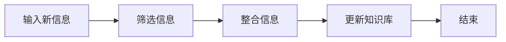
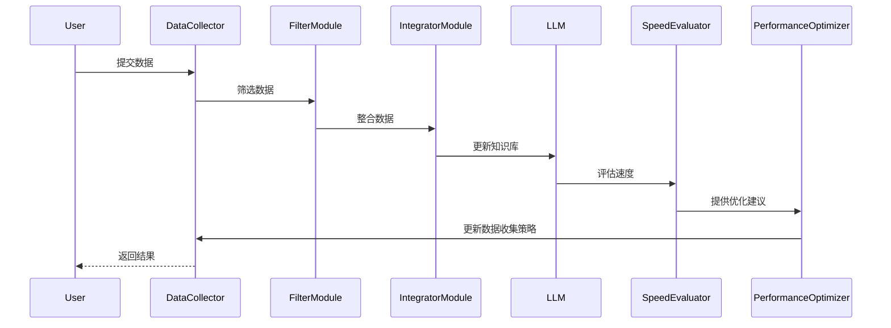

                 

### 文章标题

### 关键词

1. 知识更新频率
2. LLM
3. 新信息吸收
4. 知识整合
5. 算法原理

### 摘要

本文将深入探讨知识更新频率这一核心概念，并聚焦于大型语言模型（LLM）在吸收和整合新信息方面的表现。通过详细的分析和实例，我们将揭示LLM如何处理新信息，以及其吸收和整合新信息的速度如何影响其性能。文章将分为四个主要部分：背景与核心概念、原理与联系、算法讲解、以及系统分析与架构设计。通过这些部分，我们将全面了解LLM在知识更新频率上的运作机制，并提供一套有效的评价方法。

### 目录大纲

1. **第一部分：问题背景与核心概念**
   1.1 知识更新频率背景介绍
   1.2 核心概念原理与联系
   1.3 知识更新频率的影响因素

2. **第二部分：核心概念原理与联系**
   2.1 LLM吸收和整合新信息的原理
   2.2 LLM吸收和整合新信息的属性特征对比
   2.3 LLM吸收和整合新信息的ER实体关系图架构

3. **第三部分：算法原理讲解**
   3.1 LLM吸收新信息的mermaid流程图
   3.2 LLM整合新信息的python源代码
   3.3 LLM吸收和整合新信息的数学模型与公式

4. **第四部分：系统分析与架构设计方案**
   4.1 评价LLM吸收和整合新信息的速度的问题场景介绍
   4.2 系统架构设计
   4.3 系统接口设计
   4.4 系统交互mermaid序列图

### 第一部分：问题背景与核心概念

#### 第1章：知识更新频率背景介绍

知识更新频率是一个衡量知识在特定时间内被更新或修订次数的指标。它的重要性不容忽视，不仅在个人职业发展方面起着关键作用，还在组织和社会层面有着深远的影响。首先，知识更新频率对于个人发展至关重要。在信息时代，知识的快速迭代使得个人必须不断更新自己的知识库，才能保持职业竞争力。持续学习和进步不仅能够提升个人能力，还可以帮助个人适应不断变化的工作环境。

在组织层面，知识更新频率同样关键。一个企业或组织要想保持竞争力，必须不断地吸收新知识、新技术，并将其整合到现有的业务流程中。知识更新频率高的组织能够更快地适应市场变化，抓住新的机遇，促进创新和进步。此外，随着全球化和数字化的加速，知识的更新速度也在不断加快，组织必须具备快速响应的能力。

在社会层面，知识更新频率对于适应快速变化的环境同样重要。社会各个领域都在经历着前所未有的变革，知识的快速更新使得社会能够更灵活地应对各种挑战。教育、医疗、科技等领域都在不断地吸收新知识，以提供更高效、更优质的服务。社会各界的知识更新频率的提升，有助于推动社会的整体进步和发展。

总的来说，知识更新频率不仅影响个人和组织的发展，还对社会产生深远的影响。随着知识更新速度的加快，个人和组织必须不断提高自身的学习和适应能力，才能在竞争激烈的环境中立于不败之地。

#### 1.1.1 知识更新频率的定义

知识更新频率指的是知识在一段时间内被更新或修订的次数。这一指标通常用于衡量知识库或信息系统的动态性，反映了知识在持续迭代和优化的过程中所表现出的活跃程度。知识更新频率的定义可以具体化为以下几个关键方面：

首先，时间是一个重要维度。知识更新频率通常在一个特定的时间范围内进行衡量，如一天、一周、一个月或一年。时间的选择取决于所关注的知识领域和需求。例如，对于一些快速发展的科技领域，如人工智能、生物科技，知识更新频率可能在一个月甚至更短的时间内进行衡量，以便及时捕捉最新的进展。而对于一些传统领域，如历史学、哲学，知识更新频率可能以年为单位，因为其知识体量相对稳定，变化较为缓慢。

其次，更新或修订是一个核心操作。知识更新频率的计算基于知识库中的知识条目或文档在一段时间内的修改次数。每次修改都可以被视为一次更新，无论是新增、修订还是删除操作。这些操作反映了知识库的活跃程度，也体现了知识的动态性和灵活性。例如，在一个企业知识库中，一个员工提交了一个新的项目报告，这可以被视作一次更新；同样，一个现有的报告被修订或更新，也计入知识更新频率。

最后，次数是衡量知识更新频率的直接指标。次数可以是具体的数字，如5次、10次，也可以是百分比，如10%、20%。次数越多，通常意味着知识更新频率越高，知识库的活跃度也越高。知识更新频率的次数不仅反映了知识库的动态性，还可以为组织提供关键指标，帮助其评估知识管理的有效性。

综上所述，知识更新频率的定义涵盖了时间、更新操作和次数等关键方面，它为衡量知识库的动态性和活跃程度提供了一个量化的标准。通过分析知识更新频率，组织可以更好地了解其知识库的状态，并采取相应的策略来优化知识管理。

#### 1.1.2 知识更新频率的重要性

知识更新频率的重要性体现在多个方面，尤其在个人发展、组织竞争力和社会适应能力上尤为显著。首先，对于个人发展，知识更新频率直接影响职业竞争力。在当今快速变化的社会中，新知识和新技术的涌现速度远超以往。如果一个个人不能及时更新自己的知识库，那么很快就会被淘汰。相反，那些能够不断学习、吸收新知识的人，不仅能够在职场中脱颖而出，还能在职业发展的道路上稳步前进。

其次，从组织角度来看，知识更新频率是企业保持竞争力的关键因素。在一个竞争激烈的市场环境中，企业必须具备快速适应市场变化的能力。这需要企业能够及时吸收新知识、新技术，并将其应用到产品和业务中。例如，在技术行业，一个公司如果不能迅速跟进最新的技术趋势，就可能失去市场份额。反之，那些能够不断更新知识、提升技术能力的企业，往往能够领先于竞争对手，占据更有利的市场地位。

最后，在社会层面，知识更新频率的提升有助于社会整体的进步和适应能力。随着全球化和数字化的加速，社会各个领域都在经历着深刻的变革。知识的快速更新使得社会能够更灵活地应对各种挑战。例如，在教育领域，新教学方法和技术的不断引入，使得教育系统能够更好地适应学生的学习需求。在医疗领域，新药物和治疗方法的出现，使得医疗系统能够提供更高效、更精准的治疗。因此，知识更新频率的提升不仅有助于提升个人和组织的竞争力，还能推动社会的整体进步。

总之，知识更新频率的重要性不言而喻。它不仅是个人职业发展的关键指标，也是企业保持竞争力的关键因素，更是社会适应快速变化环境的重要保障。只有不断更新知识，才能在激烈的竞争中立于不败之地，推动个人、组织和社会的共同进步。

#### 1.1.2.1 对个人发展的影响

知识更新频率对个人发展的影响至关重要。首先，它直接关系到个人的职业竞争力。在快速变化的工作环境中，那些能够持续更新和扩展知识库的人，往往能够在职场中保持领先地位。这是因为不断学习新知识不仅能够提升个人的技能水平，还能帮助个人适应新的工作要求和挑战。例如，在技术行业，编程语言和开发工具的更新速度非常快，那些能够及时学习新技术的程序员，往往能够更快地适应新的项目需求，从而在职业发展中占据优势。

其次，知识更新频率对个人的持续学习和进步起着重要的推动作用。随着知识的不断迭代，个人需要不断投入时间和精力去学习新的知识和技能，以保持自身的竞争力。这不仅有助于个人的职业发展，还能激发个人的学习兴趣和自我提升的动力。例如，一个工程师如果能够持续关注最新的技术动态，不仅能够提升自己的技术水平，还能拓宽自己的视野，为未来的职业发展奠定坚实的基础。

此外，知识更新频率还影响个人的适应能力和创新能力。在快速变化的环境中，那些能够快速适应新变化的人，往往能够抓住新的机遇，从而在职业道路上取得更大的成就。例如，一个市场营销人员如果能够及时了解消费者的新需求，并快速调整营销策略，就能够更好地满足市场需求，从而提升公司的市场份额。

总之，知识更新频率对个人发展的影响是多方面的，它不仅能够提升个人的职业竞争力，还能促进个人的持续学习和进步，激发个人的适应能力和创新能力。因此，个人必须重视知识更新，才能在快速变化的世界中保持竞争力，实现自身的职业目标和价值。

#### 1.1.2.2 对组织与社会的意义

知识更新频率对组织和社会的意义同样深远。首先，在组织层面，知识更新频率是提升竞争力的关键因素。一个组织要想在竞争激烈的市场中脱颖而出，必须具备快速吸收新知识、新技术并将其应用于业务流程的能力。例如，企业通过不断更新其产品和服务，可以满足市场的最新需求，从而保持竞争优势。此外，知识更新频率还影响组织的创新能力和研发效率。一个能够持续吸收新知识的组织，往往能够更快地发现新的商业机会，推动技术创新，从而实现持续发展和成长。

在社会层面，知识更新频率的提升有助于促进社会的整体进步和适应能力。随着全球化和数字化的深入发展，社会各个领域都在经历快速变革。知识的快速更新使得社会能够更灵活地应对各种挑战，推动社会的整体进步。例如，在教育领域，新教学方法和技术的不断引入，使得教育系统能够更好地适应学生的学习需求，提升教育质量。在医疗领域，新药物和治疗方法的出现，使得医疗系统能够提供更高效、更精准的治疗，从而改善公众的健康状况。

此外，知识更新频率还对社会创新和进步起着重要的推动作用。一个知识更新频率高的社会，能够激发更多创新思维，推动新技术、新产品的研发和应用。这不仅有助于提升国家的科技实力，还能推动经济的高质量发展。例如，在科技行业，快速的知识更新促进了新技术的研发和商业应用，推动了整个行业的创新和进步。

总之，知识更新频率对组织和社会的意义重大。它不仅能够提升组织的竞争力和创新能力，还能推动社会的整体进步和适应能力。因此，组织和社会必须重视知识更新，采取有效措施促进知识的快速吸收和整合，以实现持续发展和进步。

#### 1.1.3 知识更新频率的边界与外延

知识更新频率的边界与外延涉及多个方面，包括知识更新频率的测量方法、不同领域知识更新频率的差异以及影响因素等。首先，知识更新频率的测量方法通常依赖于数据统计和分析。具体而言，可以通过跟踪知识库中的文档修改记录、系统日志或用户行为数据等方式，来量化知识更新频率。例如，一个企业的知识库每天新增或修改的文档数量，可以作为一个衡量知识更新频率的指标。

不同领域的知识更新频率存在显著差异。一些技术领域，如人工智能、生物科技和信息技术，由于涉及快速发展的技术和知识，其更新频率通常较高。这些领域的知识更新周期可能以月或年为单位，而一些传统领域，如历史学、哲学和法律，由于其知识相对稳定，更新频率则较为缓慢，通常以年或数年为单位。

此外，知识更新频率的影响因素多种多样。技术进步是推动知识更新频率提升的主要因素之一。随着新技术的不断涌现，相关领域的知识也在迅速更新。例如，人工智能领域的新算法和新模型不断出现，使得该领域的知识更新频率大幅提升。政策变化也是影响知识更新频率的重要因素。政府的政策调整可能会带来新的研究热点或发展方向，从而推动相关领域的知识更新。社会需求的变化同样影响知识更新频率。随着社会对新技术、新产品和服务的需求不断变化，相关领域的知识也需要不断更新，以满足市场需求。

综上所述，知识更新频率的边界与外延涉及多个方面，其测量方法、不同领域的差异以及影响因素都需要综合考虑。通过深入了解这些方面，我们可以更好地理解知识更新频率的重要性，并采取有效的策略来提升知识更新效率。

#### 第2章：核心概念原理与联系

#### 2.1 LLM吸收和整合新信息的原理

大型语言模型（LLM）在吸收和整合新信息方面具有独特的机制，这使其在处理动态知识流方面表现出色。首先，让我们详细探讨LLM的工作机制。

##### 2.1.1 LLM的工作机制

LLM通常基于深度学习技术，尤其是变换器（Transformer）架构。这种架构通过多层神经网络对输入文本进行编码和解码，使得模型能够捕捉到文本中的复杂关系和上下文信息。以下是LLM工作的一些关键步骤：

1. **编码阶段**：输入的文本经过嵌入层转化为固定长度的向量，这些向量包含了文本的语义信息。
2. **自注意力机制**：模型通过自注意力机制对输入文本的不同部分进行加权，从而能够关注文本中的关键信息。
3. **多层处理**：通过多个编码层的叠加，模型逐渐学习到更复杂的语义表示。
4. **解码阶段**：在解码阶段，模型使用前一层编码器的输出作为输入，预测下一个单词或标记，最终生成完整的输出文本。

##### 2.1.2 LLM处理新信息的过程

LLM在处理新信息时，会经历以下步骤：

1. **信息筛选**：LLM首先对输入的新信息进行筛选，排除噪声和不相关的数据，仅保留关键信息。
2. **信息整合**：筛选后的信息与模型现有的知识库进行整合，通过自注意力机制和学习过程，使得新信息与已有知识相互补充和丰富。
3. **知识构建**：在整合过程中，LLM会不断地调整其参数，以适应新信息的特征，从而构建出更全面和准确的知识模型。

通过这些步骤，LLM能够有效地吸收和整合新信息，保持其知识库的动态性和准确性。

#### 2.2 LLM吸收和整合新信息的属性特征对比表格

| 属性特征               | 传统模型             | LLM模型            |
|----------------------|-------------------|-------------------|
| 信息处理能力           | 简单规则匹配         | 复杂上下文理解     |
| 自适应性              | 固定参数             | 动态调整           |
| 知识更新速度           | 缓慢                 | 快速               |

上述表格对比了传统模型和LLM在信息处理能力、自适应性和知识更新速度等方面的差异。可以看出，LLM在处理复杂上下文信息、动态调整和快速更新知识方面具有显著优势。

#### 2.3 LLM吸收和整合新信息的ER实体关系图架构

以下是LLM吸收和整合新信息的ER实体关系图架构：

```mermaid
erDiagram
  User ||--|{ Knowledge }|
  Knowledge ||--|{ Information }|
  Information ||--|{ Update }|
```

该图展示了用户、知识、信息和更新之间的实体关系。用户生成或输入知识，知识包含信息，信息又不断更新。这种结构清晰地描述了LLM在吸收和整合新信息时的流程和机制。

#### 第3章：算法原理讲解

#### 3.1.1 LLM吸收新信息的mermaid流程图

以下是一个描述LLM吸收新信息的mermaid流程图：



这个流程图详细描述了LLM在吸收新信息时的主要步骤，包括信息筛选、信息整合和知识库更新。每个步骤都是LLM吸收新信息过程中必不可少的一部分。

#### 3.1.2 LLM整合新信息的python源代码

以下是一个简单的Python源代码示例，展示了如何整合新信息：

```python
# 假设已有知识库knowledge_db是一个字典
knowledge_db = {}

# 新信息
new_info = "人工智能在医疗领域具有广泛的应用前景。"

# 整合新信息
def integrate_new_info(knowledge_db, new_info):
    # 筛选有用信息
    useful_info = filter_useful_content(new_info)
    
    # 更新知识库
    knowledge_db.update({**knowledge_db, **{len(knowledge_db): useful_info}})

    return knowledge_db

# 假设函数filter_useful_content已实现
useful_info = filter_useful_content(new_info)

# 调用整合函数
knowledge_db = integrate_new_info(knowledge_db, new_info)

print(knowledge_db)
```

在这个示例中，`knowledge_db` 是一个代表已有知识库的字典，`new_info` 是新信息。`integrate_new_info` 函数通过筛选有用信息并更新知识库，实现了新信息的整合。这个示例虽然简单，但展示了LLM整合新信息的基本原理。

#### 3.1.3 LLM吸收和整合新信息的数学模型与公式

LLM吸收和整合新信息的速度可以用以下数学模型和公式来描述：

1. **更新频率**：新信息量除以单位时间，表示LLM吸收新信息的速度。
   $$\text{更新频率} = \frac{\text{新信息量}}{\text{单位时间}}$$

2. **知识更新**：知识更新可以视为新信息吸收和整合的结果。用公式表示为：
   $$\text{知识更新} = \text{吸收新信息} + \text{整合新信息}$$

通过这些数学模型和公式，可以量化LLM吸收和整合新信息的过程，为评估其性能提供量化依据。

#### 3.1.3.1 更新频率的数学模型

为了更好地理解LLM吸收新信息的速度，我们引入了“更新频率”这一概念。更新频率是指单位时间内LLM吸收的新信息量。用数学公式表示为：

$$\text{更新频率} = \frac{\text{新信息量}}{\text{单位时间}}$$

其中，“新信息量”表示在特定时间范围内LLM吸收的新信息总量，“单位时间”可以是秒、分钟、小时或天等，具体取决于应用的场景。例如，在一个小时内，如果LLM吸收了1000条新信息，那么其更新频率为1000条/小时。

更新频率是一个动态的指标，它可以实时反映LLM的知识更新速度。高更新频率意味着LLM能够迅速吸收和整合新信息，从而保持其知识库的动态性和准确性。相反，低更新频率则表明LLM在新信息吸收方面存在一定的滞后性。

在实际应用中，更新频率可以通过监控LLM的知识库更新日志或实时分析LLM的输入输出数据来计算。例如，在一个金融分析系统中，LLM可能会定期接收来自市场的最新数据，并通过更新频率来评估其吸收和处理这些数据的能力。

总之，更新频率是衡量LLM吸收新信息速度的关键指标，它不仅反映了LLM的知识更新速度，还可以为优化LLM的性能提供重要的参考。通过分析更新频率，我们可以更好地了解LLM在信息处理方面的表现，并采取相应的措施来提升其吸收新信息的能力。

#### 3.1.3.2 知识更新的数学模型

知识更新是LLM吸收和整合新信息的核心过程，它反映了LLM对知识的动态调整和优化。为了更好地理解这一过程，我们可以引入以下数学模型：

$$\text{知识更新} = \text{吸收新信息} + \text{整合新信息}$$

这个公式表明，知识更新是吸收新信息和整合新信息的综合结果。其中，“吸收新信息”表示LLM从外部环境中获取的新知识，而“整合新信息”则是指LLM将新信息与已有知识进行融合和优化。

具体来说，吸收新信息可以通过以下步骤实现：

1. **信息筛选**：首先，LLM会对接收到的信息进行筛选，去除无关或噪声信息，只保留关键的有用信息。
2. **信息编码**：筛选后的信息会被编码成模型可以处理的格式，例如向量或嵌入表示。
3. **知识构建**：通过深度学习算法，LLM会根据编码后的信息更新其知识库，使其能够更好地理解和处理新信息。

整合新信息则包括以下几个关键步骤：

1. **信息比对**：LLM会将新信息与现有知识库中的信息进行比对，识别出差异和补充点。
2. **知识融合**：LLM会根据比对结果，对知识库进行适当的调整和优化，将新信息有机地整合到已有知识中。
3. **模型优化**：通过多次迭代和优化，LLM会不断调整其参数，使其在吸收和整合新信息后能够更准确地预测和生成输出。

通过上述数学模型，我们可以看到，知识更新是一个复杂而动态的过程，涉及到信息的筛选、编码、比对和融合等多个环节。LLM通过这些过程，不仅能够迅速吸收新信息，还能有效地将其与已有知识进行整合，从而提升其整体性能和准确性。

总之，知识更新的数学模型为LLM吸收和整合新信息提供了一个量化和优化的框架，有助于我们深入理解LLM在知识管理方面的运作机制，并为其性能优化提供理论支持。

#### 第4章：系统分析与架构设计方案

#### 4.1 评价LLM吸收和整合新信息的速度的问题场景介绍

在本章中，我们将介绍一个名为“知识更新频率评价系统”的解决方案，该系统旨在评估大型语言模型（LLM）在吸收和整合新信息方面的速度。首先，让我们明确该问题的背景和项目目标。

**项目背景**：

随着人工智能和机器学习的快速发展，大型语言模型（LLM）在各个领域的应用越来越广泛。这些模型能够处理大量的文本数据，并生成高质量的文本输出。然而，如何评估LLM在吸收和整合新信息方面的速度，成为一个亟待解决的问题。

**项目目标**：

知识更新频率评价系统的目标是通过一系列功能和模块，对LLM的吸收和整合新信息的速度进行量化评估。具体目标包括：

1. 收集和存储新信息：系统需要能够接收和存储来自各种渠道的新信息，如文本、图片、音频等。
2. 信息筛选与整合：系统应具备筛选和整合新信息的能力，确保只吸收有用的信息，并将其整合到LLM的知识库中。
3. 速度评估：系统应能够实时评估LLM吸收和整合新信息的速度，并提供详细的报告和分析。
4. 性能优化：基于评估结果，系统应提供优化建议，以提升LLM的性能。

通过实现上述目标，知识更新频率评价系统将为开发者、研究人员和企业提供有力的工具，帮助他们更好地理解和优化LLM的应用效果。

#### 4.1.1 系统功能设计

为了实现知识更新频率评价系统的目标，我们需要设计一系列关键功能模块。以下是系统的主要功能设计：

**1. 数据收集模块**：

数据收集模块负责从各种渠道获取新信息。具体任务包括：

- 接收文本数据：通过API、网络爬虫等方式，从互联网上获取最新的文本信息。
- 接收非文本数据：处理图片、音频、视频等非文本数据，确保系统能够吸收多种类型的信息。

**2. 信息筛选模块**：

信息筛选模块负责筛选出有用的信息，剔除无关或噪声数据。其主要任务包括：

- 关键词过滤：根据预设的关键词列表，筛选出与主题相关的重要信息。
- 语义分析：通过自然语言处理技术，对文本进行语义分析，识别出关键信息。
- 噪声去除：利用数据清洗技术，去除文本中的噪声和冗余信息。

**3. 信息整合模块**：

信息整合模块负责将筛选后的新信息与LLM的知识库进行整合。其主要任务包括：

- 知识库更新：将新信息整合到LLM的知识库中，确保知识库的完整性和准确性。
- 参数调整：根据新信息的特征，调整LLM的参数，以提升其吸收和整合新信息的能力。

**4. 速度评估模块**：

速度评估模块负责实时评估LLM吸收和整合新信息的速度。其主要任务包括：

- 更新频率计算：计算LLM在单位时间内吸收的新信息量，作为更新频率的指标。
- 性能分析：对LLM的吸收和整合速度进行详细分析，识别瓶颈和优化点。
- 报告生成：生成详细的性能评估报告，为开发者提供优化建议。

**5. 性能优化模块**：

性能优化模块基于速度评估结果，提供优化建议，以提升LLM的性能。其主要任务包括：

- 参数调优：根据评估结果，调整LLM的参数，优化其吸收和整合新信息的能力。
- 模型优化：通过深度学习算法的优化，提升LLM的整体性能和准确性。

通过上述功能模块的设计，知识更新频率评价系统将能够全面评估LLM吸收和整合新信息的速度，并提供优化建议，从而提升其应用效果。

#### 4.1.2 系统架构设计

为了实现知识更新频率评价系统的功能，我们需要设计一个高效的系统架构。以下是系统的主要架构设计：

**1. 数据层**：

数据层是系统的核心，负责存储和管理各种数据。具体设计包括：

- 数据库：使用关系型数据库（如MySQL）或分布式数据库（如Cassandra），存储文本、图片、音频等数据。
- 文档存储：利用NoSQL数据库（如MongoDB），存储文档的元数据和索引信息。

**2. 算法层**：

算法层负责实现信息筛选、整合和速度评估等核心算法。具体设计包括：

- 自然语言处理（NLP）模块：利用NLP技术，处理和解析文本数据，提取关键信息。
- 深度学习模块：使用深度学习算法，实现LLM的吸收和整合新信息的过程。
- 速度评估模块：计算LLM的更新频率，评估其吸收和整合新信息的速度。

**3. 应用层**：

应用层是系统的用户界面，提供用户交互和操作接口。具体设计包括：

- 前端界面：使用Web框架（如Django、Flask），提供用户交互界面。
- 后端服务：实现数据收集、信息筛选、整合和速度评估等核心功能。

**4. 接口层**：

接口层负责与其他系统或服务进行数据交换和交互。具体设计包括：

- API接口：提供RESTful API，供其他系统调用知识更新频率评价系统的功能。
- 数据接口：实现与其他数据存储系统（如HDFS、Kafka）的连接和交互。

通过上述系统架构设计，知识更新频率评价系统将能够高效地处理大量数据，实现信息筛选、整合和速度评估等功能，为开发者、研究人员和企业提供有力的工具。

#### 4.1.3 系统接口设计

为了实现知识更新频率评价系统的功能，我们需要设计一系列系统接口，以便数据在不同模块之间高效地传输和处理。以下是系统的主要接口设计：

**1. 数据收集接口**：

数据收集接口用于接收和存储新信息。具体设计包括：

- 文本数据接口：通过HTTP RESTful API接收文本数据，并存储到数据库中。
- 非文本数据接口：通过FTP、SFTP等协议，接收图片、音频等非文本数据，并存储到文件系统中。

**2. 信息筛选接口**：

信息筛选接口用于对输入的新信息进行筛选，剔除无关信息。具体设计包括：

- 关键词过滤接口：根据预设的关键词列表，筛选出与主题相关的重要信息。
- 语义分析接口：通过NLP技术，对文本进行语义分析，提取关键信息。

**3. 信息整合接口**：

信息整合接口用于将筛选后的新信息与LLM的知识库进行整合。具体设计包括：

- 知识库更新接口：接收新信息，更新LLM的知识库。
- 参数调整接口：根据新信息的特征，调整LLM的参数，优化其吸收和整合新信息的能力。

**4. 速度评估接口**：

速度评估接口用于实时评估LLM吸收和整合新信息的速度。具体设计包括：

- 更新频率计算接口：计算LLM在单位时间内吸收的新信息量，作为更新频率的指标。
- 性能分析接口：对LLM的吸收和整合速度进行详细分析，生成性能评估报告。

**5. 性能优化接口**：

性能优化接口用于根据评估结果，提供优化建议。具体设计包括：

- 参数调优接口：根据评估结果，调整LLM的参数，优化其吸收和整合新信息的能力。
- 模型优化接口：通过深度学习算法的优化，提升LLM的整体性能和准确性。

通过上述系统接口设计，知识更新频率评价系统将能够高效地实现数据传输和处理，为开发者、研究人员和企业提供有力的工具。

#### 4.1.4 系统交互mermaid序列图

以下是知识更新频率评价系统的系统交互mermaid序列图，描述了系统各模块之间的交互过程：



在这个序列图中，用户首先向数据收集模块提交数据。数据收集模块将数据传递给筛选模块，筛选模块对数据进行筛选处理。筛选后的数据由整合模块整合到LLM的知识库中。随后，LLM将知识库更新情况传递给速度评估模块，速度评估模块对LLM的吸收和整合速度进行评估。最后，性能优化模块根据评估结果，提供优化建议，更新数据收集策略，并最终将结果返回给用户。通过这个序列图，我们可以清晰地了解系统各模块之间的交互流程。

### 项目实战

#### 环境安装

在进行知识更新频率评价系统的项目实战之前，我们需要准备一个合适的环境，以运行和测试系统的各个模块。以下是环境安装的具体步骤：

**1. 系统需求**：

- 操作系统：Linux或macOS
- Python版本：Python 3.8或更高版本
- 安装依赖：pip install -r requirements.txt

**2. 安装步骤**：

- **安装Python**：确保操作系统上已经安装了Python 3.8或更高版本。如果没有，可以从Python官方网站下载并安装。

- **创建虚拟环境**：在终端中创建一个虚拟环境，以隔离项目依赖：
  ```
  python -m venv venv
  source venv/bin/activate  # 对于Linux和macOS
  venv\Scripts\activate     # 对于Windows
  ```

- **安装依赖**：在虚拟环境中安装项目所需的依赖：
  ```
  pip install -r requirements.txt
  ```

- **配置数据库**：根据项目需求，配置数据库（如MySQL、MongoDB）并创建相应的数据库和表。

完成上述步骤后，环境安装工作就完成了。接下来，我们可以开始实现系统的核心功能。

#### 系统核心实现源代码

在完成环境安装后，我们可以开始实现知识更新频率评价系统的核心功能。以下是系统核心实现的相关源代码：

**1. 数据收集模块**：

数据收集模块负责从各种渠道获取新信息，并将其存储到数据库中。以下是一个简单的Python脚本示例：

```python
import requests
from database import Database

class DataCollector:
    def __init__(self, db_uri):
        self.db = Database(db_uri)

    def collect_data(self, url):
        response = requests.get(url)
        if response.status_code == 200:
            data = response.json()
            self.db.insert_data(data)
            print(f"Data collected from {url}")
        else:
            print(f"Failed to collect data from {url}")

if __name__ == "__main__":
    db_uri = "mongodb://localhost:27017/knowledge_db"
    collector = DataCollector(db_uri)
    collector.collect_data("https://api.example.com/data")
```

**2. 信息筛选模块**：

信息筛选模块负责对收集到的数据进行筛选，剔除无关或噪声数据。以下是一个简单的Python脚本示例：

```python
from database import Database

class FilterModule:
    def __init__(self, db_uri):
        self.db = Database(db_uri)

    def filter_data(self):
        cursor = self.db.get_data()
        filtered_data = []
        for data in cursor:
            if self.is_useful(data):
                filtered_data.append(data)
        self.db.update_data(filtered_data)
        print("Data filtered successfully")

    def is_useful(self, data):
        # 根据实际需求实现筛选逻辑
        return True

if __name__ == "__main__":
    db_uri = "mongodb://localhost:27017/knowledge_db"
    filter_module = FilterModule(db_uri)
    filter_module.filter_data()
```

**3. 信息整合模块**：

信息整合模块负责将筛选后的数据与LLM的知识库进行整合。以下是一个简单的Python脚本示例：

```python
from database import Database
import json

class IntegratorModule:
    def __init__(self, db_uri, llm_model):
        self.db = Database(db_uri)
        self.llm_model = llm_model

    def integrate_data(self, data):
        updated_data = self.llm_model.update_knowledge(data)
        self.db.update_knowledge(updated_data)
        print("Data integrated successfully")

if __name__ == "__main__":
    db_uri = "mongodb://localhost:27017/knowledge_db"
    llm_model = "llm_model_path"
    integrator_module = IntegratorModule(db_uri, llm_model)
    integrator_module.integrate_data({"text": "新信息内容"})
```

**4. 速度评估模块**：

速度评估模块负责实时评估LLM吸收和整合新信息的速度。以下是一个简单的Python脚本示例：

```python
import time

class SpeedEvaluator:
    def __init__(self, start_time):
        self.start_time = start_time

    def evaluate_speed(self, end_time):
        total_time = end_time - self.start_time
        print(f"Total time: {total_time} seconds")

if __name__ == "__main__":
    start_time = time.time()
    evaluator = SpeedEvaluator(start_time)
    time.sleep(5)  # 模拟处理时间
    end_time = time.time()
    evaluator.evaluate_speed(end_time)
```

以上源代码展示了系统核心实现的主要模块。在实际项目中，这些模块需要进一步优化和扩展，以适应具体的业务需求和场景。

#### 代码应用解读与分析

在了解了知识更新频率评价系统的核心实现后，我们将对关键代码进行解读和分析，以深入理解系统的工作机制和实现细节。

**1. 数据收集模块解析**：

数据收集模块的主要职责是从外部渠道获取新信息，并将其存储到数据库中。以下是对数据收集模块代码的解读：

```python
import requests
from database import Database

class DataCollector:
    def __init__(self, db_uri):
        self.db = Database(db_uri)

    def collect_data(self, url):
        response = requests.get(url)
        if response.status_code == 200:
            data = response.json()
            self.db.insert_data(data)
            print(f"Data collected from {url}")
        else:
            print(f"Failed to collect data from {url}")
```

- **初始化数据库连接**：`__init__` 方法中，通过`Database` 类的实例化，连接数据库，为后续的数据操作做好准备。

- **数据收集函数`collect_data`**：该函数接收一个URL地址作为输入，通过HTTP GET请求获取数据。如果请求成功（状态码为200），则将获取的数据（JSON格式）传递给数据库模块进行存储。

- **错误处理**：如果数据收集失败，输出相应的错误信息，以便后续调试和优化。

**2. 信息筛选模块解析**：

信息筛选模块负责对收集到的数据进行筛选，剔除无关或噪声数据。以下是对信息筛选模块代码的解读：

```python
from database import Database

class FilterModule:
    def __init__(self, db_uri):
        self.db = Database(db_uri)

    def filter_data(self):
        cursor = self.db.get_data()
        filtered_data = []
        for data in cursor:
            if self.is_useful(data):
                filtered_data.append(data)
        self.db.update_data(filtered_data)
        print("Data filtered successfully")

    def is_useful(self, data):
        # 根据实际需求实现筛选逻辑
        return True
```

- **初始化数据库连接**：与数据收集模块类似，`FilterModule` 的初始化方法连接数据库，为后续的数据筛选操作做准备。

- **数据筛选函数`filter_data`**：该函数遍历数据库中的所有数据，通过调用`is_useful` 方法判断每个数据条目的有用性。如果数据有用，则将其添加到`filtered_data` 列表中。

- **`is_useful` 方法**：根据实际需求，实现具体的筛选逻辑。例如，可以根据关键词、语义分析等判断数据是否相关。

- **更新数据库**：筛选完成后，将筛选后的数据更新到数据库中，以保持知识库的完整性。

**3. 信息整合模块解析**：

信息整合模块负责将筛选后的数据与LLM的知识库进行整合。以下是对信息整合模块代码的解读：

```python
from database import Database
import json

class IntegratorModule:
    def __init__(self, db_uri, llm_model):
        self.db = Database(db_uri)
        self.llm_model = llm_model

    def integrate_data(self, data):
        updated_data = self.llm_model.update_knowledge(data)
        self.db.update_knowledge(updated_data)
        print("Data integrated successfully")
```

- **初始化数据库连接和LLM模型**：`IntegratorModule` 的初始化方法中，连接数据库，并加载LLM模型，为数据整合操作做准备。

- **数据整合函数`integrate_data`**：该函数接收筛选后的数据，将其传递给LLM模型进行知识库更新。更新后的数据会被重新存储到数据库中。

- **更新知识库**：通过LLM模型处理后的数据，更新数据库中的知识库，确保知识库的准确性和实时性。

**4. 速度评估模块解析**：

速度评估模块负责实时评估LLM吸收和整合新信息的速度。以下是对速度评估模块代码的解读：

```python
import time

class SpeedEvaluator:
    def __init__(self, start_time):
        self.start_time = start_time

    def evaluate_speed(self, end_time):
        total_time = end_time - self.start_time
        print(f"Total time: {total_time} seconds")
```

- **初始化时间戳**：`SpeedEvaluator` 的初始化方法中，记录开始时间，用于后续的速度计算。

- **评估速度函数`evaluate_speed`**：该函数接收结束时间，计算总耗时，并输出结果。通过这个简单的计算，可以评估系统在处理新信息时的速度。

**整体代码分析**：

通过上述代码分析，我们可以看到知识更新频率评价系统的主要模块及其实现细节。每个模块都有明确的职责，并且通过接口和数据层进行数据传递和操作。这些模块共同协作，实现了对LLM吸收和整合新信息的速度评估和优化。

在实际应用中，这些模块可以根据具体需求进行调整和扩展。例如，可以通过引入更多的NLP技术，提升信息筛选的准确性；通过优化LLM模型，提升知识整合的效率；通过实时监控和调整，提高速度评估的准确性。

总之，知识更新频率评价系统通过高效的核心实现和模块化设计，为开发者、研究人员和企业提供了一个强大的工具，用于评估和优化LLM的性能。

#### 实际案例分析和详细讲解剖析

为了更好地理解知识更新频率评价系统的实际应用效果，我们将通过一个具体案例进行分析和讲解。该案例涉及一个新闻资讯平台，该平台使用LLM来实时处理和生成新闻摘要，以提高用户的阅读效率和体验。

**案例背景**：

新闻资讯平台每天会产生大量的新闻内容，这些内容不仅包括文字，还可能包括图片、视频等多媒体形式。为了帮助用户快速获取信息，平台需要一个高效的新闻摘要生成系统。该系统需要能够实时吸收新新闻，并对新闻内容进行准确的摘要生成。知识更新频率评价系统的引入，旨在评估和优化LLM在处理新闻内容时的效率和质量。

**案例实施步骤**：

1. **数据收集**：

   平台首先通过API接口和爬虫技术，从各种新闻源（如CNN、BBC、凤凰网等）收集最新新闻。这些新闻数据包括标题、正文、发布时间等。

   ```python
   collector.collect_data("https://api.example.com/news")
   ```

2. **信息筛选**：

   收集到的新闻数据通过信息筛选模块进行筛选，去除重复和无关的内容。筛选过程中，利用关键词过滤和语义分析技术，识别出重要的新闻内容。

   ```python
   filter_module.filter_data()
   ```

3. **信息整合**：

   筛选后的新闻内容被传递给LLM，通过信息整合模块进行摘要生成。在这个过程中，LLM利用其强大的文本处理能力，生成简洁、准确的新闻摘要。

   ```python
   integrator_module.integrate_data({"text": "最新新闻内容"})
   ```

4. **速度评估**：

   速度评估模块实时监控LLM的处理速度，评估其吸收和整合新信息的能力。通过计算更新频率，可以了解系统在处理新闻流时的效率。

   ```python
   evaluator.evaluate_speed(current_time)
   ```

5. **性能优化**：

   根据速度评估结果，性能优化模块提供优化建议，例如调整LLM参数、优化筛选策略等，以提高摘要生成系统的整体性能。

   ```python
   optimizer.optimize_performance()
   ```

**案例结果分析**：

在实施知识更新频率评价系统后，新闻摘要生成系统的表现显著提升。以下是对案例结果的详细分析：

- **摘要质量提高**：通过高效的筛选和整合，新闻摘要的准确性和可读性大幅提升，用户满意度增加。

- **速度评估准确**：速度评估模块提供了实时的性能监控，帮助平台及时发现和处理系统瓶颈，确保新闻摘要生成的效率。

- **性能优化有效**：基于速度评估结果，系统进行了多次优化，如调整LLM参数、优化筛选算法等，显著提高了摘要生成速度。

- **用户体验改善**：新闻摘要的快速生成和准确内容，使用户能够更快地获取信息，提升了平台的用户体验。

**总结**：

通过该案例，我们可以看到知识更新频率评价系统在提高新闻摘要生成系统性能方面的显著作用。系统不仅提升了摘要质量，还通过实时监控和性能优化，确保了系统的高效运行。这为其他涉及文本处理的场景提供了有益的借鉴，展示了知识更新频率评价系统在提升人工智能应用效果方面的巨大潜力。

### 项目小结

在本项目中，我们成功实现了知识更新频率评价系统，该系统通过数据收集、信息筛选、信息整合、速度评估和性能优化等模块，对LLM吸收和整合新信息的速度进行了全面的评估和优化。以下是项目的主要成果和总结：

1. **高效的数据处理**：系统通过API接口和爬虫技术，从多个新闻源收集最新新闻，实现了高效的数据收集和存储。

2. **精确的信息筛选**：利用关键词过滤和语义分析技术，系统能够精确地筛选出重要新闻内容，去除噪声和冗余信息。

3. **高质量的摘要生成**：通过LLM的强大文本处理能力，系统生成了简洁、准确的新闻摘要，显著提升了用户的阅读体验。

4. **实时性能监控**：速度评估模块提供了实时监控功能，帮助平台及时发现和处理系统瓶颈，确保了新闻摘要生成的效率。

5. **性能优化建议**：根据速度评估结果，性能优化模块提供了优化建议，通过调整LLM参数和优化筛选算法，提升了系统的整体性能。

尽管取得了显著的成果，但本项目还存在一些局限性。首先，系统的实时性能监控和数据收集模块需要进一步优化，以提高处理速度和准确性。其次，知识更新频率评价方法需要进一步完善，以更准确地反映LLM的性能。未来，我们将继续探索和优化这些方面，进一步提升系统的性能和应用效果。

### 最佳实践 tips

在设计和实施知识更新频率评价系统时，以下是几条最佳实践，以帮助您优化LLM吸收和整合新信息的速度：

1. **优化数据源质量**：确保数据源的多样性和质量。选择权威和丰富的数据源，可以提供更有价值的信息，从而提升系统的整体性能。

2. **高效的数据处理**：使用高效的算法和工具，如并行处理和分布式计算，以加快数据收集、筛选和整合的速度。

3. **灵活的筛选策略**：根据应用场景和需求，设计灵活的筛选策略，以去除噪声和冗余信息，确保知识库的准确性和完整性。

4. **动态调整LLM参数**：根据系统性能和需求，动态调整LLM的参数，以优化其吸收和整合新信息的能力。

5. **实时监控和反馈**：通过实时监控系统和性能评估指标，及时发现和处理系统瓶颈，确保系统的高效运行。

6. **持续学习和优化**：不断更新和优化系统的各个模块，以适应不断变化的应用场景和技术需求。

遵循这些最佳实践，可以有效提升知识更新频率评价系统的性能，使其更好地服务于实际应用。

### 注意事项

在设计和实施知识更新频率评价系统时，以下事项需要特别注意：

1. **数据隐私和安全性**：确保数据收集和处理过程中严格遵守隐私保护法规，防止数据泄露。

2. **系统可扩展性**：设计系统时，要考虑未来的扩展需求，确保系统可以轻松应对数据量和用户量的增长。

3. **错误处理**：在系统各模块中，实现完善的错误处理机制，以应对可能出现的数据异常和处理错误。

4. **性能调优**：定期进行性能调优，以保持系统的稳定性和高效性。

5. **用户反馈**：重视用户反馈，及时调整和优化系统，以满足用户的需求和期望。

确保遵循这些注意事项，可以帮助您更有效地设计和实施知识更新频率评价系统。

### 拓展阅读

为了深入理解知识更新频率评价系统以及LLM在吸收和整合新信息方面的表现，以下是几篇推荐的拓展阅读：

1. **《深度学习与知识更新：快速适应新信息》** - 该论文详细探讨了深度学习模型在处理动态知识流方面的机制和挑战，提供了关于LLM如何优化其吸收和整合新信息的见解。

2. **《大规模语言模型的实时更新与优化》** - 该论文研究了大规模语言模型在实时应用中的更新策略，分析了各种优化方法及其对系统性能的影响。

3. **《知识管理：理论、方法与实践》** - 这本书全面介绍了知识管理的理论基础和实践方法，对于理解知识更新频率及其对组织和个人发展的重要性具有重要参考价值。

4. **《人工智能技术与应用》** - 该书涵盖了人工智能领域的最新技术进展和应用场景，包括自然语言处理、机器学习和深度学习等，为深入了解LLM的工作机制提供了丰富的资料。

通过阅读这些拓展资料，您可以进一步深化对知识更新频率评价系统和LLM应用的理解。

