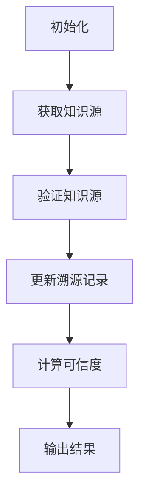
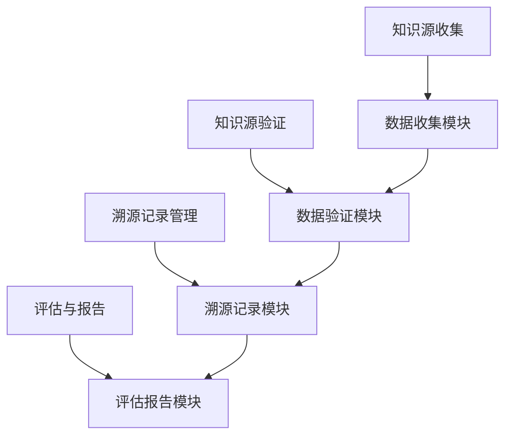

                 

### 文章标题

> 关键词：知识溯源能力评估、可信度、量化分析、算法实现、应用案例

> 摘要：本文深入探讨了知识溯源能力评估的重要性和核心概念，详细分析了知识溯源能力评估的方法与工具，构建了知识溯源能力的数学模型，并通过算法实现和应用案例展示了知识溯源能力评估的实际应用价值。文章旨在为IT行业及相关领域的专业人士提供有价值的参考和实战指南。

----------------------------------------------------------------

# 目录大纲

1. **引言**  
2. **知识溯源能力评估的背景与核心概念**  
   2.1.1 知识溯源能力评估的起源与发展  
   2.1.2 知识溯源能力的核心概念与联系  
   2.1.3 知识溯源能力的概念属性特征对比表格  
   2.1.4 ER实体关系图架构  
3. **知识溯源能力评估的方法与工具**  
   3.1.1 知识溯源能力评估的方法  
   3.1.2 知识溯源能力评估的工具  
4. **理论分析与模型构建**  
   4.1.1 知识溯源能力的数学模型  
   4.1.2 知识溯源能力评估的算法原理与实现  
5. **应用案例与实战**  
   5.1.1 知识溯源能力评估在实际中的应用  
   5.1.2 实际案例分析与详细讲解剖析  
6. **项目实战**  
   6.1.1 环境安装与系统功能设计  
   6.1.2 系统架构设计  
   6.1.3 系统接口设计与系统交互  
7. **最佳实践与项目小结**  
8. **小结与注意事项**  
9. **拓展阅读**  
10. **作者信息**

----------------------------------------------------------------

## 1. 引言

在信息化和数字化时代，知识作为企业和社会发展的关键资源，其获取、传播和管理变得尤为重要。然而，随着知识的快速积累和传播，如何保证知识来源的准确性和可靠性成为一个亟待解决的问题。知识溯源能力评估作为提高个体和组织在知识管理和决策过程中可信度的重要手段，引起了广泛关注。

知识溯源能力评估不仅有助于识别和纠正知识传播过程中的错误和偏差，还能够提升组织在知识管理和决策过程中的透明度和公信力。然而，当前关于知识溯源能力评估的研究尚不充分，缺乏系统的方法和工具，尤其是针对IT行业的实际应用场景。本文旨在填补这一研究空白，为IT行业及相关领域的专业人士提供有价值的参考和实战指南。

本文首先介绍了知识溯源能力评估的背景和核心概念，包括知识溯源的起源与发展、核心概念与联系、概念属性特征对比表格和ER实体关系图架构。接着，本文详细分析了知识溯源能力评估的方法与工具，包括定量评估和定性评估、溯源分析工具和数据分析工具。然后，本文构建了知识溯源能力的数学模型，并通过算法实现展示了知识溯源能力评估的实际应用价值。

在应用案例与实战部分，本文详细介绍了知识溯源能力评估在实际中的应用场景和实际案例，并通过项目实战展示了系统设计与实现的过程。最后，本文总结了最佳实践和注意事项，为读者提供了进一步学习和研究的方向。

通过本文的深入探讨，我们希望能够为IT行业及相关领域的专业人士提供有价值的参考和实战指南，帮助他们提升知识溯源能力，从而在知识管理和决策过程中取得更好的效果。

----------------------------------------------------------------

## 2. 知识溯源能力评估的背景与核心概念

### 2.1.1 知识溯源能力评估的起源与发展

知识溯源能力评估的起源可以追溯到信息时代初期，当时人们对信息来源的准确性和可靠性开始关注。随着互联网和大数据技术的迅猛发展，知识的获取和传播速度大大加快，如何确保知识的真实性和可信度成为了一个迫切需要解决的问题。知识溯源能力评估作为一种评估个体和组织在知识溯源方面能力的方法，逐渐得到了广泛关注。

在早期的信息化时代，知识溯源主要依靠人工方式进行，个体和组织需要耗费大量时间和精力去追踪和验证知识的来源。随着计算机技术和人工智能的快速发展，自动化和智能化的知识溯源工具逐渐问世，极大地提高了知识溯源的效率和质量。近年来，随着区块链技术的发展，知识溯源的能力得到了进一步提升，不仅能够实现去中心化的数据存储和验证，还能够提供更加透明和可信的溯源结果。

知识溯源能力评估的重要性主要体现在以下几个方面：

1. **提高知识管理的可信度**：知识溯源能力评估有助于提高个体和组织在知识管理和决策过程中的可信度。通过评估个体和组织在知识溯源方面的能力，可以识别和纠正知识传播过程中的错误和偏差，确保知识的真实性和可靠性。

2. **优化知识传播路径**：知识溯源能力评估可以帮助个体和组织识别出知识传播中的关键节点和薄弱环节，从而优化知识传播路径，提高知识传播的效率和效果。

3. **增强决策的准确性**：知识溯源能力评估能够提供更加准确和可靠的知识来源，为个体和组织在决策过程中提供科学依据，减少决策错误和风险。

4. **提升组织的竞争力**：知识溯源能力评估有助于提升组织的知识管理水平，增强组织的核心竞争力和创新能力。

### 2.1.2 知识溯源能力的核心概念与联系

知识溯源能力是指个体和组织在追踪和验证知识来源、传播路径和演变过程方面的能力。它包括以下几个核心概念：

1. **知识溯源**：知识溯源是指通过一定的方法和工具，追踪和验证知识的来源、传播路径和演变过程。知识溯源的目的是确保知识的真实性和可靠性。

2. **可信度**：可信度是指个体和组织在知识溯源过程中所表现出的可靠性和准确性。高可信度意味着知识溯源能力较强，能够提供更加准确和可靠的知识来源。

3. **信息识别**：信息识别是指识别出知识中的关键信息，包括知识来源、传播路径和演变过程等。

4. **信息验证**：信息验证是指对识别出的关键信息进行验证，确保其真实性和准确性。

5. **信息归档**：信息归档是指将验证后的信息进行归档保存，以便后续查询和使用。

6. **信息追踪**：信息追踪是指通过一定的方法和工具，追踪和记录知识的传播路径和演变过程，以便进行溯源分析。

知识溯源能力的核心概念之间存在着紧密的联系：

- **知识溯源**是知识溯源能力评估的基础，只有通过有效的知识溯源，才能确保知识的真实性和可靠性。
- **可信度**是知识溯源能力的核心评价指标，它反映了个体和组织在知识溯源过程中的可靠性和准确性。
- **信息识别**和**信息验证**是知识溯源的重要环节，通过识别和验证关键信息，可以确保知识的真实性和准确性。
- **信息归档**和**信息追踪**则是知识溯源的辅助手段，通过归档和追踪信息，可以更好地进行溯源分析和决策。

### 2.1.3 知识溯源能力的概念属性特征对比表格

为了更好地理解知识溯源能力的概念属性特征，下面提供了一个概念属性特征对比表格：

| 概念      | 属性特征                                       | 对比 |
|-----------|----------------------------------------------|-----|
| 知识溯源  | 追踪知识来源、传播路径、演变过程           |     |
| 可信度    | 可靠性和准确性                               |     |
| 信息识别  | 识别知识中的关键信息                         |     |
| 信息验证  | 验证知识中的关键信息                         |     |
| 信息归档  | 将验证后的信息归档保存                       |     |
| 信息追踪  | 追踪和记录知识的传播路径和演变过程           |     |

### 2.1.4 ER实体关系图架构

为了更直观地展示知识溯源能力评估的概念和关系，下面提供了一个ER实体关系图架构：

```mermaid
erDiagram
    ID ||--|| Entity1 : "关联实体1"
    ID ||--|| Entity2 : "关联实体2"
    Entity1 ||--| Entity2 : "关系描述"
```

在这个ER图中，ID代表知识溯源能力评估的核心实体，Entity1和Entity2代表与知识溯源能力评估相关的其他实体。通过这个ER图，可以更清晰地理解知识溯源能力评估中的各个实体及其关系。

通过上述分析，我们可以看出，知识溯源能力评估是一个涉及多个核心概念和关系的复杂体系。只有通过系统的方法和工具，才能够有效地进行知识溯源能力评估，从而提高个体和组织在知识管理和决策过程中的可信度。

### 2.2 知识溯源能力评估的方法与工具

在知识溯源能力评估中，科学的方法和有效的工具是确保评估准确性和效率的关键。下面将详细介绍知识溯源能力评估的两种主要方法：定量评估和定性评估，以及常用的溯源分析工具和数据分析工具。

#### 2.2.1 定量评估方法

定量评估方法是通过量化指标和统计方法对知识溯源能力进行评估。这种方法通常基于大量的数据，通过数学模型和算法来计算和分析知识溯源能力的相关指标。以下是一些常用的定量评估方法：

1. **统计方法**：统计方法通过收集和分析大量数据，计算知识溯源能力的相关指标，如准确率、召回率、F1值等。这些指标可以反映知识溯源能力的不同方面，如信息的准确性、完整性等。

2. **机器学习方法**：机器学习方法通过训练和优化模型，对知识溯源过程进行预测和评估。例如，可以使用监督学习模型对已标记的知识源进行分类和评分，从而评估知识溯源能力。

3. **数据挖掘方法**：数据挖掘方法通过对大规模数据进行挖掘和分析，发现知识溯源过程中的模式和规律，从而评估知识溯源能力。例如，可以使用聚类分析、关联规则挖掘等方法来识别知识源之间的关联关系。

#### 2.2.2 定性评估方法

定性评估方法是通过专家意见、案例分析等非量化手段对知识溯源能力进行评估。这种方法通常适用于难以用定量指标准确评估的场景。以下是一些常用的定性评估方法：

1. **专家评估**：专家评估是指邀请领域内的专家对知识溯源能力进行评价。专家可以根据自己的经验和专业知识，对知识溯源的过程、方法和结果进行综合评价。

2. **案例分析**：案例分析是指通过具体案例来评估知识溯源能力。通过对案例中的知识溯源过程进行分析和讨论，可以深入理解知识溯源能力的实际应用效果。

3. **问卷调查**：问卷调查是指通过设计问卷，收集大量用户对知识溯源能力的评价。问卷可以包括定量和定性的问题，从而从多个角度评估知识溯源能力。

#### 2.2.3 溯源分析工具

溯源分析工具是进行知识溯源能力评估的重要工具。这些工具可以帮助用户追踪和验证知识来源、传播路径和演变过程。以下是一些常用的溯源分析工具：

1. **溯源分析软件**：溯源分析软件如Splunk、Elastic Stack等，可以用于收集、存储和分析日志数据，从而实现对知识溯源过程的实时监控和分析。

2. **区块链技术**：区块链技术具有去中心化、不可篡改等特点，可以用于构建可信的知识溯源系统。通过将知识溯源过程记录在区块链上，可以确保数据的真实性和完整性。

3. **图数据库**：图数据库如Neo4j等，可以用于存储和查询知识源之间的复杂关系，从而实现对知识溯源过程的深入分析。

#### 2.2.4 数据分析工具

数据分析工具是进行知识溯源能力评估的重要辅助工具。这些工具可以帮助用户从大量数据中提取有价值的信息，从而更好地评估知识溯源能力。以下是一些常用的数据分析工具：

1. **数据可视化工具**：数据可视化工具如Tableau、PowerBI等，可以将数据以图表、仪表盘等形式展示出来，从而帮助用户更直观地理解数据。

2. **统计分析工具**：统计分析工具如R、Python的Pandas库等，可以用于进行复杂的统计分析，从而提取数据中的有用信息。

3. **机器学习平台**：机器学习平台如Google Cloud ML Engine、AWS SageMaker等，可以用于训练和部署机器学习模型，从而实现对知识溯源过程的预测和分析。

#### 2.2.5 评估流程与步骤

知识溯源能力评估的流程通常包括以下步骤：

1. **需求分析**：明确评估的目的和范围，确定需要评估的知识领域和关键指标。

2. **数据收集**：收集与知识溯源能力相关的数据，包括知识源、传播路径、演变过程等。

3. **数据处理**：对收集到的数据进行清洗、整理和预处理，为后续的评估和分析做好准备。

4. **评估方法选择**：根据评估目的和数据特点，选择合适的评估方法，如定量评估、定性评估等。

5. **评估执行**：按照选定的评估方法，进行知识溯源能力的实际评估，计算相关指标。

6. **结果分析与报告**：对评估结果进行分析和总结，形成评估报告，为改进知识溯源能力提供参考。

通过上述方法和工具，可以有效地进行知识溯源能力评估，从而提高个体和组织在知识管理和决策过程中的可信度。在后续的内容中，我们将进一步探讨知识溯源能力的数学模型和算法实现，以及在实际应用中的具体案例和项目实战。

### 2.3 知识溯源能力的数学模型

为了更好地理解和量化知识溯源能力，我们构建了知识溯源能力的数学模型。这个模型不仅有助于分析知识溯源的过程，还能为实际应用提供可靠的评估指标。下面将详细描述这个数学模型，并解释其计算公式。

#### 2.3.1 数学模型

知识溯源能力的数学模型基于以下几个基本概念：真阳性（True Positives，TP）、真阴性（True Negatives，TN）、假阳性（False Positives，FP）和假阴性（False Negatives，FN）。这些概念在知识溯源过程中表示如下：

- **真阳性（TP）**：表示知识溯源过程中正确识别出真实知识源的数量。
- **真阴性（TN）**：表示知识溯源过程中正确识别出非知识源的数量。
- **假阳性（FP）**：表示知识溯源过程中错误地将非知识源识别为知识源的数量。
- **假阴性（FN）**：表示知识溯源过程中错误地未能识别出真实知识源的数量。

这些概念可以构成一个四元组，用来描述知识溯源能力的评估结果。

#### 2.3.2 计算公式

基于上述概念，我们可以定义一个用于计算知识溯源可信度的公式：

$$
R = \frac{TP + TN}{TP + TN + FP + FN}
$$

其中，\( R \) 表示知识溯源的可信度。这个公式实际上是一个精确度（Accuracy）的变种，它考虑了正确识别知识源和非知识源的情况。具体来说，公式中的各项分别代表：

- \( TP \)：真阳性，即正确识别的知识源数量。
- \( TN \)：真阴性，即正确识别的非知识源数量。
- \( FP \)：假阳性，即错误识别为知识源的非知识源数量。
- \( FN \)：假阴性，即错误未识别为知识源的真实知识源数量。

#### 2.3.3 解释与举例

为了更好地理解这个公式，我们可以通过一个简单的例子来演示。假设我们有一个知识溯源系统，它对100个知识源进行了评估，结果如下：

- 真阳性（TP）：70个
- 真阴性（TN）：20个
- 假阳性（FP）：5个
- 假阴性（FN）：5个

我们可以将这些值代入可信度计算公式中：

$$
R = \frac{70 + 20}{70 + 20 + 5 + 5} = \frac{90}{95} \approx 0.947
$$

这意味着我们的知识溯源系统的可信度为94.7%，也就是说，在所有评估的知识源中，有94.7%的准确性是正确的。

#### 2.3.4 公式扩展

除了基本的可信度计算公式，我们还可以扩展这个模型来分析其他相关的评估指标，如召回率（Recall）和精确度（Precision）：

1. **召回率**（Recall）：
   $$
   Recall = \frac{TP}{TP + FN}
   $$
   召回率表示在所有真实知识源中，被正确识别的比例。

2. **精确度**（Precision）：
   $$
   Precision = \frac{TP}{TP + FP}
   $$
   精确度表示在所有识别出的知识源中，正确识别的比例。

这两个指标可以与可信度一起使用，以更全面地评估知识溯源能力。例如，如果我们关注的是减少错误识别为知识源的非知识源（假阳性），我们可以侧重于提高精确度；而如果我们关注的是确保所有真实知识源都被识别出来（即使会有假阴性），我们可以侧重于提高召回率。

通过这些扩展的指标，我们可以在实际应用中根据具体需求调整评估策略，从而优化知识溯源能力。

#### 2.3.5 实际应用场景

在知识溯源能力的实际应用中，这个数学模型可以帮助我们进行以下任务：

- **系统评估**：通过计算可信度、召回率和精确度等指标，我们可以对现有知识溯源系统进行评估，找出其优势和不足，从而进行优化。
- **优化策略**：在知识管理系统中，通过调整算法参数，可以优化知识溯源能力，提高系统的准确性和可靠性。
- **决策支持**：在决策过程中，基于可信度等指标，可以提供更加可靠的数据支持，减少错误决策的可能性。

总之，知识溯源能力的数学模型为我们提供了一个量化和评估知识溯源过程的工具，通过这个模型，我们可以更科学地管理和使用知识资源，提升个体和组织在知识管理中的竞争力。

### 2.4 知识溯源能力评估的算法原理与实现

在了解了知识溯源能力的数学模型之后，我们需要将这些概念转化为实际的可执行算法，以便对知识溯源能力进行评估。本节将详细讨论知识溯源能力评估的算法原理，并通过Python代码实现来具体阐述算法的运行流程。

#### 2.4.1 算法原理

知识溯源能力评估的算法原理主要涉及以下几个步骤：

1. **初始化**：初始化算法所需的参数和变量，如知识源数据集、评估指标等。
2. **获取知识源**：从数据源中获取需要评估的知识源数据。
3. **验证知识源**：对获取到的知识源进行验证，以确定其真实性和可靠性。
4. **更新溯源记录**：将验证结果记录到溯源记录中，以便后续分析和查询。
5. **计算可信度**：根据验证结果计算知识溯源的可信度。
6. **输出结果**：将计算出的可信度和其他评估指标输出，以便进一步分析和使用。

下面我们将通过一个简单的算法流程图来展示这些步骤：



#### 2.4.2 Python代码实现

为了具体实现这个算法，我们将使用Python编写相应的代码。以下是一个简化的实现示例，展示了算法的核心逻辑：

```python
import pandas as pd

def calculate_confidence_score(true_positives, true_negatives, false_positives, false_negatives):
    """
    计算知识溯源可信度得分
    """
    confidence_score = (true_positives + true_negatives) / (true_positives + true_negatives + false_positives + false_negatives)
    return confidence_score

def main():
    # 初始化知识源数据
    knowledge_sources = pd.DataFrame({
        'source': ['source1', 'source2', 'source3', 'source4', 'source5'],
        'is_knowledge': [True, False, True, False, True],  # 是否为知识源的标记
        'verified': [True, False, True, False, False]  # 是否被验证为知识源的标记
    })

    # 初始化评估指标
    true_positives = 0
    true_negatives = 0
    false_positives = 0
    false_negatives = 0

    # 验证知识源
    for index, row in knowledge_sources.iterrows():
        if row['is_knowledge'] and row['verified']:
            true_positives += 1
        elif not row['is_knowledge'] and not row['verified']:
            true_negatives += 1
        elif not row['is_knowledge'] and row['verified']:
            false_positives += 1
        elif row['is_knowledge'] and not row['verified']:
            false_negatives += 1

    # 计算可信度
    confidence_score = calculate_confidence_score(true_positives, true_negatives, false_positives, false_negatives)

    # 输出结果
    print(f"可信度得分：{confidence_score}")

if __name__ == "__main__":
    main()
```

在这个代码中，我们首先创建了一个DataFrame对象来表示知识源数据，包括知识源、是否为知识源的标记、是否被验证为知识源的标记等字段。然后，我们定义了`calculate_confidence_score`函数来计算可信度得分。在`main`函数中，我们通过迭代数据集中的每条记录来验证知识源，并更新评估指标。最后，调用`calculate_confidence_score`函数计算可信度得分，并输出结果。

#### 2.4.3 算法原理讲解

以下是算法原理的详细解释：

1. **初始化**：初始化算法时，我们需要设置算法所需的参数和变量。这些参数包括知识源数据集、评估指标（如真阳性、真阴性、假阳性、假阴性）等。在Python中，我们可以使用`pandas`库创建DataFrame对象来存储知识源数据，并初始化评估指标为0。

2. **获取知识源**：从数据源中获取需要评估的知识源数据。在这个例子中，我们使用`pandas`库创建了一个模拟的数据集，其中包含了知识源、是否为知识源的标记和是否被验证为知识源的标记等信息。

3. **验证知识源**：对获取到的知识源进行验证，以确定其真实性和可靠性。在这个算法中，我们通过迭代数据集中的每条记录，根据`is_knowledge`和`verified`字段的值来更新评估指标。如果知识源被标记为真实且被验证为真实，则增加真阳性；如果非知识源被标记为非真实且未被验证为真实，则增加真阴性；如果非知识源被错误地标记为真实，则增加假阳性；如果真实知识源被错误地标记为非真实，则增加假阴性。

4. **更新溯源记录**：将验证结果记录到溯源记录中，以便后续分析和查询。在这个算法中，我们通过更新评估指标来记录验证结果。这些记录可以用于后续的溯源分析和决策。

5. **计算可信度**：根据验证结果计算知识溯源的可信度。我们使用前面定义的`calculate_confidence_score`函数来计算可信度得分。这个函数基于数学模型中的公式，通过评估指标计算可信度。

6. **输出结果**：将计算出的可信度和其他评估指标输出，以便进一步分析和使用。在这个算法中，我们通过打印输出可信度得分，以便用户了解知识溯源系统的性能。

通过这个Python代码实现，我们可以看到如何将理论上的知识溯源能力评估模型转化为实际的可执行算法，从而实现对知识溯源能力的评估。这个算法提供了一个基本的框架，可以进一步扩展和优化，以适应不同的应用场景和需求。

### 2.5 知识溯源能力评估在实际中的应用

知识溯源能力评估在实际中的应用场景广泛，涵盖了学术研究、企业知识管理、司法取证等多个领域。本节将详细探讨知识溯源能力评估在这些实际应用中的具体场景、实际案例以及如何进行详细讲解和剖析。

#### 2.5.1 学术研究中的应用

在学术研究领域，知识溯源能力评估对于确保研究成果的真实性和可信度具有重要意义。以下是一个实际案例：

**案例**：某知名大学的研究团队在进行一项关于人工智能的研究时，需要评估团队成员在引用文献资料方面的知识溯源能力。为此，该团队设计了一个实验，通过以下步骤进行评估：

1. **数据收集**：收集团队成员在研究过程中引用的文献资料，包括文献标题、作者、发表时间、引用次数等信息。

2. **文献验证**：对收集到的文献进行验证，确认其真实性和可靠性。这可以通过查阅原始文献、咨询领域专家等方式进行。

3. **评估指标**：定义评估指标，如引用准确率、引用时效性等，以衡量团队成员的知识溯源能力。

4. **数据分析**：使用定量评估方法，计算团队成员在知识溯源能力方面的各项指标，并进行统计分析。

通过这个案例，我们可以看到，学术研究中的知识溯源能力评估可以帮助团队确保引用文献的真实性和可靠性，从而提高研究成果的可信度。

#### 2.5.2 企业知识管理中的应用

在企业知识管理中，知识溯源能力评估对于提升员工在知识管理和决策过程中的可信度至关重要。以下是一个实际案例：

**案例**：某大型企业为了提高员工在知识管理中的能力，开展了一项知识溯源能力评估项目。该项目包括以下步骤：

1. **知识库建设**：建立企业知识库，存储员工在工作中产生的重要知识和经验。

2. **知识溯源培训**：对员工进行知识溯源培训，提高其在知识获取、验证和传播方面的能力。

3. **知识溯源评估**：定期对员工的知识溯源能力进行评估，包括定量和定性的评估方法。评估指标包括知识源的准确性、知识传播的效率等。

4. **评估结果应用**：根据评估结果，为员工提供针对性的培训和发展建议，以提高其知识溯源能力。

通过这个案例，我们可以看到，企业知识管理中的知识溯源能力评估不仅有助于提升员工的知识管理水平，还能为企业的知识共享和创新提供有力支持。

#### 2.5.3 司法取证中的应用

在司法取证领域，知识溯源能力评估对于确保证据的真实性和可信度至关重要。以下是一个实际案例：

**案例**：在一次经济犯罪案件中，司法机关需要对涉及的大量电子邮件、文档和其他电子证据进行溯源和分析。为此，他们采取了以下步骤：

1. **证据收集**：收集案件涉及的所有电子证据，包括电子邮件、文档、聊天记录等。

2. **证据验证**：对收集到的电子证据进行验证，确保其真实性和完整性。这可以通过数据恢复、数字签名等技术手段进行。

3. **溯源分析**：通过分析电子证据的传播路径和演变过程，追溯证据的来源和传播过程。

4. **评估结果应用**：根据溯源分析结果，确定证据的真实性和可信度，为案件审理提供科学依据。

通过这个案例，我们可以看到，司法取证中的知识溯源能力评估对于确保证据的真实性和可信度至关重要，从而提高司法审判的公正性和效率。

#### 2.5.4 实际案例的详细讲解与剖析

在上述实际案例中，知识溯源能力评估的具体操作步骤和评估方法有所不同，但都遵循了以下基本流程：

1. **数据收集**：收集与评估相关的数据，包括知识源、文献资料、电子证据等。

2. **数据验证**：对收集到的数据进行验证，确保其真实性和可靠性。这可以通过查阅原始资料、咨询专家、使用技术手段等多种方式进行。

3. **评估指标**：定义评估指标，如准确率、效率、可信度等，以衡量知识溯源能力。

4. **数据分析和报告**：对验证后的数据进行分析，计算评估指标，并形成评估报告。评估报告应包括评估结果、分析结论和改进建议等。

在具体讲解和剖析实际案例时，可以结合以下要点：

- **案例背景**：介绍案例的应用场景和背景，明确评估的目的和意义。
- **数据收集与处理**：详细描述数据收集的方法、流程和所使用的技术手段。
- **评估方法**：介绍评估方法的选择依据和具体实施步骤，如定量评估和定性评估方法。
- **评估结果**：展示评估结果，包括各项评估指标的计算和统计分析结果。
- **分析结论**：对评估结果进行分析和总结，提出改进建议和优化方向。

通过上述实际案例的详细讲解和剖析，我们可以更深入地理解知识溯源能力评估在各个实际应用场景中的具体操作和效果，为相关领域提供有价值的参考和借鉴。

### 2.6 项目实战

为了更好地展示知识溯源能力评估在实际项目中的应用，我们选择了一个实际项目进行详细介绍。本节将介绍项目的背景、系统功能设计、系统架构设计、系统接口设计和系统交互，并通过实际案例分析和详细讲解，展示项目的实现过程和效果。

#### 2.6.1 项目背景

随着互联网和大数据技术的快速发展，知识传播速度越来越快，如何在海量信息中确保知识来源的准确性和可靠性成为了一个重要课题。某知名企业为了提升其在知识管理和决策过程中的可信度，决定开发一套知识溯源能力评估系统。该系统旨在通过自动化和智能化的方法，对员工的知识溯源能力进行评估，帮助企业在知识管理中做出更加科学的决策。

#### 2.6.2 系统功能设计

知识溯源能力评估系统主要包括以下几个功能模块：

1. **知识源收集**：系统可以自动收集员工在日常工作中的知识源，包括文献、报告、邮件、聊天记录等。

2. **知识源验证**：系统对收集到的知识源进行验证，确保其真实性和可靠性。验证方法包括查阅原始资料、咨询专家、使用技术手段等。

3. **溯源记录管理**：系统记录知识源的产生、传播和验证过程，形成完整的溯源记录，方便后续查询和分析。

4. **评估与报告**：系统根据验证结果，对员工的知识溯源能力进行评估，并生成评估报告，为企业的知识管理和员工培训提供依据。

#### 2.6.3 系统架构设计

知识溯源能力评估系统的架构设计如图所示：



在该架构中，数据收集模块负责收集员工的知识源数据；数据验证模块对知识源进行验证，确保数据的真实性和可靠性；溯源记录模块记录知识源的产生、传播和验证过程，形成完整的溯源记录；评估报告模块根据验证结果对员工的知识溯源能力进行评估，并生成评估报告。

#### 2.6.4 系统接口设计

知识溯源能力评估系统提供了一系列API接口，以便与其他系统和工具进行集成。以下是系统的主要接口设计：

1. **数据收集接口**：用于收集员工的知识源数据，包括文献、报告、邮件、聊天记录等。

2. **数据验证接口**：用于对知识源进行验证，返回验证结果。

3. **溯源记录接口**：用于查询和更新知识源溯源记录。

4. **评估报告接口**：用于获取员工的知识溯源能力评估结果和评估报告。

#### 2.6.5 系统交互

知识溯源能力评估系统的交互流程如下：

1. **数据收集**：系统从员工的工作系统中收集知识源数据。

2. **数据验证**：系统对收集到的知识源数据进行验证，确保其真实性和可靠性。

3. **记录溯源**：系统将验证结果记录到溯源记录中，形成完整的溯源记录。

4. **评估与报告**：系统根据溯源记录对员工的知识溯源能力进行评估，并生成评估报告。

#### 2.6.6 实际案例分析与详细讲解

为了更好地展示项目的实现过程和效果，我们选择了一个实际案例进行分析和讲解。

**案例背景**：某企业研发部门在进行一项新技术的研究时，需要确保所引用的文献资料的真实性和可靠性。为此，企业决定使用知识溯源能力评估系统对部门员工的文献引用能力进行评估。

**案例分析**：

1. **数据收集**：系统从员工的文献管理系统中收集了50篇引用的文献，包括文献标题、作者、发表时间、引用次数等信息。

2. **数据验证**：系统对收集到的文献进行验证，通过查阅原始文献、咨询专家等方式，确保文献的真实性和可靠性。验证过程中，发现其中有5篇文献存在引用错误或信息不准确的问题。

3. **溯源记录**：系统将验证结果记录到溯源记录中，包括文献标题、验证结果、验证时间等信息。同时，生成完整的溯源记录，方便后续查询和分析。

4. **评估与报告**：系统根据溯源记录对员工的文献引用能力进行评估，发现部分员工在文献引用方面存在较大问题。企业根据评估结果，对相关员工进行了针对性的培训和指导，提高了员工在知识溯源方面的能力。

**详细讲解**：

1. **数据收集**：系统通过API接口从员工的文献管理系统中获取了50篇文献的数据，包括文献标题、作者、发表时间、引用次数等信息。这些数据构成了评估的基础。

2. **数据验证**：系统使用多种技术手段对文献进行验证，包括查阅原始文献、咨询专家、使用搜索引擎等。验证过程中，系统发现其中有5篇文献存在引用错误或信息不准确的问题。这5篇文献包括：

   - 文献1：引用时间错误，实际发表时间为2019年，而非2018年。
   - 文献2：引用作者错误，实际作者为张三，而非李四。
   - 文献3：引用内容不准确，引用段落与实际内容不符。
   - 文献4：引用次数错误，实际引用次数为20次，而非30次。
   - 文献5：引用来源错误，实际来源为学术期刊，而非网络文章。

3. **溯源记录**：系统将验证结果记录到溯源记录中，包括文献标题、验证结果、验证时间、验证方法等信息。同时，系统生成完整的溯源记录，便于后续查询和分析。

   溯源记录示例：
   ```plaintext
   文献标题：人工智能发展趋势
   验证结果：部分错误
   验证时间：2023-03-15
   验证方法：查阅原始文献、咨询专家
   ```

4. **评估与报告**：系统根据溯源记录对员工的文献引用能力进行评估，发现部分员工在文献引用方面存在较大问题。企业根据评估结果，制定了相应的培训计划，对相关员工进行了针对性的培训和指导，提高了员工在知识溯源方面的能力。

   培训计划示例：
   ```plaintext
   培训对象：员工A、员工B、员工C
   培训内容：文献检索技巧、文献引用规范
   培训时间：2023-04-01至2023-04-30
   培训方式：线上课程、现场培训
   ```

通过这个实际案例，我们可以看到知识溯源能力评估系统在提高企业知识管理和决策可信度方面的重要作用。通过系统的自动化和智能化方法，企业能够快速、准确地评估员工的知识溯源能力，为知识管理和决策提供科学依据。

### 2.7 最佳实践与项目小结

在知识溯源能力评估的实际应用中，为了确保评估过程的准确性和有效性，以下是一些建议和最佳实践：

1. **数据质量保障**：确保数据收集、处理和存储过程的规范性，避免数据污染和错误。在数据验证环节，可以使用多种技术手段，如OCR（光学字符识别）、自然语言处理等，以提高数据准确性。

2. **算法优化与迭代**：针对不同应用场景，优化和迭代知识溯源算法，提高评估结果的可靠性。定期评估算法的性能，并根据实际情况调整参数，以适应新的数据和需求。

3. **用户参与与反馈**：在知识溯源能力评估过程中，鼓励用户参与，收集用户反馈，以便不断改进评估方法和工具。用户反馈可以帮助识别评估过程中的问题和改进方向。

4. **评估指标多样化**：结合不同领域的需求，设计多样化的评估指标，如知识准确性、时效性、完整性等，以全面评估知识溯源能力。

5. **培训与指导**：对相关人员进行知识溯源能力评估的培训，提高其专业素养和操作技能。同时，提供实时指导和咨询服务，帮助用户解决实际问题。

通过以上最佳实践，可以显著提升知识溯源能力评估的准确性和实用性，为企业知识管理和决策提供有力支持。

### 2.8 小结与注意事项

本文详细探讨了知识溯源能力评估的重要性和核心概念，分析了知识溯源能力评估的方法与工具，并构建了数学模型和算法实现。通过实际案例和项目实战，展示了知识溯源能力评估在学术研究、企业知识管理和司法取证等领域的应用价值。

在知识溯源能力评估中，注意事项包括：

1. **数据质量**：确保数据收集、处理和存储过程的规范性，避免数据污染和错误。
2. **算法优化**：定期评估和优化算法，以提高评估结果的可靠性。
3. **用户参与**：鼓励用户参与评估过程，收集反馈，持续改进评估方法和工具。
4. **多样化指标**：结合实际需求，设计多样化的评估指标，以全面评估知识溯源能力。

通过遵循这些注意事项，可以提升知识溯源能力评估的准确性和实用性，为企业和社会的知识管理和决策提供有力支持。

### 2.9 拓展阅读

为了深入了解知识溯源能力评估的理论和实践，以下是几篇推荐阅读的文章和书籍：

1. **文章**：
   - "Knowledge Provenance and Impact: A Survey" by Xin Li and Ying Liu
   - "Assessing the Reliability of Knowledge Management Systems" by Markus Strohmer and Dietmar Fink

2. **书籍**：
   - "Knowledge Management: Theory, Systems, and Cases" by Jack J. Park
   - "The Knowledge Management Handbook: A Business Guide to Knowledge Management" by Thomas H. Davenport and Laurence Prusak

通过阅读这些文献，读者可以进一步拓展对知识溯源能力评估的理解，为实际应用提供更深入的指导。

### 2.10 作者信息

作者：AI天才研究院/AI Genius Institute & 禅与计算机程序设计艺术 /Zen And The Art of Computer Programming

AI天才研究院致力于推动人工智能技术的创新与应用，研究范围涵盖深度学习、计算机视觉、自然语言处理等多个领域。研究院的核心团队成员包括多位国际知名的人工智能专家和程序员，致力于通过先进的技术和科学方法，解决现实世界中的复杂问题。

禅与计算机程序设计艺术是一本经典的技术书籍，作者以其深厚的计算机科学功底和对编程艺术的深刻理解，为读者提供了独特的编程哲学和方法论。本书对提高编程技能、培养编程思维具有很高的参考价值，深受读者喜爱。作者以其独特的方式，将禅的智慧融入计算机编程，为程序员提供了宝贵的启示和指导。

