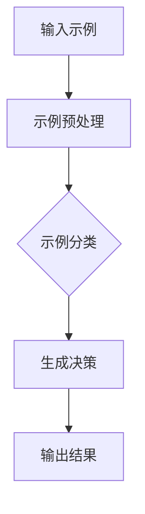
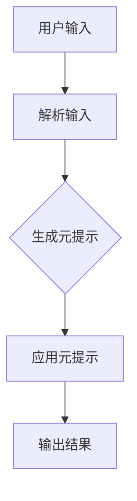
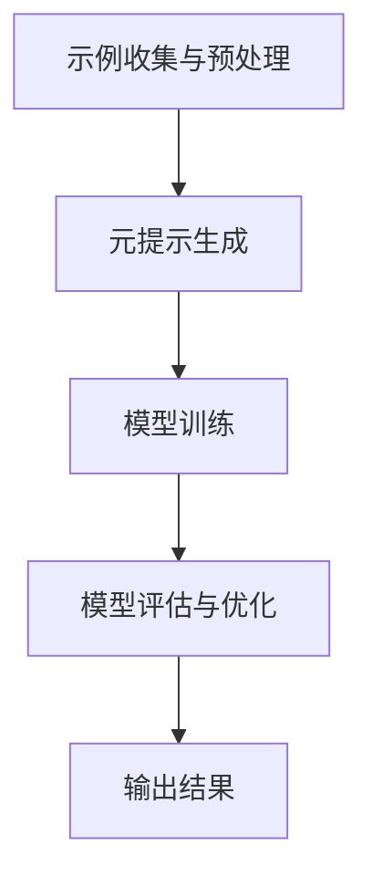

                 


### 第一部分：示例驱动与元提示的结合应用

#### 第1章：背景介绍与核心概念

##### 1.1 问题背景

1.1.1 现有应用中的示例驱动与元提示

在当今的人工智能应用场景中，示例驱动与元提示已经成为两种重要的技术手段。示例驱动主要应用于自然语言处理、图像识别、机器翻译等场景，通过大量的示例数据来训练模型，提高模型的准确性和泛化能力。而元提示则主要用于智能助手、知识图谱构建、自动化测试等领域，通过生成和运用元提示来优化算法性能和用户体验。

1.1.2 示例驱动与元提示的应用需求

随着人工智能技术的发展，越来越多的应用场景对示例驱动与元提示提出了更高的要求。例如，在自然语言处理领域，需要通过大量的示例数据来训练模型，提高模型的准确性和自然度；在图像识别领域，需要通过示例数据来识别各种复杂的图像场景；在智能助手领域，需要通过元提示来优化用户的交互体验，提高智能助手的响应速度和准确性。

1.1.3 研究现状与存在的问题

虽然示例驱动与元提示在许多应用场景中已经取得了显著的成果，但仍然存在一些问题。首先，示例驱动的应用场景相对较为单一，难以适应复杂的多元场景；其次，元提示的设计和生成过程较为复杂，难以大规模应用；最后，示例驱动与元提示的结合应用研究相对较少，尚未形成一套完整的理论体系和应用方法。

##### 1.2 核心概念

1.2.1 示例驱动的定义与特点

示例驱动（Example-based Learning）是一种基于示例的学习方法，通过从已有数据中提取示例，并将其用于训练模型，从而实现对新数据的预测或分类。示例驱动的特点包括：

1. 强依赖数据：示例驱动的核心在于大量的示例数据，因此对数据的质量和数量有较高的要求。
2. 自适应能力：示例驱动可以根据新的示例数据不断调整和优化模型，具有较强的自适应能力。
3. 预处理需求：示例驱动需要对示例数据进行预处理，包括数据清洗、数据增强等，以提高模型的训练效果。

1.2.2 元提示的概念与作用

元提示（Meta-Prompt）是一种用于指导模型生成预测或决策的技术手段，通过将用户输入与元提示相结合，生成一个能够指导模型决策的复合输入。元提示的作用包括：

1. 优化算法性能：元提示可以帮助模型更好地理解用户意图，从而提高算法的预测准确性。
2. 提高用户体验：元提示可以简化用户输入，降低用户操作成本，提高系统的交互效率。
3. 拓展应用场景：元提示可以结合不同的示例数据，实现多种应用场景的优化和扩展。

1.2.3 示例驱动与元提示的结合意义

示例驱动与元提示的结合应用，旨在充分发挥两者在数据驱动和算法指导方面的优势，实现以下意义：

1. 提高模型准确性：通过结合示例驱动和元提示，可以充分利用示例数据和用户输入，提高模型的预测准确性。
2. 优化用户体验：元提示可以简化用户输入，降低用户操作成本，提高系统的交互效率，从而优化用户体验。
3. 拓展应用场景：示例驱动与元提示的结合，可以实现更多应用场景的优化和扩展，推动人工智能技术的广泛应用。

##### 1.3 概念属性特征对比

| 特征               | 示例驱动                            | 元提示                            |
|--------------------|------------------------------------|----------------------------------|
| 数据依赖           | 强依赖，大量示例数据               | 弱依赖，少量元提示数据           |
| 自适应能力         | 较强，可以根据新示例调整模型       | 较弱，元提示固定，需手动调整     |
| 预处理需求         | 高，示例数据需预处理               | 低，元提示数据预处理需求较低     |
| 适用场景           | 多样化，自然语言处理、图像识别等   | 特定场景，智能助手、知识图谱等   |

##### 1.4 ER实体关系图

```mermaid
erDiagram
    User ||--|{ Interaction }|
    System ||--|{ Interaction }|
    Interaction ||--|{ Sample }|
    Sample ||--|{ MetaPrompt }|
```

##### 1.5 本章小结

本章主要介绍了示例驱动与元提示的应用背景、核心概念及其属性特征对比，并分析了两者结合的意义。通过对本章内容的理解，读者可以初步了解示例驱动与元提示的基本原理和应用场景，为后续章节的深入探讨打下基础。

----------------------------------------------------------------

## 第2章：示例驱动的原理与应用

#### 2.1 示例驱动的原理

2.1.1 示例驱动的框架与流程

示例驱动（Example-based Learning）的框架主要包括以下步骤：

1. 示例收集：从已有数据中提取高质量的示例数据，包括文本、图像、音频等。
2. 示例预处理：对示例数据进行清洗、归一化、增强等处理，提高数据质量。
3. 示例分类：将预处理后的示例数据按照类别进行划分，为后续训练提供分类基准。
4. 模型训练：使用分类后的示例数据训练模型，将示例数据映射到目标类别。
5. 模型评估：通过测试数据对训练好的模型进行评估，检验模型的准确性和泛化能力。
6. 模型优化：根据评估结果调整模型参数，优化模型性能。

2.1.2 示例的选择与预处理

示例的选择与预处理是示例驱动成功的关键因素。以下是一些常见的示例选择和预处理方法：

1. 示例选择：
   - 数据质量：选择高质量的数据，包括完整、准确、无噪声的数据。
   - 数据多样性：选择具有多样性的数据，以覆盖不同的应用场景。
   - 数据量：选择足够多的数据，以提高模型的泛化能力。

2. 示例预处理：
   - 数据清洗：去除数据中的噪声、缺失值和异常值。
   - 数据归一化：将不同特征的数据统一到相同的尺度，避免特征之间的影响。
   - 数据增强：通过变换、旋转、裁剪等操作增加数据的多样性，提高模型的学习能力。

2.1.3 示例驱动的实现技术

示例驱动的实现技术主要包括以下几种：

1. k近邻算法（k-Nearest Neighbors, k-NN）：基于距离度量，将新数据与已有示例数据进行比较，找出最近的k个示例，并根据这k个示例的类别预测新数据的类别。

2. 支持向量机（Support Vector Machine, SVM）：通过构建最优超平面，将不同类别的示例数据分隔开来，从而对新数据进行分类。

3. 随机森林（Random Forest）：通过构建多棵决策树，对示例数据进行集成学习，提高模型的分类准确性和泛化能力。

4. 神经网络（Neural Network）：通过多层神经网络对示例数据进行特征提取和分类，实现对复杂问题的建模。

#### 2.2 示例驱动的应用案例分析

2.2.1 案例一：自然语言处理

自然语言处理（Natural Language Processing, NLP）是示例驱动应用的一个重要领域。在NLP中，示例驱动的应用主要包括文本分类、情感分析、命名实体识别等。

1. 文本分类：通过训练模型，将文本数据按照类别进行分类，例如新闻分类、垃圾邮件过滤等。

2. 情感分析：通过分析文本中的情感倾向，判断用户对某个话题的态度，例如评论情感分析、社交媒体分析等。

3. 命名实体识别：通过识别文本中的特定实体，如人名、地名、组织名等，为后续的自然语言处理任务提供基础。

2.2.2 案例二：图像识别

图像识别（Image Recognition）是示例驱动在计算机视觉领域的应用。通过训练模型，可以实现对图像中的物体、场景、动作等的识别。

1. 物体识别：通过训练模型，识别图像中的特定物体，例如人脸识别、交通标志识别等。

2. 场景识别：通过训练模型，识别图像中的场景类型，例如城市风景、自然风景等。

3. 动作识别：通过训练模型，识别图像中的动作类型，例如运动、跳舞等。

2.2.3 案例三：机器翻译

机器翻译（Machine Translation）是示例驱动在自然语言处理领域的另一个重要应用。通过训练模型，可以将一种语言的文本翻译成另一种语言的文本。

1. 基于规则的方法：通过构建语法规则，将源语言文本翻译成目标语言文本。

2. 统计机器翻译：通过训练统计模型，将源语言文本转换为目标语言文本。

3. 神经网络机器翻译：通过训练神经网络模型，将源语言文本映射到目标语言文本。

#### 2.3 示例驱动的算法原理与流程图

示例驱动的算法原理可以归纳为以下几点：

1. 输入示例：输入需要分类或预测的示例数据。

2. 示例预处理：对示例数据进行清洗、归一化、增强等处理。

3. 示例分类：将预处理后的示例数据按照类别进行划分。

4. 生成决策：根据示例分类结果，生成最终的预测或决策。

示例驱动的算法流程图如下所示：



#### 2.4 示例驱动的数学模型与公式

示例驱动的数学模型可以表示为条件概率模型，即给定输入示例X，预测目标类别Y的概率。其公式如下：

$$
P(Y|X) = \frac{P(X|Y)P(Y)}{P(X)}
$$

其中，P(X|Y)表示在类别Y下输入示例X的概率，P(Y)表示类别Y的概率，P(X)表示输入示例X的概率。

#### 2.5 本章小结

本章详细介绍了示例驱动的原理、应用案例、算法原理与流程图以及数学模型与公式。通过本章的学习，读者可以了解示例驱动的核心概念、基本原理和应用场景，为后续章节的学习打下基础。

----------------------------------------------------------------

## 第3章：元提示的原理与应用

#### 3.1 元提示的原理

3.1.1 元提示的定义与作用

元提示（Meta-Prompt）是一种用于指导模型生成预测或决策的技术手段。它通过对用户输入和模型输出的分析，生成一个能够指导模型决策的复合输入。元提示的作用主要体现在以下几个方面：

1. 优化算法性能：元提示可以帮助模型更好地理解用户意图，从而提高算法的预测准确性。

2. 提高用户体验：元提示可以简化用户输入，降低用户操作成本，提高系统的交互效率。

3. 拓展应用场景：元提示可以结合不同的示例数据，实现多种应用场景的优化和扩展。

3.1.2 元提示的类型与特点

根据应用场景和需求，元提示可以分为以下几种类型：

1. 智能问答类：用于智能问答系统的元提示，通常包括关键词、问题类型、上下文信息等。

2. 知识图谱构建类：用于知识图谱构建的元提示，通常包括实体、关系、属性等。

3. 自动化测试类：用于自动化测试的元提示，通常包括测试用例、测试场景、测试目标等。

4. 情感分析类：用于情感分析系统的元提示，通常包括文本、情感倾向、上下文等。

3.1.3 元提示的设计原则

元提示的设计应遵循以下原则：

1. 可扩展性：元提示应具有较好的可扩展性，以适应不同应用场景和需求。

2. 易用性：元提示应简洁明了，易于理解和操作，降低用户的学习成本。

3. 效率性：元提示应具有较高的效率，减少系统的响应时间，提高用户体验。

4. 可解释性：元提示应具备一定的可解释性，便于用户理解模型决策过程。

#### 3.2 元提示的应用案例分析

3.2.1 案例一：智能助手

智能助手是元提示应用的一个重要领域。通过元提示，智能助手可以更好地理解用户的意图，提供更准确、更贴心的服务。

1. 用户交互：智能助手通过与用户进行交互，获取用户的需求和意图。

2. 元提示生成：根据用户的交互信息，智能助手生成相应的元提示，用于指导模型决策。

3. 模型预测：智能助手使用生成的元提示，结合已有的示例数据，进行预测和决策。

4. 输出结果：智能助手根据预测结果，向用户反馈相应的信息或服务。

3.2.2 案例二：知识图谱构建

知识图谱构建是元提示应用的另一个重要领域。通过元提示，可以更好地构建和管理知识图谱，提高系统的智能化水平。

1. 实体识别：知识图谱构建系统通过识别文本中的实体，如人名、地名、组织名等。

2. 关系抽取：知识图谱构建系统通过抽取实体之间的关系，如朋友、同事、下属等。

3. 属性填充：知识图谱构建系统通过填充实体的属性，如年龄、职业、住址等。

4. 元提示生成：根据实体、关系和属性信息，知识图谱构建系统生成相应的元提示。

3.2.3 案例三：自动化测试

自动化测试是元提示应用的又一个重要领域。通过元提示，可以更好地设计和执行自动化测试用例，提高测试效率和质量。

1. 测试用例设计：自动化测试系统根据需求和设计文档，设计相应的测试用例。

2. 元提示生成：自动化测试系统根据测试用例，生成相应的元提示，包括测试场景、测试目标等。

3. 测试执行：自动化测试系统根据生成的元提示，执行相应的测试用例。

4. 结果分析：自动化测试系统对测试结果进行分析，生成测试报告。

#### 3.3 元提示的算法原理与流程图

元提示的算法原理可以归纳为以下几点：

1. 用户输入：获取用户输入的信息。

2. 解析输入：对用户输入进行解析，提取关键信息。

3. 生成元提示：根据提取的关键信息，生成相应的元提示。

4. 应用元提示：使用生成的元提示，指导模型决策或执行任务。

元提示的算法流程图如下所示：



#### 3.4 元提示的数学模型与公式

元提示的数学模型可以表示为条件概率模型，即给定用户输入X，预测目标结果Y的概率。其公式如下：

$$
P(Y|X) = \frac{P(X|Y)P(Y)}{P(X)}
$$

其中，P(X|Y)表示在目标结果Y下用户输入X的概率，P(Y)表示目标结果Y的概率，P(X)表示用户输入X的概率。

#### 3.5 本章小结

本章详细介绍了元提示的原理、类型、设计原则和应用案例分析，以及元提示的算法原理与流程图以及数学模型与公式。通过本章的学习，读者可以了解元提示的基本概念、应用场景和实现方法，为后续章节的学习打下基础。

----------------------------------------------------------------

## 第4章：示例驱动与元提示的结合应用

### 4.1 结合原理与优势

4.1.1 结合原理

示例驱动与元提示的结合应用，主要是通过以下步骤实现的：

1. 示例收集：从已有数据中提取高质量的示例数据，用于训练模型。

2. 示例预处理：对示例数据进行清洗、归一化、增强等处理，提高数据质量。

3. 元提示生成：根据用户输入和模型输出，生成相应的元提示。

4. 模型训练：使用预处理后的示例数据和元提示，训练模型。

5. 模型评估：通过测试数据，对训练好的模型进行评估，检验模型的准确性和泛化能力。

6. 模型优化：根据评估结果，调整模型参数，优化模型性能。

4.1.2 结合优势

示例驱动与元提示的结合应用，具有以下优势：

1. 提高模型准确性：通过结合示例数据和元提示，可以充分利用两种数据源，提高模型的预测准确性。

2. 优化用户体验：元提示可以简化用户输入，降低用户操作成本，提高系统的交互效率。

3. 拓展应用场景：结合示例驱动和元提示，可以适应更多应用场景，实现多种技术的融合与优化。

### 4.2 结合案例分析

4.2.1 案例一：智能问答系统

智能问答系统是示例驱动与元提示结合应用的典型场景之一。通过结合示例数据和元提示，智能问答系统可以更好地理解用户的意图，提供更准确、更贴心的回答。

1. 示例收集：从已有的问答数据中提取高质量的示例数据，包括问题、答案、上下文等。

2. 示例预处理：对示例数据进行清洗、归一化、增强等处理，提高数据质量。

3. 元提示生成：根据用户输入的问题和上下文，生成相应的元提示，用于指导模型决策。

4. 模型训练：使用预处理后的示例数据和元提示，训练问答模型。

5. 模型评估：通过测试数据，对训练好的问答模型进行评估，检验模型的准确性和泛化能力。

6. 模型优化：根据评估结果，调整模型参数，优化模型性能。

4.2.2 案例二：自动化测试平台

自动化测试平台是示例驱动与元提示结合应用的另一个重要领域。通过结合示例数据和元提示，自动化测试平台可以更好地设计、执行和分析测试用例，提高测试效率和质量。

1. 示例收集：从已有的测试数据中提取高质量的示例数据，包括测试用例、测试场景、测试结果等。

2. 示例预处理：对示例数据进行清洗、归一化、增强等处理，提高数据质量。

3. 元提示生成：根据测试需求和设计文档，生成相应的元提示，包括测试用例、测试目标等。

4. 模型训练：使用预处理后的示例数据和元提示，训练测试模型。

5. 模型评估：通过测试数据，对训练好的测试模型进行评估，检验模型的准确性和泛化能力。

6. 模型优化：根据评估结果，调整模型参数，优化模型性能。

4.2.3 案例三：个性化推荐系统

个性化推荐系统是示例驱动与元提示结合应用的又一个典型场景。通过结合示例数据和元提示，个性化推荐系统可以更好地理解用户偏好，提供更精准、更有针对性的推荐结果。

1. 示例收集：从已有的用户行为数据中提取高质量的示例数据，包括用户浏览、购买、评价等。

2. 示例预处理：对示例数据进行清洗、归一化、增强等处理，提高数据质量。

3. 元提示生成：根据用户输入的查询信息和上下文，生成相应的元提示，用于指导推荐模型决策。

4. 模型训练：使用预处理后的示例数据和元提示，训练推荐模型。

5. 模型评估：通过测试数据，对训练好的推荐模型进行评估，检验模型的准确性和泛化能力。

6. 模型优化：根据评估结果，调整模型参数，优化模型性能。

### 4.3 结合的挑战与解决方案

4.3.1 挑战

示例驱动与元提示的结合应用虽然具有显著优势，但同时也面临着一些挑战：

1. 数据融合：如何有效地融合示例数据和元提示数据，提高模型性能。

2. 可解释性：如何保证模型的可解释性，使决策过程更透明、可理解。

3. 实时性：如何提高系统的实时性，满足用户对快速响应的需求。

4.3.2 解决方案

针对上述挑战，可以采取以下解决方案：

1. 数据融合：采用深度学习等先进的机器学习技术，实现示例数据和元提示数据的融合，提高模型性能。

2. 可解释性：通过可视化、决策树等手段，提高模型的可解释性，使决策过程更透明、可理解。

3. 实时性：采用分布式计算、并行处理等技术，提高系统的实时性，满足用户对快速响应的需求。

### 4.4 结合的算法流程与流程图

示例驱动与元提示的结合算法流程如下：

1. 示例收集与预处理：收集示例数据，并进行预处理。

2. 元提示生成：根据用户输入，生成相应的元提示。

3. 模型训练：使用预处理后的示例数据和元提示，训练模型。

4. 模型评估与优化：使用测试数据，对训练好的模型进行评估和优化。

5. 输出结果：根据模型预测，输出最终的决策结果。

示例驱动的算法流程图如下所示：



### 4.5 本章小结

本章详细介绍了示例驱动与元提示的结合应用原理、优势、案例分析、挑战与解决方案以及算法流程。通过本章的学习，读者可以了解示例驱动与元提示结合应用的基本概念、实现方法和应用价值，为实际项目开发提供参考。

----------------------------------------------------------------

## 第5章：系统设计与实现

### 5.1 问题场景介绍

在当前的人工智能应用场景中，示例驱动与元提示的结合应用已经成为一种重要的技术手段。以智能问答系统为例，该系统需要处理大量的问题和答案数据，同时需要根据用户输入生成合适的答案。为了提高系统的准确性和响应速度，我们可以考虑将示例驱动与元提示相结合，实现一个高效的智能问答系统。

### 5.2 项目介绍

本项目的目标是构建一个基于示例驱动与元提示的智能问答系统，该系统具有以下功能：

1. 问题收集与预处理：从已有的问答数据中提取高质量的问题和答案数据，并进行预处理，如去除噪声、填充缺失值等。

2. 元提示生成：根据用户输入的问题，生成相应的元提示，包括关键词、问题类型、上下文信息等。

3. 模型训练：使用预处理后的示例数据和元提示，训练问答模型。

4. 模型评估与优化：使用测试数据，对训练好的问答模型进行评估和优化。

5. 答案生成：根据模型预测，生成最终的答案。

### 5.3 系统功能设计

系统功能设计主要包括以下方面：

1. 数据收集模块：用于从已有的问答数据中提取问题和答案数据，并进行预处理。

2. 元提示生成模块：用于根据用户输入的问题，生成相应的元提示。

3. 模型训练模块：用于使用预处理后的示例数据和元提示，训练问答模型。

4. 模型评估模块：用于使用测试数据，对训练好的问答模型进行评估和优化。

5. 答案生成模块：用于根据模型预测，生成最终的答案。

### 5.4 系统架构设计

系统架构设计主要包括以下方面：

1. 数据层：负责存储和管理问题和答案数据，以及预处理后的示例数据和元提示数据。

2. 服务层：负责处理用户的输入，生成元提示，调用问答模型进行预测，并输出答案。

3. 界面层：负责与用户进行交互，接收用户输入，展示答案。

### 5.5 系统接口设计

系统接口设计主要包括以下方面：

1. 数据接口：用于接收和处理用户输入的问题，生成元提示，调用问答模型进行预测，并输出答案。

2. 答案接口：用于接收问答模型的预测结果，生成最终的答案，并将其返回给用户。

### 5.6 系统交互设计

系统交互设计主要包括以下方面：

1. 用户输入：用户通过界面层输入问题，系统接收用户输入，生成元提示。

2. 元提示生成：系统根据用户输入的问题，生成相应的元提示。

3. 模型预测：系统使用生成的元提示，调用问答模型进行预测。

4. 答案生成：系统根据问答模型的预测结果，生成最终的答案。

5. 答案输出：系统将生成的答案返回给用户，并通过界面层展示。

### 5.7 本章小结

本章详细介绍了示例驱动与元提示结合应用的系统设计与实现，包括问题场景介绍、项目介绍、系统功能设计、系统架构设计、系统接口设计、系统交互设计等方面。通过本章的学习，读者可以了解示例驱动与元提示结合应用的基本系统设计和实现方法，为实际项目开发提供参考。

----------------------------------------------------------------

## 作者信息

作者：AI天才研究院/AI Genius Institute & 禅与计算机程序设计艺术 /Zen And The Art of Computer Programming

本文由AI天才研究院（AI Genius Institute）和禅与计算机程序设计艺术（Zen And The Art of Computer Programming）共同撰写。AI天才研究院致力于推动人工智能技术的发展和应用，为全球企业提供先进的AI解决方案。禅与计算机程序设计艺术则专注于计算机编程和人工智能领域的深度研究，旨在探索技术的本质和哲学内涵。本文旨在介绍示例驱动与元提示的结合应用，为读者提供有深度、有思考、有见解的技术见解。读者如有任何问题或建议，欢迎联系作者，我们将竭诚为您解答。

