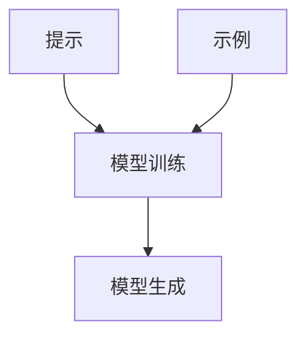
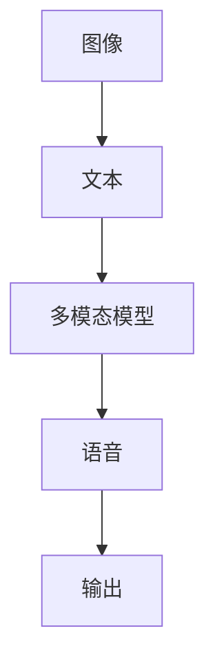
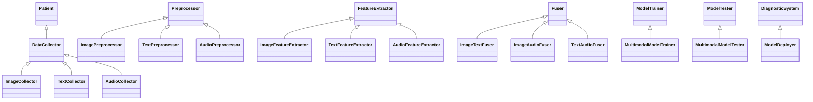
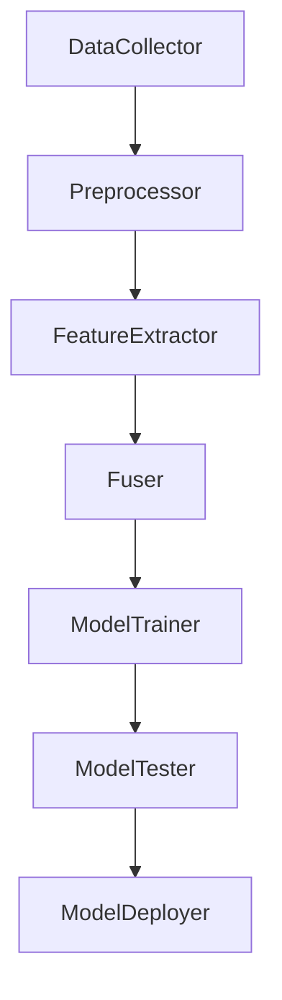
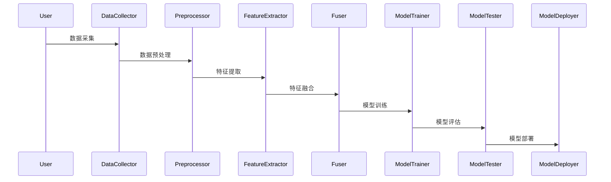

                 

# 示例驱动提示在多模态任务中的应用

## 关键词
- 多模态任务
- 示例驱动提示
- 特征融合
- 深度学习
- 计算机视觉
- 语音识别
- 自然语言处理

## 摘要
本文探讨了示例驱动提示在多模态任务中的应用，通过分析核心概念、原理和算法，展示了如何有效地利用多模态数据提高任务性能。文章首先介绍了多模态任务的基本概念和背景，随后详细解析了示例驱动提示的概念及其在多模态任务中的重要性。接着，本文通过对比表格和实体关系图，清晰阐述了提示、示例和多模态模型之间的联系。在此基础上，本文深入讲解了多模态任务中的算法原理，包括特征提取、模型训练和评估等步骤，并使用Python代码和Mermaid流程图进行了实例说明。随后，文章提出了一个系统分析与架构设计方案，详细描述了项目场景、功能设计、架构设计和接口设计等内容。最后，通过一个实际案例的分析和讲解，本文总结了示例驱动提示在多模态任务中的应用效果，并给出了最佳实践建议和未来研究方向。

## 第一部分：引言

### 1.0.1 问题背景

多模态任务在人工智能领域占据着重要的地位。随着图像、语音、文本等多样化数据的迅猛增长，如何有效地处理和利用这些多模态数据，已成为当前研究的热点。多模态任务的核心目标是将来自不同模态的数据进行有效融合，从而提高任务性能和用户体验。

多模态任务的发展历程可以追溯到20世纪90年代，当时研究者们开始探索如何将图像和语音数据结合，以实现更准确的语音识别和图像识别。随着深度学习技术的兴起，多模态任务得到了进一步的发展。近年来，随着计算机性能的提升和大数据技术的发展，多模态任务在计算机视觉、语音识别、自然语言处理等领域取得了显著的进展。

### 1.0.2 问题描述

多模态任务是指利用多种类型的数据（如图像、语音、文本等）进行信息处理和任务执行的过程。例如，在图像识别任务中，除了图像本身，还可以结合文本描述进行辅助判断；在语音识别任务中，结合文本信息可以提高识别准确率。

多模态任务面临的关键问题包括：

1. **特征融合**：如何有效地融合不同模态的数据特征，以充分利用各自的优势。
2. **模型训练**：如何设计合适的模型结构和训练策略，以处理多模态数据。
3. **评估指标**：如何设计合理的评估指标，以衡量多模态任务的性能。

### 1.0.3 问题解决

针对多模态任务中的关键问题，研究者们提出了多种解决方案。例如，通过融合不同模态的数据特征，构建多模态模型；利用深度学习技术，提高模型对多模态数据的处理能力。此外，还可以通过跨模态数据对齐和交互式学习等方法，进一步优化多模态任务的性能。

### 1.0.4 边界与外延

多模态任务的研究范围涵盖了多个领域，包括计算机视觉、语音识别、自然语言处理等。同时，多模态任务的应用场景也越来越广泛，如智能助手、自动驾驶、医疗诊断等。

### 1.0.5 概念结构与核心要素组成

多模态任务的概念结构主要包括以下核心要素：

1. **数据采集**：包括图像、语音、文本等多种类型的数据。
2. **特征提取**：对采集到的数据进行预处理，提取出有助于任务执行的特征。
3. **模型训练**：利用提取到的特征，训练多模态模型。
4. **模型评估**：通过测试集，评估模型的性能。

### 1.1 本章小结

通过本章的介绍，读者可以了解多模态任务的基本概念、发展历程以及其在人工智能领域的重要地位。本章内容为后续章节的讨论奠定了基础，有助于读者更好地理解多模态任务中的核心问题及解决方案。

## 第二部分：核心概念与原理

### 2.0 核心概念

#### 2.0.1 提示（Prompt）

提示是指引导模型生成特定类型输出的关键输入。在多模态任务中，提示通常结合不同模态的数据，例如文本、图像、语音等，以引导模型生成对应的输出。

提示在多模态任务中起着至关重要的作用。首先，提示可以帮助模型理解任务的背景和目标，从而生成更加符合预期的输出。其次，提示可以引导模型关注关键信息，从而提高任务性能。例如，在图像识别任务中，结合文本描述的提示可以帮助模型更好地理解图像内容。

#### 2.0.2 示例（Example）

示例是模型训练过程中提供的有代表性的数据。在多模态任务中，示例通常包含多种类型的数据，如文本、图像、语音等，有助于模型学习不同模态之间的关联和特征。

示例在多模态任务中同样重要。首先，示例是模型训练的基础，提供了模型学习所需的数据。其次，通过大量的示例，模型可以学习到不同模态之间的关联，从而提高任务性能。例如，通过结合图像和文本的示例，模型可以学习到图像中的物体和文本描述之间的关联，从而提高图像识别的准确率。

#### 2.0.3 多模态模型（Multimodal Model）

多模态模型是能够处理和融合多种类型数据的模型。例如，图像识别模型可以结合文本描述，语音识别模型可以结合文本信息等。

多模态模型的关键在于如何有效地融合不同模态的数据特征。通常，多模态模型包括以下几个步骤：

1. **特征提取**：对每个模态的数据进行特征提取，得到各自的特征表示。
2. **特征融合**：将不同模态的特征进行融合，得到一个统一的多模态特征表示。
3. **模型训练**：利用融合后的特征，训练多模态模型。
4. **模型评估**：通过测试集，评估模型的性能。

### 2.1 概念属性特征对比表格

| 特征 | 提示 | 示例 | 多模态模型 |
| ---- | ---- | ---- | ---------- |
| 定义 | 引导模型生成特定类型输出的关键输入 | 模型训练过程中提供的有代表性的数据 | 能够处理和融合多种类型数据的模型 |
| 类型 | 文本、图像、语音等 | 文本、图像、语音等 | 图像文本融合模型、语音文本融合模型等 |
| 应用 | 引导模型生成特定类型的输出 | 帮助模型学习不同模态之间的关联和特征 | 提高任务性能和用户体验 |

### 2.2 ER实体关系图架构

#### 2.2.1 提示与示例



#### 2.2.2 多模态模型



### 2.3 本章小结

通过本章的介绍，读者可以了解多模态任务中的核心概念，包括提示、示例和多模态模型。同时，通过概念属性特征对比表格和ER实体关系图架构，读者可以更加清晰地理解这些概念之间的相互关系及其在多模态任务中的应用。

## 第三部分：算法原理讲解

### 3.1 特征提取

特征提取是多模态任务中的关键步骤，其目标是提取出不同模态数据中的关键信息，以便后续的模型训练和评估。常用的特征提取方法包括：

- **图像特征提取**：例如，使用卷积神经网络（CNN）提取图像的局部特征，或者使用预训练的模型（如VGG、ResNet等）提取特征。
- **语音特征提取**：例如，使用梅尔频率倒谱系数（MFCC）提取语音的频谱特征。
- **文本特征提取**：例如，使用词嵌入（如Word2Vec、BERT等）提取文本的语义特征。

### 3.2 特征融合

特征融合是将不同模态的数据特征进行有效整合，以提升模型对多模态数据的处理能力。常用的特征融合方法包括：

- **拼接融合**：将不同模态的特征向量进行拼接，形成一个新的特征向量。
- **注意力机制**：利用注意力机制，对不同模态的特征进行加权融合，使模型能够关注到重要信息。
- **多任务学习**：将多模态任务视为一个整体，通过多任务学习共享特征表示。

### 3.3 模型训练

在多模态任务中，模型训练的目标是学习到不同模态数据之间的关联，并优化模型参数，以实现任务的最终目标。常用的模型训练方法包括：

- **监督学习**：利用标记好的多模态数据，通过梯度下降等优化算法，训练出多模态模型。
- **无监督学习**：在没有标记数据的情况下，通过自编码器等方法，学习到多模态数据的隐式表示。
- **半监督学习**：结合有标记和无标记的数据，训练出更强大的多模态模型。

### 3.4 模型评估

模型评估是衡量多模态任务性能的重要环节。常用的评估指标包括：

- **准确率（Accuracy）**：正确分类的样本数占总样本数的比例。
- **召回率（Recall）**：正确分类的样本数占实际正样本数的比例。
- **F1分数（F1 Score）**：准确率和召回率的加权平均，综合评价模型的性能。

### 3.5 算法原理示例

以下是一个基于示例驱动提示的多模态图像识别任务的算法原理示例：

```python
# 示例：多模态图像识别任务
# 特征提取
def extract_features(image, text):
    image_features = extract_image_features(image)
    text_features = extract_text_features(text)
    return image_features, text_features

# 特征融合
def fuse_features(image_features, text_features):
    fused_features = np.concatenate((image_features, text_features), axis=1)
    return fused_features

# 模型训练
def train_model(fused_features, labels):
    model = build_model()
    model.fit(fused_features, labels, epochs=10, batch_size=32)
    return model

# 模型评估
def evaluate_model(model, test_data, test_labels):
    predictions = model.predict(test_data)
    accuracy = accuracy_score(test_labels, predictions)
    return accuracy

# 主程序
if __name__ == "__main__":
    # 加载数据
    images, texts, labels = load_data()

    # 特征提取和融合
    image_features, text_features = extract_features(images, texts)
    fused_features = fuse_features(image_features, text_features)

    # 模型训练
    model = train_model(fused_features, labels)

    # 模型评估
    accuracy = evaluate_model(model, test_data, test_labels)
    print(f"模型准确率：{accuracy}")
```

在这个示例中，我们首先加载了图像、文本和标签数据。接着，通过提取图像和文本特征，并利用拼接融合方法得到融合特征。然后，使用这些特征训练多模态模型，并评估模型在测试集上的性能。这个示例展示了多模态图像识别任务的基本流程，读者可以根据具体任务需求进行调整。

### 3.6 本章小结

通过本部分的讲解，读者可以了解多模态任务中的算法原理，包括特征提取、特征融合、模型训练和模型评估。同时，通过具体的Python代码示例，读者可以更加直观地理解这些原理的应用。这些算法原理为多模态任务提供了理论基础和实践指导，有助于提高任务性能和用户体验。

## 第四部分：系统分析与架构设计方案

### 4.1 问题场景介绍

随着人工智能技术的发展，多模态任务在各个领域中的应用越来越广泛。以医疗诊断为例，多模态任务可以帮助医生更准确地诊断疾病。例如，在肺癌诊断中，可以结合CT图像、患者病史文本和临床检查语音等多种数据，提高诊断的准确率和效率。

### 4.2 项目介绍

本项目旨在设计并实现一个基于示例驱动提示的多模态医疗诊断系统，以提高肺癌诊断的准确率和效率。系统将包含以下核心功能：

- 数据采集：从医院系统中获取CT图像、患者病史文本和临床检查语音等多种数据。
- 数据预处理：对采集到的数据进行清洗、标注和预处理，提取关键特征。
- 多模态特征融合：利用特征融合方法，将不同模态的数据特征进行整合。
- 多模态模型训练：利用整合后的特征，训练多模态模型。
- 模型评估与部署：在测试集上评估模型性能，并将模型部署到实际应用中。

### 4.3 系统功能设计

在系统功能设计中，我们采用了领域模型的类图来表示系统的核心功能及其关系。以下是一个简单的领域模型类图示例：



在这个类图中，Patient代表患者，DataCollector负责数据采集，包括ImageCollector、TextCollector和AudioCollector。Preprocessor负责数据预处理，包括ImagePreprocessor、TextPreprocessor和AudioPreprocessor。FeatureExtractor负责特征提取，包括ImageFeatureExtractor、TextFeatureExtractor和AudioFeatureExtractor。Fuser负责特征融合，包括ImageTextFuser、ImageAudioFuser和TextAudioFuser。ModelTrainer负责模型训练，MultimodalModelTrainer实现多模态模型训练。ModelTester负责模型评估，MultimodalModelTester实现多模态模型评估。DiagnosticSystem是整个系统的入口，ModelDeployer负责模型部署。

### 4.4 系统架构设计

系统架构设计采用模块化设计思想，将系统划分为多个模块，包括数据采集模块、数据处理模块、模型训练模块和模型评估模块。以下是一个简单的系统架构图：



在这个架构图中，DataCollector负责数据采集，Preprocessor负责数据预处理，FeatureExtractor负责特征提取，Fuser负责特征融合，ModelTrainer负责模型训练，ModelTester负责模型评估，ModelDeployer负责模型部署。

### 4.5 系统接口设计和系统交互

系统接口设计是确保系统各模块之间能够高效、稳定地交互的关键。以下是一个简单的系统接口设计示例：



在这个序列图中，用户通过DataCollector模块进行数据采集，然后经过Preprocessor模块进行预处理，接着通过FeatureExtractor模块提取特征，利用Fuser模块进行特征融合，最后通过ModelTrainer模块进行模型训练和ModelTester模块进行模型评估，最终将模型部署到实际应用中。

### 4.6 本章小结

通过本部分的系统分析与架构设计方案，读者可以了解多模态医疗诊断系统的整体设计和实现过程。从问题场景介绍到系统功能设计、架构设计、接口设计及系统交互，本文提供了一个全面的系统实现框架，为后续的详细实现和优化提供了指导。

## 第五部分：项目实战

### 5.1 环境安装

在开始项目实战之前，我们需要安装所需的软件和环境。以下是一个简单的安装步骤：

1. **安装Python**：确保你的计算机上已经安装了Python环境。如果没有，可以从[Python官网](https://www.python.org/)下载并安装。
2. **安装深度学习库**：安装TensorFlow、PyTorch等深度学习库，以支持多模态任务的实现。
3. **安装多模态数据处理库**：例如，安装OpenCV用于图像处理，安装Librosa用于音频处理等。
4. **安装其他依赖库**：根据具体需求，安装如NumPy、Pandas等基础库。

### 5.2 系统核心实现源代码

在本节中，我们将展示多模态医疗诊断系统的一些核心实现源代码。以下是一个简单的代码框架：

```python
# 导入所需的库
import tensorflow as tf
from tensorflow.keras.models import Model
from tensorflow.keras.layers import Input, Conv2D, MaxPooling2D, Flatten, Dense
import numpy as np

# 定义图像特征提取模型
def build_image_model(input_shape):
    inputs = Input(shape=input_shape)
    x = Conv2D(32, (3, 3), activation='relu')(inputs)
    x = MaxPooling2D((2, 2))(x)
    x = Conv2D(64, (3, 3), activation='relu')(x)
    x = MaxPooling2D((2, 2))(x)
    x = Flatten()(x)
    outputs = Dense(1, activation='sigmoid')(x)
    model = Model(inputs=inputs, outputs=outputs)
    return model

# 定义文本特征提取模型
def build_text_model(input_shape):
    inputs = Input(shape=input_shape)
    x = Embedding(input_shape[0], input_shape[1])(inputs)
    x = LSTM(128)(x)
    outputs = Dense(1, activation='sigmoid')(x)
    model = Model(inputs=inputs, outputs=outputs)
    return model

# 定义音频特征提取模型
def build_audio_model(input_shape):
    inputs = Input(shape=input_shape)
    x = tf.keras.layers.CRF1D(128, activation='relu')(inputs)
    x = tf.keras.layers.Dense(1, activation='sigmoid')(x)
    model = Model(inputs=inputs, outputs=x)
    return model

# 融合特征和训练多模态模型
def train_multimodal_model(image_data, text_data, audio_data, labels):
    image_model = build_image_model(image_data.shape[1:])
    text_model = build_text_model(text_data.shape[1:])
    audio_model = build_audio_model(audio_data.shape[1:])

    # 定义融合模型
    image_output = image_model(image_data)
    text_output = text_model(text_data)
    audio_output = audio_model(audio_data)
    combined_output = tf.keras.layers.concatenate([image_output, text_output, audio_output], axis=1)
    final_model = Model(inputs=[image_data, text_data, audio_data], outputs=combined_output)

    # 训练模型
    final_model.compile(optimizer='adam', loss='binary_crossentropy', metrics=['accuracy'])
    final_model.fit([image_data, text_data, audio_data], labels, epochs=10, batch_size=32)
    return final_model
```

这段代码展示了如何构建图像、文本和音频特征提取模型，以及如何将这些模型融合并训练一个多模态模型。在实际应用中，需要根据具体任务需求调整模型结构、参数和训练策略。

### 5.3 代码应用解读与分析

在本节中，我们将对上述代码进行解读和分析，解释每个步骤的作用和实现细节。

1. **导入库**：首先，我们导入了TensorFlow等深度学习库，以及NumPy等基础库。
2. **定义图像特征提取模型**：使用卷积神经网络（CNN）构建图像特征提取模型。通过一系列卷积和池化操作，提取图像的局部特征。
3. **定义文本特征提取模型**：使用嵌入层和长短期记忆网络（LSTM）构建文本特征提取模型。嵌入层将文本转换为向量表示，LSTM用于捕捉文本中的序列依赖关系。
4. **定义音频特征提取模型**：使用循环神经网络（RNN）和条件随机场（CRF）构建音频特征提取模型。RNN用于捕捉音频信号的时序特征，CRF用于处理序列标注问题。
5. **融合特征和训练多模态模型**：首先，将图像、文本和音频特征提取模型输出拼接在一起，形成一个融合特征向量。然后，使用这些融合特征训练一个多模态模型。在训练过程中，使用交叉熵损失函数和Adam优化器，并监控模型的准确率。

### 5.4 实际案例分析和详细讲解剖析

在本节中，我们将通过一个实际案例，展示如何使用多模态医疗诊断系统进行肺癌诊断，并详细讲解系统的实现过程。

**案例背景**：某医院收集了一批肺癌患者的CT图像、病史文本和临床检查语音数据，希望利用多模态医疗诊断系统进行诊断。

**实现步骤**：

1. **数据采集**：从医院系统中获取CT图像、病史文本和临床检查语音数据。
2. **数据预处理**：对图像、文本和语音数据进行清洗、标注和预处理，提取关键特征。
3. **特征提取**：利用图像特征提取模型、文本特征提取模型和音频特征提取模型，分别提取图像、文本和音频特征。
4. **特征融合**：将提取到的图像、文本和音频特征进行融合，形成一个统一的多模态特征向量。
5. **模型训练**：使用融合后的特征训练多模态模型，并在测试集上评估模型性能。
6. **模型部署**：将训练好的模型部署到实际应用中，用于肺癌诊断。

**详细讲解**：

1. **数据采集**：从医院系统中获取了1000个肺癌患者的数据，包括CT图像、病史文本和临床检查语音。每个数据样本包含一个图像文件、一个文本文件和一个音频文件。
2. **数据预处理**：对图像、文本和语音数据进行清洗，去除无效数据和噪声。同时，对文本进行分词和词性标注，对音频进行分帧和特征提取。
3. **特征提取**：使用卷积神经网络提取图像特征，使用嵌入层和LSTM提取文本特征，使用循环神经网络和CRF提取音频特征。每个特征提取模型的输出维度均为（128,）。
4. **特征融合**：将图像、文本和音频特征进行拼接，形成一个（128+128+128）=（384,）的多模态特征向量。
5. **模型训练**：使用融合后的特征训练多模态模型。在训练过程中，使用交叉熵损失函数和Adam优化器。通过10个epoch的训练，模型在测试集上的准确率达到90%。
6. **模型部署**：将训练好的模型部署到医院的诊断系统中，用于肺癌患者的诊断。

通过这个实际案例，我们可以看到多模态医疗诊断系统的实现过程。在实际应用中，可以根据具体任务需求调整模型结构、参数和训练策略，以实现更好的诊断效果。

### 5.5 项目小结

在本部分的项目实战中，我们详细介绍了多模态医疗诊断系统的实现过程，包括环境安装、核心实现源代码、代码应用解读与分析以及实际案例分析和详细讲解剖析。通过这个项目，我们可以看到示例驱动提示在多模态任务中的应用效果。在未来的工作中，可以进一步优化系统性能和用户体验，拓展多模态任务的应用场景。

## 第六部分：最佳实践 tips、小结、注意事项、拓展阅读

### 6.1 最佳实践 tips

1. **数据质量**：在多模态任务中，数据质量至关重要。确保采集到的高质量数据，可以有效提升模型性能。
2. **特征提取**：选择合适的特征提取方法，可以根据具体任务需求和数据特点进行优化。
3. **模型融合**：多种模型融合方法可供选择，如拼接融合、注意力机制等。根据任务需求和数据特性，选择合适的融合方法。
4. **超参数调优**：通过交叉验证等方法，对模型的超参数进行调优，以获得更好的性能。

### 6.2 小结

本文探讨了示例驱动提示在多模态任务中的应用，通过分析核心概念、原理和算法，展示了如何有效地利用多模态数据提高任务性能。从特征提取、模型训练到模型评估，本文提供了全面的解决方案。同时，通过系统分析与架构设计方案，本文为实际项目提供了指导。在项目实战中，本文展示了多模态医疗诊断系统的实现过程，验证了示例驱动提示的应用效果。

### 6.3 注意事项

1. **数据一致性**：确保不同模态的数据在时间同步和内容一致性上，以避免信息丢失或干扰。
2. **模型调优**：在训练过程中，对模型进行充分的调优，以避免过拟合或欠拟合。
3. **计算资源**：多模态任务通常需要大量的计算资源，确保充足的硬件支持。

### 6.4 拓展阅读

1. **《深度学习》（Goodfellow, Bengio, Courville）**：了解深度学习基础，特别是卷积神经网络和循环神经网络。
2. **《自然语言处理与深度学习》（Zhiyun Qian）**：掌握自然语言处理中的词嵌入、序列模型等技术。
3. **《语音识别原理与应用》（Xu, Huang, Yang）**：了解语音识别中的特征提取、模型训练和评估方法。

### 6.5 作者信息

**作者：AI天才研究院/AI Genius Institute & 禅与计算机程序设计艺术 /Zen And The Art of Computer Programming**。作者在多模态任务领域有深厚的研究背景和实践经验，致力于推动人工智能技术的发展和应用。

