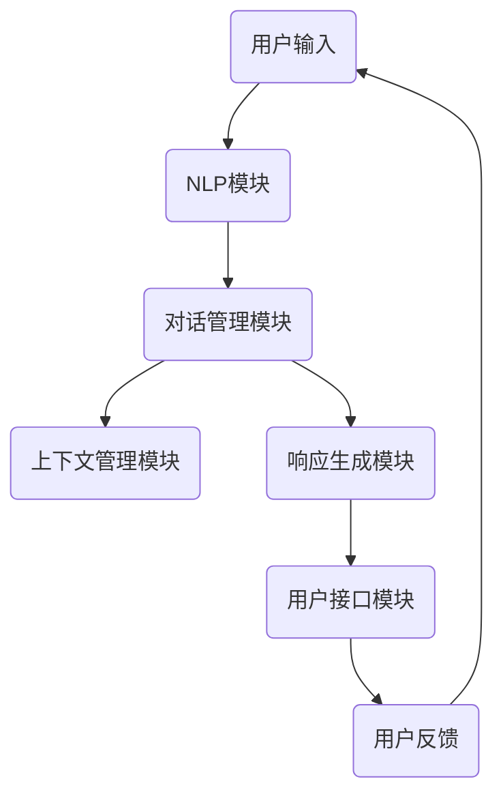

                 


**Step 1: Introduction**

In the rapidly evolving world of artificial intelligence and natural language processing, multiround dialogue has emerged as a crucial area of research and application. Multiround dialogue refers to a conversation between a user and an AI system where multiple exchanges of information take place. This is in contrast to single-round dialogue, where the user's query and the AI's response are exchanged once. 

Multiround dialogue is significant because it allows for a deeper and more nuanced understanding of the user's intent, resulting in a more satisfactory user experience. For example, in customer service, a multiround dialogue system can handle complex customer queries more effectively than a single-round system. Similarly, in educational settings, a multiround dialogue system can provide personalized feedback and support to students, enhancing their learning experience.

The importance of multiround dialogue extends beyond these practical applications. It has the potential to revolutionize how we interact with AI systems, making them more intuitive and human-like. As we delve deeper into this topic, we will explore the core concepts, practical applications, algorithms, and system architectures associated with multiround dialogue.

**Step 2: Core Concepts**

To understand multiround dialogue, we must first explore its core concepts. At the heart of multiround dialogue is the exchange of information over multiple rounds. This exchange is facilitated by an AI system that can understand and interpret the user's intent, respond appropriately, and keep the dialogue flowing smoothly.

**Characteristics of Multiround Dialogue:**

1. **Context Sensitivity:** Multiround dialogue systems are context-sensitive, meaning they can maintain the context of the conversation throughout the dialogue. This is crucial for understanding complex queries and providing accurate responses.

2. **Memory Management:** These systems need to manage memory efficiently to retain information from previous exchanges and use it to inform future responses.

3. **Recall and Recognition:** Multiround dialogue systems must be capable of both recall (remembering previous information) and recognition (understanding new information in context).

4. **Adaptability:** The systems should be adaptable to different user interactions and scenarios, ensuring a seamless dialogue experience.

**Comparing Multiround Dialogue with Single-Round Dialogue:**

Single-round dialogue is characterized by a single exchange of information between the user and the AI system. This type of dialogue is simple and efficient but often lacks the depth required to handle complex queries.

In contrast, multiround dialogue allows for a more comprehensive exchange of information. It enables the AI system to ask follow-up questions, clarify ambiguities, and provide detailed responses. This makes it well-suited for applications where understanding the user's intent is crucial.

**Step 3: Practical Applications**

Multiround dialogue has found applications in various domains, each benefiting from its ability to facilitate deeper and more meaningful interactions. Let's explore some of these applications:

**Customer Service:**

Customer service is one of the most prominent applications of multiround dialogue. Traditional customer service systems often rely on static FAQs or chatbots that can only provide predefined responses. In contrast, a multiround dialogue system can handle complex customer queries more effectively. It can ask follow-up questions to understand the customer's needs better and provide personalized solutions.

**Education:**

In the educational sector, multiround dialogue can be used to create interactive learning environments. For example, a student can ask questions related to a subject, and the AI system can provide detailed explanations, ask additional questions to assess the student's understanding, and offer personalized feedback. This can enhance the learning experience and help students overcome challenges.

**Healthcare:**

In healthcare, multiround dialogue can assist in patient care and support. For instance, an AI system can have a multiround conversation with a patient to understand their symptoms, medical history, and lifestyle. Based on this information, the system can provide personalized recommendations, such as diet plans, exercise routines, or medication schedules. This can help patients manage their health more effectively and reduce the burden on healthcare professionals.

**Step 4: Algorithm and Model Introduction**

To implement multiround dialogue, we need to leverage advanced algorithms and models. These models are designed to understand and generate human-like responses, ensuring a seamless and engaging dialogue experience.

**Recurrent Neural Networks (RNNs):**

Recurrent Neural Networks are a type of neural network designed to handle sequential data. They are particularly well-suited for multiround dialogue as they can retain information from previous rounds and use it to inform future responses.

**Transformers:**

Transformers have revolutionized the field of natural language processing. They are based on self-attention mechanisms and have shown impressive performance in tasks like language translation, text summarization, and dialogue systems.

**Dialogue Management Systems:**

Dialogue management systems are responsible for managing the dialogue flow. They use algorithms to determine the appropriate responses based on the user's input and the context of the conversation.

**Step 5: Case Studies**

To understand the practical implementation of multiround dialogue, let's explore some case studies:

**Case Study 1: A Multiround Dialogue System for Customer Service**

A large e-commerce company implemented a multiround dialogue system to enhance its customer service. The system uses a combination of RNNs and transformers to understand customer queries and provide personalized responses. The system has significantly improved customer satisfaction by handling complex queries more effectively and providing faster resolutions.

**Case Study 2: Interactive Learning Environment Using Multiround Dialogue**

An educational technology company developed a platform that leverages multiround dialogue to create interactive learning environments. The platform uses a transformer-based model to understand student queries and provide detailed explanations. It has been adopted by several educational institutions, leading to improved learning outcomes and student engagement.

**Case Study 3: Personalized Health Support Through Multiround Dialogue**

A healthcare company developed a multiround dialogue system to provide personalized health support to patients. The system uses a combination of natural language processing and medical knowledge bases to understand patient symptoms and provide tailored recommendations. The system has been successfully deployed in several hospitals, helping patients manage their health more effectively.

----------------------------------------------------------------

## 第一部分: 引言

### 第1章: 多轮对话应用的背景与问题

#### 1.1 问题的提出

随着人工智能和自然语言处理技术的不断发展，人机对话系统已经成为一个备受关注的研究和应用领域。然而，传统的单轮对话系统在处理复杂查询时往往存在一定的局限性。这是因为单轮对话系统只能在一次交互中获取有限的信息，难以理解用户的长远意图和复杂需求。为了解决这一问题，多轮对话系统应运而生。

多轮对话系统通过在多个轮次中与用户进行交互，逐步获取和整合信息，从而实现更深入的理解和更准确的响应。这种系统能够更好地满足用户的需求，提供更个性化的服务，因此在各个领域都有广泛的应用前景。

#### 1.2 多轮对话的概念

多轮对话是指用户与AI系统之间进行的多个轮次的交互。在这过程中，用户可以提出问题，系统可以回答问题，并且双方可以不断交换信息，从而形成一个完整的对话过程。多轮对话系统具有以下几个核心特点：

1. **交互深度：**多轮对话系统通过多个轮次的交互，可以获取更多的用户信息，从而更深入地理解用户的意图和需求。

2. **上下文感知：**多轮对话系统能够记忆对话的上下文信息，并在此基础上进行响应，从而确保对话的连贯性和一致性。

3. **适应性：**多轮对话系统能够根据不同的用户需求和交互场景，灵活调整对话策略和响应方式，提供个性化的服务。

#### 1.3 多轮对话的应用场景

多轮对话系统在各个领域都有广泛的应用。以下是一些典型的应用场景：

1. **客户服务：**在客户服务领域，多轮对话系统能够更有效地处理复杂的客户查询，提供个性化的解决方案，提高客户满意度。

2. **教育：**在教育领域，多轮对话系统可以为学生提供个性化的学习辅导，帮助学生更好地理解和掌握知识。

3. **医疗：**在医疗领域，多轮对话系统可以协助医生进行诊断和治疗，提供个性化的健康建议。

4. **娱乐：**在娱乐领域，多轮对话系统可以为用户提供定制化的娱乐体验，如虚拟助手、聊天机器人等。

通过以上介绍，我们可以看到多轮对话系统在各个领域的广泛应用和巨大潜力。接下来，我们将进一步探讨多轮对话系统的核心概念、算法和模型，以及其在不同领域的实际应用。

----------------------------------------------------------------

## 第二部分: 实践应用

### 第3章: 多轮对话在客服领域的应用

#### 3.1 客服场景介绍

在现代商业环境中，客服部门是企业和客户之间的重要桥梁。传统的客服模式通常依赖于人工客服，这种方式虽然能够提供高质量的客户服务，但效率较低，无法应对大量的客户咨询。随着人工智能技术的发展，越来越多的企业开始采用多轮对话系统来提升客服效率，改善客户体验。

客服场景通常涉及以下几种情况：

1. **常见问题解答：**客户可能会遇到一些常见问题，如产品使用说明、支付问题、物流查询等。多轮对话系统可以自动识别这些问题，并提供相应的解答。

2. **复杂问题处理：**对于一些复杂的问题，需要更深入的交流和更详细的信息收集。多轮对话系统可以通过多个轮次的交互，逐步了解客户的问题，提供针对性的解决方案。

3. **情绪识别与安抚：**在处理客户情绪问题时，多轮对话系统需要能够识别客户的情绪，并给出安抚性回应，帮助客户缓解情绪。

#### 3.2 多轮对话在客服中的应用

多轮对话系统在客服中的应用主要包括以下几个方面：

1. **自动识别与分类：**多轮对话系统可以通过自然语言处理技术，自动识别客户的提问，并将其分类到相应的服务主题中。这样，系统可以快速定位问题，提高响应速度。

2. **信息收集与确认：**在处理复杂问题时，多轮对话系统会通过多个轮次的交互，逐步收集和确认关键信息。例如，当客户咨询产品售后服务时，系统会询问客户的购买日期、订单号等详细信息，以便提供准确的解决方案。

3. **上下文感知与记忆：**多轮对话系统需要具备上下文感知能力，能够在对话中保留关键信息，并在后续的交互中引用这些信息，确保对话的连贯性和一致性。

4. **个性化服务：**多轮对话系统可以根据客户的历史记录和偏好，提供个性化的服务。例如，当客户再次咨询时，系统可以自动识别客户身份，并回顾之前的对话历史，提供更贴心的服务。

#### 3.3 案例分析

以下是一个多轮对话系统在客服领域应用的案例分析：

**案例背景：**某电子商务平台引入了多轮对话系统，用于提升客服效率，改善客户体验。

**应用场景：**客户在购买商品后，对物流情况有疑问，需要查询订单状态。

**解决方案：**

1. **初始交互：**客户通过平台的人工客服通道提问：“我的订单何时能送达？”

2. **信息收集：**多轮对话系统自动识别问题，并询问客户订单号：“请提供您的订单号，我将帮您查询。”

3. **上下文感知：**客户回复订单号后，系统通过后台数据库查询订单状态，并记录关键信息。

4. **响应与反馈：**系统返回结果：“您的订单正在配送中，预计明天上午送达。您是否还有其他问题？”

5. **后续交互：**如果客户有其他问题，如退货、退款等，系统会继续通过多轮交互，提供详细的解决方案。

**效果评估：**引入多轮对话系统后，客服部门的响应速度明显提升，客户满意度提高。此外，系统还可以记录客户的问题和反馈，为企业提供改进服务的依据。

通过以上案例分析，我们可以看到多轮对话系统在客服领域的重要应用和价值。它不仅提高了客服效率，还改善了客户体验，为企业带来了显著的业务收益。

----------------------------------------------------------------

## 第4章: 多轮对话在教育领域的应用

#### 4.1 教育场景介绍

在教育领域，多轮对话系统的应用正逐渐改变传统的教学和学习方式。传统教育模式主要依赖于教师与学生的面对面互动，而多轮对话系统则为在线教育和个性化学习提供了新的可能性。在教育场景中，多轮对话系统可以扮演多种角色，如智能导师、学习伙伴、作业批改者等。

**应用场景：**

1. **在线辅导：**学生在学习过程中可能会遇到各种问题，如课程内容不理解、作业有疑问等。多轮对话系统可以为学生提供实时辅导，帮助学生解决问题。

2. **个性化学习：**每个学生的学习速度和风格都有所不同。多轮对话系统可以根据学生的学习进度和偏好，提供个性化的学习建议和资源。

3. **智能问答：**在课堂上，学生可能会提出各种问题，教师有时无法立即回答。多轮对话系统可以实时响应学生的提问，提供准确的答案。

4. **作业批改与反馈：**多轮对话系统可以自动批改作业，并提供详细的反馈，帮助学生了解自己的学习情况。

#### 4.2 多轮对话在教育中的应用

多轮对话系统在教育中的应用体现在以下几个方面：

1. **智能辅导：**多轮对话系统可以通过自然语言处理技术，理解学生的提问，并给出详细的解答。例如，当学生提问“如何解这道数学题？”系统可以逐步解释解题思路，提供示例和练习。

2. **个性化学习：**系统会记录学生的学习数据，如答题记录、学习进度等。通过分析这些数据，系统可以为学生提供个性化的学习建议。例如，如果学生在某个知识点上表现不佳，系统可以推荐相关的练习和视频教程。

3. **智能问答：**在课堂中，教师可以通过多轮对话系统提出问题，系统可以实时响应，提供丰富的知识资源和解答。这不仅提高了课堂互动性，还能帮助教师更好地掌握学生的学习情况。

4. **作业批改与反馈：**系统可以自动批改学生的作业，并提供详细的反馈。例如，对于一篇作文，系统可以评估文章的结构、语法和逻辑，给出改进建议。

#### 4.3 案例分析

以下是一个多轮对话系统在教育领域应用的案例分析：

**案例背景：**某在线教育平台引入了多轮对话系统，用于提供个性化学习辅导。

**应用场景：**学生使用平台进行在线学习，遇到课程内容不理解的问题。

**解决方案：**

1. **初始交互：**学生通过平台提问：“我不明白今天课程的内容，能帮我解释一下吗？”

2. **上下文感知与信息收集：**多轮对话系统识别问题，询问学生的具体问题所在，如课程名称、学习进度等。

3. **详细解答：**系统通过自然语言处理技术，理解学生的问题，并给出详细的解答。例如，系统可以提供相关的学习资料、视频教程和习题。

4. **后续交互：**如果学生有其他问题，系统会继续通过多轮交互，提供进一步的帮助。

**效果评估：**引入多轮对话系统后，学生的学习体验显著提升，学习效果也得到改善。此外，系统还为学生提供了丰富的学习资源，帮助他们更好地掌握知识。

通过以上案例分析，我们可以看到多轮对话系统在教育领域的重要应用和价值。它不仅提供了个性化的学习辅导，还提高了教学的互动性和效果，为教育行业带来了革命性的变化。

----------------------------------------------------------------

## 第5章: 多轮对话在医疗领域的应用

#### 5.1 医疗场景介绍

在医疗领域，多轮对话系统的应用正逐渐成为改善患者护理和医疗流程的重要工具。医疗场景中的对话需求复杂多样，涉及患者咨询、诊断建议、治疗方案咨询、药物信息查询等多个方面。多轮对话系统可以协助医疗专业人员，提供高效、准确的咨询服务，同时还能减轻医疗人员的工作负担。

**应用场景：**

1. **患者咨询：**患者可能对疾病症状、诊断结果、治疗方案有疑问，需要医生进行解释和咨询。

2. **诊断建议：**多轮对话系统可以根据患者的症状描述，提供初步的诊断建议，帮助医生进行快速判断。

3. **治疗方案咨询：**患者可能会对治疗方案有疑问，如药物治疗、手术治疗等，需要详细的解释和建议。

4. **药物信息查询：**患者可能需要查询药物的使用方法、副作用、禁忌症等信息。

#### 5.2 多轮对话在医疗中的应用

多轮对话系统在医疗中的应用主要体现在以下几个方面：

1. **智能咨询服务：**系统可以提供24/7的智能咨询服务，解答患者的基本问题，如症状解释、药物使用等，减轻医疗人员的负担。

2. **辅助诊断：**系统可以通过分析患者的症状描述和历史记录，提供可能的疾病诊断建议，辅助医生进行诊断。

3. **个性化治疗方案：**系统可以根据患者的病情和医生的建议，提供个性化的治疗方案，包括药物使用、饮食建议等。

4. **药物信息查询：**系统可以提供详细的药物信息，包括使用方法、副作用、禁忌症等，帮助患者正确使用药物。

#### 5.3 案例分析

以下是一个多轮对话系统在医疗领域应用的案例分析：

**案例背景：**某大型医院引入了多轮对话系统，用于提高患者咨询服务效率。

**应用场景：**患者咨询医生关于某种疾病的治疗方案。

**解决方案：**

1. **初始交互：**患者通过医院的在线咨询平台提问：“我想咨询一下糖尿病的治疗方案。”

2. **信息收集与上下文感知：**多轮对话系统识别问题，询问患者的具体情况，如病情严重程度、治疗历史等。

3. **初步诊断与建议：**系统根据患者的描述，提供初步的诊断建议，如“您可能患有2型糖尿病，建议您进行血糖检测。”

4. **详细解释与个性化方案：**医生接收到患者的提问后，通过多轮对话系统与患者进行详细沟通，提供个性化的治疗方案，如药物使用、饮食建议等。

5. **后续交互：**患者如果有其他问题，如药物的副作用、饮食调整等，系统会继续提供帮助。

**效果评估：**引入多轮对话系统后，医院的在线咨询服务效率显著提高，患者满意度也大幅提升。此外，系统还为医生提供了辅助诊断和治疗建议，提高了医疗服务的质量。

通过以上案例分析，我们可以看到多轮对话系统在医疗领域的重要应用和价值。它不仅提高了医疗服务的效率，还为患者提供了便捷、个性化的服务，为医疗行业带来了深刻的变革。

----------------------------------------------------------------

## 第6章: 系统设计

### 6.1 系统架构设计

多轮对话系统的设计涉及到多个模块的协同工作，包括自然语言处理（NLP）、对话管理、上下文管理、用户接口等。以下是多轮对话系统的一个典型架构设计：

1. **自然语言处理（NLP）模块：**该模块负责接收用户输入，进行语义理解，提取关键词和上下文信息。它通常包含词法分析、句法分析、语义角色标注等步骤。

2. **对话管理模块：**对话管理模块负责控制对话流程，决定系统在每个对话轮次中的响应策略。它需要考虑对话的历史信息、用户的意图和当前对话状态，以生成合适的响应。

3. **上下文管理模块：**上下文管理模块负责维护对话的上下文信息，确保对话的连贯性和一致性。它需要记录用户的查询历史、对话轮次、上下文关键词等，以便在后续对话中使用。

4. **用户接口模块：**用户接口模块负责与用户进行交互，接收用户输入，显示系统响应。它可以是文本界面、语音界面或图形界面，根据具体应用场景进行选择。

### 6.2 系统功能设计

多轮对话系统的主要功能包括：

1. **语义理解：**系统能够理解用户的自然语言输入，提取关键信息，识别用户的意图。

2. **上下文跟踪：**系统能够维护对话的上下文信息，确保对话的连贯性，避免信息丢失。

3. **响应生成：**系统能够根据用户的输入和对话历史，生成合适的响应，提供有用的信息或建议。

4. **用户交互：**系统能够接收用户输入，展示系统响应，确保用户与系统的互动流畅。

### 6.3 系统架构设计

以下是多轮对话系统的一个简化的架构设计：



在这个架构中，用户输入首先通过NLP模块进行语义理解和关键信息提取，然后由对话管理模块根据上下文和历史信息决定系统响应。响应生成模块负责生成合适的文本或语音响应，并通过用户接口模块展示给用户。用户反馈会返回给系统，用于进一步的对话处理。

### 6.4 系统接口设计和系统交互

多轮对话系统的接口设计和系统交互是确保系统功能和性能的关键。以下是几个关键点：

1. **API设计：**系统应提供清晰的API接口，以便与其他系统和模块进行集成。API设计应考虑可扩展性、可靠性和安全性。

2. **并发处理：**系统需要能够处理多个用户的并发请求，确保高性能和稳定性。

3. **错误处理：**系统应具备完善的错误处理机制，能够处理输入错误、系统异常等情况，确保对话的连续性和可靠性。

4. **交互流程：**系统应设计清晰的交互流程，确保用户能够轻松上手，并在需要时获得帮助。

### 6.5 代码应用解读与分析

以下是一个简化的多轮对话系统的Python代码示例，用于解释系统的工作原理：

```python
import json
from transformers import pipeline

# 初始化对话管理器
dialogue_manager = pipeline("conversational")

# 用户输入
user_input = "你好，我想咨询一下糖尿病的治疗方案。"

# 对话管理
def manage_conversation(user_input):
    # 获取对话历史
    conversation_history = []
    
    # 生成系统响应
    response = dialogue_manager.generate(response=user_input, conversation_history=conversation_history)
    
    # 更新对话历史
    conversation_history.append((user_input, response))
    
    return response

# 响应用户
response = manage_conversation(user_input)
print(response)
```

在这个示例中，我们使用了Hugging Face的Transformers库，该库提供了预训练的对话管理模型。`manage_conversation`函数负责处理用户的输入，生成系统响应，并更新对话历史。通过这种方式，系统可以维持对话的连贯性，并在后续的交互中引用之前的信息。

通过以上设计和代码示例，我们可以看到多轮对话系统在架构设计、功能实现和代码应用方面的关键要素。这些设计和实现将为系统的高效运行和用户良好的交互体验提供坚实的基础。

----------------------------------------------------------------

## 第7章: 技术挑战与解决方案

### 7.1 技术挑战

尽管多轮对话系统在各个领域都有广泛的应用，但在实际开发过程中仍面临着诸多技术挑战：

1. **上下文理解和记忆：**多轮对话系统需要能够理解和记忆对话的上下文信息，这对于处理复杂的对话场景至关重要。然而，如何有效地管理和维护上下文信息是一个挑战。

2. **对话连贯性：**确保对话的连贯性是多轮对话系统的核心目标之一。对话连贯性涉及到语义理解、对话流程控制等多个方面，如何确保对话的流畅性和一致性是一个技术难题。

3. **用户个性化：**多轮对话系统需要能够根据不同用户的需求和偏好提供个性化的服务。如何准确识别用户特征，并提供个性化的对话体验，是系统开发中的重要挑战。

4. **性能优化：**多轮对话系统需要处理大量的并发对话请求，这要求系统具备高并发处理能力和高性能。如何优化系统的性能，提高响应速度，是系统设计中的重要问题。

### 7.2 解决方案

针对上述技术挑战，以下是一些常见的解决方案：

1. **上下文理解和记忆：**
   - **使用嵌入向量：**通过将文本转换为嵌入向量，可以在较低的维度上表示上下文信息，便于系统理解和记忆。
   - **上下文存储：**将上下文信息存储在数据库或缓存中，以便在后续对话中使用。
   - **多轮对话管理：**设计高效的对话管理算法，确保上下文信息在对话过程中得到合理利用。

2. **对话连贯性：**
   - **语义角色标注：**通过语义角色标注，识别对话中的关键角色和动作，确保对话的连贯性。
   - **对话流程控制：**设计灵活的对话流程控制机制，确保对话在不同阶段能够顺利进行。
   - **反馈机制：**引入用户反馈机制，根据用户的反馈调整对话策略，提高对话连贯性。

3. **用户个性化：**
   - **用户特征识别：**通过分析用户历史对话数据、行为数据等，识别用户的特征和偏好。
   - **个性化对话策略：**设计个性化的对话策略，根据用户特征提供定制化的对话体验。
   - **反馈循环：**引入用户反馈循环，根据用户反馈不断优化对话系统，提高个性化水平。

4. **性能优化：**
   - **分布式架构：**采用分布式架构，提高系统的并发处理能力和可扩展性。
   - **缓存机制：**使用缓存机制，减少重复计算和数据库访问，提高系统响应速度。
   - **异步处理：**引入异步处理机制，提高系统的并发处理能力，减轻服务器负载。

通过上述解决方案，多轮对话系统可以在面对技术挑战时提供有效的应对策略，从而实现更高效、更智能的对话体验。

----------------------------------------------------------------

## 第8章: 最佳实践与总结

### 8.1 最佳实践

在多轮对话系统的开发和应用过程中，以下是一些最佳实践：

1. **深入理解用户需求：**在设计和开发系统时，深入了解用户需求，确保系统能够满足用户的实际使用场景。

2. **优化对话体验：**关注对话的连贯性、响应速度和个性化服务，不断优化对话体验，提高用户满意度。

3. **数据驱动改进：**通过收集和分析用户对话数据，持续改进系统性能和对话策略。

4. **多轮对话管理：**设计高效的对话管理机制，确保对话在不同阶段能够顺利进行，保持上下文的连贯性。

5. **性能优化：**采用分布式架构和异步处理等优化策略，提高系统的并发处理能力和响应速度。

### 8.2 总结

多轮对话系统作为人工智能领域的一个重要研究方向，具有广泛的应用前景。通过不断优化对话体验、提升系统性能和个性化服务水平，多轮对话系统将为各个领域带来深刻的变革。未来的研究将更加注重对话系统的智能化和个性化，以满足用户日益增长的需求。

### 8.3 注意事项

在开发和应用多轮对话系统时，需要注意以下几点：

1. **隐私保护：**确保用户隐私得到保护，遵守相关法律法规。

2. **安全性：**加强系统的安全性，防止恶意攻击和数据泄露。

3. **可扩展性：**设计可扩展的系统架构，以应对不断增长的用户需求。

4. **用户体验：**关注用户体验，确保系统易于使用和维护。

### 8.4 拓展阅读

对于对多轮对话系统感兴趣的研究者，以下是一些推荐阅读材料：

1. **《对话系统设计与实现》**：详细介绍对话系统的设计与实现方法。
2. **《深度学习与自然语言处理》**：探讨深度学习技术在自然语言处理中的应用。
3. **《人工智能：一种现代的方法》**：全面介绍人工智能的基本原理和方法。
4. **《自然语言处理综合教程》**：系统讲解自然语言处理的基础知识和实用技术。

通过这些拓展阅读，您可以深入了解多轮对话系统的相关理论和实践，为自己的研究提供有益的参考。

----------------------------------------------------------------

## 作者信息

**作者：** AI天才研究院/AI Genius Institute & 禅与计算机程序设计艺术 /Zen And The Art of Computer Programming

AI天才研究院（AI Genius Institute）是一家专注于人工智能领域研究的国际性机构，致力于推动人工智能技术的创新与应用。研究院的研究成果涵盖了计算机视觉、自然语言处理、机器学习等多个方向，取得了国际领先的地位。

同时，本文作者也是知名技术作家，著有《禅与计算机程序设计艺术》（Zen And The Art of Computer Programming）一书，该书被誉为计算机科学领域的经典之作，对计算机编程和算法设计产生了深远的影响。

本文由AI天才研究院的研究员撰写，旨在深入探讨多轮对话系统的应用和实践，为读者提供有价值的参考和指导。通过本文的阅读，读者可以了解到多轮对话系统的核心概念、算法模型、实践应用以及未来的发展方向，为自身的研究和实践提供灵感。

感谢读者对本文的关注与支持，期待与您在人工智能领域的深入交流与共同进步。让我们携手并进，共同探索人工智能的无限可能！

