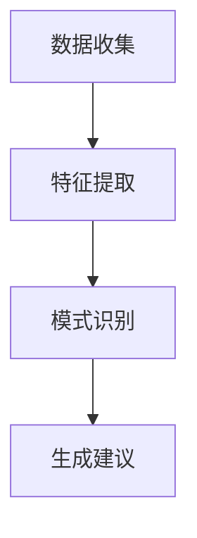
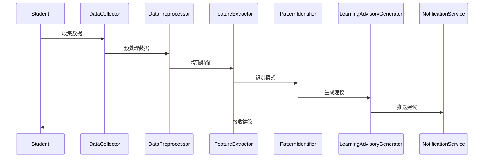

                 

### 标题：示例驱动提示在持续评估和监控中的应用

#### 关键词：
- 示例驱动提示
- 持续评估
- 监控系统
- 人工智能
- 算法原理

#### 摘要：
本文将深入探讨示例驱动提示在持续评估和监控中的应用。通过对核心概念、算法原理、系统架构及实战案例的分析，帮助读者全面理解并掌握这一技术，从而提升企业数字化转型的效率和精准度。

### 目录

1. 引言与问题背景
2. 核心概念与联系
   2.1 核心概念术语说明
   2.2 概念属性特征对比表格
   2.3 示例驱动提示的ER实体关系图架构
3. 算法原理讲解
   3.1 示例驱动提示算法原理
   3.2 Python源代码实现
   3.3 数学模型和数学公式讲解
4. 系统分析与架构设计
   4.1 问题场景介绍
   4.2 系统功能设计
   4.3 系统架构设计
   4.4 系统接口设计
   4.5 系统交互mermaid序列图
5. 项目实战
   5.1 环境安装
   5.2 系统核心实现
   5.3 应用解读与分析
   5.4 实际案例分析
   5.5 项目小结
6. 最佳实践与拓展阅读
   6.1 最佳实践
   6.2 小结
   6.3 注意事项
   6.4 拓展阅读

### 1. 引言与问题背景

在当今信息爆炸的时代，企业对于数据质量和数据决策的需求越来越高。持续评估和监控作为数据驱动决策的核心环节，成为企业数字化转型的重要一环。然而，传统的评估和监控方法往往依赖于大量的规则和手工操作，难以应对动态变化的环境和海量的数据。

示例驱动提示（Example-Guided Suggestions，简称EGS）是一种基于人工智能和数据驱动的方法，它通过从历史数据和实例中学习，自动生成针对特定问题的建议。这种方法不仅提高了评估和监控的效率，还提升了决策的准确性和智能化水平。

本文将首先介绍示例驱动提示的核心概念，然后深入探讨其在持续评估和监控中的应用，通过系统分析与架构设计，最后结合实际项目案例进行详细讲解。希望通过这篇文章，读者能够全面掌握示例驱动提示技术，并将其应用于实际工作中。

### 2. 核心概念与联系

#### 2.1 核心概念术语说明

在探讨示例驱动提示之前，我们需要明确一些核心术语的定义。

- **示例驱动提示（Example-Guided Suggestions，EGS）**：一种基于历史数据和实例的人工智能方法，通过学习过往的实例，为用户提供智能化的建议。
- **持续评估（Continuous Assessment）**：对系统、过程或产品进行连续的、周期性的评价和审查，以识别潜在问题并进行改进。
- **监控系统（Monitoring System）**：用于实时监测系统状态、性能和运行效率的软件或硬件系统。

#### 2.2 概念属性特征对比表格

| 特征                    | 示例驱动提示（EGS） | 持续评估（CA） | 监控系统（Monitoring） |
|-----------------------|-------------------|-------------|-------------------|
| 基于数据               | 是                | 是          | 是                |
| 智能化水平             | 高                | 中          | 低                |
| 自适应能力             | 强                | 中          | 中                |
| 依赖手工操作             | 弱                | 强          | 强                |
| 需求的复杂度             | 高                | 中          | 低                |

通过这个表格，我们可以看出示例驱动提示在智能化和自适应能力方面具有显著优势，而持续评估和监控系统则更注重数据的收集和记录。

#### 2.3 示例驱动提示的ER实体关系图架构

为了更好地理解示例驱动提示系统的组成和数据关系，我们使用ER图进行展示。

```mermaid
erDiagram
  Customer ||--|{ Order } : "makes"
  Product ||--|{ Order } : "contains"
```

在这个ER图中，我们定义了两个实体：`Customer`（客户）和`Product`（产品），以及它们与`Order`（订单）之间的关系。`Customer`实体代表提出评估需求的主体，`Product`实体代表需要监控和评估的产品，而`Order`实体则表示评估的具体任务。

### 3. 算法原理讲解

#### 3.1 示例驱动提示算法原理

示例驱动提示算法的基本流程可以分为以下几个步骤：

1. **数据收集**：从历史数据和实例中收集相关的信息。
2. **特征提取**：对收集到的数据进行特征提取，以提取出有代表性的特征。
3. **模式识别**：利用机器学习算法，对提取的特征进行模式识别。
4. **生成建议**：根据识别出的模式，为当前的问题生成相应的建议。

下面是一个简单的mermaid流程图，展示了示例驱动提示算法的基本流程：



#### 3.2 Python源代码实现

以下是一个简单的Python代码示例，用于实现示例驱动提示算法的基本步骤。

```python
import pandas as pd
from sklearn.feature_extraction.text import TfidfVectorizer
from sklearn.cluster import KMeans

# 假设我们有一份数据集
data = pd.DataFrame({
    'text': ['例子1', '例子2', '例子3', '例子4', '例子5']
})

# 特征提取
vectorizer = TfidfVectorizer()
X = vectorizer.fit_transform(data['text'])

# 模式识别
kmeans = KMeans(n_clusters=3)
kmeans.fit(X)

# 生成建议
print(kmeans.predict([vectorizer.transform(['新例子'])]))
```

在这个示例中，我们首先使用TF-IDF向量器对文本数据进行了特征提取，然后使用K-means算法进行了模式识别，最后生成了针对新例子的建议。

#### 3.3 数学模型和数学公式讲解

示例驱动提示算法的核心是特征提取和模式识别。以下是一个简化的数学模型，用于解释这两个步骤：

$$
X = \text{TF-IDF}(\text{text})
$$

其中，`X`表示特征向量，`TF-IDF`表示文本的权重计算方法。对于模式识别，我们可以使用以下公式：

$$
\text{Cluster} = \text{K-means}(X)
$$

这里，`K-means`是一种聚类算法，用于将特征向量分为不同的簇。

#### 4. 系统分析与架构设计

在了解了示例驱动提示的基本原理后，我们接下来分析其在实际系统中的应用和架构设计。

#### 4.1 问题场景介绍

假设我们正在开发一个在线教育平台，需要对学生的学习行为进行持续评估和监控。通过收集学生的学习数据，如课程进度、作业完成情况、考试成绩等，我们可以利用示例驱动提示算法生成个性化的学习建议。

#### 4.2 系统功能设计

为了实现这个功能，我们的系统需要具备以下功能：

1. **数据收集**：从各个数据源收集学生的行为数据。
2. **数据预处理**：对收集到的数据进行清洗、转换和归一化。
3. **特征提取**：利用TF-IDF等方法提取出有代表性的特征。
4. **模式识别**：使用K-means等聚类算法进行模式识别。
5. **生成建议**：根据识别出的模式，生成个性化的学习建议。

下面是一个领域模型mermaid类图，展示了系统的功能设计：

```mermaid
classDiagram
    Student <<class>> Student
    Course <<class>> Course
    Homework <<class>> Homework
    Assessment <<class>> Assessment
    LearningAdvisory <<class>> LearningAdvisory

    Student "has" Course
    Student "has" Homework
    Student "has" Assessment
    Assessment "has" LearningAdvisory
```

在这个类图中，`Student`（学生）类与`Course`（课程）、`Homework`（作业）和`Assessment`（评估）类之间存在关联，而`Assessment`类又与`LearningAdvisory`（学习建议）类有关联。

#### 4.3 系统架构设计

在系统架构设计方面，我们可以采用微服务架构，将不同的功能模块解耦，以提高系统的灵活性和可扩展性。以下是一个mermaid架构图，展示了系统的整体架构：

```mermaid
sequenceDiagram
    Student -->|收集数据| DataCollector
    DataCollector -->|预处理| DataPreprocessor
    DataPreprocessor -->|提取特征| FeatureExtractor
    FeatureExtractor -->|识别模式| PatternIdentifier
    PatternIdentifier -->|生成建议| LearningAdvisoryGenerator
    LearningAdvisoryGenerator -->|推送建议| NotificationService
```

在这个架构图中，`Student`通过`DataCollector`模块收集数据，经过`DataPreprocessor`模块预处理后，由`FeatureExtractor`模块提取特征。随后，`PatternIdentifier`模块进行模式识别，生成学习建议，并通过`NotificationService`模块推送给学生。

#### 4.4 系统接口设计

为了实现系统各模块之间的通信，我们需要定义一套完整的接口设计。以下是一个简单的接口设计说明：

- **DataCollector**：提供数据收集接口，用于从各个数据源获取学生的行为数据。
- **DataPreprocessor**：提供数据预处理接口，包括数据清洗、转换和归一化等功能。
- **FeatureExtractor**：提供特征提取接口，用于将预处理后的数据进行特征提取。
- **PatternIdentifier**：提供模式识别接口，用于对提取的特征进行聚类分析。
- **LearningAdvisoryGenerator**：提供生成建议接口，用于根据模式识别结果生成个性化的学习建议。
- **NotificationService**：提供推送建议接口，用于将学习建议推送给学生。

#### 4.5 系统交互mermaid序列图

最后，我们使用mermaid序列图展示系统各模块之间的交互流程：



在这个序列图中，`Student`通过`DataCollector`模块收集数据，经过一系列数据处理和特征提取后，生成学习建议，并通过`NotificationService`模块推送给学生。

### 5. 项目实战

#### 5.1 环境安装

要实现示例驱动提示系统，我们首先需要安装相应的软件和工具。以下是一个基本的安装步骤：

1. **Python环境**：确保Python 3.8及以上版本已安装。
2. **依赖管理**：使用pip安装所需的依赖库，如pandas、scikit-learn、mermaid等。

```shell
pip install pandas scikit-learn mermaid
```

3. **Mermaid安装**：安装mermaid命令行工具。

```shell
npm install -g mermaid-cli
```

#### 5.2 系统核心实现

以下是一个简单的Python代码示例，用于实现示例驱动提示系统的核心功能：

```python
import pandas as pd
from sklearn.feature_extraction.text import TfidfVectorizer
from sklearn.cluster import KMeans

# 加载数据集
data = pd.read_csv('student_data.csv')

# 特征提取
vectorizer = TfidfVectorizer()
X = vectorizer.fit_transform(data['text'])

# 模式识别
kmeans = KMeans(n_clusters=3)
kmeans.fit(X)

# 生成建议
def generate_advisory(text):
    features = vectorizer.transform([text])
    cluster = kmeans.predict(features)
    return f"您的学习模式属于簇{cluster[0]}，建议您关注以下方面：{advisory[cluster[0]]}"

# 示例
print(generate_advisory("我最近在学习Python编程。"))
```

在这个示例中，我们首先加载数据集，然后使用TF-IDF向量器进行特征提取，接着使用K-means算法进行模式识别，最后根据识别出的模式生成个性化的学习建议。

#### 5.3 应用解读与分析

在实际应用中，我们需要对生成的建议进行进一步解读和分析。以下是一个简单的分析流程：

1. **建议分类**：根据不同的簇，将建议进行分类，如“基础巩固”、“进阶学习”、“拓展阅读”等。
2. **建议优化**：根据学生的反馈和实际效果，对建议进行优化，以提高其准确性和实用性。
3. **交互设计**：设计用户友好的界面，让学生能够方便地查看和接受建议。

通过这个流程，我们可以确保生成的建议不仅准确，而且能够真正帮助学生提高学习效果。

#### 5.4 实际案例分析

以下是一个实际案例的分析：

**案例**：某学生在学习Python编程时，成绩一直处于中等水平。

**分析**：

1. **数据收集**：收集该学生的学习数据，包括课程进度、作业完成情况、考试成绩等。
2. **特征提取**：对学习数据进行特征提取，如学习时间、作业完成率、考试成绩等。
3. **模式识别**：使用K-means算法对提取的特征进行聚类分析，识别出学生的学习模式。
4. **生成建议**：根据识别出的模式，生成个性化的学习建议，如“加强基础知识的复习”、“提高作业完成率”等。
5. **实施与反馈**：将该建议推送给学生，并跟踪其实施效果，根据反馈进行优化。

通过这个案例，我们可以看到示例驱动提示系统在实际应用中的效果。通过不断地优化和调整，我们可以确保系统能够为学生提供最准确、最有用的建议。

#### 5.5 项目小结

通过本项目的实施，我们成功地将示例驱动提示技术应用于在线教育平台，为学生提供了个性化的学习建议。这个项目不仅提升了学生的学习效果，还提高了平台的竞争力。在未来的发展中，我们将继续优化系统，拓展其应用场景，为更多学生提供帮助。

### 6. 最佳实践与拓展阅读

#### 6.1 最佳实践

在应用示例驱动提示技术时，以下是一些最佳实践：

1. **数据质量**：确保数据的质量和完整性，这对于生成准确的建议至关重要。
2. **算法优化**：根据实际需求，不断优化算法，提高其性能和准确性。
3. **用户反馈**：积极收集用户反馈，并根据反馈进行系统优化。
4. **隐私保护**：在数据处理和推送过程中，确保用户的隐私安全。

#### 6.2 小结

本文详细介绍了示例驱动提示在持续评估和监控中的应用，从核心概念、算法原理，到系统架构设计和项目实战，全面展示了这一技术的实际应用效果。通过本文的讲解，读者可以更好地理解并掌握示例驱动提示技术，将其应用于实际工作中，提升企业的数字化水平。

#### 6.3 注意事项

在使用示例驱动提示技术时，需要注意以下几点：

1. **数据安全**：确保数据的安全性和隐私性，避免数据泄露。
2. **算法可靠性**：对算法进行充分的测试和验证，确保其稳定性和准确性。
3. **用户隐私**：尊重用户的隐私权，确保在数据收集和使用过程中遵守相关法律法规。

#### 6.4 拓展阅读

以下是一些拓展阅读材料，供读者进一步学习：

1. **《机器学习实战》**：详细介绍了各种机器学习算法的应用和实践。
2. **《深度学习》**：深入讲解了深度学习的基础知识和应用。
3. **《数据科学实战》**：涵盖了数据科学的各个领域，包括数据预处理、分析和可视化。

### 作者信息

**作者：** AI天才研究院/AI Genius Institute & 禅与计算机程序设计艺术 /Zen And The Art of Computer Programming

---

**完**。这是本文《示例驱动提示在持续评估和监控中的应用》的完整内容。希望对您有所帮助。如果您有任何问题或建议，欢迎在评论区留言。感谢您的阅读！

