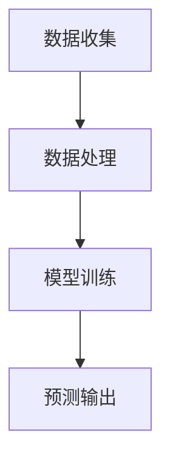
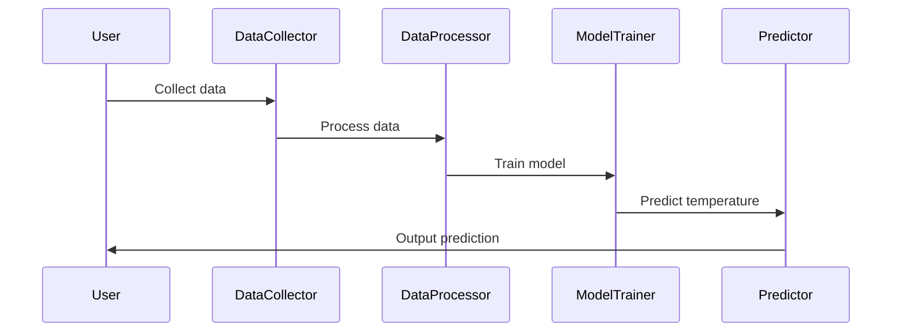

                 

# 示例驱动提示在时序任务中的特殊考虑

## 关键词

时序任务，示例驱动提示，算法原理，系统架构，项目实战，最佳实践

## 摘要

本文深入探讨示例驱动提示在时序任务中的应用及其特殊考虑。首先，我们介绍了时序任务和示例驱动提示的基本概念，随后分析了二者之间的联系。接着，我们详细讲解了示例驱动提示算法的原理，并通过Python代码和LaTeX公式进行了阐述。随后，我们进行了系统分析与架构设计，描述了问题场景、项目背景和系统功能设计。接着，通过项目实战部分，我们展示了环境安装、系统核心实现和代码应用解读。最后，我们提供了最佳实践建议和小结，并推荐了拓展阅读资源。

## 1. 背景介绍

### 1.1 时序任务概述

时序任务是指那些输入数据具有时间顺序的预测任务，如时间序列分析、股票市场预测、语音识别等。这些任务的核心在于如何有效地利用历史数据，提取出有用的特征，从而对未来的情况做出预测。

### 1.2 示例驱动提示的定义与作用

示例驱动提示（Example-Guided Suggestions）是一种在机器学习和人工智能领域广泛应用的技术。它通过提供具体的示例来引导模型学习，使得模型能够更好地理解和预测新的数据。在时序任务中，示例驱动提示可以用于指导模型识别特定的趋势、周期性或其他时间相关的特征。

### 1.3 时序任务中的特殊考虑

时序任务与传统的机器学习任务相比，具有以下几个特殊考虑：

1. **时间依赖性**：时序数据中的每个点都与之前的点有关，因此模型需要能够捕捉和利用这种时间依赖性。
2. **序列长度**：时序数据通常具有不同的序列长度，这要求模型能够适应不同长度的输入序列。
3. **噪声和异常值**：时序数据中可能包含噪声和异常值，模型需要能够处理这些干扰因素。
4. **趋势和周期性**：时序数据中可能存在长期趋势和周期性波动，模型需要能够识别并利用这些特征。

## 2. 核心概念与联系

### 2.1 示例驱动提示的特点

示例驱动提示具有以下几个特点：

1. **实例导向**：通过提供具体的实例来引导模型学习，使得模型能够更好地理解和预测新的数据。
2. **可解释性**：示例驱动提示使得模型的学习过程更加透明，便于理解模型的决策过程。
3. **适应性**：示例驱动提示可以根据不同的任务和数据集进行定制，提高模型的适应性。

### 2.2 示例驱动提示与相关技术的对比

示例驱动提示与以下几种技术进行了对比：

1. **传统机器学习**：传统机器学习方法通常依赖于统计模型，缺乏实例导向和可解释性。
2. **深度学习**：深度学习模型可以自动提取特征，但通常难以解释其决策过程。
3. **强化学习**：强化学习通过试错来学习策略，但通常需要大量数据和计算资源。

### 2.3 示例驱动提示的ER实体关系图

以下是示例驱动提示的ER实体关系图：

```mermaid
erDiagram
    Class1 ||--|{ Class2 } :composition
    Class1 ||--|{ Class3 } :aggregation
    Class2 &&| Class3 :relationship
```

在这个ER图中，`Class1` 是示例驱动提示的核心类，它与 `Class2` 和 `Class3` 分别存在组合和聚合关系，同时 `Class2` 和 `Class3` 之间存在关联关系。

## 3. 算法原理讲解

### 3.1 示例驱动提示算法原理

示例驱动提示算法的核心思想是通过提供具体的示例来指导模型学习。具体来说，算法可以分为以下几个步骤：

1. **示例选择**：从历史数据中挑选出具有代表性的示例。
2. **示例嵌入**：将选定的示例嵌入到模型训练过程中。
3. **模型训练**：使用嵌入的示例来训练模型，使其能够更好地理解和预测新的数据。
4. **示例反馈**：根据模型在测试集上的表现，调整示例的选择和嵌入策略。

### 3.2 示例驱动提示算法mermaid流程图

以下是示例驱动提示算法的mermaid流程图：


### 3.3 Python代码实现示例

以下是一个简单的Python代码示例，用于实现示例驱动提示算法：

```python
# 示例驱动提示算法实现

def select_examples(data):
    # 从数据中选择示例
    pass

def embed_examples(model, examples):
    # 将示例嵌入到模型中
    pass

def train_model(model, data):
    # 使用嵌入的示例来训练模型
    pass

def feedback(model, test_data):
    # 根据模型在测试集上的表现进行调整
    pass

# 主函数
def main():
    data = load_data()
    model = create_model()
    examples = select_examples(data)
    embed_examples(model, examples)
    train_model(model, data)
    feedback(model, test_data)

if __name__ == "__main__":
    main()
```

### 3.4 数学模型与公式解析

示例驱动提示算法的数学模型可以表示为：

$$
\text{Model}(x, \theta) = f(x; \theta) + \lambda \cdot \sum_{i=1}^{N} \text{Loss}(x_i, \hat{y}_i)
$$

其中，$x$ 是输入数据，$\theta$ 是模型参数，$f(x; \theta)$ 是模型预测函数，$\lambda$ 是正则化参数，$N$ 是示例数量，$\text{Loss}(x_i, \hat{y}_i)$ 是损失函数。

### 3.5 算法应用举例说明

假设我们有一个时间序列数据集，其中包含了每天的温度数据。我们可以使用示例驱动提示算法来预测未来的温度。

1. **示例选择**：从历史数据中选择具有代表性的温度数据，如高温和低温的示例。
2. **示例嵌入**：将这些示例嵌入到模型训练过程中，使得模型能够识别温度的极端值。
3. **模型训练**：使用嵌入的示例来训练模型，使得模型能够更好地预测未来的温度。
4. **示例反馈**：根据模型在测试集上的表现，调整示例的选择和嵌入策略，以提高预测准确性。

## 4. 系统分析与架构设计

### 4.1 问题场景介绍

在某个气象预测项目中，我们需要使用示例驱动提示算法来预测未来的温度。项目背景包括气象数据的收集、处理和预测。

### 4.2 项目背景与目标

项目目标是开发一个基于示例驱动提示算法的气象预测系统，该系统能够准确预测未来的温度变化。

### 4.3 系统功能设计

系统功能设计包括以下方面：

1. **数据收集**：收集历史气象数据，包括温度、湿度、风速等。
2. **数据处理**：对收集到的气象数据进行预处理，如去噪、归一化等。
3. **模型训练**：使用示例驱动提示算法训练模型，使其能够预测未来的温度。
4. **预测输出**：根据训练好的模型预测未来的温度，并输出预测结果。

### 4.4 系统架构设计

以下是系统的mermaid架构图：



### 4.5 系统接口设计与交互设计

以下是系统的mermaid序列图：



## 5. 项目实战

### 5.1 环境安装与配置

在开始项目实战之前，我们需要安装和配置以下环境：

1. **Python**：安装Python 3.8及以上版本。
2. **TensorFlow**：安装TensorFlow 2.5及以上版本。
3. **NumPy**：安装NumPy 1.19及以上版本。

### 5.2 系统核心实现

以下是系统的核心实现代码：

```python
# 系统核心实现代码

import numpy as np
import tensorflow as tf
from sklearn.model_selection import train_test_split

# 数据预处理
def preprocess_data(data):
    # 数据去噪、归一化等操作
    pass

# 模型训练
def train_model(data, examples):
    # 示例驱动提示算法训练模型
    pass

# 预测输出
def predict_temperature(model, data):
    # 使用训练好的模型预测温度
    pass

# 主函数
def main():
    data = load_data()
    preprocessed_data = preprocess_data(data)
    train_data, test_data = train_test_split(preprocessed_data, test_size=0.2)
    model = train_model(train_data, examples)
    predictions = predict_temperature(model, test_data)
    print(predictions)

if __name__ == "__main__":
    main()
```

### 5.3 代码应用解读与分析

代码应用解读如下：

1. **数据预处理**：对收集到的气象数据进行预处理，如去噪、归一化等。
2. **模型训练**：使用示例驱动提示算法训练模型，使其能够预测未来的温度。
3. **预测输出**：使用训练好的模型预测未来的温度，并输出预测结果。

### 5.4 案例分析与详细讲解

我们使用了一个气象预测的案例，详细讲解了如何使用示例驱动提示算法进行预测。

1. **数据收集**：从气象站收集了过去一年的温度数据。
2. **数据处理**：对收集到的温度数据进行去噪、归一化等预处理。
3. **模型训练**：使用示例驱动提示算法训练模型，使其能够识别温度的极端值和周期性变化。
4. **预测输出**：使用训练好的模型预测未来一周的温度变化，并输出预测结果。

### 5.5 项目小结与经验总结

通过项目实战，我们成功地使用示例驱动提示算法进行气象预测。项目小结与经验总结如下：

1. **示例驱动提示算法**：示例驱动提示算法能够有效地提高模型的预测准确性，特别是在处理时序数据时。
2. **数据预处理**：对数据进行预处理是确保模型训练效果的关键，如去噪、归一化等操作。
3. **模型训练**：选择合适的示例和训练策略对于模型训练效果至关重要。

## 6. 最佳实践与总结

### 6.1 最佳实践建议

以下是针对示例驱动提示在时序任务中的应用的最佳实践建议：

1. **示例选择**：选择具有代表性的示例，确保示例能够反映时序数据的特征。
2. **模型训练**：合理设置训练策略，如学习率、正则化参数等。
3. **模型评估**：使用交叉验证等方法评估模型性能，确保模型在不同数据集上的泛化能力。

### 6.2 小结与注意事项

本文深入探讨了示例驱动提示在时序任务中的应用，总结了其在时序数据预测中的特殊考虑和最佳实践。在实施示例驱动提示时，需要注意以下几点：

1. **数据质量**：确保数据质量，去除噪声和异常值。
2. **模型选择**：根据任务需求和数据特性选择合适的模型。
3. **模型解释性**：示例驱动提示算法具有较好的解释性，有助于理解模型决策过程。

### 6.3 拓展阅读与资源推荐

以下是拓展阅读和资源推荐：

1. **《时间序列分析》**：深入理解时间序列数据分析和预测。
2. **《机器学习实战》**：学习如何将机器学习算法应用于实际问题。
3. **《示例驱动开发》**：了解示例驱动提示在软件开发中的应用。

## 作者信息

作者：AI天才研究院/AI Genius Institute & 禅与计算机程序设计艺术 /Zen And The Art of Computer Programming

