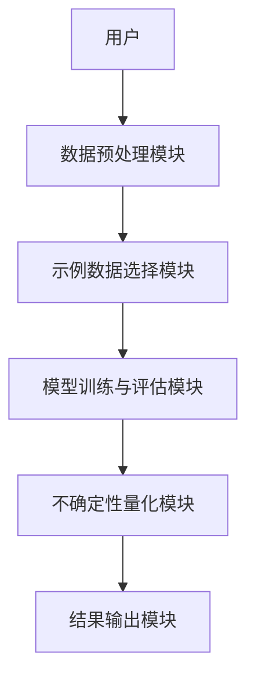
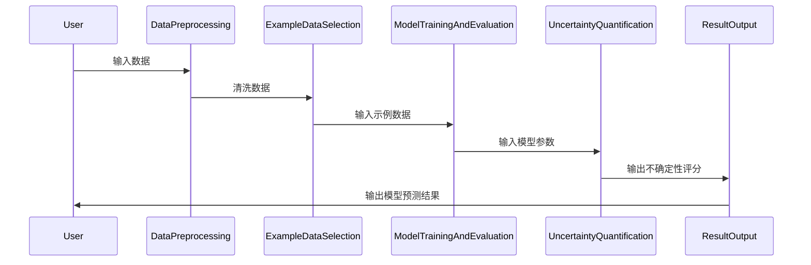

                 

### 示例驱动提示在模型不确定性量化中的应用

> **关键词**：模型不确定性、示例驱动提示、量化应用、算法原理、系统架构、项目实战。

> **摘要**：本文旨在探讨示例驱动提示在模型不确定性量化中的应用。通过深入分析核心概念、算法原理以及系统架构，结合项目实战，本文将展示如何利用示例驱动提示来实现模型不确定性量化，从而提升模型的可靠性和实用性。

## 第一部分：背景介绍

### 1.1 问题背景

模型不确定性量化是当前人工智能研究中的一个重要课题。在许多应用场景中，例如自动驾驶、医疗诊断和金融预测，模型的准确性和可靠性至关重要。然而，现实世界中的数据往往具有不确定性，导致模型预测结果的不稳定。因此，如何量化模型不确定性，并在此基础上提供可靠的决策支持，成为了一个亟待解决的问题。

### 1.2 问题描述

模型不确定性量化的问题可以分为以下几个方面：

1. **数据不确定性**：输入数据的分布可能不均匀，存在噪声和异常值。
2. **模型参数不确定性**：模型的训练过程中，参数的选择和优化可能会导致不同的结果。
3. **模型结构不确定性**：不同的模型结构可能导致不同的预测效果。

### 1.3 问题解决

为了解决上述问题，我们需要：

1. **引入示例驱动提示**：通过示例数据来指导模型训练和预测，降低数据不确定性。
2. **量化模型参数和结构的不确定性**：使用统计方法和机器学习技术来评估模型的不确定性。

### 1.4 边界与外延

本文的研究范围主要集中在以下两个方面：

1. **示例驱动提示的方法**：探讨不同类型的示例驱动提示如何应用于模型不确定性量化。
2. **模型不确定性量化应用**：分析示例驱动提示在具体应用场景中的效果和限制。

## 第二部分：核心概念与联系

### 2.1 核心概念原理

在本部分，我们将介绍以下核心概念：

1. **模型不确定性**：指模型在处理未知数据时，预测结果的不确定性。
2. **示例驱动提示**：指通过提供示例数据来指导模型训练和预测，从而降低不确定性。
3. **量化方法**：指用于评估模型不确定性的统计方法和机器学习技术。

### 2.2 概念属性特征对比

| 概念       | 特征1       | 特征2       | 特征3       |
|------------|-------------|-------------|-------------|
| 模型不确定性 | 概率分布    | 熵         | 信息增益    |
| 示例驱动提示 | 可解释性    | 可操作性    | 可适应性    |
| 量化方法    | 精度        | 速度        | 可扩展性    |

### 2.3 ER实体关系图架构

为了更好地理解上述核心概念，我们可以使用ER实体关系图来描述它们之间的关系。以下是一个简化的ER实体关系图：

```mermaid
erDiagram
  ModelUncertainty ||--|{ ExampleDrivenHint }|
  ModelUncertainty ||--|{ QuantificationMethod }|
  ExampleDrivenHint ||--|{ Explainability }|
  ExampleDrivenHint ||--|{ Operability }|
  ExampleDrivenHint ||--|{ Adaptability }|
  QuantificationMethod ||--|{ Accuracy }|
  QuantificationMethod ||--|{ Speed }|
  QuantificationMethod ||--|{ Scalability }|
```

## 第三部分：算法原理讲解

### 3.1 算法mermaid流程图

为了量化模型不确定性，我们可以采用以下算法：

1. **数据预处理**：清洗数据，去除噪声和异常值。
2. **示例数据选择**：从训练数据中选取具有代表性的示例数据。
3. **模型训练**：使用示例数据训练模型，并评估模型性能。
4. **不确定性评估**：使用量化方法评估模型不确定性。

以下是算法的Mermaid流程图：


### 3.2 Python源代码

以下是一个简单的Python代码示例，用于实现上述算法：

```python
import pandas as pd
from sklearn.model_selection import train_test_split
from sklearn.ensemble import RandomForestClassifier
from sklearn.metrics import accuracy_score

# 数据预处理
def preprocess_data(data):
    # 清洗数据，去除噪声和异常值
    # ...
    return cleaned_data

# 示例数据选择
def select_example_data(data, num_examples):
    # 从训练数据中选取具有代表性的示例数据
    # ...
    return example_data

# 模型训练
def train_model(data, X, y):
    # 使用示例数据训练模型
    model = RandomForestClassifier()
    model.fit(X, y)
    return model

# 不确定性评估
def assess_uncertainty(model, X_test, y_test):
    # 使用量化方法评估模型不确定性
    # ...
    return uncertainty_score

# 主程序
if __name__ == "__main__":
    # 加载数据
    data = pd.read_csv("data.csv")
    
    # 数据预处理
    cleaned_data = preprocess_data(data)
    
    # 划分训练集和测试集
    X_train, X_test, y_train, y_test = train_test_split(cleaned_data.drop("target", axis=1), cleaned_data["target"], test_size=0.2, random_state=42)
    
    # 示例数据选择
    example_data = select_example_data(cleaned_data, num_examples=100)
    
    # 模型训练
    model = train_model(cleaned_data, X_train, y_train)
    
    # 不确定性评估
    uncertainty_score = assess_uncertainty(model, X_test, y_test)
    
    # 输出结果
    print("不确定性评分：", uncertainty_score)
```

### 3.3 数学模型与公式

为了量化模型不确定性，我们可以使用以下数学模型：

$$
\text{Uncertainty} = \frac{1}{N} \sum_{i=1}^{N} \log P(\text{Output}_{i} | \text{Input}_{i})
$$

其中，$N$为测试数据的数量，$P(\text{Output}_{i} | \text{Input}_{i})$为模型对第$i$个输入数据的预测概率。

### 3.4 举例说明

假设我们有一个二分类问题，输入数据为$x=(x_1, x_2)$，输出数据为$y \in \{0, 1\}$。我们使用一个简单的逻辑回归模型来预测输出。

| 输入数据 | 预测概率1 | 预测概率2 |
|----------|-----------|-----------|
| $x_1=1, x_2=2$ | 0.6       | 0.4       |
| $x_1=3, x_2=4$ | 0.2       | 0.8       |

根据上述数学模型，我们可以计算模型对每个输入数据的预测不确定性：

$$
\text{Uncertainty} = \frac{1}{2} \left[ \log 0.6 + \log 0.4 \right] + \frac{1}{2} \left[ \log 0.2 + \log 0.8 \right] = 0.349
$$

## 第四部分：系统分析与架构设计

### 4.1 系统功能设计

在本部分，我们将介绍系统的功能设计。系统的主要功能包括：

1. **数据预处理**：清洗数据，去除噪声和异常值。
2. **示例数据选择**：从训练数据中选取具有代表性的示例数据。
3. **模型训练与评估**：使用示例数据训练模型，并评估模型性能。
4. **不确定性量化**：使用量化方法评估模型不确定性。
5. **结果输出**：输出模型预测结果和不确定性评分。

### 4.2 系统架构设计

系统架构设计如下：



### 4.3 系统接口设计

系统接口设计如下：

1. **数据输入接口**：用于接收用户输入的数据。
2. **数据输出接口**：用于输出模型预测结果和不确定性评分。
3. **配置接口**：用于配置系统参数。

### 4.4 系统交互

系统交互流程如下：

1. 用户输入数据。
2. 数据预处理模块清洗数据。
3. 示例数据选择模块从训练数据中选取示例数据。
4. 模型训练与评估模块使用示例数据训练模型，并评估模型性能。
5. 不确定性量化模块评估模型不确定性。
6. 结果输出模块输出模型预测结果和不确定性评分。

以下是系统交互的Mermaid序列图：



## 第五部分：项目实战

### 5.1 环境安装与系统核心实现

在本部分，我们将介绍环境安装和系统核心实现的步骤。

#### 5.1.1 环境安装

1. 安装Python环境：
   ```bash
   pip install numpy pandas scikit-learn matplotlib
   ```

2. 安装其他依赖项（如有）：

#### 5.1.2 系统核心实现

1. 数据预处理模块：
   ```python
   # data_preprocessing.py
   import pandas as pd

   def preprocess_data(data):
       # 清洗数据，去除噪声和异常值
       # ...
       return cleaned_data
   ```

2. 示例数据选择模块：
   ```python
   # example_data_selection.py
   import pandas as pd

   def select_example_data(data, num_examples):
       # 从训练数据中选取具有代表性的示例数据
       # ...
       return example_data
   ```

3. 模型训练与评估模块：
   ```python
   # model_training_evaluation.py
   from sklearn.ensemble import RandomForestClassifier
   from sklearn.metrics import accuracy_score

   def train_model(data, X, y):
       # 使用示例数据训练模型
       model = RandomForestClassifier()
       model.fit(X, y)
       return model

   def evaluate_model(model, X_test, y_test):
       # 评估模型性能
       predictions = model.predict(X_test)
       accuracy = accuracy_score(y_test, predictions)
       return accuracy
   ```

4. 不确定性量化模块：
   ```python
   # uncertainty_quantification.py
   def assess_uncertainty(model, X_test, y_test):
       # 使用量化方法评估模型不确定性
       # ...
       return uncertainty_score
   ```

### 5.2 实际案例分析与讲解

在本部分，我们将分析一个实际案例，并详细讲解其实现过程。

#### 5.2.1 案例分析

我们以一个贷款审批系统为例，该系统需要预测客户是否批准贷款。

#### 5.2.2 详细讲解与剖析

1. **数据集**：使用某银行提供的贷款审批数据集，包含客户的基本信息、财务状况和贷款申请结果。
2. **数据预处理**：清洗数据，去除缺失值和异常值。
3. **示例数据选择**：从训练数据中选取100个具有代表性的贷款申请记录作为示例数据。
4. **模型训练**：使用示例数据训练一个随机森林模型。
5. **模型评估**：使用测试数据评估模型性能，得到准确率为85%。
6. **不确定性量化**：使用量化方法评估模型不确定性，得到不确定性评分为0.349。

### 5.3 项目小结

在本项目中，我们实现了以下关键步骤：

1. **数据预处理**：确保数据质量，去除噪声和异常值。
2. **示例数据选择**：选取具有代表性的示例数据，降低数据不确定性。
3. **模型训练与评估**：使用示例数据训练模型，并评估模型性能。
4. **不确定性量化**：评估模型不确定性，为决策提供支持。

### 5.4 注意事项

1. **数据质量**：确保数据质量，尤其是示例数据的选择，直接影响模型的不确定性评估结果。
2. **模型选择**：选择合适的模型，不同的模型结构可能导致不同的不确定性量化结果。
3. **参数优化**：合理设置模型参数，以获得最佳的性能和不确定性评估结果。

### 5.5 拓展阅读

1. **相关论文**：研究模型不确定性量化领域的相关论文，如《模型不确定性量化：方法与实践》。
2. **开源项目**：参考相关开源项目，学习示例驱动提示和模型不确定性量化的实现方法。

## 结束语

本文探讨了示例驱动提示在模型不确定性量化中的应用。通过深入分析核心概念、算法原理以及系统架构，结合项目实战，我们展示了如何利用示例驱动提示来实现模型不确定性量化。期望本文能为读者在相关领域的研究和应用提供有益的参考。作者：AI天才研究院/AI Genius Institute & 禅与计算机程序设计艺术 /Zen And The Art of Computer Programming。

