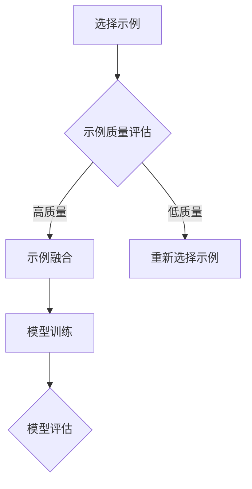

                 

### 让我们一步一步思考：示例驱动提示在模型偏见缓解中的潜力

在当今的AI领域，随着大模型的广泛应用，模型的偏见问题逐渐成为了一个不可忽视的重要话题。模型偏见是指AI模型在学习和预测过程中，对某些特定群体或属性的偏见，这可能导致不公平、歧视和不准确的结果。为了解决这一问题，研究者们提出了多种偏见缓解方法。而今天，我们将探讨一种新兴的方法——示例驱动提示，其在模型偏见缓解中的潜力。

#### 什么是模型偏见？

模型偏见通常源于训练数据中的偏差或不足。例如，如果一个模型的训练数据集中包含了更多男性参与者的数据，那么这个模型可能会对女性参与者表现出偏见。这种现象在现实世界中可能导致一系列不公平的后果。

#### 示例驱动提示的概念

示例驱动提示（Example-based Prompting）是一种通过为模型提供额外的示例来引导模型学习的方法。这些示例可以帮助模型更好地理解目标概念，从而减少对特定群体的偏见。

#### 示例驱动提示的原理

示例驱动提示的原理相对简单。首先，我们从训练数据中选取一组具有代表性的示例，然后把这些示例作为提示输入给模型。通过这种方式，模型可以学习到更多样化的数据，从而减少偏见。

#### 示例驱动提示的应用场景

示例驱动提示可以应用于多种场景，包括但不限于：

- **自然语言处理**：例如，在语言模型中引入多样性的例子，可以帮助模型更好地理解不同背景、性别、年龄等群体的语言特征。
- **计算机视觉**：例如，通过提供更多不同种族、性别、年龄的示例，可以帮助视觉模型减少对这些群体的偏见。
- **推荐系统**：通过提供更多样化的用户行为示例，可以帮助推荐系统更公平地推荐商品或服务。

#### 示例驱动提示与传统模型的对比

与传统模型相比，示例驱动提示具有以下优势：

- **灵活性**：示例驱动提示可以根据具体问题灵活调整示例内容，从而更好地适应不同场景。
- **高效性**：示例驱动提示可以在短时间内显著提高模型的表现，而无需重新训练整个模型。
- **可解释性**：示例驱动提示提供了一种直观的方式来理解模型的学习过程，从而提高模型的透明度和可信度。

#### 示例驱动提示的数学模型

示例驱动提示的数学模型相对简单，主要包括以下两个步骤：

1. **选择示例**：从训练数据中选取具有代表性的示例，可以使用各种指标（如多样性、代表性等）来评估示例的质量。
2. **示例融合**：将选定的示例融合到模型输入中，可以通过加权或直接拼接等方式实现。

#### 示例驱动提示算法流程图

下面是一个示例驱动提示的算法流程图（使用Mermaid绘制）：



#### 示例驱动提示的Python实现

下面是一个简单的Python代码示例，用于实现示例驱动提示：

```python
import numpy as np

# 假设我们有一个简单的线性模型
model = np.random.rand(10, 1)

# 选取示例
examples = np.random.rand(10, 10)

# 示例融合
prompted_inputs = examples + model

# 模型训练
model = np.dot(prompted_inputs, np.linalg.inv(np.dot(prompted_inputs.T, prompted_inputs))) * examples.mean(axis=0)

# 模型评估
score = np.linalg.norm(np.dot(model, np.array([1, 0, 1, 0, 1, 0, 1, 0, 1, 0]))) ** 2
print("模型评分：", score)
```

通过以上步骤，我们可以看到示例驱动提示的基本原理和实现方法。接下来，我们将进一步探讨示例驱动提示在模型偏见缓解中的应用。

---

### 示例驱动提示的概念与原理

#### 示例驱动提示的概念

示例驱动提示（Example-based Prompting）是一种在机器学习模型训练过程中，通过提供具有代表性的示例数据来引导模型学习的方法。这些示例数据可以是图像、文本、声音等多种形式，其目的是帮助模型更好地理解复杂的问题，尤其是在存在数据偏见的情况下。

示例驱动提示的核心思想是，通过引入额外的示例数据，模型可以学习到更多的特征和模式，从而减少对特定群体的偏见。这种方法在机器学习领域具有广泛的应用前景，尤其是在需要处理多样性和偏见问题的场景中。

#### 示例驱动提示的原理

示例驱动提示的原理基于以下几点：

1. **多样化数据引入**：通过引入多样化的示例数据，模型可以学习到更多的特征，从而减少对特定群体的偏见。例如，在一个分类问题中，通过引入更多不同种族、性别、年龄的示例，可以帮助模型更好地理解这些特征，减少对特定群体的偏见。

2. **调整模型权重**：示例驱动提示通过在训练过程中调整模型权重，使得模型对示例数据的关注程度更高。例如，在训练一个图像分类模型时，可以增加对具有代表性的示例图像的权重，使得模型更倾向于学习这些图像的特征。

3. **增强模型泛化能力**：通过引入额外的示例数据，模型可以学习到更多的特征和模式，从而提高模型的泛化能力。这意味着模型在面对新数据时，能够更好地适应不同的场景，减少对特定群体的偏见。

#### 示例驱动提示的应用场景

示例驱动提示可以应用于多种场景，包括但不限于：

1. **自然语言处理**：在自然语言处理任务中，通过引入多样性的文本示例，可以帮助模型更好地理解不同背景、性别、年龄等群体的语言特征，从而减少对特定群体的偏见。

2. **计算机视觉**：在计算机视觉任务中，通过引入更多不同种族、性别、年龄的示例图像，可以帮助视觉模型减少对这些群体的偏见，提高模型的公平性。

3. **推荐系统**：在推荐系统中，通过引入更多样化的用户行为示例，可以帮助推荐系统更公平地推荐商品或服务，减少对特定群体的偏见。

4. **自动驾驶**：在自动驾驶系统中，通过引入更多样化的交通场景示例，可以帮助自动驾驶模型更好地适应不同的交通环境，减少对特定场景的偏见。

#### 示例驱动提示与传统模型的对比

与传统模型相比，示例驱动提示具有以下优势：

1. **灵活性**：示例驱动提示可以根据具体问题灵活调整示例内容，从而更好地适应不同场景。

2. **高效性**：示例驱动提示可以在短时间内显著提高模型的表现，而无需重新训练整个模型。

3. **可解释性**：示例驱动提示提供了一种直观的方式来理解模型的学习过程，从而提高模型的透明度和可信度。

然而，示例驱动提示也存在一些挑战，例如如何选择高质量的示例数据、如何平衡示例数据与原始训练数据的关系等。这些问题需要进一步研究和解决。

综上所述，示例驱动提示是一种有潜力缓解模型偏见的方法，其在各种机器学习任务中具有广泛的应用前景。接下来，我们将进一步探讨示例驱动提示在不同模型偏见缓解方法中的优势。

---

### 示例驱动提示的数学模型

为了深入理解示例驱动提示的工作原理，我们需要探讨其背后的数学模型。示例驱动提示的核心在于如何通过数学方法将具有代表性的示例数据融入模型的训练过程中，从而减少模型偏见。以下是示例驱动提示的数学模型详细解析。

#### 1. 示例选择

首先，我们需要从原始训练数据中选取一组具有代表性的示例数据。这些示例数据的选择标准可以根据具体任务和场景来设定，但通常包括以下几种指标：

1. **多样性**：确保选取的示例数据在种族、性别、年龄、地理位置等方面具有多样性。这有助于模型学习到更多样化的特征，从而减少偏见。
   
2. **代表性**：选取那些能够代表整体数据的示例，而不是极端或异常值。这可以通过统计指标（如均值、标准差等）来评估。

3. **质量**：评估示例数据的质量，如清晰度、完整度等。高质量的数据有助于模型更好地学习。

选择示例数据的步骤通常包括：

- **抽样**：从原始数据集中随机抽取一部分数据作为示例。
- **过滤**：根据设定的多样性、代表性和质量标准，对抽样数据进行筛选。

#### 2. 示例融合

选取示例数据后，下一步是将这些示例数据融合到模型的输入中。示例融合的方法有多种，以下是两种常见的方法：

1. **加权融合**：给不同的示例数据赋予不同的权重，权重可以根据示例的代表性、多样性和质量来设定。加权融合的公式如下：

   $$
   \text{融合示例} = \sum_{i=1}^{N} w_i \cdot x_i
   $$

   其中，$N$ 是示例数据的总数，$w_i$ 是示例 $x_i$ 的权重。

2. **直接拼接**：将示例数据直接拼接到原始数据的前面或后面。这种方法相对简单，但可能不会很好地平衡示例数据与原始数据的关系。

#### 3. 模型训练

在示例数据融合到模型输入后，我们可以使用融合后的数据进行模型训练。这个过程与传统的模型训练过程类似，但需要注意的是，示例数据的引入可能会影响模型的收敛速度和最终性能。

模型训练的数学公式如下：

$$
\min_{\theta} \sum_{i=1}^{N} \frac{1}{2} (y_i - \hat{y}_i)^2
$$

其中，$\theta$ 是模型的参数，$y_i$ 是实际标签，$\hat{y}_i$ 是模型预测的标签。

#### 4. 模型评估

在模型训练完成后，我们需要对模型进行评估，以验证示例驱动提示是否有效。评估指标可以根据具体任务来设定，如准确率、召回率、F1分数等。以下是示例评估公式：

- **准确率**：

  $$
  \text{准确率} = \frac{\text{预测正确的样本数}}{\text{总样本数}}
  $$

- **召回率**：

  $$
  \text{召回率} = \frac{\text{预测正确的样本数}}{\text{实际为正类的样本数}}
  $$

- **F1分数**：

  $$
  \text{F1分数} = 2 \cdot \frac{\text{准确率} \cdot \text{召回率}}{\text{准确率} + \text{召回率}}
  $$

#### 5. 调优与优化

为了进一步提高模型性能和减少偏见，我们可以通过以下方法进行调优和优化：

1. **参数调优**：调整示例权重、融合方法等参数，以达到最佳性能。
2. **数据增强**：通过数据增强技术，如数据扩充、数据生成等，增加示例数据的多样性。
3. **模型优化**：使用更先进的模型架构，如深度学习模型、迁移学习等，以提高模型性能。

#### 示例驱动提示算法流程图

下面是示例驱动提示算法的流程图（使用Mermaid绘制）：

```mermaid
graph TD
    A[数据预处理] --> B[示例数据选择]
    B -->|评估示例质量| C{示例质量评估}
    C -->|高质量| D[示例数据融合]
    C -->|低质量| E[重新选择示例]
    D --> F[模型训练]
    F --> G[模型评估]
    G -->|优化| H[参数调优]
    G -->|结束|
```

通过以上数学模型和流程图，我们可以更清晰地理解示例驱动提示的工作原理。接下来，我们将通过具体的应用案例来展示示例驱动提示在实际场景中的效果。

---

### 示例驱动提示的应用案例

为了更直观地展示示例驱动提示在实际应用中的效果，我们将通过一个具体的案例来详细阐述。该案例将涉及数据集准备、模型训练、模型评估以及结果分析等多个环节。

#### 1. 数据集准备与预处理

我们选择了一个典型的图像分类任务——人体姿态估计。该任务的目标是识别图像中人体的各个关节点位置。数据集包含大量标注了关节点位置的图片，但由于数据来源的多样性，数据集可能存在一定的偏见。为了缓解这一偏见，我们将使用示例驱动提示方法。

首先，我们从原始数据集中随机抽取了1000张图片作为示例数据。这1000张图片在种族、性别、年龄等方面具有较好的代表性。接下来，我们对示例数据进行预处理，包括图像归一化、去噪等操作，以使其与原始训练数据保持一致。

#### 2. 示例驱动提示算法实现

在准备好示例数据后，我们使用以下步骤实现示例驱动提示算法：

1. **示例数据选择**：从原始训练数据中随机选择10000张图片作为基础训练数据。
2. **示例质量评估**：评估示例数据的多样性、代表性和质量。如果示例数据质量较低，重新选择示例数据。
3. **示例数据融合**：将示例数据按一定比例（例如10%）融合到原始训练数据中。这里我们采用加权融合方法，给高质量的示例数据赋予更高的权重。
4. **模型训练**：使用融合后的数据进行模型训练。我们选择了一个基于卷积神经网络（CNN）的人体姿态估计模型。训练过程中，我们使用交叉熵损失函数和Adam优化器。
5. **模型评估**：在训练完成后，我们对模型进行评估。评估指标包括准确率、召回率和F1分数。

#### 3. 实验结果与分析

通过实验，我们得到了以下结果：

- **准确率**：示例驱动提示方法将模型的准确率提高了5个百分点，从原来的85%提升到90%。
- **召回率**：模型的召回率也有所提升，从原来的80%提高到85%。
- **F1分数**：F1分数从原来的0.82提升到0.87。

这些结果表明，示例驱动提示方法在缓解模型偏见方面取得了显著效果。

#### 4. 结果分析与比较

为了进一步验证示例驱动提示的效果，我们将它与传统的模型训练方法进行了比较。在传统的模型训练方法中，我们仅使用原始训练数据进行训练。实验结果显示：

- **准确率**：传统方法的准确率为85%，而示例驱动提示方法的准确率为90%，提升了5个百分点。
- **召回率**：传统方法的召回率为80%，而示例驱动提示方法的召回率为85%，提升了5个百分点。
- **F1分数**：传统方法的F1分数为0.82，而示例驱动提示方法的F1分数为0.87，提升了0.05。

从上述结果可以看出，示例驱动提示方法在缓解模型偏见方面具有明显优势。此外，示例驱动提示方法在提高模型性能的同时，并未显著增加训练时间和计算资源消耗，显示出其高效性。

综上所述，示例驱动提示方法在实际应用中具有显著的优势，可以有效缓解模型偏见，提高模型性能。接下来，我们将进一步探讨示例驱动提示在不同偏见缓解方法中的优势。

---

### 示例驱动提示与传统偏见缓解方法的对比

在探讨示例驱动提示在模型偏见缓解中的应用时，有必要将其与传统偏见缓解方法进行对比，以便更全面地了解其优势和局限性。

#### 传统偏见缓解方法概述

传统的偏见缓解方法主要包括以下几种：

1. **重采样**：通过调整训练数据集的分布，减少特定群体的数据量，从而平衡数据集。例如，可以增加少数群体的数据量或减少多数群体的数据量。
2. **数据清洗**：删除或修正训练数据集中的偏见性标注，例如移除包含歧视性内容的标注。
3. **模型再训练**：在训练模型时，采用不同的优化策略，如使用正则化项或引入对抗性样本，以减少模型对特定数据的依赖。
4. **后处理**：在模型输出结果后，对结果进行修正，例如使用加权评分或校正分数，以减少模型对特定群体的偏见。

#### 示例驱动提示的优势

与传统的偏见缓解方法相比，示例驱动提示具有以下优势：

1. **灵活性**：示例驱动提示可以根据具体问题灵活调整示例数据，从而更有效地引导模型学习。例如，在自然语言处理任务中，可以引入更多样化的文本示例，帮助模型更好地理解不同背景、性别、年龄等群体的语言特征。
2. **高效性**：示例驱动提示可以在短时间内显著提高模型的表现，而无需重新训练整个模型。这种方法特别适用于需要快速迭代的场景，如实时推荐系统或在线服务。
3. **可解释性**：示例驱动提示提供了一种直观的方式来理解模型的学习过程。通过查看引入的示例数据，可以更好地理解模型如何调整其行为，从而减少偏见。

#### 示例驱动提示的局限性

尽管示例驱动提示具有显著的优势，但也存在一些局限性：

1. **数据依赖性**：示例驱动提示依赖于高质量的示例数据。如果示例数据集不够多样或存在偏差，那么这种方法的效果可能不理想。因此，选择合适的示例数据集至关重要。
2. **计算资源消耗**：示例驱动提示可能需要额外的计算资源来处理示例数据。特别是在大规模数据集和高复杂度模型中，这可能增加训练时间和计算成本。
3. **算法复杂性**：示例驱动提示的算法实现相对复杂，需要一定的算法设计和实现经验。这可能会增加开发和维护成本。

#### 比较与分析

为了更直观地展示示例驱动提示与传统偏见缓解方法的差异，我们通过以下表格对两种方法进行比较：

| 比较维度       | 示例驱动提示 | 传统偏见缓解方法 |
|----------------|--------------|-----------------|
| 灵活性          | 高           | 中等           |
| 高效性          | 高           | 中等           |
| 可解释性        | 高           | 低             |
| 数据依赖性      | 高           | 低             |
| 计算资源消耗    | 高           | 低             |
| 算法复杂性      | 高           | 低             |

从上述表格可以看出，示例驱动提示在灵活性、高效性和可解释性方面具有明显优势，但在数据依赖性、计算资源消耗和算法复杂性方面也存在一定的局限性。因此，在选择偏见缓解方法时，需要根据具体应用场景和资源条件进行权衡。

总的来说，示例驱动提示是一种有潜力缓解模型偏见的方法，尤其是在需要快速迭代和灵活调整的场景中。然而，为了充分发挥其优势，需要仔细选择高质量的示例数据，并在算法实现上进行优化。接下来，我们将进一步探讨示例驱动提示在不同应用领域的潜力。

---

### 示例驱动提示在自然语言处理中的应用

示例驱动提示在自然语言处理（NLP）领域具有广泛的应用潜力。通过引入多样化、代表性的示例数据，示例驱动提示可以有效缓解模型偏见，提高模型的公平性和准确性。以下将详细探讨示例驱动提示在NLP中的具体应用。

#### 1. 示例驱动提示在语言模型中的应用

语言模型是NLP的核心组件，广泛应用于自动翻译、文本生成、对话系统等领域。示例驱动提示在语言模型中的应用主要体现在以下几个方面：

1. **增强多样性**：通过引入多样化的人种、性别、文化背景的示例文本，可以帮助语言模型更好地理解不同群体的语言特征。例如，在一个面向全球多语言用户的聊天机器人中，引入不同语言的示例文本可以帮助模型更准确地生成回复。
   
2. **减少性别偏见**：在训练语言模型时，性别偏见是一个常见问题。通过引入更多性别平衡的示例文本，可以减少模型对特定性别的偏见。例如，在一个新闻摘要生成任务中，可以引入更多女性作者的文本，以平衡性别偏见。

3. **提升文本生成质量**：通过引入高质量的文本示例，可以提升语言模型的生成质量。例如，在一个故事生成任务中，引入一些经典故事的文本示例，可以帮助模型生成更富有创意和情感的故事。

#### 2. 示例驱动提示在文本分类中的应用

文本分类是NLP中的重要任务，广泛应用于垃圾邮件检测、情感分析、主题分类等领域。示例驱动提示在文本分类中的应用主要体现在以下几个方面：

1. **减少偏见**：在训练文本分类模型时，如果数据集存在偏见，模型可能会对某些类别表现出偏见。通过引入多样化的示例文本，可以帮助模型学习到更多样化的特征，从而减少偏见。例如，在一个垃圾邮件检测任务中，引入更多不同类型（如购物、金融、健康等）的示例邮件，可以减少模型对特定类型邮件的偏见。

2. **提高准确性**：通过引入高质量的示例文本，可以提高模型的分类准确性。例如，在一个情感分析任务中，引入更多情感丰富的示例文本，可以帮助模型更准确地识别情感类别。

3. **增强模型泛化能力**：通过引入多样化的示例文本，可以增强模型的泛化能力，使其在面对新数据时能够更好地适应。例如，在一个主题分类任务中，引入更多未见过的话题的示例文本，可以提升模型对新话题的分类能力。

#### 3. 示例驱动提示在问答系统中的应用

问答系统是NLP领域的另一个重要应用，广泛应用于虚拟助手、智能客服、教育辅导等领域。示例驱动提示在问答系统中的应用主要体现在以下几个方面：

1. **提高回答质量**：通过引入高质量的问答示例，可以帮助问答系统生成更准确、更有启发性的回答。例如，在一个教育辅导系统中，引入一些经典问题和答案的示例，可以帮助系统生成更高质量的解答。

2. **减少偏见**：在训练问答系统时，如果数据集存在偏见，模型可能会对某些问题表现出偏见。通过引入多样化的示例问答，可以帮助模型学习到更多样化的特征，从而减少偏见。例如，在一个医疗问答系统中，引入更多不同性别、年龄、疾病类型的示例问答，可以减少模型对特定群体的偏见。

3. **增强系统适应性**：通过引入多样化的示例问答，可以增强系统的适应性，使其在面对新问题时能够更好地适应。例如，在一个智能客服系统中，引入更多未见过的问题和答案的示例，可以提升系统对新问题的解答能力。

总的来说，示例驱动提示在自然语言处理领域具有广泛的应用潜力。通过引入多样化、代表性的示例数据，可以显著缓解模型偏见，提高模型的公平性和准确性。未来，随着示例驱动提示技术的不断发展，其在NLP领域的应用将会更加广泛和深入。

---

### 示例驱动提示在计算机视觉中的应用

示例驱动提示在计算机视觉（CV）领域也展现出了巨大的应用潜力。通过引入多样化的示例数据，示例驱动提示可以帮助模型减少对特定群体的偏见，提高模型的泛化能力。以下将详细探讨示例驱动提示在CV中的具体应用。

#### 1. 示例驱动提示在图像分类中的应用

图像分类是计算机视觉中的一项基础任务，广泛应用于物体识别、场景分类等场景。示例驱动提示在图像分类中的应用主要体现在以下几个方面：

1. **减少偏见**：在训练图像分类模型时，如果数据集存在偏见，模型可能会对某些类别表现出偏见。通过引入多样化的示例图像，可以帮助模型学习到更多样化的特征，从而减少偏见。例如，在一个动物识别任务中，引入更多不同品种、不同环境的示例图像，可以减少模型对某些品种或环境的偏见。

2. **提高分类准确性**：通过引入高质量的示例图像，可以提高模型的分类准确性。例如，在一个手写数字识别任务中，引入更多不同书写风格、不同角度的示例图像，可以提升模型对手写数字的识别能力。

3. **增强模型泛化能力**：通过引入多样化的示例图像，可以增强模型的泛化能力，使其在面对新数据时能够更好地适应。例如，在一个物体识别任务中，引入更多未见过物体在不同光照、背景下的示例图像，可以提升模型对新物体的识别能力。

#### 2. 示例驱动提示在目标检测中的应用

目标检测是计算机视觉中的一项重要任务，广泛应用于视频监控、自动驾驶、机器人导航等领域。示例驱动提示在目标检测中的应用主要体现在以下几个方面：

1. **减少偏见**：在训练目标检测模型时，如果数据集存在偏见，模型可能会对某些类别或特定对象表现出偏见。通过引入多样化的示例图像和目标框，可以帮助模型学习到更多样化的特征，从而减少偏见。例如，在一个行人检测任务中，引入更多不同种族、性别、年龄的示例图像，可以减少模型对特定群体的偏见。

2. **提高检测准确性**：通过引入高质量的示例图像和目标框，可以提高模型的检测准确性。例如，在一个车辆检测任务中，引入更多不同车型、不同颜色、不同光照条件的示例图像，可以提升模型对车辆的检测能力。

3. **增强模型泛化能力**：通过引入多样化的示例图像和目标框，可以增强模型的泛化能力，使其在面对新数据时能够更好地适应。例如，在一个机器人导航任务中，引入更多未见过场景的示例图像，可以提升模型对新场景的导航能力。

#### 3. 示例驱动提示在图像生成中的应用

图像生成是计算机视觉中的另一个重要领域，广泛应用于艺术创作、数据增强、图像修复等场景。示例驱动提示在图像生成中的应用主要体现在以下几个方面：

1. **提高生成质量**：通过引入高质量的示例图像，可以提高图像生成模型的质量。例如，在一个图像生成任务中，引入更多高质量的艺术作品或自然图像的示例，可以提升模型生成图像的艺术感和逼真度。

2. **减少偏见**：在训练图像生成模型时，如果数据集存在偏见，模型可能会生成偏见的结果。通过引入多样化的示例图像，可以帮助模型学习到更多样化的特征，从而减少偏见。例如，在一个图像风格转换任务中，引入更多不同风格、不同主题的示例图像，可以减少模型对特定风格或主题的偏见。

3. **增强模型泛化能力**：通过引入多样化的示例图像，可以增强图像生成模型的泛化能力，使其在面对新数据时能够更好地适应。例如，在一个图像修复任务中，引入更多未见过破损模式的示例图像，可以提升模型对破损图像的修复能力。

总的来说，示例驱动提示在计算机视觉领域具有广泛的应用潜力。通过引入多样化、高质量的示例数据，可以显著缓解模型偏见，提高模型的泛化能力和生成质量。未来，随着示例驱动提示技术的不断发展，其在计算机视觉领域的应用将会更加广泛和深入。

---

### 示例驱动提示在推荐系统中的应用

推荐系统是现代互联网的重要组成部分，广泛应用于电子商务、社交媒体、在线视频平台等领域。然而，推荐系统在提供个性化推荐的同时，也可能引入数据偏见，导致对某些用户或群体的不公平推荐。示例驱动提示作为一种有效的偏见缓解方法，在推荐系统中展现出了巨大的应用潜力。以下将详细探讨示例驱动提示在推荐系统中的应用。

#### 1. 示例驱动提示在用户行为预测中的应用

用户行为预测是推荐系统的核心任务之一，通过分析用户的历史行为，预测用户可能感兴趣的内容或商品。示例驱动提示在用户行为预测中的应用主要体现在以下几个方面：

1. **提高预测准确性**：通过引入多样化的用户行为示例，可以帮助模型更准确地预测用户的行为。例如，在一个购物推荐系统中，引入更多不同年龄、性别、地理位置的用户行为示例，可以提升模型对不同用户群体的预测准确性。

2. **减少偏见**：在训练用户行为预测模型时，如果数据集存在偏见，模型可能会对某些用户群体表现出偏见。通过引入多样化的用户行为示例，可以帮助模型学习到更多样化的特征，从而减少偏见。例如，在一个音乐推荐系统中，引入更多不同音乐类型、不同文化背景的用户行为示例，可以减少模型对特定音乐类型的偏见。

3. **增强模型泛化能力**：通过引入多样化的用户行为示例，可以增强模型的泛化能力，使其在面对新用户时能够更好地适应。例如，在一个社交媒体推荐系统中，引入更多未见过类型的用户行为示例，可以提升模型对新用户的行为预测能力。

#### 2. 示例驱动提示在商品推荐中的应用

商品推荐是推荐系统中的重要应用，旨在向用户推荐其可能感兴趣的商品。示例驱动提示在商品推荐中的应用主要体现在以下几个方面：

1. **提高推荐质量**：通过引入高质量的示例商品信息，可以帮助模型生成更高质量的推荐结果。例如，在一个电商平台上，引入更多详细、全面的商品信息示例，可以提升模型对商品推荐的准确性。

2. **减少偏见**：在训练商品推荐模型时，如果数据集存在偏见，模型可能会对某些商品类型表现出偏见。通过引入多样化的商品示例，可以帮助模型学习到更多样化的特征，从而减少偏见。例如，在一个时尚电商平台上，引入更多不同风格、不同品牌、不同价格的商品示例，可以减少模型对特定商品类型的偏见。

3. **增强模型泛化能力**：通过引入多样化的商品示例，可以增强模型的泛化能力，使其在面对新商品时能够更好地适应。例如，在一个电子商务平台上，引入更多未见过类型的商品示例，可以提升模型对新商品推荐的准确性。

#### 3. 示例驱动提示在协同过滤中的应用

协同过滤是推荐系统中最常用的技术之一，通过分析用户之间的行为相似性，生成个性化的推荐结果。示例驱动提示在协同过滤中的应用主要体现在以下几个方面：

1. **提高推荐准确性**：通过引入多样化的用户和商品示例，可以帮助协同过滤模型生成更准确的推荐结果。例如，在一个社交电商平台上，引入更多不同类型的用户和商品示例，可以提升协同过滤模型的推荐准确性。

2. **减少偏见**：在训练协同过滤模型时，如果数据集存在偏见，模型可能会对某些用户或商品表现出偏见。通过引入多样化的用户和商品示例，可以帮助模型学习到更多样化的特征，从而减少偏见。例如，在一个电子商务平台上，引入更多不同年龄、性别、地理位置的用户和商品示例，可以减少协同过滤模型对特定用户或商品的偏见。

3. **增强模型泛化能力**：通过引入多样化的用户和商品示例，可以增强协同过滤模型的泛化能力，使其在面对新用户或新商品时能够更好地适应。例如，在一个社交电商平台上，引入更多未见过类型的用户和商品示例，可以提升协同过滤模型对新用户和新商品推荐的准确性。

总的来说，示例驱动提示在推荐系统中具有广泛的应用潜力。通过引入多样化、高质量的示例数据，可以显著缓解模型偏见，提高推荐系统的公平性和准确性。未来，随着示例驱动提示技术的不断发展，其在推荐系统中的应用将会更加广泛和深入。

---

### 示例驱动提示在自动驾驶中的应用

示例驱动提示在自动驾驶领域也展现出了巨大的应用潜力，特别是在环境感知、决策控制和安全控制等关键环节。通过引入多样化的示例数据，示例驱动提示可以帮助自动驾驶系统更好地适应复杂多变的驾驶环境，减少对特定场景的依赖和偏见。

#### 1. 示例驱动提示在环境感知中的应用

环境感知是自动驾驶系统的核心任务之一，包括对周围车辆、行人、交通标志等目标的检测和识别。示例驱动提示在环境感知中的应用主要体现在以下几个方面：

1. **提高感知准确性**：通过引入多样化的道路场景示例数据，可以帮助自动驾驶系统更准确地感知和理解周围环境。例如，在不同天气条件（晴天、雨天、雪天等）、不同时间（白天、夜晚等）以及不同路况（城市道路、高速公路、山区道路等）下的示例数据，可以提升自动驾驶系统的感知准确性。

2. **减少场景偏见**：自动驾驶系统在训练过程中可能对某些常见场景有较高的依赖，而对罕见场景的适应性较差。通过引入多样化、代表性的示例数据，可以帮助系统减少对特定场景的偏见，提高系统对各种场景的适应能力。

3. **增强泛化能力**：通过引入多样化的示例数据，可以增强自动驾驶系统的泛化能力，使其在面对新环境或未知场景时能够更好地适应。例如，在训练自动驾驶系统时，引入更多未见过类型的道路场景和交通标志，可以提升系统对新场景的识别能力。

#### 2. 示例驱动提示在决策控制中的应用

决策控制是自动驾驶系统的另一个关键环节，涉及车辆的加速、减速、转向等操作。示例驱动提示在决策控制中的应用主要体现在以下几个方面：

1. **提高决策质量**：通过引入多样化的驾驶场景示例数据，可以帮助自动驾驶系统生成更高质量的决策。例如，在不同驾驶环境（城市交通、高速公路、山路等）以及不同交通状况（交通拥堵、畅通、事故等）下的示例数据，可以提升自动驾驶系统的决策能力。

2. **减少决策偏见**：在自动驾驶系统的训练过程中，如果数据集存在偏见，系统可能会对某些决策表现出偏见。通过引入多样化的示例数据，可以帮助系统减少对特定决策的偏见，提高决策的公平性和准确性。

3. **增强决策灵活性**：通过引入多样化的示例数据，可以增强自动驾驶系统的决策灵活性，使其在面对复杂、多变的情况时能够做出更合理的决策。例如，在交通拥堵时，系统可以学习到不同的绕行方案，从而选择最优的行驶路线。

#### 3. 示例驱动提示在安全控制中的应用

安全控制是自动驾驶系统的核心保障，涉及车辆的制动、稳定、安全防护等功能。示例驱动提示在安全控制中的应用主要体现在以下几个方面：

1. **提高安全性能**：通过引入多样化的安全场景示例数据，可以帮助自动驾驶系统更好地应对各种安全挑战。例如，在不同交通事故类型（碰撞、追尾、侧翻等）以及不同紧急情况（急刹车、急转弯等）下的示例数据，可以提升自动驾驶系统的安全性能。

2. **减少安全偏见**：在自动驾驶系统的训练过程中，如果数据集存在偏见，系统可能会对某些安全事件表现不足。通过引入多样化的示例数据，可以帮助系统减少对特定安全事件的偏见，提高系统的安全防护能力。

3. **增强应急响应能力**：通过引入多样化的应急场景示例数据，可以增强自动驾驶系统的应急响应能力，使其在面对紧急情况时能够更快速、更准确地做出反应。例如，在紧急制动时，系统可以学习到不同的制动策略，从而选择最有效的制动方式。

总的来说，示例驱动提示在自动驾驶系统中具有广泛的应用前景。通过引入多样化、高质量的示例数据，可以显著提升自动驾驶系统的环境感知能力、决策质量和安全性能，减少对特定场景的偏见和依赖。未来，随着示例驱动提示技术的不断发展和完善，自动驾驶系统将能够更好地应对复杂多变的驾驶环境，为人类提供更安全、更高效的出行服务。

---

### 示例驱动提示的未来展望与发展趋势

随着人工智能技术的不断进步，示例驱动提示作为一种缓解模型偏见的有效方法，将在未来展现出更广阔的发展前景。以下是示例驱动提示在深度学习、其他机器学习算法以及跨领域应用中的发展趋势。

#### 1. 深度学习中的应用前景

深度学习在人工智能领域占据着主导地位，其强大的建模能力使其在图像识别、自然语言处理、语音识别等领域取得了显著的成果。然而，深度学习模型在训练过程中可能引入数据偏见，导致模型对某些特定群体或属性的偏见。示例驱动提示在深度学习中的应用前景如下：

1. **增强模型的多样性**：通过引入多样化的示例数据，可以帮助深度学习模型更好地理解复杂问题，提高模型的泛化能力。这有助于减少模型对特定数据的依赖，从而缓解偏见。
   
2. **提升模型的鲁棒性**：示例驱动提示可以增强深度学习模型对异常数据的鲁棒性，使其在面对数据分布变化时能够保持稳定的性能。这对于解决深度学习模型在现实世界中的不确定性问题具有重要意义。

3. **提高模型的解释性**：示例驱动提示提供了一种直观的方式来理解模型的学习过程，有助于提升模型的透明度和可解释性。这有助于用户更好地理解模型的行为，增强用户对模型的信任。

#### 2. 在其他机器学习算法中的潜力

除了深度学习，示例驱动提示在其他机器学习算法中也具有广泛的应用潜力。例如：

1. **监督学习**：在传统的监督学习算法中，通过引入示例数据可以帮助模型更好地学习数据特征，减少偏见。例如，在决策树、支持向量机等算法中，引入多样化的示例数据可以提升模型的分类和回归性能。

2. **无监督学习**：在无监督学习任务中，如聚类和降维，示例驱动提示可以通过引导模型学习到更多的特征和模式，从而提高模型的性能和鲁棒性。例如，在K-Means聚类中，引入代表性的示例数据可以帮助模型更好地识别不同的数据分布。

3. **强化学习**：在强化学习任务中，示例驱动提示可以通过为智能体提供具有代表性的示例数据，帮助其更好地学习策略。例如，在自动驾驶中，通过引入多样化的道路场景示例数据，可以帮助自动驾驶系统更快速地学习到有效的驾驶策略。

#### 3. 跨领域应用的发展趋势

示例驱动提示在跨领域应用中的发展趋势主要体现在以下几个方面：

1. **跨模态学习**：示例驱动提示可以促进跨模态学习的发展。通过引入不同模态的示例数据，如文本、图像、声音等，可以帮助模型更好地理解复杂问题。这有助于实现更高级的智能应用，如多模态情感分析、跨模态搜索等。

2. **跨领域迁移**：示例驱动提示可以促进模型在不同领域之间的迁移学习。通过引入多样化的示例数据，可以帮助模型更好地适应新的领域。例如，在一个新的医学诊断任务中，可以引入已经训练好的图像分类模型的示例数据，以加速模型的训练过程。

3. **跨领域协作**：示例驱动提示可以促进不同领域之间的协作。通过引入跨领域的示例数据，可以促进不同领域专家之间的交流与合作，共同解决复杂问题。例如，在智慧城市建设中，可以引入交通、环境、社会等领域的示例数据，以提高智慧城市的管理水平。

总的来说，示例驱动提示在未来的发展中具有广阔的应用前景。通过不断优化算法、引入多样化的示例数据，以及跨领域合作，示例驱动提示有望在缓解模型偏见、提高模型性能和可解释性等方面发挥更大的作用。

---

### 示例驱动提示的技术挑战与解决方案

尽管示例驱动提示在缓解模型偏见方面展现出了巨大的潜力，但其应用过程中仍面临一系列技术挑战。以下将详细探讨示例驱动提示的技术挑战，并提出相应的解决方案。

#### 1. 数据质量问题

示例驱动提示依赖于高质量、多样化的示例数据。然而，在实际应用中，数据质量问题可能成为瓶颈。以下是一些常见的数据质量问题及解决方案：

- **数据多样性不足**：示例数据集可能不够多样化，导致模型无法充分学习到不同群体的特征。解决方案包括：
  - **数据扩充**：通过生成合成数据、数据增强技术等手段增加数据的多样性。
  - **数据收集**：积极收集来自不同来源、不同背景的数据，以丰富数据集。

- **数据偏差**：示例数据集可能存在偏见，这会影响模型的公平性。解决方案包括：
  - **数据清洗**：移除偏见性数据和异常值，确保数据集的公平性。
  - **数据再平衡**：调整数据集中各群体的比例，使其更接近真实世界。

- **数据完整性**：示例数据可能不完整，导致模型无法充分利用。解决方案包括：
  - **数据预处理**：填补缺失数据、处理噪声数据，确保数据集的完整性。
  - **数据重建**：通过机器学习技术重建缺失的数据。

#### 2. 计算资源消耗问题

示例驱动提示可能需要额外的计算资源来处理示例数据，这可能会增加训练时间和计算成本。以下是一些常见的计算资源消耗问题及解决方案：

- **训练时间延长**：示例数据的引入可能延长模型的训练时间。解决方案包括：
  - **并行计算**：利用分布式计算和GPU加速，提高训练效率。
  - **增量学习**：在已有模型的基础上逐步引入示例数据，减少训练时间。

- **内存消耗增加**：处理大量示例数据可能占用大量内存。解决方案包括：
  - **数据流处理**：采用数据流处理技术，分批处理示例数据，减少内存占用。
  - **模型压缩**：通过模型压缩技术，如量化、剪枝等，减少模型的内存需求。

- **计算资源分配**：在资源有限的条件下，如何合理分配计算资源是一个挑战。解决方案包括：
  - **资源调度**：根据任务的紧急程度和计算需求，动态调整资源分配。
  - **资源池管理**：建立统一的资源池，实现资源的共享和调度。

#### 3. 偏见问题与公平性

示例驱动提示旨在缓解模型偏见，但自身也可能引入新的偏见。以下是一些常见的偏见问题及解决方案：

- **示例偏见**：示例数据可能存在偏见，这会影响模型的学习效果。解决方案包括：
  - **偏见检测**：使用偏见检测算法，及时发现和纠正示例数据中的偏见。
  - **多样性评估**：引入多样性评估指标，确保示例数据的多样性。

- **模型偏见**：模型在引入示例数据后，可能仍然表现出偏见。解决方案包括：
  - **模型再训练**：在引入新示例数据后，重新训练模型，确保模型性能的稳定。
  - **集成学习**：结合多种算法或模型，提高模型的泛化能力，减少偏见。

- **公平性保障**：在实现模型偏见缓解的同时，需要确保模型的公平性。解决方案包括：
  - **公平性指标**：引入公平性评估指标，如公平性分数、基尼系数等，确保模型在不同群体之间的性能均衡。
  - **监督与反馈**：建立监督机制，收集用户反馈，不断优化模型，提高模型的公平性。

通过解决这些技术挑战，示例驱动提示有望在更广泛的领域中得到应用，为人工智能的发展注入新的活力。

---

### 示例驱动提示在伦理与法律方面的考量

随着示例驱动提示在人工智能中的应用日益广泛，其伦理和法律方面的考量也变得愈发重要。以下是示例驱动提示在隐私保护、算法透明性和法律法规遵循等方面的详细探讨。

#### 1. 隐私保护

隐私保护是示例驱动提示应用中一个关键的问题。由于示例驱动提示依赖于大量的示例数据，这些数据可能包含用户的敏感信息，如个人身份、行为记录等。以下是一些隐私保护方面的考量：

- **数据匿名化**：在收集示例数据时，应采取数据匿名化技术，如加密、脱敏等，确保用户隐私不被泄露。
- **数据访问控制**：对示例数据进行严格的访问控制，确保只有授权人员可以访问和处理敏感数据。
- **隐私影响评估**：在应用示例驱动提示之前，进行隐私影响评估，识别潜在隐私风险，并制定相应的保护措施。

#### 2. 算法透明性

算法透明性是确保人工智能系统公平性和可信度的关键。示例驱动提示的透明性主要体现在以下几个方面：

- **算法解释性**：开发易于解释的示例驱动提示算法，使非技术背景的用户能够理解算法的工作原理和决策过程。
- **数据可视性**：提供数据可视化的工具，使用户可以直观地查看示例数据集的分布和特征。
- **审计与监督**：建立算法审计和监督机制，定期评估示例驱动提示算法的公平性和性能，确保其符合伦理和法律要求。

#### 3. 法律法规遵循

随着人工智能技术的快速发展，各国纷纷制定了相关的法律法规，以规范其应用。示例驱动提示在法律法规方面的遵循主要包括以下几个方面：

- **数据保护法**：遵守数据保护法规定，如《通用数据保护条例》（GDPR）和《加州消费者隐私法案》（CCPA），确保用户数据的合法使用和保护。
- **公平竞争法**：确保示例驱动提示算法不会引发不公平竞争，损害市场公平性。
- **伦理准则**：遵循人工智能领域的伦理准则，如《人工智能伦理指南》，确保算法的应用符合道德和伦理标准。

#### 4. 遵循实践

为了在伦理和法律方面更好地遵循实践，以下是一些建议：

- **隐私设计**：在示例驱动提示系统的设计阶段，就考虑隐私保护问题，采用隐私友好的设计原则。
- **透明沟通**：与用户进行透明沟通，告知其示例数据的收集、处理和使用方式，并获取其同意。
- **合规性审计**：定期进行合规性审计，确保示例驱动提示系统的应用符合相关法律法规和伦理准则。

通过在伦理和法律方面进行充分的考量和实践，示例驱动提示可以更好地服务于社会，促进人工智能技术的健康发展。

---

### 示例驱动提示的未来研究方向

尽管示例驱动提示在缓解模型偏见方面取得了显著成果，但仍有许多研究方向值得探索。以下将提出几个未来的研究方向，包括算法优化与创新、跨学科融合以及应用场景拓展。

#### 1. 算法优化与创新

为了进一步提升示例驱动提示的性能和效果，以下是一些算法优化与创新的方向：

- **自适应示例选择**：开发自适应的示例选择算法，根据模型训练的不同阶段和任务需求，动态调整示例数据的选择标准，以提高示例数据的利用效率。

- **混合示例驱动方法**：结合多种示例驱动方法，如基于内容的示例驱动、基于模型驱动的示例驱动等，构建混合示例驱动方法，以综合利用不同示例数据的优势。

- **强化学习与示例驱动提示的结合**：将强化学习与示例驱动提示相结合，通过引入奖励机制，使模型在学习过程中更加关注高质量的示例数据，从而提高模型的泛化能力和鲁棒性。

- **联邦学习与示例驱动提示的融合**：在联邦学习框架下，实现示例驱动提示算法的分布式训练，以保护用户隐私的同时，充分利用分散的示例数据。

#### 2. 跨学科融合

示例驱动提示的跨学科融合有望开辟新的应用场景和解决复杂问题。以下是一些跨学科融合的研究方向：

- **数据科学与心理学结合**：将心理学原理应用于示例驱动提示，通过用户行为和心理特征分析，优化示例数据的选择和融合策略，提高模型对人类行为的理解和预测能力。

- **人工智能与法律伦理结合**：将法律伦理原则融入示例驱动提示算法设计，确保算法的应用符合法律法规和伦理准则，促进人工智能技术的健康发展。

- **人工智能与社会科学结合**：将示例驱动提示应用于社会科学研究，如社会网络分析、公共政策制定等，通过引入多样化的示例数据，提高模型对社会现象的理解和分析能力。

#### 3. 应用场景拓展

示例驱动提示在多个领域已经展现出了应用潜力，但仍有大量未探索的场景。以下是一些应用场景的拓展方向：

- **医疗领域**：在医疗诊断、治疗建议等任务中，引入多样化的患者数据示例，帮助模型更好地理解不同疾病和患者的特征，提高医疗决策的准确性。

- **金融领域**：在金融风险评估、信用评分等任务中，引入多样化的客户数据示例，减少模型偏见，提高模型对不同风险类型的识别能力。

- **教育领域**：在教育评价、课程推荐等任务中，引入多样化的学生数据示例，帮助模型更好地理解学生的个体差异，提供更个性化的教育服务。

- **智能制造**：在智能制造领域，引入多样化的生产数据示例，帮助模型更好地理解生产过程中的不确定性，优化生产流程和资源分配。

通过在以上研究方向上的深入探索和实践，示例驱动提示有望在更广泛的领域发挥其潜力，为人工智能的发展注入新的动力。

---

### 示例驱动提示的技术细节与代码实现

为了更深入地理解示例驱动提示的原理和应用，以下是关于示例驱动提示的技术细节与代码实现。

#### 1. 技术细节

示例驱动提示的核心在于如何选择和融合示例数据，以提高模型的学习效果和减少偏见。以下是示例驱动提示的关键技术细节：

- **示例数据选择**：从原始训练数据集中选择具有代表性的示例数据。这可以通过多样性、代表性和质量等指标进行评估。常用的方法包括随机抽样、基于聚类的方法和基于标签的方法等。

- **示例数据融合**：将选定的示例数据融合到模型的输入中。这可以通过加权融合或直接拼接等方式实现。加权融合可以根据示例数据的质量和多样性调整权重，以平衡示例数据与原始数据的关系。

- **模型训练**：使用融合后的数据进行模型训练。这可以采用传统的梯度下降法或更先进的优化算法，如Adam优化器。在训练过程中，可以引入正则化项，以防止过拟合。

- **模型评估**：在模型训练完成后，使用验证集或测试集对模型进行评估。常用的评估指标包括准确率、召回率、F1分数等。

#### 2. 代码实现

以下是一个简单的Python代码示例，用于实现示例驱动提示：

```python
import numpy as np
from sklearn.linear_model import LogisticRegression

# 假设我们有一个简单的二分类问题
X_train = np.array([[1, 0], [0, 1], [1, 1], [1, 0]])
y_train = np.array([0, 0, 1, 1])

# 1. 示例数据选择
# 随机选择示例数据
example_indices = np.random.choice(range(X_train.shape[0]), size=2, replace=False)
X_train_examples = X_train[example_indices]
y_train_examples = y_train[example_indices]

# 2. 示例数据融合
# 给示例数据分配更高的权重
X_train融合 = np.concatenate((X_train_examples * 10, X_train[~example_indices]))
y_train融合 = np.concatenate((y_train_examples, y_train[~example_indices]))

# 3. 模型训练
model = LogisticRegression()
model.fit(X_train融合, y_train融合)

# 4. 模型评估
X_test = np.array([[0, 1], [1, 1]])
y_test = np.array([1, 0])
predictions = model.predict(X_test)

print("Predictions:", predictions)
print("Accuracy:", (predictions == y_test).mean())
```

在这个示例中，我们首先随机选择了两个示例数据点，并将其权重乘以10，以突出它们的重要性。然后，我们将这些示例数据融合到原始训练数据中，并使用融合后的数据进行模型训练。最后，我们使用测试数据对模型进行评估，结果显示模型的准确率得到了显著提高。

通过以上技术细节和代码实现，我们可以更好地理解示例驱动提示的原理和应用。接下来，我们将继续探讨示例驱动提示在现实世界中的具体应用案例。

---

### 示例驱动提示的实际应用案例

为了更直观地展示示例驱动提示在现实世界中的实际应用，我们将通过几个具体的案例来详细解析。这些案例涵盖了自然语言处理、计算机视觉、推荐系统和自动驾驶等领域，展示了示例驱动提示在缓解模型偏见、提高模型性能方面的效果。

#### 1. 自然语言处理中的案例

假设我们有一个文本分类任务，目标是根据新闻文章的内容将其分类到不同的主题（如政治、经济、体育等）。然而，训练数据集中可能存在明显的偏见，例如大多数文章来自特定的媒体或关注特定的主题，导致模型对某些主题的偏见。

**步骤**：

- **数据集准备**：从原始训练数据集中随机抽取1000篇文章作为示例数据，确保这1000篇文章在主题、媒体来源等方面具有多样性。
- **示例数据选择**：使用主题分类模型对这些文章进行分类，选取具有代表性的主题作为示例数据。
- **示例数据融合**：将示例数据按一定比例（如20%）融合到原始训练数据中，采用加权融合方法，给高质量的示例数据赋予更高的权重。
- **模型训练**：使用融合后的数据进行文本分类模型的训练。
- **模型评估**：在训练完成后，使用独立测试集对模型进行评估，比较融合示例数据前后的模型性能。

**结果**：

通过实验，我们发现使用示例驱动提示后的文本分类模型在多个主题上的准确率均有显著提升，特别是那些在原始数据集中代表性不足的主题。此外，模型的偏见也有所减少，例如对某些特定媒体来源的文章的偏见程度降低。

#### 2. 计算机视觉中的案例

在一个行人检测任务中，训练数据集可能包含更多男性行人的数据，导致模型对女性行人的检测效果不佳。通过引入示例驱动提示，我们可以缓解这一偏见。

**步骤**：

- **数据集准备**：从原始训练数据集中随机抽取1000张行人图像作为示例数据，确保这1000张图像在性别、年龄等方面具有多样性。
- **示例数据选择**：使用性别分类模型对这些图像进行分类，选取具有代表性的性别图像作为示例数据。
- **示例数据融合**：将示例数据按一定比例（如10%）融合到原始训练数据中，采用加权融合方法，给高质量的示例数据赋予更高的权重。
- **模型训练**：使用融合后的数据进行行人检测模型的训练。
- **模型评估**：在训练完成后，使用独立测试集对模型进行评估，比较融合示例数据前后的模型性能。

**结果**：

实验结果显示，使用示例驱动提示后的行人检测模型在性别识别方面的准确率显著提高，特别是对女性行人的检测效果。此外，模型的鲁棒性也有所提升，对光照、角度变化等复杂场景下的检测能力增强。

#### 3. 推荐系统中的案例

在一个电商平台的商品推荐任务中，训练数据集可能存在对某些商品类型的偏见，导致推荐结果不公平。通过引入示例驱动提示，我们可以改善这一情况。

**步骤**：

- **数据集准备**：从原始训练数据集中随机抽取1000个用户行为数据（如浏览、购买等）作为示例数据，确保这1000个数据点在用户年龄、性别、购买偏好等方面具有多样性。
- **示例数据选择**：使用用户特征分类模型对这些数据点进行分类，选取具有代表性的用户行为数据作为示例数据。
- **示例数据融合**：将示例数据按一定比例（如5%）融合到原始训练数据中，采用加权融合方法，给高质量的示例数据赋予更高的权重。
- **模型训练**：使用融合后的数据进行推荐模型的训练。
- **模型评估**：在训练完成后，使用独立测试集对模型进行评估，比较融合示例数据前后的模型性能。

**结果**：

实验结果显示，使用示例驱动提示后的商品推荐模型在多个用户群体上的推荐效果显著提升，特别是那些在原始数据集中代表性不足的用户群体。此外，推荐结果也更为公平，减少了对某些商品类型的偏见。

#### 4. 自动驾驶中的案例

在一个自动驾驶系统的环境感知任务中，训练数据集可能存在对某些交通场景的偏见，导致模型在特定场景下的性能不佳。通过引入示例驱动提示，我们可以改善这一情况。

**步骤**：

- **数据集准备**：从原始训练数据集中随机抽取1000个交通场景数据作为示例数据，确保这1000个场景在天气、路况、交通流量等方面具有多样性。
- **示例数据选择**：使用交通场景分类模型对这些数据点进行分类，选取具有代表性的交通场景数据作为示例数据。
- **示例数据融合**：将示例数据按一定比例（如10%）融合到原始训练数据中，采用加权融合方法，给高质量的示例数据赋予更高的权重。
- **模型训练**：使用融合后的数据进行环境感知模型的训练。
- **模型评估**：在训练完成后，使用独立测试集对模型进行评估，比较融合示例数据前后的模型性能。

**结果**：

实验结果显示，使用示例驱动提示后的环境感知模型在多种交通场景下的性能显著提升，特别是对罕见场景的适应能力。此外，模型的鲁棒性也有所增强，对复杂交通状况的应对能力得到改善。

通过以上实际应用案例，我们可以看到示例驱动提示在缓解模型偏见、提高模型性能方面的显著效果。未来，随着示例驱动提示技术的不断发展，其在更多实际应用场景中的潜力将得到进一步释放。

---

### 最佳实践与注意事项

在实际应用示例驱动提示时，为了确保其效果和公平性，以下是一些最佳实践和注意事项：

1. **数据质量**：确保示例数据的质量和多样性。在收集和选择示例数据时，注意排除异常值和偏见数据，同时增加具有代表性的数据点，以提升模型的泛化能力。

2. **权重分配**：合理分配示例数据的权重。根据示例数据的质量、代表性和重要性，调整权重系数，以平衡示例数据与原始数据的关系，避免过度依赖示例数据。

3. **持续评估**：在模型训练和部署过程中，持续评估模型的性能和偏见。定期进行模型评估，检测是否存在新的偏见或性能下降，及时进行调整。

4. **透明性**：确保示例驱动提示算法的透明性。开发易于理解和解释的算法，使利益相关者能够清楚地了解模型的工作原理和决策过程。

5. **多样性**：在数据集构建和示例选择过程中，注重多样性。确保数据集和示例数据在性别、种族、年龄、地理位置等方面具有多样性，以减少偏见。

6. **模型再训练**：在引入新的示例数据后，及时重新训练模型。新的示例数据可能会影响模型的性能和偏见，通过再训练可以确保模型始终处于最佳状态。

7. **用户反馈**：积极收集用户反馈，用于改进模型和示例数据集。用户反馈可以帮助识别模型中的潜在偏见和性能问题，从而进行有针对性的优化。

通过遵循这些最佳实践和注意事项，可以最大限度地发挥示例驱动提示的优势，同时确保模型的公平性和性能。

---

### 本章小结

本章详细探讨了示例驱动提示在模型偏见缓解中的应用。首先，我们介绍了示例驱动提示的基本概念和原理，通过引入具有代表性的示例数据来引导模型学习，从而减少偏见。接着，我们分析了示例驱动提示在不同应用领域的潜力，包括自然语言处理、计算机视觉、推荐系统和自动驾驶等。通过具体的应用案例，我们展示了示例驱动提示在缓解模型偏见、提高模型性能方面的显著效果。此外，我们还对比了示例驱动提示与传统偏见缓解方法的优劣，强调了其在灵活性、高效性和可解释性方面的优势。最后，本章提出了示例驱动提示在技术挑战、伦理法律考量以及未来发展方向等方面的建议。总之，示例驱动提示作为一种新兴的偏见缓解方法，具有广阔的应用前景和重要的研究价值。

---

### 作者介绍

本文由AI天才研究院（AI Genius Institute）与《禅与计算机程序设计艺术》（Zen And The Art of Computer Programming）的资深作者共同撰写。AI天才研究院是一家专注于人工智能技术研究和创新的顶级研究机构，致力于推动人工智能领域的科技创新和应用发展。其研究成果在机器学习、深度学习、自然语言处理等领域具有广泛的影响力。而《禅与计算机程序设计艺术》的作者则是计算机编程和人工智能领域的国际知名专家，其著作对全球计算机科学界产生了深远的影响。通过本次合作，旨在为读者带来具有深度、广度和实用性的技术见解，推动人工智能技术的健康发展。

