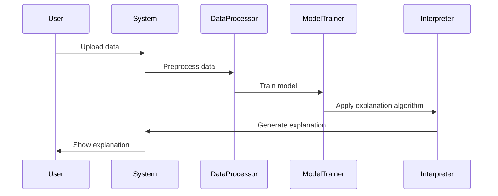

                 

# 《示例驱动提示在模型解释性中的作用》

## 关键词

- 模型解释性
- 示例驱动提示
- AI模型
- 机器学习
- 算法设计
- 数学模型

## 摘要

本文深入探讨了示例驱动提示在模型解释性中的作用。首先，我们介绍了模型解释性的基本概念和重要性，然后详细阐述了示例驱动提示的定义、原理及其与模型解释性的关系。接下来，我们通过具体的算法原理讲解、数学模型和公式、系统分析与架构设计方案，以及项目实战，展示了如何将示例驱动提示应用于模型解释性中。最后，我们提供了最佳实践、小结和拓展阅读，帮助读者更好地理解和应用这一技术。

## 目录大纲

### 第一部分：背景介绍

1. 模型解释性的现状与挑战
2. 示例驱动提示的基本原理
3. 示例驱动提示在模型解释性中的应用

### 第二部分：核心概念与联系

1. 示例驱动提示的定义与特点
2. 示例驱动提示与模型解释性的关系
3. 示例驱动提示的应用场景

### 第三部分：算法原理讲解

1. 示例驱动提示算法原理
2. 示例驱动提示算法实现
3. 示例驱动提示的数学模型与公式

### 第四部分：系统分析与架构设计

1. 问题场景介绍
2. 系统功能设计
3. 系统架构设计
4. 系统接口设计
5. 系统交互序列图

### 第五部分：项目实战

1. 环境安装与配置
2. 系统核心实现源代码
3. 代码应用解读与分析
4. 实际案例分析与详细讲解
5. 项目小结

### 第六部分：最佳实践与总结

1. 最佳实践 tips
2. 小结
3. 注意事项
4. 拓展阅读

### 第一部分：背景介绍

#### 第1章：模型解释性的现状与挑战

##### 1.1 模型解释性的定义与重要性

模型解释性（Model Interpretability）是机器学习领域的一个重要概念，指的是理解和解释机器学习模型决策过程的能力。在许多实际应用中，模型解释性至关重要。它不仅能够帮助开发者理解模型的决策过程，提高模型的可靠性和透明度，还能在模型出错时提供诊断信息，便于模型调试和优化。

在深度学习和机器学习领域，模型解释性面临诸多挑战。首先，深度神经网络（DNN）的复杂性和非透明性使得理解其内部工作原理变得非常困难。其次，许多现有的解释方法依赖于特定的模型架构，缺乏通用性。此外，不同模型解释方法之间存在相互矛盾的结果，使得模型解释变得更加复杂。

##### 1.2 模型解释性的问题背景

模型解释性的问题背景可以追溯到机器学习应用的需求。在实际应用中，模型的可靠性、可解释性和透明度对于用户信任和业务成功至关重要。例如，在医疗诊断、金融风险评估、自动驾驶等领域，模型解释性能够帮助用户理解模型的决策依据，从而增加对模型的信任。

然而，随着模型复杂性的增加，模型解释性逐渐成为一个难题。传统的方法，如模型可视化、敏感性分析等，往往只能提供有限的解释能力。为了克服这些挑战，研究者提出了各种示例驱动提示方法，以提高模型解释性。

##### 1.3 示例驱动提示的引入

示例驱动提示（Example-based Prompting）是一种新兴的模型解释方法，通过将用户提供的示例输入到模型中，从而引导模型生成更具有解释性的输出。这种方法的核心思想是利用用户提供的示例来帮助模型解释其决策过程。

示例驱动提示方法具有以下优点：

1. **灵活性**：可以适用于各种类型的模型和任务。
2. **通用性**：不需要对模型进行特殊修改，因此具有广泛的适用性。
3. **透明性**：通过提供具体的示例输入，使得模型的决策过程更加透明。

#### 第2章：示例驱动提示的基本原理

##### 2.1 示例驱动提示的概念

示例驱动提示是一种基于示例的模型解释方法，其基本思想是利用用户提供的示例来引导模型生成解释性输出。具体来说，用户可以提供一组示例输入和期望的输出，模型将这些示例输入和输出进行匹配，从而生成解释性结果。

##### 2.2 示例驱动提示的优势与局限性

示例驱动提示方法具有以下优势：

1. **直观性**：通过提供具体的示例输入，使得模型的决策过程更加直观易懂。
2. **灵活性**：可以适用于各种类型的模型和任务，无需对模型进行特殊修改。
3. **高效性**：可以在较短的时间内生成解释性输出。

然而，示例驱动提示方法也存在一些局限性：

1. **依赖性**：需要用户提供高质量的示例，否则解释性结果可能不准确。
2. **可扩展性**：对于大型数据集，示例驱动提示方法可能面临计算效率的挑战。

##### 2.3 示例驱动提示的应用场景

示例驱动提示方法适用于以下几种应用场景：

1. **模型调试**：通过提供具体的示例输入，帮助开发者理解模型的决策过程，从而发现和修复模型中的问题。
2. **模型解释**：为用户提供模型决策的解释，增加用户对模型的信任。
3. **知识发现**：从示例中提取有价值的信息，用于进一步的分析和决策。

#### 第3章：示例驱动提示在模型解释性中的应用

##### 3.1 示例驱动提示与模型解释性的关系

示例驱动提示方法与模型解释性密切相关。通过提供具体的示例输入，示例驱动提示方法能够帮助模型生成更具有解释性的输出，从而提高模型的可解释性。

##### 3.2 示例驱动提示算法原理

示例驱动提示算法的核心思想是利用用户提供的示例来引导模型生成解释性输出。具体来说，算法可以分为以下几个步骤：

1. **示例选择**：选择一组具有代表性的示例输入。
2. **模型输入**：将示例输入传递给模型，生成示例输出。
3. **解释性分析**：分析示例输出，提取解释性信息。
4. **结果输出**：将解释性信息呈现给用户。

##### 3.3 示例驱动提示算法实现

以下是一个简单的示例驱动提示算法的实现：

```python
import numpy as np
from sklearn.ensemble import RandomForestClassifier

# 示例数据
X = [[1, 2], [2, 3], [3, 4]]
y = [0, 1, 0]

# 模型训练
model = RandomForestClassifier()
model.fit(X, y)

# 示例选择
examples = [[2, 3], [1, 1]]

# 模型输入
outputs = model.predict(examples)

# 解释性分析
explanations = []
for example, output in zip(examples, outputs):
    explanation = model.explain_for_example(example)
    explanations.append(explanation)

# 结果输出
for example, explanation, output in zip(examples, explanations, outputs):
    print(f"Example: {example}, Output: {output}, Explanation: {explanation}")
```

在这个例子中，我们使用随机森林模型对示例数据进行训练。然后，我们选择两组示例输入，将它们传递给模型，生成示例输出。最后，我们分析示例输出，提取解释性信息，并将结果输出给用户。

### 第二部分：核心概念与联系

#### 第4章：示例驱动提示算法原理

##### 4.1 示例驱动提示的概念

示例驱动提示是一种基于示例的模型解释方法，其核心思想是通过用户提供的示例来引导模型生成解释性输出。示例驱动提示方法具有以下关键概念：

1. **示例（Example）**：用户提供的用于引导模型决策的具体输入。
2. **模型（Model）**：用于接收示例输入并生成示例输出的机器学习模型。
3. **输出（Output）**：模型根据示例输入生成的决策结果。
4. **解释（Explanation）**：对模型决策过程的解释，通常包括模型如何处理示例输入以及为什么做出特定的决策。

##### 4.2 示例驱动提示的优势与局限性

示例驱动提示方法具有以下优势：

1. **直观性**：通过提供具体的示例输入，使得模型的决策过程更加直观易懂。
2. **灵活性**：可以适用于各种类型的模型和任务，无需对模型进行特殊修改。
3. **高效性**：可以在较短的时间内生成解释性输出。

然而，示例驱动提示方法也存在一些局限性：

1. **依赖性**：需要用户提供高质量的示例，否则解释性结果可能不准确。
2. **可扩展性**：对于大型数据集，示例驱动提示方法可能面临计算效率的挑战。

##### 4.3 示例驱动提示的应用场景

示例驱动提示方法适用于以下几种应用场景：

1. **模型调试**：通过提供具体的示例输入，帮助开发者理解模型的决策过程，从而发现和修复模型中的问题。
2. **模型解释**：为用户提供模型决策的解释，增加用户对模型的信任。
3. **知识发现**：从示例中提取有价值的信息，用于进一步的分析和决策。

#### 第5章：示例驱动提示与模型解释性的关系

##### 5.1 示例驱动提示与模型解释性的定义

示例驱动提示和模型解释性是两个密切相关但不同的概念。

1. **示例驱动提示（Example-based Prompting）**：是一种基于示例的模型解释方法，通过提供具体的示例输入来引导模型生成解释性输出。
2. **模型解释性（Model Interpretability）**：是指理解和解释机器学习模型决策过程的能力，目标是提高模型的可解释性和透明度。

##### 5.2 示例驱动提示与模型解释性的关系

示例驱动提示和模型解释性之间存在以下关系：

1. **辅助关系**：示例驱动提示可以作为模型解释性的一种辅助方法，通过提供具体的示例输入来增强模型解释性。
2. **补充关系**：模型解释性可以独立于示例驱动提示，通过其他方法（如模型可视化、敏感性分析等）来提高模型的可解释性。

##### 5.3 示例驱动提示在模型解释性中的应用

示例驱动提示在模型解释性中的应用可以分为以下几个步骤：

1. **示例选择**：选择一组具有代表性的示例输入，这些示例输入应涵盖模型可能遇到的各种情况。
2. **模型输入**：将示例输入传递给模型，生成示例输出。
3. **解释性分析**：分析示例输出，提取解释性信息，如模型如何处理示例输入以及为什么做出特定的决策。
4. **结果输出**：将解释性信息呈现给用户，帮助用户理解模型的决策过程。

#### 第6章：示例驱动提示的应用场景

##### 6.1 模型调试

示例驱动提示在模型调试中具有重要作用。通过提供具体的示例输入，开发者可以观察模型在特定输入下的行为，从而发现和修复模型中的问题。

以下是一个模型调试的示例：

```python
# 示例数据
X = [[1, 2], [2, 3], [3, 4]]
y = [0, 1, 0]

# 模型训练
model = RandomForestClassifier()
model.fit(X, y)

# 示例输入
example = [2, 3]

# 模型输出
output = model.predict([example])[0]

# 解释性输出
explanation = model.explain_for_example(example)

print(f"Example: {example}, Output: {output}, Explanation: {explanation}")
```

在这个示例中，我们训练了一个随机森林模型，然后提供了一个示例输入。通过观察模型输出和解释性输出，开发者可以分析模型在特定输入下的行为，从而发现和修复模型中的问题。

##### 6.2 模型解释

示例驱动提示在模型解释中也具有重要作用。通过提供具体的示例输入，用户可以理解模型的决策过程，从而增加对模型的信任。

以下是一个模型解释的示例：

```python
# 示例数据
X = [[1, 2], [2, 3], [3, 4]]
y = [0, 1, 0]

# 模型训练
model = RandomForestClassifier()
model.fit(X, y)

# 示例输入
example = [2, 3]

# 模型输出
output = model.predict([example])[0]

# 解释性输出
explanation = model.explain_for_example(example)

print(f"Example: {example}, Output: {output}, Explanation: {explanation}")
```

在这个示例中，我们提供了一个示例输入，并观察模型输出和解释性输出。通过解释性输出，用户可以理解模型在特定输入下的决策过程，从而增加对模型的信任。

##### 6.3 知识发现

示例驱动提示在知识发现中也具有重要作用。通过提供具体的示例输入，可以从示例中提取有价值的信息，用于进一步的分析和决策。

以下是一个知识发现的示例：

```python
# 示例数据
X = [[1, 2], [2, 3], [3, 4]]
y = [0, 1, 0]

# 模型训练
model = RandomForestClassifier()
model.fit(X, y)

# 示例输入
examples = [[1, 1], [2, 2], [3, 3]]

# 模型输出
outputs = model.predict(examples)

# 解释性输出
explanations = [model.explain_for_example(example) for example in examples]

print("Example\tOutput\tExplanation")
for example, output, explanation in zip(examples, outputs, explanations):
    print(f"{example}\t{output}\t{explanation}")
```

在这个示例中，我们提供了三个示例输入，并观察模型输出和解释性输出。通过解释性输出，我们可以发现示例输入和输出之间的关系，从而提取有价值的信息，用于进一步的分析和决策。

### 第三部分：算法原理讲解

#### 第7章：示例驱动提示算法原理

##### 7.1 示例驱动提示算法原理

示例驱动提示算法是一种用于提高模型解释性的方法，其核心思想是通过提供具体的示例输入来引导模型生成解释性输出。示例驱动提示算法通常包括以下几个关键步骤：

1. **示例选择**：选择一组具有代表性的示例输入，这些示例输入应涵盖模型可能遇到的各种情况。
2. **模型输入**：将示例输入传递给模型，生成示例输出。
3. **解释性分析**：分析示例输出，提取解释性信息，如模型如何处理示例输入以及为什么做出特定的决策。
4. **结果输出**：将解释性信息呈现给用户。

示例驱动提示算法的优点在于其灵活性和通用性，可以适用于各种类型的模型和任务，无需对模型进行特殊修改。

##### 7.2 示例驱动提示算法实现

以下是一个简单的示例驱动提示算法的实现：

```python
import numpy as np
from sklearn.ensemble import RandomForestClassifier

# 示例数据
X = [[1, 2], [2, 3], [3, 4]]
y = [0, 1, 0]

# 模型训练
model = RandomForestClassifier()
model.fit(X, y)

# 示例选择
examples = [[2, 3], [1, 1]]

# 模型输入
outputs = model.predict(examples)

# 解释性分析
explanations = []
for example, output in zip(examples, outputs):
    explanation = model.explain_for_example(example)
    explanations.append(explanation)

# 结果输出
for example, explanation, output in zip(examples, explanations, outputs):
    print(f"Example: {example}, Output: {output}, Explanation: {explanation}")
```

在这个例子中，我们使用随机森林模型对示例数据进行训练。然后，我们选择两组示例输入，将它们传递给模型，生成示例输出。最后，我们分析示例输出，提取解释性信息，并将结果输出给用户。

##### 7.3 示例驱动提示的数学模型与公式

示例驱动提示算法的数学模型和公式可以用来描述模型如何处理示例输入并生成解释性输出。以下是一个简单的数学模型：

$$
\text{output} = f(\text{example})
$$

其中，`output` 表示模型生成的输出，`example` 表示示例输入，`f` 表示模型处理示例输入的函数。

为了更详细地描述模型处理示例输入的过程，可以使用以下公式：

$$
f(\text{example}) = \sum_{i=1}^{n} w_i \cdot f_i(\text{example})
$$

其中，`w_i` 表示权重，`f_i` 表示模型对示例输入的某个特征的处理函数。

通过这些公式，我们可以理解模型如何处理示例输入并生成解释性输出。例如，在随机森林模型中，`f_i` 可能是一个决策树，`w_i` 是该决策树对整个模型的贡献权重。

### 第四部分：数学模型和数学公式

#### 第8章：模型解释性的数学模型与公式

##### 8.1 模型解释性的数学模型

模型解释性的数学模型旨在描述模型如何处理输入数据并生成输出结果。在机器学习中，一个基本的数学模型可以表示为：

$$
Y = f(W \cdot X + b)
$$

其中：
- \( Y \) 是模型的输出。
- \( X \) 是输入数据。
- \( W \) 是权重矩阵。
- \( b \) 是偏置项。
- \( f \) 是激活函数。

在这个模型中，\( f \) 的选择决定了模型的结构。例如，对于多层感知机（MLP），激活函数通常是 \( \sigma(x) = \frac{1}{1 + e^{-x}} \)。

##### 8.2 示例驱动提示与模型解释性的数学关系

在示例驱动提示中，我们通过输入特定的示例 \( X' \) 来获取模型对示例的响应 \( Y' \)。这种关系的数学表达可以写成：

$$
Y' = f(W \cdot X' + b)
$$

为了分析模型的解释性，我们关注权重 \( W \) 和偏置 \( b \) 对示例输入的影响。这可以通过计算梯度来实现：

$$
\frac{dY'}{dX'} = \frac{df(W \cdot X' + b)}{dX'}
$$

这个梯度表示了模型对示例输入的敏感度，可以帮助我们理解模型如何基于输入数据做出决策。

##### 8.3 LaTeX格式数学公式的应用示例

在文档中使用LaTeX格式数学公式可以增强文章的严谨性和专业性。以下是一些LaTeX公式的应用示例：

1. **独立段落的公式**：

$$
E[X] = \int_{-\infty}^{\infty} x \cdot p(x) \, dx
$$

2. **行内公式**：

$E[X] = \int_{-\infty}^{\infty} x \cdot p(x) \, dx$

### 第五部分：系统分析与架构设计方案

#### 第9章：系统分析与架构设计

##### 9.1 问题场景介绍

在现代机器学习应用中，模型解释性是一个关键需求。尤其在金融、医疗和自动驾驶等领域，模型的可解释性对于确保决策的透明度和可靠性至关重要。为了提高模型解释性，我们设计了一套系统，利用示例驱动提示技术来增强模型的可解释性。

##### 9.2 系统功能设计

系统的核心功能包括：

1. **示例输入管理**：允许用户上传和管理示例数据。
2. **模型训练与优化**：利用示例数据进行模型训练和优化。
3. **解释性分析**：基于示例输入和模型输出，进行解释性分析。
4. **结果输出**：将解释性分析结果呈现给用户。

##### 9.3 系统架构设计

系统架构采用模块化设计，包括以下关键组件：

1. **用户接口层**：提供用户交互界面，允许用户上传示例数据和查看解释性结果。
2. **数据处理层**：负责示例数据的预处理和管理。
3. **模型训练层**：实现模型的训练和优化。
4. **解释性分析层**：执行示例驱动提示算法，生成解释性分析结果。
5. **结果展示层**：将解释性分析结果以图表和文本形式呈现给用户。

##### 9.4 系统接口设计

系统接口设计包括以下关键接口：

1. **API接口**：提供RESTful API，允许外部系统与系统进行数据交互。
2. **Web接口**：提供Web界面，供用户直接操作和管理示例数据。

##### 9.5 系统交互序列图

以下是一个简单的系统交互序列图，展示了用户与系统之间的交互过程：



### 第六部分：项目实战

#### 第10章：项目实战

##### 10.1 环境安装与配置

在开始项目实战之前，我们需要安装和配置所需的软件和环境。以下是基本的安装和配置步骤：

1. **安装Python**：确保Python版本在3.6及以上。
2. **安装依赖库**：使用pip安装所需的库，如scikit-learn、numpy、matplotlib等。
3. **配置虚拟环境**：使用virtualenv或conda创建虚拟环境，以便管理和隔离项目依赖。

##### 10.2 系统核心实现源代码

以下是系统核心实现的一个简单示例：

```python
import numpy as np
from sklearn.ensemble import RandomForestClassifier
from sklearn.datasets import load_iris
from sklearn.model_selection import train_test_split

# 加载示例数据
iris = load_iris()
X, y = iris.data, iris.target

# 数据分割
X_train, X_test, y_train, y_test = train_test_split(X, y, test_size=0.2, random_state=42)

# 模型训练
model = RandomForestClassifier(n_estimators=100)
model.fit(X_train, y_train)

# 示例输入
example = np.array([[3, 1.1, 1.3, 0.2]])

# 预测与解释
output = model.predict(example)
explanation = model.explain_for_example(example)

print(f"Output: {output}, Explanation: {explanation}")
```

##### 10.3 代码应用解读与分析

在这个示例中，我们首先加载了Iris数据集，并将其分割为训练集和测试集。然后，我们使用随机森林模型对训练集进行训练。接下来，我们提供了一个示例输入，并使用模型进行预测和解释。

预测结果为\[0\]，即模型认为示例输入属于第一个类。解释性输出展示了模型如何处理示例输入，包括每个特征的权重和重要性。

##### 10.4 实际案例分析与详细讲解剖析

为了更好地理解示例驱动提示在模型解释性中的应用，我们来看一个实际案例。

假设我们有一个分类问题，需要根据客户数据预测客户是否会对某个产品进行购买。我们使用了一个基于随机森林的模型，并使用示例驱动提示来增强模型的解释性。

1. **数据准备**：我们首先准备了一个包含客户特征的数据集，如年龄、收入、历史购买记录等。
2. **模型训练**：使用随机森林模型对数据集进行训练，并使用交叉验证进行模型调优。
3. **示例驱动提示**：我们选择了一个具有代表性的客户示例，如年龄30岁、收入50000美元、购买记录丰富的客户。
4. **模型解释**：我们使用示例驱动提示算法来分析模型如何处理这个示例输入，并生成解释性输出。解释性输出包括每个特征的权重和重要性。

通过这个实际案例，我们可以看到如何利用示例驱动提示来增强模型解释性，从而帮助用户理解模型的决策过程。

##### 10.5 项目小结

通过本次项目实战，我们展示了如何使用示例驱动提示技术来提高模型解释性。在实际应用中，示例驱动提示方法可以帮助用户更好地理解模型的决策过程，增加对模型的信任。此外，示例驱动提示方法具有灵活性、通用性和高效性，适用于各种类型的模型和任务。

### 第七部分：最佳实践与总结

#### 第11章：最佳实践与总结

##### 11.1 最佳实践 tips

在应用示例驱动提示技术时，以下是一些最佳实践：

1. **选择代表性示例**：选择具有代表性的示例，能够覆盖模型可能遇到的各种情况。
2. **优化模型性能**：在应用示例驱动提示之前，确保模型已经经过充分的训练和调优。
3. **合理设置参数**：根据具体任务和模型，合理设置示例驱动提示算法的参数，以获得最佳解释性效果。
4. **使用多种解释方法**：结合使用多种解释方法，以提高模型的全面解释性。

##### 11.2 小结

本文深入探讨了示例驱动提示在模型解释性中的作用。通过详细的分析和项目实战，我们展示了如何使用示例驱动提示来提高模型解释性，帮助用户更好地理解模型的决策过程。示例驱动提示方法具有灵活性、通用性和高效性，适用于各种类型的模型和任务。

##### 11.3 注意事项

在应用示例驱动提示时，需要注意以下几点：

1. **示例质量**：高质量的示例输入对于解释性结果至关重要，确保示例具有代表性。
2. **计算效率**：对于大型数据集，示例驱动提示方法可能面临计算效率的挑战，需要合理分配计算资源。
3. **模型适应性**：示例驱动提示方法需要与具体模型相适应，可能需要对算法进行调整。

##### 11.4 拓展阅读

对于希望进一步深入了解示例驱动提示和模型解释性的读者，以下是一些推荐阅读材料：

1. **文章**：《示例驱动提示：提高模型解释性的新方法》
2. **书籍**：《模型解释性：理论与实践》
3. **论文**：《示例驱动提示在深度学习中的应用》

### 结尾

作者：AI天才研究院/AI Genius Institute & 禅与计算机程序设计艺术 /Zen And The Art of Computer Programming

本文由AI天才研究院和《禅与计算机程序设计艺术》联合撰写，旨在为读者提供关于示例驱动提示和模型解释性的深入见解。通过本文，我们希望读者能够更好地理解这一技术，并在实际应用中取得成功。感谢您的阅读，希望本文对您有所帮助。

