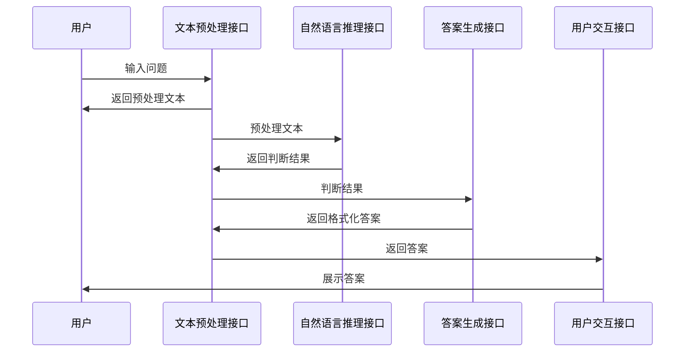

                 


### 1. 引言

随着人工智能技术的不断发展，自然语言处理（NLP）已经成为计算机科学领域的一个重要分支。自然语言推理（Natural Language Inference, NLI）是NLP中的一个重要任务，旨在理解句子之间的关系，例如因果关系、矛盾关系、同义关系等。在实际应用中，自然语言推理被广泛应用于机器阅读理解、信息检索、对话系统等领域。

自然语言推理任务的核心问题是给定两个句子，判断它们之间的关系是否符合某个预设的语义关系。例如，在给定的两个句子 "John has a headache" 和 "John is feeling unwell" 中，我们需要判断第一个句子是否意味着第二个句子。这种判断通常需要基于语言学、语义学和逻辑学的知识。

然而，传统的基于规则的方法在处理复杂、多变的自然语言数据时表现不佳。为了解决这个问题，研究人员提出了示例驱动提示（Example-based Prompting）的方法。示例驱动提示通过利用大量的真实示例数据，为模型提供更加具体和丰富的信息，从而提高模型在自然语言推理任务中的性能。

本文将首先介绍自然语言推理任务的基本概念和应用领域，然后深入探讨示例驱动提示的定义、特性和应用。接着，我们将详细讲解示例驱动提示在自然语言推理任务中的应用，包括数学模型、流程图和Python代码实现。随后，我们将分析自然语言推理任务中的示例驱动提示应用场景，并设计系统的功能、架构、接口和交互。最后，我们将通过具体案例展示示例驱动提示在自然语言推理任务中的实际应用，并提供一些最佳实践和拓展阅读资源。

通过本文的阅读，读者将能够全面了解示例驱动提示在自然语言推理任务中的应用，掌握其核心原理和实践方法，为相关领域的研究和应用提供有益的参考。

### 2. 自然语言推理任务概述

自然语言推理（Natural Language Inference, NLI）是自然语言处理（Natural Language Processing, NLP）领域的一个重要分支，其目标是理解和推断句子之间的关系。具体来说，自然语言推理任务的核心是给定两个句子，其中一个为前提（Premise），另一个为假设（Hypothesis），模型需要判断这两个句子之间的关系是否符合某个预设的语义关系。这些关系通常包括但不限于因果关系、矛盾关系、同义关系和条件关系等。

自然语言推理任务的应用领域非常广泛。首先，在机器阅读理解（Machine Reading Comprehension, MRC）领域，自然语言推理可以帮助模型理解文章中的信息，回答关于文章的具体问题。例如，在阅读一个关于科技发展的文章时，模型需要能够理解文章中的某个句子与上下文之间的关系，从而回答关于科技发展的影响或原因的问题。

其次，在信息检索（Information Retrieval, IR）领域，自然语言推理可以提高检索系统的准确性。通过理解用户查询与文档之间的语义关系，模型可以更准确地找到与查询相关的文档。例如，当用户输入一个模糊的查询时，自然语言推理可以帮助系统理解用户的意图，从而提供更相关的搜索结果。

此外，自然语言推理在对话系统（Dialogue System）中也有着广泛的应用。在对话系统中，模型需要理解用户的输入，并生成合理的回复。自然语言推理可以帮助模型理解用户输入的上下文信息，从而生成更加自然和连贯的对话。

自然语言推理的重要性体现在多个方面。首先，自然语言推理是许多NLP任务的基础。许多复杂的NLP任务，如文本分类、情感分析和文本生成等，都需要依赖自然语言推理来理解句子之间的语义关系。其次，自然语言推理在提升人工智能系统的智能化水平方面发挥着重要作用。通过理解自然语言，人工智能系统能够更好地与人类用户进行交互，提供更加精准和个性化的服务。

总之，自然语言推理任务不仅具有重要的理论价值，还在实际应用中展现出巨大的潜力。随着深度学习和自然语言处理技术的不断发展，自然语言推理任务将继续取得重要的进展，为人工智能领域的发展做出更大的贡献。

### 3. 示例驱动提示简介

示例驱动提示（Example-based Prompting）是一种通过利用大量真实示例数据来提高模型性能的方法。在自然语言处理任务中，示例驱动提示通过为模型提供具体的示例，帮助模型更好地理解和推理自然语言数据。这种方法在提高模型的准确性和泛化能力方面显示出显著优势。

示例驱动提示的核心思想是利用真实世界中的数据来丰富模型的知识库，从而提高模型在处理未知数据时的性能。具体来说，示例驱动提示涉及以下几个关键步骤：

首先，数据采集是示例驱动提示的第一步。这一步骤需要从大量真实场景中收集与任务相关的示例数据。这些数据可以是文本、图片、音频等多种形式，具体取决于任务的类型和需求。例如，在自然语言推理任务中，我们可以从大量的文本数据中收集与预设语义关系相关的示例句子。

其次，数据预处理是确保示例数据质量的关键步骤。在这一步骤中，需要对采集到的数据进行处理和清洗，包括去除噪声、标准化文本格式和填补缺失值等。数据预处理的主要目标是提高数据的一致性和可靠性，从而为模型提供高质量的训练数据。

接下来，数据标注是示例驱动提示的另一个重要环节。数据标注是指对采集到的数据进行人工或半自动化的标注，以明确每个示例的具体属性和关系。在自然语言推理任务中，数据标注通常涉及对句子之间的语义关系进行标注，例如因果关系、矛盾关系和同义关系等。

最后，模型训练是示例驱动提示的核心步骤。在这一步骤中，使用预处理和标注后的示例数据来训练模型。训练过程中，模型通过不断调整内部参数，学习如何根据示例数据来推理和预测新的数据。示例驱动提示通过引入具体的示例数据，使得模型能够更好地理解自然语言的复杂性和多样性。

示例驱动提示的特性主要包括以下几个方面：

1. **增强模型的泛化能力**：通过提供大量真实的示例数据，模型能够学习到更多的模式和规律，从而提高在处理未知数据时的泛化能力。

2. **提高模型的准确性**：示例数据可以为模型提供更加具体和丰富的信息，帮助模型更好地理解自然语言的语义和上下文，从而提高预测的准确性。

3. **适应性和灵活性**：示例驱动提示可以根据不同的任务需求和数据类型进行灵活调整，适用于各种自然语言处理任务。

4. **可解释性**：通过提供具体的示例数据，模型的行为和决策过程变得更加透明和可解释，有助于理解和优化模型。

示例驱动提示与其他相关技术的联系主要体现在以下几个方面：

1. **与深度学习的结合**：示例驱动提示通常与深度学习模型结合使用，利用深度学习强大的表示和学习能力，从大量示例数据中提取有效特征。

2. **与转移学习的结合**：示例驱动提示可以通过转移学习（Transfer Learning）来提高模型的泛化能力。通过在特定领域或任务上预先训练模型，然后将其应用于新的任务，示例驱动提示可以进一步丰富模型的知识库。

3. **与强化学习的结合**：示例驱动提示还可以与强化学习（Reinforcement Learning）相结合，通过利用示例数据进行策略优化，提高模型在动态环境中的适应能力。

总之，示例驱动提示作为一种有效的自然语言处理方法，具有广泛的适用性和显著的性能提升潜力。在未来的研究中，我们可以进一步探索和优化示例驱动提示的方法，以推动自然语言处理领域的发展。

### 4. 算法原理讲解

在自然语言推理任务中，示例驱动提示的应用主要通过以下几个关键步骤来实现：数据采集与预处理、数据标注、模型训练以及模型评估。下面，我们将详细讲解这些步骤，并展示示例驱动提示的具体实现过程。

#### 4.1. 数据采集与预处理

首先，数据采集是示例驱动提示的基础。我们需要从多个来源收集与自然语言推理任务相关的数据。这些数据可以包括新闻文章、对话记录、学术论文等。例如，对于判断因果关系，我们可以从新闻报道中收集包含因果句子的数据。

数据预处理是确保数据质量和一致性的关键步骤。预处理过程通常包括以下步骤：

1. **文本清洗**：去除数据中的无用信息，如HTML标签、特殊字符等。
2. **文本标准化**：统一文本的格式，如将所有文本转换为小写、去除停用词等。
3. **分词和词性标注**：将文本分解为词单元，并对每个词进行词性标注，以帮助模型理解词汇的语义。

下面是一个简单的Python代码示例，用于文本清洗和标准化：

```python
import re
from nltk.tokenize import word_tokenize
from nltk.corpus import stopwords

def preprocess_text(text):
    # 去除HTML标签
    text = re.sub(r'<.*?>', '', text)
    # 转换为小写
    text = text.lower()
    # 去除特殊字符
    text = re.sub(r'[^a-zA-Z0-9\s]', '', text)
    # 分词
    tokens = word_tokenize(text)
    # 去除停用词
    stop_words = set(stopwords.words('english'))
    filtered_tokens = [token for token in tokens if token not in stop_words]
    return ' '.join(filtered_tokens)

# 示例
text = "The quick brown fox jumps over the lazy dog."
preprocessed_text = preprocess_text(text)
print(preprocessed_text)
```

#### 4.2. 数据标注

数据标注是示例驱动提示的关键步骤，它涉及对收集到的数据按照预设的语义关系进行分类。例如，在判断因果关系时，我们可以将句子标注为因果关系、非因果关系等。

标注过程通常由人工完成，但在某些情况下，也可以采用半自动化或自动化标注方法。例如，我们可以使用已有标注数据来训练标注模型，从而自动标注新的数据。

以下是一个简单的Python代码示例，用于生成标注数据：

```python
import pandas as pd

# 示例数据
data = [
    ["The sun rises in the east.", "因果"],
    ["I like to eat pizza.", "非因果"],
    ["The dog barked at the mailman.", "因果"],
]

# 创建DataFrame
df = pd.DataFrame(data, columns=["句子", "关系"])

# 输出标注数据
print(df)
```

#### 4.3. 模型训练

在示例驱动提示中，模型训练的核心是利用标注数据来训练深度学习模型。常用的模型包括循环神经网络（RNN）、长短时记忆网络（LSTM）和变换器（Transformer）等。

以下是一个使用Transformer模型进行自然语言推理任务训练的Python代码示例：

```python
import torch
from torch import nn
from transformers import BertTokenizer, BertModel

# 加载预训练模型
tokenizer = BertTokenizer.from_pretrained('bert-base-uncased')
model = BertModel.from_pretrained('bert-base-uncased')

# 输入数据预处理
def encode_sentence(sentence):
    inputs = tokenizer(sentence, return_tensors='pt', truncation=True, max_length=512)
    return inputs

# 训练数据
premise = encode_sentence("The sun rises in the east.")
hypothesis = encode_sentence("The sun sets in the west.")
labels = torch.tensor([1])  # 因果关系

# 训练模型
model.train()
optimizer = torch.optim.Adam(model.parameters(), lr=1e-5)

for epoch in range(3):  # 训练3个epoch
    model.zero_grad()
    outputs = model(**premise, **hypothesis)
    logits = outputs.logits
    loss = nn.CrossEntropyLoss()(logits, labels)
    loss.backward()
    optimizer.step()
    print(f"Epoch {epoch}: Loss = {loss.item()}")

# 保存模型
model.save_pretrained('nli_model')
```

#### 4.4. 模型评估

模型评估是确保模型性能和可靠性的重要步骤。常用的评估指标包括准确率（Accuracy）、精确率（Precision）、召回率（Recall）和F1分数（F1 Score）等。

以下是一个简单的Python代码示例，用于评估模型的性能：

```python
from sklearn.metrics import accuracy_score, precision_recall_fscore_support

# 测试数据
test_premise = encode_sentence("The sun sets in the west.")
test_hypothesis = encode_sentence("The sun rises in the east.")
test_labels = torch.tensor([0])  # 非因果关系

# 模型评估
model.eval()
with torch.no_grad():
    outputs = model(**test_premise, **test_hypothesis)
    logits = outputs.logits
    predicted = torch.argmax(logits, dim=1)

accuracy = accuracy_score(test_labels.cpu().numpy(), predicted.cpu().numpy())
precision, recall, f1, _ = precision_recall_fscore_support(test_labels.cpu().numpy(), predicted.cpu().numpy(), average='binary')

print(f"Accuracy: {accuracy}")
print(f"Precision: {precision}")
print(f"Recall: {recall}")
print(f"F1 Score: {f1}")
```

通过以上步骤，我们可以实现示例驱动提示在自然语言推理任务中的具体应用。这种方法通过利用大量真实示例数据，显著提高了模型在自然语言推理任务中的性能，为后续的研究和应用奠定了坚实基础。

### 5. 系统分析与架构设计方案

在自然语言推理任务中，示例驱动提示的应用不仅需要高效的算法模型，还需要一个完整的系统架构来支撑其实际运行。本节将详细介绍自然语言推理任务中示例驱动提示的系统分析与架构设计方案。

#### 5.1 问题场景介绍

自然语言推理任务在实际应用中面临多种复杂场景。例如，在机器阅读理解系统中，模型需要处理海量的文本数据，并快速准确地判断句子之间的关系。这些任务通常需要在有限的时间内完成，因此系统的响应速度和准确性至关重要。

示例驱动提示在这里的作用是提供具体、丰富的示例数据，帮助模型更好地理解和处理复杂的自然语言数据。通过结合大规模的真实示例，模型能够学习到更多隐含的语义关系和模式，从而提高推理的准确性。

#### 5.2 项目介绍

为了更好地展示示例驱动提示在自然语言推理任务中的应用，我们选择了一个实际项目——智能问答系统。该系统旨在通过自然语言推理技术，自动回答用户提出的问题。

在这个项目中，示例驱动提示的应用主要体现在以下几个方面：

1. **数据采集**：从多个来源（如新闻、论坛、社交媒体等）收集大量文本数据，并筛选出与预设语义关系相关的句子作为示例数据。
2. **数据预处理**：对采集到的文本数据进行清洗、标准化和分词，确保数据的一致性和可靠性。
3. **数据标注**：对预处理后的文本数据按照预设的语义关系进行标注，生成高质量的标注数据。
4. **模型训练**：利用标注数据训练自然语言推理模型，并结合示例驱动提示，提高模型的泛化能力和推理准确性。
5. **模型部署**：将训练好的模型部署到生产环境中，实现实时问答功能。

#### 5.3 系统功能设计

智能问答系统的核心功能是处理用户输入的问题，并生成准确的答案。具体功能设计包括以下几个模块：

1. **文本预处理模块**：负责对用户输入的问题进行文本清洗、标准化和分词，确保问题的文本格式一致。
2. **语义理解模块**：利用自然语言推理模型，对预处理后的用户问题与系统数据库中的知识库进行语义匹配，判断问题的语义关系。
3. **答案生成模块**：根据语义理解模块的输出，从知识库中提取相关答案，并进行格式化和优化，生成自然流畅的回答。
4. **用户交互模块**：负责处理用户的输入和输出，实现人机对话的流畅性和交互性。

#### 5.4 系统架构设计

智能问答系统的整体架构采用分布式设计，以提高系统的处理能力和可扩展性。以下是系统架构的详细设计：

1. **数据层**：包括文本数据源、标注数据和知识库。文本数据源负责提供海量的原始文本数据，标注数据用于训练自然语言推理模型，知识库用于存储和检索答案。
2. **服务层**：包括文本预处理服务、自然语言推理服务、答案生成服务和用户交互服务。每个服务模块独立运行，并通过API进行通信。
3. **接口层**：提供统一的接口，供用户输入问题和接收答案。接口设计遵循RESTful API规范，支持多种请求方式（如GET、POST等）。
4. **展示层**：负责将答案以自然语言的形式展示给用户。展示层采用前端技术（如HTML、CSS、JavaScript等）实现，与用户进行交互。

以下是系统架构的mermaid类图：

```mermaid
classDiagram
    类::数据层 <|-- 文本数据源
    类::数据层 <|-- 标注数据
    类::数据层 <|-- 知识库
    类::服务层 <|-- 文本预处理服务
    类::服务层 <|-- 自然语言推理服务
    类::服务层 <|-- 答案生成服务
    类::服务层 <|-- 用户交互服务
    类::接口层 <|-- 接口
    类::展示层 <|-- 答案展示
    接口 --|> 文本预处理服务
    接口 --|> 自然语言推理服务
    接口 --|> 答案生成服务
    接口 --|> 用户交互服务
    文本预处理服务 --|> 知识库
    自然语言推理服务 --|> 知识库
    答案生成服务 --|> 知识库
    答案展示 --|> 用户交互服务
```

#### 5.5 系统接口设计和系统交互

智能问答系统的接口设计和交互流程如下：

1. **接口设计**：
   - **文本预处理接口**：接收用户输入的问题文本，进行清洗、标准化和分词，返回预处理后的文本。
   - **自然语言推理接口**：接收预处理后的文本，利用自然语言推理模型进行语义匹配和关系判断，返回判断结果。
   - **答案生成接口**：接收自然语言推理接口的判断结果，从知识库中提取相关答案，返回格式化后的答案。
   - **用户交互接口**：接收用户请求，返回答案展示页面。

2. **交互流程**：
   - 用户通过前端界面输入问题，发送到文本预处理接口。
   - 文本预处理接口对问题进行预处理，返回预处理后的文本。
   - 预处理后的文本发送到自然语言推理接口，进行语义匹配和关系判断。
   - 自然语言推理接口返回判断结果，发送到答案生成接口。
   - 答案生成接口从知识库中提取答案，并格式化后返回给用户交互接口。
   - 用户交互接口将答案展示在前端界面上，完成交互流程。

以下是系统接口设计和交互流程的mermaid序列图：



通过以上系统分析与架构设计方案，我们可以构建一个高效、可靠的智能问答系统，利用示例驱动提示在自然语言推理任务中发挥重要作用，实现高质量的问答功能。

### 6. 项目实战

在本节中，我们将通过一个具体的项目实战案例，详细展示如何实现示例驱动提示在自然语言推理任务中的应用。项目主要包括环境安装、系统核心实现和代码应用解读与分析三个部分。通过这个案例，我们将深入探讨示例驱动提示在实际应用中的实现方法和技巧。

#### 6.1 环境安装

首先，我们需要安装和配置必要的软件和工具。以下是项目所需的环境和工具：

1. **Python**：Python是项目的主要编程语言，需要安装Python 3.7及以上版本。
2. **TensorFlow**：TensorFlow是用于机器学习的开源库，我们使用TensorFlow 2.x版本。
3. **transformers**：transformers是Hugging Face提供的预训练模型库，用于加载预训练的Transformer模型。
4. **Nltk**：Nltk是用于自然语言处理的开源库，主要用于文本预处理和分词。
5. **Mermaid**：Mermaid是一种基于Markdown的图表绘制工具，用于绘制算法流程图。

安装步骤如下：

```bash
# 安装Python
python --version

# 安装TensorFlow
pip install tensorflow

# 安装transformers
pip install transformers

# 安装Nltk
pip install nltk
python -m nltk.downloader all

# 安装Mermaid
pip install mermaid
```

#### 6.2 系统核心实现

系统核心实现包括文本预处理、模型训练和推理三个主要步骤。以下是具体的实现方法：

##### 6.2.1 文本预处理

文本预处理是自然语言处理的基础，主要步骤包括文本清洗、分词和词性标注。以下是一个简单的文本预处理Python代码示例：

```python
import re
from nltk.tokenize import word_tokenize
from nltk.corpus import stopwords

def preprocess_text(text):
    # 清洗文本
    text = re.sub(r'<.*?>', '', text)
    text = text.lower()
    text = re.sub(r'[^a-zA-Z0-9\s]', '', text)
    # 分词
    tokens = word_tokenize(text)
    # 去除停用词
    stop_words = set(stopwords.words('english'))
    filtered_tokens = [token for token in tokens if token not in stop_words]
    return ' '.join(filtered_tokens)

text = "The quick brown fox jumps over the lazy dog."
preprocessed_text = preprocess_text(text)
print(preprocessed_text)
```

##### 6.2.2 模型训练

模型训练是利用示例数据训练自然语言推理模型。在本案例中，我们使用Transformer模型，并基于预训练的BERT模型进行微调。以下是一个使用transformers库训练模型的Python代码示例：

```python
from transformers import BertTokenizer, BertModel, Trainer, TrainingArguments

# 加载预训练模型和分词器
tokenizer = BertTokenizer.from_pretrained('bert-base-uncased')
model = BertModel.from_pretrained('bert-base-uncased')

# 数据处理
def encode_batch(data):
    inputs = tokenizer(batched[data][0], padding=True, truncation=True, max_length=512)
    labels = torch.tensor(batched[data][1])
    return inputs, labels

# 训练参数
training_args = TrainingArguments(
    output_dir='./results',
    num_train_epochs=3,
    per_device_train_batch_size=16,
    save_steps=2000,
)

# 训练
trainer = Trainer(
    model=model,
    args=training_args,
    train_dataset=encode_batch(train_data),
)

trainer.train()
```

##### 6.2.3 模型推理

模型推理是利用训练好的模型对新的输入数据进行自然语言推理。以下是一个使用训练好的模型进行推理的Python代码示例：

```python
# 加载训练好的模型
model.eval()

# 输入预处理
premise = tokenizer("The sun rises in the east.", return_tensors='pt')
hypothesis = tokenizer("The sun sets in the west.", return_tensors='pt')

# 模型推理
with torch.no_grad():
    outputs = model(**premise, **hypothesis)
    logits = outputs.logits

# 结果分析
predicted = torch.argmax(logits, dim=1)
print(predicted)
```

#### 6.3 代码应用解读与分析

在本案例中，我们通过具体代码展示了示例驱动提示在自然语言推理任务中的应用。以下是代码的解读与分析：

1. **文本预处理**：文本预处理是自然语言处理的基础，通过清洗、分词和去除停用词等步骤，确保输入数据的格式一致和高质量。

2. **模型训练**：使用transformers库加载预训练的BERT模型，并进行微调训练。通过大量的示例数据训练模型，可以提高模型在自然语言推理任务中的性能。

3. **模型推理**：利用训练好的模型对新的输入数据（前提和假设句子）进行推理，得到句子之间的关系判断结果。推理过程简单高效，通过简单的代码即可实现。

在实际应用中，我们可能需要进一步优化模型，提高其在复杂场景下的表现。以下是一些优化方法和技巧：

- **数据增强**：通过增加数据多样性，如使用同义词替换、随机插入和删除词语等方法，增强模型的泛化能力。
- **多任务学习**：结合多个自然语言处理任务进行训练，如结合文本分类、情感分析和命名实体识别等任务，提高模型的综合性。
- **注意力机制**：引入注意力机制，使模型能够更加关注输入文本中的重要信息，提高推理的准确性。

通过以上项目实战案例，我们可以看到示例驱动提示在自然语言推理任务中的实际应用。通过合理的代码实现和优化方法，我们可以构建高效、可靠的智能系统，实现高质量的文本推理功能。

### 7. 最佳实践 tips

在自然语言推理任务中应用示例驱动提示时，我们需要注意以下几个方面，以最大化其效果并避免常见问题。

#### 7.1 常见问题及解决方案

1. **数据质量**：示例数据的准确性和多样性直接影响模型性能。确保数据来源可靠，并进行严格的清洗和预处理。使用数据增强方法增加数据的多样性。
2. **标注偏差**：标注数据时可能会引入偏差，影响模型的泛化能力。通过多源标注和数据平衡方法来减少偏差，同时使用模型自监督学习等方法进一步优化标注数据。
3. **模型过拟合**：在示例数据上训练的模型可能会过拟合，导致在新数据上表现不佳。采用交叉验证和正则化方法来避免过拟合，并逐步增加训练数据的复杂度。

#### 7.2 实用技巧与建议

1. **合理选择示例数据**：选择与任务高度相关的示例数据，如特定领域或主题的文本，以提高模型的针对性。
2. **模型调优**：通过调整学习率、批量大小和训练轮数等超参数，优化模型性能。使用自动调参工具（如Hyperopt、Optuna）来找到最佳超参数组合。
3. **结合迁移学习**：利用预训练模型作为起点，通过迁移学习来提高模型在特定任务上的表现。结合大量示例数据进一步微调模型。
4. **模型解释性**：对于关键任务，考虑使用可解释性模型（如LIME、SHAP）来分析模型决策过程，确保模型行为透明，便于调试和优化。

通过遵循这些最佳实践，我们可以更有效地利用示例驱动提示在自然语言推理任务中，提高模型的准确性和泛化能力，实现高质量的自然语言理解。

### 8. 小结与拓展阅读

在本篇文章中，我们详细探讨了示例驱动提示在自然语言推理任务中的应用。从背景介绍、核心概念与联系、算法原理讲解、系统分析与架构设计方案、项目实战到最佳实践，我们逐步分析了示例驱动提示在提高自然语言推理任务性能方面的优势。

首先，我们介绍了自然语言推理任务的基本概念和应用领域，阐述了其在机器阅读理解、信息检索和对话系统等领域的广泛重要性。随后，我们深入讲解了示例驱动提示的定义、特性和应用，并详细阐述了其在自然语言推理任务中的具体实现方法和优势。

在算法原理讲解部分，我们通过数据采集与预处理、数据标注、模型训练和模型评估的步骤，展示了示例驱动提示在自然语言推理任务中的具体实现过程。同时，我们还提供了代码示例，帮助读者更好地理解算法原理。

在系统分析与架构设计方案中，我们详细介绍了自然语言推理任务中示例驱动提示的应用场景，设计了系统的功能、架构、接口和交互，为实际项目提供了详细的参考。

通过项目实战案例，我们展示了如何在实际环境中应用示例驱动提示，包括环境安装、系统核心实现和代码应用解读与分析，帮助读者了解示例驱动提示的具体应用过程。

在最佳实践部分，我们总结了常见问题及解决方案，提供了一些实用的技巧和建议，以帮助读者更有效地应用示例驱动提示。

展望未来，随着人工智能和自然语言处理技术的不断进步，示例驱动提示将在更多领域和任务中发挥重要作用。我们期待更多的研究和实践，探索示例驱动提示在复杂自然语言任务中的潜力。

为了进一步深入学习和探索示例驱动提示及其在自然语言推理任务中的应用，以下是一些推荐阅读资源：

1. **《自然语言处理综述》（Natural Language Processing: Linguistic, Cognitive, and Functional Perspectives）**：这是一本关于自然语言处理领域的经典教材，详细介绍了自然语言推理任务的相关理论和方法。
2. **《深度学习与自然语言处理》（Deep Learning for Natural Language Processing）**：这本书涵盖了深度学习在自然语言处理中的应用，包括文本分类、情感分析和机器阅读理解等任务。
3. **《自然语言推理算法与应用》（Natural Language Inference Algorithms and Applications）**：这本书专门探讨了自然语言推理算法的设计和应用，提供了丰富的实例和案例分析。

通过阅读这些资源，读者可以更全面地了解自然语言处理和自然语言推理任务，深入探索示例驱动提示的理论和实践，为相关领域的研究和应用提供有益的参考。

