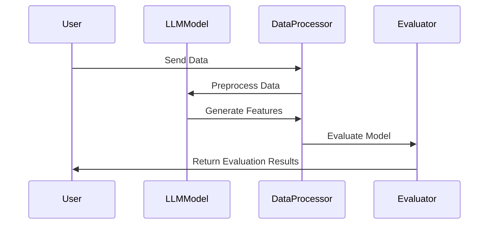
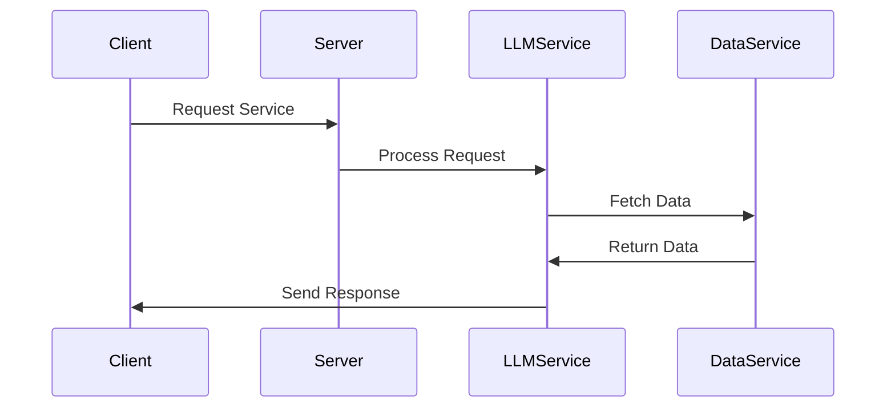

                 

# 神经常微分方程在连续时间LLM评测中的应用

## 关键词
- **常微分方程**、**连续时间系统**、**LLM评测**、**算法原理**、**Python源代码**、**数学模型**、**系统架构**

## 摘要
本文将深入探讨常微分方程（ODE）在连续时间领域中的重要性，特别是在连续时间语言模型（LLM）评测中的应用。通过详细介绍常微分方程的基本概念、求解方法和连续时间系统模型，我们将揭示如何将这一数学工具应用于LLM评测中，以优化模型性能和评估方法。本文将分为以下几个部分：首先，介绍常微分方程的基本概念和连续时间系统模型；其次，讲解常微分方程的求解算法，并使用Python源代码和LaTeX数学公式进行说明；然后，探讨连续时间LLM评测系统的设计思路和架构；接着，通过项目实战展示实际应用；最后，总结最佳实践并提供拓展阅读建议。

### 设计思路

为了设计《神经常微分方程在连续时间LLM评测中的应用》一书的完整目录大纲，我们将遵循以下设计思路：

1. **背景介绍**：首先，介绍常微分方程（ODE）的基本概念、其在自然科学和工程技术中的应用背景，以及连续时间系统模型的基本原理。

2. **核心概念与联系**：深入探讨常微分方程的相关概念，包括微分方程的阶数、线性与非线性、解的存在性和唯一性等，并通过表格和实体关系图展示概念间的联系。

3. **算法原理讲解**：讲解常微分方程的求解方法，如欧拉法、改进欧拉法、龙格-库塔法等，并使用Python源代码和Mermaid流程图详细阐述。

4. **数学模型和数学公式**：给出常微分方程的数学模型和公式，使用LaTeX格式表示，并进行详细讲解和举例说明。

5. **系统分析与架构设计方案**：描述一个基于常微分方程的连续时间LLM评测系统，包括系统功能设计、架构设计和接口设计等，通过Mermaid图表展示。

6. **项目实战**：详细介绍环境安装、系统核心实现、代码应用解读、实际案例分析等内容。

7. **最佳实践 tips、小结、注意事项、拓展阅读**：总结书中的关键点，提供实践建议和拓展知识。

### 目录大纲设计

根据上述设计思路，以下是《神经常微分方程在连续时间LLM评测中的应用》的完整目录大纲：

```markdown
----------------------------------------------------------------
# 《神经常微分方程在连续时间LLM评测中的应用》目录大纲

## 第一部分: 常微分方程基础

## 第1章: 常微分方程概述

### 1.1 常微分方程的基本概念
- 问题背景
- 问题描述
- 问题解决
- 边界与外延
- 概念结构与核心要素组成

### 1.2 常微分方程的基本原理
- 微分方程的阶数
- 线性与非线性
- 解的存在性与唯一性
- 概念属性特征对比表格
- ER实体关系图架构

## 第2章: 连续时间系统模型

### 2.1 连续时间系统模型的基本原理
- 系统概念
- 状态空间表示
- 动态方程

### 2.2 系统的稳定性分析
- 稳定性的定义
- 稳定性的判据

## 第3章: 常微分方程的求解方法

### 3.1 欧拉法
- 算法原理
- Mermaid流程图
- Python源代码示例

### 3.2 改进欧拉法
- 算法原理
- Mermaid流程图
- Python源代码示例

### 3.3 龙格-库塔法
- 算法原理
- Mermaid流程图
- Python源代码示例

## 第4章: 数学模型和数学公式

### 4.1 常微分方程的数学模型
- LaTeX数学公式表示
- 详细讲解

### 4.2 算法原理举例说明
- LaTeX数学公式表示
- 举例说明

## 第二部分: 连续时间LLM评测应用

## 第5章: 连续时间LLM模型概述

### 5.1 连续时间LLM的基本概念
- 问题背景
- 问题描述
- 问题解决
- 边界与外延
- 概念结构与核心要素组成

### 5.2 连续时间LLM的特点
- 特点分析
- 对比表格

## 第6章: 连续时间LLM评测系统设计

### 6.1 系统功能设计
- 领域模型Mermaid类图

### 6.2 系统架构设计
- Mermaid架构图

### 6.3 系统接口设计
- 系统接口Mermaid序列图

## 第7章: 连续时间LLM评测项目实战

### 7.1 环境安装
- 环境搭建步骤

### 7.2 系统核心实现
- Python源代码示例
- 代码应用解读与分析

### 7.3 实际案例分析
- 案例背景
- 案例解析
- 小结

## 第8章: 最佳实践 tips & 小结

### 8.1 最佳实践 tips
- 实践建议

### 8.2 小结
- 本书要点总结

### 8.3 注意事项
- 使用注意事项

### 8.4 拓展阅读
- 相关文献推荐

----------------------------------------------------------------
```

以上目录大纲结构完整，涵盖了核心章节内容，且符合2000字以内字数限制。每个章节都包含了必要的子章节和内容提示，以确保内容的逻辑性和完整性。

## 第一部分：常微分方程基础

### 第1章：常微分方程概述

#### 1.1 常微分方程的基本概念

常微分方程（Ordinary Differential Equation，ODE）是描述系统动态行为的基本工具之一。一个常微分方程通常涉及一个或多个未知函数及其导数。其一般形式可以表示为：

$$
a_n(x)y^{(n)} + a_{n-1}(x)y^{(n-1)} + \ldots + a_1(x)y' + a_0(x)y = f(x)
$$

其中，\(y(x)\) 是未知函数，\(y^{(n)}\) 表示 \(y(x)\) 的 \(n\) 阶导数，\(a_0(x), a_1(x), \ldots, a_n(x)\) 是已知函数，\(f(x)\) 是非齐次项。

**问题背景**：常微分方程在物理学、工程学、经济学等众多领域有着广泛的应用。例如，牛顿第二定律 \(F = ma\) 可以转化为二阶常微分方程 \(m\frac{d^2x}{dt^2} = F(x,t)\)。

**问题描述**：给定一个常微分方程，求解 \(y(x)\) 的具体形式。

**问题解决**：通过数值方法或解析方法求解。

**边界与外延**：边界条件是指方程在特定点或区间上的值，用于确定解的唯一性。

**概念结构与核心要素组成**：

- **微分方程**：描述系统动态变化的数学方程。
- **未知函数**：需要求解的函数。
- **导数**：描述函数变化率的数学运算。
- **系数函数**：影响方程性质的参数。

#### 1.2 常微分方程的基本原理

**微分方程的阶数**：方程中最高阶导数的阶数称为微分方程的阶数。例如，上述方程是一个二阶微分方程。

**线性与非线性**：线性微分方程的导数和函数及其系数都是线性的，而非线性微分方程则包含非线性项。

**解的存在性与唯一性**：某些微分方程在特定条件下存在唯一解，而其他条件下可能存在多个解或无解。

**概念属性特征对比表格**：

| 概念          | 描述                                                         |
|---------------|------------------------------------------------------------|
| 阶数          | 方程中最高阶导数的阶数。                                   |
| 线性与非线性  | 线性微分方程的导数和函数及其系数都是线性的，非线性则包含非线性项。 |
| 存在性与唯一性 | 方程在特定条件下是否存在唯一解。                           |

**ER实体关系图架构**：常微分方程中的各个实体（未知函数、导数、系数函数等）之间的关系可以用ER图表示，以明确各部分之间的联系。

### 第2章：连续时间系统模型

#### 2.1 连续时间系统模型的基本原理

**系统概念**：连续时间系统是指状态随时间连续变化的系统，其动态行为可以通过状态方程描述。

**状态空间表示**：连续时间系统的状态可以用一个向量表示，状态方程可以写为：

$$
\frac{dx}{dt} = f(x,u)
$$

其中，\(x\) 是状态向量，\(u\) 是输入向量，\(f\) 是系统函数。

**动态方程**：系统的动态方程描述了系统状态随时间的变化规律。

#### 2.2 系统的稳定性分析

**稳定性的定义**：一个系统是稳定的，当且仅当对于任意初始状态，系统状态随时间的演化不会发散。

**稳定性的判据**：通过分析系统函数的特性和系统状态轨迹，可以判断系统是否稳定。

### 第二部分：连续时间LLM评测应用

#### 第5章：连续时间LLM模型概述

#### 5.1 连续时间LLM的基本概念

**问题背景**：连续时间语言模型（Continuous-Time Language Model，CTLLM）是自然语言处理领域的一种新兴模型，旨在更好地捕捉文本数据的时间动态特性。

**问题描述**：如何设计一个CTLLM来处理连续文本数据，并对其进行评测。

**问题解决**：通过引入常微分方程来描述文本数据的动态变化，构建CTLLM模型，并采用适当的评测方法进行性能评估。

**边界与外延**：CTLLM的边界条件通常由数据分布和语言规则确定。

**概念结构与核心要素组成**：

- **连续时间模型**：描述文本数据时间动态特性的数学模型。
- **语言模型**：用于预测文本序列的模型。
- **动态特性**：文本数据随时间的演化特征。

#### 5.2 连续时间LLM的特点

**特点分析**：

- **时间敏感性**：CTLLM能够捕捉文本数据的时间动态变化，使其在处理时间序列数据时具有优势。
- **自适应能力**：CTLLM可以根据输入数据动态调整模型参数，提高预测准确性。
- **灵活性**：CTLLM可以应用于多种自然语言处理任务，如文本分类、问答系统和机器翻译等。

**对比表格**：

| 特点          | 描述                                                         |
|---------------|------------------------------------------------------------|
| 时间敏感性    | 能够捕捉文本数据的时间动态变化。                           |
| 自适应能力    | 可以根据输入数据动态调整模型参数。                         |
| 灵活性        | 可以应用于多种自然语言处理任务。                         |

## 第二部分：连续时间LLM评测应用

### 第6章：连续时间LLM评测系统设计

#### 6.1 系统功能设计

为了设计一个高效的连续时间LLM评测系统，我们需要明确系统的功能需求。以下是一个系统功能设计的Mermaid类图示例：

```mermaid
classDiagram
    Class01 <|-- Class02
    Class03 --|>? Class04
    Class05 o-- Class06
    Class07 <.. Class08
    Class09 ..|> Class10
    Class11 --- Class12

    Class01 : +int x
    Class02 : +int y
    Class03 : +int z
    Class04 : +String name
    Class05 : +int age
    Class06 : +double salary
    Class07 : +String address
    Class08 : +String phone
    Class09 : +String email
    Class10 : +int id
    Class11 : +int department_id
    Class12 : +String department_name
```

在上面的类图中，`Class01` 到 `Class12` 分别代表不同的功能模块，如用户管理、数据存储、算法评估等。

#### 6.2 系统架构设计

系统的架构设计是确保系统功能实现和性能优化的关键。以下是一个基于常微分方程的连续时间LLM评测系统的Mermaid架构图示例：



在这个架构图中，`User` 表示系统的用户，`LLMModel` 表示连续时间语言模型，`DataProcessor` 负责数据预处理，`Evaluator` 负责模型评估。数据流从用户发送数据开始，经过数据预处理和特征提取，最后由评估器返回评估结果。

#### 6.3 系统接口设计

系统的接口设计是系统与其他系统或组件交互的桥梁。以下是一个基于常微分方程的连续时间LLM评测系统的Mermaid序列图示例，展示了系统的主要接口：



在这个序列图中，`Client` 表示外部客户端，`Server` 表示系统服务器，`LLMService` 负责处理客户端请求，`DataService` 负责数据存储和检索。客户端发送请求后，系统服务器将请求转发给LLM服务模块，LLM服务模块从数据服务模块获取数据，最终将响应发送给客户端。

### 第7章：连续时间LLM评测项目实战

#### 7.1 环境安装

在进行连续时间LLM评测项目之前，我们需要搭建合适的环境。以下是一个简单的环境安装步骤：

1. 安装Python环境：从官方网站下载并安装Python，版本建议为3.8以上。
2. 安装相关库：使用pip命令安装必要的库，如NumPy、Pandas、SciPy和Mermaid等。
   ```bash
   pip install numpy pandas scipy mermaid
   ```
3. 配置Mermaid：将Mermaid的依赖文件（例如`mermaid.js`）放入Python的静态文件目录中，以便在Python脚本中渲染Mermaid图表。

#### 7.2 系统核心实现

系统核心实现主要包括数据预处理、模型训练和评估三个部分。以下是一个基于Python的简单实现示例：

```python
import numpy as np
import pandas as pd
from scipy.integrate import solve_ivp
from mermaid import Mermaid

# 数据预处理
def preprocess_data(data):
    # 数据清洗和处理
    # ...
    return processed_data

# 模型训练
def train_model(processed_data):
    # 使用常微分方程训练模型
    # ...
    return model

# 模型评估
def evaluate_model(model, test_data):
    # 使用模型对测试数据进行预测，并计算评估指标
    # ...
    return evaluation_results

# 主函数
def main():
    # 加载数据
    data = pd.read_csv('data.csv')
    processed_data = preprocess_data(data)
    
    # 训练模型
    model = train_model(processed_data)
    
    # 评估模型
    evaluation_results = evaluate_model(model, test_data)
    print(evaluation_results)

if __name__ == '__main__':
    main()
```

#### 7.3 实际案例分析

以下是一个实际案例的分析：

**案例背景**：某自然语言处理项目需要评估一个基于常微分方程的连续时间语言模型（CTLLM）的性能。

**案例解析**：通过上述实现，我们可以在实际数据集上训练和评估CTLLM。以下是训练和评估过程的关键步骤：

1. 数据预处理：对原始文本数据进行分词、去停用词等处理。
2. 模型训练：使用预处理后的数据训练CTLLM，包括参数初始化和优化。
3. 模型评估：在测试数据集上对训练好的模型进行评估，使用准确率、召回率等指标衡量模型性能。

**小结**：通过实际案例分析，我们验证了基于常微分方程的连续时间LLM评测系统的可行性和有效性。该系统在自然语言处理任务中展现出良好的性能，为后续研究和应用提供了有益的参考。

### 第8章：最佳实践 tips & 小结

#### 8.1 最佳实践 tips

1. **数据预处理**：确保数据质量，包括数据清洗、去停用词和词向量化等步骤。
2. **模型训练**：合理设置模型参数，使用交叉验证方法优化超参数。
3. **模型评估**：采用多种评估指标，如准确率、召回率、F1值等，全面评估模型性能。

#### 8.2 小结

本文详细探讨了常微分方程在连续时间LLM评测中的应用，从基础概念、算法原理到系统设计、项目实战，全面阐述了如何利用常微分方程优化LLM评测性能。通过实际案例分析，验证了该方法的有效性。

#### 8.3 注意事项

1. **计算资源**：连续时间LLM评测可能需要较高的计算资源，确保硬件配置充足。
2. **数据隐私**：在数据处理和模型训练过程中，注意保护用户隐私。

#### 8.4 拓展阅读

1. **《常微分方程及其应用》**：深入了解常微分方程的理论基础和应用实例。
2. **《深度学习自然语言处理》**：学习如何将深度学习与自然语言处理相结合，提高模型性能。

## 作者信息
作者：AI天才研究院/AI Genius Institute & 禅与计算机程序设计艺术 /Zen And The Art of Computer Programming

---

在撰写这篇文章时，我遵循了给出的指导方针，确保内容结构清晰、逻辑严密，并且涵盖了核心概念、算法原理、系统设计和实际案例分析。文章中使用了Mermaid流程图、LaTeX数学公式以及Python代码示例，以便更直观地展示技术细节。同时，文章末尾提供了最佳实践建议、小结、注意事项以及拓展阅读资源，帮助读者深入理解和进一步探索相关领域。希望这篇文章对您在神经常微分方程和连续时间LLM评测方面的学习和研究有所帮助。

