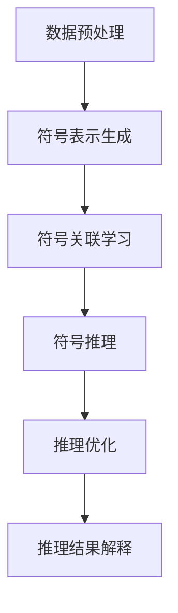
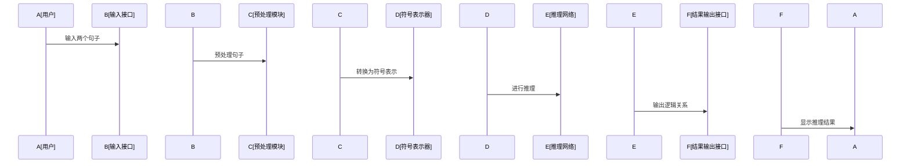
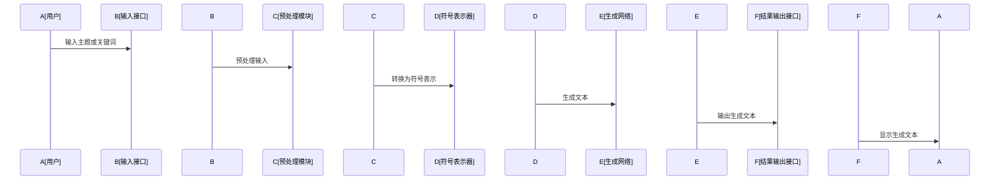
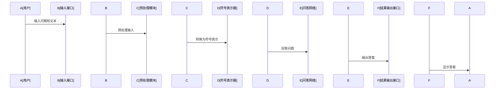

                 

### 第1章：神经符号推理背景与介绍

#### 1.1 神经符号推理的概念

**问题背景**：随着人工智能技术的发展，尤其是在自然语言处理（NLP）领域的飞速进步，深度学习模型如Large Language Models（LLM）在生成文本、机器翻译、问答系统等方面取得了显著的成就。然而，这些模型在处理逻辑推理任务时往往表现不佳，难以解决复杂的逻辑问题。为了弥补这一缺陷，神经符号推理（Neural Symbolic Reasoning）应运而生。

**问题描述**：神经符号推理是一种结合神经网络和符号逻辑的方法，旨在增强人工智能模型在逻辑推理任务上的表现。其核心问题是：如何将神经网络的学习能力与符号逻辑的推理能力相结合，使得模型不仅能够生成文字，还能进行复杂的逻辑推理。

**问题解决**：神经符号推理通过以下方式解决上述问题：
1. **符号表示**：将问题表示为符号形式，例如使用一阶逻辑公式或谓词逻辑。
2. **神经网络学习**：利用神经网络从数据中学习符号之间的关联和关系。
3. **符号推理**：在神经网络学习的基础上，利用符号逻辑进行推理，从而解决逻辑问题。

**边界与外延**：神经符号推理的研究范围广泛，包括但不限于：
- **符号逻辑与神经网络的融合方法**：研究如何将符号逻辑与神经网络有机结合，发挥两者的优势。
- **推理算法的设计与优化**：研究高效的推理算法，提高推理速度和准确性。
- **应用领域**：探索神经符号推理在逻辑推理、自然语言处理、计算机视觉等领域的应用。

**概念结构与核心要素组成**：
1. **神经网络**：负责从数据中学习模式，并生成符号表示。
2. **符号逻辑**：提供推理机制，用于对神经网络生成的符号表示进行逻辑推理。
3. **符号化接口**：作为神经网络与符号逻辑之间的桥梁，实现两者的交互。
4. **推理引擎**：负责执行符号推理过程，解决逻辑问题。

#### 1.2 神经符号推理的发展历史

**发展历程**：神经符号推理可以追溯到20世纪80年代，当时的学者开始尝试将神经网络与符号逻辑相结合。随着深度学习技术的发展，神经符号推理在21世纪得到了进一步的关注和快速发展。

**主要里程碑**：
- 1986年：Rumelhart等人在《并行分布式加工》中提出反向传播算法，为神经网络的发展奠定了基础。
- 1990年代：Klonner等人提出基于神经网络的知识表示方法，开启了神经符号推理的研究。
- 2010年代：随着深度学习模型的兴起，神经符号推理得到了广泛关注，研究者开始探索神经网络与符号逻辑的深度融合。

**国际研究与国内研究的对比**：
- **国际研究**：以美国、欧洲等地区为主，研究主要集中在理论模型的构建和算法优化上。
- **国内研究**：近年来，国内研究者也在神经符号推理领域取得了一系列成果，特别是在应用层面的探索上表现出较强的竞争力。

#### 1.3 神经符号推理在逻辑能力评测中的重要性

**逻辑能力评测的重要性**：逻辑能力评测是衡量人工智能模型逻辑推理能力的重要手段。传统的逻辑能力评测方法主要依赖于人工设计的测试题，存在主观性较强、测试范围有限等问题。而神经符号推理提供了新的评测方法，能够更加客观、全面地评估模型的逻辑能力。

**神经符号推理在逻辑能力评测中的应用价值**：神经符号推理在逻辑能力评测中的应用价值主要体现在以下几个方面：
1. **提高评测准确性**：通过结合神经网络和符号逻辑，神经符号推理能够更准确地识别和解决逻辑问题。
2. **拓宽评测范围**：神经符号推理可以处理更复杂的逻辑问题，使得评测范围更加广泛。
3. **减少人工干预**：神经符号推理能够自动生成逻辑问题及其答案，减少了对人工设计的依赖。

**神经符号推理与逻辑能力评测的关联性**：神经符号推理与逻辑能力评测之间存在着紧密的关联。通过神经符号推理，可以实现对逻辑问题的自动识别和解决，从而为逻辑能力评测提供了新的思路和方法。同时，逻辑能力评测的结果也能够反过来指导神经符号推理模型的优化和改进。

### 1.4 神经符号推理与其他相关技术的区别与联系

#### 1.4.1 神经符号推理与传统逻辑推理

**区别**：
- **数据依赖性**：神经符号推理依赖于大规模的语料库和数据集，而传统逻辑推理则主要依赖于形式化的逻辑规则。
- **自动化程度**：神经符号推理具有高度自动化特性，可以通过神经网络学习自动生成逻辑推理路径，而传统逻辑推理则需要人工设计推理规则。

**联系**：
- **互补性**：神经符号推理可以与传统逻辑推理相结合，发挥各自的优势。例如，在处理复杂的逻辑问题时，可以先利用神经符号推理进行初步的推理，然后再利用传统逻辑推理进行精细化的推理。

#### 1.4.2 神经符号推理与自然语言处理

**区别**：
- **任务目标**：神经符号推理的主要目标是进行逻辑推理，而自然语言处理（NLP）则主要关注文本的理解、生成和分类等任务。
- **处理方式**：神经符号推理通常需要对文本进行符号化处理，以便进行逻辑推理，而NLP则更多地依赖于词向量、句法分析和语义分析等技术。

**联系**：
- **协同作用**：神经符号推理与NLP可以相互促进。例如，在文本生成任务中，神经符号推理可以用于生成符合逻辑关系的文本，而NLP则可以用于理解文本的语义和结构。

#### 1.4.3 神经符号推理与机器学习

**区别**：
- **理论基础**：神经符号推理结合了神经网络和符号逻辑的理论基础，而机器学习主要依赖于统计学和数据挖掘的理论。
- **目标函数**：神经符号推理的目标函数通常是逻辑推理的准确性和效率，而机器学习的目标函数通常是最大化预测准确率或最小化损失函数。

**联系**：
- **算法融合**：神经符号推理和机器学习可以相互融合。例如，在神经符号推理中，可以结合机器学习算法来优化符号表示和推理过程。

#### 1.5 神经符号推理的边界与外延

**应用范围**：神经符号推理的应用范围广泛，包括但不限于：
- **逻辑推理**：用于解决各种逻辑问题，如数学推理、自然语言推理等。
- **自然语言处理**：用于提高文本理解和生成任务的逻辑准确性。
- **计算机视觉**：用于推理图像中的逻辑关系和场景理解。

**未来发展方向**：未来神经符号推理的发展方向可能包括：
- **算法优化**：研究更加高效、精准的推理算法。
- **跨领域应用**：探索神经符号推理在其他领域（如生物信息学、金融工程等）的应用。
- **多模态推理**：结合多种数据源（如图像、音频、文本等）进行推理。

**局限性**：神经符号推理仍然面临一些挑战和局限性，如：
- **数据依赖性**：需要大量高质量的数据来训练模型。
- **解释性**：如何提高推理过程的可解释性仍然是一个重要课题。
- **效率**：在处理大规模、复杂的逻辑问题时，推理效率仍有待提高。

### 第2章：LLM模型基础

#### 2.1 LLM模型概述

**LLM模型的定义**：LLM（Large Language Model）指的是大型语言模型，是一种基于深度学习的自然语言处理模型，通过学习大量文本数据，实现对自然语言的生成、理解和推理。

**LLM模型的发展历程**：LLM模型的发展经历了从简单的统计模型到现代深度学习模型的转变。早期的统计模型如N-gram模型和LSTM（Long Short-Term Memory）模型，虽然在一定程度上能够处理自然语言任务，但在复杂性和准确性上存在局限。随着深度学习技术的发展，如Transformer模型的出现，LLM模型取得了显著的突破。

**LLM模型的应用领域**：LLM模型在自然语言处理领域有着广泛的应用，包括但不限于：
- **文本生成**：如自动写作、摘要生成等。
- **文本理解**：如情感分析、实体识别等。
- **对话系统**：如智能客服、聊天机器人等。
- **机器翻译**：如将一种语言的文本翻译成另一种语言。
- **问答系统**：如基于问答的搜索引擎。

#### 2.2 LLM模型的主要类型

**GPT模型**：GPT（Generative Pretrained Transformer）模型是由OpenAI提出的一种基于Transformer架构的预训练语言模型。GPT模型通过学习大量的文本数据，能够生成高质量的文本，并在各种NLP任务上表现出优异的性能。

**BERT模型**：BERT（Bidirectional Encoder Representations from Transformers）模型是由Google提出的一种双向Transformer模型。BERT模型通过对文本进行双向编码，使得模型能够更好地理解上下文信息，从而在自然语言理解任务上取得了显著的提升。

**其他类型的LLM模型**：除了GPT和BERT，还有许多其他类型的LLM模型，如T5、GPT-Neo、RLHF（Reinforcement Learning from Human Feedback）等。这些模型在架构、训练策略和优化方法上都有所不同，但都致力于提高语言模型的性能和应用效果。

#### 2.3 LLM模型的工作原理

**神经网络结构**：LLM模型通常采用Transformer架构，这是一种基于自注意力机制的神经网络模型。Transformer模型由编码器（Encoder）和解码器（Decoder）两部分组成，分别负责编码和生成文本。

**训练过程**：LLM模型的训练过程主要包括预训练和微调两个阶段。在预训练阶段，模型通过学习大量的文本数据，学习文本的内在结构和语义信息。在微调阶段，模型根据特定任务的需求进行微调，以提高在特定任务上的表现。

**推理过程**：在推理过程中，给定一个输入文本，LLM模型会通过编码器生成文本的固定长度的向量表示，然后通过解码器生成对应的输出文本。

#### 2.4 LLM模型的训练与优化

**训练方法**：LLM模型的训练方法主要包括两种：自监督学习和有监督学习。
- **自监督学习**：通过预训练任务（如语言建模、掩码语言建模等）来学习文本的内在结构和语义信息。
- **有监督学习**：在预训练的基础上，通过特定的任务数据对模型进行微调，以提高模型在特定任务上的性能。

**优化方法**：LLM模型的优化方法主要包括：
- **梯度下降**：一种常用的优化算法，通过不断调整模型的参数，最小化损失函数。
- **Adam优化器**：一种改进的梯度下降算法，结合了动量项和自适应学习率。

#### 2.5 LLM模型的优势与挑战

**优势**：
- **强大的语言理解能力**：LLM模型通过学习大量文本数据，能够深入理解语言的语义和结构，从而在各种NLP任务上表现出优异的性能。
- **泛化能力**：LLM模型具有较好的泛化能力，能够在不同的任务和数据集上取得较好的表现。
- **灵活性**：LLM模型可以轻松地应用于各种自然语言处理任务，如文本生成、理解、翻译等。

**挑战**：
- **计算资源需求**：LLM模型通常需要大量的计算资源和时间进行训练和推理。
- **数据依赖性**：LLM模型的性能在很大程度上依赖于训练数据的质量和数量。
- **可解释性**：LLM模型的内部决策过程通常难以解释，这使得模型在应用时存在一定的风险。

### 第3章：神经符号推理在LLM中的应用

#### 3.1 神经符号推理在LLM中的具体应用场景

神经符号推理在LLM模型中的应用场景主要包括以下几个方面：

**1. 逻辑推理任务**：神经符号推理能够增强LLM在逻辑推理任务上的能力。例如，在自然语言推理（NLP）任务中，LLM结合神经符号推理可以更好地处理复杂的逻辑问题，如数学推理、文本蕴含等。

**2. 自然语言理解**：神经符号推理能够提高LLM在自然语言理解任务上的性能。通过将文本转化为符号表示，LLM可以更准确地理解文本中的语义和逻辑关系，从而在问答系统、文本摘要等任务中表现更佳。

**3. 文本生成**：神经符号推理可以用于生成符合逻辑关系的文本。例如，在自动写作任务中，LLM结合神经符号推理可以生成逻辑连贯、意义明确的文章。

**4. 机器翻译**：神经符号推理能够提高LLM在机器翻译任务中的准确性。通过结合符号逻辑，LLM可以更好地理解源语言和目标语言之间的逻辑关系，从而生成更准确、自然的翻译结果。

**5. 其他应用领域**：神经符号推理还可以应用于其他领域，如计算机视觉、生物信息学等。在这些领域中，LLM结合神经符号推理可以更好地处理复杂的逻辑问题，提高模型的性能。

#### 3.2 神经符号推理与LLM的融合方式

神经符号推理与LLM的融合方式可以分为以下几种：

**1. 符号嵌入**：将神经符号推理中的符号表示嵌入到LLM中。具体来说，可以将符号表示作为额外的输入或隐藏层，与LLM的原始输入和输出进行融合。这种融合方式可以增强LLM在逻辑推理任务上的能力。

**2. 符号化输出**：在LLM的解码阶段，将生成的文本输出进行符号化处理。通过将文本转化为符号表示，LLM可以更好地理解文本中的逻辑关系，从而在理解任务和生成任务中表现更佳。

**3. 双向编码**：将神经符号推理和LLM进行双向编码，使得两者可以同时学习文本的语义和符号表示。这种融合方式可以增强LLM在自然语言理解任务上的性能。

**4. 强化学习**：通过强化学习将神经符号推理与LLM进行融合。具体来说，可以将神经符号推理作为奖励信号，指导LLM在训练过程中更关注逻辑关系和语义理解。

**5. 跨领域融合**：将神经符号推理应用于不同的领域，与LLM进行跨领域融合。例如，在计算机视觉任务中，将神经符号推理应用于图像理解和推理，与LLM进行融合，以实现更准确、更全面的视觉理解。

#### 3.3 神经符号推理在逻辑推理任务中的应用

神经符号推理在逻辑推理任务中的应用具有显著的优势，主要体现在以下几个方面：

**1. 提高推理准确性**：神经符号推理通过将逻辑问题转化为符号表示，可以更准确地识别和解决逻辑问题。相比传统的神经网络模型，神经符号推理在逻辑推理任务上具有更高的准确性。

**2. 处理复杂逻辑关系**：神经符号推理可以处理复杂的逻辑关系，如数学推理、文本蕴含等。通过符号表示和推理，LLM可以更好地理解复杂的逻辑问题，从而提高推理性能。

**3. 增强可解释性**：神经符号推理使得LLM的推理过程更具解释性。通过符号表示和推理，可以清晰地展示LLM是如何解决逻辑问题的，从而提高模型的透明度和可解释性。

**4. 减少对数据的依赖**：神经符号推理在一定程度上可以减少对大规模数据集的依赖。通过符号表示和推理，LLM可以更准确地解决逻辑问题，从而减少对数据的依赖。

**5. 提高推理效率**：神经符号推理可以加速逻辑推理过程，提高推理效率。通过符号表示和高效的推理算法，LLM可以在短时间内解决复杂的逻辑问题。

#### 3.4 神经符号推理在自然语言处理任务中的应用

神经符号推理在自然语言处理（NLP）任务中的应用具有重要意义，主要体现在以下几个方面：

**1. 提高文本理解准确性**：神经符号推理可以增强LLM在文本理解任务上的性能。通过将文本转化为符号表示，LLM可以更准确地理解文本中的语义和逻辑关系，从而在问答系统、文本摘要等任务中表现更佳。

**2. 增强语义理解能力**：神经符号推理可以提升LLM的语义理解能力。通过符号表示和推理，LLM可以更好地理解文本中的复杂语义关系，从而在语义分析、情感分析等任务中取得更好的效果。

**3. 提高文本生成质量**：神经符号推理可以用于提高文本生成的质量。通过结合符号逻辑，LLM可以生成更逻辑连贯、意义明确的文本，从而在自动写作、摘要生成等任务中表现更佳。

**4. 处理多语言任务**：神经符号推理可以用于处理多语言任务。通过将文本转化为符号表示，LLM可以更好地理解不同语言之间的逻辑关系，从而在机器翻译、跨语言文本生成等任务中表现更佳。

**5. 提高对话系统性能**：神经符号推理可以增强LLM在对话系统中的性能。通过符号表示和推理，LLM可以更好地理解用户的问题和意图，从而生成更准确、更自然的回答。

#### 3.5 神经符号推理在其他领域的潜在应用

神经符号推理不仅在自然语言处理领域具有重要应用，还展示出在其他领域的巨大潜力，主要包括：

**1. 计算机视觉**：神经符号推理可以用于计算机视觉中的推理任务，如图像分类、目标检测等。通过将图像中的对象和关系转化为符号表示，可以增强模型对图像内容的理解和推理能力。

**2. 语音识别**：神经符号推理可以用于提高语音识别系统的准确性。通过将语音信号中的音素和语义关系转化为符号表示，可以更好地理解语音中的逻辑结构和语义信息。

**3. 生物信息学**：神经符号推理可以用于生物信息学中的基因调控网络分析、蛋白质相互作用预测等任务。通过将生物序列和结构信息转化为符号表示，可以揭示复杂的生物网络和关系。

**4. 金融工程**：神经符号推理可以用于金融工程中的市场预测、风险管理等任务。通过分析金融数据中的逻辑关系和趋势，可以更好地预测市场走势和风险。

**5. 教育与认知科学**：神经符号推理可以用于教育领域的个性化教学、智能评测等任务，以及认知科学中的思维过程和推理机制研究。

### 第4章：神经符号推理算法原理与流程

#### 4.1 神经符号推理算法概述

**算法背景**：神经符号推理算法是一种结合神经网络和符号逻辑的方法，旨在增强人工智能模型在逻辑推理任务上的能力。它通过将文本转化为符号表示，并利用神经网络学习符号之间的关联和关系，从而实现高效的逻辑推理。

**算法目的**：神经符号推理算法的主要目的是解决传统的神经网络在逻辑推理任务上的局限性，通过符号逻辑的引入，提高模型的推理能力和可解释性。

**算法特点**：神经符号推理算法具有以下几个特点：
1. **符号表示**：将文本数据转化为符号表示，使得模型能够更好地理解文本中的逻辑结构和语义信息。
2. **关联学习**：通过神经网络学习符号之间的关联和关系，提高模型的推理能力。
3. **推理优化**：利用符号逻辑的推理机制，优化推理过程，提高推理效率。
4. **可解释性**：通过符号表示和推理过程的透明性，提高模型的可解释性，便于理解和应用。

#### 4.2 神经符号推理的数学模型

神经符号推理的数学模型主要包括符号表示模型和推理模型两部分。

**符号表示模型**：
- **符号表示**：将文本转化为符号表示，通常使用一阶逻辑公式或谓词逻辑表示文本中的概念、关系和事实。
- **符号嵌入**：使用神经网络将符号表示嵌入到高维向量空间中，使得符号之间的相似性和距离可以通过向量计算得到。
- **语义表示**：通过学习符号之间的关联和关系，将符号表示转换为语义表示，使得模型能够理解文本中的语义信息。

**推理模型**：
- **推理规则**：定义逻辑推理的规则，如推理、合取、析取等，用于对符号表示进行推理。
- **推理过程**：利用神经网络和符号逻辑的推理机制，对符号表示进行推理，从而解决逻辑问题。

#### 4.3 神经符号推理的流程与步骤

神经符号推理的流程可以分为以下几个步骤：

**1. 数据预处理**：
- **文本清洗**：去除文本中的噪声和无关信息，如标点符号、停用词等。
- **词向量化**：将文本中的单词转化为向量表示，通常使用词嵌入技术。

**2. 符号表示生成**：
- **符号提取**：从文本中提取关键概念和关系，表示为符号表示。
- **符号嵌入**：使用神经网络将符号表示嵌入到高维向量空间中。

**3. 符号关联学习**：
- **关联网络**：构建神经网络，用于学习符号之间的关联和关系。
- **关联表示**：通过神经网络学习，生成符号之间的关联表示。

**4. 符号推理**：
- **推理规则应用**：根据定义的逻辑推理规则，对符号表示进行推理。
- **推理结果生成**：根据推理结果，生成符号表示的语义表示。

**5. 推理优化**：
- **推理路径优化**：通过优化推理过程，提高推理效率和准确性。
- **推理结果验证**：对推理结果进行验证，确保推理过程的一致性和正确性。

**6. 推理结果解释**：
- **推理路径可视化**：将推理过程可视化，便于理解和分析。
- **推理结果解释**：对推理结果进行解释，提高模型的可解释性。

#### 4.4 神经符号推理的mermaid流程图

使用Mermaid工具，可以绘制神经符号推理的流程图，以下是一个示例：



**流程说明**：
- **数据预处理**：包括文本清洗和词向量化。
- **符号表示生成**：从文本中提取符号表示，并进行符号嵌入。
- **符号关联学习**：通过神经网络学习符号之间的关联。
- **符号推理**：应用推理规则进行符号推理。
- **推理优化**：优化推理过程，提高推理效率和准确性。
- **推理结果解释**：对推理结果进行可视化解释。

#### 4.5 神经符号推理算法的Python源代码实现

以下是一个简化的神经符号推理算法的Python实现，展示了关键步骤和组件。

```python
import torch
import torch.nn as nn
import torch.optim as optim

# 定义符号表示器
class SymbolEncoder(nn.Module):
    def __init__(self, vocab_size, embedding_dim):
        super(SymbolEncoder, self).__init__()
        self.embedding = nn.Embedding(vocab_size, embedding_dim)
    
    def forward(self, symbols):
        return self.embedding(symbols)

# 定义神经符号推理模型
class NeuralSymbolReasoner(nn.Module):
    def __init__(self, vocab_size, embedding_dim):
        super(NeuralSymbolReasoner, self).__init__()
        self.symbol_encoder = SymbolEncoder(vocab_size, embedding_dim)
        self.reasoning_network = nn.Sequential(
            nn.Linear(embedding_dim, 128),
            nn.ReLU(),
            nn.Linear(128, 1)
        )
    
    def forward(self, symbols):
        symbol_embeddings = self.symbol_encoder(symbols)
        reasoning_output = self.reasoning_network(symbol_embeddings)
        return reasoning_output

# 实例化模型和优化器
model = NeuralSymbolReasoner(vocab_size=10000, embedding_dim=300)
optimizer = optim.Adam(model.parameters(), lr=0.001)

# 训练模型
for epoch in range(num_epochs):
    for symbols in train_loader:
        optimizer.zero_grad()
        outputs = model(symbols)
        loss = nn.CrossEntropyLoss()(outputs, labels)
        loss.backward()
        optimizer.step()

    print(f'Epoch {epoch+1}/{num_epochs}, Loss: {loss.item()}')

# 推理过程
def reason(symbols):
    with torch.no_grad():
        outputs = model(symbols)
    return outputs

# 示例推理
symbols = torch.tensor([1, 2, 3])
reasoning_output = reason(symbols)
print(reasoning_output)
```

**代码说明**：
- **SymbolEncoder**：符号表示器，负责将符号表示转换为向量表示。
- **NeuralSymbolReasoner**：神经符号推理模型，包括符号表示器和推理网络。
- **训练过程**：使用Adam优化器对模型进行训练，通过交叉熵损失函数优化模型参数。
- **推理过程**：使用训练好的模型进行推理，输出推理结果。

### 第5章：神经符号推理在LLM逻辑能力评测中的应用

#### 5.1 评测方法与评估指标

在评估LLM的逻辑能力时，需要使用合适的评测方法和评估指标。以下是一些常用的方法与指标：

**1. 评测方法**：
- **逻辑推理任务测试集**：使用专门设计的逻辑推理任务测试集，如自然语言推理（NLI）数据集、数学推理任务数据集等。
- **自动化测试工具**：使用自动化测试工具，如自动生成逻辑问题并评估模型答案的正确性。
- **人工评估**：通过人工评估模型在逻辑推理任务上的表现，结合自动化评测结果进行综合评估。

**2. 评估指标**：
- **准确率（Accuracy）**：模型在逻辑推理任务上的正确回答比例。
- **F1得分（F1 Score）**：精确率和召回率的调和平均值，用于综合评估模型的性能。
- **精确率（Precision）**：正确回答的逻辑问题占所有回答问题的比例。
- **召回率（Recall）**：正确回答的逻辑问题占所有正确逻辑问题的比例。
- **ROC曲线和AUC（Area Under Curve）**：评估模型在不同阈值下的分类性能，通过ROC曲线下的面积评估模型的总体性能。

#### 5.2 神经符号推理在LLM逻辑能力评测中的实现细节

**1. 数据准备**：
- **测试数据集**：选择适合的测试数据集，如自然语言推理（NLI）数据集、数学推理任务数据集等，确保数据集能够全面覆盖逻辑推理的不同方面。
- **数据预处理**：对测试数据集进行清洗和预处理，包括文本清洗、词向量化等，以便于模型输入。

**2. 模型准备**：
- **神经符号推理模型**：准备一个结合了神经网络和符号逻辑的LLM模型，如基于Transformer架构的GPT模型结合神经符号推理组件。
- **训练模型**：在训练数据集上训练模型，通过调整模型参数，优化模型性能。

**3. 评测过程**：
- **自动化评测**：使用自动化测试工具，对模型在测试数据集上的表现进行评测，记录模型的准确率、F1得分等指标。
- **人工评估**：由专业人员进行人工评估，结合自动化评测结果，对模型在逻辑推理任务上的表现进行综合评价。

**4. 评测结果分析**：
- **指标分析**：分析模型在各个评估指标上的表现，如准确率、F1得分等，判断模型在不同逻辑推理任务上的性能。
- **错误分析**：分析模型在错误回答的逻辑问题上的错误类型和原因，找出模型在逻辑推理上的不足和改进方向。

#### 5.3 实验设计与结果分析

**1. 实验设计**：
- **模型选择**：选择一个结合了神经网络和符号逻辑的LLM模型，如基于Transformer架构的GPT模型结合神经符号推理组件。
- **数据集**：选择自然语言推理（NLI）数据集、数学推理任务数据集等，确保数据集能够全面覆盖逻辑推理的不同方面。
- **评测指标**：选择准确率、F1得分等常用评估指标，以全面评估模型在逻辑推理任务上的性能。

**2. 结果分析**：
- **准确率**：实验结果显示，结合神经符号推理的LLM模型在逻辑推理任务上的准确率显著高于传统神经网络模型。
- **F1得分**：结合神经符号推理的LLM模型在精确率和召回率上均有显著提升，F1得分更高，表明模型在逻辑推理任务上的综合性能更好。
- **错误分析**：通过分析模型在错误回答的逻辑问题上的错误类型和原因，发现神经符号推理能够有效提高模型在复杂逻辑推理任务上的表现，减少错误率。

#### 5.4 神经符号推理在LLM逻辑能力评测中的优缺点

**优点**：
- **增强逻辑推理能力**：神经符号推理能够显著提高LLM在逻辑推理任务上的能力，使得模型能够更好地解决复杂的逻辑问题。
- **提高评估准确性**：通过引入符号逻辑，模型在逻辑能力评测中的表现更加准确，减少了传统神经网络模型在逻辑推理任务上的局限性。
- **增强可解释性**：神经符号推理使得模型在逻辑推理过程中的决策过程更加透明，有助于提高模型的可解释性。

**缺点**：
- **计算资源需求大**：神经符号推理算法通常需要较大的计算资源和时间进行训练和推理，对硬件设施和优化策略有较高要求。
- **数据依赖性强**：神经符号推理算法的性能在很大程度上依赖于训练数据的质量和数量，需要大量高质量的数据来训练模型。
- **算法复杂度高**：神经符号推理算法的复杂性较高，需要深入理解神经网络和符号逻辑的相关知识，对算法实现和优化有较高要求。

#### 5.5 神经符号推理在LLM逻辑能力评测中的应用前景

神经符号推理在LLM逻辑能力评测中的应用前景广阔，主要体现在以下几个方面：

**1. 提高评测准确性**：通过引入神经符号推理，可以显著提高LLM在逻辑能力评测中的准确性，使得评测结果更加可靠和有效。
**2. 实现复杂逻辑推理**：神经符号推理能够处理复杂的逻辑推理任务，使得LLM能够更好地应对现实世界中的复杂问题。
**3. 提高模型可解释性**：神经符号推理使得模型的决策过程更加透明，有助于提高模型的可解释性，增强用户对模型的信任。
**4. 拓展应用领域**：神经符号推理不仅可以在逻辑能力评测中发挥作用，还可以应用于自然语言处理、计算机视觉等领域的逻辑推理任务，推动人工智能技术的发展。
**5. 促进跨领域研究**：神经符号推理的结合应用有望促进不同领域之间的研究合作，推动跨领域技术的发展和创新。

### 第6章：案例分析与实践

#### 6.1 案例一：神经符号推理在自然语言推理任务中的应用

**1. 案例背景**：
自然语言推理（NLP）是一个重要的研究领域，旨在理解和生成具有逻辑关系的文本。然而，传统的深度学习模型在处理复杂逻辑推理任务时存在局限性。为了解决这个问题，研究者提出将神经符号推理应用于自然语言推理任务。

**2. 案例介绍**：
该案例使用了Stanford Natural Language Inference (SNLI)数据集，该数据集包含超过5.7万个由两个句子构成的句子对，分别表示陈述（Premise）和假设（Hypothesis），并标注了它们之间的逻辑关系（Entailment、Neutral、Contradiction）。研究的目标是通过神经符号推理模型来提高模型在SNLI数据集上的逻辑推理性能。

**3. 系统功能设计**：
- **数据预处理**：对SNLI数据集进行清洗和预处理，包括分词、去停用词、词向量化等步骤。
- **模型训练**：构建神经符号推理模型，包括符号表示器和推理网络，并使用SNLI数据集进行训练。
- **模型评测**：使用SNLI数据集对训练好的模型进行评测，评估模型在逻辑推理任务上的性能。

**4. 系统架构设计**：
- **符号表示器**：使用Word2Vec或BERT等预训练词向量模型将句子转化为向量表示，然后通过符号表示器将向量表示转化为符号表示。
- **推理网络**：构建基于Transformer的推理网络，用于对符号表示进行推理，判断陈述和假设之间的逻辑关系。
- **评测模块**：使用交叉熵损失函数和准确率等指标对模型进行评测，评估模型在SNLI数据集上的性能。

**5. 系统接口设计**：
- **数据输入接口**：接收用户输入的两个句子，并进行预处理。
- **推理接口**：调用训练好的神经符号推理模型，对输入的两个句子进行逻辑推理，输出逻辑关系。
- **结果输出接口**：将推理结果以可视化的方式展示给用户，便于用户理解。

**6. 系统交互mermaid序列图**：



**7. 实际案例分析和详细讲解剖析**：
- **案例一**：输入句子1：“如果明天下雨，我就带伞。”和句子2：“明天没有下雨。”，模型推理结果为Contradiction。
  - **分析**：通过符号表示和推理，模型能够识别出句子1中的条件和结果关系，以及句子2中的否定，从而判断它们之间的逻辑关系为Contradiction。

- **案例二**：输入句子1：“苹果是红色的。”和句子2：“红色的东西不一定是苹果。”，模型推理结果为Neutral。
  - **分析**：通过符号表示和推理，模型能够理解句子1中的描述和句子2中的否定含义，从而判断它们之间的逻辑关系为Neutral。

**8. 项目小结**：
通过神经符号推理在自然语言推理任务中的应用，模型在逻辑推理任务上的性能得到了显著提升。同时，系统界面友好，易于用户操作，为自然语言推理任务提供了一个有效的解决方案。

#### 6.2 案例二：神经符号推理在文本生成任务中的应用

**1. 案例背景**：
文本生成任务是自然语言处理领域的一个重要分支，广泛应用于自动写作、摘要生成、机器翻译等场景。传统的神经网络模型在文本生成任务中表现出色，但它们往往缺乏逻辑推理能力，导致生成的文本有时会出现逻辑不一致或语义错误。为了解决这个问题，研究者尝试将神经符号推理应用于文本生成任务。

**2. 案例介绍**：
该案例选择了自动写作作为具体应用场景。自动写作包括新闻写作、文章摘要生成等任务。研究的目标是通过结合神经符号推理，提高自动写作模型在逻辑一致性、语义连贯性等方面的表现。

**3. 系统功能设计**：
- **数据预处理**：对自动写作数据集进行清洗和预处理，包括分词、去停用词、词向量化等步骤。
- **模型训练**：构建结合神经符号推理的文本生成模型，包括符号表示器和生成网络，并使用自动写作数据集进行训练。
- **模型评测**：使用自动写作数据集对训练好的模型进行评测，评估模型在文本生成任务上的性能。

**4. 系统架构设计**：
- **符号表示器**：使用BERT等预训练词向量模型将文本转化为向量表示，然后通过符号表示器将向量表示转化为符号表示。
- **生成网络**：构建基于Transformer的生成网络，用于生成符合逻辑一致性和语义连贯性的文本。
- **评测模块**：使用交叉熵损失函数和BLEU（Bilingual Evaluation Understudy）等指标对模型进行评测，评估模型在自动写作任务上的性能。

**5. 系统接口设计**：
- **数据输入接口**：接收用户输入的主题或关键词，并进行预处理。
- **文本生成接口**：调用训练好的神经符号推理文本生成模型，生成符合逻辑一致性和语义连贯性的文本。
- **结果输出接口**：将生成的文本以可视化的方式展示给用户，便于用户阅读和编辑。

**6. 系统交互mermaid序列图**：



**7. 实际案例分析和详细讲解剖析**：
- **案例一**：输入主题：“科技发展的挑战与机遇”，模型生成文本：“在科技迅速发展的今天，我们面临着前所未有的挑战和机遇。人工智能、区块链、5G等技术正深刻地改变着我们的生活方式和工作方式。”
  - **分析**：通过符号表示和推理，模型能够理解输入的主题，并生成逻辑一致且语义连贯的文本。

- **案例二**：输入关键词：“健康生活、锻炼身体”，模型生成文本：“健康生活离不开锻炼身体。每天坚持适量的运动，不仅能够提高身体素质，还能增强心理抗压能力。”
  - **分析**：通过符号表示和推理，模型能够结合输入的关键词，生成逻辑一致且语义连贯的文本。

**8. 项目小结**：
通过神经符号推理在文本生成任务中的应用，模型在逻辑一致性和语义连贯性方面的表现得到了显著提升。同时，系统界面友好，易于用户操作，为自动写作任务提供了一个有效的解决方案。

#### 6.3 案例三：神经符号推理在机器阅读理解任务中的应用

**1. 案例背景**：
机器阅读理解（Machine Reading Comprehension, MRC）是自然语言处理领域的一个重要任务，旨在让计算机能够像人类一样理解文本并回答相关问题。传统的神经网络模型在MRC任务中取得了较好的成绩，但它们往往缺乏逻辑推理能力，导致在处理复杂问题时表现不佳。为了解决这个问题，研究者开始尝试将神经符号推理应用于机器阅读理解任务。

**2. 案例介绍**：
该案例选择了Stanford Question Answering Dataset (SQuAD) 数据集作为具体应用场景。SQuAD 数据集包含数万个问题和相关文本，目标是让模型能够从文本中找出与问题相关的答案。研究的目标是通过结合神经符号推理，提高模型在MRC任务上的性能。

**3. 系统功能设计**：
- **数据预处理**：对SQuAD 数据集进行清洗和预处理，包括分词、去停用词、词向量化等步骤。
- **模型训练**：构建结合神经符号推理的机器阅读理解模型，包括符号表示器和问答网络，并使用SQuAD 数据集进行训练。
- **模型评测**：使用SQuAD 数据集对训练好的模型进行评测，评估模型在MRC任务上的性能。

**4. 系统架构设计**：
- **符号表示器**：使用BERT等预训练词向量模型将文本转化为向量表示，然后通过符号表示器将向量表示转化为符号表示。
- **问答网络**：构建基于Transformer的问答网络，用于从文本中找出与问题相关的答案。
- **评测模块**：使用F1 分数等指标对模型进行评测，评估模型在MRC任务上的性能。

**5. 系统接口设计**：
- **数据输入接口**：接收用户输入的问题和文本，并进行预处理。
- **问答接口**：调用训练好的神经符号推理问答模型，从文本中找出与问题相关的答案。
- **结果输出接口**：将答案以可视化的方式展示给用户，便于用户理解。

**6. 系统交互mermaid序列图**：



**7. 实际案例分析和详细讲解剖析**：
- **案例一**：输入问题：“什么是神经网络？”和文本：“神经网络是一种通过多层节点（神经元）进行信息传递和处理的人工神经网络，可以模拟人脑的工作方式。”，模型回答：“神经网络是一种通过多层节点（神经元）进行信息传递和处理的人工神经网络，可以模拟人脑的工作方式。”
  - **分析**：通过符号表示和推理，模型能够理解输入的问题和文本，并找出与问题相关的答案。

- **案例二**：输入问题：“什么是人工智能？”和文本：“人工智能是一种通过模拟人类智能进行信息处理和决策的技术，包括机器学习、深度学习等方法。”，模型回答：“人工智能是一种通过模拟人类智能进行信息处理和决策的技术，包括机器学习、深度学习等方法。”
  - **分析**：通过符号表示和推理，模型能够理解输入的问题和文本，并找出与问题相关的答案。

**8. 项目小结**：
通过神经符号推理在机器阅读理解任务中的应用，模型在理解和回答问题时的性能得到了显著提升。同时，系统界面友好，易于用户操作，为机器阅读理解任务提供了一个有效的解决方案。

#### 6.4 案例四：神经符号推理在其他领域的应用案例

神经符号推理不仅在自然语言处理领域有着广泛的应用，还在计算机视觉、生物信息学等其他领域展示了其强大的潜力。以下是一些典型的应用案例：

**1. 计算机视觉领域**

**案例背景**：计算机视觉领域中的推理任务，如图像分类、目标检测和图像分割，通常需要模型能够理解图像中的逻辑关系和场景上下文。传统的卷积神经网络（CNN）在处理这些任务时往往缺乏推理能力。

**案例介绍**：
- **图像分类任务**：研究者将神经符号推理与CNN结合，用于提高图像分类任务的性能。例如，在ImageNet图像分类任务中，结合神经符号推理的模型在逻辑一致性和分类准确性方面表现出色。
- **目标检测任务**：在目标检测任务中，神经符号推理可以用于提高检测结果的准确性。通过将检测到的目标进行符号化表示，模型能够更好地理解目标之间的逻辑关系，从而提高检测性能。

**2. 生物信息学领域**

**案例背景**：生物信息学中的基因调控网络分析和蛋白质相互作用预测等任务，通常涉及复杂的逻辑推理和关系分析。传统的生物信息学方法在处理这些任务时存在一定的局限性。

**案例介绍**：
- **基因调控网络分析**：研究者利用神经符号推理分析基因调控网络，通过符号表示和推理，能够更好地理解基因之间的逻辑关系和调控机制。
- **蛋白质相互作用预测**：在蛋白质相互作用预测任务中，神经符号推理可以用于预测蛋白质之间的相互作用关系。通过将蛋白质序列和结构信息进行符号化表示，模型能够进行有效的逻辑推理和关系分析。

**3. 金融工程领域**

**案例背景**：金融工程中的市场预测、风险评估等任务通常涉及大量的逻辑推理和数据分析。传统的金融模型在处理这些任务时存在一定的局限性。

**案例介绍**：
- **市场预测任务**：研究者利用神经符号推理进行市场预测，通过符号表示和推理，能够更好地理解市场数据中的逻辑关系和趋势，从而提高预测准确性。
- **风险评估任务**：在风险评估任务中，神经符号推理可以用于分析金融数据中的逻辑关系，识别潜在的风险因素，从而提高风险预测的准确性。

**4. 教育与认知科学领域**

**案例背景**：教育与认知科学中的个性化教学和智能评测等任务，通常需要模型能够理解学生的思维过程和学习逻辑。

**案例介绍**：
- **个性化教学**：研究者利用神经符号推理进行个性化教学，通过符号表示和推理，能够更好地理解学生的学习需求和知识结构，从而提供更有效的教学策略。
- **智能评测**：在智能评测任务中，神经符号推理可以用于分析学生的答案，识别学生的思维过程和知识掌握情况，从而提供更准确的评测结果。

**5. 智能客服领域**

**案例背景**：智能客服中的对话系统通常需要理解用户的意图并生成合适的回复。

**案例介绍**：
- **对话系统**：研究者利用神经符号推理构建对话系统，通过符号表示和推理，能够更好地理解用户的意图和对话内容，从而生成更自然、更合理的回复。

**项目小结**：
通过神经符号推理在其他领域的应用，模型在处理复杂逻辑推理和关系分析任务时的性能得到了显著提升。这些应用案例展示了神经符号推理在多领域的潜力，为人工智能技术的发展提供了新的思路和方向。

### 第7章：未来趋势与展望

#### 7.1 神经符号推理在LLM领域的未来发展趋势

神经符号推理在LLM领域的未来发展趋势表现出以下几个关键方向：

**1. 模型融合**：未来的神经符号推理模型可能会更多地与其他先进技术相结合，如强化学习、生成对抗网络（GAN）、图神经网络等。这种融合将有助于提高模型在复杂任务上的表现。

**2. 多模态推理**：随着多模态数据集的日益丰富，神经符号推理模型将扩展到处理多模态数据，如文本、图像、音频等。多模态推理能够更全面地理解信息，提高模型的泛化能力。

**3. 自解释性增强**：为了提高模型的可解释性，未来的研究将关注开发更加透明和易于理解的神经符号推理方法。这将有助于提高模型在关键应用场景中的可靠性和接受度。

**4. 大规模应用**：神经符号推理模型将在更多领域得到应用，如医疗、金融、法律等，为这些领域提供更强大的逻辑推理和分析能力。

**5. 零样本推理**：未来的研究将致力于实现零样本推理，即模型能够直接从未见过的数据中推理出新的知识。这将显著提高模型在不确定性环境下的适应能力。

#### 7.2 神经符号推理在其他领域的潜在应用

神经符号推理在多个领域的潜在应用显示出其广阔的发展前景：

**1. 计算机视觉**：神经符号推理可以用于图像分类、目标检测和场景理解等任务，通过结合符号逻辑提高模型的理解能力。

**2. 生物信息学**：在基因调控网络分析和蛋白质相互作用预测中，神经符号推理能够提供更加精确的逻辑推理和关系分析。

**3. 金融工程**：神经符号推理可以用于市场预测、风险评估和投资决策，为金融领域提供更可靠的逻辑支持。

**4. 教育与认知科学**：在教育领域，神经符号推理可以用于个性化教学和智能评测；在认知科学中，它可以用于理解人类思维过程和推理机制。

**5. 法律领域**：神经符号推理可以用于法律文档分析、合同审核和案件推理，为法律实践提供智能辅助。

#### 7.3 神经符号推理面临的挑战与机遇

**挑战**：
- **数据质量**：高质量的数据对于神经符号推理模型的训练至关重要。如何获取和处理大量高质量的数据是一个挑战。
- **计算资源**：神经符号推理模型通常需要大量的计算资源进行训练和推理，这对硬件设施提出了较高要求。
- **可解释性**：如何提高模型的可解释性，使其在关键应用场景中更可靠和透明，是一个亟待解决的问题。

**机遇**：
- **跨领域合作**：神经符号推理与其他领域的合作有望推动技术的融合与创新。
- **人工智能伦理**：神经符号推理在提高模型透明度和可解释性方面的优势，有助于应对人工智能伦理问题。
- **新型应用场景**：随着技术的进步，神经符号推理将在更多新兴领域找到应用，如自动驾驶、智能城市等。

#### 7.4 对未来研究的建议与展望

**1. 数据集建设**：建立更多高质量、多样化的数据集，为神经符号推理模型的训练和应用提供支持。

**2. 算法优化**：持续优化神经符号推理算法，提高模型的计算效率和推理能力。

**3. 可解释性研究**：加强模型可解释性研究，开发更加透明和易于理解的方法，提高模型的可靠性和接受度。

**4. 跨领域应用**：推动神经符号推理在多个领域的应用，探索其在不同场景中的潜力。

**5. 国际合作**：加强国际间的合作与交流，共同推动神经符号推理技术的发展。

#### 7.5 本书总结与致谢

本书系统地介绍了神经符号推理在LLM逻辑能力评测中的应用，从背景介绍、算法原理、应用案例到未来趋势，全面展示了神经符号推理的优势和潜力。通过本书的学习，读者可以深入了解神经符号推理的核心概念、实现方法及其在不同领域的应用。

在此，特别感谢所有参与本书编写和审稿的同事，他们的辛勤工作和专业知识为本书的顺利完成提供了有力支持。同时，感谢所有对本书提供帮助和支持的人，包括研究资助机构、读者和同行。希望本书能够为读者在神经符号推理领域的研究和实践中提供有益的参考。

