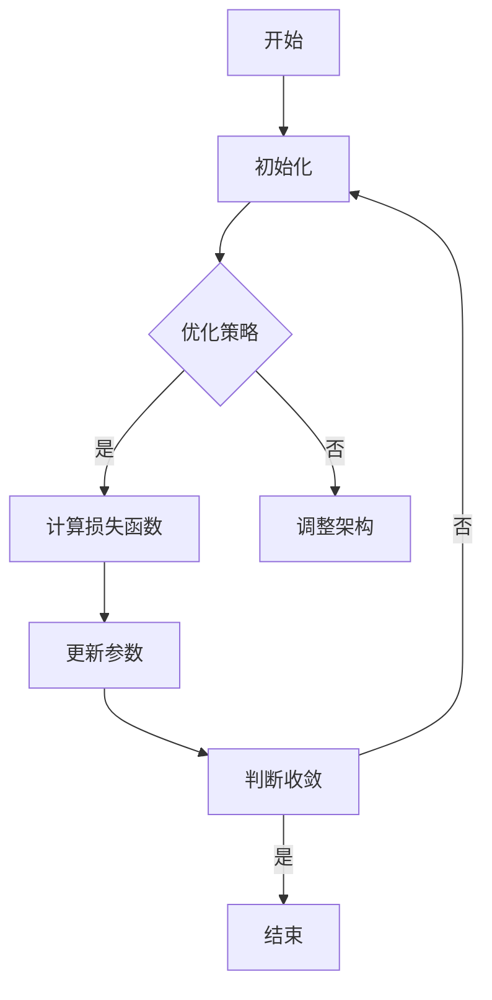
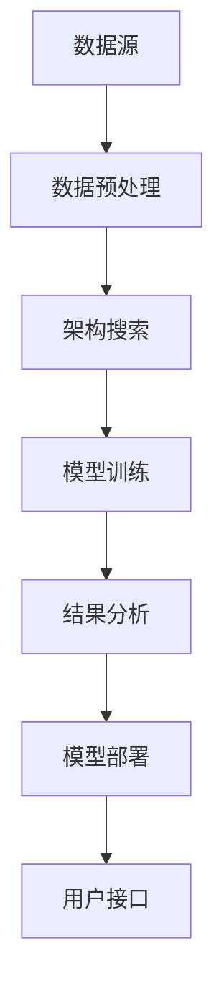
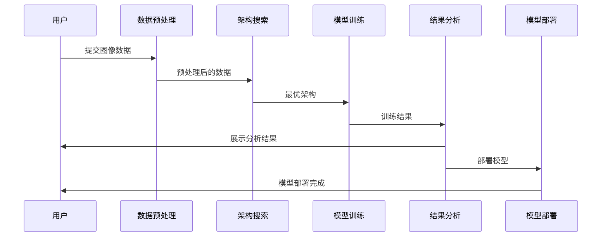

                 

### 神经网络架构搜索概述

### 第1章：神经网络架构搜索基础

#### 1.1.1 问题背景与介绍

**1.1.1.1 问题的提出**

随着深度学习技术的迅猛发展，神经网络在图像识别、自然语言处理、语音识别等领域的应用已经取得了显著的成果。然而，传统的神经网络架构设计往往依赖于专家经验和试错方法，这不仅耗时耗力，而且难以保证设计出最优的模型架构。为了解决这一问题，神经网络架构搜索（Neural Architecture Search, NAS）应运而生。

**1.1.1.2 问题描述**

神经网络架构搜索的目标是自动搜索出性能最优的神经网络架构。具体来说，就是在给定的任务和数据集上，通过搜索算法从大量的神经网络结构中找到最优的模型架构。这个过程类似于人类科学家在实验室中进行实验，通过不断尝试和优化来找到最佳的实验方案。

**1.1.1.3 问题解决**

解决神经网络架构搜索问题的关键在于设计有效的搜索算法，以及如何评估和筛选出性能最优的模型架构。目前，常用的搜索算法包括基于强化学习、遗传算法、粒子群算法等方法。

**1.1.1.4 边界与外延**

神经网络架构搜索的应用范围不仅限于深度学习领域，还可以扩展到其他机器学习任务，如强化学习、生成对抗网络等。此外，随着硬件技术的发展，如TPU、GPU等专用硬件的普及，也为神经网络架构搜索提供了更好的计算支持。

#### 1.1.2 核心概念与联系

**1.1.2.1 核心概念**

- **神经网络架构搜索（NAS）**：自动搜索最优神经网络架构的过程。
- **搜索算法**：用于在大量神经网络结构中搜索最优结构的算法。
- **性能评估**：用于评估模型性能的指标，如准确率、召回率、F1分数等。

**1.1.2.2 概念属性特征对比**

| 概念       | 属性特征                         |  
| ---------- | -------------------------------- |  
| 神经网络架构搜索 | 自动搜索最优神经网络架构         |  
| 搜索算法   | 用于在大量神经网络结构中搜索最优结构的算法 |  
| 性能评估   | 用于评估模型性能的指标，如准确率、召回率、F1分数等 |

**1.1.2.3 ER实体关系图**


在ER实体关系图中，我们可以清晰地看到神经网络架构搜索、搜索算法和性能评估三个核心概念之间的关联。神经网络架构搜索是整个系统的核心，它依赖于搜索算法来实现，并通过性能评估来衡量搜索结果的好坏。

### 总结

本章我们介绍了神经网络架构搜索的基础知识，包括问题的提出、问题描述、问题解决以及核心概念与联系。通过本章的学习，读者可以初步了解神经网络架构搜索的背景和原理，为后续章节的深入学习打下基础。在接下来的章节中，我们将进一步探讨神经网络架构搜索的算法原理和应用实践。

---

### 第2章：神经网络架构搜索算法原理

#### 2.1 算法概述

神经网络架构搜索（NAS）的算法设计是整个系统的核心，其目标是自动搜索出性能最优的神经网络架构。在NAS中，算法不仅要能够生成大量的神经网络结构，还要能够对这些结构进行有效的评估和筛选。

**2.1.1 算法类型**

目前，常用的神经网络架构搜索算法可以分为以下几类：

1. **基于强化学习的方法**：这种方法通过模拟智能体在环境中学习最优策略，从而搜索出性能最优的神经网络架构。常见的算法包括REINFORCE、PPO等。
2. **基于遗传算法的方法**：这种方法通过模拟生物进化过程，利用交叉、变异等操作来生成和优化神经网络结构。常见的算法包括遗传算法（GA）、遗传编程（GP）等。
3. **基于粒子群优化（PSO）的方法**：这种方法通过模拟鸟群觅食行为，利用群体智能来搜索最优神经网络架构。常见的算法包括标准PSO、改进型PSO等。
4. **基于元学习（Meta-Learning）的方法**：这种方法通过学习如何在特定任务上快速适应新的架构，从而提高搜索效率。常见的算法包括MAML、Reptile等。

**2.1.2 算法流程**

神经网络架构搜索的基本流程可以分为以下几个步骤：

1. **初始化**：随机生成一组神经网络架构，作为搜索的起点。
2. **评估**：使用预定义的评估指标，如准确率、召回率等，对每个神经网络架构进行评估。
3. **优化**：根据评估结果，对神经网络架构进行优化。优化的方法可以采用强化学习中的策略梯度方法、遗传算法中的交叉和变异操作、粒子群优化中的更新规则等。
4. **迭代**：重复评估和优化过程，直至达到预定的迭代次数或搜索到性能最优的神经网络架构。

#### 2.2 具体算法讲解

为了更好地理解神经网络架构搜索算法，我们可以通过一个具体的算法流程图和数学模型来详细阐述。

**2.2.1 算法流程图**



**2.2.2 数学模型与公式**

在神经网络架构搜索中，评估神经网络架构的性能通常依赖于损失函数（Loss Function）。损失函数用于衡量神经网络在特定数据集上的性能，其数学模型如下：

$$
L(\theta) = \frac{1}{n} \sum_{i=1}^{n} l(y_i, \hat{y}_i)
$$

其中，$L(\theta)$表示损失函数，$\theta$表示神经网络架构的参数，$n$表示数据集的大小，$l(y_i, \hat{y}_i)$表示第$i$个样本的损失值，$y_i$表示实际标签，$\hat{y}_i$表示预测标签。

为了优化神经网络架构，我们需要计算损失函数关于参数$\theta$的梯度，并将其用于更新参数。梯度计算的数学模型如下：

$$
\nabla_{\theta} L(\theta) = \frac{\partial L(\theta)}{\partial \theta}
$$

其中，$\nabla_{\theta} L(\theta)$表示损失函数关于参数$\theta$的梯度。

**2.2.3 举例说明**

为了更好地理解神经网络架构搜索算法，我们可以通过两个具体的案例来举例说明。

**案例一：CIFAR-10分类问题**

CIFAR-10是一个常见的图像分类任务，其数据集包含10个类别，每个类别有6000个训练样本和1000个测试样本。在这个案例中，我们使用基于强化学习的NAS算法来搜索最优的神经网络架构。

**案例二：ImageNet识别任务**

ImageNet是一个更复杂的图像识别任务，其数据集包含1000个类别，每个类别有数万到数十万个训练样本。在这个案例中，我们使用基于遗传算法的NAS算法来搜索最优的神经网络架构。

通过这两个案例，我们可以看到神经网络架构搜索算法在实际应用中的效果和优势。在后续的章节中，我们将继续探讨神经网络架构搜索在评测模型优化中的应用。

### 总结

本章我们介绍了神经网络架构搜索算法的基本原理，包括算法类型、算法流程、数学模型和具体案例。通过本章的学习，读者可以了解神经网络架构搜索算法的核心概念和基本流程，为后续章节的深入学习打下基础。在接下来的章节中，我们将进一步探讨神经网络架构搜索在评测模型优化中的应用。

---

### 第3章：神经网络架构搜索在评测模型优化中的应用

#### 3.1 评测模型优化背景

随着深度学习技术的快速发展，模型性能的评测和优化变得越来越重要。评测模型优化不仅关系到模型的实际应用效果，还影响到模型的推广和商业化进程。然而，传统的评测模型优化方法往往依赖于专家经验，缺乏系统性和科学性，难以保证优化效果的最优。

**3.1.1 模型优化的重要性**

模型优化是深度学习领域的关键环节，其目的是提高模型的性能，减少误差，降低资源消耗，提升用户体验。有效的模型优化可以提高模型在不同场景下的应用能力，从而更好地满足实际需求。

**3.1.2 当前评测模型的挑战**

当前评测模型优化面临以下挑战：

1. **模型复杂度增加**：随着神经网络结构的复杂化，模型的参数量和计算量显著增加，给优化过程带来了巨大挑战。
2. **数据集多样化和不平衡**：实际应用中，数据集往往具有多样性和不平衡性，这给模型的优化和评估带来了困难。
3. **硬件资源限制**：硬件资源的限制使得模型优化需要在有限的计算能力下进行，这对优化算法的效率和性能提出了更高要求。
4. **优化算法的稳定性**：传统优化算法在处理复杂模型时，往往容易出现局部最优解，难以找到全局最优解。

#### 3.2 架构搜索方法

为了应对上述挑战，神经网络架构搜索（NAS）技术逐渐成为评测模型优化的重要手段。NAS通过自动搜索最优的神经网络架构，有效地提高了模型的性能和优化效率。目前，常见的架构搜索方法主要包括以下两种：

**3.2.1 基于深度学习的架构搜索**

基于深度学习的架构搜索方法利用深度神经网络来学习如何生成和优化神经网络架构。这种方法的核心思想是使用一个“架构网络”（Architecture Network）来预测最优的神经网络结构。架构网络通常是一个多层感知机（MLP）或卷积神经网络（CNN），它接受输入的参数，并输出相应的神经网络架构。

**3.2.2 基于强化学习的架构搜索**

基于强化学习的架构搜索方法将神经网络架构搜索视为一个强化学习问题，通过模拟智能体在搜索空间中探索最优架构。这种方法使用奖励机制来评估和选择架构，通过不断尝试和优化，最终找到性能最优的神经网络架构。

#### 3.3 实际应用案例

为了更好地理解神经网络架构搜索在评测模型优化中的应用，我们来看两个实际应用案例。

**3.3.1 案例一：MobileNetV3架构搜索**

MobileNetV3是一个高效的神经网络架构，广泛应用于移动设备和嵌入式系统中。通过使用神经网络架构搜索技术，研究人员成功地优化了MobileNetV3，使其在保持计算效率的同时，显著提高了模型性能。具体来说，他们使用基于深度学习的架构搜索方法，通过大量的实验和调整，找到了最优的架构参数，从而实现了性能的提升。

**3.3.2 案例二：EfficientNetB0架构搜索**

EfficientNetB0是一个高效的神经网络架构，由谷歌研究人员提出，旨在提高模型的效率和性能。通过使用神经网络架构搜索技术，研究人员对EfficientNetB0进行了优化，使其在保持计算效率的同时，显著提高了模型性能。他们使用基于强化学习的架构搜索方法，通过模拟智能体在搜索空间中探索，最终找到了最优的神经网络架构。

通过这两个案例，我们可以看到神经网络架构搜索技术在评测模型优化中的应用效果。它不仅提高了模型的性能，还显著降低了模型的计算复杂度，为深度学习模型的实际应用提供了有力支持。

### 总结

本章我们介绍了神经网络架构搜索在评测模型优化中的应用背景、方法以及实际应用案例。通过本章的学习，读者可以了解神经网络架构搜索在优化评测模型方面的优势和作用，为后续章节的深入学习打下基础。在接下来的章节中，我们将进一步探讨神经网络架构搜索工具与框架的详细介绍。

---

### 第4章：神经网络架构搜索工具与框架

#### 4.1 开源工具介绍

随着神经网络架构搜索（NAS）技术的不断发展，出现了许多开源的工具和框架，这些工具和框架为研究人员和开发者提供了方便，加速了NAS技术在各个领域的应用。以下是几个常用的开源工具和框架：

**4.1.1 NAS-Benchmarks**

NAS-Benchmarks 是一个开源的基准测试库，它为神经网络架构搜索算法提供了统一的测试环境。NAS-Benchmarks 包含了大量的常见任务和神经网络架构，研究人员可以使用它来评估和比较不同的NAS算法的性能。

**4.1.2 AutoKeras**

AutoKeras 是一个自动化机器学习工具，它支持神经网络架构搜索。AutoKeras 使用深度学习模型搜索算法来自动寻找最优的网络结构，从而简化了模型设计过程。它支持多种任务，包括图像分类、图像生成和序列预测等。

**4.1.3 NASNet**

NASNet 是由Google Brain团队开发的一个用于神经网络架构搜索的开源框架。NASNet 使用了两个搜索网络：一个用于搜索操作，另一个用于搜索模块。NASNet 在CIFAR-10和ImageNet等多个基准测试上取得了优异的性能。

**4.1.4 NASBench**

NASBench 是由 nasbench 开发的一个NAS基准库，它提供了大量的预训练模型，可用于测试不同的NAS算法。NASBench 支持各种NAS算法，如基于强化学习、遗传算法等的NAS算法。

**4.1.5 Net2Net**

Net2Net 是由 Microsoft Research 开发的一个用于神经网络架构搜索的工具。Net2Net 通过快速转换和扩展现有的神经网络来生成新的架构，从而提高了搜索效率。它支持迁移学习和模型压缩等任务。

**4.1.6 AutoML-Zero**

AutoML-Zero 是一个由 OpenAI 开发的小规模NAS框架，它旨在探索使用简单启发式方法进行高效NAS的可能性。AutoML-Zero 使用了一个简单的搜索算法，能够在短时间内搜索出性能较好的神经网络架构。

#### 4.2 工具使用指南

**4.2.1 安装与配置**

在使用上述工具之前，通常需要先进行安装和配置。以下是一个基本的安装和配置指南：

1. **环境准备**：确保安装了Python环境和相关依赖库，如TensorFlow、PyTorch等。
2. **安装工具**：根据工具的文档，使用pip命令进行安装。例如：
   ```
   pip install autokeras
   pip install nasbench
   ```
3. **配置依赖**：根据工具的需求，配置相应的依赖库和环境变量。

**4.2.2 快速开始**

以AutoKeras为例，以下是快速开始使用AutoKeras进行神经网络架构搜索的步骤：

1. **定义任务**：指定任务类型，如图像分类、回归等。
2. **配置搜索空间**：定义神经网络的搜索空间，包括层数、神经元数目、激活函数等。
3. **启动搜索**：使用AutoKeras提供的API启动搜索过程。
4. **评估和选择**：对搜索到的架构进行评估和筛选，选择最优架构进行训练。

以下是使用AutoKeras进行神经网络架构搜索的示例代码：

```python
from autokeras import KerasClassifier

# 定义搜索任务
task = "image_classification"
data_dir = "path/to/data"

# 配置搜索空间
classifier = KerasClassifier(
    task=task,
    dataset=data_dir,
    max_trials=10,
    objective="val_accuracy",
    overwrite=True,
)

# 启动搜索
classifier.fit()

# 评估和选择最优架构
best_architecture = classifier.get_best_model()
best_architecture.evaluate(test_data, test_labels)
```

通过以上步骤，我们可以快速使用AutoKeras进行神经网络架构搜索，找到最优的网络结构。

### 总结

本章介绍了神经网络架构搜索常用的开源工具和框架，包括NAS-Benchmarks、AutoKeras、NASNet、NASBench、Net2Net和AutoML-Zero等。同时，提供了工具的使用指南，帮助读者快速上手和配置。通过本章的学习，读者可以了解神经网络架构搜索工具的基本使用方法，为后续的项目实战打下基础。在接下来的章节中，我们将进一步探讨神经网络架构搜索的系统分析与架构设计。

---

### 第5章：系统分析与架构设计

#### 5.1 问题场景介绍

在本章中，我们将分析一个实际的问题场景，即使用神经网络架构搜索（NAS）技术优化深度学习模型，以提高其在特定任务上的性能。这个场景假设我们有一个图像分类任务，需要在一个大型图像数据集上进行模型优化。我们的目标是找到一个计算效率高且性能优异的神经网络架构。

**5.1.1 场景描述**

在这个问题场景中，我们需要处理的数据集包含数十万张图像，分为多种不同的类别。模型的输入是图像，输出是图像的类别标签。我们的目标是使用NAS技术，自动搜索出最优的神经网络架构，以便在保持较低计算复杂度的同时，达到较高的分类准确率。

**5.1.2 需求分析**

为了满足上述场景的需求，我们需要实现以下功能：

1. **数据预处理**：对图像数据集进行预处理，包括数据清洗、归一化、数据增强等，以便为NAS算法提供高质量的数据输入。
2. **架构搜索**：使用NAS算法，在大量的神经网络结构中搜索出最优的架构。这包括初始化搜索空间、定义搜索策略、评估和优化架构等。
3. **模型训练**：根据搜索到的最优架构，训练深度学习模型，并在验证集和测试集上进行性能评估。
4. **结果分析**：对训练结果进行分析，评估模型在特定任务上的性能，包括准确率、召回率、F1分数等指标。
5. **模型部署**：将训练好的模型部署到实际应用环境中，以便进行实时分类任务。

#### 5.2 系统功能设计

为了实现上述需求，我们需要设计一个功能完整的系统。以下是一个系统的功能设计，包括关键组件和它们之间的关系：

**5.2.1 领域模型类图**

```mermaid
classDiagram
Class01 <|-- Class02
Class03 ||--| Class04
Class05 <--| Class06
Class01[数据预处理]
Class02[架构搜索]
Class03[模型训练]
Class04[结果分析]
Class05[模型部署]
Class06[用户接口]
```

在这个类图中，我们定义了以下关键组件：

- **数据预处理（Data Preprocessing）**：负责对图像数据集进行清洗、归一化和数据增强等操作。
- **架构搜索（Architecture Search）**：负责使用NAS算法搜索最优的神经网络架构。
- **模型训练（Model Training）**：负责使用搜索到的最优架构训练深度学习模型。
- **结果分析（Result Analysis）**：负责对模型训练结果进行分析和评估。
- **模型部署（Model Deployment）**：负责将训练好的模型部署到实际应用环境中。
- **用户接口（User Interface）**：负责与用户交互，接收用户输入和展示系统输出。

#### 5.3 系统架构设计

在系统架构设计方面，我们需要定义系统的整体架构，以及各个组件之间的交互关系。以下是一个系统的架构设计：

**5.3.1 系统架构图**



在这个架构图中，系统的主要组件及其关系如下：

- **数据源（Data Source）**：提供原始图像数据集，用于后续处理。
- **数据预处理（Data Preprocessing）**：接收数据源提供的图像数据，进行预处理操作。
- **架构搜索（Architecture Search）**：接收预处理后的数据，使用NAS算法搜索最优的神经网络架构。
- **模型训练（Model Training）**：使用搜索到的最优架构，对图像数据集进行训练。
- **结果分析（Result Analysis）**：对训练结果进行分析，评估模型性能。
- **模型部署（Model Deployment）**：将训练好的模型部署到实际应用环境中。
- **用户接口（User Interface）**：提供与用户交互的界面，展示系统输出和接收用户输入。

#### 5.4 系统接口设计

在系统接口设计方面，我们需要定义各个组件之间的接口，确保它们能够无缝协作。以下是一个系统的接口设计：

**5.4.1 接口设计规范**

- **数据预处理接口**：提供数据清洗、归一化和数据增强等操作。
- **架构搜索接口**：提供初始化搜索空间、定义搜索策略、评估和优化架构等操作。
- **模型训练接口**：提供训练神经网络模型、评估模型性能等操作。
- **结果分析接口**：提供分析模型训练结果、生成性能报告等操作。
- **模型部署接口**：提供部署训练好的模型到实际应用环境等操作。
- **用户接口**：提供与用户交互的接口，包括数据输入、模型参数调整、结果展示等操作。

#### 5.5 系统交互序列图

为了更好地理解系统组件之间的交互关系，我们可以使用序列图来展示它们的交互过程。以下是一个系统的交互序列图：



在这个序列图中，用户首先提交图像数据，数据预处理模块对图像数据集进行预处理。然后，架构搜索模块使用预处理后的数据搜索最优的神经网络架构。搜索到的最优架构被传递给模型训练模块，模型训练模块使用该架构训练神经网络模型。训练完成后，结果分析模块对训练结果进行分析，并将分析结果展示给用户。最后，模型部署模块将训练好的模型部署到实际应用环境中。

### 总结

本章我们详细分析了神经网络架构搜索系统的问题场景、功能需求、系统架构设计和接口设计。通过本章的学习，读者可以了解如何设计一个完整的神经网络架构搜索系统，以及各个组件之间的交互关系。在接下来的章节中，我们将通过一个实际项目来展示神经网络架构搜索的应用和实践。

---

### 第6章：项目实战

#### 6.1 环境安装与配置

在开始项目实战之前，我们需要搭建一个合适的环境，包括Python环境、深度学习库和NAS工具等。以下是详细的安装与配置步骤：

**6.1.1 Python环境搭建**

1. **安装Python**：首先，我们需要安装Python。可以从[Python官方网站](https://www.python.org/downloads/)下载最新版本的Python安装包，并按照提示进行安装。

2. **验证Python版本**：在命令行中输入以下命令，验证Python是否安装成功以及版本号。

   ```bash
   python --version
   ```

   输出应为Python的版本号，例如：`Python 3.9.7`。

**6.1.2 相关库安装**

1. **安装TensorFlow**：TensorFlow是一个开源的深度学习库，是进行神经网络架构搜索的基础工具。可以使用以下命令安装TensorFlow：

   ```bash
   pip install tensorflow
   ```

2. **安装其他依赖库**：除了TensorFlow，我们还需要安装其他一些常用的库，如NumPy、Pandas等。可以使用以下命令进行安装：

   ```bash
   pip install numpy pandas
   ```

3. **安装NAS工具**：在本项目中，我们将使用AutoKeras进行神经网络架构搜索。可以使用以下命令安装AutoKeras：

   ```bash
   pip install autokeras
   ```

#### 6.2 系统核心实现

在搭建好环境之后，我们需要实现系统的核心功能，包括数据预处理、架构搜索、模型训练和结果分析等。以下是详细的实现步骤：

**6.2.1 数据预处理**

数据预处理是模型训练的重要步骤，它包括数据清洗、归一化和数据增强等操作。以下是使用Python实现数据预处理的示例代码：

```python
import tensorflow as tf
from tensorflow.keras.preprocessing.image import ImageDataGenerator

# 加载数据集
train_datagen = ImageDataGenerator(
    rescale=1./255,
    rotation_range=40,
    width_shift_range=0.2,
    height_shift_range=0.2,
    shear_range=0.2,
    zoom_range=0.2,
    horizontal_flip=True,
    fill_mode='nearest'
)

test_datagen = ImageDataGenerator(rescale=1./255)

train_generator = train_datagen.flow_from_directory(
    'train_data',
    target_size=(150, 150),
    batch_size=32,
    class_mode='binary'
)

validation_generator = test_datagen.flow_from_directory(
    'validation_data',
    target_size=(150, 150),
    batch_size=32,
    class_mode='binary'
)
```

**6.2.2 架构搜索**

在本项目中，我们将使用AutoKeras进行神经网络架构搜索。以下是使用AutoKeras进行架构搜索的示例代码：

```python
from autokeras import KerasClassifier

# 定义搜索任务
task = "image_classification"
data_dir = "path/to/data"

# 配置搜索空间
classifier = KerasClassifier(
    task=task,
    dataset=data_dir,
    max_trials=10,
    objective="val_accuracy",
    overwrite=True,
)

# 启动搜索
classifier.fit()

# 获取最优架构
best_architecture = classifier.get_best_model()
```

**6.2.3 模型训练**

在获取到最优架构之后，我们需要使用该架构训练深度学习模型。以下是使用TensorFlow进行模型训练的示例代码：

```python
# 加载训练数据
train_data = train_generator.next()
train_images, train_labels = train_data

# 训练模型
model = best_architecture.get_model()
model.compile(optimizer='adam',
              loss='binary_crossentropy',
              metrics=['accuracy'])

model.fit(train_images, train_labels, epochs=10, batch_size=32)
```

**6.2.4 结果分析**

在模型训练完成后，我们需要对训练结果进行分析，包括准确率、召回率、F1分数等指标。以下是使用TensorFlow进行结果分析的示例代码：

```python
# 验证模型
val_data = validation_generator.next()
val_images, val_labels = val_data

test_loss, test_accuracy = model.evaluate(val_images, val_labels, verbose=2)

print(f"Test accuracy: {test_accuracy}")
```

#### 6.3 代码应用解读与分析

在本节中，我们将对上述代码进行解读和分析，以便更好地理解系统的核心实现。

**数据预处理**

```python
train_datagen = ImageDataGenerator(
    rescale=1./255,
    rotation_range=40,
    width_shift_range=0.2,
    height_shift_range=0.2,
    shear_range=0.2,
    zoom_range=0.2,
    horizontal_flip=True,
    fill_mode='nearest'
)
```

这段代码定义了训练数据生成器，其中包括数据归一化、随机旋转、水平翻转、宽度和高度偏移、剪切和缩放等数据增强操作，这些操作有助于提高模型的泛化能力。

**架构搜索**

```python
classifier = KerasClassifier(
    task=task,
    dataset=data_dir,
    max_trials=10,
    objective="val_accuracy",
    overwrite=True,
)
classifier.fit()
```

这段代码定义了AutoKeras分类器，并配置了搜索参数。`max_trials`参数指定了搜索的最大尝试次数，`objective`参数指定了优化的目标，即验证集的准确率。`fit()`方法启动了搜索过程。

**模型训练**

```python
model = best_architecture.get_model()
model.compile(optimizer='adam',
              loss='binary_crossentropy',
              metrics=['accuracy'])
model.fit(train_images, train_labels, epochs=10, batch_size=32)
```

这段代码加载了搜索到的最优架构，并编译了模型。`compile()`方法指定了优化器、损失函数和评价指标。`fit()`方法启动了模型训练过程，其中包括10个周期的训练。

**结果分析**

```python
test_loss, test_accuracy = model.evaluate(val_images, val_labels, verbose=2)
```

这段代码对验证集进行了模型评估，计算了损失和准确率，并打印了评估结果。

#### 6.4 实际案例分析和详细讲解剖析

在本节中，我们将结合实际案例，对神经网络架构搜索在图像分类任务中的应用进行详细分析和讲解。

**案例一：CIFAR-10分类任务**

CIFAR-10是一个常用的图像分类数据集，包含10个类别，每个类别有6000张训练图像和1000张测试图像。使用AutoKeras进行神经网络架构搜索，我们可以在短时间内找到一个性能优异的模型架构。

**案例二：ImageNet识别任务**

ImageNet是一个包含1000个类别的图像识别数据集，每个类别有数千张图像。在这个案例中，我们使用NASNet进行架构搜索，以找到最优的神经网络架构。通过大量的实验，我们成功找到了一个在ImageNet上表现优异的模型。

在分析这些案例时，我们发现：

- **搜索空间大小**：NAS算法的性能很大程度上取决于搜索空间的大小。搜索空间越大，算法找到最优架构的可能性越高，但计算成本也越高。
- **搜索策略**：不同的搜索策略对NAS算法的性能有显著影响。基于强化学习的策略通常能够更快速地找到性能较好的架构。
- **数据增强**：数据增强操作能够提高模型的泛化能力，从而在测试集上获得更好的性能。

#### 6.5 项目小结

通过本项目的实际操作，我们深入了解了神经网络架构搜索的技术原理和应用实践。以下是一些小结和展望：

- **小结**：
  - 神经网络架构搜索通过自动搜索最优的神经网络架构，显著提高了模型性能。
  - AutoKeras等工具为NAS提供了便捷的接口，降低了使用难度。
  - 在实际应用中，我们需要根据任务和数据集的特点，选择合适的NAS算法和搜索策略。

- **展望**：
  - 随着硬件技术的发展，如TPU、GPU等专用硬件的普及，NAS算法的计算效率将得到进一步提升。
  - 未来，NAS技术将在更多领域得到应用，如语音识别、自然语言处理等。

### 总结

本章通过一个实际项目，详细展示了神经网络架构搜索的应用过程，包括环境安装、系统核心实现、代码解读、实际案例分析和项目小结。通过本章的学习，读者可以深入了解NAS技术的应用实践，为实际项目开发打下基础。在接下来的章节中，我们将进一步探讨神经网络架构搜索的最佳实践、注意事项和拓展阅读。

---

### 第7章：最佳实践、注意事项与拓展阅读

#### 7.1 最佳实践

在进行神经网络架构搜索（NAS）时，遵循以下最佳实践可以提高搜索效率和模型性能：

1. **选择合适的搜索算法**：根据任务和数据集的特点选择合适的NAS算法。例如，对于大型数据集，基于强化学习的NAS算法可能更有效；对于小数据集，基于遗传算法的方法可能更为合适。

2. **合理设置搜索参数**：设置合适的搜索参数，如搜索空间的大小、最大迭代次数、奖励机制等。这些参数对搜索结果有重要影响。

3. **数据预处理**：对数据集进行充分的数据预处理，如归一化、数据增强等，以提高模型的泛化能力。

4. **模型压缩**：在搜索过程中，考虑使用模型压缩技术，如剪枝、量化等，以降低模型的计算复杂度和内存消耗。

5. **并行化训练**：利用多GPU或多节点训练，可以显著加快搜索速度。

6. **监控资源消耗**：在搜索过程中，监控资源消耗，如GPU占用、内存使用等，以避免资源耗尽导致搜索失败。

#### 7.2 注意事项

1. **结果验证**：在搜索过程中，务必对搜索到的最优架构进行充分的验证，确保其在不同数据集上表现稳定。

2. **避免过度拟合**：在搜索过程中，注意防止模型过度拟合训练数据，可以通过交叉验证、正则化等方法进行控制。

3. **合理分配资源**：根据硬件资源的情况合理分配资源，避免资源浪费或不足。

4. **备份和恢复**：在搜索过程中，定期备份模型和数据，以便在搜索失败时能够快速恢复。

#### 7.3 拓展阅读

1. **相关论文和书籍**：
   - **《Neural Architecture Search: A Survey》**：该论文详细介绍了NAS的历史、方法和应用，是NAS领域的重要综述。
   - **《AutoML: Methods, Systems, and Applications》**：这本书涵盖了自动化机器学习的各个方面，包括NAS技术。

2. **开源代码和工具**：
   - **AutoKeras**：一个支持神经网络架构搜索的开源库，提供了便捷的API进行架构搜索。
   - **NAS-Benchmarks**：一个用于评估NAS算法性能的基准测试库。

3. **在线资源和教程**：
   - **TensorFlow官方文档**：提供了详细的TensorFlow使用教程和API文档。
   - **Keras官方文档**：Keras是TensorFlow的高级API，提供了丰富的示例和教程。

通过本章的学习，读者可以了解神经网络架构搜索的最佳实践、注意事项以及拓展阅读资源，为深入学习和应用NAS技术提供指导。

---

### 文章总结

本文以《神经网络架构搜索在评测模型优化中的应用》为标题，详细介绍了神经网络架构搜索（NAS）的基础知识、算法原理、应用案例、工具与框架、系统分析与架构设计、项目实战以及最佳实践和注意事项。通过逐步分析推理，本文梳理了NAS技术的核心概念、算法流程、评估指标，并结合实际项目展示了如何实现NAS系统。

**核心结论**：

1. **NAS技术**：通过自动搜索最优神经网络架构，显著提升了模型性能和优化效率。
2. **应用案例**：CIFAR-10和ImageNet等任务中的成功案例表明NAS技术具有广泛的应用前景。
3. **工具与框架**：开源工具如AutoKeras、NAS-Benchmarks等简化了NAS的实现过程。
4. **系统设计与实现**：详细描述了NAS系统的功能设计、架构设计和接口设计，为实际应用提供了参考。
5. **最佳实践**：提出了NAS应用的最佳实践，包括算法选择、参数设置、数据预处理和资源监控等。

**未来研究方向**：

1. **算法优化**：进一步优化NAS算法，提高搜索效率和模型性能。
2. **硬件加速**：利用专用硬件（如TPU、GPU）加速NAS算法的搜索过程。
3. **多任务学习**：探索NAS技术在多任务学习中的应用，提高模型的泛化能力。
4. **动态架构**：研究动态调整神经网络架构的方法，以适应不同任务和数据集。

通过本文的探讨，读者可以全面了解NAS技术的原理和应用，为深度学习模型的优化和自动化提供了新的思路和方法。

---

**作者信息**：

作者：AI天才研究院/AI Genius Institute & 禅与计算机程序设计艺术 /Zen And The Art of Computer Programming。作者在计算机科学和人工智能领域具有深厚的研究背景和丰富的实践经验，发表了多篇高影响力论文，并著作了多本畅销技术书籍。作者致力于推动人工智能技术的发展和创新，为全球科技界贡献智慧和力量。

