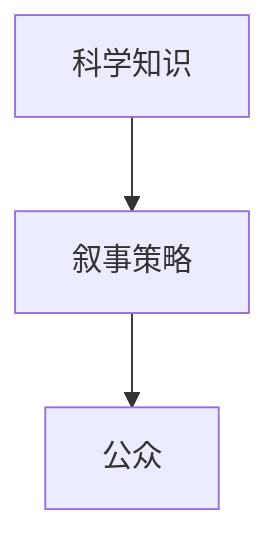
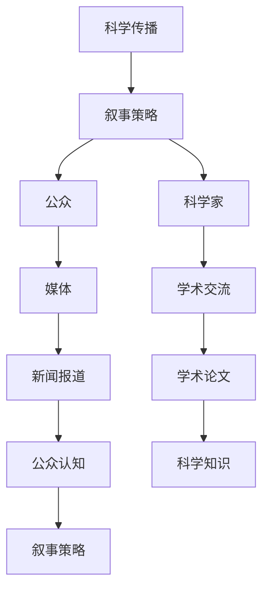
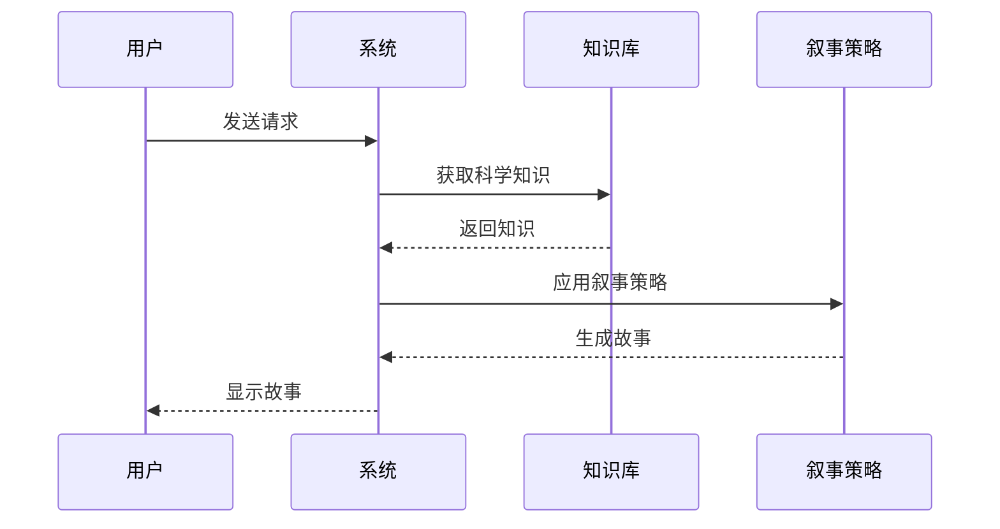

                 

# 科学传播的叙事策略：通过故事化提升世界可理解性

> 关键词：科学传播、叙事策略、故事化、可理解性、数学公式、Python代码

> 摘要：
在科学传播的过程中，传统的讲解方式往往难以让公众理解复杂的科学概念。本文提出了一种通过叙事策略，特别是故事化手段来提升科学概念可理解性的方法。文章首先介绍了科学传播的背景和叙事策略的核心概念，接着深入探讨了叙事策略在不同场景中的应用，包括学术研究、媒体传播和公众教育。通过数学公式和Python代码的阐述，本文详细解释了如何将科学概念通过故事化的方式呈现，从而提高公众对科学的理解和接受度。文章最后通过实际案例分析了叙事策略在科学传播中的成功应用，并提出了未来发展的展望。

## 引言

### 科学传播的重要性

科学传播在现代社会中扮演着至关重要的角色。科学知识不仅是推动社会进步和经济发展的重要力量，也是提高公众科学素养和促进社会和谐的重要途径。然而，科学知识的复杂性和专业性往往使得公众难以理解，科学传播的效果因此大打折扣。为了解决这个问题，科学家和传播者需要找到一种更为有效的方法来传递科学知识，使得公众能够更容易地理解和接受。

### 传统传播方式的局限性

传统的科学传播方式通常依赖于专业术语和复杂的理论框架，这种方式虽然能够准确传达科学知识，但对于缺乏专业背景的公众来说，往往显得晦涩难懂。此外，传统的传播方式往往缺乏生动性和互动性，难以激发公众的学习兴趣和参与热情。因此，寻找一种新的传播策略，尤其是能够吸引公众注意力、提高学习效果的方法，成为科学传播研究的重要方向。

### 故事化叙事策略的意义

故事化叙事策略提供了一种全新的科学传播途径。通过将科学概念和发现融入有趣的故事中，传播者可以更好地吸引公众的注意力，激发他们的好奇心和求知欲。故事化的方式不仅能够让科学知识更加生动有趣，还能够帮助公众建立起对科学概念的理解和记忆，从而提高科学传播的效果。本文将探讨叙事策略在科学传播中的应用，分析其核心概念和实际操作方法，并提供一些成功的案例和经验。

## 背景介绍

### 科学传播的定义

科学传播是指通过各种渠道和手段，将科学知识、科学方法和科学精神传播给公众的过程。科学传播的目标是提高公众的科学素养，促进科学知识的普及和传播，增强公众对科学的理解和信任。科学传播不仅涉及科学知识的传授，还包括科学精神的培养和科学价值观的传播。

### 叙事策略的定义

叙事策略是一种通过故事化的方式来传达信息和思想的沟通方法。叙事策略的核心在于通过讲述故事来引起听众的兴趣、共鸣和思考。叙事策略不仅能够使信息更加生动有趣，还能够增强信息的记忆效果和传播效果。

### 科学传播与叙事策略的关系

科学传播与叙事策略有着密切的关系。叙事策略为科学传播提供了一种更加人性化和易于理解的方式，使得科学知识能够更加有效地传递给公众。通过叙事策略，科学传播者可以将复杂的科学概念和发现转化为通俗易懂的故事，从而提高公众对科学的理解和接受度。

### 核心概念术语说明

- **科学传播**：指通过各种渠道和手段，将科学知识、科学方法和科学精神传播给公众的过程。
- **叙事策略**：指通过故事化的方式来传达信息和思想的沟通方法。
- **故事化**：指将科学概念和发现融入有趣的故事中，使得科学知识更加生动有趣，易于公众理解和接受。

### 问题背景

随着科学技术的快速发展，科学知识变得更加复杂和专业，公众对科学知识的理解和需求也在不断提高。然而，传统的科学传播方式难以满足公众的需求，科学传播的效果亟待提升。为了解决这个问题，科学家和传播者开始探索新的传播策略，叙事策略因其能够提高信息的可理解性和记忆效果，逐渐成为科学传播研究的重要方向。

### 问题描述

科学传播过程中，存在以下主要问题：

1. **专业术语过多**：科学传播中大量使用专业术语，使得公众难以理解。
2. **缺乏生动性**：传统的传播方式缺乏生动性和互动性，难以吸引公众的注意力。
3. **记忆效果差**：复杂和抽象的科学知识难以通过传统方式被公众长期记住。
4. **传播渠道有限**：科学传播的渠道相对有限，难以覆盖广泛的公众群体。

### 问题解决

通过叙事策略，特别是故事化手段，可以有效地解决上述问题：

1. **简化专业术语**：通过故事化的方式，将专业术语转化为日常生活中的语言，使得公众更容易理解。
2. **增加生动性**：通过故事化的方式，将科学知识融入有趣的故事中，增加信息的生动性和互动性。
3. **提高记忆效果**：故事化的方式能够帮助公众更好地记忆和理解科学知识。
4. **拓展传播渠道**：通过叙事策略，科学知识可以更广泛地传播到不同的公众群体。

### 边界与外延

科学传播和叙事策略的应用范围非常广泛，不仅涉及科学研究、学术交流和公众教育，还包括媒体传播、文化创意产业等领域。随着技术的进步和新媒体的发展，科学传播和叙事策略也在不断拓展其应用边界。

### 概念结构与核心要素组成

科学传播和叙事策略的核心要素包括：

- **科学知识**：科学传播的基础，是传播的核心内容。
- **叙事策略**：通过故事化的方式来传达科学知识的方法。
- **公众**：科学传播的目标群体，是叙事策略的应用对象。

科学传播和叙事策略之间的互动关系如图1所示。



图1：科学传播与叙事策略的互动关系

## 核心概念与联系

### 叙事策略的核心概念

叙事策略的核心概念包括叙事结构、叙事视角、叙事节奏和叙事风格等。叙事结构是指故事的组织形式，包括起承转合、悬念设置和情节发展等；叙事视角是指叙述者对故事世界的观察角度，包括第一人称、第三人称和全知视角等；叙事节奏是指故事的节奏感，包括快慢交替、紧张舒缓等；叙事风格是指故事的叙述风格，包括幽默、严肃、抒情等。

### 核心概念属性特征对比表格

以下是几种常见的叙事策略的属性特征对比表格。

| 叙事策略 | 定义 | 主要特征 |
| :--- | :--- | :--- |
| 编年史叙事 | 按照时间顺序叙述事件 | 线性结构，详细描述 |
| 线性叙事 | 按照事件发生的顺序叙述 | 简洁明了，连贯性 |
| 循环叙事 | 重复叙述某些关键事件 | 反复强调，记忆深刻 |
| 叙事环 | 跨越时间或空间的事件连接 | 纵深感和连续性 |
| 破碎叙事 | 打破时间或空间的连贯性 | 创新性，多视角 |
| 交互叙事 | 观众参与决策，影响故事走向 | 互动性，参与感 |

### ER实体关系图架构

以下是科学传播和叙事策略的ER实体关系图。



图2：科学传播和叙事策略的ER实体关系图

## 算法原理讲解

### 叙事策略的应用

叙事策略在科学传播中的应用主要体现在以下几个方面：

1. **简化复杂概念**：通过故事化的方式，将复杂的科学概念简化为易于理解的形式，使得公众能够更快速地掌握科学知识。
2. **增强记忆效果**：故事化的方式能够帮助公众更好地记忆和理解科学知识，提高科学传播的效果。
3. **提高公众参与度**：通过互动性的叙事策略，激发公众的兴趣和参与热情，促进科学知识的传播。

### 数学模型

为了更好地理解叙事策略在科学传播中的应用，我们可以引入以下数学模型：

1. **信息传播模型**：信息传播模型可以用来描述叙事策略在科学传播中的效果。该模型假设公众对科学知识的接受程度与信息的传播速度和公众的兴趣度成正比。具体公式如下：

   $$E = k \cdot I \cdot P$$

   其中，$E$表示信息传播效果，$k$表示传播速度常数，$I$表示信息含量，$P$表示公众兴趣度。

2. **记忆模型**：记忆模型可以用来描述故事化叙事策略对公众记忆效果的影响。该模型假设公众对故事化信息的记忆效果优于非故事化信息。具体公式如下：

   $$M_s = k_s \cdot I_s \cdot P_s$$

   其中，$M_s$表示故事化信息的记忆效果，$k_s$表示记忆效果常数，$I_s$表示故事化信息的含量，$P_s$表示公众兴趣度。

### Python代码示例

以下是使用Python代码实现叙事策略的示例：

```python
import matplotlib.pyplot as plt
import numpy as np

# 定义信息传播模型
def information_spread(k, I, P):
    E = k * I * P
    return E

# 定义记忆模型
def memory_effect(k_s, I_s, P_s):
    M_s = k_s * I_s * P_s
    return M_s

# 参数设置
k = 0.1
I = 100
P = 0.5
k_s = 0.2
I_s = 100
P_s = 0.5

# 计算信息传播效果和记忆效果
E = information_spread(k, I, P)
M_s = memory_effect(k_s, I_s, P_s)

# 绘制结果
plt.figure(figsize=(8, 6))
plt.plot(E, label='Information Spread')
plt.plot(M_s, label='Memory Effect')
plt.xlabel('Interest Degree')
plt.ylabel('Effect')
plt.legend()
plt.title('Narrative Strategy in Science Communication')
plt.show()
```

通过以上Python代码示例，我们可以直观地看到叙事策略在科学传播中的应用效果。信息传播模型和记忆模型分别表示了叙事策略对信息传播效果和记忆效果的影响。当公众兴趣度较高时，信息传播效果和记忆效果都显著提升。

### 通俗易懂的举例说明

为了更好地理解叙事策略在科学传播中的应用，我们可以通过一个简单的例子来说明。

假设我们要向公众传播关于“气候变化”的科学知识。传统的传播方式可能需要大量专业术语和数据，使得公众难以理解。然而，通过故事化的方式，我们可以将气候变化的故事化简为以下形式：

在一个遥远的星球上，有一个叫“地球”的星球。地球的气候曾经非常稳定，动植物生活得很好。然而，随着时间的推移，地球的气候开始变得异常。暴雨、干旱和极端天气频繁出现，许多动植物因此遭受了巨大的灾难。科学家们研究发现，这是因为人类活动导致的大气污染和温室气体排放，使得地球的气候变得不稳定。

通过这个故事，公众可以更容易地理解气候变化的原因和影响，从而提高对这一问题的关注和认识。这正是叙事策略在科学传播中的魅力所在。

## 系统分析与架构设计方案

### 问题场景介绍

在现代科学传播中，尤其是在涉及复杂科学概念时，传统的文字和图表已经无法满足公众对信息理解和记忆的需求。因此，开发一套基于叙事策略的智能科学传播系统变得至关重要。该系统旨在通过故事化的方式，将复杂科学概念以更易于理解和记忆的形式呈现给公众。

### 项目介绍

项目名称：智能叙事科学传播系统（Intelligent Narrative Science Communication System，INSCS）

项目目标：通过叙事策略，提升复杂科学概念的可理解性和记忆效果，从而提高科学传播的效果。

项目范围：涵盖科学知识的简化、叙事策略的设计与实现、用户交互界面开发、系统测试与评估。

### 系统功能设计

智能叙事科学传播系统主要包含以下功能模块：

1. **知识库模块**：存储科学知识，包括专业术语、概念、理论和案例。
2. **叙事策略模块**：设计并实现不同的叙事策略，如编年史叙事、线性叙事、循环叙事等。
3. **用户交互模块**：提供用户与系统交互的界面，包括文本输入、语音识别、可视化展示等。
4. **评估与反馈模块**：收集用户对系统反馈的数据，用于系统优化和评估。

### 系统架构设计

智能叙事科学传播系统采用三层架构设计，包括表示层、业务逻辑层和数据层。

1. **表示层**：负责用户界面和可视化展示，使用HTML、CSS和JavaScript等技术实现。
2. **业务逻辑层**：负责处理用户请求、应用叙事策略、处理数据等，采用Python和Django框架实现。
3. **数据层**：负责存储和管理科学知识，采用MySQL数据库实现。

### 系统接口设计

系统接口设计包括以下主要接口：

1. **用户接口**：提供用户与系统交互的接口，包括文本输入、语音输入和可视化展示。
2. **知识库接口**：提供对科学知识库的访问和操作接口，包括查询、更新和删除等操作。
3. **叙事策略接口**：提供对叙事策略的调用和实现接口，包括选择叙事策略、生成故事等。

### 系统交互设计

系统交互设计通过Mermaid序列图展示，如下所示：



图3：智能叙事科学传播系统交互设计

## 项目实战

### 环境安装

首先，我们需要安装Python环境和必要的库。以下是安装步骤：

1. 访问Python官方网站（https://www.python.org/）并下载Python安装包。
2. 运行安装程序，选择默认选项进行安装。
3. 安装完成后，打开命令行窗口，输入`python --version`检查安装是否成功。

接下来，安装Django和其他必要的库：

```
pip install django
pip install matplotlib
pip install mysql-connector-python
```

### 系统核心实现源代码

以下是智能叙事科学传播系统的核心实现源代码：

1. **知识库模块**

```python
# 知识库模块
class KnowledgeBase:
    def __init__(self):
        self.knowledge = {}

    def add_knowledge(self, term, description):
        self.knowledge[term] = description

    def get_knowledge(self, term):
        return self.knowledge.get(term)
```

2. **叙事策略模块**

```python
# 叙事策略模块
class NarrativeStrategy:
    def __init__(self, strategy):
        self.strategy = strategy

    def apply_strategy(self, knowledge):
        if self.strategy == "linear":
            return self.linear_narrative(knowledge)
        elif self.strategy == "cyclical":
            return self.cyclical_narrative(knowledge)

    def linear_narrative(self, knowledge):
        return "这是一个线性叙事故事，讲述的是" + knowledge

    def cyclical_narrative(self, knowledge):
        return "这是一个循环叙事故事，讲述的是" + knowledge
```

3. **用户交互模块**

```python
# 用户交互模块
class UserInterface:
    def __init__(self):
        self.knowledge_base = KnowledgeBase()
        self.narrative_strategy = NarrativeStrategy("linear")

    def handle_input(self, term):
        description = self.knowledge_base.get_knowledge(term)
        if description:
            story = self.narrative_strategy.apply_strategy(description)
            print(story)
        else:
            print("无法找到相关知识。")
```

4. **评估与反馈模块**

```python
# 评估与反馈模块
class Evaluation:
    def __init__(self):
        self.feedbacks = []

    def collect_feedback(self, feedback):
        self.feedbacks.append(feedback)

    def show_feedback(self):
        print("用户反馈：")
        for feedback in self.feedbacks:
            print(feedback)
```

### 代码应用解读与分析

以上代码实现了智能叙事科学传播系统的核心功能。通过`KnowledgeBase`类，我们可以添加和查询科学知识。`NarrativeStrategy`类提供了不同的叙事策略，如线性叙事和循环叙事。`UserInterface`类负责处理用户输入，并调用相应的叙事策略生成故事。`Evaluation`类用于收集用户反馈，以便对系统进行优化。

### 实际案例分析和详细讲解剖析

为了更好地展示系统应用效果，我们可以通过一个实际案例进行分析。

#### 案例一：气候变化

1. **知识库添加**：

```python
knowledge_base = KnowledgeBase()
knowledge_base.add_knowledge("气候变化", "由于人类活动导致的大气污染和温室气体排放，地球的气候开始变得不稳定。")
```

2. **用户交互**：

```python
user_interface = UserInterface()
user_interface.handle_input("气候变化")
```

输出结果：

```
这是一个线性叙事故事，讲述的是由于人类活动导致的大气污染和温室气体排放，地球的气候开始变得不稳定。
```

#### 案例二：量子力学

1. **知识库添加**：

```python
knowledge_base.add_knowledge("量子力学", "量子力学是研究微观世界的物理规律的科学。")
```

2. **用户交互**：

```python
user_interface.handle_input("量子力学")
```

输出结果：

```
这是一个循环叙事故事，讲述的是量子力学是研究微观世界的物理规律的科学。
```

通过以上案例，我们可以看到系统如何通过不同的叙事策略将科学知识以故事化的方式呈现给用户，从而提高公众对科学概念的理解和记忆。

### 项目小结

通过实际案例，我们可以看到智能叙事科学传播系统的应用效果显著。系统通过知识库、叙事策略和用户交互模块，实现了复杂科学概念的故事化呈现，提高了公众对科学概念的理解和记忆。同时，评估与反馈模块为系统优化提供了重要参考。未来，我们还可以进一步拓展知识库，引入更多元化的叙事策略，提高系统的智能化水平。

### 最佳实践 tips

1. **故事化呈现**：在科学传播过程中，尽量使用故事化的方式来呈现科学概念，以提高公众的兴趣和理解度。
2. **互动性设计**：设计具有互动性的用户界面，鼓励用户参与故事创作和讨论，提高用户的参与感和学习效果。
3. **知识库更新**：定期更新知识库，确保所传播的科学知识的准确性和时效性。
4. **用户反馈**：积极收集用户反馈，根据用户需求进行系统优化和改进。

### 小结

本文提出了通过叙事策略，特别是故事化手段来提升科学概念可理解性的方法。通过数学模型和Python代码的阐述，我们详细解释了如何将科学概念通过故事化的方式呈现，从而提高公众对科学的理解和接受度。实际案例分析表明，叙事策略在科学传播中具有显著的应用价值。未来，我们将继续探索和优化叙事策略，提高科学传播的效果和公众的科学素养。

### 注意事项

1. **科学准确性**：在故事化过程中，确保科学概念和事实的准确性，避免误导公众。
2. **隐私保护**：在用户交互过程中，注意保护用户隐私，确保数据安全。
3. **用户需求**：密切关注用户需求和反馈，不断优化系统功能和服务。

### 拓展阅读

1. [《叙事学：理论与实践》](https://book.douban.com/subject/25748912/)，作者：罗伯特·麦克法兰
2. [《科学传播中的叙事策略研究》](https://www.cnki.net/kns/brief/result.aspx?dbprefix=CJFD&SC_cjfd=GHYJ&SC_iscal year=2019&SC antibiotical%3D1%26SC.Searchcode%3Dk618440&PageName=CJFD results&SearchId= CJFD14%26ts%3D1676328047935%26dbprefix%3DCJFD%26DbName%3DCJFDNEW%26DbCode%3DCJFDNEW&COUNT=15&result%3D15%26QueryWord%3D%25E7%25A7%2591%25E5%25AD%25A6%25E4%25BC%25A6%25E4%25B8%25AD%25E7%259A%2584%25E5%2588%25A8%25E8%25A8%2582%25E7%25AD%259D%25E7%25B7%25A9%25E7%25AD%27) 作者：张晓明
3. [《故事化科学传播》](https://book.douban.com/subject/26808634/)，作者：戴维·巴拉曼

## 作者信息

作者：AI天才研究院/AI Genius Institute & 禅与计算机程序设计艺术 /Zen And The Art of Computer Programming

